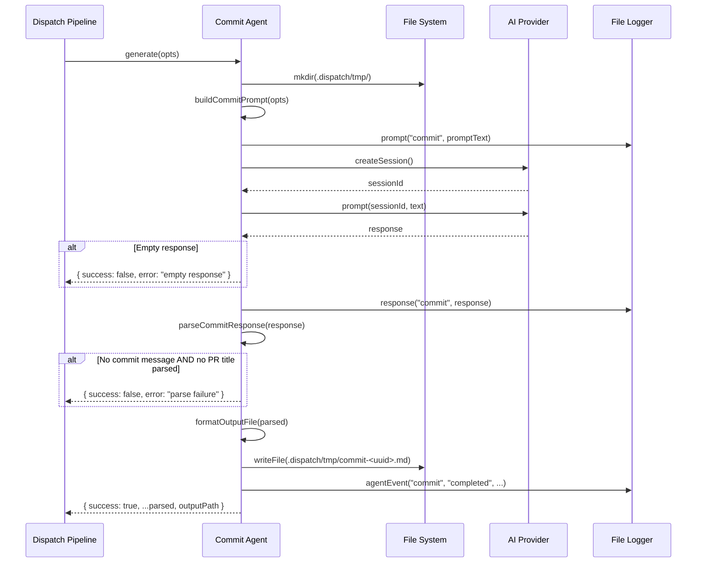

# Commit Agent

The commit agent (`src/agents/commit.ts`) analyzes a branch diff and issue
context via an AI provider to generate conventional-commit-compliant commit
messages, PR titles, and PR descriptions. It runs after all tasks for an issue
complete but before the pull request is created, writing its structured output
to a temporary markdown file.

## What it does

The commit agent receives a git diff, issue details, and task results. It:

1. Constructs a prompt that includes the [Conventional Commits](https://www.conventionalcommits.org/)
   specification, issue context, task summaries, and the branch diff.
2. Creates a fresh AI provider session and sends the prompt.
3. Parses the AI's structured response into three sections: commit message,
   PR title, and PR description.
4. Writes the parsed output to a temporary markdown file at
   `.dispatch/tmp/commit-<uuid>.md`.
5. Returns a `CommitResult` with the parsed fields and the temp file path.

## Why it exists

Without the commit agent, the dispatch pipeline would either use generic commit
messages (e.g., "dispatch: complete tasks for #42") or rely on the task executor
to produce commit messages — which would lack the full-branch context. The
commit agent solves this by:

- **Analyzing the complete branch diff**: It sees all changes across all tasks,
  not just individual task changes, producing a holistic commit message.
- **Following Conventional Commits**: The prompt explicitly instructs the AI to
  follow the [Conventional Commits v1.0.0](https://www.conventionalcommits.org/)
  specification with standard types (`feat`, `fix`, `docs`, `refactor`, `test`,
  `chore`, `style`, `perf`, `ci`).
- **Generating PR metadata**: The same AI call produces both the commit message
  and the PR title/description, ensuring consistency.

## Key source files

| File | Role |
|------|------|
| [`src/agents/commit.ts`](../../src/agents/commit.ts) | Boot function, prompt builder, response parser, output formatter |
| [`src/agents/interface.ts`](../../src/agents/interface.ts) | `Agent` base interface that `CommitAgent` extends |
| [`src/agents/index.ts`](../../src/agents/index.ts) | Registry entry for `bootCommit` |

## How it works

### Boot and provider requirement

The `boot()` function (`src/agents/commit.ts:65`) requires an
`AgentBootOptions` with a non-null `provider` field. If no provider is
supplied, `boot()` throws immediately:

```
Commit agent requires a provider instance in boot options
```

The booted agent retains a reference to the provider but does **not** own its
lifecycle. The provider is created and cleaned up by the orchestrator. The
commit agent's `cleanup()` method is a no-op — it has no owned resources.

### Generation flow



### Prompt construction

`buildCommitPrompt()` (`src/agents/commit.ts:152`) assembles the prompt from
four data sources:

1. **Conventional Commit guidelines**: The prompt references the
   [Conventional Commits specification](https://www.conventionalcommits.org/)
   and lists the standard types (`feat`, `fix`, `docs`, `refactor`, `test`,
   `chore`, `style`, `perf`, `ci`). Breaking changes are documented with the
   `!` suffix notation (e.g., `feat!: ...`).

2. **Issue context**: Issue number, title, description (truncated to 500
   characters), and labels are included. Sections are conditionally present —
   description is omitted if the issue body is empty, and labels are omitted if
   the array is empty.

3. **Task results**: Completed and failed tasks are listed separately. Failed
   tasks include their error messages. This gives the AI context about what
   was accomplished and what was not.

4. **Git diff**: The branch diff is included in a fenced code block. If the
   diff exceeds 50,000 characters, it is truncated with a
   `"... (diff truncated due to size)"` note.

The prompt concludes with a **Required Output Format** section that instructs
the AI to respond with exactly three sections using these headers:
`### COMMIT_MESSAGE`, `### PR_TITLE`, `### PR_DESCRIPTION`.

### Maximum diff size and token implications

The diff is hardcoded to a maximum of 50,000 characters
(`src/agents/commit.ts:202`). This limit exists to keep the prompt within
reasonable token budgets for AI providers.

| Provider | Typical context window | 50k chars ≈ tokens | Safe? |
|----------|----------------------|-------------------|-------|
| Copilot (GPT-4 class) | 128K tokens | ~12,500 tokens | Yes |
| OpenCode (Claude class) | 100K–200K tokens | ~12,500 tokens | Yes |

The 50,000-character limit is conservative for all currently supported models.
However, the full prompt includes additional content beyond the diff (issue
context, task results, guidelines), so the total prompt size is larger than
just the diff. For very large diffs near the limit combined with many task
results, the total could approach 60,000+ characters (~15,000 tokens), which
remains well within all supported model context windows.

### Response parsing

`parseCommitResponse()` (`src/agents/commit.ts:245`) uses three regex patterns
to extract sections from the AI's response:

| Section | Regex | Captures |
|---------|-------|----------|
| Commit message | `/###\s*COMMIT_MESSAGE\s*\n([\s\S]*?)(?=###\s*PR_TITLE\|$)/i` | Text between `### COMMIT_MESSAGE` and `### PR_TITLE` |
| PR title | `/###\s*PR_TITLE\s*\n([\s\S]*?)(?=###\s*PR_DESCRIPTION\|$)/i` | Text between `### PR_TITLE` and `### PR_DESCRIPTION` |
| PR description | `/###\s*PR_DESCRIPTION\s*\n([\s\S]*?)$/i` | All text after `### PR_DESCRIPTION` |

The regexes are case-insensitive and tolerate extra whitespace around the
headers. Each captured group is trimmed. Missing sections produce empty strings.

### What happens if the response doesn't match the expected format?

The agent handles malformed responses at two levels:

1. **Empty or whitespace-only response** (`src/agents/commit.ts:94-101`): If the
   provider returns null or a blank string, the agent returns
   `{ success: false, error: "Commit agent returned empty response" }`.

2. **Missing sections** (`src/agents/commit.ts:108-117`): After parsing, if
   **both** `commitMessage` and `prTitle` are empty (neither regex matched),
   the agent returns `{ success: false, error: "Failed to parse commit agent
   response: no commit message or PR title found" }`.

3. **Partial match**: If only one of the three sections is found (e.g., a commit
   message but no PR title), the agent returns `success: true` with the
   available fields and empty strings for the missing ones. This allows the
   pipeline to use whatever was successfully parsed.

### Does the pipeline validate Conventional Commits conformance?

No. The pipeline trusts the AI output. There is no post-generation validation
that the commit message actually conforms to the Conventional Commits
specification (e.g., checking that it starts with a valid type, uses imperative
mood, or correctly formats breaking changes). The prompt instructs the AI to
follow the spec, but conformance depends on the AI model's adherence to
instructions.

If strict validation is needed, a post-processing step could be added to check
the commit message against the Conventional Commits regex pattern:
`/^(feat|fix|docs|refactor|test|chore|style|perf|ci)(\(.+\))?!?:\s.+/`.

### Breaking change handling

The prompt instructs the AI to use the `!` suffix for breaking changes (e.g.,
`feat!: remove deprecated API`). The Conventional Commits specification also
supports a `BREAKING CHANGE:` footer, but the prompt's output format requests
only a single-line commit message, so the footer format is not used.

Downstream consumers (e.g., changelog generators) that parse conventional
commits should check for both the `!` marker and the `BREAKING CHANGE:` footer
to handle all cases.

## Temporary output files

### Where are they stored?

The commit agent writes output to `.dispatch/tmp/commit-<uuid>.md` within the
resolved working directory. The UUID is generated by `crypto.randomUUID()`
(`src/agents/commit.ts:83`), which uses the system's cryptographic random
number generator.

### File format

The output file is a markdown document with three sections:

```markdown
# Commit Agent Output

## Commit Message

<conventional commit message>

## PR Title

<PR title>

## PR Description

<PR description in markdown>
```

### Are temp files cleaned up?

The commit agent's `cleanup()` method is a no-op (`src/agents/commit.ts:142-144`).
The `.dispatch/tmp/` directory is **not** cleaned up by the commit agent.
Cleanup responsibility lies elsewhere:

- The **spec agent** (`src/agents/spec.ts`) has a `cleanup()` method that
  removes the entire `.dispatch/tmp/` directory, which would also remove commit
  agent temp files.
- If the spec agent's cleanup runs after the commit agent (which it does in the
  normal pipeline flow), commit agent files are cleaned up as a side effect.
- On pipeline crashes or signal kills, `.dispatch/tmp/` files may be left
  behind. They accumulate until manually deleted or until the spec agent's
  cleanup runs on a subsequent invocation.

### UUID uniqueness in concurrent scenarios

`crypto.randomUUID()` generates RFC 4122 v4 UUIDs with 122 bits of randomness.
The probability of collision is negligible even in highly concurrent worktree
scenarios. In CI/container environments, `randomUUID()` reads from
`/dev/urandom` (or equivalent), which does not block and has no entropy
concerns. Node.js >= 19 uses a kernel-level CSPRNG that is always seeded.

### What happens if `.dispatch/tmp` cannot be created?

If `mkdir()` fails (e.g., permission denied, read-only filesystem), the error
propagates to the `catch` block in `generate()`, which returns
`{ success: false, error: "<error message>" }`. The pipeline logs the error via
the file logger and continues with other tasks.

## Monitoring and troubleshooting

### How to monitor AI provider call latency

The commit agent logs the prompt size (`Commit prompt built (N chars)`) and
response size (`Commit agent response (N chars)`) at `log.debug` level, visible
with `--verbose`. For wall-clock timing, the calling pipeline records elapsed
time separately.

Token usage is not tracked at the agent level — it depends on the provider
backend. See [Provider Abstraction](../provider-system/overview.md)
for provider-specific monitoring.

### How to switch the underlying model

The commit agent uses whatever provider and model are configured at the
pipeline level. To change the model:

- **Per-invocation**: Use `--provider copilot --model claude-sonnet-4-5`
- **Persistently**: Run `dispatch config` and select the provider and model
- **Provider-level**: See [Configuration](../cli-orchestration/configuration.md)
  for the three-tier precedence rules

The commit agent does not have its own model configuration — it shares the
pipeline-wide provider instance.

### Debugging parse failures

If the commit agent returns `success: false` with a parse failure error:

1. Enable `--verbose` to see the response size in console output.
2. Check the file logger output for the full AI response text (logged via
   `fileLoggerStorage.getStore()?.response("commit", response)`).
3. Look for the `### COMMIT_MESSAGE` and `### PR_TITLE` headers in the
   response. Common issues:
   - The AI used different header levels (e.g., `## COMMIT_MESSAGE` instead
     of `###`).
   - The AI included conversational text before the headers.
   - The AI used different header names (e.g., `### Commit Message` instead
     of `### COMMIT_MESSAGE`).

## Interfaces

### `CommitGenerateOptions`

Input to `generate()`:

| Field | Type | Required | Description |
|-------|------|----------|-------------|
| `branchDiff` | `string` | Yes | Git diff of the branch relative to the default branch |
| `issue` | `IssueDetails` | Yes | Issue details for context (number, title, body, labels) |
| `taskResults` | `DispatchResult[]` | Yes | Results from task execution (success/failure per task) |
| `cwd` | `string` | Yes | Working directory |
| `worktreeRoot` | `string` | No | Worktree root directory for isolation, if operating in a worktree |

### `CommitResult`

Returned by `generate()`:

| Field | Type | Description |
|-------|------|-------------|
| `commitMessage` | `string` | The generated conventional commit message |
| `prTitle` | `string` | The generated PR title |
| `prDescription` | `string` | The generated PR description (markdown) |
| `success` | `boolean` | Whether generation succeeded |
| `error` | `string?` | Error message if generation failed |
| `outputPath` | `string?` | Path to the temp markdown file (present only on success) |

### `CommitAgent`

The booted agent interface (extends `Agent`):

| Member | Type | Description |
|--------|------|-------------|
| `name` | `string` | Always `"commit"` |
| `generate` | `(opts: CommitGenerateOptions) => Promise<CommitResult>` | Generate commit message, PR title, and PR description |
| `cleanup` | `() => Promise<void>` | No-op — provider lifecycle is managed externally |

## Integrations

### AI Provider System

- **Type**: AI/LLM service
- **Used in**: `src/agents/commit.ts:89-91` — calls `createSession()` and
  `prompt()` on the provider
- **Session model**: One session per `generate()` call. The session is used for
  a single prompt and then abandoned (cleaned up when the provider shuts down).
- See [Provider Abstraction](../provider-system/overview.md) for
  session isolation guarantees and cleanup behavior.

### Node.js `fs/promises`

- **Type**: Local I/O
- **Used in**: `src/agents/commit.ts:12` — `mkdir` and `writeFile`
- **Official docs**: [Node.js fs/promises API](https://nodejs.org/api/fs.html#promises-api)
- `mkdir(tmpDir, { recursive: true })` creates `.dispatch/tmp/` if it does not
  exist. The `recursive` option makes this idempotent.
- `writeFile(tmpPath, content, "utf-8")` writes the formatted output. Default
  file permissions apply (typically `0644` on Unix).

### Node.js `crypto`

- **Type**: Utility
- **Used in**: `src/agents/commit.ts:14` — `randomUUID()`
- **Official docs**: [Node.js crypto.randomUUID()](https://nodejs.org/api/crypto.html#cryptorandomuuidoptions)
- Generates RFC 4122 v4 UUIDs for temp filenames. Uses the system CSPRNG
  (`/dev/urandom` on Linux). No entropy concerns in CI/container environments.

### File Logger

- **Type**: Observability
- **Used in**: `src/agents/commit.ts:19,87,92,123,130`
- Logs prompts, responses, agent events, and errors through the
  `AsyncLocalStorage`-based file logger. See
  [File Logger](../shared-types/file-logger.md) for details on log location and
  correlation.

### Conventional Commits Specification

- **Type**: Standard/protocol
- **Official docs**: [conventionalcommits.org](https://www.conventionalcommits.org/)
- Referenced in the prompt at `src/agents/commit.ts:160`. The AI is instructed
  to follow the specification. The standard types used are: `feat`, `fix`,
  `docs`, `refactor`, `test`, `chore`, `style`, `perf`, `ci`.
- Breaking changes use the `!` suffix: `feat!: remove deprecated API`.
- The pipeline does **not** validate conformance — it trusts the AI output.

## Related documentation

- [Agent Framework Overview](./overview.md) — Registry, types, and boot
  lifecycle
- [Planning & Dispatch Pipeline](../planning-and-dispatch/overview.md) — The
  pipeline that drives the commit agent
- [Dispatcher](../planning-and-dispatch/dispatcher.md) — How `DispatchResult`
  objects are produced (consumed by the commit agent)
- [Datasource Overview](../datasource-system/overview.md) — The `IssueDetails`
  interface consumed by the commit agent
- [Datasource Helpers](../datasource-system/datasource-helpers.md) — Branch
  diff generation via `getBranchDiff()` and PR body assembly
- [Provider Abstraction](../provider-system/overview.md) — Provider
  session lifecycle and cleanup
- [Git Operations](../planning-and-dispatch/git.md) — How conventional commits
  are created after task completion
- [Orchestrator](../cli-orchestration/orchestrator.md) — Pipeline coordination
  that boots and drives the commit agent
- [Configuration](../cli-orchestration/configuration.md) — Provider and model
  selection that controls which AI backend the commit agent uses
- [Logger](../shared-types/logger.md) — Console logging facade
- [Cleanup Registry](../shared-types/cleanup.md) — Process-level cleanup that
  ensures provider shutdown on exit
- [Dispatch Pipeline](../cli-orchestration/dispatch-pipeline.md) — The execution
  engine that drives the commit agent through its generation flow
- [File Logger](../shared-types/file-logger.md) — Per-issue file logging
  used by the commit agent for prompt and response tracing
- [Commit Agent Tests](../testing/commit-agent-tests.md) — Unit tests for
  the commit agent boot, prompt construction, response parsing, and error
  handling
- [Timeout Utility](../shared-utilities/timeout.md) — `withTimeout()`
  wrapper used by the orchestrator when invoking the commit agent
