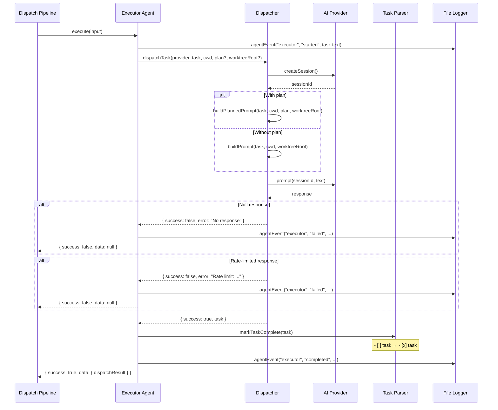

# Executor Agent

The executor agent (`src/agents/executor.ts`) executes a single task by
dispatching it to the AI provider and marking it complete on success. It
consumes a plan from the planner agent (or operates without a plan when
planning is disabled) and delegates the actual prompt construction and
session management to the dispatcher.

## What it does

The executor agent receives an `ExecuteInput` containing a task, working
directory, optional plan, and optional worktree root, then:

1. Logs the task start via the [file logger](../shared-types/file-logger.md).
2. Calls `dispatchTask()` from `src/dispatcher.ts`, which creates a fresh
   AI provider session, builds the appropriate prompt (planned or generic),
   and sends it to the AI.
3. On success, calls `markTaskComplete()` from `src/parser.ts` to check
   off the `- [ ]` checkbox in the source markdown file (changing it to
   `- [x]`) — see [Task Parsing](../task-parsing/overview.md).
4. Returns an [`AgentResult<ExecutorData>`](../planning-and-dispatch/agent-types.md) with the dispatch result.

## Why it exists

The executor agent is the thinnest agent in the pipeline. Its role is to
provide a uniform [`Agent` interface](./overview.md) around the lower-level `dispatchTask()`
function, adding:

- **`AgentResult<T>` return type**: Wraps the raw `DispatchResult` in the
  standard agent result format used by the orchestrator.
- **Task completion marking**: Automatically marks the task as complete in
  the source file when the dispatch succeeds.
- **Structured logging**: Logs agent lifecycle events (started, completed,
  failed) through the file logger.
- **Error normalization**: Catches all exceptions and returns them as
  structured failure results.

## Key source files

| File | Role |
|------|------|
| [`src/agents/executor.ts`](../../src/agents/executor.ts) | Boot function, execute method, task completion |
| [`src/dispatcher.ts`](../../src/dispatcher.ts) | Session creation, prompt construction, rate-limit detection |
| [`src/parser.ts`](../../src/parser.ts) | `markTaskComplete()` — checkbox toggling |
| [`src/agents/interface.ts`](../../src/agents/interface.ts) | `Agent` base interface that `ExecutorAgent` extends |
| [`src/agents/index.ts`](../../src/agents/index.ts) | Registry entry for `bootExecutor` |

## How it works

### Boot and provider requirement

The `boot()` function (`src/agents/executor.ts:53`) requires `opts.provider`
to be non-null. If absent, it throws:

```
Executor agent requires a provider instance in boot options
```

Unlike the planner, the executor does not retain the `cwd` from boot options.
The working directory is provided per-invocation via `ExecuteInput.cwd`.

### Execution flow



### Planned vs. unplanned execution

The `plan` field in `ExecuteInput` determines the prompt path:

| `plan` value | Prompt builder | AI behavior |
|-------------|---------------|-------------|
| Non-null string | `buildPlannedPrompt()` | Follows the plan precisely; does not explore the codebase |
| `null` | `buildPrompt()` | Explores the codebase on its own; generic task prompt |

The executor does not generate or validate plans. It receives the plan as a
string (or `null` if `--no-plan`) from the orchestrator and passes it directly
to `dispatchTask()`. A non-null plan triggers the
[planned prompt path](../planning-and-dispatch/dispatcher.md#planned-prompt-buildplannedprompt)
in the dispatcher; a null plan triggers the
[simple prompt path](../planning-and-dispatch/dispatcher.md#simple-prompt-buildprompt).

See the [overview](./overview.md#the-planner-bypass---no-plan) for the
design rationale of the `--no-plan` bypass.

### Worktree isolation passthrough

The optional `worktreeRoot` field in `ExecuteInput` is forwarded directly to
`dispatchTask()` (`src/agents/executor.ts:85`). The executor does not use this
value itself — it is consumed by the dispatcher's
[`buildWorktreeIsolation()`](../planning-and-dispatch/dispatcher.md#worktree-isolation)
function to add filesystem confinement instructions to the prompt.

### Task completion marking

When `dispatchTask()` returns `success: true`, the executor calls
`markTaskComplete(task)` (`src/parser.ts`), which:

1. Reads the source markdown file.
2. Finds the task's line (by 1-based line number).
3. Replaces `- [ ]` with `- [x]` on that line.
4. Writes the file back.

This provides a persistent record of task completion in the spec file. If
the pipeline crashes after execution but before PR creation, the checked-off
tasks indicate which work was completed.

### Rate-limit detection

The dispatcher (`src/dispatcher.ts:19-24`) checks the AI response text
against four regex patterns that detect rate-limit language:

| Pattern | Example match |
|---------|--------------|
| `/you[''\u2019]?ve hit your (rate )?limit/i` | "You've hit your rate limit" |
| `/rate limit exceeded/i` | "Rate limit exceeded" |
| `/too many requests/i` | "Too many requests" |
| `/quota exceeded/i` | "Quota exceeded" |

If any pattern matches, the response is treated as a failure rather than
success. This prevents the executor from marking a task "complete" when
the AI responded with a rate-limit message instead of actual work.

Note: This is text-level detection on the AI response, separate from the
HTTP-level throttle detection in `providers/errors.ts` used by the provider
pool.

### Commit handling within tasks

The dispatcher checks whether the task text contains the word "commit"
(`src/dispatcher.ts:136-138`). If so, the prompt instructs the executor
to stage and create a conventional commit. If not, the prompt explicitly
says "Do NOT commit changes — the orchestrator handles commits."

This means commit behavior is embedded in the task description by the spec
agent, not controlled by the executor. The spec agent's prompt instructs
the AI to include commit instructions at logical boundaries within task
descriptions.

### Error handling

All errors are caught and returned as structured results — the executor never
throws. Two error paths exist:

1. **Dispatch failure**: If `dispatchTask()` returns `{ success: false }`, the
   executor skips `markTaskComplete()` and returns the error. The task remains
   unchecked in the source file.

2. **Unexpected exception**: If `dispatchTask()` or `markTaskComplete()` throws,
   the catch block uses `log.extractMessage(err)` to extract a message and
   returns a failed result. This covers scenarios like filesystem
   errors during `markTaskComplete()` (e.g., `ENOENT`, `EACCES`).

In both cases, the orchestrator receives a structured result and updates the
[TUI](../cli-orchestration/tui.md) accordingly.

See the [dispatch pipeline tests](../testing/dispatch-pipeline-tests.md)
and [planner & executor tests](../testing/planner-executor-tests.md) for
test coverage of the executor's error paths and retry behavior.

### Timing and retries

The executor records wall-clock elapsed time (`Date.now()` at start and end)
in the `durationMs` field of the result. This includes both the dispatch
time (AI provider round-trip) and the `markTaskComplete()` file I/O time.
The orchestrator uses this for TUI display.

The orchestrator wraps executor calls in [`withRetry()`](../shared-utilities/retry.md). By default, `--retries`
is `3`, so executor tasks get up to 4 total attempts unless the user overrides
that flag.

## Interfaces

### `ExecuteInput`

Input to `execute()`:

| Field | Type | Required | Description |
|-------|------|----------|-------------|
| `task` | `Task` | Yes | The task to execute (from `parseTaskFile()`) |
| `cwd` | `string` | Yes | Working directory |
| `plan` | `string \| null` | Yes | Planner output, or `null` if planning was skipped |
| `worktreeRoot` | `string` | No | Worktree root for directory isolation |

### `ExecutorData`

The `AgentResult<ExecutorData>` payload:

| Field | Type | Description |
|-------|------|-------------|
| `dispatchResult` | `DispatchResult` | The underlying dispatch result with `task`, `success`, and optional `error` |

### `ExecutorAgent`

The booted agent interface (extends `Agent`):

| Member | Type | Description |
|--------|------|-------------|
| `name` | `string` | Always `"executor"` |
| `execute` | `(input: ExecuteInput) => Promise<AgentResult<ExecutorData>>` | Execute a single task |
| `cleanup` | `() => Promise<void>` | No-op — provider lifecycle is managed externally |

## The executor in the agent registry

The executor is registered in `src/agents/index.ts:12` alongside the other
agents. Although `src/agents/executor.ts` is not in the primary agent-system
file group (it is shared with the dispatch-pipeline group), it follows the
identical boot-function-returns-closure pattern as the other three agents.
It is imported as `boot as bootExecutor` and registered under the `"executor"`
key in the `AGENTS` map.

## Integrations

### Dispatcher

- **Type**: Internal module
- **Used in**: `src/agents/executor.ts:14` (imports `dispatchTask`),
  `src/agents/executor.ts:71` (calls `dispatchTask()`)
- The dispatcher handles session creation, prompt construction (planned vs.
  generic), rate-limit detection, and response processing. The executor
  delegates all prompt-level concerns to it.
- See [Dispatcher](../planning-and-dispatch/dispatcher.md) for details.

### Task Parser

- **Type**: Internal module
- **Used in**: `src/agents/executor.ts:12-13` (imports `Task` and
  `markTaskComplete`)
- `markTaskComplete()` writes the `[x]` checkbox back to the source file.
- See [Task Parsing](../task-parsing/overview.md) for details.

### AI Provider System

- **Type**: AI/LLM service abstraction
- **Used in**: Indirectly via `dispatchTask()`, which calls
  `provider.createSession()` and `provider.prompt()`
- The executor passes the provider instance to `dispatchTask()` without
  calling provider methods directly.

### File Logger

- **Type**: Observability
- **Used in**: `src/agents/executor.ts:16,68,75,79,83`
- Logs agent lifecycle events (started, completed, failed) and errors via the
  same [`AsyncLocalStorage<FileLogger>`](../shared-types/file-logger.md)
  mechanism used by the planner.

| Method | When | Content |
|--------|------|---------|
| `agentEvent("executor", "started", ...)` | Before dispatch | Task text |
| `agentEvent("executor", "completed", ...)` | On success | Elapsed time in ms |
| `agentEvent("executor", "failed", ...)` | On dispatch failure | Error message |
| `error(...)` | On exception | Error message with stack trace |

## Monitoring and troubleshooting

### How to identify which tasks failed

The executor logs each task's outcome via the file logger:

- `agentEvent("executor", "started", task.text)` — task dispatch began
- `agentEvent("executor", "completed", "Nms")` — task succeeded
- `agentEvent("executor", "failed", errorMessage)` — task failed

Search `.dispatch/logs/issue-<id>.log` for `[AGENT] [executor]` entries.

### Common failure scenarios

| Symptom | Likely cause | Resolution |
|---------|-------------|------------|
| `"No response from agent"` | Provider returned null | Check provider connectivity; the AI session may have crashed |
| `"Rate limit: ..."` | AI response was a rate-limit message | Wait and retry; consider switching providers or reducing concurrency |
| Task not marked complete despite success log | `markTaskComplete()` failed to write the file | Check file permissions on the spec file |
| `"Executor agent requires a provider instance"` | `boot()` called without a provider | Verify orchestrator is passing the provider in `AgentBootOptions` |

## Related documentation

- [Agent Framework Overview](./overview.md) — Registry, types, and boot
  lifecycle
- [Pipeline Flow](./pipeline-flow.md) — How the executor fits between
  planner and commit
- [Planner Agent](./planner-agent.md) — The agent that produces plans
  consumed by the executor
- [Commit Agent](./commit-agent.md) — The agent that runs after all
  executor tasks complete
- [Dispatcher](../planning-and-dispatch/dispatcher.md) — Session isolation
  and prompt construction
- [Agent Result Types](../planning-and-dispatch/agent-types.md) — The
  `AgentResult<ExecutorData>` type returned by this agent
- [Task Parsing](../task-parsing/overview.md) — Task extraction and
  completion marking
- [Retry Utility](../shared-utilities/retry.md) — The `withRetry()` wrapper
  used by the orchestrator for executor retries
- [Provider Abstraction](../provider-system/overview.md) — Provider
  session lifecycle
- [Planner & Executor Tests](../testing/planner-executor-tests.md) — Unit
  tests covering executor behavior
- [Dispatch Pipeline Tests](../testing/dispatch-pipeline-tests.md) — Integration
  tests for the pipeline that exercises the executor
