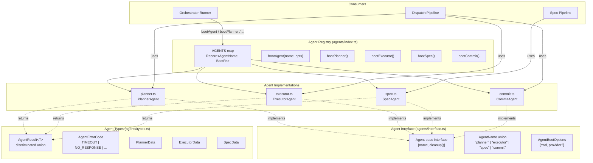
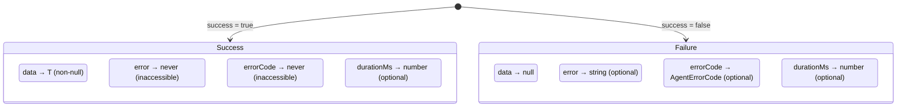

# Agent Framework

The agent framework provides the foundational type system, agent registry, and
boot lifecycle for all AI-driven roles in the Dispatch pipeline. It defines the
`AgentResult<T>` discriminated union that standardizes success/failure handling,
the `AgentErrorCode` classification that drives retry strategies, and the central
`AGENTS` registry that maps agent names to boot functions.

## What it does

The agent framework:

1. **Defines a generic result type** (`AgentResult<T>`) that all agents return,
   enforcing compile-time safety so callers cannot access `data` on failure or
   `error` on success without the TypeScript compiler flagging it.
2. **Classifies errors** via `AgentErrorCode` — machine-readable codes like
   `TIMEOUT`, `PROVIDER_ERROR`, and `NO_RESPONSE` that orchestration code uses
   for retry decisions and logging.
3. **Maintains a central registry** (`AGENTS` map) that associates each
   `AgentName` with its `boot()` function, providing both a generic
   `bootAgent(name, opts)` entry point and type-safe per-role boot functions
   (`bootPlanner`, `bootExecutor`, `bootSpec`, `bootCommit`).
4. **Re-exports all public types** so that consumers import from
   `agents/index.ts` rather than reaching into individual agent files.

## Why it exists

Without the agent framework, each agent would define its own result shapes,
error conventions, and registration patterns. The framework provides:

- **Uniform error handling**: Every agent call site uses the same `if
  (result.success)` pattern. The discriminated union makes it impossible to
  forget error checking — TypeScript narrows `data` to `T` or `null`
  automatically.
- **Centralized registration**: Adding a new agent requires updating one file
  (`agents/index.ts`) and one type (`AgentName`), not modifying every consumer.
- **Type-safe narrowing**: The `never` types on mutually exclusive fields
  (`error?: never` on success, `data: null` on failure) ensure that property
  access errors are caught at compile time, not at runtime.

## Key source files

| File | Role |
|------|------|
| [`src/agents/types.ts`](../../src/agents/types.ts) | `AgentResult<T>`, `AgentErrorCode`, and concrete data types (`PlannerData`, `ExecutorData`, `SpecData`) |
| [`src/agents/index.ts`](../../src/agents/index.ts) | Agent registry, `bootAgent()`, type-safe boot function exports, and re-exports |
| [`src/agents/interface.ts`](../../src/agents/interface.ts) | `Agent` base interface, `AgentName` union, `AgentBootOptions` |
| [`src/agents/commit.ts`](../../src/agents/commit.ts) | [Commit agent](./commit-agent.md) implementation |
| [`src/agents/planner.ts`](../../src/agents/planner.ts) | [Planner agent](../planning-and-dispatch/planner.md) implementation |
| [`src/agents/executor.ts`](../../src/agents/executor.ts) | [Executor agent](../planning-and-dispatch/executor.md) implementation |
| [`src/agents/spec.ts`](../../src/agents/spec.ts) | [Spec agent](../spec-generation/spec-agent.md) implementation |

## Architecture

The agent framework sits between the orchestrator (which boots and drives
agents) and the provider layer (which agents use for AI sessions):



## The `AgentResult<T>` discriminated union

`AgentResult<T>` is the canonical return type for all agent operations. It uses
TypeScript's discriminated union pattern with the `success` field as the
discriminant:



### Why a discriminated union instead of a simpler success/error pair

The design uses `never` types on mutually exclusive fields to enforce
compile-time safety. This means:

- **On `success: true`**: `data` is `T` (guaranteed non-null), and `error`
  and `errorCode` are typed as `never` — accessing them produces a TypeScript
  error.
- **On `success: false`**: `data` is `null`, and `error`/`errorCode` are
  available with their expected types.

This eliminates the need for non-null assertions (`!`) at call sites. When you
check `if (result.success)`, TypeScript automatically narrows the type so that
`result.data` is `T` in the truthy branch and `null` in the falsy branch.

A simpler `{ success: boolean; data: T | null; error?: string }` pattern would
require callers to either use `result.data!` (unsafe) or add redundant null
checks even after verifying `success`. The discriminated union makes the correct
pattern the natural one.

### Concrete data types

Each agent role defines its own payload type parameterized into
`AgentResult<T>`:

| Type | Agent | Fields | Description |
|------|-------|--------|-------------|
| `PlannerData` | Planner | `prompt: string` | The execution plan text produced for the executor |
| `ExecutorData` | Executor | `dispatchResult: DispatchResult` | The underlying dispatch result from the AI provider |
| `SpecData` | Spec | `content: string`, `valid: boolean`, `validationReason?: string` | The generated spec content with validation status |

The commit agent uses its own `CommitResult` interface rather than
`AgentResult<T>` because it predates the generic type and has a different
structure. See [Commit Agent](./commit-agent.md) for details.

## The `AgentErrorCode` classification

`AgentErrorCode` provides machine-readable error classifications that
orchestration code uses for retry strategies and user-facing messages:

| Code | Meaning | Typical trigger |
|------|---------|-----------------|
| `TIMEOUT` | The agent exceeded the configured time limit | `withTimeout()` wrapper in the orchestrator |
| `NO_RESPONSE` | The provider returned null or empty | Provider `prompt()` returned `null` |
| `VALIDATION_FAILED` | The agent's output failed structural validation | Spec validation (missing H1, no Tasks section) |
| `PROVIDER_ERROR` | The underlying provider threw an error | SDK connection failure, rate limiting |
| `UNKNOWN` | Catch-all for unexpected errors | Unhandled exceptions in agent code |

### How error codes influence retry behavior

The `AgentErrorCode` values are defined for use by orchestration code to decide
retry strategies. The orchestrator runner (`src/orchestrator/runner.ts`) and
dispatch pipeline (`src/orchestrator/dispatch-pipeline.ts`) implement retry
logic based on these codes:

- **`TIMEOUT`**: Retried up to `--plan-retries` times (default: value of
  `--retries`, which defaults to 3). The `withTimeout()` wrapper throws a `TimeoutError` that is
  caught and classified as `TIMEOUT`.
- **`PROVIDER_ERROR`**: May be retried depending on the pipeline — the spec
  pipeline uses `withRetry()` with 3 retries by default.
- **`NO_RESPONSE`**: Treated as a failure. The task is marked failed in the
  TUI and the pipeline continues with the next task.
- **`VALIDATION_FAILED`**: In the spec pipeline, this produces `valid: false`
  but `success: true` — the spec is still written. In other contexts, the task
  would be marked failed.
- **`UNKNOWN`**: Not retried — indicates a programming error or unexpected
  condition.

Note: As of the current codebase, neither the planner nor executor agents
explicitly set `errorCode` on their failure results. The error codes are
primarily used by the spec agent and are available for future use by other
agents.

## The agent registry

The registry in `src/agents/index.ts` uses a static
`Record<AgentName, BootFn>` map:

| Agent name | Boot function | Module | Provider required? |
|------------|--------------|--------|-------------------|
| `planner` | `bootPlanner` | `src/agents/planner.ts` | Yes |
| `executor` | `bootExecutor` | `src/agents/executor.ts` | Yes |
| `spec` | `bootSpec` | `src/agents/spec.ts` | Yes |
| `commit` | `bootCommit` | `src/agents/commit.ts` | Yes |

### `bootAgent(name, opts)`

The generic boot function looks up the name in the `AGENTS` map and calls the
corresponding boot function. It throws if the name is not registered:

```
Unknown agent "<name>". Available: planner, executor, spec, commit
```

### Type-safe boot functions

For compile-time safety, the registry also exports role-specific boot functions
(`bootPlanner`, `bootExecutor`, `bootSpec`, `bootCommit`) that return the
correctly typed agent interface (e.g., `PlannerAgent` instead of the base
`Agent`). Prefer these over `bootAgent()` when the role is known at compile
time.

### `AGENT_NAMES`

An array of all registered agent names (`["planner", "executor", "spec",
"commit"]`), useful for CLI help text and validation.

## The `Agent` base interface

Every agent implements the base `Agent` interface from
`src/agents/interface.ts`:

| Member | Type | Description |
|--------|------|-------------|
| `name` | `string` (readonly) | Human-readable identifier (e.g., `"planner"`, `"commit"`) |
| `cleanup()` | `Promise<void>` | Release agent-owned resources. Safe to call multiple times. |

Role-specific agent interfaces extend this with their own methods:

| Interface | Extends `Agent` with | Source |
|-----------|---------------------|--------|
| `PlannerAgent` | `plan(input): Promise<AgentResult<PlannerData>>` | `src/agents/planner.ts` |
| `ExecutorAgent` | `execute(input): Promise<ExecuteResult>` | `src/agents/executor.ts` |
| `SpecAgent` | `generate(item, outputPath, cwd): Promise<SpecResult>` | `src/agents/spec.ts` |
| `CommitAgent` | `generate(opts): Promise<CommitResult>` | `src/agents/commit.ts` |

### `AgentBootOptions`

Options passed to every agent's `boot()` function:

| Field | Type | Required | Description |
|-------|------|----------|-------------|
| `cwd` | `string` | Yes | Working directory |
| `provider` | `ProviderInstance` | No | The AI provider instance. Agents that require a provider validate its presence at boot time and throw if absent. |

## Provider session lifecycle

Agents interact with the AI provider through the
[`ProviderInstance`](../shared-types/provider.md) interface, which exposes
`createSession()`, `prompt()`, and `cleanup()`.

### Who owns the provider?

The **orchestrator** owns the provider lifecycle. It boots the provider, passes
it to agents via `AgentBootOptions`, and calls `cleanup()` when the pipeline
completes. Agents create sessions on the provider but do not own or close it.

### Session cleanup

The `ProviderInstance` interface has no `closeSession()` method — only a
top-level `cleanup()`. This means individual sessions are not explicitly closed.
Instead, they are implicitly cleaned up when the provider itself is torn down
(either by the orchestrator on the success path, or by the
[cleanup registry](../shared-types/cleanup.md) on signal exit).

For the commit agent specifically, the provider session created at
`src/agents/commit.ts:89` is used for a single `prompt()` call and then
abandoned. The session state remains on the provider server until `cleanup()`
is called.

### What happens if the provider is unreachable?

If the provider is unreachable or rate-limited during an agent call:

1. `createSession()` or `prompt()` throws an error.
2. The agent catches the error and returns a failure result.
3. The orchestrator records the failure and continues with other tasks.
4. There is no automatic retry at the agent level — retry logic is implemented
   at the orchestrator level using `withRetry()` or `withTimeout()`.

## File-level logging

All agents integrate with two logging systems:

1. **[Console logger](../shared-types/logger.md)** (`src/helpers/logger.ts`): The `log` utility provides
   `log.debug()` for verbose output visible with `--verbose`. Used for
   operational messages like prompt sizes and response lengths.

2. **[File logger](../shared-types/file-logger.md)** (`src/helpers/file-logger.ts`): An
   `AsyncLocalStorage<FileLogger>` instance that provides structured logging
   to disk. Agents call methods like:
   - `fileLoggerStorage.getStore()?.prompt(agentName, promptText)` — logs the
     full prompt sent to the provider
   - `fileLoggerStorage.getStore()?.response(agentName, responseText)` — logs
     the full response received
   - `fileLoggerStorage.getStore()?.agentEvent(name, event, detail)` — logs
     structured agent lifecycle events
   - `fileLoggerStorage.getStore()?.error(message)` — logs error details

### Where do logs end up?

File logger outputs are written to disk in the `.dispatch/` directory structure.
The `AsyncLocalStorage` context is set up by the orchestrator pipeline before
agent calls, so each pipeline run has its own log context. Log files contain
the full prompt and response text, enabling post-hoc debugging and replay of
agent interactions.

### Correlating logs with pipeline runs

Each pipeline run creates a unique `AsyncLocalStorage` context. Within that
context, all agent events are written to the same log stream. To correlate
commit-agent logs with a specific pipeline run, look for the run's log file in
`.dispatch/` and search for `agentEvent("commit", ...)` entries.

## How to add a new agent

Follow these four steps (documented in `src/agents/interface.ts` and
`src/agents/index.ts`):

1. **Create the implementation file**: `src/agents/<name>.ts`. Export an async
   `boot(opts: AgentBootOptions)` function that returns an object satisfying
   the `Agent` interface (with `name` and `cleanup()` at minimum, plus any
   role-specific methods).

2. **Define the result type** (optional): If the agent returns structured data,
   add a concrete data type to `src/agents/types.ts` and use
   `AgentResult<YourData>` as the return type.

3. **Register in the `AGENTS` map**: In `src/agents/index.ts`, import the boot
   function and add it to the `AGENTS` record:
   ```typescript
   import { boot as bootMyAgent, type MyAgent } from "./my-agent.js";
   const AGENTS: Record<AgentName, BootFn> = {
     // ... existing agents ...
     myAgent: bootMyAgent,
   };
   ```

4. **Extend the `AgentName` union**: In `src/agents/interface.ts`, add the new
   name to the union type:
   ```typescript
   export type AgentName = "planner" | "executor" | "spec" | "commit" | "myAgent";
   ```

TypeScript's exhaustiveness checking ensures that all `switch` statements and
`Record<AgentName, ...>` maps are updated when the union changes.

## Component index

- [Commit Agent](./commit-agent.md) — AI-driven conventional commit message,
  PR title, and PR description generation
- [Planner Agent](../planning-and-dispatch/planner.md) — Read-only codebase
  exploration to produce execution plans
- [Executor Agent](../planning-and-dispatch/executor.md) — Task dispatch +
  completion marking
- [Spec Agent](../spec-generation/spec-agent.md) — Codebase exploration and
  structured spec generation

## Related documentation

- [Architecture Overview](../architecture.md) — System-wide design showing
  the agent layer in context
- [Provider Abstraction](../provider-system/overview.md) — The
  `ProviderInstance` interface that agents consume
- [Provider Interface Types](../shared-types/provider.md) — `ProviderName`,
  `ProviderBootOptions`, and `ProviderInstance` type definitions
- [Planning & Dispatch Pipeline](../planning-and-dispatch/overview.md) —
  How the planner and executor agents are driven by the orchestrator
- [Spec Generation](../spec-generation/overview.md) — How the spec agent
  is driven by the spec pipeline
- [Orchestrator](../cli-orchestration/orchestrator.md) — The pipeline that
  boots agents and coordinates their execution
- [Cleanup Registry](../shared-types/cleanup.md) — Process-level cleanup
  that ensures provider resources are released
- [Timeout Utility](../shared-utilities/timeout.md) — `withTimeout()`
  wrapper that produces `TIMEOUT` error codes
- [Dispatcher](../planning-and-dispatch/dispatcher.md) — Session isolation
  and prompt construction consumed by executor and commit agents
- [Logger](../shared-types/logger.md) — Console logging used across agents
- [Datasource Helpers](../datasource-system/datasource-helpers.md) — How
  `DispatchResult` from the executor drives issue lifecycle operations
- [Testing Overview](../testing/overview.md) — Project-wide test suite
  including planner, executor, and provider test coverage
- [Fix-Tests Pipeline](../cli-orchestration/fix-tests-pipeline.md) — An
  alternative pipeline that boots providers and dispatches AI agents for
  test repair
