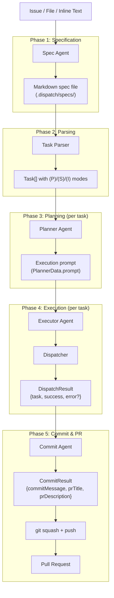
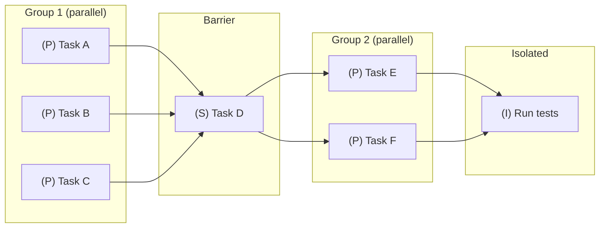
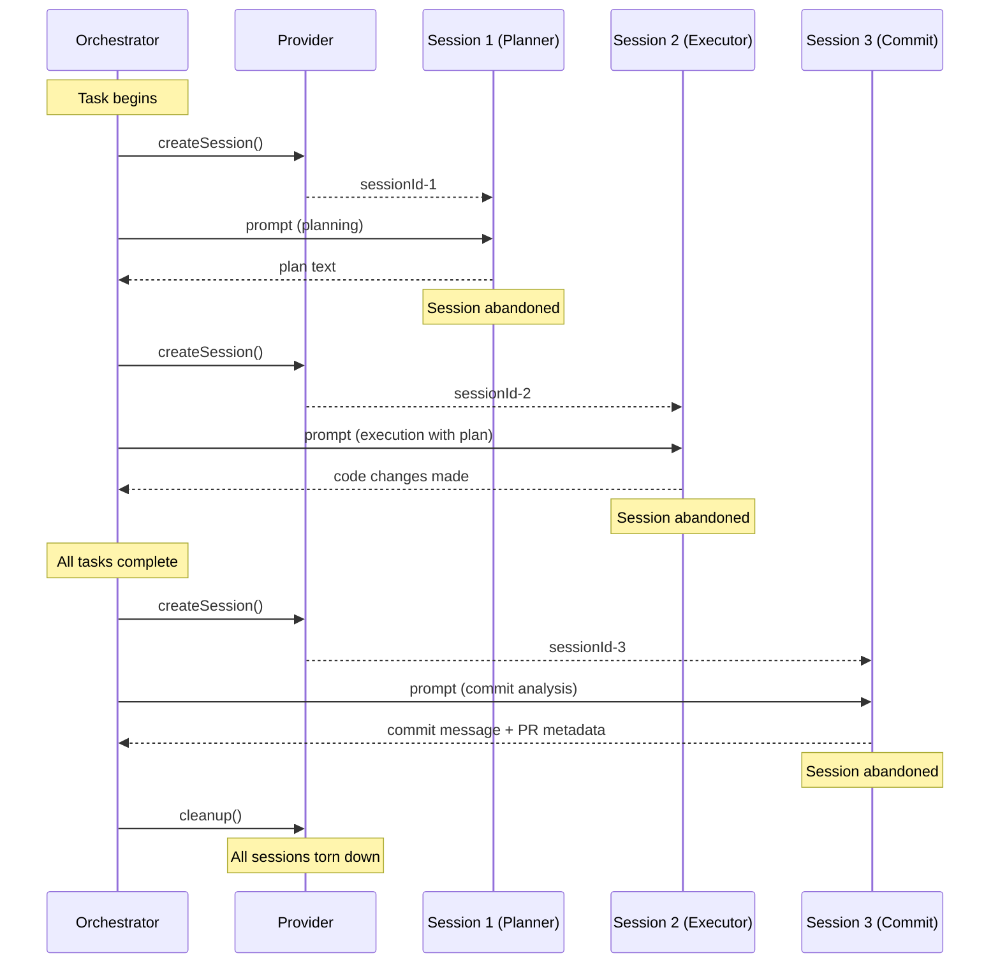

# Agent Pipeline Flow

This page describes the data flow through the four-agent pipeline that
transforms an issue or file input into completed code changes with a pull
request. Understanding this flow is essential for debugging pipeline failures
and for knowing where each agent's output feeds into the next stage.

## Pipeline overview

## Phase-by-phase data flow

### Phase 1: Specification (spec agent)

**Input**: `IssueDetails`, file content, or inline text
**Output**: A markdown spec file with structured sections and tagged tasks
**Agent**: [Spec Agent](./spec-agent.md)

The spec agent explores the codebase and writes a spec file containing:

- Context, motivation (Why), and approach sections
- Integration points and references
- A `## Tasks` section with `- [ ]` checklist items, each tagged `(P)`,
  `(S)`, or `(I)`

The spec is written to the output path (typically `.dispatch/specs/`),
post-processed to strip preamble/postamble, and validated for structural
correctness.

### Phase 2: Parsing (task parser)

**Input**: The spec markdown file
**Output**: `Task[]` array with mode, text, line number, and file path
**Module**: `src/parser.ts`

The parser extracts all unchecked `- [ ]` tasks from the spec file. Each
task's `(P)`/`(S)`/`(I)` prefix is parsed into a `mode` field and stripped
from the task text. The `groupTasksByMode()` function partitions tasks into
execution groups:

- Consecutive `(P)` tasks form a parallel group
- `(S)` tasks act as barriers between groups
- `(I)` tasks run in complete isolation

### Phase 3: Planning (planner agent, per task)

**Input**: A single `Task` + optional file context + working directory
**Output**: `PlannerData.prompt` — a detailed execution prompt
**Agent**: [Planner Agent](./planner-agent.md)

For each task, the planner:

1. Creates a fresh AI session
2. Sends a prompt with the task description and filtered file context
3. Instructs the AI to explore the codebase (read-only) and produce
   step-by-step implementation instructions
4. Returns the plan as a string that will be passed verbatim to the executor

**Bypass**: When `--no-plan` is set, this phase is skipped entirely. The
executor receives `plan: null` and builds a generic prompt instead.

### Phase 4: Execution (executor agent, per task)

**Input**: `ExecuteInput` with task, cwd, plan, and optional worktree root
**Output**: `ExecutorData.dispatchResult` — success/failure per task
**Agent**: [Executor Agent](./executor-agent.md)

For each task, the executor:

1. Calls `dispatchTask()` which creates a fresh AI session
2. Sends either the planned prompt (with plan) or a generic prompt (without)
3. The AI makes the actual code changes
4. On success, marks the task as complete (`- [x]`) in the spec file
5. Returns the dispatch result

Tasks are scheduled according to their execution mode:

### Phase 5: Commit and PR (commit agent)

**Input**: Branch diff, issue details, and all task results
**Output**: `CommitResult` with commit message, PR title, and PR description
**Agent**: [Commit Agent](./commit-agent.md)

After all tasks complete, the commit agent:

1. Receives the full branch diff (truncated to 50,000 chars if needed)
2. Analyzes all task results (completed and failed)
3. Generates a conventional-commit-compliant commit message
4. Generates a PR title and description
5. The orchestrator squashes commits and creates the pull request

## Provider session isolation

Each agent creates a fresh AI provider session for every invocation. This
means a typical task goes through **three separate AI sessions**:

Sessions are never explicitly closed. They are abandoned after use and
cleaned up when the provider's `cleanup()` method is called by the
orchestrator (or by the cleanup registry on process exit).

The rationale for fresh sessions is documented in
[the overview](./overview.md#why-each-agent-creates-a-fresh-session-per-invocation).

## Error propagation

Errors at each phase are handled independently:

| Phase | Error handling | Recovery |
|-------|---------------|----------|
| Spec | Returns `AgentResult<SpecData>` with `success: false` | Spec pipeline may retry |
| Planning | Returns `AgentResult<PlannerData>` with `success: false` | Orchestrator retries up to `maxPlanAttempts` |
| Execution | Returns `AgentResult<ExecutorData>` with `success: false` | Task enters pause/recovery flow (interactive) or is marked failed |
| Commit | Returns `CommitResult` with `success: false` | Pipeline uses fallback generic commit message |

The `AgentErrorCode` classification (see [overview](./overview.md#the-agenterrorcode-classification))
provides machine-readable codes that the orchestrator uses for retry
decisions.

## Cross-group data contracts

The following types flow between agents and external modules:

| Type | Defined in | Produced by | Consumed by |
|------|-----------|-------------|-------------|
| `IssueDetails` | `datasources/interface.ts` | Datasource | Spec agent, Commit agent |
| `SpecData` | `agents/types.ts` | Spec agent | Spec pipeline |
| `Task` | `parser.ts` | Task parser | Planner agent, Executor agent |
| `PlannerData` | `agents/types.ts` | Planner agent | Executor agent (via orchestrator) |
| `DispatchResult` | `dispatcher.ts` | Dispatcher | Executor agent, Commit agent |
| `ExecutorData` | `agents/types.ts` | Executor agent | Orchestrator |
| `CommitResult` | `agents/commit.ts` | Commit agent | Orchestrator |

## Related documentation

- [Agent Framework Overview](./overview.md) — Registry, types, and boot
  lifecycle
- [Spec Agent](./spec-agent.md) — Phase 1 details
- [Planner Agent](./planner-agent.md) — Phase 3 details
- [Executor Agent](./executor-agent.md) — Phase 4 details
- [Commit Agent](./commit-agent.md) — Phase 5 details
- [Task Parsing](../task-parsing/overview.md) — Phase 2 details
- [Dispatcher](../planning-and-dispatch/dispatcher.md) — Session isolation
  in the execution phase
- [Orchestrator](../cli-orchestration/orchestrator.md) — The pipeline that
  coordinates all phases
- [Provider Abstraction](../provider-system/overview.md) — Session lifecycle
  and pool failover
