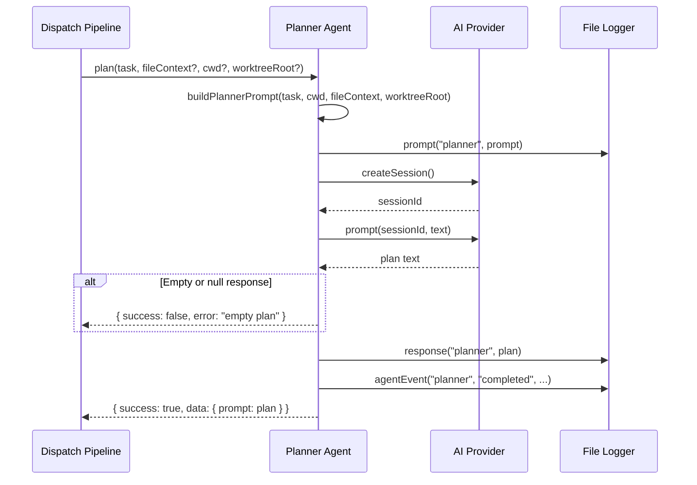

# Planner Agent

The planner agent (`src/agents/planner.ts`) explores the codebase in a
read-only session and produces a detailed execution prompt that the executor
agent follows to implement changes. It operates on a single task from a parsed
spec file, enriched with optional file context and worktree isolation
constraints.

## What it does

The planner agent receives a `Task` (extracted from a spec file by the
parser) and:

1. Creates a fresh AI provider session.
2. Constructs a prompt that includes the task description, working directory,
   optional file context (non-task prose from the spec), and optional worktree
   isolation instructions.
3. Sends the prompt to the AI provider, which explores the codebase
   (reads files, searches symbols) without making changes.
4. Returns the AI's response as a `PlannerData` payload containing the
   execution prompt for the downstream executor agent.

## Why it exists

The planner agent exists to separate **research** from **execution**. This
two-phase design provides:

- **Higher-quality execution**: The executor receives a pre-researched,
  context-rich prompt with exact file paths, code patterns, and step-by-step
  instructions. It does not need to explore the codebase itself.
- **Reduced context rot**: Each phase gets a fresh session with only the
  relevant context, avoiding the problem of a single long-running session
  accumulating stale information.
- **Optional bypass**: When the overhead of planning is not justified (simple
  tasks), the planner can be bypassed via `--no-plan`. The executor then
  receives a generic prompt and explores on its own. See the
  [overview](./overview.md#the-planner-bypass---no-plan) for details.

### When to use `--no-plan`

The [`--no-plan`](../cli-orchestration/cli.md) CLI flag skips the planning phase entirely, sending tasks
directly to the executor with a simple prompt. Use `--no-plan` when:

- Tasks are simple and self-explanatory (e.g., "add a comment to function X")
- You want faster execution and are willing to trade plan quality
- You are debugging the executor and want to isolate its behavior
- The provider has limited context window and you want to avoid doubling
  token usage (planning + execution each consume a full session)

Avoid `--no-plan` when:

- Tasks require understanding multiple files or complex dependencies
- Tasks reference architectural patterns that the agent needs to discover
- The markdown file contains implementation guidance in non-task prose that
  the planner would incorporate into its plan

## Key source files

| File | Role |
|------|------|
| [`src/agents/planner.ts`](../../src/agents/planner.ts) | Boot function, prompt builder, plan extraction |
| [`src/agents/interface.ts`](../../src/agents/interface.ts) | `Agent` base interface that `PlannerAgent` extends |
| [`src/agents/index.ts`](../../src/agents/index.ts) | Registry entry for `bootPlanner` |
| [`src/agents/types.ts`](../../src/agents/types.ts) | `PlannerData` type definition |

## How it works

### Boot and provider requirement

The `boot()` function (`src/agents/planner.ts:50`) requires `opts.provider`
to be non-null. If absent, it throws:

```
Planner agent requires a provider instance in boot options
```

The booted agent retains references to both the provider and the `cwd` from
boot options. The `cwd` is used as the default working directory but can be
overridden per-invocation via the `cwdOverride` parameter (used for worktree
tasks).

### Session isolation

The planner creates a fresh session via `provider.createSession()` for each
task. The planning session is completely separate from the execution session —
the planner's conversation history does not carry over to the executor. The
plan text is the only channel of communication between the two phases.

### Planning flow



### Prompt construction

`buildPlannerPrompt()` (`src/agents/planner.ts:100-178`) assembles five
sections:

#### 1. Role and task context

The prompt opens with the planner's role and the specific task:

- Working directory
- Source file path
- Task text with line number

#### 2. Task file contents (optional)

When `fileContext` is provided, the prompt includes the filtered markdown
from the spec file. This context is built by `buildTaskContext()`
(`src/parser.ts:53-67`), which:

- Keeps all non-task lines (headings, prose, notes, blank lines, checked tasks)
- Keeps the specific unchecked task being planned
- Removes all **other** unchecked tasks

This prevents the planner from being confused by sibling tasks that belong to
different agent sessions.

**How does the planner know about task dependencies if sibling tasks are
removed?**

It does not. The filtering deliberately hides sibling unchecked tasks from the
planner because showing them would risk the planner (or downstream executor)
attempting to work on multiple tasks simultaneously. If tasks have dependencies
on each other, this must be managed externally:

- Order dependent tasks sequentially in separate batch runs
- Express dependencies as prose in the markdown file (prose lines are preserved
  in the filtered context)
- Use checked `[x]` tasks as documentation of completed prerequisites (checked
  tasks are preserved)

The design rationale (documented in `src/parser.ts:36-44`) is that preventing
cross-task confusion is more valuable than preserving inter-task visibility.

#### 3. Worktree isolation (optional)

When `worktreeRoot` is provided, the prompt includes strict directory
confinement instructions:

> "All file operations MUST be confined to the following directory tree:
> [worktreeRoot]. Do NOT read, write, or execute commands that access files
> outside this directory."

#### 4. Environment information

`formatEnvironmentPrompt()` adds system context (OS, Node.js version, etc.)
to help the AI understand the execution environment.

#### 5. Instructions and output format

The planner is instructed to:

1. Explore the codebase (read files, search symbols)
2. Review the task file contents for implementation details
3. Identify files to create or modify
4. Research the implementation (patterns, types, APIs)
5. **NOT make any changes** — planning only

The output must be a **system prompt for the executor agent** in second person
("You will...", "Modify the file..."), including:

- **Context**: Project structure, conventions, and patterns
- **Files to modify**: Exact paths with rationale
- **Step-by-step implementation**: Ordered steps with code snippets, type
  signatures, and import statements
- **Constraints**: Commit instructions (if the task requests it), minimal
  changes, existing code style

### Read-only enforcement

**What actually prevents the planner agent from making changes to the
filesystem?**

**Nothing at the provider level.** The planner's read-only behavior is enforced
solely through prompt instructions:

> "DO NOT make any changes -- you are only planning, not executing."

The provider backends do not restrict the planner session's
tool access or filesystem permissions. The planner agent has the same
capabilities as the executor agent. If the AI model ignores the prompt
instruction, it could make filesystem changes during the planning phase.

**Why prompt-only enforcement?**

Neither the OpenCode SDK nor the Copilot SDK expose a mechanism to create
sessions with restricted tool access (e.g., read-only filesystem access). The
[`ProviderInstance`](../shared-types/provider.md#providerinstance-interface) interface defines only `createSession()`
and `prompt()` — there is no parameter for capability restrictions.

Adding provider-level enforcement would require:

1. Extending the `ProviderInstance` interface with a session options parameter
   (e.g., `createSession({ readOnly: true })`)
2. Implementing tool/permission scoping in each provider backend
3. Verifying that the underlying SDKs support such restrictions

Until the provider SDKs support capability restrictions, prompt-based
enforcement is the only available mechanism. In practice, modern AI models
follow these instructions reliably, but it is not a hard guarantee.

### Plan validation

The plan text returned by `plan()` is passed directly to
`buildPlannedPrompt()` in `src/dispatcher.ts:30` with no size check, format
validation, or truncation. The combined prompt (task metadata + plan text) is
sent to the provider as-is.

If the plan is excessively long, it may exceed the provider's context window.
If it is poorly formatted, the executor may misinterpret the instructions.
Neither condition is detected or handled.

**Mitigation strategies**:

- The planner prompt explicitly requests a structured output format (context,
  files, steps, constraints), which encourages concise output
- If plan quality is a recurring issue, add a size check in `dispatchTask()`
  before calling `prompt()`, or add a post-processing step that validates the
  plan structure
- Consider configuring the planner prompt to set explicit length constraints
  (e.g., "limit your response to 2000 words")

### How the plan is consumed

The planner's output is passed verbatim as the `plan` parameter to
`dispatchTask()` in `src/dispatcher.ts:33-38`. The dispatcher wraps it in
`buildPlannedPrompt()`, which tells the executor:

- Follow the plan precisely — do not deviate, skip, or reorder
- Do NOT explore the codebase — the planner has already done this
- Do NOT re-plan, question, or revise the plan
- Do NOT use grep, find, or similar tools unless the plan instructs it

### What happens when the planner times out?

The planner itself does not implement a timebox (unlike the [spec agent](./spec-agent.md)). The
orchestrator wraps the planner call in [`withTimeout()`](../shared-utilities/timeout.md) with a default of
30 minutes (`DEFAULT_PLAN_TIMEOUT_MIN` from `src/helpers/timeout.ts:29`),
configurable via [`--plan-timeout`](../cli-orchestration/configuration.md). If the timeout fires:

1. A `TimeoutError` is thrown.
2. The planner's `catch` block returns
   `{ success: false, error: "Timed out after Nms [planner]" }`.
3. The orchestrator retries up to `maxPlanAttempts` times (default 3,
   configurable via `--plan-retries`).

## Interfaces

### `PlannerAgent`

The booted agent interface (extends `Agent`):

| Member | Type | Description |
|--------|------|-------------|
| `name` | `string` | Always `"planner"` |
| `plan` | `(task, fileContext?, cwd?, worktreeRoot?) => Promise<AgentResult<PlannerData>>` | Generate an execution plan for a single task |
| `cleanup` | `() => Promise<void>` | No-op — provider lifecycle is managed externally |

### `PlannerData`

The `AgentResult<PlannerData>` payload is a discriminated union on `success`:

| Field | Type (success) | Type (failure) | Description |
|-------|---------------|----------------|-------------|
| `success` | `true` | `false` | Discriminant |
| `data` | `PlannerData` | `null` | Payload |
| `data.prompt` | `string` | — | The system prompt for the executor |
| `error` | `never` | `string?` | Error message |
| `durationMs` | `number?` | `number?` | Wall-clock elapsed time |

An empty or whitespace-only plan is treated as a failure with the message
"Planner returned empty plan."

### Method parameters

| Parameter | Type | Required | Description |
|-----------|------|----------|-------------|
| `task` | `Task` | Yes | The task to plan (from `parseTaskFile()`) |
| `fileContext` | `string` | No | Filtered spec file content for context |
| `cwdOverride` | `string` | No | Override the boot-time working directory |
| `worktreeRoot` | `string` | No | Worktree root for directory isolation |

## Integrations

### AI Provider System

- **Type**: AI/LLM service abstraction
- **Used in**: `src/agents/planner.ts:63` (`createSession()`),
  `src/agents/planner.ts:67` (`prompt()`)
- **Session model**: One session per `plan()` call. The session is used for
  a single prompt and then abandoned.
- The planner does **not** use `provider.send()` — there is no timebox
  follow-up messaging.

### Task Parser

- **Type**: Internal library
- **Used in**: `src/agents/planner.ts:12` (imports `Task` type)
- The `Task` interface provides `file`, `line`, `text`, and `mode` fields
  that the planner uses to construct its prompt.
- See [Task Parsing](../task-parsing/overview.md) for details.

### File Logger

- **Type**: Observability
- **Used in**: `src/agents/planner.ts:15,65,68,74,78`
- Logs prompts, responses, completion events, and errors through the
  `AsyncLocalStorage`-based file logger.
- The `AsyncLocalStorage` propagation model works as follows: the dispatch
  pipeline calls `fileLoggerStorage.run(logger, callback)` at the start of
  each issue's processing, which binds a `FileLogger` instance to the async
  context. All code executing within that callback — including nested `await`
  calls into the planner — can retrieve the logger via
  `fileLoggerStorage.getStore()` without explicit parameter threading.

The planner logs these events:

| Method | When | Content |
|--------|------|---------|
| `prompt("planner", ...)` | Before provider call | The full planner prompt |
| `response("planner", ...)` | After provider responds | The plan text (if non-null) |
| `agentEvent("planner", "completed", ...)` | On success | Elapsed time in ms |
| `error(...)` | On exception | Error message with stack trace |

Log files are written to `{CWD}/.dispatch/logs/issue-{id}.log` in plain text
format with ISO 8601 timestamps. Prompts and responses are stored verbatim
(delimited by `─` separators), enabling post-mortem replay. To correlate
planner and executor log entries for the same task, look for sequential
`[AGENT] [planner] completed` and `[AGENT] [executor] started` entries within
the same log file.

### Environment Helper

- **Type**: Internal utility
- **Used in**: `src/agents/planner.ts:16` (`formatEnvironmentPrompt()`)
- Adds OS, runtime, and tool version information to the prompt.

## Monitoring and troubleshooting

### How to debug empty plans

If the planner returns `"Planner returned empty plan"`:

1. Enable `--verbose` for debug-level console output.
2. Check `.dispatch/logs/issue-<id>.log` for the full prompt and response.
3. Verify the AI provider returned a response (null vs. empty string).
4. Check provider connectivity and authentication.

### How to verify plan quality

The planner's output is logged in its entirety via the file logger. To
review the plan for a specific task:

1. Open `.dispatch/logs/issue-<id>.log`.
2. Search for `[PROMPT] planner` to find the prompt sent.
3. Search for `[RESPONSE] planner` to find the plan received.
4. Verify the plan includes file paths, code snippets, and step-by-step
   instructions.

## Error handling

All errors from `createSession()` or `prompt()` are caught and returned as a
failed `AgentResult`. The error does not propagate. The orchestrator detects a
failed plan and marks the task as failed without proceeding to the execution
phase.

This means a planning failure is a hard stop for that task — there is no
fallback to unplanned execution. However, the orchestrator may retry the
planner up to `--plan-retries` times, falling back to `--retries` and then the
shared default of 3 on timeout errors only. Non-timeout planner failures still
fail immediately. See
[timeout and retry](../cli-orchestration/orchestrator.md#the-filetimeout)
in the orchestrator documentation.

## Related documentation

- [Agent Framework Overview](./overview.md) — Registry, types, and boot
  lifecycle
- [Pipeline Flow](./pipeline-flow.md) — How the planner fits between
  spec and executor
- [Executor Agent](./executor-agent.md) — The agent that consumes planner
  output
- [Spec Agent](./spec-agent.md) — The agent that produces the tasks the
  planner plans
- [Dispatcher](../planning-and-dispatch/dispatcher.md) — How plans are
  wrapped into executor prompts
- [Task Parsing](../task-parsing/overview.md) — How tasks are extracted
  from spec files
- [Provider Abstraction](../provider-system/overview.md) — Provider
  session lifecycle
- [Configuration](../cli-orchestration/configuration.md) — Provider and model
  selection, `--no-plan`, `--plan-timeout`, and `--plan-retries` options
- [Timeout Utility](../shared-utilities/timeout.md) — `withTimeout()` wrapper
  and `TimeoutError` used by the orchestrator when invoking the planner
- [Concurrency Utilities](../shared-utilities/concurrency.md) — Semaphore and
  concurrency patterns used across the pipeline
- [Planner & Executor Tests](../testing/planner-executor-tests.md) — Unit
  tests for planner boot, prompt construction, worktree isolation, and
  error handling
