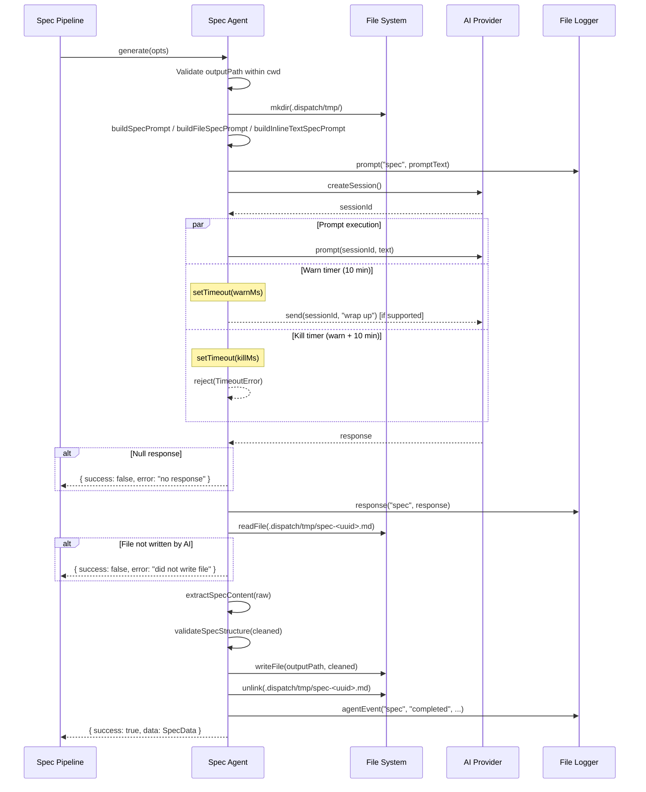
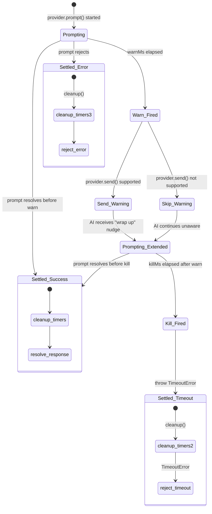

# Spec Agent

The spec agent (`src/agents/spec.ts`) generates high-level markdown spec files
from issue details, local files, or inline text by interacting with an AI
provider. It explores the codebase, analyzes the source input, and writes a
structured specification that drives the downstream planner and executor agents.

## What it does

The spec agent receives an issue, file, or inline text and:

1. Validates that the output path stays within the working directory.
2. Creates a temporary file path at `.dispatch/tmp/spec-<uuid>.md`.
3. Constructs a prompt tailored to the input type (issue, file, or inline text).
4. Creates a fresh AI provider session and sends the prompt with a two-phase
   timebox mechanism.
5. Reads the temp file written by the AI agent.
6. Post-processes the content via `extractSpecContent()` to strip preamble,
   postamble, and code fences.
7. Validates the spec structure via `validateSpecStructure()`.
8. Writes the cleaned content to the final output path.
9. Deletes the temp file.
10. Returns an [`AgentResult<SpecData>`](../planning-and-dispatch/agent-types.md) with the content and validation status.

## Why it exists

The spec agent is the entry point of the Dispatch pipeline. Without it, the
planner and executor agents would lack structured input defining what needs
to be built. The spec agent solves this by:

- **Translating requirements into actionable specs**: It converts
  issue descriptions, file contents, or free-form text into a structured
  markdown format with defined sections (Context, Why, Approach, Integration
  Points, Tasks, References, Key Guidelines).
- **Exploring the codebase**: Unlike a simple template filler, the spec agent
  instructs the AI to read files, search symbols, and understand the project
  before writing the spec. This produces context-aware specifications that
  align with the existing architecture.
- **Tagging tasks with execution modes**: Each task in the spec is tagged
   `(P)`, `(S)`, or `(I)` to control parallel, serial, or isolated execution
   downstream — see [Markdown Syntax Reference](../task-parsing/markdown-syntax.md)
   for the full syntax specification.

## Key source files

| File | Role |
|------|------|
| [`src/agents/spec.ts`](../../src/agents/spec.ts) | Boot function, prompt builders, timebox mechanism, post-processing |
| [`src/spec-generator.ts`](../../src/spec-generator.ts) | `extractSpecContent()`, `validateSpecStructure()`, timebox constants |
| [`src/agents/interface.ts`](../../src/agents/interface.ts) | `Agent` base interface that `SpecAgent` extends |
| [`src/agents/index.ts`](../../src/agents/index.ts) | Registry entry for `bootSpec` |

## How it works

### Boot and provider requirement

The `boot()` function (`src/agents/spec.ts:70`) requires an
`AgentBootOptions` with a non-null `provider` field. If no provider is
supplied, `boot()` throws immediately:

```
Spec agent requires a provider instance in boot options
```

The booted agent retains a reference to the provider but does **not** own its
lifecycle. The agent's `cleanup()` method is a no-op (`src/agents/spec.ts:255-257`).

### Three input modes

The spec agent supports three mutually exclusive input modes:

| Mode | Input fields | Use case |
|------|-------------|----------|
| **Issue** | `issue: IssueDetails` | Tracker mode (GitHub/Azure DevOps) |
| **File** | `filePath + fileContent` | File/glob mode (local markdown) |
| **Inline text** | `inlineText` | Command-line text input |

Each mode produces a tailored prompt via its own builder function, but all
three share the same core instructions via `buildCommonSpecInstructions()`.

### Output path validation

Before any work begins, the agent validates that `outputPath` resolves within
the working directory (`src/agents/spec.ts:86-98`). If the output path escapes
the working directory (e.g., via `../`), the agent returns a failure result
immediately. This prevents the AI from writing files to arbitrary locations.

### Generation flow



## The two-phase timebox mechanism

The spec agent implements a warn-then-kill timer pattern
(`src/agents/spec.ts:131-187`) to bound AI execution time. This is more
sophisticated than a simple `withTimeout()` because it gives the AI a chance
to finish gracefully before hard-killing.

### Phase 1: Warn (default 10 minutes)

After `DEFAULT_SPEC_WARN_MIN` minutes (configurable via `timeboxWarnMs`),
the agent sends a follow-up message to the AI session:

> "Your spec generation time is done. You have exceeded the 10-minute limit.
> You MUST write the spec file to [path] immediately. If you do not comply
> within [N] seconds, you will be terminated."

This message is sent via `provider.send()`, which injects a follow-up message
into the running session without blocking for a response.

### Phase 2: Kill (default 10 minutes after warn)

After an additional `DEFAULT_SPEC_KILL_MIN` minutes, the agent throws a
`TimeoutError` that terminates the prompt. The total maximum duration is
**warn + kill = 20 minutes by default**.

### Implementation details

The timebox uses a `settled` flag (`src/agents/spec.ts:136`) to prevent
double-resolution of the containing Promise. Both the warn and kill timers
check this flag before acting. A `cleanup` function clears both timers to
prevent leaks.



### Failure modes

| Scenario | Behavior |
|----------|----------|
| Provider does not support `send()` | Warning is silently skipped; kill timer still fires on schedule |
| `provider.send()` throws | Error is logged via `log.warn()` but does not affect the kill timer or the running prompt |
| Prompt resolves between warn and kill | Success — the `settled` flag prevents the kill timer from firing |
| Prompt rejects after warn fires | The first settlement wins; the kill timer is cleaned up |
| Both timers fire but prompt already settled | No effect — `settled` flag guards all callbacks |

### Race condition safety

The `settled` flag ensures exactly one resolution path takes effect. The three
concurrent paths (prompt success, prompt error, timer callbacks) all check and
set `settled` synchronously within the same microtask, making the pattern safe
within Node.js's single-threaded event loop.

### Relationship to `withRetry()`

The two-phase timebox is internal to the `generate()` function. The pipeline
orchestrator wraps `generate()` with [`withRetry()`](../shared-utilities/retry.md):

```
withRetry(() => specAgent.generate(item, outputPath, cwd), retries, { label })
```

Each retry attempt gets a completely fresh timebox (new timers, new `settled`
flag). A `TimeoutError` from the kill timer triggers a retry just like any
other generation error.

### Configuring timeouts

| Parameter | Default | Source |
|-----------|---------|--------|
| `timeboxWarnMs` | 10 min (600,000 ms) | `DEFAULT_SPEC_WARN_MIN` in `src/spec-generator.ts:34` |
| `timeboxKillMs` | 10 min (600,000 ms) | `DEFAULT_SPEC_KILL_MIN` in `src/spec-generator.ts:37` |

These can be overridden via `SpecGenerateOptions.timeboxWarnMs` and
`timeboxKillMs`, which the spec pipeline sets from the CLI flags
`--spec-warn-timeout` and `--spec-kill-timeout`.

### Common causes of timebox timeouts

| Cause | Diagnosis | Resolution |
|-------|-----------|------------|
| Complex codebase exploration | Check logs for extensive file reads | Increase `--spec-warn-timeout` and `--spec-kill-timeout` |
| AI model producing very long output | Check response length in `.dispatch/logs/` | Simplify the issue description |
| Provider latency | Check provider logs for slow responses | Switch to a faster model or provider |
| AI stuck in a loop | Check response text for repetitive patterns | Retry; persistent loops may indicate a prompt issue |

## Spec structure and validation

### Required H2 sections

The spec template defines seven H2 sections
(`src/spec-generator.ts:40-48`):

| Section | Purpose |
|---------|---------|
| `## Context` | Relevant codebase context: modules, directory structure, architecture |
| `## Why` | Motivation for the change |
| `## Approach` | High-level implementation strategy |
| `## Integration Points` | Modules, interfaces, and conventions the implementation must align with |
| `## Tasks` | Checklist of tagged `- [ ]` tasks |
| `## References` | Links to docs, issues, or external resources |
| `## Key Guidelines` | Constraints and rules for implementation |

### Post-processing: `extractSpecContent()`

`extractSpecContent()` (`src/spec-generator.ts:168-228`) is a pure function
that strips artifacts from AI-generated spec content:

1. **Code fence removal**: Strips `` ```markdown ... ``` `` wrapping that
   some AI models add around the entire output.
2. **Preamble removal**: Strips conversational text before the first `# `
   heading (e.g., "Here's the spec file:").
3. **Postamble removal**: Strips text after the last recognized H2 section
   (e.g., "Let me know if you'd like changes").

If no H1 heading is found, the original content is returned unchanged. This
prevents data loss when the AI produces unexpected output.

### Structural validation: `validateSpecStructure()`

`validateSpecStructure()` (`src/spec-generator.ts:245-272`) checks three
conditions:

| Check | Failure reason |
|-------|---------------|
| Content starts with `# ` | `"Spec does not start with an H1 heading"` |
| Contains `## Tasks` section | `"Spec is missing a '## Tasks' section"` |
| `## Tasks` has at least one `- [ ]` | `"'## Tasks' section contains no unchecked tasks"` |

Validation is a **guardrail, not a gate** — failures produce a warning log
and set `valid: false` on the `SpecData` result, but the spec is still
written. The pipeline can decide how to handle invalid specs (retry, proceed
with warning, or abort).

### Can valid content be accidentally removed?

The `extractSpecContent()` function only removes:

- Text before the first `# ` heading
- Unrecognized `## ` sections after the last recognized section
- Surrounding code fences

Content within recognized sections is never modified. A false positive
(removing valid content) would require the AI to use an unrecognized H2
heading like `## Custom Section` after the last recognized section.

## Prompt construction

### Common instruction framework

All three prompt builders (`buildSpecPrompt`, `buildFileSpecPrompt`,
`buildInlineTextSpecPrompt`) delegate to `buildCommonSpecInstructions()`
(`src/agents/spec.ts:340-486`), which assembles:

1. **Role preamble**: "You are a spec agent..."
2. **Time limit warning**: States the warn-phase duration
3. **Pipeline explanation**: Describes the planner-then-executor downstream flow
4. **Scope constraints**: One source item per invocation
5. **Output constraints**: No preamble, postamble, summaries, code fences, or
   conversational text
6. **Source-specific section**: Issue details, file content, or inline text
7. **Working directory and environment**
8. **Instructions**: Five steps (explore, understand, research, identify
   integration points, do NOT make changes)
9. **Output template**: The exact H1/H2 section structure to follow
10. **Task tagging rules**: `(P)`, `(S)`, `(I)` mode definitions and examples
11. **Key guidelines**: Stay high-level, respect the stack, embed commit
    instructions in tasks

### Issue mode specifics

`buildSpecPrompt()` (`src/agents/spec.ts:499-513`) includes:

- Issue number, title, state, URL, labels
- Description body (if present)
- Acceptance criteria (if present, common in Azure DevOps)
- Discussion comments

### File mode specifics

`buildFileSpecPrompt()` (`src/agents/spec.ts:529-545`) includes:

- Title extracted from the first `# Heading` in the file (via `extractTitle()`
  from `src/datasources/md.ts`), falling back to the filename
- Source file path and content
- Supports in-place overwrite when `outputPath` is omitted

### Inline text mode specifics

`buildInlineTextSpecPrompt()` (`src/agents/spec.ts:556-571`) includes:

- Title derived from the first 80 characters of the inline text
- The full inline text as the description
- Instructs the AI that it "may need to infer details from the codebase"

### Why the prompts stay high-level

All prompts explicitly instruct the AI to avoid code snippets, exact line
numbers, and step-by-step coding instructions because:

- The planner agent will re-explore the codebase for each individual task.
- The spec agent sees the entire issue; the planner sees only one task.
- Detailed instructions in the spec would duplicate work and potentially
  conflict with the planner's findings.
- High-level specs are more resilient to codebase changes between generation
  and execution.

## Temporary file handling

The AI writes its output to a temp file (via its Write tool) rather than
returning it in the response text. This design enables:

1. **Post-processing** — `extractSpecContent()` and `validateSpecStructure()`
   can clean and validate the output before it reaches the final path.
2. **Separation of concerns** — the AI focuses on content generation; the
   agent handles file management.
3. **Error recovery** — if post-processing fails, the final output path is
   never written to, leaving no partial files.

### Write path

The spec agent writes AI output to `.dispatch/tmp/spec-<uuid>.md`
(`src/agents/spec.ts:101-106`). The AI is instructed to write to this path
rather than the final output path to allow post-processing before the final
write.

### Cleanup

After post-processing, the temp file is deleted
(`src/agents/spec.ts:229-233`). The `unlink` call is wrapped in a try/catch
that silently ignores errors — the file may already have been removed.

Unlike the commit agent, the spec agent cleans up its own temp files.

### What happens if the AI does not write the file?

If `readFile(tmpPath)` fails, the agent returns a failure result with the
error message `"Spec agent did not write the file to [path]"` and includes
the first 300 characters of the AI response for debugging
(`src/agents/spec.ts:203-211`).

## Interfaces

### `SpecGenerateOptions`

Input to `generate()`:

| Field | Type | Required | Description |
|-------|------|----------|-------------|
| `issue` | `IssueDetails` | No | Issue details (tracker mode) |
| `filePath` | `string` | No | Source file path (file/glob mode) |
| `fileContent` | `string` | No | Source file content (file/glob mode) |
| `inlineText` | `string` | No | Inline text (CLI text mode) |
| `cwd` | `string` | Yes | Working directory |
| `outputPath` | `string` | Yes | Final output path for the spec |
| `worktreeRoot` | `string` | No | Worktree root for isolation |
| `onProgress` | `(snapshot) => void` | No | Provider progress callback |
| `timeboxWarnMs` | `number` | No | Warn-phase duration (default: 600,000 ms) |
| `timeboxKillMs` | `number` | No | Kill-phase duration (default: 600,000 ms) |

### `SpecData`

The `AgentResult<SpecData>` payload is itself a discriminated union:

| Variant | Fields | Description |
|---------|--------|-------------|
| Valid | `content: string`, `valid: true` | Spec passed structural validation |
| Invalid | `content: string`, `valid: false`, `validationReason: string` | Spec failed validation (still written) |

### `SpecAgent`

The booted agent interface (extends `Agent`):

| Member | Type | Description |
|--------|------|-------------|
| `name` | `string` | Always `"spec"` |
| `generate` | `(opts: SpecGenerateOptions) => Promise<AgentResult<SpecData>>` | Generate a spec file |
| `cleanup` | `() => Promise<void>` | No-op — provider lifecycle is managed externally |

## Integrations

### AI Provider System

- **Type**: AI/LLM service abstraction
- **Used in**: `src/agents/spec.ts:128` (`createSession()`),
  `src/agents/spec.ts:173` (`prompt()`), `src/agents/spec.ts:155-158`
  (`send()` for timebox warning)
- **Session model**: One session per `generate()` call. The timebox may send
  a follow-up message via `send()` during the session. The session is abandoned
  after the prompt completes.
- **Provider `send()` support**: Optional. Copilot, Claude, and OpenCode
  support `send()`; Codex does not (it silently ignores follow-up messages).
  If `send()` is not available, the timebox warn phase is skipped but the
  kill timer still fires.
- See [Provider Abstraction](../provider-system/overview.md) for session
  lifecycle and cleanup behavior.

### Spec Generator Utilities

- **Type**: Internal library
- **Used in**: `src/agents/spec.ts:19`
- **Functions**: `extractSpecContent()` (post-processing),
  `validateSpecStructure()` (validation), `DEFAULT_SPEC_WARN_MIN` and
  `DEFAULT_SPEC_KILL_MIN` (timebox defaults)
- See [Spec Generation](../spec-generation/overview.md) for the full
  pipeline context.

### Node.js `fs/promises`

- **Type**: Local I/O
- **Used in**: `src/agents/spec.ts:12` — `mkdir`, `readFile`, `writeFile`,
  `unlink`
- **Official docs**:
  [Node.js fs/promises API](https://nodejs.org/api/fs.html#promises-api)
- `mkdir(tmpDir, { recursive: true })` creates `.dispatch/tmp/` idempotently.
- `readFile(tmpPath)` reads the AI-written temp file.
- `writeFile(outputPath, cleaned)` writes the final spec.
- `unlink(tmpPath)` removes the temp file (errors silently ignored).

### Node.js `crypto`

- **Type**: Utility
- **Used in**: `src/agents/spec.ts:14` — `randomUUID()`
- Generates unique temp filenames to prevent collisions in concurrent
  scenarios.

### Datasource System

- **Type**: Internal abstraction
- **Used in**: `src/agents/spec.ts:17` (imports `IssueDetails`),
  `src/agents/spec.ts:21` (imports `extractTitle` from `datasources/md.ts`)
- `IssueDetails` provides the issue context (number, title, body, comments,
  labels, acceptance criteria) consumed by the issue-mode prompt.
- `extractTitle()` extracts the first `# Heading` from markdown file content,
  used by the file-mode prompt.

### File Logger

- **Type**: Observability
- **Used in**: `src/agents/spec.ts:23,125,199,235,245`
- Logs the full prompt, response, completion event, and errors through the
  `AsyncLocalStorage`-based file logger.

### TimeoutError

- **Type**: Internal error class
- **Used in**: `src/agents/spec.ts:20,168`
- Thrown by the kill timer. The `TimeoutError` class
  (`src/helpers/timeout.ts:16-26`) includes a `label` property for
  diagnostic messages.

## Monitoring and troubleshooting

### How to monitor spec generation

- Enable `--verbose` for debug-level console output showing prompt size and
  response length.
- Check `.dispatch/logs/issue-<id>.log` for the full prompt and response text.
- Look for `agentEvent("spec", "completed", ...)` entries in the log to
  confirm successful completion.

### Common failure scenarios

| Symptom | Likely cause | Resolution |
|---------|-------------|------------|
| `"Spec agent did not write the file"` | AI did not follow the instruction to write to the temp path | Check the AI response in the file logger; the first 300 chars are included in the error |
| `TimeoutError` after 20 minutes | AI took too long to generate the spec | Increase timeouts via `--spec-warn-timeout` and `--spec-kill-timeout` |
| `"Spec does not start with an H1 heading"` | AI wrapped output in code fences or added preamble that `extractSpecContent()` could not strip | Check the raw temp file content; the AI may need a more explicit prompt |
| `"'## Tasks' section contains no unchecked tasks"` | AI generated tasks without `- [ ]` checkbox format | The spec is still written; downstream parsing will find no tasks |
| `"Output path escapes the working directory"` | The `outputPath` resolved outside `cwd` | Verify path configuration |

## Per-issue structured logging

The spec agent integrates with the FileLogger system via `AsyncLocalStorage`.
When `--verbose` is enabled, the pipeline scopes a `FileLogger` to each item's
async context, and the agent logs structured events at key points:

| Event | Location | What is logged |
|-------|----------|----------------|
| Prompt sent | `spec.ts:116` | Full prompt text (via `prompt("spec", ...)`) |
| Response received | `spec.ts:133` | Full response text (via `response("spec", ...)`) |
| Generation completed | `spec.ts:169` | Duration in milliseconds (via `agentEvent("spec", "completed", ...)`) |
| Error occurred | `spec.ts:181` | Error message and stack trace (via `error(...)`) |

These logs are written to `.dispatch/logs/issue-{id}.log` and persist across
runs. They are the primary debugging tool for investigating why a specific
spec generation failed or produced unexpected output.

## Related documentation

- [Agent Framework Overview](./overview.md) — Registry, types, and boot
  lifecycle
- [Pipeline Flow](./pipeline-flow.md) — How the spec agent feeds into
  planner, executor, and commit
- [Spec Generation](../spec-generation/overview.md) — The full spec
  generation pipeline that drives this agent
- [Planner Agent](./planner-agent.md) — The agent that consumes spec output
- [Task Parsing](../task-parsing/overview.md) — How `(P)`/`(S)`/`(I)` tags
  are extracted from spec tasks
- [Markdown Syntax Reference](../task-parsing/markdown-syntax.md) — Checkbox
  syntax and mode prefixes used in spec output
- [Agent Result Types](../planning-and-dispatch/agent-types.md) — The
  `AgentResult<SpecData>` type returned by this agent
- [Retry Utility](../shared-utilities/retry.md) — The `withRetry()` wrapper
  used for spec generation retries
- [Provider Abstraction](../provider-system/overview.md) — Provider
  session lifecycle
- [Datasource Overview](../datasource-system/overview.md) — Where
  `IssueDetails` comes from
- [Spec Generator Tests](../testing/spec-generator-tests.md) — Unit tests
  covering spec generation, extraction, and validation
