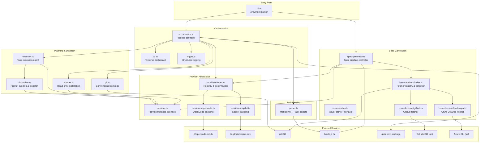
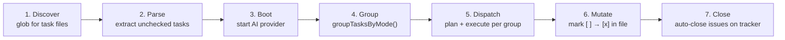
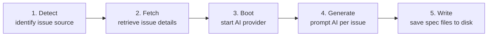
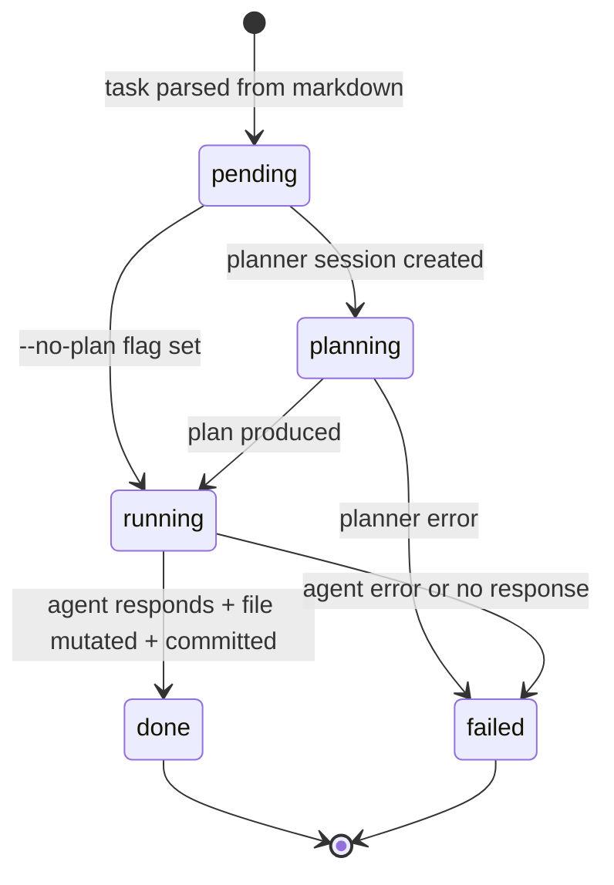
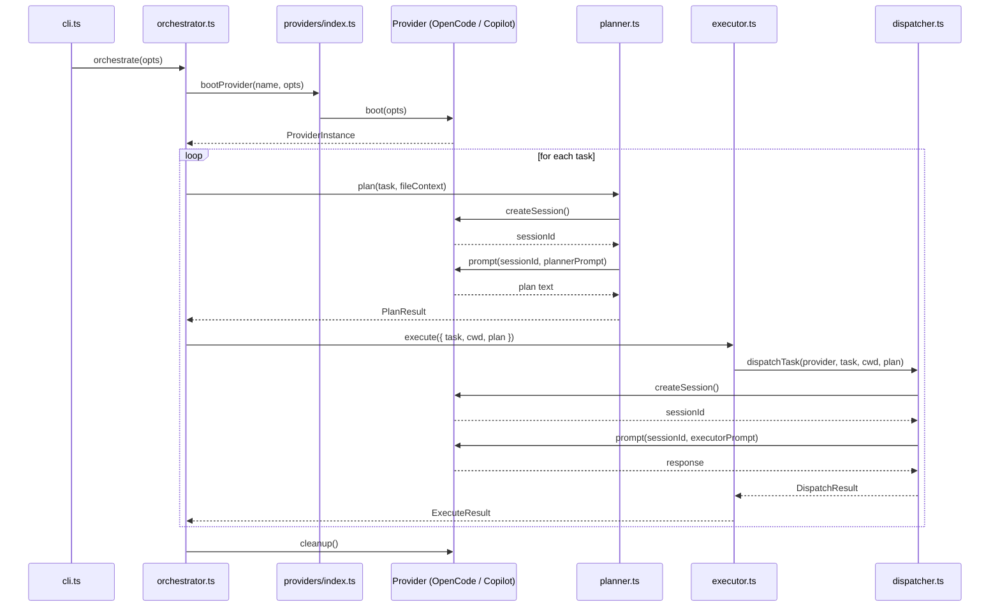

# dispatch-tasks -- Architecture Overview

## What is dispatch-tasks?

dispatch-tasks is a Node.js CLI tool that automates multi-task software
engineering work by delegating to AI coding agents. It has two operating modes:

- **Dispatch mode** reads markdown task files containing GitHub-style checkbox
  items (`- [ ] do something`), dispatches each task to an AI coding agent in
  an isolated session, marks the task complete in the source file, and creates a
  conventional commit for the result.
- **Spec mode** (`--spec`) fetches issues from an external tracker (GitHub or
  Azure DevOps), prompts an AI agent to explore the codebase and produce
  high-level markdown spec files, and writes them to disk so they can be fed
  back into dispatch mode.

Together, the two modes form a **three-stage AI pipeline** from issue tracker to
implemented, committed code: a **spec agent** converts issues into strategic
task files, a **planner agent** explores the codebase to produce detailed
execution plans for each task, and an **executor agent** follows those plans to
make code changes. Each stage uses isolated AI sessions to prevent context
leakage.

## Why does it exist?

Manual orchestration of AI coding agents is tedious when a project has many
small, well-defined units of work. dispatch-tasks solves three problems:

1. **Context isolation** -- each task runs in a fresh agent session so context
   from one task does not leak into another.
2. **Precision through planning** -- an optional two-phase pipeline lets a
   read-only planner agent explore the codebase first, producing a focused
   execution plan that the executor agent follows.
3. **Automated record-keeping** -- after each task, the markdown file is
   updated and a conventional commit is created, giving a clean, reviewable
   git history tied directly to the original task list.

## System topology

The diagram below shows every module in the source tree and how they relate.
The CLI validates input and delegates to either the orchestrator (dispatch mode)
or the spec generator (spec mode). In dispatch mode, the orchestrator drives a
seven-stage pipeline through the parser, provider, planner, executor, and
issue-fetcher modules. In spec mode, the spec generator drives a five-stage
pipeline through the issue fetchers and provider. The TUI and logger provide
output for interactive and non-interactive contexts respectively.

## Pipeline data flow

Every `dispatch` invocation follows a seven-stage pipeline. The orchestrator
drives the stages sequentially, with configurable concurrency in stage 5.
Tasks are partitioned into execution groups by their `(P)` / `(S)` mode prefix
before dispatch begins.

### Stage details

| Stage | Module | What happens |
|-------|--------|-------------|
| Discover | `src/agents/orchestrator.ts` | Glob pattern resolves to absolute file paths, sorted by leading filename digits. |
| Parse | `src/parser.ts` | Each file is read and regex-matched for `- [ ] ...` lines, producing `Task` and `TaskFile` objects. |
| Boot | `src/providers/index.ts` | The selected provider (OpenCode or Copilot) is booted via the registry. Provider cleanup is registered with `registerCleanup()`. |
| Group | `src/parser.ts` | `groupTasksByMode()` partitions tasks into contiguous groups of same-mode `(P)` or `(S)` tasks. |
| Dispatch | `src/agents/orchestrator.ts`, `src/agents/planner.ts`, `src/agents/executor.ts` | Per group (sequential): per task within group (batch-concurrent): orchestrator calls `planner.plan()` then passes the plan to `executor.execute()`. |
| Mutate | `src/parser.ts` | `markTaskComplete` re-reads the file, validates the target line, replaces `[ ]` with `[x]`, and writes back. |
| Close | `src/agents/orchestrator.ts` | For each spec file where all tasks succeeded, extract issue ID from `<id>-<slug>.md` filename and close the issue on the tracker. |

For the full prompt construction chain (how task text becomes a planner prompt,
then an executor prompt), see the
[Planning & Dispatch overview](planning-and-dispatch/overview.md).

## Spec generation pipeline

When invoked with `--spec <ids>`, the CLI bypasses the orchestrator entirely
and delegates to `generateSpecs()` in `src/spec-generator.ts`. This pipeline
converts issue tracker items into high-level markdown spec files that can later
be fed into dispatch mode.

### Spec stage details

| Stage | Module | What happens |
|-------|--------|-------------|
| Detect | `src/issue-fetchers/index.ts` | If `--source` is not given, `detectIssueSource()` runs `git remote get-url origin` and matches the URL against regex patterns for supported platforms (GitHub, Azure DevOps). Supports both SSH and HTTPS remote formats. |
| Fetch | `src/issue-fetchers/github.ts` or `azdevops.ts` | Each issue number is fetched sequentially via the platform's CLI tool (`gh` or `az`). The result is normalized into an `IssueDetails` object. Failed fetches are recorded but do not abort the pipeline. |
| Boot | `src/providers/index.ts` | Same `bootProvider` call as dispatch mode — starts or connects to the AI backend. |
| Generate | `src/spec-generator.ts` | For each successfully fetched issue, a fresh AI session is created, the issue details are wrapped in a ~115-line prompt instructing the AI to explore the codebase and produce a high-level spec, and the response is captured. Issues are processed sequentially, not in parallel. |
| Write | `src/spec-generator.ts` | The AI response is written to `<output-dir>/<id>-<slug>.md`. The slug is the lowercased, sanitized title truncated to 60 characters. The output directory (default `.dispatch/specs`) is created with `mkdir -p` semantics. |

### Key differences from dispatch mode

| Aspect | Dispatch mode | Spec mode |
|--------|--------------|-----------|
| Input | Markdown task files (via glob) | Issue numbers (via `--spec`) |
| Pipeline controller | `orchestrator.ts` | `spec-generator.ts` |
| AI interaction | Planner + executor per task | Single spec-generation prompt per issue |
| Output | Modified markdown + git commits | New spec files on disk |
| Concurrency | Configurable (`--concurrency`) | Sequential only |
| Provider cleanup | Called on success path only (gap) | Always called after generation |

For the complete spec generation documentation, see the
[Spec Generation overview](spec-generation/overview.md).

## Task lifecycle

Each task transitions through a state machine as it moves through the pipeline.
The `--no-plan` flag bypasses the planning state.

The TUI tracks both this per-task state machine and a global phase state
machine (discovering, parsing, booting, dispatching, done). See the
[TUI documentation](cli-orchestration/tui.md) for rendering details.

## Provider abstraction

The `ProviderInstance` interface (`src/provider.ts`) defines a three-method
contract (plus a `name` property) that decouples the pipeline from any specific
AI runtime:

Currently two backends are implemented:

| Backend | SDK | Session model | Default connection |
|---------|-----|---------------|-------------------|
| OpenCode | `@opencode-ai/sdk` v1.2.10 | Server-side (SDK manages sessions) | Spawns a local server via `createOpencode()` |
| Copilot | `@github/copilot-sdk` v0.1.0 | Client-side (`Map<string, CopilotSession>`) | Auto-discovers Copilot CLI |

Both support `--server-url` to connect to an already-running server instead of
spawning one. For backend-specific setup and troubleshooting, see the
[Provider System documentation](provider-system/provider-overview.md).

## Key design decisions

### Two-phase planner-then-executor

Tasks are optionally processed in two phases: a planner agent explores the
codebase in a read-only session and produces a detailed execution plan, then an
executor agent follows that plan to make changes. This separation improves
precision because the executor receives focused, context-rich instructions
rather than a bare task description. The `--no-plan` flag skips the planning
phase for simple tasks or faster iteration.

**Planner read-only enforcement is prompt-only.** Neither the OpenCode nor
Copilot SDKs expose capability restrictions, so the planner's read-only
behavior relies on prompt instructions. See the
[Planner documentation](planning-and-dispatch/planner.md) for details.

### Session-per-task isolation

Every task gets a fresh provider session for both planning and execution. This
prevents context leakage between tasks and avoids context window exhaustion.
Sessions share the filesystem and environment variables but have isolated
conversation histories. See the
[Dispatcher documentation](planning-and-dispatch/dispatcher.md).

### Compile-time registries (providers, agents, fetchers)

Three subsystems use the same registry pattern: a static `Record<Name, BootFn>`
map with compile-time string literal union keys and no runtime plugin discovery.

| Registry | Key type | Location |
|----------|----------|----------|
| Providers | `ProviderName` (`"opencode" \| "copilot"`) | `src/providers/index.ts` |
| Agents | `AgentName` (`"planner" \| "executor" \| "spec"`) | `src/agents/index.ts` |
| Issue fetchers | `IssueSourceName` (`"github" \| "azdevops"`) | `src/issue-fetchers/index.ts` |

Each registry exports a `boot` or `get` function and a list of valid names for
CLI validation. Adding a new implementation requires a code change (new file,
import, map entry, union member) but gives exhaustiveness checks at compile
time. See the [Adding a Provider guide](provider-system/adding-a-provider.md)
and [Adding a Fetcher guide](issue-fetching/adding-a-fetcher.md).

### CLI-as-API for external tools

Issue fetchers and git operations communicate with external tools by shelling
out to CLI programs (`gh`, `az`, `git`) via `execFile` rather than using HTTP
APIs or SDKs. This simplifies authentication -- users authenticate once via
`gh auth login` or `az login` -- but introduces runtime dependencies on
external tools being installed and on PATH. There are no pre-checks for tool
availability, no subprocess timeouts, and errors from missing tools surface as
`ENOENT` exceptions. See the
[Issue Fetching overview](issue-fetching/overview.md) and
[Git documentation](planning-and-dispatch/git.md).

### Context filtering for planner agents

When the planner receives a task file, `buildTaskContext()` strips all sibling
unchecked tasks from the file content while preserving headings, prose, notes,
and the target task. This prevents the planner from being confused by tasks
assigned to other agents. See the
[Task Context and Lifecycle page](planning-and-dispatch/task-context-and-lifecycle.md).

### Automatic conventional commit inference

After each task completes, `git.ts` stages all changes and creates a
conventional commit. The commit type (feat, fix, docs, refactor, test, chore,
style, perf, ci) is inferred from the task text via cascading regex patterns.
The type cannot be overridden by the task author. See the
[Git documentation](planning-and-dispatch/git.md).

### Group-aware batch-sequential concurrency

The orchestrator partitions tasks into execution groups based on their `(P)`
(parallel) or `(S)` (serial) mode prefix using `groupTasksByMode()`. Groups are
processed sequentially; within each parallel group, tasks are dispatched in
batches of size `--concurrency` (default 1) using `Promise.all`. Serial groups
always contain exactly one task, ensuring it runs alone with no concurrent
overlap. See the
[Orchestrator documentation](cli-orchestration/orchestrator.md#concurrency-model).

## Cross-cutting concerns

This section surfaces system-wide patterns and known gaps that span multiple
modules. Each concern links to the feature pages where it is discussed in
detail.

### Concurrency and file safety

Concurrent task execution (`--concurrency > 1`) introduces two classes of risk:

1. **Markdown file corruption.** `markTaskComplete` performs a
   read-modify-write cycle without file locking. If two tasks from the same
   file complete simultaneously, one write can overwrite the other. See the
   [Architecture and Concurrency analysis](task-parsing/architecture-and-concurrency.md).

2. **Git commit cross-contamination.** `git add -A` stages *all* changes in the
   working directory. With concurrent tasks, one task's commit can accidentally
   include another task's uncommitted changes. The safe default is
   `--concurrency 1`. See the [Git documentation](planning-and-dispatch/git.md).

### Error handling and recovery

Error handling follows a "catch and continue" pattern at the task level but has
known gaps at the pipeline level:

- **Task-level failures** are caught and recorded as `{ success: false, error }`.
  A failed task does not block other tasks in the same batch.
  See the [Dispatcher documentation](planning-and-dispatch/dispatcher.md).

- **Provider cleanup gap (mitigated).** `instance.cleanup()` is only called on the success
  path in `orchestrate()`. However, `registerCleanup()` from `src/cleanup.ts`
  registers the provider cleanup at boot time, allowing the CLI's signal and
  error handlers to drain cleanup functions via `runCleanup()`. This mitigates
  the gap for most failure paths, though `SIGKILL` remains unhandleable.
  See the [Orchestrator documentation](cli-orchestration/orchestrator.md#process-level-cleanup-via-registercleanup).

- **Markdown-then-commit failure.** If `commitTask()` fails after
  `markTaskComplete()` succeeds, the markdown file is left in a
  modified-but-uncommitted state with no rollback.
  See the [Orchestrator documentation](cli-orchestration/orchestrator.md).

- **No timeout or cancellation.** Neither the `ProviderInstance` interface nor
  either backend exposes a timeout or cancellation mechanism for `prompt()`
  calls. A hung agent blocks the pipeline indefinitely.
  See the [Provider overview](provider-system/provider-overview.md).

### Authentication and secrets

Authentication is provider-specific and managed entirely by the underlying SDKs
and CLI tools:

- **OpenCode** connects to a local server process; no explicit credentials are
  passed by dispatch-tasks. The LLM provider configuration lives in the
  OpenCode CLI's own config.
  See the [OpenCode backend documentation](provider-system/opencode-backend.md).

- **Copilot** supports four authentication methods with a defined precedence
  order: Copilot CLI login, `COPILOT_GITHUB_TOKEN`, `GH_TOKEN`, `GITHUB_TOKEN`.
  Token rotation is the user's responsibility.
  See the [Copilot backend documentation](provider-system/copilot-backend.md).

- **GitHub CLI (`gh`)** authenticates via `gh auth login`; credentials are
  stored by the `gh` tool itself and are not managed by dispatch-tasks.
  See the [GitHub fetcher documentation](issue-fetching/github-fetcher.md).

- **Azure CLI (`az`)** authenticates via `az login`; the `--org` and
  `--project` flags (or `az` defaults) determine the target organization.
  See the [Azure DevOps fetcher documentation](issue-fetching/azdevops-fetcher.md).

dispatch-tasks does not manage, store, or rotate secrets itself. All credential
lifecycle management is delegated to the external tools and SDKs.

### External tool availability

dispatch-tasks depends on several CLI tools at runtime, but performs no
pre-flight checks for their presence. A missing tool surfaces as an `ENOENT`
error from Node's `execFile`:

| Tool | Required when | What fails |
|------|--------------|------------|
| `git` | Always (dispatch mode commits) | `commitTask()` throws |
| `gh` | `--spec` with GitHub issues | `github.fetch()` throws |
| `az` + `azure-devops` extension | `--spec` with Azure DevOps | `azdevops.fetch()` throws |
| OpenCode CLI or server | `--provider opencode` | `bootProvider()` throws |
| Copilot CLI | `--provider copilot` | `client.start()` throws |

There are no subprocess timeouts on any `execFile` call. A hung `gh`, `az`, or
`git` process will block the pipeline indefinitely. See the
[Issue Fetching integrations](issue-fetching/integrations.md) and
[CLI Orchestration integrations](cli-orchestration/integrations.md).

### Monitoring and observability

dispatch-tasks has minimal observability:

- **TUI** provides real-time progress during interactive runs (spinner, progress
  bar, per-task status, elapsed time). It uses raw ANSI escape codes and does
  **not** degrade gracefully in non-TTY environments (CI, piped output).
  See the [TUI documentation](cli-orchestration/tui.md).

- **Logger** writes chalk-styled messages to stdout/stderr. There is no
  structured JSON output, no log-level filtering, no file transport, and no
  timestamps. See the [Logger documentation](shared-types/logger.md).

- **No health checks** for the backing AI provider exist at the dispatch level.
  Provider failures surface only when a `prompt()` call fails.
  See the [Integrations page](planning-and-dispatch/integrations.md).

- **Signal handling.** `SIGINT` and `SIGTERM` handlers are installed at
  `src/cli.ts:242-252`. Both call `runCleanup()` from the
  [cleanup registry](shared-types/cleanup.md) to shut down provider processes
  before exiting with the conventional `128 + signal` exit code (130 for
  SIGINT, 143 for SIGTERM). A `.catch()` handler on the main promise also
  calls `runCleanup()` before `process.exit(1)`.
  See the [Process Signals integration](shared-types/integrations.md#nodejs-process-signals-sigint-sigterm)
  and [CLI Integrations page](cli-orchestration/integrations.md).

### File encoding and line endings

The parser normalizes CRLF to LF during both `parseTaskContent` and
`buildTaskContext`. However, `markTaskComplete` always writes LF line endings
regardless of the original file's style. All file I/O assumes UTF-8 encoding
with no BOM handling.
See the [Markdown Syntax reference](task-parsing/markdown-syntax.md).

### Issue source auto-detection

When `--source` is not explicitly provided, the spec generator inspects the
`origin` git remote URL and matches it against a first-match-wins pattern list
(`github.com` → GitHub, `dev.azure.com` / `visualstudio.com` → Azure DevOps).
Auto-detection only checks the `origin` remote, so repositories with multiple
remotes or non-standard hostnames (e.g., GitHub Enterprise) may require
explicit `--source`. Both SSH and HTTPS remote URL formats are matched. See the
[Issue Fetching overview](issue-fetching/overview.md) and
[Spec Generation overview](spec-generation/overview.md).

### Shared data model

The `Task` and `TaskFile` interfaces defined in `src/parser.ts` are the shared
data model consumed by every module in the pipeline. They are imported directly
-- there is no barrel file or re-export layer.

| Consumer | What it imports | How it uses it |
|----------|----------------|----------------|
| Orchestrator | `Task`, `TaskFile`, `parseTaskFile`, `buildTaskContext` | Drives the full lifecycle |
| Planner | `Task` | Builds the planning prompt |
| Executor | `Task`, `markTaskComplete` | Executes planned tasks and marks them complete |
| Dispatcher | `Task` | Builds the execution prompt |
| TUI | `Task` | Displays task text and status |
| Git | `Task` | Builds conventional commit messages |

See the [Shared Types overview](shared-types/overview.md) and the
[Task Parsing overview](task-parsing/overview.md).

## Infrastructure

### Runtime

- **Node.js >= 18** (ESM-only, `"type": "module"` in `package.json`)
- **Build tool:** tsup (single entry point, ESM output, Node 18 target, shebang
  banner for CLI binary)
- **Test runner:** Vitest v4.x (default configuration, no custom config file)

### Dependencies

| Package | Version | Purpose |
|---------|---------|---------|
| `@opencode-ai/sdk` | ^1.2.10 | OpenCode AI agent SDK |
| `@github/copilot-sdk` | ^0.1.0 | GitHub Copilot agent SDK |
| `chalk` | ^5.4.1 | Terminal color styling (ESM-only) |
| `glob` | ^11.0.1 | File pattern matching |

### External tools

- **git** -- must be installed and on PATH. Used via `execFile` (no shell).
- **OpenCode CLI** or **Copilot CLI** -- at least one must be installed
  depending on the chosen provider.
- **GitHub CLI (`gh`)** -- required for `--spec` mode with GitHub issues.
  See [Issue Fetching](issue-fetching/overview.md).
- **Azure CLI (`az`) with azure-devops extension** -- required for `--spec`
  mode with Azure DevOps work items.
  See [Issue Fetching](issue-fetching/overview.md).

## Component index

### [CLI & Orchestration](cli-orchestration/overview.md)

The entry point and pipeline controller. Parses arguments, drives the
seven-stage pipeline, and provides visual feedback.

- [CLI argument parser](cli-orchestration/cli.md)
- [Orchestrator pipeline](cli-orchestration/orchestrator.md)
- [Terminal UI](cli-orchestration/tui.md)
- [Integrations](cli-orchestration/integrations.md)

### [Task Parsing & Markdown](task-parsing/overview.md)

The foundational data extraction and mutation layer. Parses markdown checkbox
syntax into structured objects and writes completions back.

- [Markdown syntax reference](task-parsing/markdown-syntax.md)
- [API reference](task-parsing/api-reference.md)
- [Architecture and concurrency](task-parsing/architecture-and-concurrency.md)
- [Testing guide](task-parsing/testing-guide.md)

### [Planning & Dispatch Pipeline](planning-and-dispatch/overview.md)

The core task execution engine. Plans tasks, executes them via the executor
agent, and records results via git.

- [Planner agent](planning-and-dispatch/planner.md)
- [Executor agent](planning-and-dispatch/executor.md)
- [Dispatcher](planning-and-dispatch/dispatcher.md)
- [Git operations](planning-and-dispatch/git.md)
- [Task context and lifecycle](planning-and-dispatch/task-context-and-lifecycle.md)
- [Integrations](planning-and-dispatch/integrations.md)

### [Provider Abstraction & Backends](provider-system/provider-overview.md)

The strategy pattern that decouples the pipeline from specific AI runtimes.

- [OpenCode backend](provider-system/opencode-backend.md)
- [Copilot backend](provider-system/copilot-backend.md)
- [Adding a provider](provider-system/adding-a-provider.md)

### [Issue Fetching](issue-fetching/overview.md)

The data-ingestion layer for the `--spec` pipeline. Retrieves issues and work
items from external trackers and normalizes them into a common interface.

- [GitHub fetcher](issue-fetching/github-fetcher.md)
- [Azure DevOps fetcher](issue-fetching/azdevops-fetcher.md)
- [Integrations & troubleshooting](issue-fetching/integrations.md)
- [Adding a fetcher](issue-fetching/adding-a-fetcher.md)

### [Spec Generation](spec-generation/overview.md)

The pipeline that converts issue tracker items into high-level markdown spec
files. Uses issue fetchers for data ingestion and the AI provider for
codebase-aware spec authoring.

- [Spec generation overview](spec-generation/overview.md)
- [Integrations & troubleshooting](spec-generation/integrations.md)

### [Shared Interfaces & Utilities](shared-types/overview.md)

The foundational contracts and utilities that every other module depends on.

- [Logger](shared-types/logger.md)
- [Parser types](shared-types/parser.md)
- [Provider interface](shared-types/provider.md)
- [Integrations](shared-types/integrations.md)

### [Testing](testing/overview.md)

The project test suite covering configuration, formatting, task parsing, and
spec generation. Uses Vitest v4.x with real filesystem I/O (no mocks).

- [Test suite overview](testing/overview.md)
- [Configuration tests](testing/config-tests.md)
- [Format utility tests](testing/format-tests.md)
- [Parser tests](testing/parser-tests.md)
- [Spec generator tests](testing/spec-generator-tests.md)
