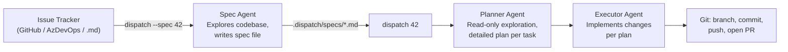
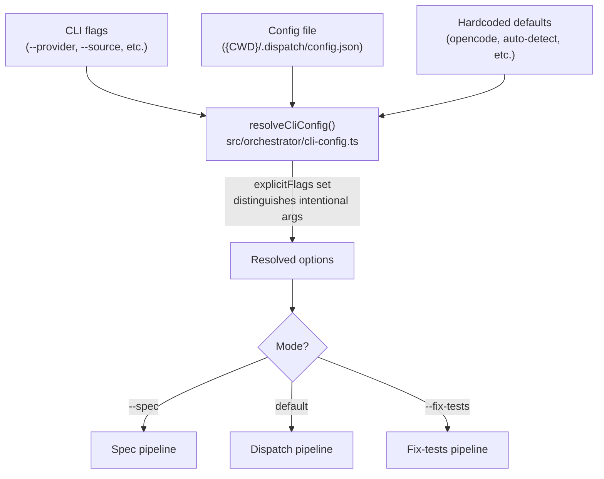
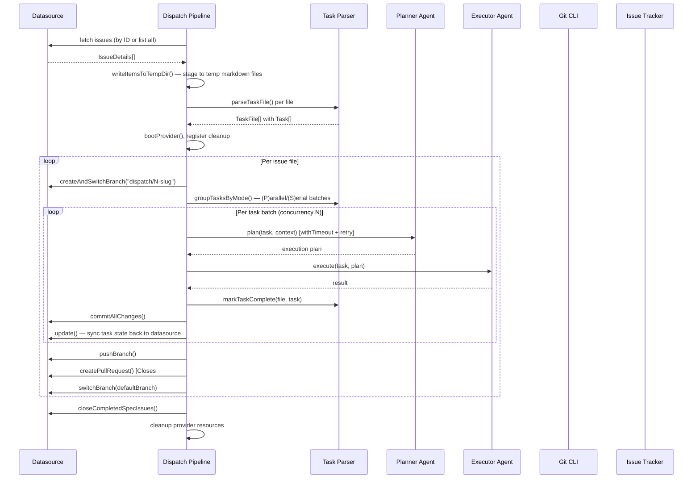
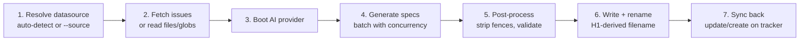
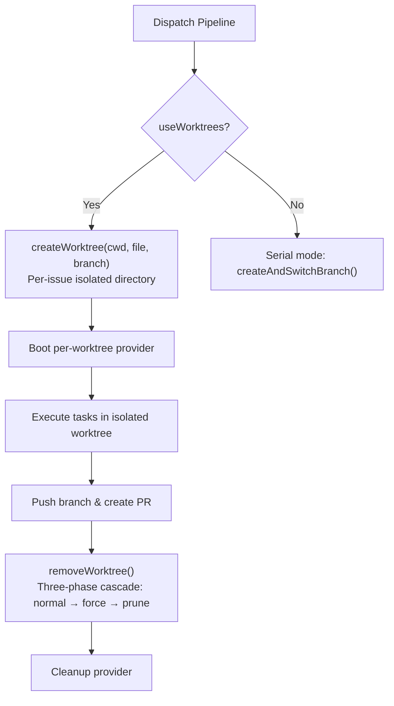

# Dispatch — Architecture Overview

Dispatch is a command-line tool that automates software engineering work by
delegating tasks from issue trackers to AI coding agents. It reads work items
from GitHub Issues, Azure DevOps Work Items, or local markdown files, converts
them into structured specification and task files, and orchestrates AI agents
(OpenCode, GitHub Copilot, Claude, or Codex) to plan and execute each task — committing changes,
pushing branches, and opening pull requests automatically.

## Why Dispatch exists

Manual orchestration of AI coding agents is tedious when a project has many
small, well-defined units of work. Dispatch closes that gap by:

1. **Fetching issues** from the team's existing tracker (GitHub, Azure DevOps)
   or reading local markdown specs.
2. **Generating structured specs** via an AI agent that explores the codebase
   and produces strategic task lists.
3. **Planning and executing** each task through isolated AI sessions, with an
   optional two-phase planner-then-executor architecture for higher-quality
   results.
4. **Managing the full git lifecycle** — branching, committing with conventional
   commit messages, pushing, and opening pull requests that auto-close the
   originating issue.

The tool is backend-agnostic across three dimensions — issue trackers
(datasources), AI runtimes (providers), and agent roles — each implemented as
a strategy-pattern plugin behind a formal TypeScript interface.

## System architecture

```mermaid
C4Context
    title Dispatch — System Topology

    Person(dev, "Developer", "Runs dispatch CLI")

    System_Boundary(dispatch, "Dispatch CLI") {
        Container(cli, "CLI Entry Point", "src/cli.ts", "Argument parsing, signal handlers, config routing")
        Container(config, "Configuration", "src/config.ts, config-prompts.ts, orchestrator/cli-config.ts", "Persistent config ({CWD}/.dispatch/config.json), interactive wizard, three-tier merge")
        Container(runner, "Orchestrator Runner", "src/orchestrator/runner.ts", "Pipeline router: dispatch, spec, fix-tests modes")

        Container(spec_pipe, "Spec Pipeline", "src/orchestrator/spec-pipeline.ts", "Issue-to-spec generation with batch concurrency")
        Container(dispatch_pipe, "Dispatch Pipeline", "src/orchestrator/dispatch-pipeline.ts", "Task planning, execution, git lifecycle, PR creation")
        Container(fix_pipe, "Fix-Tests Pipeline", "src/orchestrator/fix-tests-pipeline.ts", "Detect and auto-fix failing tests via AI")

        Container(ds_layer, "Datasource Layer", "src/datasources/", "Unified CRUD + git lifecycle across backends")
        Container(prov_layer, "Provider Layer", "src/providers/", "AI runtime abstraction: boot, session, prompt, cleanup")
        Container(agent_layer, "Agent Layer", "src/agents/", "Planner, executor, spec agent roles")

        Container(parser, "Task Parser", "src/parser.ts", "Markdown checkbox extraction, context filtering, completion marking")
        Container(specgen, "Spec Generator", "src/spec-generator.ts", "Input classification, post-processing, validation")
        Container(tui, "Terminal UI", "src/tui.ts", "Real-time progress dashboard with spinner and task list")
        Container(shared, "Shared Utilities", "src/cleanup.ts, logger.ts, format.ts, slugify.ts, timeout.ts", "Cleanup registry, logging, formatting, slugification, timeout")
    }

    System_Ext(github, "GitHub", "Issues, PRs via gh CLI")
    System_Ext(azdevops, "Azure DevOps", "Work items, PRs via az CLI")
    System_Ext(localfs, "Local Filesystem", ".dispatch/specs/ markdown files")
    System_Ext(git, "Git CLI", "Branch, commit, push operations")
    System_Ext(opencode, "OpenCode", "AI agent runtime via @opencode-ai/sdk")
    System_Ext(copilot, "GitHub Copilot", "AI agent runtime via @github/copilot-sdk")

    Rel(dev, cli, "invokes")
    Rel(cli, config, "config subcommand")
    Rel(cli, runner, "delegates pipeline execution")
    Rel(runner, spec_pipe, "--spec")
    Rel(runner, dispatch_pipe, "default mode")
    Rel(runner, fix_pipe, "--fix-tests (dynamic import)")
    Rel(spec_pipe, ds_layer, "fetch, update, create")
    Rel(spec_pipe, prov_layer, "boot, session, prompt")
    Rel(spec_pipe, agent_layer, "spec agent")
    Rel(dispatch_pipe, ds_layer, "fetch, close, git lifecycle")
    Rel(dispatch_pipe, prov_layer, "boot, session, prompt")
    Rel(dispatch_pipe, agent_layer, "planner + executor agents")
    Rel(dispatch_pipe, parser, "parse, mark complete, group by mode")
    Rel(dispatch_pipe, tui, "real-time progress")
    Rel(fix_pipe, prov_layer, "boot, session, prompt")
    Rel(ds_layer, github, "gh CLI")
    Rel(ds_layer, azdevops, "az CLI")
    Rel(ds_layer, localfs, "fs/promises")
    Rel(ds_layer, git, "git commands")
    Rel(prov_layer, opencode, "@opencode-ai/sdk")
    Rel(prov_layer, copilot, "@github/copilot-sdk")
```

## Pipeline modes

Dispatch operates in three mutually exclusive modes, routed by the
[orchestrator runner](cli-orchestration/orchestrator.md). Mode exclusion is
enforced by the orchestrator, not the argument parser.

| Mode | Trigger | Purpose | Detail page |
|------|---------|---------|-------------|
| **Spec generation** | `--spec` | Convert issues into structured markdown specs | [Spec generation](spec-generation/overview.md) |
| **Dispatch** | Default (no mode flag) | Plan and execute tasks, commit, push, open PRs | [Planning & dispatch](planning-and-dispatch/overview.md) |
| **Fix tests** | `--fix-tests` | Detect failing tests and prompt AI to fix them | [Fix-tests pipeline](cli-orchestration/fix-tests-pipeline.md) |

The three-stage end-to-end workflow connects these modes:

| Stage | Command | Agent | Output |
|-------|---------|-------|--------|
| 1. Spec | `dispatch --spec 42,43` | [Spec agent](spec-generation/overview.md) | Structured markdown specs with `- [ ]` tasks |
| 2. Plan | `dispatch 42` | [Planner agent](planning-and-dispatch/planner.md) | Detailed execution plan per task |
| 3. Execute | (same command) | [Executor agent](planning-and-dispatch/dispatcher.md) | Code changes + conventional commits + PRs |

Stages 2 and 3 run within the same `dispatch` invocation. Stage 1 is a separate
invocation that produces the markdown files consumed by stages 2 and 3.

## Data flow

### Configuration resolution

User configuration flows through a [three-tier merge](cli-orchestration/configuration.md)
before reaching any pipeline:

The `explicitFlags` set tracks which CLI arguments were user-provided versus
defaulted, so config-file values fill gaps without overriding intentional flags.
See [configuration](cli-orchestration/configuration.md) for the full merge logic.

### Dispatch pipeline phases

The dispatch pipeline is a multi-phase workflow. Each phase has distinct error
handling and the pipeline manages per-issue git branch isolation:

For full phase details, see [dispatch pipeline](planning-and-dispatch/overview.md)
and [datasource helpers](datasource-system/datasource-helpers.md).

### Spec generation pipeline phases

When invoked with `--spec`, the pipeline converts issues into AI-generated
specification files:

Three input modes are supported: tracker issue IDs (`dispatch --spec 42,43`),
file/glob patterns (`dispatch --spec "drafts/*.md"`), and inline text
(`dispatch --spec "Add dark mode"`). The input type determines the
sync-back behavior. See [spec generation](spec-generation/overview.md) for
details.

## Key abstractions

Dispatch is built on three parallel strategy-pattern registries. Each has a
formal TypeScript interface, a static `Record<Name, BootFn>` map with
compile-time string literal union keys, and a boot/get function:

| Registry | Key type | Location | Extension guide |
|----------|----------|----------|-----------------|
| Providers | `ProviderName` (`"opencode"` \| `"copilot"` \| `"claude"` \| `"codex"`) | `src/providers/index.ts` | [Adding a provider](provider-system/adding-a-provider.md) |
| Agents | `AgentName` (`"planner"` \| `"executor"` \| `"spec"` \| `"commit"`) | `src/agents/index.ts` | [Agent framework](agent-system/overview.md) |
| Datasources | `DatasourceName` (`"github"` \| `"azdevops"` \| `"md"`) | `src/datasources/index.ts` | [Adding a datasource](datasource-system/overview.md#adding-a-new-datasource) |

### Datasource layer

The [datasource interface](datasource-system/overview.md) defines a fourteen-method
contract covering five CRUD operations (`list`, `fetch`, `update`, `close`,
`create`), one identity method (`getUsername`), one capability query
(`supportsGit`), and seven git lifecycle operations (`getDefaultBranch`,
`buildBranchName`, `createAndSwitchBranch`, `switchBranch`, `pushBranch`,
`commitAllChanges`, `createPullRequest`).

| Datasource | Backend | Auth method | Detail page |
|------------|---------|-------------|-------------|
| `github` | `gh` CLI | `gh auth login` / `GH_TOKEN` | [GitHub datasource](datasource-system/github-datasource.md) |
| `azdevops` | `az` CLI + azure-devops extension | `az login` / PAT | [Azure DevOps datasource](datasource-system/azdevops-datasource.md) |
| `md` | Local filesystem (`fs/promises`) | None | [Markdown datasource](datasource-system/markdown-datasource.md) |

Auto-detection from `git remote get-url origin` matches `github.com`,
`dev.azure.com`, and `visualstudio.com` patterns. Both SSH and HTTPS URL
formats are supported. See [auto-detection](datasource-system/overview.md#auto-detection)
for limitations (no GitHub Enterprise, only checks `origin` remote).

All three implementations use a shared `<username>/dispatch/<number>-<slug>` branch
naming convention via [slugify](shared-utilities/slugify.md), and
platform-specific PR auto-close syntax (`Closes #N` for GitHub,
`Resolves AB#N` for Azure DevOps) that is used as a fallback when the caller
does not provide a PR body.

### Provider layer

The [provider interface](provider-system/overview.md) abstracts AI
agent runtimes behind a session-based lifecycle: `boot` → `createSession` →
`prompt` → `cleanup`.

| Provider | SDK | Prompt model | Detail page |
|----------|-----|-------------|-------------|
| `opencode` | `@opencode-ai/sdk` | Async (fire-and-forget + SSE events) | [OpenCode backend](provider-system/opencode-backend.md) |
| `copilot` | `@github/copilot-sdk` | Async (event-based `send` + idle/error listeners) | [Copilot backend](provider-system/copilot-backend.md) |
| `claude` | Claude CLI | CLI-based agent interaction | [Provider overview](provider-system/provider-overview.md) |
| `codex` | Codex CLI / `@openai/codex` | CLI-based agent loop | [Provider overview](provider-system/provider-overview.md) |

Each task gets an isolated session to prevent context leakage between tasks.
Providers manage their own server lifecycle (spawning or connecting to external
processes via `--server-url`). See
[session isolation](provider-system/overview.md#session-isolation-model).

### Agent layer

Four [agent roles](agent-system/overview.md) power the AI-driven
pipeline:

| Agent | Purpose | Key behavior | Detail page |
|-------|---------|-------------|-------------|
| **Spec** | Explore codebase, generate strategic specs | Writes to `.dispatch/tmp/` via AI, reads back, post-processes | [Spec generation](spec-generation/overview.md) |
| **Planner** | Read-only exploration, produce execution plan | Read-only enforcement via prompt instructions (not tool restrictions) | [Planner](planning-and-dispatch/planner.md) |
| **Executor** | Follow plan, make code changes | Gets plan context from planner output | [Dispatcher](planning-and-dispatch/dispatcher.md) |
| **Commit** | Analyze branch diff, generate commit message and PR metadata | Conventional Commits format, writes to `.dispatch/tmp/` | [Commit agent](agent-system/commit-agent.md) |

The optional `--no-plan` flag bypasses the planner for simpler tasks.

## Cross-cutting concerns

### Authentication and secrets

Dispatch stores no credentials. Authentication is delegated entirely to
external CLI tools and SDKs:

| Backend | Auth mechanism | Managed by |
|---------|---------------|------------|
| GitHub datasource | `gh auth login`, `GH_TOKEN`, `GITHUB_TOKEN` env vars | [gh CLI](https://cli.github.com/manual/gh_auth_login) |
| Azure DevOps datasource | `az login`, PAT via `az devops login` | [az CLI](https://learn.microsoft.com/en-us/cli/azure/authenticate-azure-cli) |
| OpenCode provider | Server-level config; no credentials passed by dispatch | [OpenCode SDK](provider-system/opencode-backend.md) |
| Copilot provider | `COPILOT_GITHUB_TOKEN`, `GH_TOKEN`, `GITHUB_TOKEN`, or logged-in `gh` CLI user | [Copilot SDK](provider-system/copilot-backend.md) |

There is no secrets rotation mechanism within Dispatch. Token lifecycle is
managed by the underlying tools. For CI/CD environments, use environment
variables instead of interactive login. The only persistent data is
`{CWD}/.dispatch/config.json`, which contains user preferences but no secrets.
See [datasource integrations](datasource-system/integrations.md) and
[provider overview](provider-system/overview.md).

### Process cleanup and graceful shutdown

The [cleanup registry](shared-types/cleanup.md) (`src/cleanup.ts`) provides a
safety net for resource teardown:

1. When a provider boots, its `cleanup()` is registered immediately via
   `registerCleanup()`.
2. On **normal completion**, the pipeline calls `cleanup()` explicitly.
3. On **signal exit** (SIGINT, SIGTERM), the CLI's signal handlers drain the
   registry via `runCleanup()`.
4. After draining, `cleanups.splice(0)` clears the array so repeated calls are
   harmless.

This dual-path design (explicit + registry) ensures spawned server processes
are terminated even on abnormal exit. Both providers handle double-cleanup
safely (OpenCode via a `cleaned` boolean guard, Copilot via error swallowing).
Exit codes follow Unix conventions: 0 for success, 1 for failures, 130 for
SIGINT, 143 for SIGTERM. See
[provider cleanup](provider-system/overview.md#cleanup-and-resource-management).

### Error handling strategy

The system uses a consistent **catch-and-continue** pattern for batch
operations:

| Scenario | Behavior | Detail page |
|----------|----------|-------------|
| Issue fetch fails | Logged, skipped; others continue | [Spec generation](spec-generation/overview.md#error-handling-and-exit-codes) |
| Spec generation fails for one issue | `failed` counter incremented; others continue | [Spec generation](spec-generation/overview.md#error-handling-and-exit-codes) |
| Planner times out | Retried up to `--plan-retries` (default 1) with `--plan-timeout` (default 10 min) | [Orchestrator](cli-orchestration/orchestrator.md) |
| Executor returns null | Task marked failed; pipeline continues | [Dispatcher](planning-and-dispatch/dispatcher.md) |
| Datasource sync fails post-execution | Warning logged; task still counted as done | [Orchestrator](cli-orchestration/orchestrator.md) |
| Provider boot fails | Entire run aborts (misconfiguration — no retry) | [Provider error recovery](provider-system/overview.md#error-recovery-on-boot-failure) |
| PR already exists for branch | Falls back to returning existing PR URL | [Datasource overview](datasource-system/overview.md#existing-pr-handling) |
| Config file corrupted | `loadConfig()` returns `{}` silently; defaults apply | [Configuration](cli-orchestration/configuration.md) |
| `execFile` target not found | `ENOENT` error; fetch/operation marked failed | [Datasource integrations](datasource-system/integrations.md) |

Exit code is `0` if all tasks/specs succeed, `1` if any fail. No distinction
between partial and total failure.

### Monitoring and observability

Dispatch provides three output channels with no external monitoring integration:

- **[TUI dashboard](cli-orchestration/tui.md)**: Real-time terminal rendering
  with spinner, progress bar, per-task status tracking, and elapsed time.
  Tracks both per-task states (pending → planning → running → done/failed) and
  global phase states (discovering → parsing → booting → dispatching → done).
- **[Console logger](shared-types/logger.md)**: Structured chalk-formatted
  output with `--verbose` for debug-level messages. `formatErrorChain()`
  traverses nested `.cause` properties up to five levels. Active in dry-run,
  non-TTY, and spec generation contexts. Level controlled by `LOG_LEVEL` env
  var, `DEBUG` env var, or the `--verbose` CLI flag.
- **[File logger](shared-types/file-logger.md)**: Per-issue structured log
  files at `.dispatch/logs/issue-{id}.log`, scoped via Node.js
  `AsyncLocalStorage`. When verbose mode is active, every `log.*` call mirrors
  its output (with ANSI codes stripped) into the current file logger context.
  Each pipeline (`dispatch`, `spec`, `fix-tests`) creates its own
  `AsyncLocalStorage.run()` scope per issue.

The dual-channel logging architecture means a single `log.info()` call performs
two writes: styled console output and plain-text file append. Log files contain
full AI prompts and responses, enabling post-hoc debugging and replay. Files
are truncated (overwritten) per run — there is no rotation or retention policy.

Color output is controlled by `FORCE_COLOR`, `NO_COLOR`, or `--no-color`. There
is no structured JSON log output, no metrics export, and no health checks for
AI providers.

### Concurrency model

Both pipelines support configurable concurrency:

- **Dispatch pipeline**: `--concurrency N` (default: `min(cpuCount, freeMB/500)`,
  at least 1) controls how many tasks run in parallel per batch via
  `Promise.all()`.
- **Spec pipeline**: Same default calculation, batch-concurrent generation.

Concurrent task execution (`--concurrency > 1`) introduces risks documented in
[architecture & concurrency](task-parsing/architecture-and-concurrency.md):

1. **Markdown file corruption**: `markTaskComplete` performs a read-modify-write
   cycle without file locking.
2. **Git commit cross-contamination**: `git add -A` stages all changes; one
   task's commit can include another's uncommitted work.

### Worktree isolation

When processing multiple issues concurrently (`--concurrency > 1`), the
dispatch pipeline creates per-issue [git worktrees](git-and-worktree/overview.md)
under `.dispatch/worktrees/<slug>` to prevent concurrent AI agents from seeing
each other's uncommitted changes:

Worktree management includes:

- **Branch reuse fallback**: `createWorktree` tries `git worktree add -b <branch>`;
  if the branch exists (from a prior interrupted run), it falls back to
  `git worktree add <branch>` without `-b`.
- **Cleanup registration**: Each worktree registers a `removeWorktree` handler
  via the [cleanup registry](shared-types/cleanup.md) so abnormal termination
  still cleans up.
- **Feature branch workflow**: `--feature` creates a single branch, processes
  issues serially, and merges each issue's working branch via `git merge --no-ff`.
  Conflicts abort the merge and mark tasks failed.
- **Branch validation**: All branch names pass through
  [`isValidBranchName()`](git-and-worktree/branch-validation.md) to enforce
  git refname rules and prevent command injection (rejecting `$`, backticks,
  semicolons, and other shell metacharacters).

See [worktree management](git-and-worktree/worktree-management.md) and
[dispatch pipeline](cli-orchestration/dispatch-pipeline.md).

### Timeout and retry

The planner agent is wrapped in [`withTimeout()`](shared-utilities/timeout.md)
with configurable bounds:

| Setting | CLI flag | Default |
|---------|----------|---------|
| Planning timeout | `--plan-timeout` | 10 minutes |
| Planning retries | `--plan-retries` | 1 |

On `TimeoutError`, the pipeline retries up to `maxPlanAttempts`. Non-timeout
errors break immediately. Provider `prompt()` calls themselves have no timeout
or cancellation mechanism — a hung agent blocks the pipeline indefinitely. See
[provider timeouts](provider-system/overview.md#prompt-timeouts-and-cancellation).

### External tool dependencies

Dispatch depends on external CLI tools at runtime. The
[prerequisite checker](prereqs-and-safety/prereqs.md) (`src/helpers/prereqs.ts`)
validates tool availability at startup before any pipeline logic runs:

| Tool | Required when | Pre-flight check | Failure mode |
|------|--------------|------------------|-------------|
| `git` | Always | `git --version` | `checkPrereqs()` reports failure → `process.exit(1)` |
| Node.js >= 20.12.0 | Always | Semver comparison | `checkPrereqs()` reports failure → `process.exit(1)` |
| `gh` | GitHub datasource | `gh --version` (conditional) | `checkPrereqs()` reports failure → `process.exit(1)` |
| `az` + `azure-devops` extension | Azure DevOps | `az --version` (conditional) | `checkPrereqs()` reports failure → `process.exit(1)` |
| OpenCode CLI or server | `--provider opencode` | None (detected in config wizard only) | `bootProvider()` throws |
| Copilot CLI | `--provider copilot` | None (detected in config wizard only) | `client.start()` throws |
| Claude CLI | `--provider claude` | None (detected in config wizard only) | Boot fails |
| Codex CLI | `--provider codex` | None (detected in config wizard only) | Boot fails |

Provider binary availability is probed separately by
[`checkProviderInstalled()`](prereqs-and-safety/provider-detection.md) during
the interactive configuration wizard (`dispatch config`), where green/red dots
indicate installation status. However, provider pre-flight checks do **not** run
during pipeline execution — a missing provider binary causes a boot-time failure.

Subprocess `execFile` calls generally have no timeout. The fix-tests pipeline
and `getBranchDiff` helper use a 10 MB `maxBuffer`; exceeding it kills the
child process. See [datasource integrations](datasource-system/integrations.md)
and [prerequisites & safety](prereqs-and-safety/overview.md).

### On-disk storage

All state is file-based — no external databases are used. The `.dispatch/`
directory at the project root contains all Dispatch-managed artifacts:

| Location | Purpose | Lifecycle |
|----------|---------|-----------|
| `{CWD}/.dispatch/config.json` | Project-local persistent configuration | Manual via `dispatch config` or by deleting the file |
| `.dispatch/specs/` | Generated spec files; markdown datasource storage | Managed by datasource lifecycle |
| `.dispatch/specs/archive/` | Closed specs (markdown datasource) | Manual recovery via file move |
| `.dispatch/worktrees/` | Git worktrees for per-issue isolation | Created/removed per dispatch; gitignored automatically |
| `.dispatch/logs/issue-{id}.log` | Per-issue structured logs (verbose mode) | Overwritten per run; not rotated |
| `.dispatch/tmp/` | Temp spec/commit files during AI generation (UUID-named) | Cleaned per-spec; may accumulate on crash |
| `.dispatch/run-state.json` | Per-run task status persistence | Written atomically (temp-then-rename); future resume support |
| `/tmp/dispatch-*` | Temp directories for datasource-fetched issues | Cleaned on completion; orphaned on crash |

The `.dispatch/worktrees/` entry is automatically added to `.gitignore` at the
start of every orchestrator run via
[`ensureGitignoreEntry()`](git-and-worktree/gitignore-helper.md). Whether
`.dispatch/` itself is committed depends on the project's `.gitignore`
configuration.

### Shared data model

Three core data structures flow through the entire pipeline:

- **`Task` / `TaskFile`** (`src/parser.ts`): Extracted from markdown checkboxes,
  consumed by the orchestrator, planner, executor, TUI, and git modules. See
  [task parsing](task-parsing/overview.md) and [parser types](shared-types/parser.md).
- **`IssueDetails`** (`src/datasources/interface.ts`): Normalized work item
  representation consumed by all datasource operations. Fields include `number`,
  `title`, `body`, `labels`, `state`, `url`, `comments`, and
  `acceptanceCriteria`. See [datasource overview](datasource-system/overview.md#the-issuedetails-interface).
- **`AgentResult<T>`** (`src/agents/types.ts`): Generic discriminated union
  returned by all agents. Uses `success: true | false` as the discriminant with
  `never` types on mutually exclusive fields, providing compile-time safety at
  call sites. Error codes (`TIMEOUT`, `PROVIDER_ERROR`, `NO_RESPONSE`,
  `VALIDATION_FAILED`, `UNKNOWN`) drive retry decisions. See
  [agent framework](agent-system/overview.md).

The `(P)`/`(S)`/`(I)` prefix syntax on task text controls parallel, serial, and
isolated execution grouping via `groupTasksByMode()`. See
[markdown syntax](task-parsing/markdown-syntax.md).

## Cross-system patterns

Several architectural patterns recur across multiple subsystems. Understanding
these patterns provides a mental model for navigating any part of the codebase.

### Strategy-pattern registries

Three parallel registries (`providers/index.ts`, `agents/index.ts`,
`datasources/index.ts`) share the same structure: a `Record<Name, BootFn>` map
with a compile-time string literal union as key type, a `boot(name, opts)`
function, and a `NAMES` array for CLI validation. This means adding a new
provider, agent, or datasource follows an identical four-step process: create
the implementation, extend the union type, register in the map, and re-export
public types.

### Subprocess execution via `execFile`

Datasources (`gh`, `az`, `git`), providers (binary detection), and the
fix-tests pipeline all execute external processes via Node.js `child_process.execFile`
wrapped with `util.promisify`. On Windows, `shell: true` is required for
`.cmd`/`.bat` wrappers. Most calls have no timeout; the `maxBuffer` default
is 1 MB (Node.js) except where explicitly raised (10 MB for `getBranchDiff`
and test output capture). See
[datasource integrations](datasource-system/integrations.md).

### Cleanup registry pattern

The [cleanup registry](shared-types/cleanup.md) (`registerCleanup` /
`runCleanup`) is used by both provider lifecycle management and worktree
teardown to ensure resources are released on abnormal exit (SIGINT, SIGTERM).
Cleanup functions execute in FIFO registration order and errors are swallowed
to prevent cascading failures. Both the explicit cleanup path (orchestrator
success) and the signal-handler safety net may invoke `cleanup()` — all
registered functions must be idempotent.

### Retry and timeout wrapping

The `withTimeout(promise, ms, label)` utility wraps async operations with a
deadline, producing descriptive `TimeoutError` messages. The `withRetry(fn, n)`
utility retries transient failures. Both are used by the dispatch pipeline
(planner timeout + retry), spec pipeline (generation retry, datasource fetch
timeout), and the test runner (test execution timeout). The pattern is
consistent: the pipeline wraps the agent call, not the agent itself.

### `AsyncLocalStorage` context scoping

The [file logger](shared-types/file-logger.md) uses Node.js
`AsyncLocalStorage<FileLogger>` to scope per-issue log files across async
boundaries without threading a logger parameter through every function.
Each pipeline creates a `FileLogger` instance and wraps its processing body
in `fileLoggerStorage.run()`. All downstream code — agents, providers,
helpers — automatically picks up the correct log file via
`fileLoggerStorage.getStore()`. This pattern enables parallel issue processing
where each concurrent issue writes to its own log file.

## Key design decisions

### CLI tools over REST APIs

The GitHub and Azure DevOps datasources shell out to `gh` and `az` CLIs rather
than using REST client libraries. This reuses the user's existing
authentication, adds zero dependencies, and simplifies the implementation at
the cost of a runtime dependency on external binaries being installed. See
[datasource overview](datasource-system/overview.md#why-it-exists).

### Two-phase planner-then-executor

The optional planning phase uses a read-only AI session to explore the codebase
before the executor acts, producing higher-quality results. Read-only
enforcement is prompt-based (not tool-restricted) — a deliberate trade-off for
simplicity. See [planner agent](planning-and-dispatch/planner.md).

### Spec generation stays high-level

The spec agent intentionally avoids code-level details because the downstream
planner re-explores the codebase with individual task context. This prevents
duplication and keeps specs resilient to codebase changes between generation
and execution. See [spec generation](spec-generation/overview.md).

### Compile-time type unions

`ProviderName`, `DatasourceName`, and `AgentName` are string literal union types
rather than runtime-discovered plugins. This provides TypeScript exhaustiveness
checking at the cost of requiring a code change to add new backends — acceptable
for a system with two providers and three datasources. See
[provider types](shared-types/provider.md).

### Session-per-task isolation

Each task gets an isolated provider session. Sessions share the filesystem but
not conversation context, preventing context rot while allowing tasks to operate
on the same codebase. See
[session isolation](provider-system/overview.md#session-isolation-model).

### Markdown as the source of truth

Plain markdown files with GitHub-style checkboxes serve as the intermediate
format between specs and execution. This makes task files human-readable,
version-controllable, and editable. The parser normalizes CRLF to LF and always
writes LF line endings. See [task parsing](task-parsing/overview.md).

### Automatic conventional commit inference

After each task completes, `git.ts` stages all changes (`git add -A`) and
creates a conventional commit. The commit type (`feat`, `fix`, `docs`,
`refactor`, etc.) is inferred from the task text via regex patterns. See
[git operations](planning-and-dispatch/git.md).

### Three-tier configuration precedence

CLI flags override config file values (`{CWD}/.dispatch/config.json`), which
override hardcoded defaults. An interactive wizard (`dispatch config`) guides
first-time setup with sequential prompts (provider, model, datasource). See
[configuration](cli-orchestration/configuration.md).

## Infrastructure

### Runtime requirements

| Requirement | Version | Purpose |
|-------------|---------|---------|
| Node.js | >= 20.12.0 | Runtime (ESM-only, `"type": "module"`) |
| Git | Any | Auto-detection, conventional commits, branch lifecycle |
| `gh` CLI | Any | GitHub datasource (required only if using GitHub) |
| `az` CLI + azure-devops extension | Any | Azure DevOps datasource (required only if using AzDevOps) |
| OpenCode or Copilot runtime | Varies | AI agent backend (at least one required) |

For Windows-specific setup, prerequisites, and known limitations, see the
[Windows guide](windows.md).

### Dependencies

| Package | Purpose |
|---------|---------|
| `@opencode-ai/sdk` | OpenCode AI agent SDK |
| `@github/copilot-sdk` | GitHub Copilot agent SDK |
| `@inquirer/prompts` | Interactive configuration wizard |
| `chalk` | Terminal color styling (ESM-only) |
| `glob` | File pattern matching |

### Build and test

| Command | Purpose |
|---------|---------|
| `npm run build` | Build with tsup |
| `npm test` | Run tests with Vitest (`vitest run`) |
| `npm run test:watch` | Watch mode tests |

The project uses [Vitest](https://vitest.dev/) v4 with ~8,174 lines of test
code across 20+ test files covering configuration, task parsing, formatting,
spec generation, slugification, timeout, all four provider backends, the
planner/executor agents, orchestrator routing, the dispatch pipeline (including
integration tests), the fix-tests pipeline, the test runner, branch validation,
gitignore management, worktree management, datasource helpers, and the cleanup
registry. Tests use real filesystem I/O (temp directories via `mkdtemp()`)
rather than mocks for file operations, Vitest `vi.mock()` for module-level
dependency isolation, and fake timers for timeout-related tests. Coverage
thresholds are enforced at 85% lines, 80% branches, 85% functions. See
[testing overview](testing/overview.md).

### Deprecated compatibility layer

The `IssueFetcher` interface and `src/issue-fetchers/` modules are deprecated
shims that delegate to the [datasource](datasource-system/overview.md) layer.
No code outside the deprecated layer imports from these paths. All exports are
marked `@deprecated` and slated for removal. See
[deprecated compatibility](deprecated-compat/overview.md) for migration
guidance and removal safety assessment.

## Component index

### Agent framework

- [Agent system](agent-system/overview.md) — Registry, types, boot lifecycle,
  and extensibility guide
  - [Commit agent](agent-system/commit-agent.md)

### Core pipelines

- [CLI & orchestration](cli-orchestration/overview.md) — Entry point, argument
  parsing, pipeline routing, TUI
  - [CLI reference](cli-orchestration/cli.md)
  - [Configuration](cli-orchestration/configuration.md)
  - [Orchestrator](cli-orchestration/orchestrator.md)
  - [Dispatch pipeline](cli-orchestration/dispatch-pipeline.md)
  - [Fix-tests pipeline](cli-orchestration/fix-tests-pipeline.md)
  - [Terminal UI](cli-orchestration/tui.md)
  - [Integrations](cli-orchestration/integrations.md)
- [Spec generation](spec-generation/overview.md) — Issue-to-spec pipeline
  - [Spec agent](spec-generation/spec-agent.md)
  - [Integrations](spec-generation/integrations.md)
- [Planning & dispatch](planning-and-dispatch/overview.md) — Task execution
  engine
  - [Planner agent](planning-and-dispatch/planner.md)
  - [Executor agent](planning-and-dispatch/executor.md)
  - [Dispatcher](planning-and-dispatch/dispatcher.md)
  - [Agent types](planning-and-dispatch/agent-types.md)
  - [Git operations](planning-and-dispatch/git.md)
  - [Task context & lifecycle](planning-and-dispatch/task-context-and-lifecycle.md)
  - [Integrations](planning-and-dispatch/integrations.md)

### Extensible backends

- [Datasource system](datasource-system/overview.md) — GitHub, Azure DevOps,
  markdown implementations
  - [GitHub datasource](datasource-system/github-datasource.md)
  - [Azure DevOps datasource](datasource-system/azdevops-datasource.md)
  - [Markdown datasource](datasource-system/markdown-datasource.md)
  - [Datasource helpers](datasource-system/datasource-helpers.md)
  - [Integrations](datasource-system/integrations.md)
  - [Testing](datasource-system/testing.md)
- [Provider system](provider-system/overview.md) — OpenCode, Copilot, Claude,
  and Codex AI runtime backends
  - [OpenCode backend](provider-system/opencode-backend.md)
  - [Copilot backend](provider-system/copilot-backend.md)
  - [Provider overview](provider-system/provider-overview.md)
  - [Adding a provider](provider-system/adding-a-provider.md)

### Data layer

- [Task parsing & markdown](task-parsing/overview.md) — Checkbox extraction,
  context filtering, completion marking
  - [Markdown syntax](task-parsing/markdown-syntax.md)
  - [API reference](task-parsing/api-reference.md)
  - [Architecture & concurrency](task-parsing/architecture-and-concurrency.md)
  - [Testing guide](task-parsing/testing-guide.md)

### Shared infrastructure

- [Shared types & interfaces](shared-types/overview.md) — Foundational
  contracts every module depends on
  - [Cleanup registry](shared-types/cleanup.md)
  - [File logger](shared-types/file-logger.md)
  - [Format utilities](shared-types/format.md)
  - [Logger](shared-types/logger.md)
  - [Parser types](shared-types/parser.md)
  - [Provider interface](shared-types/provider.md)
  - [Integrations](shared-types/integrations.md)
- [Shared utilities](shared-utilities/overview.md) — Slugify, timeout, errors,
  guards
  - [Slugify](shared-utilities/slugify.md)
  - [Timeout](shared-utilities/timeout.md)
  - [Errors](shared-utilities/errors.md)
  - [Guards](shared-utilities/guards.md)
  - [Testing](shared-utilities/testing.md)

### Git & worktree management

- [Git & worktree helpers](git-and-worktree/overview.md) — Worktree isolation,
  branch validation, gitignore management, run-state persistence
  - [Branch validation](git-and-worktree/branch-validation.md)
  - [Worktree management](git-and-worktree/worktree-management.md)
  - [Gitignore helper](git-and-worktree/gitignore-helper.md)
  - [Run state](git-and-worktree/run-state.md)
  - [Integrations](git-and-worktree/integrations.md)
  - [Testing](git-and-worktree/testing.md)

### Prerequisites & safety

- [Prerequisites & safety](prereqs-and-safety/overview.md) — Pre-flight
  validation, batch confirmation, provider detection
  - [Prerequisite checker](prereqs-and-safety/prereqs.md)
  - [Batch confirmation](prereqs-and-safety/confirm-large-batch.md)
  - [Provider detection](prereqs-and-safety/provider-detection.md)
  - [Integrations](prereqs-and-safety/integrations.md)

### Testing

- [Testing overview](testing/overview.md) — Vitest framework, strategy,
  coverage map
  - [Config tests](testing/config-tests.md)
  - [Format tests](testing/format-tests.md)
  - [Parser tests](testing/parser-tests.md)
  - [Spec generator tests](testing/spec-generator-tests.md)
  - [Provider tests](testing/provider-tests.md)
  - [Planner & executor tests](testing/planner-executor-tests.md)
  - [Runner tests](testing/runner-tests.md)
  - [Dispatch pipeline tests](testing/dispatch-pipeline-tests.md)
  - [Fix-tests tests](testing/fix-tests-tests.md)
  - [Test fixtures](testing/test-fixtures.md)

### Deprecated

- [Deprecated compatibility layer](deprecated-compat/overview.md) —
  `IssueFetcher` shims delegating to datasource system
- [Issue fetching (legacy)](issue-fetching/overview.md) — Superseded by the
  datasource system
  - [GitHub fetcher](issue-fetching/github-fetcher.md) (deprecated)
  - [Azure DevOps fetcher](issue-fetching/azdevops-fetcher.md) (deprecated)
  - [Adding a fetcher](issue-fetching/adding-a-fetcher.md) (deprecated)
