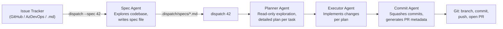
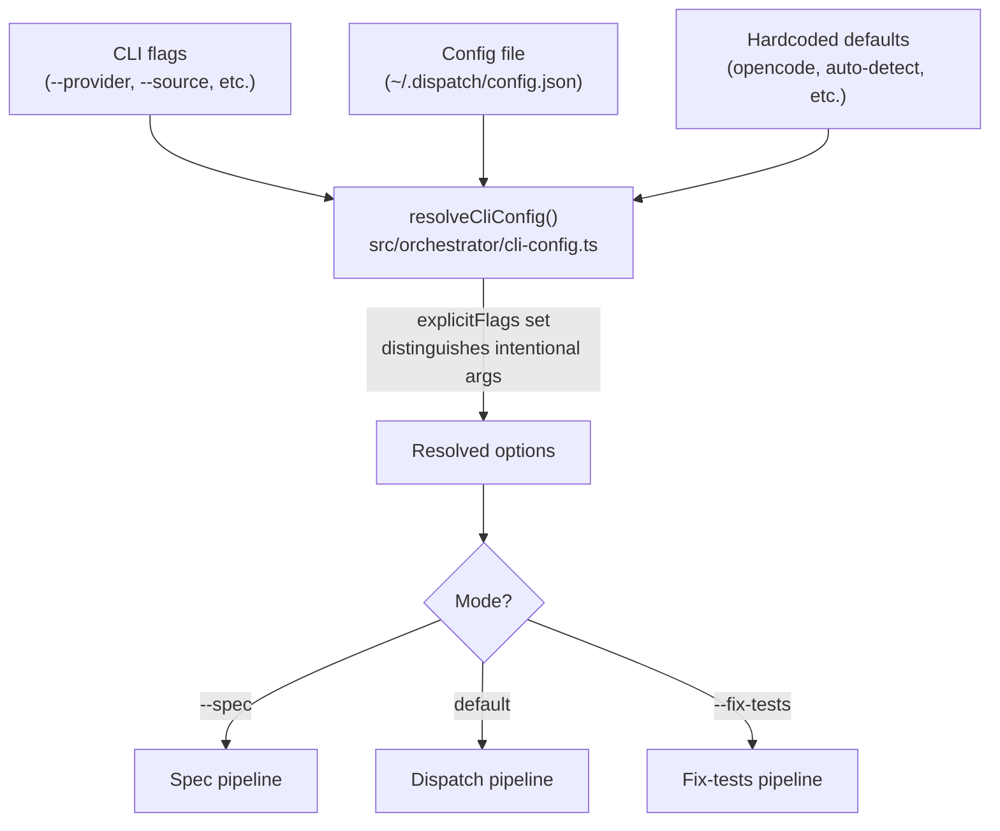
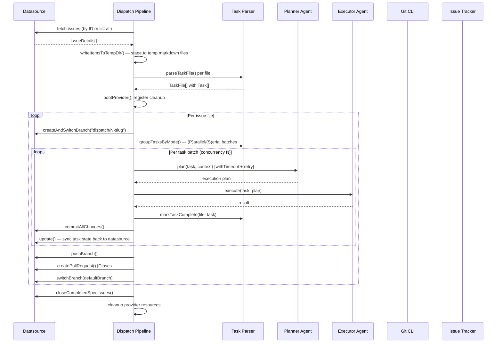
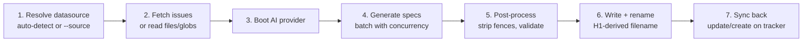

# Dispatch — Architecture Overview

Dispatch is a command-line tool that automates software engineering work by
delegating tasks from issue trackers to AI coding agents. It reads work items
from GitHub Issues, Azure DevOps Work Items, or local markdown files, converts
them into structured specification and task files, and orchestrates AI agents
(OpenCode or GitHub Copilot) to plan and execute each task — committing changes,
pushing branches, and opening pull requests automatically.

## Why Dispatch exists

Manual orchestration of AI coding agents is tedious when a project has many
small, well-defined units of work. Dispatch closes that gap by:

1. **Fetching issues** from the team's existing tracker (GitHub, Azure DevOps)
   or reading local markdown specs.
2. **Generating structured specs** via an AI agent that explores the codebase
   and produces strategic task lists.
3. **Planning and executing** each task through isolated AI sessions, with an
   optional two-phase planner-then-executor architecture for higher-quality
   results.
4. **Managing the full git lifecycle** — branching, committing with conventional
   commit messages, pushing, and opening pull requests that auto-close the
   originating issue.

The tool is backend-agnostic across three dimensions — issue trackers
(datasources), AI runtimes (providers), and agent roles — each implemented as
a strategy-pattern plugin behind a formal TypeScript interface.

## System architecture

```mermaid
C4Context
    title Dispatch — System Topology

    Person(dev, "Developer", "Runs dispatch CLI")

    System_Boundary(dispatch, "Dispatch CLI") {
        Container(cli, "CLI Entry Point", "src/cli.ts", "Argument parsing, signal handlers, config routing")
        Container(config, "Configuration", "src/config.ts, config-prompts.ts, orchestrator/cli-config.ts", "Persistent config (~/.dispatch/config.json), interactive wizard, three-tier merge")
        Container(runner, "Orchestrator Runner", "src/orchestrator/runner.ts", "Pipeline router: dispatch, spec, fix-tests modes")

        Container(spec_pipe, "Spec Pipeline", "src/orchestrator/spec-pipeline.ts", "Issue-to-spec generation with batch concurrency")
        Container(dispatch_pipe, "Dispatch Pipeline", "src/orchestrator/dispatch-pipeline.ts", "Task planning, execution, git lifecycle, PR creation")
        Container(fix_pipe, "Fix-Tests Pipeline", "src/orchestrator/fix-tests-pipeline.ts", "Detect and auto-fix failing tests via AI")

        Container(ds_layer, "Datasource Layer", "src/datasources/", "Unified CRUD + git lifecycle across backends")
        Container(prov_layer, "Provider Layer", "src/providers/", "AI runtime abstraction: boot, session, prompt, cleanup")
        Container(agent_layer, "Agent Layer", "src/agents/", "Planner, executor, spec, commit agent roles")

        Container(parser, "Task Parser", "src/parser.ts", "Markdown checkbox extraction, context filtering, completion marking")
        Container(specgen, "Spec Generator", "src/spec-generator.ts", "Input classification, post-processing, validation")
        Container(tui, "Terminal UI", "src/tui.ts", "Real-time progress dashboard with spinner and task list")
        Container(shared, "Shared Utilities", "src/helpers/cleanup.ts, logger.ts, format.ts, slugify.ts, helpers/timeout.ts, helpers/retry.ts", "Cleanup registry, logging, formatting, slugification, timeout, retry")
    }

    System_Ext(github, "GitHub", "Issues, PRs via gh CLI")
    System_Ext(azdevops, "Azure DevOps", "Work items, PRs via az CLI")
    System_Ext(localfs, "Local Filesystem", ".dispatch/specs/ markdown files")
    System_Ext(git, "Git CLI", "Branch, commit, push operations")
    System_Ext(opencode, "OpenCode", "AI agent runtime via @opencode-ai/sdk")
    System_Ext(copilot, "GitHub Copilot", "AI agent runtime via @github/copilot-sdk")

    Rel(dev, cli, "invokes")
    Rel(cli, config, "config subcommand")
    Rel(cli, runner, "delegates pipeline execution")
    Rel(runner, spec_pipe, "--spec / --respec")
    Rel(runner, dispatch_pipe, "default mode")
    Rel(runner, fix_pipe, "--fix-tests (dynamic import)")
    Rel(spec_pipe, ds_layer, "fetch, update, create")
    Rel(spec_pipe, prov_layer, "boot, session, prompt")
    Rel(spec_pipe, agent_layer, "spec agent")
    Rel(dispatch_pipe, ds_layer, "fetch, close, git lifecycle")
    Rel(dispatch_pipe, prov_layer, "boot, session, prompt")
    Rel(dispatch_pipe, agent_layer, "planner + executor + commit agents")
    Rel(dispatch_pipe, parser, "parse, mark complete, group by mode")
    Rel(dispatch_pipe, tui, "real-time progress")
    Rel(fix_pipe, prov_layer, "boot, session, prompt")
    Rel(ds_layer, github, "gh CLI")
    Rel(ds_layer, azdevops, "az CLI")
    Rel(ds_layer, localfs, "fs/promises")
    Rel(ds_layer, git, "git commands")
    Rel(prov_layer, opencode, "@opencode-ai/sdk")
    Rel(prov_layer, copilot, "@github/copilot-sdk")
```

## Pipeline modes

Dispatch operates in three mutually exclusive modes, routed by the
[orchestrator runner](cli-orchestration/orchestrator.md). Mode exclusion is
enforced by the orchestrator, not the argument parser.

| Mode | Trigger | Purpose | Detail page |
|------|---------|---------|-------------|
| **Spec generation** | `--spec` or `--respec` | Convert issues into structured markdown specs | [Spec generation](spec-generation/overview.md) |
| **Dispatch** | Default (no mode flag) | Plan and execute tasks, commit, push, open PRs | [Planning & dispatch](planning-and-dispatch/overview.md) |
| **Fix tests** | `--fix-tests` | Detect failing tests and prompt AI to fix them | [CLI orchestration](cli-orchestration/overview.md) |

The three-stage end-to-end workflow connects these modes:

| Stage | Command | Agent | Output |
|-------|---------|-------|--------|
| 1. Spec | `dispatch --spec 42,43` | [Spec agent](spec-generation/overview.md) | Structured markdown specs with `- [ ]` tasks |
| 2. Plan | `dispatch 42` | [Planner agent](planning-and-dispatch/planner.md) | Detailed execution plan per task |
| 3. Execute | (same command) | [Executor agent](planning-and-dispatch/dispatcher.md) | Code changes + conventional commits + PRs |

Stages 2 and 3 run within the same `dispatch` invocation. Stage 1 is a separate
invocation that produces the markdown files consumed by stages 2 and 3.

## Data flow

### Configuration resolution

User configuration flows through a [three-tier merge](cli-orchestration/configuration.md)
before reaching any pipeline:

The `explicitFlags` set tracks which CLI arguments were user-provided versus
defaulted, so config-file values fill gaps without overriding intentional flags.
See [configuration](cli-orchestration/configuration.md) for the full merge logic.

### Dispatch pipeline phases

The dispatch pipeline is a multi-phase workflow. Each phase has distinct error
handling and the pipeline manages per-issue git branch isolation:

For full phase details, see [dispatch pipeline](planning-and-dispatch/overview.md)
and [datasource helpers](datasource-system/datasource-helpers.md).

### Spec generation pipeline phases

When invoked with `--spec`, the pipeline converts issues into AI-generated
specification files:

Three input modes are supported: tracker issue IDs (`dispatch --spec 42,43`),
file/glob patterns (`dispatch --spec "drafts/*.md"`), and inline text
(`dispatch --spec "Add dark mode"`). The input type determines the
sync-back behavior. See [spec generation](spec-generation/overview.md) for
details.

## Key abstractions

Dispatch is built on three parallel strategy-pattern registries. Each has a
formal TypeScript interface, a static `Record<Name, BootFn>` map with
compile-time string literal union keys, and a boot/get function:

| Registry | Key type | Location | Extension guide |
|----------|----------|----------|-----------------|
| Providers | `ProviderName` (`"opencode"` \| `"copilot"` \| `"claude"` \| `"codex"`) | `src/providers/index.ts` | [Adding a provider](provider-system/adding-a-provider.md) |
| Agents | `AgentName` (`"planner"` \| `"executor"` \| `"spec"` \| `"commit"`) | `src/agents/index.ts` | `src/agents/interface.ts` docstring |
| Datasources | `DatasourceName` (`"github"` \| `"azdevops"` \| `"md"`) | `src/datasources/index.ts` | [Adding a datasource](datasource-system/overview.md#adding-a-new-datasource) |

### Datasource layer

The [datasource interface](datasource-system/overview.md) defines a twelve-method
contract covering five CRUD operations (`list`, `fetch`, `update`, `close`,
`create`) and seven git lifecycle operations (`getDefaultBranch`,
`buildBranchName`, `createAndSwitchBranch`, `switchBranch`, `pushBranch`,
`commitAllChanges`, `createPullRequest`).

| Datasource | Backend | Auth method | Detail page |
|------------|---------|-------------|-------------|
| `github` | `gh` CLI | `gh auth login` / `GH_TOKEN` | [GitHub datasource](datasource-system/github-datasource.md) |
| `azdevops` | `az` CLI + azure-devops extension | `az login` / PAT | [Azure DevOps datasource](datasource-system/azdevops-datasource.md) |
| `md` | Local filesystem (`fs/promises`) | None | [Markdown datasource](datasource-system/markdown-datasource.md) |

Auto-detection from `git remote get-url origin` matches `github.com`,
`dev.azure.com`, and `visualstudio.com` patterns. Both SSH and HTTPS URL
formats are supported. See [auto-detection](datasource-system/overview.md#auto-detection)
for limitations (no GitHub Enterprise, only checks `origin` remote).

All three implementations use a shared `dispatch/<number>-<slug>` branch naming
convention via [slugify](shared-utilities/slugify.md), and platform-specific
PR auto-close syntax (`Closes #N` for GitHub, `Resolves AB#N` for Azure DevOps).

### Provider layer

The [provider interface](provider-system/provider-overview.md) abstracts AI
agent runtimes behind a session-based lifecycle: `boot` → `createSession` →
`prompt` → `cleanup`.

| Provider | SDK | Prompt model | Detail page |
|----------|-----|-------------|-------------|
| `opencode` | `@opencode-ai/sdk` | Async (fire-and-forget + SSE events) | [OpenCode backend](provider-system/opencode-backend.md) |
| `copilot` | `@github/copilot-sdk` | Sync (blocking `sendAndWait`) | [Copilot backend](provider-system/copilot-backend.md) |

Each task gets an isolated session to prevent context leakage between tasks.
Providers manage their own server lifecycle (spawning or connecting to external
processes via `--server-url`). See
[session isolation](provider-system/provider-overview.md#session-isolation-model).

### Agent layer

Three [agent roles](planning-and-dispatch/overview.md) power the AI-driven
pipeline:

| Agent | Purpose | Key behavior | Detail page |
|-------|---------|-------------|-------------|
| **Spec** | Explore codebase, generate strategic specs | Writes to `.dispatch/tmp/` via AI, reads back, post-processes | [Spec generation](spec-generation/overview.md) |
| **Planner** | Read-only exploration, produce execution plan | Read-only enforcement via prompt instructions (not tool restrictions) | [Planner](planning-and-dispatch/planner.md) |
| **Executor** | Follow plan, make code changes | Gets plan context from planner output | [Dispatcher](planning-and-dispatch/dispatcher.md) |
| **Commit** | Generate commit message and PR metadata | Analyzes branch diff, squashes per-task commits into one | [Commit agent](planning-and-dispatch/commit-agent.md) |

The optional `--no-plan` flag bypasses the planner for simpler tasks.

## Cross-cutting concerns

### Authentication and secrets

Dispatch stores no credentials. Authentication is delegated entirely to
external CLI tools and SDKs:

| Backend | Auth mechanism | Managed by |
|---------|---------------|------------|
| GitHub datasource | `gh auth login`, `GH_TOKEN`, `GITHUB_TOKEN` env vars | [gh CLI](https://cli.github.com/manual/gh_auth_login) |
| Azure DevOps datasource | `az login`, PAT via `az devops login` | [az CLI](https://learn.microsoft.com/en-us/cli/azure/authenticate-azure-cli) |
| OpenCode provider | Server-level config; no credentials passed by dispatch | [OpenCode SDK](provider-system/opencode-backend.md) |
| Copilot provider | `COPILOT_GITHUB_TOKEN`, `GH_TOKEN`, `GITHUB_TOKEN`, or logged-in `gh` CLI user | [Copilot SDK](provider-system/copilot-backend.md) |

There is no secrets rotation mechanism within Dispatch. Token lifecycle is
managed by the underlying tools. For CI/CD environments, use environment
variables instead of interactive login. The only persistent data is
`~/.dispatch/config.json`, which contains user preferences but no secrets.
See [datasource integrations](datasource-system/integrations.md) and
[provider overview](provider-system/provider-overview.md).

### Process cleanup and graceful shutdown

The [cleanup registry](shared-types/cleanup.md) (`src/helpers/cleanup.ts`)
provides a safety net for resource teardown:

1. When a provider boots, its `cleanup()` is registered immediately via
   `registerCleanup()`.
2. On **normal completion**, the pipeline calls `cleanup()` explicitly.
3. On **signal exit** (SIGINT, SIGTERM), the CLI's signal handlers drain the
   registry via `runCleanup()`.
4. After draining, `cleanups.splice(0)` clears the array so repeated calls are
   harmless.

This dual-path design (explicit + registry) ensures spawned server processes
are terminated even on abnormal exit. Both providers handle double-cleanup
safely (OpenCode via a `cleaned` boolean guard, Copilot via error swallowing).
Exit codes follow Unix conventions: 0 for success, 1 for failures, 130 for
SIGINT, 143 for SIGTERM. See
[provider cleanup](provider-system/provider-overview.md#cleanup-and-resource-management).

### Error handling strategy

The system uses a consistent **catch-and-continue** pattern for batch
operations:

| Scenario | Behavior | Detail page |
|----------|----------|-------------|
| Issue fetch fails | Logged, skipped; others continue | [Spec generation](spec-generation/overview.md#error-handling-and-exit-codes) |
| Spec generation fails for one issue | `failed` counter incremented; others continue | [Spec generation](spec-generation/overview.md#error-handling-and-exit-codes) |
| Planner times out | Retried up to `--plan-retries` (default 1) with `--plan-timeout` (default 10 min) | [Orchestrator](cli-orchestration/orchestrator.md) |
| Executor returns null | Task marked failed; pipeline continues | [Dispatcher](planning-and-dispatch/dispatcher.md) |
| Commit agent fails | Fallback to heuristic PR title/body; per-task commits preserved | [Commit agent](planning-and-dispatch/commit-agent.md) |
| Datasource sync fails post-execution | Warning logged; task still counted as done | [Orchestrator](cli-orchestration/orchestrator.md) |
| Provider boot fails | Entire run aborts (misconfiguration — no retry) | [Provider error recovery](provider-system/provider-overview.md#error-recovery-on-boot-failure) |
| PR already exists for branch | Falls back to returning existing PR URL | [Datasource overview](datasource-system/overview.md#existing-pr-handling) |
| Config file corrupted | `loadConfig()` returns `{}` silently; defaults apply | [Configuration](cli-orchestration/configuration.md) |
| `execFile` target not found | `ENOENT` error; fetch/operation marked failed | [Datasource integrations](datasource-system/integrations.md) |

Exit code is `0` if all tasks/specs succeed, `1` if any fail. No distinction
between partial and total failure.

### Monitoring and observability

Dispatch provides two output modes with no external monitoring integration:

- **[TUI dashboard](cli-orchestration/tui.md)**: Real-time terminal rendering
  with spinner, progress bar, per-task status tracking, and elapsed time.
  Tracks both per-task states (pending → planning → running → done/failed) and
  global phase states (discovering → parsing → booting → dispatching → done).
- **[Logger](shared-types/logger.md)**: Structured chalk-formatted output with
  `--verbose` for debug-level messages. `formatErrorChain()` traverses nested
  `.cause` properties up to five levels. Active in dry-run, non-TTY, and spec
  generation contexts.

Color output is controlled by `FORCE_COLOR`, `NO_COLOR`, or `--no-color`. There
is no structured JSON log output, no metrics export, and no health checks for
AI providers.

### Concurrency model

Both pipelines support configurable concurrency:

- **Dispatch pipeline**: `--concurrency N` (default: `min(cpuCount, freeMB/500)`,
  at least 1) controls how many tasks run in parallel per batch via
  `Promise.all()`.
- **Spec pipeline**: Same default calculation, batch-concurrent generation.

Concurrent task execution (`--concurrency > 1`) introduces risks documented in
[architecture & concurrency](task-parsing/architecture-and-concurrency.md):

1. **Markdown file corruption**: `markTaskComplete` performs a read-modify-write
   cycle without file locking.
2. **Git commit cross-contamination**: `git add -A` stages all changes; one
   task's commit can include another's uncommitted work.

### Timeout, retry, and resilience

The planner agent is wrapped in [`withTimeout()`](shared-utilities/timeout.md)
with configurable bounds, and the executor agent is wrapped in
[`withRetry()`](shared-utilities/retry.md) for automatic retry on transient
failures:

| Setting | CLI flag | Default | Config key |
|---------|----------|---------|------------|
| Planning timeout | `--plan-timeout` | 10 minutes | `planTimeout` |
| Planning retries | `--plan-retries` | 1 | `planRetries` |
| Executor retries | (hardcoded) | 2 | -- |

On `TimeoutError`, the pipeline retries up to `maxPlanAttempts`. Non-timeout
errors break immediately. The executor uses `withRetry` with unconditional
retry on any error. Provider `prompt()` calls themselves have no timeout
or cancellation mechanism -- a hung agent blocks the pipeline indefinitely.

See [resilience overview](shared-utilities/resilience.md) for how cleanup,
timeout, and retry compose across all pipeline modes, and
[provider timeouts](provider-system/provider-overview.md#prompt-timeouts-and-cancellation)
for prompt-level considerations.

### External tool dependencies

Dispatch depends on external CLI tools at runtime. The
[prerequisite checker](shared-helpers/prereqs.md) (`src/helpers/prereqs.ts`)
validates tool availability at startup before any pipeline logic runs:

| Tool | Required when | Pre-flight check | Failure mode if unchecked |
|------|--------------|------------------|--------------------------|
| `git` | Always in dispatch mode | `git --version` | `commitTask()` throws |
| `gh` | GitHub datasource operations | `gh --version` (when datasource is `github`) | ENOENT from `execFile` |
| `az` + `azure-devops` extension | Azure DevOps operations | `az --version` (when datasource is `azdevops`) | ENOENT or "not a recognized command" |
| Node.js >= 20.12.0 | Always | `process.versions.node` semver check | Runtime errors |
| OpenCode CLI or server | `--provider opencode` | *(not checked by prereqs)* | `bootProvider()` throws |
| Copilot CLI | `--provider copilot` | *(not checked by prereqs)* | `client.start()` throws |

The prereq checker validates tool presence but **not** authentication status
(`gh auth status`, `az account show`) or CLI extension availability. See
[Prerequisite Checker](shared-helpers/prereqs.md) for details.

There are no subprocess timeouts on `execFile` calls (except the 10 MB
`maxBuffer` limit in the fix-tests pipeline). See
[datasource integrations](datasource-system/integrations.md).

### On-disk storage

| Location | Purpose | Lifecycle |
|----------|---------|-----------|
| `~/.dispatch/config.json` | Persistent user configuration | Manual via `dispatch config` or by deleting the file |
| `.dispatch/specs/` | Generated spec files; markdown datasource storage | Managed by datasource lifecycle |
| `.dispatch/specs/archive/` | Closed specs (markdown datasource) | Manual recovery via file move |
| `.dispatch/tmp/` | Temp spec files during AI generation (UUID-named) | Cleaned per-spec; may accumulate on crash |
| `.dispatch/tmp/commit-*.md` | Commit agent output files (UUID-named) | Written per-issue; may accumulate on crash |
| `.dispatch/run-state.json` | Execution state for resumable runs | Managed by [run-state](shared-helpers/run-state.md) module; should be gitignored |
| `/tmp/dispatch-*` | Temp directories for datasource-fetched issues | Cleaned on completion; orphaned on crash |

No external databases are used. All state is file-based.

### Shared data model

Two core interfaces flow through the entire pipeline:

- **`Task` / `TaskFile`** (`src/parser.ts`): Extracted from markdown checkboxes,
  consumed by the orchestrator, planner, executor, TUI, and git modules. See
  [task parsing](task-parsing/overview.md) and [parser types](shared-types/parser.md).
- **`IssueDetails`** (`src/datasources/interface.ts`): Normalized work item
  representation consumed by all datasource operations. Fields include `number`,
  `title`, `body`, `labels`, `state`, `url`, `comments`, and
  `acceptanceCriteria`. See [datasource overview](datasource-system/overview.md#the-issuedetails-interface).

The `(P)`/`(S)`/`(I)` prefix syntax on task text controls parallel, serial, and
isolated execution grouping via `groupTasksByMode()`. See
[markdown syntax](task-parsing/markdown-syntax.md).

## Key design decisions

### CLI tools over REST APIs

The GitHub and Azure DevOps datasources shell out to `gh` and `az` CLIs rather
than using REST client libraries. This reuses the user's existing
authentication, adds zero dependencies, and simplifies the implementation at
the cost of a runtime dependency on external binaries being installed. See
[datasource overview](datasource-system/overview.md#why-it-exists).

### Two-phase planner-then-executor

The optional planning phase uses a read-only AI session to explore the codebase
before the executor acts, producing higher-quality results. Read-only
enforcement is prompt-based (not tool-restricted) — a deliberate trade-off for
simplicity. See [planner agent](planning-and-dispatch/planner.md).

### Spec generation stays high-level

The spec agent intentionally avoids code-level details because the downstream
planner re-explores the codebase with individual task context. This prevents
duplication and keeps specs resilient to codebase changes between generation
and execution. See [spec generation](spec-generation/overview.md).

### Compile-time type unions

`ProviderName`, `DatasourceName`, and `AgentName` are string literal union types
rather than runtime-discovered plugins. This provides TypeScript exhaustiveness
checking at the cost of requiring a code change to add new backends — acceptable
for a system with two providers and three datasources. See
[provider types](shared-types/provider.md).

### Session-per-task isolation

Each task gets an isolated provider session. Sessions share the filesystem but
not conversation context, preventing context rot while allowing tasks to operate
on the same codebase. See
[session isolation](provider-system/provider-overview.md#session-isolation-model).

### Markdown as the source of truth

Plain markdown files with GitHub-style checkboxes serve as the intermediate
format between specs and execution. This makes task files human-readable,
version-controllable, and editable. The parser normalizes CRLF to LF and always
writes LF line endings. See [task parsing](task-parsing/overview.md).

### Automatic conventional commit inference

After each task completes, `git.ts` stages all changes (`git add -A`) and
creates a conventional commit. The commit type (`feat`, `fix`, `docs`,
`refactor`, etc.) is inferred from the task text via regex patterns. After all
tasks complete, the [commit agent](planning-and-dispatch/commit-agent.md)
analyzes the full branch diff and squashes these per-task commits into a single
AI-generated conventional commit with a PR title and description. See
[git operations](planning-and-dispatch/git.md) and
[commit agent](planning-and-dispatch/commit-agent.md).

### Three-tier configuration precedence

CLI flags override config file values (`~/.dispatch/config.json`), which
override hardcoded defaults. An interactive wizard (`dispatch config`) guides
first-time setup with conditional prompts based on datasource selection. See
[configuration](cli-orchestration/configuration.md).

## Infrastructure

### Runtime requirements

| Requirement | Version | Purpose |
|-------------|---------|---------|
| Node.js | >= 20.12.0 | Runtime (ESM-only, `"type": "module"`) |
| Git | Any | Auto-detection, conventional commits, branch lifecycle |
| `gh` CLI | Any | GitHub datasource (required only if using GitHub) |
| `az` CLI + azure-devops extension | Any | Azure DevOps datasource (required only if using AzDevOps) |
| OpenCode or Copilot runtime | Varies | AI agent backend (at least one required) |

### Dependencies

| Package | Purpose |
|---------|---------|
| `@opencode-ai/sdk` | OpenCode AI agent SDK |
| `@github/copilot-sdk` | GitHub Copilot agent SDK |
| `@inquirer/prompts` | Interactive configuration wizard |
| `chalk` | Terminal color styling (ESM-only) |
| `glob` | File pattern matching |

### Build and test

| Command | Purpose |
|---------|---------|
| `npm run build` | Build with tsup |
| `npm test` | Run tests with Vitest (`vitest run`) |
| `npm run test:watch` | Watch mode tests |

The project uses [Vitest](https://vitest.dev/) v4 with ~2,378 lines of test
code covering six production modules. Tests use real filesystem I/O (temp
directories via `mkdtemp()`) rather than mocks, and fake timers for
timeout-related tests. Modules interacting with external services are not
unit-tested. See [testing overview](testing/overview.md).

### Deprecated compatibility layer

The `IssueFetcher` interface and `src/issue-fetchers/` modules are deprecated
shims that delegate to the [datasource](datasource-system/overview.md) layer.
No code outside the deprecated layer imports from these paths. All exports are
marked `@deprecated` and slated for removal. See
[deprecated compatibility](deprecated-compat/overview.md) for migration
guidance and removal safety assessment.

## Component index

### Core pipelines

- [CLI & orchestration](cli-orchestration/overview.md) — Entry point, argument
  parsing, pipeline routing, TUI
  - [CLI reference](cli-orchestration/cli.md)
  - [Configuration](cli-orchestration/configuration.md)
  - [Orchestrator](cli-orchestration/orchestrator.md)
  - [Terminal UI](cli-orchestration/tui.md)
  - [Integrations](cli-orchestration/integrations.md)
- [Spec generation](spec-generation/overview.md) — Issue-to-spec pipeline
  - [Integrations](spec-generation/integrations.md)
- [Planning & dispatch](planning-and-dispatch/overview.md) — Task execution
  engine
  - [Planner agent](planning-and-dispatch/planner.md)
  - [Dispatcher](planning-and-dispatch/dispatcher.md)
  - [Commit agent](planning-and-dispatch/commit-agent.md)
  - [Git operations](planning-and-dispatch/git.md)
  - [Task context & lifecycle](planning-and-dispatch/task-context-and-lifecycle.md)
  - [Integrations](planning-and-dispatch/integrations.md)

### Extensible backends

- [Datasource system](datasource-system/overview.md) — GitHub, Azure DevOps,
  markdown implementations
  - [GitHub datasource](datasource-system/github-datasource.md)
  - [Azure DevOps datasource](datasource-system/azdevops-datasource.md)
  - [Markdown datasource](datasource-system/markdown-datasource.md)
  - [Datasource helpers](datasource-system/datasource-helpers.md)
  - [Integrations](datasource-system/integrations.md)
  - [Testing](datasource-system/testing.md)
- [Provider system](provider-system/provider-overview.md) — OpenCode and
  Copilot AI runtime backends
  - [OpenCode backend](provider-system/opencode-backend.md)
  - [Copilot backend](provider-system/copilot-backend.md)
  - [Adding a provider](provider-system/adding-a-provider.md)

### Data layer

- [Task parsing & markdown](task-parsing/overview.md) — Checkbox extraction,
  context filtering, completion marking
  - [Markdown syntax](task-parsing/markdown-syntax.md)
  - [API reference](task-parsing/api-reference.md)
  - [Architecture & concurrency](task-parsing/architecture-and-concurrency.md)
  - [Testing guide](task-parsing/testing-guide.md)

### Shared infrastructure

- [Shared types & interfaces](shared-types/overview.md) — Foundational
  contracts every module depends on
  - [Cleanup registry](shared-types/cleanup.md)
  - [Format utilities](shared-types/format.md)
  - [Logger](shared-types/logger.md)
  - [Parser types](shared-types/parser.md)
  - [Provider interface](shared-types/provider.md)
  - [Integrations](shared-types/integrations.md)
- [Shared utilities](shared-utilities/overview.md) — Slugify, timeout, and retry
  - [Slugify](shared-utilities/slugify.md)
  - [Timeout](shared-utilities/timeout.md)
  - [Retry](shared-utilities/retry.md)
  - [Resilience overview](shared-utilities/resilience.md)
  - [Testing](shared-utilities/testing.md)
- [Shared helpers](shared-helpers/prereqs.md) — Prerequisite checking,
  batch confirmation, run state persistence
  - [Prerequisite Checker](shared-helpers/prereqs.md)
  - [Confirm Large Batch](shared-helpers/confirm-large-batch.md)
  - [Run State](shared-helpers/run-state.md)

### Testing

- [Testing overview](testing/overview.md) — Vitest framework, strategy,
  coverage map
  - [Config tests](testing/config-tests.md)
  - [Format tests](testing/format-tests.md)
  - [Parser tests](testing/parser-tests.md)
  - [Spec generator tests](testing/spec-generator-tests.md)
  - [Shared helpers tests](testing/shared-helpers-tests.md)

### Deprecated

- [Deprecated compatibility layer](deprecated-compat/overview.md) —
  `IssueFetcher` shims delegating to datasource system
- [Issue fetching (legacy)](issue-fetching/overview.md) — Superseded by the
  datasource system
  - [GitHub fetcher](issue-fetching/github-fetcher.md) (deprecated)
  - [Azure DevOps fetcher](issue-fetching/azdevops-fetcher.md) (deprecated)
  - [Adding a fetcher](issue-fetching/adding-a-fetcher.md) (deprecated)
