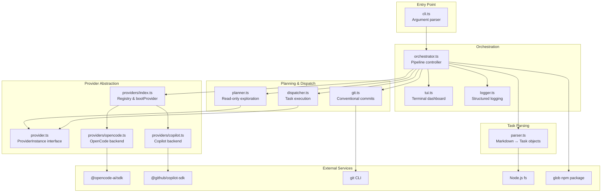
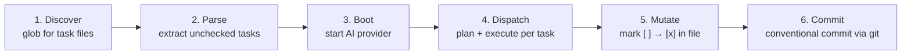
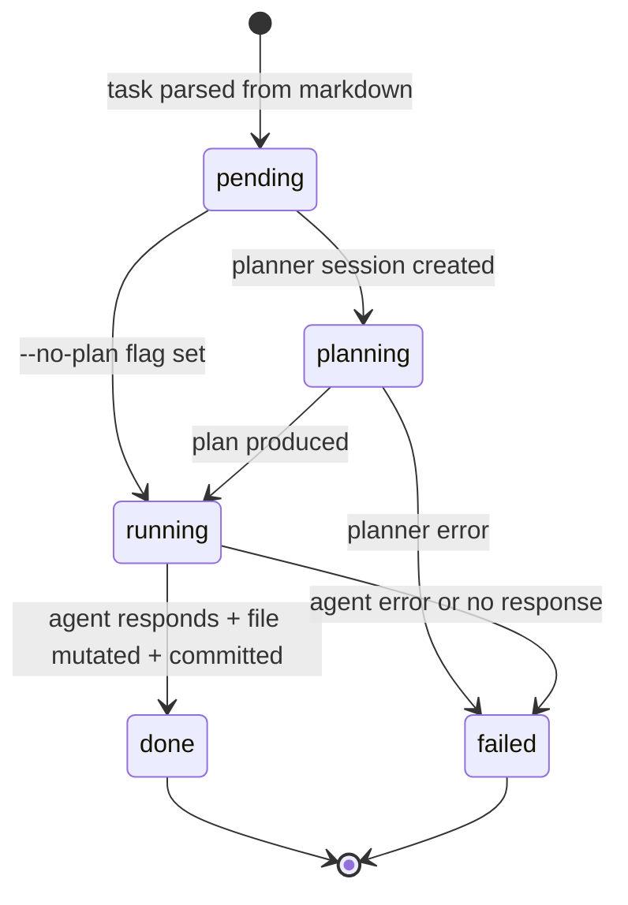
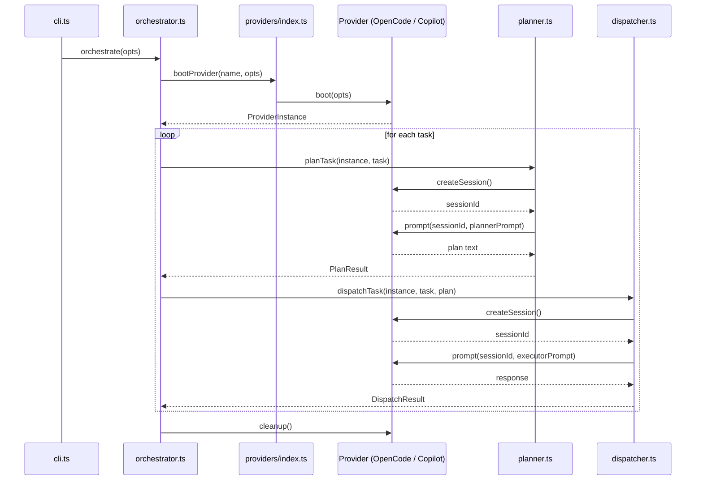

# dispatch-tasks -- Architecture Overview

## What is dispatch-tasks?

dispatch-tasks is a Node.js CLI tool that reads markdown task files containing
GitHub-style checkbox items (`- [ ] do something`), dispatches each task to an
AI coding agent in an isolated session, marks the task complete in the source
file, and creates a conventional commit for the result. It turns a simple
checklist into an automated, agent-driven development pipeline.

## Why does it exist?

Manual orchestration of AI coding agents is tedious when a project has many
small, well-defined units of work. dispatch-tasks solves three problems:

1. **Context isolation** -- each task runs in a fresh agent session so context
   from one task does not leak into another.
2. **Precision through planning** -- an optional two-phase pipeline lets a
   read-only planner agent explore the codebase first, producing a focused
   execution plan that the executor agent follows.
3. **Automated record-keeping** -- after each task, the markdown file is
   updated and a conventional commit is created, giving a clean, reviewable
   git history tied directly to the original task list.

## System topology

The diagram below shows every module in the source tree and how they relate.
The CLI validates input and delegates to the orchestrator, which drives a
six-stage pipeline through the parser, provider, planner, dispatcher, and git
modules. The TUI and logger provide output for interactive and non-interactive
contexts respectively.

## Pipeline data flow

Every `dispatch` invocation follows a six-stage pipeline. The orchestrator
drives the stages sequentially, with configurable concurrency in stage 4.

### Stage details

| Stage | Module | What happens |
|-------|--------|-------------|
| Discover | `src/orchestrator.ts` | Glob pattern resolves to absolute file paths. |
| Parse | `src/parser.ts` | Each file is read and regex-matched for `- [ ] ...` lines, producing `Task` and `TaskFile` objects. |
| Boot | `src/providers/index.ts` | The selected provider (OpenCode or Copilot) is booted via the registry. |
| Dispatch | `src/planner.ts`, `src/dispatcher.ts` | Per task: optionally run the planner agent in a fresh session, then run the executor agent in another fresh session. Batched via `Promise.all` with configurable concurrency. |
| Mutate | `src/parser.ts` | `markTaskComplete` re-reads the file, validates the target line, replaces `[ ]` with `[x]`, and writes back. |
| Commit | `src/git.ts` | `git add -A`, check for staged changes, `git commit -m "<type>: <subject>"` with inferred conventional commit type. |

For the full prompt construction chain (how task text becomes a planner prompt,
then an executor prompt), see the
[Planning & Dispatch overview](planning-and-dispatch/overview.md).

## Task lifecycle

Each task transitions through a state machine as it moves through the pipeline.
The `--no-plan` flag bypasses the planning state.

The TUI tracks both this per-task state machine and a global phase state
machine (discovering, parsing, booting, dispatching, done). See the
[TUI documentation](cli-orchestration/tui.md) for rendering details.

## Provider abstraction

The `ProviderInstance` interface (`src/provider.ts`) defines a four-method
lifecycle that decouples the pipeline from any specific AI runtime:

Currently two backends are implemented:

| Backend | SDK | Session model | Default connection |
|---------|-----|---------------|-------------------|
| OpenCode | `@opencode-ai/sdk` v1.2.10 | Server-side (SDK manages sessions) | Local server on `127.0.0.1:4096` |
| Copilot | `@github/copilot-sdk` v0.1.0 | Client-side (`Map<string, CopilotSession>`) | Auto-discovers Copilot CLI |

Both support `--server-url` to connect to an already-running server instead of
spawning one. For backend-specific setup and troubleshooting, see the
[Provider System documentation](provider-system/provider-overview.md).

## Key design decisions

### Two-phase planner-then-executor

Tasks are optionally processed in two phases: a planner agent explores the
codebase in a read-only session and produces a detailed execution plan, then an
executor agent follows that plan to make changes. This separation improves
precision because the executor receives focused, context-rich instructions
rather than a bare task description. The `--no-plan` flag skips the planning
phase for simple tasks or faster iteration.

**Planner read-only enforcement is prompt-only.** Neither the OpenCode nor
Copilot SDKs expose capability restrictions, so the planner's read-only
behavior relies on prompt instructions. See the
[Planner documentation](planning-and-dispatch/planner.md) for details.

### Session-per-task isolation

Every task gets a fresh provider session for both planning and execution. This
prevents context leakage between tasks and avoids context window exhaustion.
Sessions share the filesystem and environment variables but have isolated
conversation histories. See the
[Dispatcher documentation](planning-and-dispatch/dispatcher.md).

### Compile-time provider registry

Providers are registered in a static `Record<ProviderName, BootFn>` map rather
than a runtime plugin system. The `ProviderName` type is a string literal union
(`"opencode" | "copilot"`), giving compile-time exhaustiveness checks and
eliminating the need for runtime discovery, dynamic imports, or a plugin API.
The trade-off is that adding a new provider requires a code change. See the
[Adding a Provider guide](provider-system/adding-a-provider.md).

### Context filtering for planner agents

When the planner receives a task file, `buildTaskContext()` strips all sibling
unchecked tasks from the file content while preserving headings, prose, notes,
and the target task. This prevents the planner from being confused by tasks
assigned to other agents. See the
[Task Context and Lifecycle page](planning-and-dispatch/task-context-and-lifecycle.md).

### Automatic conventional commit inference

After each task completes, `git.ts` stages all changes and creates a
conventional commit. The commit type (feat, fix, docs, refactor, test, chore,
style, perf, ci) is inferred from the task text via cascading regex patterns.
The type cannot be overridden by the task author. See the
[Git documentation](planning-and-dispatch/git.md).

### Batch-sequential concurrency

The orchestrator processes tasks in batches of size `--concurrency` (default 1)
using `Promise.all`. This is not work-stealing or backpressure-aware -- when a
batch finishes, the next batch starts. See the
[Orchestrator documentation](cli-orchestration/orchestrator.md).

## Cross-cutting concerns

This section surfaces system-wide patterns and known gaps that span multiple
modules. Each concern links to the feature pages where it is discussed in
detail.

### Concurrency and file safety

Concurrent task execution (`--concurrency > 1`) introduces two classes of risk:

1. **Markdown file corruption.** `markTaskComplete` performs a
   read-modify-write cycle without file locking. If two tasks from the same
   file complete simultaneously, one write can overwrite the other. See the
   [Architecture and Concurrency analysis](task-parsing/architecture-and-concurrency.md).

2. **Git commit cross-contamination.** `git add -A` stages *all* changes in the
   working directory. With concurrent tasks, one task's commit can accidentally
   include another task's uncommitted changes. The safe default is
   `--concurrency 1`. See the [Git documentation](planning-and-dispatch/git.md).

### Error handling and recovery

Error handling follows a "catch and continue" pattern at the task level but has
known gaps at the pipeline level:

- **Task-level failures** are caught and recorded as `{ success: false, error }`.
  A failed task does not block other tasks in the same batch.
  See the [Dispatcher documentation](planning-and-dispatch/dispatcher.md).

- **Provider cleanup gap.** `instance.cleanup()` is only called on the success
  path in `orchestrate()`. If an error occurs mid-dispatch, the catch block
  does not call cleanup, potentially leaving orphaned provider server processes.
  See the [Orchestrator documentation](cli-orchestration/orchestrator.md).

- **Markdown-then-commit failure.** If `commitTask()` fails after
  `markTaskComplete()` succeeds, the markdown file is left in a
  modified-but-uncommitted state with no rollback.
  See the [Orchestrator documentation](cli-orchestration/orchestrator.md).

- **No timeout or cancellation.** Neither the `ProviderInstance` interface nor
  either backend exposes a timeout or cancellation mechanism for `prompt()`
  calls. A hung agent blocks the pipeline indefinitely.
  See the [Provider overview](provider-system/provider-overview.md).

### Authentication and secrets

Authentication is provider-specific and managed entirely by the underlying SDKs:

- **OpenCode** connects to a local server process; no explicit credentials are
  passed by dispatch-tasks. The LLM provider configuration lives in the
  OpenCode CLI's own config.
  See the [OpenCode backend documentation](provider-system/opencode-backend.md).

- **Copilot** supports four authentication methods with a defined precedence
  order: Copilot CLI login, `COPILOT_GITHUB_TOKEN`, `GH_TOKEN`, `GITHUB_TOKEN`.
  Token rotation is the user's responsibility.
  See the [Copilot backend documentation](provider-system/copilot-backend.md).

dispatch-tasks does not manage, store, or rotate secrets itself.

### Monitoring and observability

dispatch-tasks has minimal observability:

- **TUI** provides real-time progress during interactive runs (spinner, progress
  bar, per-task status, elapsed time). It uses raw ANSI escape codes and does
  **not** degrade gracefully in non-TTY environments (CI, piped output).
  See the [TUI documentation](cli-orchestration/tui.md).

- **Logger** writes chalk-styled messages to stdout/stderr. There is no
  structured JSON output, no log-level filtering, no file transport, and no
  timestamps. See the [Logger documentation](shared-types/logger.md).

- **No health checks** for the backing AI provider exist at the dispatch level.
  Provider failures surface only when a `prompt()` call fails.
  See the [Integrations page](planning-and-dispatch/integrations.md).

- **No signal handling.** `SIGINT` and `SIGTERM` cause immediate process
  termination without provider cleanup or TUI teardown.
  See the [CLI Integrations page](cli-orchestration/integrations.md).

### File encoding and line endings

The parser normalizes CRLF to LF during both `parseTaskContent` and
`buildTaskContext`. However, `markTaskComplete` always writes LF line endings
regardless of the original file's style. All file I/O assumes UTF-8 encoding
with no BOM handling.
See the [Markdown Syntax reference](task-parsing/markdown-syntax.md).

### Shared data model

The `Task` and `TaskFile` interfaces defined in `src/parser.ts` are the shared
data model consumed by every module in the pipeline. They are imported directly
-- there is no barrel file or re-export layer.

| Consumer | What it imports | How it uses it |
|----------|----------------|----------------|
| Orchestrator | `Task`, `TaskFile`, `parseTaskFile`, `markTaskComplete`, `buildTaskContext` | Drives the full lifecycle |
| Planner | `Task` | Builds the planning prompt |
| Dispatcher | `Task` | Builds the execution prompt |
| TUI | `Task` | Displays task text and status |
| Git | `Task` | Builds conventional commit messages |

See the [Shared Types overview](shared-types/overview.md) and the
[Task Parsing overview](task-parsing/overview.md).

## Infrastructure

### Runtime

- **Node.js >= 18** (ESM-only, `"type": "module"` in `package.json`)
- **Build tool:** tsup (single entry point, ESM output, Node 18 target, shebang
  banner for CLI binary)
- **Test runner:** Vitest v4.x (default configuration, no custom config file)

### Dependencies

| Package | Version | Purpose |
|---------|---------|---------|
| `@opencode-ai/sdk` | ^1.2.10 | OpenCode AI agent SDK |
| `@github/copilot-sdk` | ^0.1.0 | GitHub Copilot agent SDK |
| `chalk` | ^5.4.1 | Terminal color styling (ESM-only) |
| `glob` | ^11.0.1 | File pattern matching |

### External tools

- **git** -- must be installed and on PATH. Used via `execFile` (no shell).
- **OpenCode CLI** or **Copilot CLI** -- at least one must be installed
  depending on the chosen provider.

## Component index

### [CLI & Orchestration](cli-orchestration/overview.md)

The entry point and pipeline controller. Parses arguments, drives the
six-stage pipeline, and provides visual feedback.

- [CLI argument parser](cli-orchestration/cli.md)
- [Orchestrator pipeline](cli-orchestration/orchestrator.md)
- [Terminal UI](cli-orchestration/tui.md)
- [Integrations](cli-orchestration/integrations.md)

### [Task Parsing & Markdown](task-parsing/overview.md)

The foundational data extraction and mutation layer. Parses markdown checkbox
syntax into structured objects and writes completions back.

- [Markdown syntax reference](task-parsing/markdown-syntax.md)
- [API reference](task-parsing/api-reference.md)
- [Architecture and concurrency](task-parsing/architecture-and-concurrency.md)
- [Testing guide](task-parsing/testing-guide.md)

### [Planning & Dispatch Pipeline](planning-and-dispatch/overview.md)

The core task execution engine. Plans tasks, dispatches them to agents,
and records results via git.

- [Planner agent](planning-and-dispatch/planner.md)
- [Dispatcher](planning-and-dispatch/dispatcher.md)
- [Git operations](planning-and-dispatch/git.md)
- [Task context and lifecycle](planning-and-dispatch/task-context-and-lifecycle.md)
- [Integrations](planning-and-dispatch/integrations.md)

### [Provider Abstraction & Backends](provider-system/provider-overview.md)

The strategy pattern that decouples the pipeline from specific AI runtimes.

- [OpenCode backend](provider-system/opencode-backend.md)
- [Copilot backend](provider-system/copilot-backend.md)
- [Adding a provider](provider-system/adding-a-provider.md)

### [Shared Interfaces & Utilities](shared-types/overview.md)

The foundational contracts and utilities that every other module depends on.

- [Logger](shared-types/logger.md)
- [Parser types](shared-types/parser.md)
- [Provider interface](shared-types/provider.md)
- [Integrations](shared-types/integrations.md)
