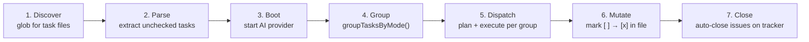
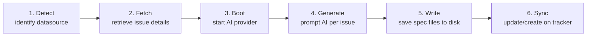
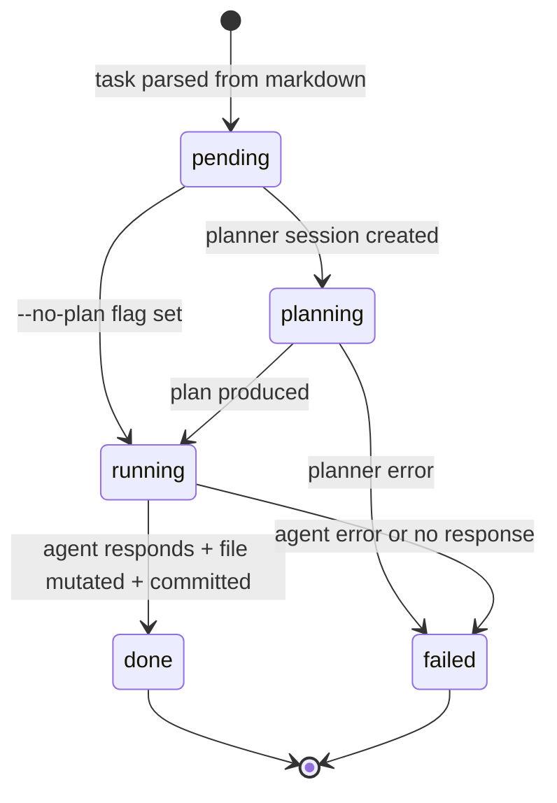
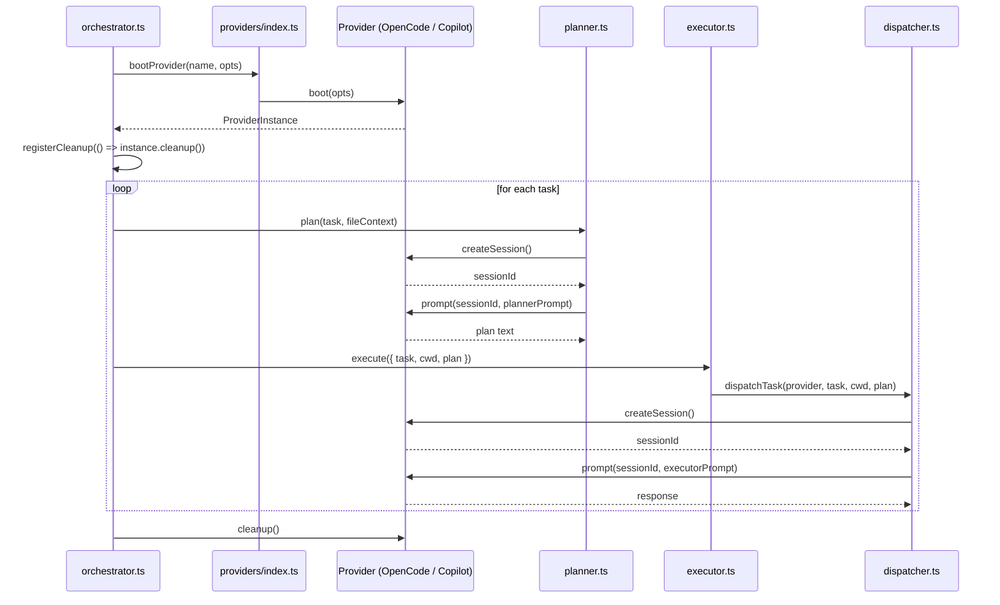

# dispatch-tasks -- Architecture Overview

dispatch-tasks is a Node.js CLI tool that orchestrates AI coding agents to
implement software tasks described in markdown files. It bridges issue trackers
(GitHub Issues, Azure DevOps Work Items) and AI agent runtimes (OpenCode, GitHub
Copilot) through a multi-stage pipeline: fetch issues, generate structured specs,
parse tasks, plan execution, dispatch to AI agents, and commit results.

## Why it exists

Manual orchestration of AI coding agents is tedious when a project has many
small, well-defined units of work. dispatch-tasks solves three problems:

1. **Context isolation** -- each task runs in a fresh agent session so context
   from one task does not leak into another.
2. **Precision through planning** -- an optional two-phase pipeline lets a
   read-only planner agent explore the codebase first, producing a focused
   execution plan that the executor agent follows.
3. **Automated record-keeping** -- after each task, the markdown file is
   updated and a conventional commit is created, giving a clean, reviewable
   git history tied directly to the original task list.

The tool is backend-agnostic: it supports multiple issue trackers via the
[datasource abstraction](datasource-system/overview.md) and multiple AI runtimes
via the [provider abstraction](provider-system/provider-overview.md), letting
teams use their existing tools without lock-in.

## System topology

The following diagram shows every major component and its relationships. Data
flows from external issue trackers through the datasource layer, into the
orchestrator pipelines, through AI provider sessions, and back to the filesystem
and issue trackers.

```mermaid
C4Context
    title dispatch-tasks -- System Topology

    Person(user, "Developer", "Runs the dispatch CLI")

    System_Boundary(dispatch, "dispatch-tasks") {

        Container(cli, "CLI Entry Point", "src/cli.ts", "Parses arguments, routes to orchestrator or config subcommand")
        Container(config, "Configuration", "src/config.ts + orchestrator/cli-config.ts", "Three-tier merge: CLI flags > ~/.dispatch/config.json > defaults")
        Container(orchestrator, "Orchestrator", "src/agents/orchestrator.ts", "Pipeline coordinator: routes to dispatch or spec pipeline")

        Container(spec_pipeline, "Spec Pipeline", "src/orchestrator/spec-pipeline.ts", "Fetches issues, generates specs via AI, syncs back to datasource")
        Container(dispatch_pipeline, "Dispatch Pipeline", "src/orchestrator/dispatch-pipeline.ts", "Discovers tasks, plans, executes, marks complete, commits")

        Container(ds_registry, "Datasource Layer", "src/datasource.ts + src/datasources/", "Strategy pattern: GitHub (gh CLI), AzDevOps (az CLI), Markdown (fs)")
        Container(provider_registry, "Provider Layer", "src/provider.ts + src/providers/", "Strategy pattern: OpenCode (@opencode-ai/sdk), Copilot (@github/copilot-sdk)")

        Container(agents, "Agent System", "src/agent.ts + src/agents/", "Planner, Executor, Spec agents with shared Agent interface")
        Container(parser, "Task Parser", "src/parser.ts", "Extracts tasks from markdown checkboxes, marks complete")
        Container(git, "Git Operations", "src/git.ts", "Stages changes and commits with conventional messages")
        Container(tui, "TUI / Logger", "src/tui.ts + src/logger.ts", "Real-time terminal dashboard or structured log output")
        Container(cleanup, "Cleanup Registry", "src/cleanup.ts", "Process-level resource teardown on exit/signal")
    }

    System_Ext(github, "GitHub", "Issues via gh CLI")
    System_Ext(azdevops, "Azure DevOps", "Work Items via az CLI")
    System_Ext(filesystem, "Local Filesystem", ".dispatch/specs/ markdown files")
    System_Ext(opencode, "OpenCode Runtime", "AI agent via @opencode-ai/sdk")
    System_Ext(copilot, "GitHub Copilot", "AI agent via @github/copilot-sdk")
    System_Ext(git_ext, "Git CLI", "Version control operations")

    Rel(user, cli, "dispatch [options]")
    Rel(cli, config, "dispatch config set/get/list")
    Rel(cli, orchestrator, "bootOrchestrator + runFromCli")
    Rel(orchestrator, spec_pipeline, "--spec mode")
    Rel(orchestrator, dispatch_pipeline, "default mode")
    Rel(spec_pipeline, ds_registry, "fetch / update / create issues")
    Rel(spec_pipeline, provider_registry, "boot AI provider")
    Rel(spec_pipeline, agents, "spec agent generates specs")
    Rel(dispatch_pipeline, parser, "parseTaskFile, markTaskComplete")
    Rel(dispatch_pipeline, agents, "planner + executor agents")
    Rel(dispatch_pipeline, git, "commitTask per completed task")
    Rel(dispatch_pipeline, tui, "real-time progress updates")
    Rel(dispatch_pipeline, ds_registry, "sync / close completed issues")
    Rel(agents, provider_registry, "createSession / prompt / cleanup")
    Rel(ds_registry, github, "gh issue view/list/edit/close/create")
    Rel(ds_registry, azdevops, "az boards work-item show/update/create/query")
    Rel(ds_registry, filesystem, "readFile / writeFile / readdir / rename")
    Rel(provider_registry, opencode, "HTTP + SSE sessions")
    Rel(provider_registry, copilot, "JSON-RPC sessions")
    Rel(git, git_ext, "git add -A / git commit")
    Rel(orchestrator, cleanup, "registerCleanup on provider boot")
```



## End-to-end data flow

dispatch-tasks operates in two modes, selected by the presence of the `--spec`
flag. Both modes share the same CLI entry point, configuration system, datasource
layer, and provider layer.

```mermaid
flowchart TD
    subgraph "User Input"
        CLI["dispatch CLI<br/>src/cli.ts"]
    end

    CLI --> CONFIG["Config Resolution<br/>CLI flags > config file > defaults<br/>src/orchestrator/cli-config.ts"]
    CONFIG --> ROUTE{"--spec<br/>provided?"}

    ROUTE -->|Yes| SPEC_MODE
    ROUTE -->|No| DISPATCH_MODE

    subgraph SPEC_MODE["Spec Generation Pipeline"]
        direction TB
        S1["1. Resolve datasource<br/>(auto-detect from git remote or --source)"]
        S2["2. Fetch issues from tracker<br/>or read local .md files via glob"]
        S3["3. Boot AI provider<br/>(OpenCode or Copilot)"]
        S4["4. For each issue:<br/>create session, prompt AI,<br/>post-process and validate spec"]
        S5["5. Write spec to .dispatch/specs/<br/><id>-<slug>.md"]
        S6["6. Sync back to datasource<br/>(update existing or create new issue)"]
        S1 --> S2 --> S3 --> S4 --> S5 --> S6
    end

    subgraph DISPATCH_MODE["Dispatch Pipeline"]
        direction TB
        D1["1. Discover task files<br/>(glob pattern or datasource fetch)"]
        D2["2. Parse markdown tasks<br/>(extract unchecked checkboxes)"]
        D3["3. Boot AI provider"]
        D4["4. Group tasks by mode<br/>(P)arallel / (S)erial batches"]
        D5["5. For each batch:"]
        D6["Plan task<br/>(optional planner agent)"]
        D7["Execute task<br/>(executor agent)"]
        D8["Mark complete in .md<br/>([ ] to [x])"]
        D9["Git commit<br/>(conventional commit)"]
        D10["Sync to datasource<br/>(update/close issue)"]
        D1 --> D2 --> D3 --> D4 --> D5
        D5 --> D6 --> D7 --> D8 --> D9 --> D10
        D10 -->|"next batch"| D5
    end

    SPEC_MODE -->|"produces .md task files"| DISPATCH_MODE
```



### The three-stage pipeline

The full end-to-end workflow is a three-stage pipeline where each stage uses a
different AI agent role:

| Stage | Command | Agent | Input | Output |
|-------|---------|-------|-------|--------|
| 1. Spec | `dispatch --spec 42,43` | [Spec agent](spec-generation/overview.md) | Issue tracker items | Structured markdown specs with `- [ ]` tasks |
| 2. Plan | `dispatch ".dispatch/specs/*.md"` | [Planner agent](planning-and-dispatch/planner.md) | Individual task + codebase | Detailed execution plan |
| 3. Execute | (same command) | [Executor agent](planning-and-dispatch/dispatcher.md) | Task + plan | Code changes + conventional commits |

Stages 2 and 3 run within the same `dispatch` invocation. Stage 1 is a separate
invocation that produces the markdown files consumed by stages 2 and 3.

```bash
# Stage 1: Generate specs from issues
dispatch --spec 42,43,44

# Stage 2+3: Execute the generated specs
dispatch ".dispatch/specs/*.md"
```

## Pipeline data flow: dispatch mode

Every `dispatch` invocation in default mode follows a seven-stage pipeline. The
orchestrator drives the stages sequentially, with configurable concurrency in
stage 5. Tasks are partitioned into execution groups by their `(P)` / `(S)` mode
prefix before dispatch begins.



| Stage | Module | What happens |
|-------|--------|-------------|
| Discover | `src/agents/orchestrator.ts` | Glob pattern resolves to absolute file paths, sorted by leading filename digits. |
| Parse | `src/parser.ts` | Each file is read and regex-matched for `- [ ] ...` lines, producing `Task` and `TaskFile` objects. See [Task Parsing](task-parsing/overview.md). |
| Boot | `src/providers/index.ts` | The selected provider (OpenCode or Copilot) is booted via the registry. Provider cleanup is registered with `registerCleanup()`. See [Provider System](provider-system/provider-overview.md). |
| Group | `src/parser.ts` | `groupTasksByMode()` partitions tasks into contiguous groups of same-mode `(P)` or `(S)` tasks. See [Task Parsing API](task-parsing/api-reference.md). |
| Dispatch | `src/agents/orchestrator.ts` | Per group (sequential): per task within group (batch-concurrent): orchestrator calls `planner.plan()` then passes the plan to `executor.execute()`. See [Planning & Dispatch](planning-and-dispatch/overview.md). |
| Mutate | `src/parser.ts` | `markTaskComplete` re-reads the file, validates the target line, replaces `[ ]` with `[x]`, and writes back. See [Task Lifecycle](planning-and-dispatch/task-context-and-lifecycle.md). |
| Close | `src/agents/orchestrator.ts` | For each spec file where all tasks succeeded, extract issue ID from `<id>-<slug>.md` filename and close the issue on the tracker. See [Orchestrator](cli-orchestration/orchestrator.md). |

## Pipeline data flow: spec mode

When invoked with `--spec <ids>` or `--spec <glob>`, the orchestrator runs the
spec-generation pipeline. This converts issue tracker items (or local markdown
files) into high-level spec files that can be fed into dispatch mode.



| Stage | Module | What happens |
|-------|--------|-------------|
| Detect | `src/datasources/index.ts` | If `--source` is not given, `detectDatasource()` runs `git remote get-url origin` and matches the URL against patterns for GitHub and Azure DevOps. See [Datasource Auto-Detection](datasource-system/overview.md#auto-detection). |
| Fetch | `src/datasources/*.ts` | Each issue is fetched via the datasource's `fetch()` method and normalized into `IssueDetails`. Failed fetches are recorded but do not abort the pipeline. See [Datasource System](datasource-system/overview.md). |
| Boot | `src/providers/index.ts` | Same `bootProvider` call as dispatch mode -- starts or connects to the AI backend. |
| Generate | `src/orchestrator/spec-pipeline.ts` | For each successfully fetched issue, a fresh AI session is created, the issue details are wrapped in a prompt instructing the AI to explore the codebase and produce a high-level spec, and the response is post-processed and validated. See [Spec Generation](spec-generation/overview.md). |
| Write | `src/orchestrator/spec-pipeline.ts` | The validated spec is written to `<output-dir>/<id>-<slug>.md`. The output directory (default `.dispatch/specs`) is created automatically. |
| Sync | `src/orchestrator/spec-pipeline.ts` | In tracker mode, existing issues are updated with a link to the spec. In file/glob mode with a tracker datasource, new issues are created and local files may be deleted. |

## Task lifecycle

Each task transitions through a state machine as it moves through the dispatch
pipeline. The `--no-plan` flag bypasses the planning state.



The TUI tracks both this per-task state machine and a global phase state
machine (discovering, parsing, booting, dispatching, done). See the
[TUI documentation](cli-orchestration/tui.md) for rendering details.

## Provider abstraction

The `ProviderInstance` interface (`src/provider.ts`) defines a three-method
contract that decouples the pipeline from any specific AI runtime:



Two backends are implemented:

| Backend | SDK | Prompt model | Session model |
|---------|-----|--------------|---------------|
| OpenCode | `@opencode-ai/sdk` ^1.2.10 | Async: fire-and-forget + SSE event stream | Server-side sessions |
| Copilot | `@github/copilot-sdk` ^0.1.0 | Synchronous: blocking `sendAndWait()` | Client-side `Map<id, CopilotSession>` |

Both support `--server-url` to connect to an already-running server instead of
spawning one. For backend-specific setup and troubleshooting, see
[OpenCode Backend](provider-system/opencode-backend.md) and
[Copilot Backend](provider-system/copilot-backend.md).

## Key design decisions

### Strategy patterns for extensibility

Two core abstractions use the strategy pattern to decouple the pipeline from
specific backends:

- **[Datasource](datasource-system/overview.md)**: Normalizes GitHub Issues,
  Azure DevOps Work Items, and local markdown files behind a common five-method
  CRUD interface (`list/fetch/update/close/create`). Implementations shell out
  to `gh` and `az` CLIs rather than using REST SDKs, delegating authentication
  entirely to those tools.
- **[Provider](provider-system/provider-overview.md)**: Abstracts AI agent
  runtimes behind a `createSession/prompt/cleanup` interface.

### Compile-time registries

Three subsystems use the same registry pattern: a static `Record<Name, BootFn>`
map with compile-time string literal union keys and no runtime plugin discovery.

| Registry | Key type | Location |
|----------|----------|----------|
| Providers | `ProviderName` (`"opencode" \| "copilot"`) | `src/providers/index.ts` |
| Agents | `AgentName` (`"planner" \| "executor" \| "spec"`) | `src/agents/index.ts` |
| Datasources | `DatasourceName` (`"github" \| "azdevops" \| "md"`) | `src/datasources/index.ts` |

Each registry exports a `boot` or `get` function and a list of valid names for
CLI validation. Adding a new implementation requires a code change (new file,
import, map entry, union member) but gives exhaustiveness checks at compile
time. See [Adding a Provider](provider-system/adding-a-provider.md) and
[Adding a Datasource](datasource-system/overview.md#adding-a-new-datasource).

### CLI tools over REST SDKs

The GitHub and Azure DevOps datasources shell out to `gh` and `az` CLIs instead
of using native HTTP clients. This eliminates credential management from the
codebase (users authenticate via `gh auth login` / `az login`), avoids SDK
dependencies, and keeps the implementation simple at the cost of requiring
external binaries on PATH. See
[Datasource Overview](datasource-system/overview.md#why-it-exists) for the
full rationale.

### Two-phase planner-then-executor

Tasks are optionally processed in two phases: a read-only planner agent explores
the codebase and produces a detailed execution plan, then an executor agent
follows that plan to make changes. The `--no-plan` flag skips the planning phase
for simple tasks or faster iteration. Planner read-only enforcement is
prompt-only -- neither SDK exposes capability restrictions. See
[Planner Agent](planning-and-dispatch/planner.md).

### Session-per-task isolation

Every task gets a fresh provider session for both planning and execution.
Sessions share the filesystem and environment variables but have isolated
conversation histories. This prevents context leakage and avoids context window
exhaustion. See
[Provider -- Session Isolation](provider-system/provider-overview.md#session-isolation-model).

### Markdown as source of truth

Task files are plain markdown with GitHub-style checkboxes (`- [ ]`). This
keeps task definitions human-readable, version-controllable, and editable with
any text editor. The `(P)` and `(S)` prefixes control parallel vs. serial
execution mode. See [Task Parsing](task-parsing/overview.md) and
[Markdown Syntax](task-parsing/markdown-syntax.md).

### Three-tier configuration precedence

Configuration resolves through three layers: explicit CLI flags override
persistent config file values (`~/.dispatch/config.json`), which override
hardcoded defaults. This allows users to set project-wide defaults while
retaining per-invocation control. See
[Configuration](cli-orchestration/configuration.md).

### Automatic conventional commit inference

After each task completes, `git.ts` stages all changes (`git add -A`) and
creates a conventional commit. The commit type (feat, fix, docs, refactor,
test, chore, style, perf, ci) is inferred from the task text via cascading
regex patterns. See [Git Operations](planning-and-dispatch/git.md).

## Cross-cutting concerns

This section surfaces system-wide patterns that span multiple modules. Each
concern links to the feature pages where it is discussed in detail.

### Authentication and secrets

dispatch-tasks does **not** manage credentials directly. Authentication is
delegated entirely to external CLI tools and SDKs:

| Backend | Auth mechanism | Managed by |
|---------|---------------|------------|
| GitHub datasource | `gh auth login`, `GH_TOKEN`, `GITHUB_TOKEN` env vars | [gh CLI](https://cli.github.com/manual/gh_auth_login) |
| Azure DevOps datasource | `az login`, PAT via `az devops login`, `--org`/`--project` flags | [az CLI](https://learn.microsoft.com/en-us/cli/azure/authenticate-azure-cli) |
| OpenCode provider | Server-level config; no credentials passed by dispatch | [OpenCode SDK](provider-system/opencode-backend.md) |
| Copilot provider | Copilot CLI login, `COPILOT_GITHUB_TOKEN`, `GH_TOKEN`, `GITHUB_TOKEN` | [Copilot SDK](provider-system/copilot-backend.md) |

There is no secrets rotation mechanism within dispatch-tasks. Token lifecycle is
managed by the underlying tools. For CI/CD environments, use environment
variables instead of interactive login. See
[Datasource Integrations](datasource-system/integrations.md),
[GitHub Datasource](datasource-system/github-datasource.md),
[Azure DevOps Datasource](datasource-system/azdevops-datasource.md), and
[Provider Backends](provider-system/provider-overview.md).

### Process cleanup and resource management

The [cleanup registry](shared-types/cleanup.md) (`src/cleanup.ts`) provides a
safety net for resource teardown:

1. When a provider boots, its `cleanup()` is registered immediately via
   `registerCleanup()`.
2. On **normal completion**, the orchestrator calls `cleanup()` explicitly.
3. On **signal exit** (SIGINT, SIGTERM), the CLI's signal handlers drain the
   registry via `runCleanup()`.
4. After draining, `cleanups.splice(0)` clears the array so repeated calls are
   harmless.

This dual-path design ensures spawned AI server processes are terminated even on
abnormal exit. Both providers handle double-cleanup safely (OpenCode via a
boolean guard, Copilot via error swallowing). SIGINT exits with code 130,
SIGTERM with 143 (standard Unix conventions).

See [Provider Cleanup](provider-system/provider-overview.md#cleanup-and-resource-management)
and [Shared Cleanup](shared-types/cleanup.md).

### Error handling patterns

The system uses a consistent **catch-and-continue** pattern for batch operations:

| Scenario | Behavior | Detail page |
|----------|----------|-------------|
| Individual issue fetch fails in spec pipeline | Logged, skipped; others continue | [Spec Generation](spec-generation/overview.md#error-handling-and-exit-codes) |
| Spec generation fails for one issue | Logged, `failed` counter incremented; others continue | [Spec Generation](spec-generation/overview.md#error-handling-and-exit-codes) |
| Planner fails for a task | Task marked failed and skipped; others proceed | [Orchestrator](cli-orchestration/orchestrator.md) |
| Executor returns null response | Task marked failed | [Dispatcher](planning-and-dispatch/dispatcher.md) |
| Datasource sync fails after task completion | Warning logged; task still counted as completed | [Orchestrator](cli-orchestration/orchestrator.md) |
| Provider boot fails | Entire run aborts; no retry (indicates misconfiguration) | [Provider -- Error Recovery](provider-system/provider-overview.md#error-recovery-on-boot-failure) |
| `commitTask()` fails after `markTaskComplete()` | Markdown left in modified-but-uncommitted state; no rollback | [Orchestrator](cli-orchestration/orchestrator.md) |

**Exit codes**: `0` if all tasks/specs succeed, `1` if any fail. No distinction
between partial and total failure. See [CLI](cli-orchestration/cli.md).

### Monitoring and observability

dispatch-tasks provides two output modes with no external monitoring integration:

- **[TUI Dashboard](cli-orchestration/tui.md)**: Real-time terminal rendering
  with spinner, progress bar, and per-task status tracking. Uses ANSI escape
  sequences. Active in interactive mode.
- **[Logger](shared-types/logger.md)**: Structured chalk-formatted log output
  with `--verbose` support for debug-level messages. Active in dry-run mode,
  non-TTY environments, and spec generation. The `formatErrorChain` utility
  provides error cause chain formatting for debugging.

There is no structured JSON log output, no metrics export, no timestamps, and
no health checks for backing AI providers. Color output can be controlled via
`FORCE_COLOR`, `NO_COLOR`, or `--no-color`. See
[Chalk Reference](shared-types/integrations.md#chalk).

### Concurrency and file safety

Both pipelines support configurable concurrency:

- **Dispatch pipeline**: `--concurrency N` (default 1) controls how many tasks
  run in parallel per batch via `Promise.all()`.
- **Spec pipeline**: Concurrency defaults to `min(cpuCount, freeMB / 500)`,
  clamped to at least 1.

Concurrent task execution (`--concurrency > 1`) introduces risks:

1. **Markdown file corruption.** `markTaskComplete` performs a read-modify-write
   cycle without file locking. Two tasks from the same file completing
   simultaneously can overwrite each other. See
   [Concurrency Analysis](task-parsing/architecture-and-concurrency.md).
2. **Git commit cross-contamination.** `git add -A` stages *all* changes. With
   concurrent tasks, one task's commit can include another's uncommitted changes.
   The safe default is `--concurrency 1`. See
   [Git Operations](planning-and-dispatch/git.md).

### Prompt timeouts and cancellation

Neither the `ProviderInstance` interface nor either backend exposes a timeout or
cancellation mechanism for `prompt()` calls. A hung agent blocks the pipeline
indefinitely. If this becomes a problem, the recommended approach is wrapping
`prompt()` calls in `Promise.race()` with a configurable timeout at the
orchestrator level. See
[Provider Overview](provider-system/provider-overview.md#prompt-timeouts-and-cancellation).

### External tool availability

dispatch-tasks depends on several CLI tools at runtime but performs no pre-flight
checks for their presence. A missing tool surfaces as an `ENOENT` error from
Node's `execFile`:

| Tool | Required when | What fails |
|------|--------------|------------|
| `git` | Always (dispatch mode commits) | `commitTask()` throws |
| `gh` | GitHub datasource operations | `github.fetch()` / `.update()` / `.close()` throw |
| `az` + `azure-devops` extension | Azure DevOps datasource operations | `azdevops.fetch()` etc. throw |
| OpenCode CLI or server | `--provider opencode` | `bootProvider()` throws |
| Copilot CLI | `--provider copilot` | `client.start()` throws |

There are no subprocess timeouts on any `execFile` call. See
[Datasource Integrations](datasource-system/integrations.md) and
[CLI Integrations](cli-orchestration/integrations.md).

### Datasource auto-detection

When `--source` is not explicitly provided, `detectDatasource()` inspects the
`origin` git remote URL and matches against patterns:

| Pattern | Detected source |
|---------|----------------|
| `/github\.com/i` | `github` |
| `/dev\.azure\.com/i` | `azdevops` |
| `/visualstudio\.com/i` | `azdevops` |

Limitations: only checks the `origin` remote; does not detect GitHub Enterprise
hostnames; returns `null` if no pattern matches (user must specify `--source`).
Both SSH and HTTPS formats are supported. See
[Datasource Auto-Detection](datasource-system/overview.md#auto-detection).

### Temporary files and on-disk storage

| Location | Purpose | Cleanup |
|----------|---------|---------|
| `~/.dispatch/config.json` | Persistent user configuration | Manual via `dispatch config reset` |
| `.dispatch/specs/` | Generated spec files; markdown datasource storage | Managed by datasource lifecycle |
| `.dispatch/specs/archive/` | Closed/resolved specs (markdown datasource) | Manual recovery |
| `.dispatch/tmp/` | Temporary spec files during AI generation | Cleaned up per-spec; may accumulate on crash |
| `/tmp/dispatch-*` | Temporary directories for datasource-fetched issues | Cleaned up on completion; orphaned on crash |

No external databases are used. See
[Markdown Datasource](datasource-system/markdown-datasource.md) and
[Configuration](cli-orchestration/configuration.md).

### Shared data model

The `Task` and `TaskFile` interfaces defined in `src/parser.ts` are the core
data model consumed by every module in the pipeline:

| Consumer | Imports | Usage |
|----------|---------|-------|
| Orchestrator | `Task`, `TaskFile`, `parseTaskFile`, `buildTaskContext`, `groupTasksByMode` | Drives the full lifecycle |
| Planner | `Task` | Builds the planning prompt |
| Executor | `Task`, `markTaskComplete` | Executes planned tasks, marks complete |
| Dispatcher | `Task` | Builds the execution prompt |
| TUI | `Task` | Displays task text and status |
| Git | `Task` | Builds conventional commit messages |

The `IssueDetails` interface defined in `src/datasource.ts` is the shared data
model for all datasource operations, normalized from GitHub, Azure DevOps, and
local markdown. See [Shared Types](shared-types/overview.md) and
[Task Parsing](task-parsing/overview.md).

### File encoding

The parser normalizes CRLF to LF during both `parseTaskContent` and
`buildTaskContext`. `markTaskComplete` always writes LF line endings regardless
of the original file's style. All file I/O assumes UTF-8 encoding with no BOM
handling. See [Markdown Syntax](task-parsing/markdown-syntax.md).

### Deprecated compatibility layer

The `IssueFetcher` interface and `src/issue-fetchers/` modules are deprecated
shims that delegate to the [Datasource](datasource-system/overview.md) layer
via `.bind()`. No code outside the deprecated layer imports from these paths.
The shims filter out the `"md"` datasource name that did not exist in the
original API. All exports are marked `@deprecated` and are slated for removal.
See [Deprecated Compatibility Layer](deprecated-compat/overview.md) for
migration guidance and removal safety assessment.

## Infrastructure

### Runtime requirements

| Requirement | Version | Purpose |
|-------------|---------|---------|
| Node.js | >= 18 | Runtime (ESM-only, `"type": "module"`) |
| Git | Any | Auto-detection, conventional commits |
| `gh` CLI | Any | GitHub datasource (optional) |
| `az` CLI + azure-devops extension | Any | Azure DevOps datasource (optional) |
| OpenCode or Copilot runtime | Varies | AI agent backend (at least one required) |

### Dependencies

| Package | Version | Purpose |
|---------|---------|---------|
| `@opencode-ai/sdk` | ^1.2.10 | OpenCode AI agent SDK |
| `@github/copilot-sdk` | ^0.1.0 | GitHub Copilot agent SDK |
| `chalk` | ^5.4.1 | Terminal color styling (ESM-only) |
| `glob` | ^11.0.1 | File pattern matching |

### Build and test

| Command | Purpose |
|---------|---------|
| `npm run build` | Build with tsup |
| `npm test` | Run tests with Vitest (`vitest run`) |
| `npm run test:watch` | Watch mode tests |
| `npm run typecheck` | Type-check with `tsc --noEmit` |

See [Testing Overview](testing/overview.md) for test suite details, coverage
map, and testing patterns.

## Component index

### [CLI & Orchestration](cli-orchestration/overview.md)

The entry point and centralized pipeline controller.

- [CLI argument parser](cli-orchestration/cli.md) -- argument parsing, help text,
  exit codes
- [Configuration](cli-orchestration/configuration.md) -- persistent config,
  three-tier precedence, `dispatch config` subcommand
- [Orchestrator pipeline](cli-orchestration/orchestrator.md) -- multi-phase
  pipeline, concurrency, cleanup
- [Terminal UI](cli-orchestration/tui.md) -- real-time dashboard, state machine,
  TTY compatibility
- [Integrations](cli-orchestration/integrations.md) -- chalk, glob, tsup,
  process signals

### [Datasource Abstraction & Implementations](datasource-system/overview.md)

The strategy-pattern layer normalizing access to work items across backends.

- [GitHub Datasource](datasource-system/github-datasource.md) -- `gh` CLI
  integration, auth, operations
- [Azure DevOps Datasource](datasource-system/azdevops-datasource.md) -- `az`
  CLI integration, WIQL, operations
- [Markdown Datasource](datasource-system/markdown-datasource.md) -- local
  filesystem, file naming, archival
- [Integrations & Troubleshooting](datasource-system/integrations.md) --
  subprocess behavior, error handling, external tool deps
- [Testing](datasource-system/testing.md) -- test suite coverage

### [Provider Abstraction & Backends](provider-system/provider-overview.md)

The strategy pattern decoupling the pipeline from specific AI runtimes.

- [OpenCode Backend](provider-system/opencode-backend.md) -- setup, async prompt
  model, SSE events
- [Copilot Backend](provider-system/copilot-backend.md) -- setup, synchronous
  prompt model, auth
- [Adding a Provider](provider-system/adding-a-provider.md) -- step-by-step
  implementation guide

### [Task Parsing & Markdown](task-parsing/overview.md)

The foundational data extraction and mutation layer.

- [Markdown Syntax Reference](task-parsing/markdown-syntax.md) -- supported
  checkbox formats, `(P)`/`(S)` prefixes
- [API Reference](task-parsing/api-reference.md) -- `parseTaskFile`,
  `buildTaskContext`, `markTaskComplete`, `groupTasksByMode`
- [Architecture & Concurrency](task-parsing/architecture-and-concurrency.md) --
  file I/O patterns, race conditions
- [Testing Guide](task-parsing/testing-guide.md) -- parser test patterns

### [Planning & Dispatch Pipeline](planning-and-dispatch/overview.md)

The core task execution engine.

- [Planner Agent](planning-and-dispatch/planner.md) -- two-phase architecture,
  read-only enforcement
- [Dispatcher](planning-and-dispatch/dispatcher.md) -- session isolation, prompt
  construction
- [Git Operations](planning-and-dispatch/git.md) -- conventional commits,
  staging, commit type inference
- [Task Context & Lifecycle](planning-and-dispatch/task-context-and-lifecycle.md) --
  context filtering, concurrent writes
- [Integrations](planning-and-dispatch/integrations.md) -- git CLI, child
  process, fs operations

### [Spec Generation](spec-generation/overview.md)

The pipeline converting issue tracker items into structured spec files.

- [Spec Generation Overview](spec-generation/overview.md) -- end-to-end flow,
  prompt structure, output format
- [Integrations](spec-generation/integrations.md) -- external dependencies,
  auth, troubleshooting

### [Shared Interfaces & Utilities](shared-types/overview.md)

The foundational contracts and utilities every other module depends on.

- [Cleanup Registry](shared-types/cleanup.md) -- process-level cleanup
- [Format Utilities](shared-types/format.md) -- duration formatting
- [Logger](shared-types/logger.md) -- structured terminal output
- [Parser Types](shared-types/parser.md) -- `Task`, `TaskFile` definitions
- [Provider Interface](shared-types/provider.md) -- `ProviderName`,
  `ProviderInstance` definitions
- [Integrations](shared-types/integrations.md) -- chalk, fs/promises, process
  signals

### [Issue Fetching](issue-fetching/overview.md) (deprecated)

> The `IssueFetcher` interface and `src/issue-fetchers/` modules are deprecated
> compatibility shims. See [Deprecated Compatibility Layer](deprecated-compat/overview.md).

- [GitHub Fetcher](issue-fetching/github-fetcher.md) (deprecated shim)
- [Azure DevOps Fetcher](issue-fetching/azdevops-fetcher.md) (deprecated shim)
- [Adding a Fetcher](issue-fetching/adding-a-fetcher.md) (deprecated -- use
  Datasource interface)

### [Deprecated Compatibility Layer](deprecated-compat/overview.md)

Backwards-compatible shims mapping the legacy `IssueFetcher` interface onto the
`Datasource` abstraction. Documents the adapter pattern, interface differences,
migration path, and removal safety assessment.

### [Testing](testing/overview.md)

The project test suite using Vitest v4.x with real filesystem I/O.

- [Configuration Tests](testing/config-tests.md)
- [Format Utility Tests](testing/format-tests.md)
- [Parser Tests](testing/parser-tests.md)
- [Spec Generator Tests](testing/spec-generator-tests.md)
