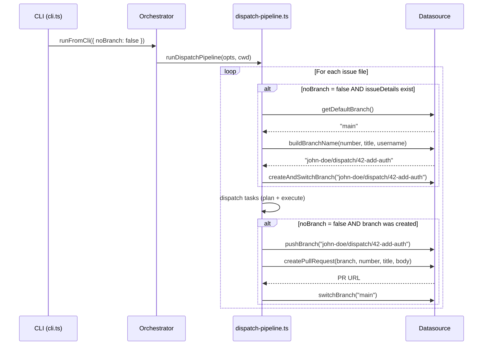
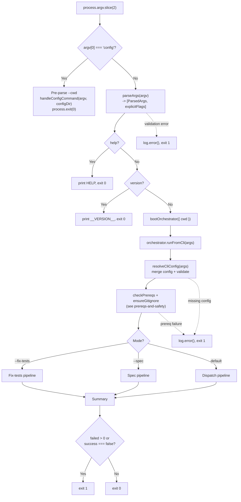

# CLI Argument Parser

The CLI entry point (`src/cli.ts`) provides a hand-rolled argument parser that
validates user input, displays help and version information, handles the
`config` subcommand, and delegates all workflow logic to the
[orchestrator](orchestrator.md) via `bootOrchestrator` and `runFromCli`.

## What it does

The CLI is the user-facing surface of `dispatch`. It is documented as part of
the [CLI & Orchestration group](overview.md). It:

1. Intercepts the `config` subcommand before argument parsing (see
   [Configuration](configuration.md)).
2. Parses `process.argv` into a typed `ParsedArgs` object along with an
   `explicitFlags` set that tracks which flags were explicitly provided.
3. Installs `SIGINT` and `SIGTERM` signal handlers for
   [graceful shutdown](configuration.md#graceful-shutdown-and-cleanup).
4. Handles `--help` and `--version` early-exit paths.
5. Boots the orchestrator via `bootOrchestrator({ cwd })` and delegates to
   `orchestrator.runFromCli(args)`, which handles config resolution, mode
   routing (dispatch, spec, or fix-tests), and pipeline execution.
6. Translates the result summary into a POSIX exit code.

## Installation and distribution

The `dispatch` CLI is distributed as the npm package `dispatch`.

### Requirements

- **Node.js >= 18** (`package.json` `engines` field). The tsup build target is
  `node18` (`tsup.config.ts`).
- **ESM only**: The package uses `"type": "module"` in `package.json`. All
  imports use `.js` extensions for ESM compatibility.

### Install methods

```bash
# Global install -- adds `dispatch` to PATH
npm install -g dispatch

# Run without installing
npx dispatch

# Local project install
npm install --save-dev dispatch
npx dispatch           # runs via local node_modules/.bin
```

### Binary entry point

The `package.json` `bin` field maps the `dispatch` command to `./dist/cli.js`:

```json
{ "bin": { "dispatch": "./dist/cli.js" } }
```

The tsup build (`tsup.config.ts`) compiles `src/cli.ts` to `dist/cli.js` as a
single ESM bundle with a `#!/usr/bin/env node` shebang banner. Source maps are
enabled (`sourcemap: true`), type declarations are not emitted (`dts: false`),
and code splitting is disabled (`splitting: false`) to produce a single output
file.

### Published files

Only the `dist/` directory is included in the published package (`"files": ["dist"]`
in `package.json`). Source TypeScript files, tests, docs, and configuration
files are excluded from the npm tarball.

### Runtime dependencies

The package has runtime dependencies including:

| Package | Purpose |
|---------|---------|
| `@opencode-ai/sdk` | [OpenCode provider](../provider-system/opencode-backend.md) SDK |
| `@github/copilot-sdk` | [GitHub Copilot provider](../provider-system/copilot-backend.md) SDK |
| `chalk` | Terminal color output (see [chalk integration](../shared-types/integrations.md#chalk)) |
| `glob` | File pattern matching for task discovery |
| `@inquirer/prompts` | Interactive prompts for the [configuration wizard](configuration.md#config-wizard-flow) |

## Why a custom parser instead of commander/yargs?

The project uses a hand-rolled `parseArgs()` function
(`src/cli.ts:96-263`) rather than an established CLI framework like
[commander](https://github.com/tj/commander.js),
[yargs](https://yargs.js.org/), or
[citty](https://github.com/unjs/citty).

The likely reasons are:

- **Zero framework dependencies**: The project keeps its dependency footprint
  minimal. Adding a CLI framework would add another dependency (and its
  transitive dependencies) for a relatively simple argument surface.
- **Small option set**: Dispatch has options across three modes. A hand-rolled
  parser for this surface area is straightforward and fits in ~170 lines.
- **Full control**: The parser can exit immediately with targeted error messages
  (e.g., provider validation against [`PROVIDER_NAMES`](../provider-system/provider-overview.md#the-provider-registry)) without mapping through
  a framework's validation API.

### Trade-offs and limitations

The custom parser does **not** handle several edge cases that established
frameworks handle automatically:

| Edge case | Behavior | Framework equivalent |
|-----------|----------|---------------------|
| Combined short flags (`-vh`) | Treated as an unknown option, exits with error | Automatically expanded to `-v -h` |
| Repeated flags (`--dry-run --dry-run`) | Silently accepted, last value wins (booleans are idempotent) | Configurable: error, array, or last-wins |
| `--option=value` syntax | Not supported; treated as an unknown option | Automatically split on `=` |
| Missing value after `--concurrency` | `parseInt(undefined)` returns `NaN`, caught by the `isNaN` check, exits with error | Type-checked with clear error message |
| Missing value after `--provider` | `undefined` fails the `PROVIDER_NAMES.includes()` check, exits with "Unknown provider" | Type-checked with clear error message |
| Missing value after `--server-url` | Silently sets `serverUrl` to `undefined` -- this is a bug | Would require a value |
| Missing value after `--cwd` | `resolve(undefined)` returns `process.cwd()` -- silent no-op | Would require a value |
| Unknown options starting with `-` | Correctly exits with "Unknown option" error | Configurable behavior |
| Positional arguments | Non-flag arguments are collected into `issueIds[]` (supports multiple positionals) | Positional argument definitions |

## Options reference

### Dispatch mode options

| Option | Type | Default | Description |
|--------|------|---------|-------------|
| `<issue-id...>` | string (positional, repeatable) | *(none -- dispatches all open issues if omitted)* | Issue IDs to dispatch (e.g., `14`, `14,15,16`, or `14 15 16`) |
| `--dry-run` | boolean | `false` | List discovered tasks without executing (see [dry-run mode](orchestrator.md#dry-run-mode)) |
| `--no-plan` | boolean | `false` | Skip the [planner agent](../planning-and-dispatch/planner.md), dispatch tasks directly (see [Planning & Dispatch overview](../planning-and-dispatch/overview.md)) |
| `--no-branch` | boolean | `false` | Skip branch creation, push, and PR lifecycle (see [the --no-branch flag](#the---no-branch-flag)) |
| `--no-worktree` | boolean | `false` | Skip git worktree isolation for parallel issues. Tasks run in the main working directory instead of isolated worktrees. |
| `--force` | boolean | `false` | Ignore prior run state and re-run all tasks, even those previously completed. |
| `--concurrency <n>` | integer | `min(cpus, freeMB/500)` | Maximum parallel dispatches per batch. Must be between 1 and 64 (`MAX_CONCURRENCY`). See [concurrency model](orchestrator.md#concurrency-model) and [default computation](configuration.md#default-concurrency-computation). |
| `--provider <name>` | string | `"opencode"` | AI agent backend: `opencode`, `copilot`, `claude`, or `codex`. See [Provider Abstraction](../provider-system/provider-overview.md). |
| `--model <id>` | string | *(provider default)* | Model override in provider-specific format. Copilot uses bare model IDs (e.g., `claude-sonnet-4-5`), OpenCode uses `provider/model` format (e.g., `anthropic/claude-sonnet-4`). Configurable via `dispatch config`. |
| `--server-url <url>` | string | *none* | Connect to a running provider server instead of starting one |
| `--plan-timeout <min>` | float | `10` | Planning timeout in minutes. Must be a positive number. Parsed via `parseFloat`. |
| `--retries <n>` | integer | `2` | Retry attempts for all agents. Must be a non-negative integer. Parsed via `parseInt`. |
| `--plan-retries <n>` | integer | *(falls back to --retries)* | Retry attempts after planning timeout. Overrides `--retries` for the planner agent specifically. Must be a non-negative integer. |
| `--test-timeout <min>` | float | `5` | Test timeout in minutes. Must be a positive number. Parsed via `parseFloat`. Configurable via `dispatch config`. |
| `--cwd <dir>` | string | `process.cwd()` | Working directory for file discovery and agent execution |
| `--verbose` | boolean | `false` | Show detailed debug output for troubleshooting |
| `-h`, `--help` | boolean | `false` | Show usage information |
| `-v`, `--version` | boolean | `false` | Show version string |

### Spec mode options

Spec mode is activated by passing `--spec`. When active, the issue IDs are not
required and the dispatch-specific flags (`--dry-run`, `--no-plan`,
`--concurrency`) are ignored.

| Option | Type | Default | Description |
|--------|------|---------|-------------|
| `--spec [values...]` | string (zero or more) | *none* | Comma-separated issue numbers, multiple space-separated args, glob pattern for local `.md` files, or inline text description. Activates spec mode. Pass with no arguments to regenerate all existing specs. See [issue IDs vs glob patterns](configuration.md#the---spec-flag-issue-ids-vs-glob-patterns). |
| `--source <name>` | string | *auto-detected* | Datasource: `github`, `azdevops`, or `md`. Auto-detected from `git remote get-url origin` if omitted. See [datasource detection](configuration.md#auto-detection-from-git-remote), [Datasource Overview](../datasource-system/overview.md), and individual datasource docs: [GitHub](../datasource-system/github-datasource.md), [Azure DevOps](../datasource-system/azdevops-datasource.md), [Markdown](../datasource-system/markdown-datasource.md). |
| `--org <url>` | string | *none* | Azure DevOps organization URL (e.g., `https://dev.azure.com/myorg`). Required when `--source azdevops`. |
| `--project <name>` | string | *none* | Azure DevOps project name. Required when `--source azdevops`. |
| `--output-dir <dir>` | string | `.dispatch/specs` | Output directory for generated spec files. Resolved to an absolute path. Validated for existence and writability via `fs.access()` with `W_OK` before pipeline execution. |
| `--provider <name>` | string | `"opencode"` | AI agent backend (shared with dispatch mode) |
| `--server-url <url>` | string | *none* | Connect to a running provider server (shared with dispatch mode) |
| `--plan-timeout <min>` | float | `10` | Planning timeout in minutes (shared with dispatch mode) |
| `--plan-retries <n>` | integer | *(falls back to --retries)* | Retry attempts after planning timeout (shared with dispatch mode) |

### Fix-tests mode options

Fix-tests mode is activated by passing `--fix-tests`. It runs the project's
test suite and uses an AI agent to fix any failures. This mode is mutually
exclusive with `--spec` and positional issue IDs.

| Option | Type | Default | Description |
|--------|------|---------|-------------|
| `--fix-tests` | boolean | `false` | Activate fix-tests mode. Cannot be combined with `--spec` or positional issue IDs. |
| `--test-timeout <min>` | float | `5` | Test timeout in minutes (shared with dispatch mode) |
| `--provider <name>` | string | `"opencode"` | AI agent backend (shared with dispatch mode) |
| `--server-url <url>` | string | *none* | Connect to a running provider server (shared with dispatch mode) |

#### Spec mode validation

The `--source` flag is validated against `DATASOURCE_NAMES` (currently
`["github", "azdevops", "md"]`). An unknown value exits with code `1` and a
descriptive error message (`src/cli.ts:167-172`).

When `--source` is omitted, auto-detection runs `git remote get-url origin` and
matches the output against regex patterns for `github.com` (SSH and HTTPS) and
`dev.azure.com` / `*.visualstudio.com` (SSH and HTTPS). If no pattern matches,
the pipeline aborts with an error suggesting `--source` be specified explicitly.
See the [Spec Generation overview](../spec-generation/overview.md) for the
full detection logic.

#### `--spec` variadic parsing

`--spec` uses a variadic collection loop (`src/cli.ts:141-150`) that consumes
all subsequent non-flag arguments (arguments not starting with `--`). The
collection stops when the next `--`-prefixed flag is encountered or the
argument list is exhausted.

- **Single value**: stored as a string (e.g., `--spec 42` produces `"42"`)
- **Multiple values**: stored as an array (e.g., `--spec 42 43` produces
  `["42", "43"]`)
- **Empty** (no args before next flag or end of input): produces an empty
  array (e.g., `--spec --verbose` produces `[]`), triggering regeneration
  of all existing specs.

The `--spec` and `--fix-tests` flags are mutually exclusive. Mutual exclusion
is enforced downstream by the runner (`src/orchestrator/runner.ts`), which
checks for multiple mode flags and produces an error.

Examples:

```bash
dispatch --spec                          # spec = []      (regenerate all existing specs)
dispatch --spec 42                       # spec = "42"    (single issue)
dispatch --spec 42 43 44                # spec = ["42", "43", "44"]
dispatch --spec "specs/*.md"            # spec = "specs/*.md"
dispatch --spec --verbose               # spec = []      (empty, --verbose consumed separately)
dispatch --fix-tests                     # fix-tests mode
dispatch --fix-tests --test-timeout 10   # fix-tests with custom timeout
```

## The `--server-url` option

The `--server-url` option allows connecting to an already-running AI provider
server rather than starting a new one. The protocol and authentication depend
on the selected provider. When `--server-url` is not provided, each provider
boots its own server process and manages its lifecycle internally.

## The `--no-branch` flag

The `--no-branch` flag (`src/cli.ts:129-131`) disables the per-issue branch
lifecycle that the dispatch pipeline normally performs. It is a boolean flag
parsed into `explicitFlags` as `"noBranch"` and passed through to the
orchestrator's `OrchestrateRunOptions.noBranch` field.

### What the branch lifecycle does (when `--no-branch` is *not* set)

When dispatching tasks, the pipeline groups tasks by their source file (each
file corresponds to one issue). For each file that has associated
`IssueDetails` (issue number and title), the pipeline:

1. **Gets the default branch** via `datasource.getDefaultBranch()` (e.g.,
   `main` or `master`).
2. **Builds a branch name** via `datasource.buildBranchName(number, title, username)` --
   typically `<username>/dispatch/<number>-<sanitized-title>`.
3. **Creates and switches to the branch** via
   `datasource.createAndSwitchBranch()`. If the branch already exists, the
   datasource switches to it instead of creating a new one.
4. **Dispatches all tasks** for that issue on the new branch.
5. **Pushes the branch** to the remote via `datasource.pushBranch()`.
6. **Creates a pull request** linking the branch to the issue via
   `datasource.createPullRequest()`.
7. **Switches back** to the default branch via `datasource.switchBranch()`.

Each step is wrapped in `try/catch` with a warning on failure. A branch
creation failure causes the pipeline to continue dispatching tasks on the
current branch (no branch isolation), but push and PR steps are skipped.

### When to use `--no-branch`

Use `--no-branch` when:

- **You are working on a branch already** and want tasks committed to the
  current branch rather than new per-issue branches.
- **Your workflow manages branches externally** (e.g., a CI pipeline that
  creates branches before invoking `dispatch`).
- **The repository does not have a remote** or push access is not available.
- **Testing or development**: You want to see task results without creating
  git artifacts.

### CLI-only flag

`--no-branch` is a CLI-only flag. It is **not** in `CONFIG_KEYS` and cannot be
persisted via `dispatch config`. This is intentional -- branch lifecycle
behavior is typically per-invocation rather than a persistent default.



## Exit code contract

The CLI uses a binary exit code scheme with additional signal codes.
The primary exit logic is at `src/cli.ts:317`:

| Exit code | Meaning |
|-----------|---------|
| `0` | All tasks completed successfully (or `--help`/`--version`/`config` was used) |
| `1` | One or more tasks failed, **or** a fatal error occurred |
| `130` | Process received SIGINT (Ctrl+C) |
| `143` | Process received SIGTERM |

The exit code determination handles two result types:

- **`DispatchSummary`**: Has a `failed` field. Exit code is `1` if `failed > 0`.
- **`FixTestsSummary`**: Has a `success` boolean. Exit code is `1` if
  `success` is `false`.

There is **no distinction** between partial failure and total failure. If 9 out
of 10 tasks succeed but 1 fails, the exit code is `1`. This follows POSIX
conventions where non-zero indicates "something went wrong," but it means CI
pipelines cannot tell from the exit code alone whether 1% or 100% of tasks
failed.

Unhandled exceptions from `main()` are caught by the top-level `.catch()`
handler (`src/cli.ts:321-324`), which logs the error message, calls
[`runCleanup()`](../shared-types/cleanup.md) to release provider resources, and exits with code `1`.

## Version string and tsup define

The version string is injected at build time via tsup's `define` feature.
The `tsup.config.ts` reads the version from `package.json` and replaces
every occurrence of the `__VERSION__` identifier in the source with the
version string:

```typescript
// tsup.config.ts
import { readFileSync } from "node:fs";
const { version } = JSON.parse(readFileSync("package.json", "utf-8"));

export default defineConfig({
  // ... existing config ...
  define: {
    __VERSION__: JSON.stringify(version),
  },
});
```

The `__VERSION__` global constant is declared in `src/globals.d.ts` and used
at `src/cli.ts:307`:

```
console.log(`dispatch v${__VERSION__}`);
```

The current package version is `0.0.1`. The `define` feature works like
esbuild's `define` -- it performs global string replacement at build time,
so the built `dist/cli.js` file contains the literal version string with no
runtime file reads.

See the [tsup integration](integrations.md#tsup-build-tool) for full build
configuration details.

## How it works



The CLI delegates to `bootOrchestrator()` (`src/cli.ts:312`) which is imported
from `src/orchestrator/runner.ts`. This returns an orchestrator instance, then
`orchestrator.runFromCli(args)` (`src/cli.ts:314`) handles config resolution,
prerequisite checks, mutual exclusion enforcement, and pipeline routing. See
[Configuration](configuration.md) for full details on the resolution process.

## Related documentation

- [Configuration](configuration.md) -- persistent config file, three-tier
  precedence, `dispatch config` subcommand, and mandatory validation
- [Orchestrator pipeline](orchestrator.md) -- what happens after the CLI
  delegates to `orchestrator.runFromCli()` in dispatch mode
- [Spec Generation](../spec-generation/overview.md) -- the full spec generation
  pipeline invoked by `--spec` mode
- [Issue Fetching](../issue-fetching/overview.md) -- how issues are retrieved
  from GitHub and Azure DevOps for spec generation
- [Terminal UI](tui.md) -- real-time dashboard rendering during dispatch
- [Integrations](integrations.md) -- tsup build configuration, chalk color
  handling, Node.js fs/promises config I/O, @inquirer/prompts
- [Provider Abstraction & Backends](../provider-system/provider-overview.md) -- provider boot
  process and server-url semantics
- [Planning & Dispatch Pipeline](../planning-and-dispatch/overview.md) -- planner,
  dispatcher, and git operations that the orchestrator coordinates
- [Task Parsing & Markdown](../task-parsing/overview.md) -- how markdown task
  files are parsed and mutated
- [Datasource System](../datasource-system/overview.md) -- datasource
  abstraction and `--source` flag semantics
- [Prerequisites & Safety Checks](../prereqs-and-safety/overview.md) --
  pre-flight validation invoked by the orchestrator before pipeline execution
- [Git Worktree Helpers](../git-and-worktree/overview.md) -- worktree isolation
  model used by the `--no-worktree` flag and parallel dispatch
- [Cleanup Registry](../shared-types/cleanup.md) -- process-level cleanup
  invoked from signal handlers and error handler
