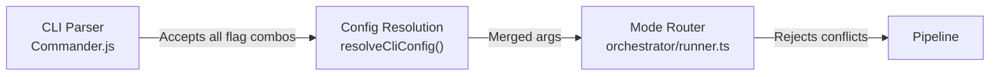
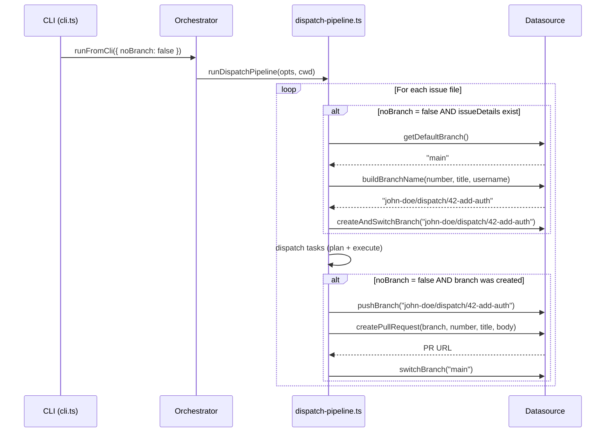
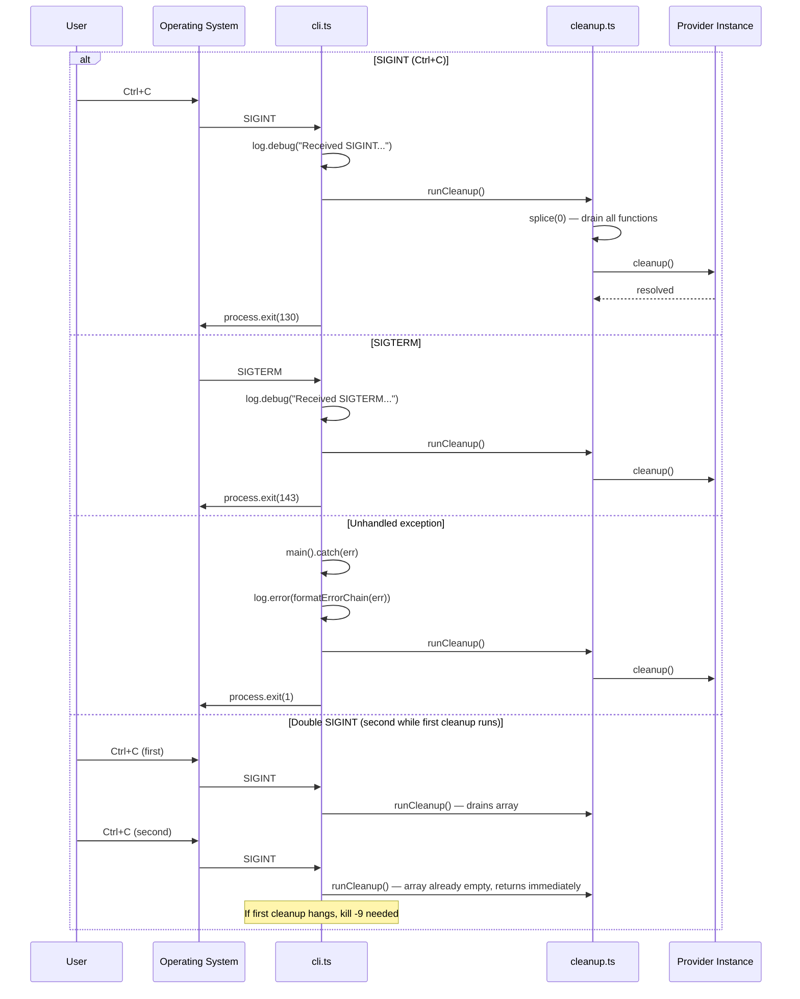
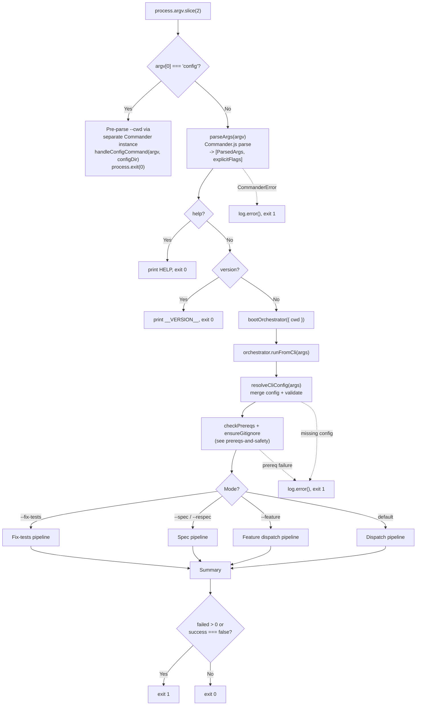

# CLI Argument Parser

The CLI entry point (`src/cli.ts`) uses the [Commander.js](https://github.com/tj/commander.js)
library to parse command-line arguments, validates user input via custom option
processors and `choices()` constraints, displays help and version information,
handles the `config` subcommand, and delegates all workflow logic to the
[orchestrator](orchestrator.md) via `bootOrchestrator` and `runFromCli`.

## What it does

The CLI is the user-facing surface of `dispatch`. It is documented as part of
the [CLI & Orchestration group](overview.md). It:

1. Intercepts the `config` subcommand before argument parsing (see
   [Configuration](configuration.md)). The config subcommand uses a separate
   Commander instance with `allowUnknownOption()` and `allowExcessArguments()`
   so it can pass through arbitrary arguments.
2. Parses `process.argv` via [Commander.js](#commanderjs-argument-parsing) into
   a typed `ParsedArgs` object along with an `explicitFlags` set derived from
   Commander's `getOptionValueSource()` API.
3. Installs `SIGINT` and `SIGTERM` signal handlers for
   [graceful shutdown](configuration.md#graceful-shutdown-and-cleanup).
4. Handles `--help` and `--version` early-exit paths.
5. Boots the orchestrator via `bootOrchestrator({ cwd })` and delegates to
   `orchestrator.runFromCli(args)`, which handles config resolution, mode
   routing (dispatch, spec, respec, fix-tests, or feature), and pipeline
   execution.
6. Translates the result summary into a POSIX exit code.

## Installation and distribution

The `dispatch` CLI is distributed as the npm package `dispatch`.

### Requirements

- **Node.js >= 18** (`package.json` `engines` field). The tsup build target is
  `node18` (`tsup.config.ts`).
- **ESM only**: The package uses `"type": "module"` in `package.json`. All
  imports use `.js` extensions for ESM compatibility.

### Install methods

```bash
# Global install -- adds `dispatch` to PATH
npm install -g dispatch

# Run without installing
npx dispatch

# Local project install
npm install --save-dev dispatch
npx dispatch           # runs via local node_modules/.bin
```

### Binary entry point

The `package.json` `bin` field maps the `dispatch` command to `./dist/cli.js`:

```json
{ "bin": { "dispatch": "./dist/cli.js" } }
```

The tsup build (`tsup.config.ts`) compiles `src/cli.ts` to `dist/cli.js` as a
single ESM bundle with a `#!/usr/bin/env node` shebang banner. Source maps are
enabled (`sourcemap: true`), type declarations are not emitted (`dts: false`),
and code splitting is disabled (`splitting: false`) to produce a single output
file.

### Published files

Only the `dist/` directory is included in the published package (`"files": ["dist"]`
in `package.json`). Source TypeScript files, tests, docs, and configuration
files are excluded from the npm tarball.

### Runtime dependencies

The package has runtime dependencies including:

| Package | Purpose |
|---------|---------|
| `commander` | CLI argument parsing (see [Commander.js integration](integrations.md#commanderjs)) |
| `@opencode-ai/sdk` | [OpenCode provider](../provider-system/opencode-backend.md) SDK |
| `@github/copilot-sdk` | [GitHub Copilot provider](../provider-system/copilot-backend.md) SDK |
| `chalk` | Terminal color output (see [chalk integration](../shared-types/integrations.md#chalk)) |
| `glob` | File pattern matching for task discovery |
| `@inquirer/prompts` | Interactive prompts for the [configuration wizard](configuration.md#config-wizard-flow) |

## Why Commander.js

The project uses [Commander.js](https://github.com/tj/commander.js) for
argument parsing (`src/cli.ts:13`). Commander provides:

- **`choices()` validation**: The `--provider` and `--source` options use
  Commander's `.choices()` API (`src/cli.ts:123-129`), which automatically
  rejects invalid values with a descriptive error message listing allowed
  choices. This replaces manual validation against `PROVIDER_NAMES` and
  `DATASOURCE_NAMES`.
- **Variadic options**: The `--spec <values...>` and `--respec [values...]`
  options use Commander's variadic syntax to collect multiple arguments
  into arrays.
- **Custom option processing**: Numeric options (`--concurrency`, `--plan-timeout`,
  `--spec-timeout`, `--retries`, `--plan-retries`, `--test-timeout`) use Commander's custom
  processing callbacks to parse, validate, and coerce values in a single step.
- **Negatable booleans**: `--no-plan`, `--no-branch`, and `--no-worktree` use
  Commander's built-in negatable boolean support (Commander automatically handles
  `--no-*` prefix to set the base option to `false`).
- **`exitOverride()`**: Prevents Commander from calling `process.exit()` directly.
  Instead, Commander throws a `CommanderError` which the CLI catches, logs via
  `log.error()`, and exits with code `1` (`src/cli.ts:183-191`).
- **`configureOutput()`**: Both `writeOut` and `writeErr` are set to no-ops
  (`src/cli.ts:104-107`), suppressing Commander's default output so the CLI
  controls all user-facing output through its own logger and help text.
- **`getOptionValueSource()`**: Used to derive the `explicitFlags` set
  (`src/cli.ts:264-268`), replacing manual tracking with Commander's built-in
  source tracking.

### Negatable boolean handling

Commander's `--no-*` prefix convention is used for `--no-plan`, `--no-branch`,
and `--no-worktree`. When Commander sees `.option("--no-plan", ...)`, it creates
an option named `plan` that defaults to `true` and is set to `false` when
`--no-plan` is passed. The CLI then inverts the value when building `ParsedArgs`:

```
args.noPlan = !opts.plan;     // --no-plan → plan=false → noPlan=true
args.noBranch = !opts.branch; // --no-branch → branch=false → noBranch=true
```

This inversion is necessary because the internal `RawCliArgs` interface uses
positive field names (`noPlan`, `noBranch`, `noWorktree`) while Commander stores
them as their positive counterparts (`plan`, `branch`, `worktree`).

## Options reference

### Dispatch mode options

| Option | Type | Default | Description |
|--------|------|---------|-------------|
| `<issue-id...>` | string (positional, repeatable) | *(none -- dispatches all open issues if omitted)* | Issue IDs to dispatch (e.g., `14`, `14,15,16`, or `14 15 16`) |
| `--dry-run` | boolean | `false` | List discovered tasks without executing (see [dry-run mode](orchestrator.md#dry-run-mode)) |
| `--no-plan` | boolean | `false` | Skip the [planner agent](../planning-and-dispatch/planner.md), dispatch tasks directly (see [Planning & Dispatch overview](../planning-and-dispatch/overview.md)) |
| `--no-branch` | boolean | `false` | Skip branch creation, push, and PR lifecycle (see [the --no-branch flag](#the---no-branch-flag)) |
| `--no-worktree` | boolean | `false` | Skip git worktree isolation for parallel issues. Tasks run in the main working directory instead of isolated worktrees. |
| `--feature` | boolean | `false` | Group multiple issues into a single feature branch and PR instead of separate branches per issue. Cannot be combined with `--no-branch` (enforced by the orchestrator, not the parser). |
| `--force` | boolean | `false` | Ignore prior run state and re-run all tasks, even those previously completed. |
| `--concurrency <n>` | integer | `min(cpus, freeMB/500)` | Maximum parallel dispatches per batch. Must be between 1 and 64 (`MAX_CONCURRENCY`). See [concurrency model](orchestrator.md#concurrency-model) and [default computation](configuration.md#default-concurrency-computation). |
| `--provider <name>` | string | `"opencode"` | AI agent backend: `opencode`, `copilot`, `claude`, or `codex`. Validated via Commander's `choices()` against `PROVIDER_NAMES`. See [Provider Abstraction](../provider-system/overview.md). |
| `--server-url <url>` | string | *none* | Connect to a running provider server instead of starting one |
| `--plan-timeout <min>` | float | `30` | Planning timeout in minutes. Must be a positive number. Parsed via `parseFloat`. |
| `--retries <n>` | integer | `3` | Retry attempts for all agents. Must be a non-negative integer. Parsed via `parseInt`. |
| `--plan-retries <n>` | integer | *(falls back to --retries)* | Retry attempts after planning timeout. Overrides `--retries` for the planner agent specifically. Must be a non-negative integer. |
| `--test-timeout <min>` | float | `5` | Test timeout in minutes. Must be a positive number. Parsed via `parseFloat`. Configurable via `dispatch config`. |
| `--cwd <dir>` | string | `process.cwd()` | Working directory for file discovery and agent execution |
| `--verbose` | boolean | `false` | Show detailed debug output for troubleshooting |
| `-h`, `--help` | boolean | `false` | Show usage information |
| `-v`, `--version` | boolean | `false` | Show version string |

> **Note**: `--plan-timeout` defaults to 30 minutes, and `--retries` defaults to 3 shared retries (4 total attempts). If those automatic retries are exhausted during dispatch, interactive TUI runs pause the task for rerun-or-quit recovery instead of silently continuing. Verbose or non-TTY runs will not wait for recovery input. See [Planning & Dispatch overview](../planning-and-dispatch/overview.md) and [Terminal UI](tui.md).

> **Note**: The `model` setting (AI model override) is a **config-only** field.
> It is not available as a CLI flag and must be set via `dispatch config` or
> the `{CWD}/.dispatch/config.json` file. See
> [Configuration — Configurable keys](configuration.md#configurable-keys).

### Spec mode options

Spec mode is activated by passing `--spec`. When active, the issue IDs are not
required and the dispatch-specific flags (`--dry-run`, `--no-plan`,
`--concurrency`) are ignored.

| Option | Type | Default | Description |
|--------|------|---------|-------------|
| `--spec <values...>` | string (variadic) | *none* | Comma-separated issue numbers, multiple space-separated args, glob pattern for local `.md` files, or inline text description. Activates spec mode. See [issue IDs vs glob patterns](configuration.md#the---spec-flag-issue-ids-vs-glob-patterns). |
| `--respec [values...]` | string (optional variadic) | *none* | Regenerate specs. Accepts the same input formats as `--spec`. When passed with no arguments, regenerates all existing specs. |
| `--source <name>` | string | *auto-detected* | Datasource: `github`, `azdevops`, or `md`. Auto-detected from `git remote get-url origin` if omitted. See [datasource detection](configuration.md#auto-detection-from-git-remote), [Datasource Overview](../datasource-system/overview.md), and individual datasource docs: [GitHub](../datasource-system/github-datasource.md), [Azure DevOps](../datasource-system/azdevops-datasource.md), [Markdown](../datasource-system/markdown-datasource.md). |
| `--org <url>` | string | *none* | Azure DevOps organization URL (e.g., `https://dev.azure.com/myorg`). Required when `--source azdevops`. |
| `--project <name>` | string | *none* | Azure DevOps project name. Required when `--source azdevops`. |
| `--output-dir <dir>` | string | `.dispatch/specs` | Output directory for generated spec files. Resolved to an absolute path. Validated for existence and writability via `fs.access()` with `W_OK` before pipeline execution. |
| `--provider <name>` | string | `"opencode"` | AI agent backend (shared with dispatch mode) |
| `--server-url <url>` | string | *none* | Connect to a running provider server (shared with dispatch mode) |
| `--retries <n>` | integer | `3` | Retry attempts for spec generation and other shared agent flows |
| `--spec-timeout <min>` | float | `10` | Spec generation timeout in minutes. Must be a positive number. Parsed via `parseFloat`. |
| `--plan-timeout <min>` | float | `30` | Planning timeout in minutes (shared with dispatch mode) |
| `--plan-retries <n>` | integer | *(falls back to --retries)* | Retry attempts after planning timeout (shared with dispatch mode) |

### Fix-tests mode options

Fix-tests mode is activated by passing `--fix-tests`. It runs the project's
test suite and uses an AI agent to fix any failures. This mode is mutually
exclusive with `--spec` and positional issue IDs.

| Option | Type | Default | Description |
|--------|------|---------|-------------|
| `--fix-tests` | boolean | `false` | Activate fix-tests mode. Cannot be combined with `--spec` or positional issue IDs. |
| `--test-timeout <min>` | float | `5` | Test timeout in minutes (shared with dispatch mode) |
| `--provider <name>` | string | `"opencode"` | AI agent backend (shared with dispatch mode) |
| `--server-url <url>` | string | *none* | Connect to a running provider server (shared with dispatch mode) |

#### Spec mode validation

The `--source` flag is validated via Commander's `choices()` API against
`DATASOURCE_NAMES` (currently `["github", "azdevops", "md"]`). An unknown
value is rejected by Commander with an error listing the allowed choices.
The `CommanderError` is caught by the CLI's error handler
(`src/cli.ts:183-191`), which logs the message and exits with code `1`.

When `--source` is omitted, auto-detection runs `git remote get-url origin` and
matches the output against regex patterns for `github.com` (SSH and HTTPS) and
`dev.azure.com` / `*.visualstudio.com` (SSH and HTTPS). If no pattern matches,
the pipeline aborts with an error suggesting `--source` be specified explicitly.
See the [Spec Generation overview](../spec-generation/overview.md) for the
full detection logic.

#### `--spec` and `--respec` variadic parsing

Both `--spec` and `--respec` use Commander's variadic option syntax.
`--spec <values...>` (required variadic) requires at least one value.
`--respec [values...]` (optional variadic) accepts zero or more values.

Commander's variadic options collect all subsequent non-flag arguments into an
array. Collection stops when the next `--`-prefixed flag is encountered or the
argument list is exhausted.

After collection, the CLI normalizes the result (`src/cli.ts:211-219`):

- **Single value**: stored as a string (e.g., `--spec 42` produces `"42"`)
- **Multiple values**: stored as an array (e.g., `--spec 42 43` produces
  `["42", "43"]`)
- **Empty** (`--respec` with no args): produces an empty array (`[]`),
  triggering regeneration of all existing specs.
- **`--respec` passed as bare flag**: Commander sets the value to `true`;
  the CLI converts this to an empty array.

The `--spec`, `--respec`, and `--fix-tests` flags are mutually exclusive.
Mutual exclusion is enforced downstream by the runner
(`src/orchestrator/runner.ts`), which checks for multiple mode flags and
produces an error. The parser intentionally allows all combinations.

Examples:

```bash
dispatch --spec 42                       # spec = "42"    (single issue)
dispatch --spec 42 43 44                # spec = ["42", "43", "44"]
dispatch --spec "specs/*.md"            # spec = "specs/*.md"
dispatch --spec --verbose               # error: --spec requires a value
dispatch --respec                        # respec = []    (regenerate all existing specs)
dispatch --respec 42                     # respec = "42"  (single issue)
dispatch --respec 42 43 44             # respec = ["42", "43", "44"]
dispatch --respec --verbose             # respec = []    (empty, --verbose consumed separately)
dispatch --fix-tests                     # fix-tests mode
dispatch --fix-tests --test-timeout 10   # fix-tests with custom timeout
```

## Multi-mode dispatch with deferred validation

The CLI supports five mutually exclusive operational modes: default dispatch,
`--spec`, `--respec`, `--fix-tests`, and `--feature`. The parser intentionally
does **not** enforce mutual exclusion between these modes. All combinations
are syntactically valid at the parser level.

Mutual exclusion is enforced by the orchestrator
(`src/orchestrator/runner.ts`), which checks for conflicting mode flags after
config resolution and produces descriptive error messages. This separation
means:

- The argument-parsing layer accepts `--fix-tests --spec 42` without error.
- The orchestrator rejects it with a meaningful message about incompatible modes.
- The parser tests (`tests/cli.test.ts:100-108`, `173-199`, `248-269`)
  explicitly verify this deferred validation behavior.

The same deferred pattern applies to `--feature` and `--no-branch`, which are
logically incompatible (feature mode requires branch creation) but accepted
together at the parser level.



## The `--server-url` option

The `--server-url` option allows connecting to an already-running AI provider
server rather than starting a new one. The protocol and authentication depend
on the selected provider. When `--server-url` is not provided, each provider
boots its own server process and manages its lifecycle internally.

## The `--no-branch` flag

The `--no-branch` flag (`src/cli.ts:115`) disables the per-issue branch
lifecycle that the dispatch pipeline normally performs. It is a boolean flag
parsed into `explicitFlags` as `"noBranch"` and passed through to the
orchestrator's `OrchestrateRunOptions.noBranch` field.

### What the branch lifecycle does (when `--no-branch` is *not* set)

When dispatching tasks, the pipeline groups tasks by their source file (each
file corresponds to one issue). For each file that has associated
`IssueDetails` (issue number and title), the pipeline:

1. **Gets the default branch** via `datasource.getDefaultBranch()` (e.g.,
   `main` or `master`).
2. **Builds a branch name** via `datasource.buildBranchName(number, title, username)` --
   typically `<username>/dispatch/<number>-<sanitized-title>`.
3. **Creates and switches to the branch** via
   `datasource.createAndSwitchBranch()`. If the branch already exists, the
   datasource switches to it instead of creating a new one.
4. **Dispatches all tasks** for that issue on the new branch.
5. **Pushes the branch** to the remote via `datasource.pushBranch()`.
6. **Creates a pull request** linking the branch to the issue via
   `datasource.createPullRequest()`.
7. **Switches back** to the default branch via `datasource.switchBranch()`.

Each step is wrapped in `try/catch` with a warning on failure. A branch
creation failure causes the pipeline to continue dispatching tasks on the
current branch (no branch isolation), but push and PR steps are skipped.

### When to use `--no-branch`

Use `--no-branch` when:

- **You are working on a branch already** and want tasks committed to the
  current branch rather than new per-issue branches.
- **Your workflow manages branches externally** (e.g., a CI pipeline that
  creates branches before invoking `dispatch`).
- **The repository does not have a remote** or push access is not available.
- **Testing or development**: You want to see task results without creating
  git artifacts.

### CLI-only flag

`--no-branch` is a CLI-only flag. It is **not** in `CONFIG_KEYS` and cannot be
persisted via `dispatch config`. This is intentional -- branch lifecycle
behavior is typically per-invocation rather than a persistent default.



## Exit code contract

The CLI uses a binary exit code scheme with additional signal codes.
The primary exit logic is at `src/cli.ts:335`:

| Exit code | Meaning |
|-----------|---------|
| `0` | All tasks completed successfully (or `--help`/`--version`/`config` was used) |
| `1` | One or more tasks failed, **or** a fatal error occurred |
| `130` | Process received SIGINT (Ctrl+C) |
| `143` | Process received SIGTERM |

The exit code determination handles two result types:

- **`DispatchSummary`**: Has a `failed` field. Exit code is `1` if `failed > 0`.
- **`FixTestsSummary`**: Has a `success` boolean. Exit code is `1` if
  `success` is `false`.

There is **no distinction** between partial failure and total failure. If 9 out
of 10 tasks succeed but 1 fails, the exit code is `1`. This follows POSIX
conventions where non-zero indicates "something went wrong," but it means CI
pipelines cannot tell from the exit code alone whether 1% or 100% of tasks
failed.

Unhandled exceptions from `main()` are caught by the top-level `.catch()`
handler (`src/cli.ts:339-343`), which logs the error message, calls
[`runCleanup()`](../shared-types/cleanup.md) to release provider resources, and exits with code `1`.

## Graceful shutdown flow

The signal handlers and error handler interact with the
[cleanup registry](../shared-types/cleanup.md) to ensure provider resources
are released on exit. The following sequence diagram shows the shutdown flow:



### What resources are cleaned up

The cleanup registry (`src/helpers/cleanup.ts`) maintains a list of async
cleanup functions registered by subsystems. The primary resource registered is
the AI provider's `cleanup()` method, which terminates any spawned server
processes. The registry has these safety properties:

- **Drain-once**: `splice(0)` atomically empties the array, so repeated calls
  are harmless.
- **Error-swallowing**: Each function runs in a `try/catch` to prevent cleanup
  failures from blocking process exit.
- **Sequential execution**: Functions run in registration order, not
  concurrently.

### Race condition: signal during orchestrator boot

If a signal arrives during `bootOrchestrator()` (`src/cli.ts:330`) — before
any provider has been booted and registered its cleanup — the cleanup registry
is empty. `runCleanup()` returns immediately with no work to do. No resources
are leaked because no provider has been started yet.

## Version string and tsup define

The version string is injected at build time via tsup's `define` feature.
The `tsup.config.ts` reads the version from `package.json` and replaces
every occurrence of the `__VERSION__` identifier in the source with the
version string:

```typescript
// tsup.config.ts
import { readFileSync } from "node:fs";
const { version } = JSON.parse(readFileSync("package.json", "utf-8"));

export default defineConfig({
  // ... existing config ...
  define: {
    __VERSION__: JSON.stringify(version),
  },
});
```

The `__VERSION__` global constant is declared in `src/globals.d.ts` and used
at `src/cli.ts:325`:

```
console.log(`dispatch v${__VERSION__}`);
```

The current package version is `0.0.1`. The `define` feature works like
esbuild's `define` -- it performs global string replacement at build time,
so the built `dist/cli.js` file contains the literal version string with no
runtime file reads.

See the [tsup integration](integrations.md#tsup-build-tool) for full build
configuration details.

## Commander.js argument parsing

The `parseArgs()` function (`src/cli.ts:99-271`) creates a Commander `Command`
instance and configures it with all CLI options. Key implementation details:

### How `exitOverride()` interacts with custom error handling

Commander's default behavior is to call `process.exit()` directly when it
encounters an error (unknown option, invalid choice, missing required argument).
The CLI calls `program.exitOverride()` (`src/cli.ts:103`) to change this
behavior: instead of exiting, Commander throws a `CommanderError`.

The `try/catch` block at `src/cli.ts:183-191` catches `CommanderError`
instances, logs the error message via `log.error()`, and calls
`process.exit(1)`. Non-Commander errors are re-thrown to propagate to the
top-level error handler.

This pattern gives the CLI control over error formatting (using the project's
own logger with chalk styling) rather than Commander's default plain-text
error output. Combined with `configureOutput({ writeOut: () => {}, writeErr: () => {} })`,
all of Commander's built-in output is suppressed in favor of the CLI's own
help text and error messages.

### How `getOptionValueSource()` drives `explicitFlags`

The `explicitFlags` set (`src/cli.ts:235`) tracks which CLI flags were
explicitly provided by the user on the command line. This set is critical for
the [three-tier configuration precedence](configuration.md#three-tier-configuration-precedence)
system: config-file defaults are only applied for flags NOT in `explicitFlags`.

Instead of manually tracking each flag during parsing, the CLI uses
Commander's `getOptionValueSource()` API (`src/cli.ts:264-268`). After
parsing completes, the CLI iterates over a `SOURCE_MAP` that maps Commander's
internal attribute names to the CLI's field names:

```typescript
for (const [attr, flag] of Object.entries(SOURCE_MAP)) {
    if (program.getOptionValueSource(attr) === "cli") {
        explicitFlags.add(flag);
    }
}
```

Commander tracks the source of each option value. The possible sources are:
- `"cli"` — explicitly provided on the command line
- `"default"` — set via Commander's default value mechanism
- `"env"` — set via environment variable (not used by dispatch)
- `"config"` — set via `.setOptionValueWithSource()` (not used by dispatch)
- `undefined` — option was not provided and has no default

The CLI only adds flags with source `"cli"` to the `explicitFlags` set. This
ensures that Commander's own defaults (like `provider: "opencode"`) do not
interfere with the config file merge.

### CONFIG_BOUNDS validation

Numeric options use `CONFIG_BOUNDS` (imported from `src/config.ts:40-44`) for
boundary validation in Commander's custom processing callbacks:

| Bound | Min | Max |
|-------|-----|-----|
| `testTimeout` | 1 | 120 |
| `planTimeout` | 1 | 120 |
| `specTimeout` | 1 | 120 |
| `concurrency` | 1 | 64 |

The CLI exports `MAX_CONCURRENCY = CONFIG_BOUNDS.concurrency.max` (64) for
use in the help text and validation.

Validation errors are thrown as `CommanderError` instances with exit code `1`,
caught by the CLI's error handler, and reported via `log.error()`.

## How it works



The CLI delegates to `bootOrchestrator()` (`src/cli.ts:330`) which is imported
from `src/orchestrator/runner.ts`. This returns an orchestrator instance, then
`orchestrator.runFromCli(args)` (`src/cli.ts:332`) handles config resolution,
prerequisite checks, mutual exclusion enforcement, and pipeline routing. See
[Configuration](configuration.md) for full details on the resolution process.

## Test coverage

The CLI parser is tested in `src/tests/cli.test.ts` using
[Vitest](https://vitest.dev/). The tests focus on the `parseArgs()` function
and verify argument parsing, flag combinations, and error handling without
invoking `main()` or the orchestrator.

### Test structure

The test suite covers seven categories:

| Category | Tests | What is verified |
|----------|-------|-----------------|
| `--respec` parsing | 8 tests | Empty, single, multiple, glob, and flag-stop behavior |
| `--spec` / `--respec` mutual exclusion | 3 tests | Both can be set simultaneously (deferred validation) |
| `--respec` with other flags | 3 tests | Combinations with `--source`, `--provider`, file paths |
| `--fix-tests` parsing | 5 tests | Boolean flag, combinations with other flags |
| `--fix-tests` mutual exclusion | 4 tests | Can coexist with `--spec` and `--respec` at parser level |
| `--force` and `--feature` | 9 tests | Boolean flags, combinations, mutual exclusion behavior |
| Basic and value flags | 19 tests | All option types: booleans, strings, numbers, positionals |
| Error cases | 14 tests | Invalid values, out-of-range, unknown flags |

### Mock setup

The tests mock five modules to isolate the parser:

- **`helpers/logger.js`**: Replaces all log methods with `vi.fn()` no-ops
- **`providers/index.js`**: Provides `PROVIDER_NAMES: ["opencode", "copilot"]`
- **`datasources/index.js`**: Provides `DATASOURCE_NAMES: ["github", "azdevops", "md"]`
- **`config.js`**: Provides `CONFIG_BOUNDS` with boundary values for validation
- **`helpers/cleanup.js`**: Provides `runCleanup` and `registerCleanup` as no-ops

Additionally, `process.stdout.write` and `process.stderr.write` are spied and
suppressed to prevent Commander's output during test execution.

### Error case testing pattern

Error tests spy on `process.exit` with a mock that throws, then assert both
that the error was thrown and that `process.exit` was called with `1`:

```typescript
const mockExit = vi.spyOn(process, "exit").mockImplementation((() => {
    throw new Error("process.exit called");
}) as never);

it("exits for invalid --source", () => {
    expect(() => parseArgs(["--source", "invalid"])).toThrow();
    expect(mockExit).toHaveBeenCalledWith(1);
});
```

### Running the tests

```bash
npm test                          # Run all tests
npx vitest run tests/cli.test.ts  # Run CLI tests only
npx vitest --watch tests/cli.test.ts  # Watch mode
```

## Related documentation

- [Configuration](configuration.md) -- persistent config file, three-tier
  precedence, `dispatch config` subcommand, and mandatory validation
- [Orchestrator pipeline](orchestrator.md) -- what happens after the CLI
  delegates to `orchestrator.runFromCli()` in dispatch mode
- [Spec Generation](../spec-generation/overview.md) -- the full spec generation
  pipeline invoked by `--spec` mode
- [Issue Fetching](../issue-fetching/overview.md) -- how issues are retrieved
  from GitHub and Azure DevOps for spec generation
- [Terminal UI](tui.md) -- real-time dashboard rendering during dispatch
- [Integrations](integrations.md) -- Commander.js, tsup build configuration,
  chalk color handling, Node.js fs/promises config I/O, @inquirer/prompts
- [Provider Abstraction & Backends](../provider-system/overview.md) -- provider boot
  process and server-url semantics
- [Adding a Provider](../provider-system/adding-a-provider.md) -- how new
  providers integrate with CLI validation
- [Planning & Dispatch Pipeline](../planning-and-dispatch/overview.md) -- planner,
  dispatcher, and git operations that the orchestrator coordinates
- [Dispatcher](../planning-and-dispatch/dispatcher.md) -- prompt construction
  and session isolation for dispatched tasks
- [Task Parsing & Markdown](../task-parsing/overview.md) -- how markdown task
  files are parsed and mutated
- [Markdown Syntax Reference](../task-parsing/markdown-syntax.md) -- checkbox
  syntax and `(P)`/`(S)`/`(I)` mode prefixes
- [Datasource System](../datasource-system/overview.md) -- datasource
  abstraction and `--source` flag semantics
- [Azure DevOps Datasource](../datasource-system/azdevops-datasource.md) --
  Azure DevOps integration requiring `--org` and `--project` flags
- [Markdown Datasource](../datasource-system/markdown-datasource.md) --
  local-first datasource selected via `--source md`
- [Prerequisites & Safety Checks](../prereqs-and-safety/overview.md) --
  pre-flight validation invoked by the orchestrator before pipeline execution
- [Git Worktree Helpers](../git-and-worktree/overview.md) -- worktree isolation
  model used by the `--no-worktree` flag and parallel dispatch
- [Branch Name Validation](../git-and-worktree/branch-validation.md) --
  validation rules for branch names generated during dispatch
- [Cleanup Registry](../shared-types/cleanup.md) -- process-level cleanup
  invoked from signal handlers and error handler
- [Provider Interface](../shared-types/provider.md) -- `ProviderInstance` type
  consumed after provider boot
