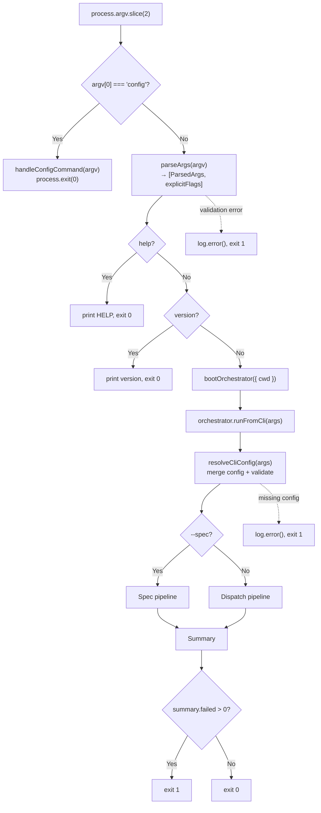

# CLI Argument Parser

The CLI entry point (`src/cli.ts`) provides a hand-rolled argument parser that
validates user input, displays help and version information, handles the
`config` subcommand, and delegates all workflow logic to the
[orchestrator](orchestrator.md) via `bootOrchestrator` and `runFromCli`.

## What it does

The CLI is the user-facing surface of `dispatch`. It is documented as part of
the [CLI & Orchestration group](overview.md). It:

1. Intercepts the `config` subcommand before argument parsing (see
   [Configuration](configuration.md)).
2. Parses `process.argv` into a typed `ParsedArgs` object along with an
   `explicitFlags` set that tracks which flags were explicitly provided.
3. Installs `SIGINT` and `SIGTERM` signal handlers for
   [graceful shutdown](configuration.md#graceful-shutdown-and-cleanup).
4. Handles `--help` and `--version` early-exit paths.
5. Boots the orchestrator via `bootOrchestrator({ cwd })` and delegates to
   `orchestrator.runFromCli(args)`, which handles config resolution, mode
   routing (dispatch vs spec), and pipeline execution.
6. Translates the result summary into a POSIX exit code.

## Why a custom parser instead of commander/yargs?

The project uses a hand-rolled `parseArgs()` function
(`src/cli.ts:83-186`) rather than an established CLI framework like
[commander](https://github.com/tj/commander.js),
[yargs](https://yargs.js.org/), or
[citty](https://github.com/unjs/citty).

The likely reasons are:

- **Zero dependencies**: The project keeps its dependency footprint minimal.
  The only runtime dependencies are `chalk`, `glob`, and the two provider SDKs.
  Adding a CLI framework would add another dependency (and its transitive
  dependencies) for a relatively simple argument surface.
- **Small option set**: Dispatch has 14 options across two modes. A hand-rolled
  parser for this surface area is straightforward and fits in ~100 lines.
- **Full control**: The parser can exit immediately with targeted error messages
  (e.g., provider validation against [`PROVIDER_NAMES`](../provider-system/provider-overview.md#the-provider-registry)) without mapping through
  a framework's validation API.

### Trade-offs and limitations

The custom parser does **not** handle several edge cases that established
frameworks handle automatically:

| Edge case | Behavior | Framework equivalent |
|-----------|----------|---------------------|
| Combined short flags (`-vh`) | Treated as an unknown option, exits with error | Automatically expanded to `-v -h` |
| Repeated flags (`--dry-run --dry-run`) | Silently accepted, last value wins (booleans are idempotent) | Configurable: error, array, or last-wins |
| `--option=value` syntax | Not supported; treated as an unknown option | Automatically split on `=` |
| Missing value after `--concurrency` | `parseInt(undefined)` returns `NaN`, caught by the `isNaN` check, exits with error | Type-checked with clear error message |
| Missing value after `--provider` | `undefined` fails the `PROVIDER_NAMES.includes()` check, exits with "Unknown provider" | Type-checked with clear error message |
| Missing value after `--server-url` | Silently sets `serverUrl` to `undefined` — this is a bug | Would require a value |
| Missing value after `--cwd` | `resolve(undefined)` returns `process.cwd()` — silent no-op | Would require a value |
| Unknown options starting with `-` | Correctly exits with "Unknown option" error | Configurable behavior |
| Positional arguments | Non-flag arguments are collected into `issueIds[]` (supports multiple positionals) | Positional argument definitions |

**Recommendation**: If the option surface grows significantly, consider
migrating to a lightweight framework. For the current set of options, the
custom parser is adequate but should add `=` splitting and value-presence
checks for `--server-url` and `--cwd`.

## Options reference

### Dispatch mode options

| Option | Type | Default | Description |
|--------|------|---------|-------------|
| `<issue-id...>` | string (positional, repeatable) | *(none — dispatches all open issues if omitted)* | Issue IDs to dispatch (e.g., `14`, `14,15,16`, or `14 15 16`) |
| `--dry-run` | boolean | `false` | List discovered tasks without executing (see [dry-run mode](orchestrator.md#dry-run-mode)) |
| `--no-plan` | boolean | `false` | Skip the [planner agent](../planning-and-dispatch/planner.md), dispatch tasks directly (see [Planning & Dispatch overview](../planning-and-dispatch/overview.md)) |
| `--concurrency <n>` | integer | `min(cpus, freeMB/500)` | Maximum parallel dispatches per batch (see [concurrency model](orchestrator.md#concurrency-model) and [default computation](configuration.md#default-concurrency-computation)) |
| `--provider <name>` | string | `"opencode"` | AI agent backend (`opencode` or `copilot`); see [Provider Abstraction](../provider-system/provider-overview.md) |
| `--server-url <url>` | string | *none* | Connect to a running provider server instead of starting one |
| `--cwd <dir>` | string | `process.cwd()` | Working directory for file discovery and agent execution |
| `--verbose` | boolean | `false` | Show detailed debug output for troubleshooting |
| `-h`, `--help` | boolean | `false` | Show usage information |
| `-v`, `--version` | boolean | `false` | Show version string |

### Spec mode options

Spec mode is activated by passing `--spec`. When active, the issue IDs are
not required and the dispatch-specific flags (`--dry-run`, `--no-plan`,
`--concurrency`) are ignored.

| Option | Type | Default | Description |
|--------|------|---------|-------------|
| `--spec <values...>` | string (one or more) | *none* | Comma-separated issue numbers, multiple space-separated args, or a glob pattern for local `.md` files. Activates spec mode. See [issue IDs vs glob patterns](configuration.md#the---spec-flag-issue-ids-vs-glob-patterns). |
| `--source <name>` | string | *auto-detected* | Datasource: `github`, `azdevops`, or `md`. Auto-detected from `git remote get-url origin` if omitted. See [datasource detection](configuration.md#auto-detection-from-git-remote) and [Datasource Overview](../datasource-system/overview.md). |
| `--org <url>` | string | *none* | Azure DevOps organization URL (e.g., `https://dev.azure.com/myorg`). Required when `--source azdevops`. |
| `--project <name>` | string | *none* | Azure DevOps project name. Required when `--source azdevops`. |
| `--output-dir <dir>` | string | `.dispatch/specs` | Output directory for generated spec files. Resolved to an absolute path. Created automatically if it does not exist. |
| `--provider <name>` | string | `"opencode"` | AI agent backend (shared with dispatch mode) |
| `--server-url <url>` | string | *none* | Connect to a running provider server (shared with dispatch mode) |

#### Spec mode validation

The `--source` flag is validated against `DATASOURCE_NAMES` (currently
`["github", "azdevops", "md"]`). An unknown value exits with code `1` and a
descriptive error message (`src/cli.ts:129-134`).

When `--source` is omitted, auto-detection runs `git remote get-url origin` and
matches the output against regex patterns for `github.com` (SSH and HTTPS) and
`dev.azure.com` / `*.visualstudio.com` (SSH and HTTPS). If no pattern matches,
the pipeline aborts with an error suggesting `--source` be specified explicitly.
See the [Spec Generation overview](../spec-generation/overview.md) for the
full detection logic.

## The `--server-url` option

The `--server-url` option allows connecting to an already-running AI provider
server rather than starting a new one. The protocol and authentication depend
on the selected provider:

- **OpenCode**: The URL points to an OpenCode server's HTTP API (e.g.,
  `http://localhost:4096`). The `@opencode-ai/sdk` creates a client using
  `createOpencodeClient({ baseUrl: url })`. No separate authentication is
  required — the server handles auth. See the
  [OpenCode Backend](../provider-system/opencode-backend.md) for details.
- **Copilot**: The URL is passed as `cliUrl` to `CopilotClient`. The Copilot
  SDK connects to a Copilot CLI server. Authentication uses the logged-in
  Copilot CLI user, or environment variables `COPILOT_GITHUB_TOKEN`,
  `GH_TOKEN`, or `GITHUB_TOKEN`. See the
  [Copilot Backend](../provider-system/copilot-backend.md#authentication) for
  authentication details.

When `--server-url` is not provided, each provider boots its own server
process and manages its lifecycle internally.

## Exit code contract

The CLI uses a binary exit code scheme with additional signal codes.
The primary exit logic is at `src/cli.ts:231-232`:

| Exit code | Meaning |
|-----------|---------|
| `0` | All tasks completed successfully (or `--help`/`--version`/`config` was used) |
| `1` | One or more tasks failed, **or** a fatal error occurred |
| `130` | Process received SIGINT (Ctrl+C) |
| `143` | Process received SIGTERM |

There is **no distinction** between partial failure and total failure. If 9 out
of 10 tasks succeed but 1 fails, the exit code is `1`. This follows POSIX
conventions where non-zero indicates "something went wrong," but it means CI
pipelines cannot tell from the exit code alone whether 1% or 100% of tasks
failed.

**Workaround**: Use `--dry-run` to preview the task count, then parse the
[TUI](tui.md) or [logger](../shared-types/logger.md) output for per-task results if you need granular failure
information. A future enhancement could add `--json` output or distinct exit
codes (e.g., `2` for partial failure).

Unhandled exceptions from `main()` are caught by the top-level `.catch()`
handler (`src/cli.ts:235-238`), which logs the error message, calls
`runCleanup()` to release provider resources, and exits with code `1`.

## Version string and tsup define

The version string is currently hardcoded as `"dispatch v0.1.0"` at
`src/cli.ts:221`. The adjacent comment says `// Read version from package.json
at build time via tsup define`, indicating the intent to inject the version at
build time.

However, the tsup configuration (`tsup.config.ts`) does **not** currently
include a `define` block:

```typescript
// tsup.config.ts — current state
export default defineConfig({
  entry: ["src/cli.ts"],
  format: ["esm"],
  target: "node18",
  outDir: "dist",
  clean: true,
  splitting: false,
  sourcemap: true,
  dts: false,
  banner: {
    js: "#!/usr/bin/env node",
  },
});
```

The `define` feature is **not wired up**. The version string in
`package.json` (`"0.1.0"`) and the hardcoded string in `cli.ts` happen to
match, but they are not synchronized automatically.

To wire this up, the tsup config would need:

```typescript
import { readFileSync } from "fs";
const pkg = JSON.parse(readFileSync("./package.json", "utf-8"));

export default defineConfig({
  // ...existing config...
  define: {
    __VERSION__: JSON.stringify(pkg.version),
  },
});
```

Then `src/cli.ts:128` would become:

```typescript
console.log(`dispatch v${__VERSION__}`);
```

See the [tsup documentation on `define`](https://tsup.egoist.dev/) for details
on build-time constant injection.

## How it works



The key architectural change from earlier versions is that the CLI no longer
directly calls `generateSpecs()` or `orchestrate()`. Instead, it delegates to
`bootOrchestrator()` (`src/cli.ts:226`) which returns an orchestrator instance,
then calls `orchestrator.runFromCli(args)` (`src/cli.ts:228`). The orchestrator
internally calls `resolveCliConfig()` to merge config-file defaults with CLI
flags before routing to the appropriate pipeline. See
[Configuration](configuration.md) for full details on the resolution process.

## Related documentation

- [Configuration](configuration.md) -- persistent config file, three-tier
  precedence, `dispatch config` subcommand, and mandatory validation
- [Orchestrator pipeline](orchestrator.md) -- what happens after the CLI
  delegates to `orchestrator.runFromCli()` in dispatch mode
- [Spec Generation](../spec-generation/overview.md) -- the full spec generation
  pipeline invoked by `--spec` mode
- [Issue Fetching](../issue-fetching/overview.md) -- how issues are retrieved
  from GitHub and Azure DevOps for spec generation
- [Terminal UI](tui.md) -- real-time dashboard rendering during dispatch
- [Integrations](integrations.md) -- tsup build configuration, chalk color
  handling, Node.js fs/promises config I/O
- [Provider Abstraction & Backends](../provider-system/provider-overview.md) -- provider boot
  process and server-url semantics
- [Planning & Dispatch Pipeline](../planning-and-dispatch/overview.md) -- planner,
  dispatcher, and git operations that the orchestrator coordinates
- [Task Parsing & Markdown](../task-parsing/overview.md) -- how markdown task
  files are parsed and mutated
- [Datasource System](../datasource-system/overview.md) -- datasource
  abstraction and `--source` flag semantics
- [Testing Overview](../testing/overview.md) -- test suite structure and
  coverage (CLI is not currently unit-tested)
