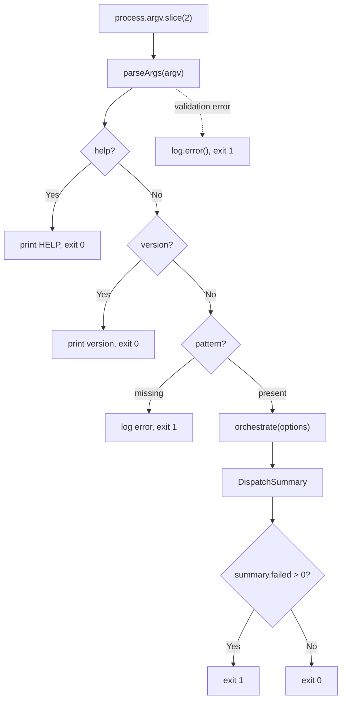

# CLI Argument Parser

The CLI entry point (`src/cli.ts`) provides a hand-rolled argument parser that
validates user input, displays help and version information, and delegates
execution to the [orchestrator](orchestrator.md).

## What it does

The CLI is the user-facing surface of `dispatch`. It:

1. Parses `process.argv` into a typed `CliArgs` object.
2. Handles `--help` and `--version` early-exit paths.
3. Validates required arguments (the glob pattern is mandatory).
4. Passes a `DispatchOptions` object to the [orchestrator](orchestrator.md).
5. Translates the orchestrator's [`DispatchSummary`](orchestrator.md#dispatchsummary) into a POSIX exit code.

## Why a custom parser instead of commander/yargs?

The project uses a hand-rolled `parseArgs()` function
(`src/cli.ts:59-116`) rather than an established CLI framework like
[commander](https://github.com/tj/commander.js),
[yargs](https://yargs.js.org/), or
[citty](https://github.com/unjs/citty).

The likely reasons are:

- **Zero dependencies**: The project keeps its dependency footprint minimal.
  The only runtime dependencies are `chalk`, `glob`, and the two provider SDKs.
  Adding a CLI framework would add another dependency (and its transitive
  dependencies) for a relatively simple argument surface.
- **Small option set**: Dispatch has only 8 options. A hand-rolled parser for
  this surface area is straightforward and fits in ~60 lines.
- **Full control**: The parser can exit immediately with targeted error messages
  (e.g., provider validation against [`PROVIDER_NAMES`](../provider-system/provider-overview.md#the-provider-registry)) without mapping through
  a framework's validation API.

### Trade-offs and limitations

The custom parser does **not** handle several edge cases that established
frameworks handle automatically:

| Edge case | Behavior | Framework equivalent |
|-----------|----------|---------------------|
| Combined short flags (`-vh`) | Treated as an unknown option, exits with error | Automatically expanded to `-v -h` |
| Repeated flags (`--dry-run --dry-run`) | Silently accepted, last value wins (booleans are idempotent) | Configurable: error, array, or last-wins |
| `--option=value` syntax | Not supported; treated as an unknown option | Automatically split on `=` |
| Missing value after `--concurrency` | `parseInt(undefined)` returns `NaN`, caught by the `isNaN` check, exits with error | Type-checked with clear error message |
| Missing value after `--provider` | `undefined` fails the `PROVIDER_NAMES.includes()` check, exits with "Unknown provider" | Type-checked with clear error message |
| Missing value after `--server-url` | Silently sets `serverUrl` to `undefined` — this is a bug | Would require a value |
| Missing value after `--cwd` | `resolve(undefined)` returns `process.cwd()` — silent no-op | Would require a value |
| Unknown options starting with `-` | Correctly exits with "Unknown option" error | Configurable behavior |
| Positional arguments | First non-flag argument becomes the pattern; subsequent positionals silently overwrite | Positional argument definitions |

**Recommendation**: If the option surface grows significantly, consider
migrating to a lightweight framework. For the current set of options, the
custom parser is adequate but should add `=` splitting and value-presence
checks for `--server-url` and `--cwd`.

## Options reference

| Option | Type | Default | Description |
|--------|------|---------|-------------|
| `<glob>` | string (positional) | *required* | Glob pattern matching markdown task files |
| `--dry-run` | boolean | `false` | List discovered tasks without executing (see [dry-run mode](orchestrator.md#dry-run-mode)) |
| `--no-plan` | boolean | `false` | Skip the [planner agent](../planning-and-dispatch/planner.md), dispatch tasks directly |
| `--concurrency <n>` | integer | `1` | Maximum parallel dispatches per batch (see [concurrency model](orchestrator.md#concurrency-model)) |
| `--provider <name>` | string | `"opencode"` | AI agent backend (`opencode` or `copilot`); see [Provider Abstraction](../provider-system/provider-overview.md) |
| `--server-url <url>` | string | *none* | Connect to a running provider server instead of starting one |
| `--cwd <dir>` | string | `process.cwd()` | Working directory for file discovery and agent execution |
| `-h`, `--help` | boolean | `false` | Show usage information |
| `-v`, `--version` | boolean | `false` | Show version string |

## The `--server-url` option

The `--server-url` option allows connecting to an already-running AI provider
server rather than starting a new one. The protocol and authentication depend
on the selected provider:

- **OpenCode**: The URL points to an OpenCode server's HTTP API (e.g.,
  `http://localhost:4096`). The `@opencode-ai/sdk` creates a client using
  `createOpencodeClient({ baseUrl: url })`. No separate authentication is
  required — the server handles auth. See the
  [OpenCode Backend](../provider-system/opencode-backend.md) for details.
- **Copilot**: The URL is passed as `cliUrl` to `CopilotClient`. The Copilot
  SDK connects to a Copilot CLI server. Authentication uses the logged-in
  Copilot CLI user, or environment variables `COPILOT_GITHUB_TOKEN`,
  `GH_TOKEN`, or `GITHUB_TOKEN`. See the
  [Copilot Backend](../provider-system/copilot-backend.md#authentication) for
  authentication details.

When `--server-url` is not provided, each provider boots its own server
process and manages its lifecycle internally.

## Exit code contract

The CLI uses a binary exit code scheme (`src/cli.ts:148`):

| Exit code | Meaning |
|-----------|---------|
| `0` | All tasks completed successfully (or `--help`/`--version` was used) |
| `1` | One or more tasks failed, **or** a fatal error occurred |

There is **no distinction** between partial failure and total failure. If 9 out
of 10 tasks succeed but 1 fails, the exit code is `1`. This follows POSIX
conventions where non-zero indicates "something went wrong," but it means CI
pipelines cannot tell from the exit code alone whether 1% or 100% of tasks
failed.

**Workaround**: Use `--dry-run` to preview the task count, then parse the
[TUI](tui.md) or [logger](../shared-types/logger.md) output for per-task results if you need granular failure
information. A future enhancement could add `--json` output or distinct exit
codes (e.g., `2` for partial failure).

Unhandled exceptions from `main()` are caught by the top-level `.catch()`
handler (`src/cli.ts:151-154`), which logs the error message and exits with
code `1`.

## Version string and tsup define

The version string is currently hardcoded as `"dispatch v0.1.0"` at
`src/cli.ts:128`. The adjacent comment says `// Read version from package.json
at build time via tsup define`, indicating the intent to inject the version at
build time.

However, the tsup configuration (`tsup.config.ts`) does **not** currently
include a `define` block:

```typescript
// tsup.config.ts — current state
export default defineConfig({
  entry: ["src/cli.ts"],
  format: ["esm"],
  target: "node18",
  outDir: "dist",
  clean: true,
  splitting: false,
  sourcemap: true,
  dts: false,
  banner: {
    js: "#!/usr/bin/env node",
  },
});
```

The `define` feature is **not wired up**. The version string in
`package.json` (`"0.1.0"`) and the hardcoded string in `cli.ts` happen to
match, but they are not synchronized automatically.

To wire this up, the tsup config would need:

```typescript
import { readFileSync } from "fs";
const pkg = JSON.parse(readFileSync("./package.json", "utf-8"));

export default defineConfig({
  // ...existing config...
  define: {
    __VERSION__: JSON.stringify(pkg.version),
  },
});
```

Then `src/cli.ts:128` would become:

```typescript
console.log(`dispatch v${__VERSION__}`);
```

See the [tsup documentation on `define`](https://tsup.egoist.dev/) for details
on build-time constant injection.

## How it works



## Related documentation

- [Orchestrator pipeline](orchestrator.md) — what happens after the CLI
  delegates to `orchestrate()`
- [Terminal UI](tui.md) — real-time dashboard rendering during dispatch
- [Integrations](integrations.md) — tsup build configuration, chalk color
  handling
- [Provider Abstraction & Backends](../provider-system/provider-overview.md) — provider boot
  process and server-url semantics
- [Planning & Dispatch Pipeline](../planning-and-dispatch/overview.md) — planner,
  dispatcher, and git operations that the orchestrator coordinates
- [Task Parsing & Markdown](../task-parsing/overview.md) — how markdown task
  files are parsed and mutated
