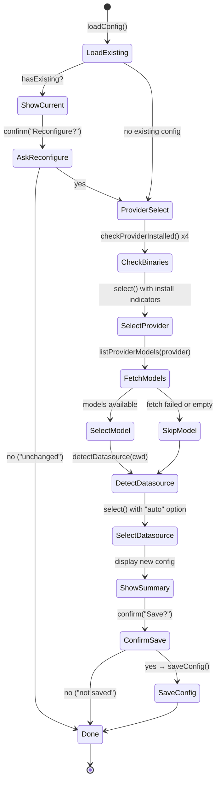
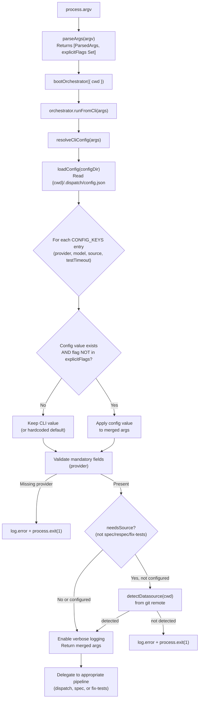

# Configuration System

The configuration system provides persistent user defaults for Dispatch CLI
options. It consists of three modules that work together: a data layer
(`src/config.ts`) for reading and writing the config file, a config resolution
layer (`src/orchestrator/cli-config.ts`) that merges file defaults with
[CLI](cli.md) flags, and config subcommand handling embedded in the CLI entry
point (`src/cli.ts`).

## What it does

The configuration system allows users to set persistent defaults for frequently
used CLI options, avoiding the need to pass `--provider copilot --source github`
on every invocation. It supports four configurable keys and provides a
`dispatch config` subcommand for managing stored values via an interactive
wizard.

## Why it exists

Without persistent configuration, every `dispatch` invocation requires the user
to specify their provider and datasource explicitly. For teams that always use
the same provider and issue tracker, this is repetitive. The configuration
system solves this by:

1. **Storing defaults** in a JSON file at a well-known location.
2. **Merging defaults beneath CLI flags** so explicit flags always take
   precedence.
3. **Validating early** so invalid config values are caught at startup, not
   mid-pipeline.

## Key source files

| File | Role |
|------|------|
| `src/config.ts` | Config data layer: file I/O, validation, `handleConfigCommand()` |
| `src/orchestrator/cli-config.ts` | Config resolution: three-tier merge, mandatory field validation |
| `src/cli.ts` | CLI entry point: early config subcommand routing, `explicitFlags` tracking |

## Config file location and format

The persistent configuration file is stored at:

```
{CWD}/.dispatch/config.json
```

The path is **project-local**, computed by `getConfigPath()` (`src/config.ts:42-44`)
using `process.cwd()` joined with `.dispatch/config.json`. The `.dispatch/`
directory is created automatically by `saveConfig()` via
`mkdir(dirname(configPath), { recursive: true })` when it does not exist.

The `configDir` parameter can be overridden for testing or when the `dispatch
config` subcommand receives a `--cwd` flag. The CLI entry point
(`src/cli.ts:271-278`) parses `--cwd` from the raw arguments before delegating
to `handleConfigCommand()`, constructing `configDir = join(cwd, ".dispatch")`.

### File format

The config file is a plain JSON object with optional fields:

```json
{
  "provider": "copilot",
  "model": "claude-sonnet-4-5",
  "source": "github",
  "testTimeout": 5
}
```

All fields are optional. The file is written as pretty-printed JSON with
2-space indentation and a trailing newline (`JSON.stringify(config, null, 2) + "\n"`).

### What happens when the config file is corrupted or contains invalid JSON

`loadConfig()` (`src/config.ts:52-59`) wraps the file read and JSON parse in a
`try/catch` block. If the file does not exist, contains invalid JSON, or cannot
be read for any reason, the function silently returns an empty object (`{}`).
**No error is displayed to the user.** This means:

- A corrupted config file is treated identically to a missing one.
- There is no warning that stored configuration was ignored.
- The user must re-configure via `dispatch config`.

This is a deliberate simplicity choice: the config file is not critical
infrastructure, and the merge logic applies hardcoded defaults when config
values are absent.

### File permissions

The config file inherits the default permissions of the project directory.
On Unix systems, files created by `writeFile` typically receive mode `0644`
(owner read-write, group and others read-only). The `.dispatch/` directory
is created with the default `mkdir` permissions (typically `0755`).

### Is the config file format versioned?

No. The `DispatchConfig` interface (`src/config.ts:19-30`) defines the schema,
but there is no version field, no migration logic, and no schema validation
beyond per-key type checks. When new keys are added to `DispatchConfig` in
future releases:

- Existing config files continue to work because all fields are optional.
- New keys default to their hardcoded defaults until explicitly set.
- Old keys that are removed from the interface would be silently ignored
  by `loadConfig()` (the cast to `DispatchConfig` does not strip unknown
  fields, but the merge logic only reads known keys via `CONFIG_TO_CLI`).

If forward/backward compatibility becomes a concern, a `version` field and
migration function could be added, but the current optional-fields design
handles the common cases without explicit versioning.

## Configurable keys

| Key | Type | Valid values | Description |
|-----|------|-------------|-------------|
| `provider` | string | `"opencode"`, `"copilot"`, `"claude"`, `"codex"` | AI agent backend (see [Provider System](../provider-system/provider-overview.md)) |
| `model` | string | Any non-empty string (provider-specific format) | Model to use when spawning agents. Copilot: bare model ID (e.g., `"claude-sonnet-4-5"`). OpenCode: `"provider/model"` (e.g., `"anthropic/claude-sonnet-4"`). When omitted, the provider uses its auto-detected default. |
| `source` | string | `"github"`, `"azdevops"`, `"md"` | Default datasource for issue fetching (see [Datasource System](../datasource-system/overview.md)) |
| `testTimeout` | number | Positive number (e.g., 1, 5, 10) | Test timeout in minutes for `--fix-tests` mode. Parsed via `Number()`. |

These four keys are defined by `CONFIG_KEYS` (`src/config.ts:33`).

### Validation rules

`validateConfigValue()` (`src/config.ts:80-111`) enforces type-specific rules:

- **`provider`** must be in `PROVIDER_NAMES` (currently `"opencode"`,
  `"copilot"`, `"claude"`, `"codex"`). Invalid values produce:
  `Invalid provider "<value>". Available: opencode, copilot, claude, codex`
- **`model`** must be a non-empty string. Empty or whitespace-only values
  are rejected with: `Invalid model: value must not be empty`
- **`source`** must be in `DATASOURCE_NAMES` (currently `"github"`,
  `"azdevops"`, `"md"`). Invalid values produce:
  `Invalid source "<value>". Available: github, azdevops, md`
- **`testTimeout`** must parse to a positive finite number via
  `Number(value)`. Values like `"0"`, `"-5"`, `"abc"`, and `""` are rejected.
  The error message is:
  `Invalid testTimeout "<value>". Must be a positive number (minutes)`

### Config key to CLI field mapping

The config system uses different key names than the CLI in one case:

| Config key | CLI flag | CLI args field |
|------------|----------|----------------|
| `provider` | `--provider` | `provider` |
| `model` | *(no direct CLI flag)* | `model` |
| `source` | `--source` | `issueSource` |
| `testTimeout` | `--test-timeout` | `testTimeout` |

The `source` to `issueSource` mapping (`src/orchestrator/cli-config.ts:28`)
is the only field where the config key differs from the CLI field name. This
is because the CLI uses `--source` (matching the config key), but the internal
`RawCliArgs` interface uses `issueSource` to avoid confusion with other uses
of "source" in the codebase.

## The `dispatch config` command

Running `dispatch config` launches an interactive wizard that guides the user
through provider, model, and datasource selection. It is the sole interface
for managing persistent configuration.

```bash
dispatch config
dispatch config --cwd /path/to/project
```

The wizard (`src/config-prompts.ts:30-159`) uses
[`@inquirer/prompts`](https://github.com/SBoudrias/Inquirer.js) to present an
interactive terminal flow. The wizard follows a linear, non-branching sequence:



### Provider install indicators

The wizard checks whether each provider's CLI binary is available on PATH
by running `checkProviderInstalled()` (`src/providers/detect.ts:29-37`),
which attempts to execute the binary with `--version`. The results are shown
as colored dots next to each provider name:

- Green dot (`chalk.green("●")`) -- provider CLI binary found on PATH
- Red dot (`chalk.red("●")`) -- provider CLI binary not found

The binary names are defined in `PROVIDER_BINARIES`
(`src/providers/detect.ts:16-21`): `opencode`, `copilot`, `claude`, `codex`.

### Model selection

After selecting a provider, the wizard fetches available models via
`listProviderModels(provider)` (`src/providers/index.ts:65-76`). This starts
a temporary provider instance, fetches the model list, and tears down. If the
provider is not running or the fetch fails, model selection is silently
skipped and the existing model value (if any) is preserved.

When models are available, the user selects from a list that includes a
"default (provider decides)" option. The model format is provider-specific:

- **Copilot**: Bare model ID (e.g., `claude-sonnet-4-5`)
- **OpenCode**: `provider/model` format (e.g., `anthropic/claude-sonnet-4`)

### Datasource selection with auto-detection

The wizard runs `detectDatasource(process.cwd())` to inspect the `origin` git
remote URL. If a match is found, it's displayed as an informational message.
The user can then select from the available datasources or choose `"auto"` to
defer detection to runtime. Selecting `"auto"` stores `source: undefined` in
the config file, which means the datasource will be auto-detected on each
`dispatch` invocation.

### What the wizard does NOT support

The wizard does **not** support:

- Editing individual keys (it always runs the full reconfiguration flow)
- Resetting configuration to defaults (the user can decline to save)
- Non-interactive mode (it requires a TTY for `@inquirer/prompts`)

In CI or non-interactive environments, use CLI flags (`--provider`, `--source`,
etc.) instead of `dispatch config`.

## Three-tier configuration precedence

The configuration resolution system implements a three-tier precedence chain
where explicit CLI flags override config-file defaults, which override
hardcoded defaults. This is the most architecturally significant aspect of the
configuration system.



### How the `explicitFlags` set prevents config overrides

The `parseArgs()` function in `src/cli.ts:97-232` builds a `Set<string>` of
CLI flag names that were explicitly provided by the user. Every time a flag
is parsed, its corresponding field name is added to the set:

```
// Example: user passes --provider copilot
args.provider = val as ProviderName;
explicitFlags.add("provider");  // marks "provider" as explicit
```

During the merge step in `resolveCliConfig()` (`src/orchestrator/cli-config.ts:65-71`),
each config key is checked against `explicitFlags`:

```
for (const configKey of CONFIG_KEYS) {
    const cliField = CONFIG_TO_CLI[configKey];
    const configValue = config[configKey];
    if (configValue !== undefined && !explicitFlags.has(cliField)) {
        setCliField(merged, cliField, configValue);
    }
}
```

This means a config value is applied **only when** both conditions are true:
1. The config key has a value in `{cwd}/.dispatch/config.json`
2. The corresponding CLI flag was **not** explicitly passed

This design ensures that `dispatch --provider opencode` always uses OpenCode
even if the config file says `"provider": "copilot"`.

### Precedence examples

| Scenario | Config file | CLI flags | Resolved value |
|----------|------------|-----------|----------------|
| Config only | `provider: "copilot"` | (none) | `copilot` |
| CLI only | (none) | `--provider opencode` | `opencode` |
| Both (CLI wins) | `provider: "copilot"` | `--provider opencode` | `opencode` |
| Neither | (none) | (none) | `opencode` (hardcoded default in `parseArgs`) |
| Partial overlap | `provider: "copilot", source: "github"` | `--provider opencode` | provider=`opencode`, source=`github` |

### Why the config command runs before `parseArgs`

The `config` command is intercepted at `src/cli.ts:238` before `parseArgs()`
is called:

```
if (rawArgv[0] === "config") {
    await handleConfigCommand(rawArgv.slice(1));
    process.exit(0);
}
```

This early interception is necessary because `parseArgs()` would reject
`"config"` as an unknown option. By checking for `config` first and delegating
to `handleConfigCommand()` before any argument parsing occurs, the config
command operates independently of the dispatch argument grammar.

## Mandatory configuration validation

After merging config-file defaults, `resolveCliConfig()` validates that the
provider is configured (`src/orchestrator/cli-config.ts:73-82`):

- **`provider`** -- must be set via CLI flag (`--provider`) or config file
  (`dispatch config`). The validation checks `explicitFlags.has("provider") ||
  config.provider !== undefined` -- it verifies the user explicitly chose a
  provider rather than relying on the hardcoded default.

If the provider is missing, the user receives a targeted error message:

```
✖ Missing required configuration: provider
    Run 'dispatch config' to configure defaults interactively.
    Or pass it as a CLI flag: --provider <name>
```

The process exits with code `1`.

Note that `provider` has a hardcoded default of `"opencode"` in `parseArgs()`
(`src/cli.ts:103`), so the merged args always contain a provider value. The
validation deliberately ignores this default and checks whether the user
actively chose a provider through either the CLI flag or config file. In
practice, this means provider validation only fails when neither the CLI flag
nor the config file provides a value, even though the merged args contain
`"opencode"`.

### Datasource (source) validation

The `source` field is **not** validated as mandatory in the same way. Instead,
`resolveCliConfig()` uses a two-step approach
(`src/orchestrator/cli-config.ts:97-113`):

1. **Check if source is needed**: Source is only required for dispatch mode --
   it is skipped entirely when `--spec`, `--respec`, or `--fix-tests` is active
   (these modes defer source resolution to their own pipeline logic).
2. **Auto-detect if not configured**: When source is needed but not set via
   CLI flag or config file, `detectDatasource(cwd)` inspects the `origin` git
   remote URL and attempts to match it against known patterns (see
   [auto-detection](#auto-detection-from-git-remote)).
3. **Fail if undetectable**: If auto-detection also fails, the process exits
   with code `1` and guidance to set `--source` or run `dispatch config`.

## The `--server-url` CLI option

The `--server-url` flag is a **CLI-only** option -- it is not part of the four
config keys and cannot be persisted via `dispatch config`. It stores the URL of
an already-running AI provider server. When set, the provider connects to this
URL instead of spawning a new server process.

Provider-specific behavior:

- **OpenCode** (`--provider opencode`): The URL points to an OpenCode server's
  HTTP API (e.g., `http://localhost:4096`). The SDK creates a client using
  `createOpencodeClient({ baseUrl: url })`.
- **Copilot** (`--provider copilot`): The URL is passed as `cliUrl` to the
  Copilot SDK client.
- **Claude** (`--provider claude`): The URL is passed to the Claude Code CLI
  process.
- **Codex** (`--provider codex`): The URL is passed to the Codex CLI process.

See the [Provider Abstraction](../provider-system/provider-overview.md) for
details on each provider's connection handling.

## Concurrency limits

The `--concurrency` flag controls the maximum number of parallel task
dispatches. The CLI enforces a hard ceiling: `MAX_CONCURRENCY = 64`, exported
from `src/cli.ts:22`. Any value passed via `--concurrency` is clamped to this
maximum during argument parsing.

When `--concurrency` is not explicitly provided and no config-file value
exists, the orchestrator computes a default using `defaultConcurrency()`:

```
Math.max(1, Math.min(cpus().length, Math.floor(freemem() / 1024 / 1024 / 500)))
```

This formula ensures the default is:
- At least `1` (never zero)
- At most the number of CPU cores
- At most `floor(freeMemoryMB / 500)` -- each concurrent task is assumed to
  need roughly 500 MB of memory

| System | CPUs | Free memory | Default concurrency |
|--------|------|-------------|-------------------|
| Laptop | 8 | 4 GB | `min(8, 8)` = 8 |
| Laptop | 8 | 2 GB | `min(8, 4)` = 4 |
| CI runner | 2 | 1 GB | `min(2, 2)` = 2 |
| Low memory | 4 | 400 MB | `max(1, min(4, 0))` = 1 |

## Supported providers

Four AI agent backends are currently registered in `src/providers/index.ts:19-24`:

| Provider name | Module | Description |
|--------------|--------|-------------|
| `opencode` | `src/providers/opencode.ts` | Default. Spawns or connects to an OpenCode server. |
| `copilot` | `src/providers/copilot.ts` | GitHub Copilot agent backend. |
| `claude` | `src/providers/claude.ts` | Anthropic Claude Code CLI backend. |
| `codex` | `src/providers/codex.ts` | OpenAI Codex CLI backend. |

Provider names are validated at two points:
1. **CLI level** (`src/cli.ts:161`): `--provider` is checked against
   `PROVIDER_NAMES` at parse time.
2. **Config level** (`src/config.ts:82-86`): `validateConfigValue("provider", ...)`
   checks against `PROVIDER_NAMES`.

Each provider also exposes a `listModels()` function used by the interactive
wizard to populate the model selection menu. See
`src/providers/index.ts:65-76` for the `listProviderModels()` implementation.

To add a new provider, see the
[Adding a Provider guide](../provider-system/adding-a-provider.md).

## Supported datasources

Three datasource backends are currently registered in `src/datasources/index.ts`:

| Datasource name | Backend | Description |
|----------------|---------|-------------|
| `github` | GitHub CLI (`gh`) | GitHub Issues via the `gh` CLI tool. |
| `azdevops` | Azure CLI (`az`) | Azure DevOps work items via the `az` CLI. |
| `md` | Local filesystem | Local markdown files. |

Datasource names are validated at two points:
1. **CLI level** (`src/cli.ts:129`): `--source` is checked against
   `DATASOURCE_NAMES` at parse time.
2. **Config level** (`src/config.ts:94-98`): `validateConfigValue("source", ...)`
   checks against `DATASOURCE_NAMES`.

### Auto-detection from git remote

When `--source` is not provided and no config value exists, the datasource is
auto-detected by inspecting the `origin` git remote URL via
`detectDatasource()` in `src/datasources/index.ts:84-97`:

| Remote URL pattern | Detected source |
|-------------------|----------------|
| Contains `github.com` | `github` |
| Contains `dev.azure.com` | `azdevops` |
| Contains `visualstudio.com` | `azdevops` |

Both HTTPS and SSH URL formats are supported. If no pattern matches, or if
the directory is not a git repository, detection returns `null` and the
pipeline produces an error suggesting `--source` be specified.

## The `--spec` flag: issue IDs vs glob patterns

The `--spec` flag (`src/cli.ts:117-124`) accepts one or more values. It
collects all subsequent non-flag arguments into an array, then stores either
a single string or an array depending on count:

```
args.spec = specs.length === 1 ? specs[0] : specs;
```

The disambiguation between issue IDs and glob patterns happens downstream in
the spec pipeline via `isIssueNumbers()` (`src/spec-generator.ts:61-63`):

- **Issue IDs**: A string matching `/^\d+(,\s*\d+)*$/` (comma-separated
  digits) is treated as issue tracker IDs.
- **Glob patterns / file paths**: Anything else (paths, wildcards, filenames)
  is treated as a local markdown file glob.
- **Array input**: If multiple values were passed, the input is always treated
  as non-issue-numbers (arrays bypass the regex test).

Examples:
```bash
dispatch --spec 42,43,44            # Issue IDs → tracker mode
dispatch --spec 42 43 44            # Multiple args → array → file/glob mode
dispatch --spec "drafts/*.md"       # Glob pattern → file/glob mode
dispatch --spec ./my-feature.md     # File path → file/glob mode
```

## Exit codes

The CLI produces the following exit codes:

| Exit code | Meaning | Trigger location |
|-----------|---------|-----------------|
| `0` | Success | `--help`, `--version`, `config` subcommand, or all tasks completed |
| `1` | Failure | Any tasks failed, validation error, or unhandled exception |
| `130` | SIGINT | User pressed Ctrl+C (`src/cli.ts:252`) |
| `143` | SIGTERM | Process received SIGTERM (`src/cli.ts:258`) |

Exit code determination (`src/cli.ts:277-278`):

```
const failed = "failed" in summary ? summary.failed : 0;
process.exit(failed > 0 ? 1 : 0);
```

There is no distinction between partial failure and total failure. If 9 out
of 10 tasks succeed but 1 fails, the exit code is `1`.

## Graceful shutdown and cleanup

The CLI installs signal handlers for `SIGINT` and `SIGTERM` at
`src/cli.ts:249-258`. Both handlers follow the same pattern:

1. Log a debug message (visible with `--verbose`).
2. Call `runCleanup()` from the [cleanup registry](../shared-types/cleanup.md).
3. Exit with the conventional `128 + signal` code.

### What `runCleanup()` releases

The cleanup registry (`src/helpers/cleanup.ts`) maintains a list of async
functions registered by subsystems during their lifecycle. Currently, the
primary resource registered for cleanup is the AI provider's `cleanup()` method,
which is registered at provider boot time via
`registerCleanup(() => instance.cleanup())`.

Depending on the provider, `cleanup()` releases:

- **OpenCode**: Stops the spawned HTTP server process via `server.close()`.
  The OpenCode provider uses a `cleaned` boolean guard to prevent double-close.
- **Copilot**: Destroys all tracked sessions via `session.destroy()`, then
  stops the Copilot CLI child process via `client.stop()`.

The cleanup registry (`src/helpers/cleanup.ts:26-34`) has these safety properties:

- **Drain-once**: `splice(0)` atomically takes all functions and clears the
  array, so repeated calls to `runCleanup()` are harmless (the second call
  finds an empty array).
- **Error-swallowing**: Each function is called in a `try/catch`. Errors are
  silently swallowed to prevent cleanup failures from masking the original
  error or blocking process exit.
- **Sequential execution**: Cleanup functions run one at a time in registration
  order, not concurrently.

### Double-signal behavior

If the user sends two rapid Ctrl+C signals, the second `SIGINT` arrives while
the first `runCleanup()` is still executing. Because `splice(0)` already
emptied the array, the second invocation returns immediately. However, if a
cleanup function hangs (e.g., provider server is unresponsive), the `await`
blocks indefinitely. There is no timeout. In this case, `kill -9` is needed
to force termination.

## Orchestrator boot process

The CLI delegates to the orchestrator via a two-step process
(`src/cli.ts:272-274`):

1. **`bootOrchestrator({ cwd })`**: Creates an `OrchestratorAgent` instance
   bound to the working directory. This is a lightweight operation that does
   not boot any AI providers or perform I/O.

2. **`orchestrator.runFromCli(args)`**: The orchestrator's CLI entry point
   (`src/orchestrator/runner.ts:138-230`), which:
   - Calls `resolveCliConfig(args)` to load and merge config defaults
   - Runs prerequisite checks (e.g., required CLI tools on PATH)
   - Ensures `.dispatch/worktrees/` is in `.gitignore`
   - Enforces mutual exclusion between `--spec`, `--respec`, and `--fix-tests`
     (see [mutual exclusion](cli.md#spec-mode-validation))
   - Routes to the appropriate pipeline: fix-tests, spec, respec, or dispatch

The `bootOrchestrator` function is exported from `src/orchestrator/runner.ts`.
The orchestrator is a thin coordinator that delegates to extracted pipeline
modules (`spec-pipeline.ts`, `dispatch-pipeline.ts`, `fix-tests-pipeline.ts`).

### Dependencies initialized during boot

The `boot()` function only captures the `cwd` parameter. All heavier
initialization (provider boot, datasource detection, agent creation) happens
lazily when `run()`, `orchestrate()`, or `generateSpecs()` is called.

## Troubleshooting

### Config file cannot be written

If `saveConfig()` fails with `EACCES` (permission denied):

1. Check permissions on the project's `.dispatch/` directory:
   `ls -la .dispatch/`
2. Ensure the user has write access: `chmod u+w .dispatch/`
3. Check disk space: `df -h .`

### Config file deleted while CLI is running

If the config file is deleted between `loadConfig()` and a subsequent
`saveConfig()` call:

- `loadConfig()` returns `{}` (empty config, no error).
- `saveConfig()` recreates the file and its parent directory via
  `mkdir(dirname(configPath), { recursive: true })`.
- No data loss occurs beyond the deleted configuration values.

### Config keys quick reference

The `dispatch config` interactive wizard manages these four persistent keys:
`provider`, `model`, `source`, `testTimeout` (defined by `CONFIG_KEYS` at
`src/config.ts:33`).

CLI-only flags that **cannot** be persisted include: `--dry-run`, `--no-plan`,
`--no-branch`, `--no-worktree`, `--force`, `--verbose`, `--concurrency`,
`--server-url`, `--retries`, `--plan-retries`, `--plan-timeout`, `--cwd`,
`--output-dir`, `--org`, `--project`. These are per-invocation options
not suited to persistent defaults.

## Related documentation

- [CLI argument parser](cli.md) -- command-line interface, options reference,
  and argument parsing
- [Orchestrator pipeline](orchestrator.md) -- how resolved options drive the
  dispatch pipeline
- [TUI](tui.md) -- terminal dashboard that reflects configuration-driven
  concurrency and phase state
- [Provider Abstraction](../provider-system/provider-overview.md) -- provider
  selection and `--server-url` semantics
- [Datasource System](../datasource-system/overview.md) -- datasource
  detection and `--source` options
- [Spec Generation](../spec-generation/overview.md) -- how `--spec` mode
  consumes resolved configuration
- [Configuration tests](../testing/config-tests.md) -- test coverage for
  config I/O, validation, and merge logic
- [Cleanup registry](../shared-types/cleanup.md) -- process-level cleanup
  mechanism used by signal handlers
- [Integrations](integrations.md) -- Node.js fs/promises, chalk, @inquirer/prompts,
  and process signal details
