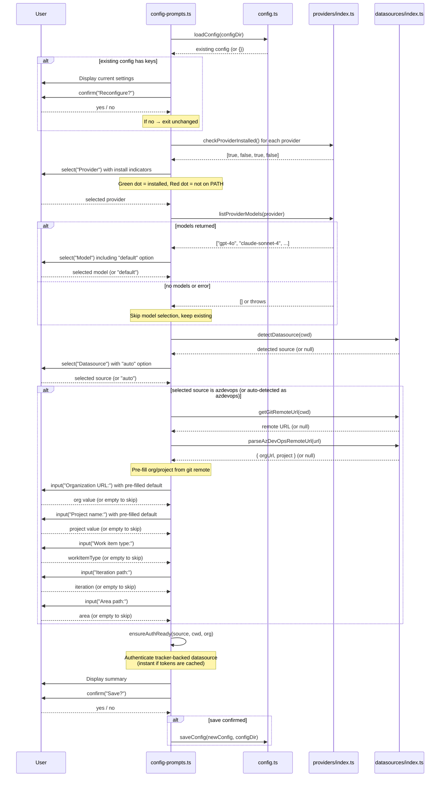
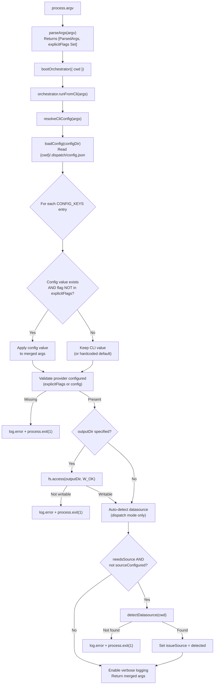

# Configuration System

The configuration system provides persistent user defaults for Dispatch CLI
options. It consists of four modules that work together: a data layer
(`src/config.ts`) for reading and writing the config file, an interactive
wizard (`src/config-prompts.ts`) for guided setup, a config resolution layer
(`src/orchestrator/cli-config.ts`) that merges file defaults with
[CLI](cli.md) flags, and config subcommand handling in the CLI entry point
(`src/cli.ts`).

## What it does

The configuration system allows users to set persistent defaults for frequently
used CLI options, avoiding the need to pass `--provider copilot --source github`
on every invocation. It supports four configurable keys and provides a
`dispatch config` subcommand that launches an interactive wizard for managing
stored values. The resolved configuration feeds into the
[orchestrator](orchestrator.md) pipeline and the [prerequisite checker](../prereqs-and-safety/prereqs.md).

## Why it exists

Without persistent configuration, every `dispatch` invocation requires the user
to specify their provider and datasource explicitly. For teams that always use
the same provider and issue tracker, this is repetitive. The configuration
system solves this by:

1. **Storing defaults** in a JSON file at a well-known project-local location.
2. **Merging defaults beneath CLI flags** so explicit flags always take
   precedence.
3. **Validating early** so invalid config values are caught at startup, not
   mid-pipeline.

## Key source files

| File | Role |
|------|------|
| `src/config.ts` | Config data layer: file I/O, validation, `handleConfigCommand()` |
| `src/config-prompts.ts` | Interactive configuration wizard: provider, model, and datasource selection |
| `src/orchestrator/cli-config.ts` | Config resolution: three-tier merge, mandatory field validation, output-dir validation |
| `src/cli.ts` | CLI entry point: early config subcommand routing, `explicitFlags` tracking |

## Config file location and format

The persistent configuration file is stored at a **project-local** path:

```
{CWD}/.dispatch/config.json
```

The path is computed by `getConfigPath()` (`src/config.ts:42-45`) using
`join(process.cwd(), ".dispatch", "config.json")`. The `.dispatch/` directory
within the current working directory is created automatically by `saveConfig()`
via `mkdir(dirname(configPath), { recursive: true })` when it does not exist.

The `dispatch config` subcommand respects the `--cwd` flag. The CLI
pre-parses `--cwd` from raw argv before calling `handleConfigCommand()`
(`src/cli.ts:277-297`), computes `configDir = join(cwd, ".dispatch")`, and
passes it through to the wizard. This means `dispatch config --cwd /other/project`
reads and writes `/other/project/.dispatch/config.json`.

### File format

The config file is a plain JSON object with optional fields:

```json
{
  "provider": "copilot",
  "model": "claude-sonnet-4-5",
  "source": "github",
  "testTimeout": 10,
  "planTimeout": 15,
  "specTimeout": 10,
  "concurrency": 4
}
```

All fields are optional. The file is written as pretty-printed JSON with
2-space indentation and a trailing newline (`JSON.stringify(config, null, 2) + "\n"`).

For Azure DevOps projects, the config file may also include:

```json
{
  "provider": "copilot",
  "source": "azdevops",
  "org": "https://dev.azure.com/myorg",
  "project": "MyProject",
  "workItemType": "User Story",
  "iteration": "MyProject\\Sprint 1",
  "area": "MyProject\\Team A"
}
```

### What happens when the config file is corrupted or contains invalid JSON

`loadConfig()` (`src/config.ts:52-59`) wraps the file read and JSON parse in a
`try/catch` block. If the file does not exist, contains invalid JSON, or cannot
be read for any reason, the function silently returns an empty object (`{}`).
**No error is displayed to the user.** This means:

- A corrupted config file is treated identically to a missing one.
- There is no warning that stored configuration was ignored.
- The user must re-configure via `dispatch config`.

This is a deliberate simplicity choice: the config file is not critical
infrastructure, and the merge logic applies hardcoded defaults when config
values are absent.

### File permissions

The config file inherits the default permissions of the project directory.
On Unix systems, files created by `writeFile` typically receive mode `0644`
(owner read-write, group and others read-only). The `.dispatch/` directory
is created with the default `mkdir` permissions (typically `0755`).

### Is the config file format versioned?

No. The `DispatchConfig` interface (`src/config.ts:19-37`) defines the schema,
but there is no version field, no migration logic, and no schema validation
beyond per-key type checks. When new keys are added to `DispatchConfig` in
future releases:

- Existing config files continue to work because all fields are optional.
- New keys default to their hardcoded defaults until explicitly set.
- Old keys that are removed from the interface would be silently ignored
  by `loadConfig()` (the cast to `DispatchConfig` does not strip unknown
  fields, but the merge logic only reads known keys via `CONFIG_TO_CLI`).

If forward/backward compatibility becomes a concern, a `version` field and
migration function could be added, but the current optional-fields design
handles the common cases without explicit versioning.

### What happens when the config file contains unknown or extra keys

Because `loadConfig()` casts the parsed JSON to `DispatchConfig` via a type
assertion (`as DispatchConfig`), there is no runtime schema stripping or
rejection of unrecognized keys. Unknown keys are silently preserved in the
returned object but never read by the merge logic, which only iterates
`CONFIG_KEYS`. When `saveConfig()` is called (e.g., by the wizard), the entire
config object is replaced — so unknown keys from a manually edited config file
are preserved through `loadConfig()` but dropped when the wizard rewrites the
file.

### Should the config file be committed to version control?

The `.dispatch/` directory is automatically added to `.gitignore` by the
dispatch tool (via `helpers/gitignore.ts`). This means:

- **By default, the config file is NOT committed** to version control. Each
  developer maintains their own local configuration.
- **This is intentional**: the config file stores per-developer preferences
  (preferred provider, model) that may differ across team members.

If your team wants a shared baseline configuration, consider documenting the
recommended settings in your project's README or contributing guide rather
than committing the config file. Alternatively, you can manually remove the
`.dispatch/` entry from `.gitignore` to share configuration, but be aware that
different developers may need different provider or model settings.

## Configurable keys

| Key | Type | Valid values | Description |
|-----|------|-------------|-------------|
| `provider` | string | `"opencode"`, `"copilot"`, `"claude"`, `"codex"` | AI agent backend (see [Provider System](../provider-system/overview.md)) |
| `model` | string | Any non-empty string (provider-specific format) | Model to use when spawning agents. Copilot uses bare model IDs (e.g., `"claude-sonnet-4-5"`), OpenCode uses `"provider/model"` format (e.g., `"anthropic/claude-sonnet-4"`). When omitted, the provider uses its auto-detected default. |
| `source` | string | `"github"`, `"azdevops"`, `"md"` | Default datasource for issue fetching (see [Datasource System](../datasource-system/overview.md)) |
| `testTimeout` | number | 1–120 (minutes) | Test timeout in minutes for the `--fix-tests` mode. |
| `planTimeout` | number | 1–120 (minutes) | Planning timeout in minutes for the planner agent (see [Timeout Utility](../shared-utilities/timeout.md)). |
| `specTimeout` | number | 1–120 (minutes) | Spec generation timeout in minutes for `--spec` and `--respec` runs. |
| `specWarnTimeout` | number | 1–120 (minutes) | Spec warn-phase timeout: the agent receives a time-warning nudge after this duration. |
| `specKillTimeout` | number | 1–120 (minutes) | Spec kill-phase timeout: the generation attempt is forcibly killed after this duration. |
| `concurrency` | number | 1–64 (integer) | Maximum parallel dispatches per batch. |
| `org` | string | Any non-empty string | Azure DevOps organization URL (e.g., `"https://dev.azure.com/myorg"`). See [Azure DevOps Datasource](../datasource-system/azdevops-datasource.md). |
| `project` | string | Any non-empty string | Azure DevOps project name. |
| `workItemType` | string | Any non-empty string | Azure DevOps work item type filter (e.g., `"User Story"`, `"Bug"`). |
| `iteration` | string | Any non-empty string | Azure DevOps iteration path (e.g., `"MyProject\\Sprint 1"`, `"@CurrentIteration"`). |
| `area` | string | Any non-empty string | Azure DevOps area path (e.g., `"MyProject\\Team A"`). |

### Validation rules

`validateConfigValue()` (`src/config.ts:94-151`) enforces type-specific rules:

- **`provider`** must be in `PROVIDER_NAMES` (currently `"opencode"`,
  `"copilot"`, `"claude"`, `"codex"`). Invalid values produce:
  `Invalid provider "<value>". Available: opencode, copilot, claude, codex`
- **`model`** must be a non-empty string. Empty or whitespace-only values
  produce: `Invalid model: value must not be empty`
- **`source`** must be in `DATASOURCE_NAMES` (currently `"github"`,
  `"azdevops"`, `"md"`). Invalid values produce:
  `Invalid source "<value>". Available: github, azdevops, md`
- **`testTimeout`** must be a finite number between 1 and 120 (inclusive).
  Values outside the range, non-numeric strings, `Infinity`, and `NaN` are
  rejected. The error message is:
  `Invalid testTimeout "<value>". Must be a number between 1 and 120 (minutes)`
- **`planTimeout`** must be a finite number between 1 and 120 (inclusive).
  Uses the same validation logic as `testTimeout`. The error message is:
  `Invalid planTimeout "<value>". Must be a number between 1 and 120 (minutes)`
- **`specTimeout`** must be a finite number between 1 and 120 (inclusive).
  Uses the same validation logic as `testTimeout`. The error message is:
  `Invalid specTimeout "<value>". Must be a number between 1 and 120 (minutes)`
- **`specWarnTimeout`** must be a finite number between 1 and 120 (inclusive).
  Uses the same validation logic as `testTimeout`. The error message is:
  `Invalid specWarnTimeout "<value>". Must be a number between 1 and 120 (minutes)`
- **`specKillTimeout`** must be a finite number between 1 and 120 (inclusive).
  Uses the same validation logic as `testTimeout`. The error message is:
  `Invalid specKillTimeout "<value>". Must be a number between 1 and 120 (minutes)`
- **`concurrency`** must be an integer between 1 and 64 (inclusive).
  Non-integers (e.g., `"1.5"`) are rejected even if within range. The error
  message is:
  `Invalid concurrency "<value>". Must be an integer between 1 and 64`
- **`org`**, **`project`**, **`workItemType`**, **`iteration`**, **`area`**
  must be non-empty strings. Empty or whitespace-only values produce:
  `Invalid <key>: value must not be empty`

### Numeric bounds (`CONFIG_BOUNDS`)

The `CONFIG_BOUNDS` constant (`src/config.ts:40-51`) defines the valid range
for numeric configuration values:

| Key | Min | Max | Type | Description |
|-----|-----|-----|------|-------------|
| `testTimeout` | 1 | 120 | number | Minutes |
| `planTimeout` | 1 | 120 | number | Minutes |
| `specTimeout` | 1 | 120 | number | Minutes |
| `specWarnTimeout` | 1 | 120 | number | Minutes |
| `specKillTimeout` | 1 | 120 | number | Minutes |
| `concurrency` | 1 | 64 | integer | Parallel tasks |

These bounds are used by `validateConfigValue()` and also imported by the
[CLI entry point](cli.md) for argument validation.

### Config key to CLI field mapping

The config system uses different key names than the CLI in some cases:

| Config key | CLI flag | CLI args field |
|------------|----------|----------------|
| `provider` | `--provider` | `provider` |
| `model` | `--model` | `model` |
| `source` | `--source` | `issueSource` |
| `testTimeout` | `--test-timeout` | `testTimeout` |
| `planTimeout` | `--plan-timeout` | `planTimeout` |
| `specTimeout` | `--spec-timeout` | `specTimeout` |
| `concurrency` | `--concurrency` | `concurrency` |
| `org` | `--org` | `org` |
| `project` | `--project` | `project` |
| `workItemType` | `--work-item-type` | `workItemType` |
| `iteration` | `--iteration` | `iteration` |
| `area` | `--area` | `area` |

The `source` to `issueSource` mapping (`src/orchestrator/cli-config.ts:28`)
is the only field where the config key differs from the CLI field name. This
is because the CLI uses `--source` (matching the config key), but the internal
`RawCliArgs` interface uses `issueSource` to avoid confusion with other uses
of "source" in the codebase.

## The `dispatch config` command

Running `dispatch config` launches an interactive wizard that guides the user
through provider selection, model selection, and datasource selection. It is
the sole interface for managing persistent configuration.

```bash
dispatch config
dispatch config --cwd /path/to/project
```

### Config wizard flow

The wizard (`src/config-prompts.ts`) uses `@inquirer/prompts` to present an
interactive, sequential configuration flow. Unlike a menu-based system, the
wizard walks the user through each decision in order.



### Wizard step details

1. **Load existing config**: Reads `{CWD}/.dispatch/config.json`. If keys
   exist, displays them and asks whether to reconfigure. If the user declines,
   the wizard exits with no changes.

2. **Provider selection**: Runs `checkProviderInstalled()` for each registered
   provider in parallel via `Promise.all`. Each provider is tested by executing
   `execFile(binaryName, ["--version"])` (`src/providers/detect.ts:29-37`).
   The selection prompt shows a green dot for installed providers and a red dot
   for providers not found on PATH. The four registered providers are
   `opencode`, `copilot`, `claude`, and `codex`
   (`src/providers/detect.ts:16-21`).

3. **Model selection**: Calls `listProviderModels(provider)` to fetch available
   models from the selected provider. If models are returned, the user picks
   one (or selects "default" to let the provider decide). If the provider
   cannot be reached or returns no models, model selection is skipped and the
   existing model value (if any) is preserved.

4. **Datasource selection**: Runs `detectDatasource(process.cwd())` to
   auto-detect the datasource from the git remote. The user can confirm the
   detected source, pick a different one, or select "auto" to defer detection
   to runtime. Selecting "auto" stores `undefined` for `source` in the config
   file, which causes runtime auto-detection on each invocation.

5. **Azure DevOps fields** (conditional): If the effective datasource is
   `azdevops` (either explicitly selected or auto-detected), the wizard
   presents five additional `input` prompts for Azure DevOps-specific
   settings:
    - **Organization URL**: Pre-filled from the git remote URL if available
      (via `getGitRemoteUrl()` → `parseAzDevOpsRemoteUrl()`).
    - **Project name**: Pre-filled from the git remote URL if available.
    - **Work item type**: Optional filter (e.g., `"User Story"`, `"Bug"`).
    - **Iteration path**: Optional (e.g., `"MyProject\\Sprint 1"`,
      `"@CurrentIteration"`).
    - **Area path**: Optional (e.g., `"MyProject\\Team A"`).

   All five fields are optional — leaving an input empty omits the key from
   the config file. The pre-fill logic is best-effort: if `getGitRemoteUrl()`
   returns `null` or `parseAzDevOpsRemoteUrl()` cannot parse the URL, the
   fields default to their existing config values (if any) or remain empty.

6. **Tracker authentication**: After datasource selection (and Azure DevOps
   fields if applicable), the wizard calls `ensureAuthReady()` to
   pre-authenticate the selected tracker datasource. For GitHub, this
   validates the git remote and runs the OAuth device flow if no cached
   token exists. For Azure DevOps, it uses the configured organization URL.
   For the markdown datasource, no authentication is needed and the step is
   skipped. If authentication fails, a warning is logged and the wizard
   continues — the user can re-run `dispatch config` or authenticate later
   at runtime.

7. **Summary and save**: Displays the full configuration summary and asks for
   confirmation. On "yes", writes the config via `saveConfig()`. On "no",
   exits without saving.

### Wizard Ctrl+C behavior

If the user presses Ctrl+C during any prompt, `@inquirer/prompts` throws an
`ExitPromptError`. This error propagates up to the CLI's top-level `.catch()`
handler (`src/cli.ts:339-343`), which logs the error and exits with code `1`.
Because the config subcommand runs before `parseArgs()`, the signal handlers
for `SIGINT`/`SIGTERM` are not yet installed at that point.

## Config resolution pipeline

The config resolution pipeline (`src/orchestrator/cli-config.ts:57-118`)
implements the full merge-validate-detect flow that runs on every
non-config invocation.



## Three-tier configuration precedence

The configuration resolution system implements a three-tier precedence chain
where explicit CLI flags override config-file defaults, which override
hardcoded defaults. This is the most architecturally significant aspect of the
configuration system.

### How the `explicitFlags` set prevents config overrides

The `parseArgs()` function in `src/cli.ts:99-271` uses Commander.js
`getOptionValueSource()` to build a `Set<string>` of CLI flag names that were
explicitly provided by the user. After Commander parses the arguments, the CLI
iterates over a `SOURCE_MAP` and checks each option's value source:

```
for (const [attr, flag] of Object.entries(SOURCE_MAP)) {
    if (program.getOptionValueSource(attr) === "cli") {
        explicitFlags.add(flag);
    }
}
```

During the merge step in `resolveCliConfig()` (`src/orchestrator/cli-config.ts:65-71`),
each config key is checked against `explicitFlags`:

```
for (const configKey of CONFIG_KEYS) {
    const cliField = CONFIG_TO_CLI[configKey];
    const configValue = config[configKey];
    if (configValue !== undefined && !explicitFlags.has(cliField)) {
        setCliField(merged, cliField, configValue);
    }
}
```

This means a config value is applied **only when** both conditions are true:
1. The config key has a value in `{CWD}/.dispatch/config.json`
2. The corresponding CLI flag was **not** explicitly passed

This design ensures that `dispatch --provider opencode` always uses OpenCode
even if the config file says `"provider": "copilot"`.

### Precedence examples

| Scenario | Config file | CLI flags | Resolved value |
|----------|------------|-----------|----------------|
| Config only | `provider: "copilot"` | (none) | `copilot` |
| CLI only | (none) | `--provider opencode` | `opencode` |
| Both (CLI wins) | `provider: "copilot"` | `--provider opencode` | `opencode` |
| Neither | (none) | (none) | `opencode` (hardcoded default in `parseArgs`) |
| Partial overlap | `provider: "copilot", source: "github"` | `--provider opencode` | provider=`opencode`, source=`github` |

### Why the config command runs before `parseArgs`

The `config` command is intercepted at `src/cli.ts:277` before `parseArgs()`
is called. A separate Commander instance with `allowUnknownOption()` and
`allowExcessArguments()` is used to pre-parse the `--cwd` flag:

```
if (rawArgv[0] === "config") {
    const configProgram = new Command("dispatch-config")
      .exitOverride()
      .configureOutput({ writeOut: () => {}, writeErr: () => {} })
      .helpOption(false)
      .allowUnknownOption(true)
      .allowExcessArguments(true)
      .option("--cwd <dir>", "Working directory", (v: string) => resolve(v));
    // ...parse and extract cwd...
    const configDir = join(configProgram.opts().cwd ?? process.cwd(), ".dispatch");
    await handleConfigCommand(rawArgv.slice(1), configDir);
    process.exit(0);
}
```

This early interception is necessary because `parseArgs()` would reject
`"config"` as an unknown positional. By checking for `config` first and
delegating to `handleConfigCommand()` before any argument parsing occurs, the
config command operates independently of the dispatch argument grammar.

## Mandatory configuration validation

After merging config-file defaults, `resolveCliConfig()` validates that
the **provider** is configured (`src/orchestrator/cli-config.ts:73-82`):

The check verifies that either:
- The `--provider` flag was explicitly passed (present in `explicitFlags`), OR
- The config file contains a `provider` value.

If neither is true, the user receives an error:

```
Missing required configuration: provider
  Run 'dispatch config' to configure defaults interactively.
  Or pass it as a CLI flag: --provider <name>
```

The process exits with code `1`.

### Cleanup behavior during config resolution

The `resolveCliConfig()` function calls `process.exit(1)` directly on
validation failures (`src/orchestrator/cli-config.ts:88,99,118`). Because
`process.exit()` triggers `'exit'` event handlers but **not** signal handlers,
and because the [cleanup registry](../shared-types/cleanup.md) is drained only
by signal handlers and the top-level `.catch()` handler, the `process.exit(1)`
calls in config resolution **do not trigger cleanup**.

In practice, this is safe because config resolution runs before any AI
provider has been booted — there are no provider server processes to clean up
at this point. The provider boot occurs later in the pipeline, after config
resolution succeeds.

Note that `provider` has a hardcoded default of `"opencode"` in `parseArgs()`
(`src/cli.ts:203`), so in practice the provider validation only fails if the
user has not set a provider in the config file AND the hardcoded default is
somehow cleared. The validation checks `explicitFlags.has("provider") ||
config.provider !== undefined` (`src/orchestrator/cli-config.ts:74-75`), which
means it checks whether the flag was explicitly provided OR the config file has
a value -- it does NOT check the merged value. Because `parseArgs` always sets
`provider: "opencode"` as a default, the merged args always have a provider
value, but the validation ignores that default.

### Datasource auto-detection (conditional)

Unlike provider validation, datasource (`source`) is **not** validated as
mandatory in all cases. The behavior depends on the operating mode
(`src/orchestrator/cli-config.ts:97-113`):

- **Dispatch mode** (no `--spec`, `--respec`, or `--fix-tests`): If the source
  is not configured via CLI or config file, `resolveCliConfig()` runs
  `detectDatasource(cwd)` to auto-detect from the git remote. If detection
  fails (no recognizable remote URL), the process exits with an error.
- **Spec/respec mode**: Datasource resolution is deferred to the spec
  pipeline's own `resolveSource()` function, which has context-aware fallback
  logic.
- **Fix-tests mode**: No datasource is needed; the check is skipped entirely.

### Output-dir validation

When `--output-dir` is specified, `resolveCliConfig()` validates that the
directory exists and is writable using `fs.access(outputDir, constants.W_OK)`
(`src/orchestrator/cli-config.ts:85-94`). If the directory does not exist or
is not writable, the process exits with:

```
--output-dir path does not exist or is not writable: /path/to/dir
```

Note that this validation uses `access()` with `W_OK`, which requires the
directory to **already exist**. Unlike a `mkdir`-based approach, it does not
create the directory. The spec pipeline creates the output directory later
if needed, but the early validation catches obviously wrong paths (typos,
read-only mounts) before any expensive work begins.

## The `serverUrl` config option

The `serverUrl` option is a **CLI-only** flag (`--server-url`). It is not in
`CONFIG_KEYS` and cannot be persisted via `dispatch config`. When set, the
provider connects to a running server URL instead of spawning a new server
process. This applies to all four supported providers.

Setting `--server-url` is useful for development environments where a provider
server is long-running, avoiding the startup overhead on each dispatch
invocation.

## Default concurrency computation

When `--concurrency` is not explicitly provided and no config-file value
exists, the orchestrator computes a default using `defaultConcurrency()` from
`src/spec-generator.ts`. This value also governs how
[task execution groups](../task-parsing/api-reference.md#grouptasksbymode) are
dispatched concurrently:

```
Math.max(1, Math.min(cpus().length, Math.floor(freemem() / 1024 / 1024 / 500)))
```

This formula ensures the default is:
- At least `1` (never zero)
- At most the number of CPU cores
- At most `floor(freeMemoryMB / 500)` -- each concurrent task is assumed to
  need roughly 500 MB of memory

The computation runs at pipeline invocation time, not at argument parsing
time, so it reflects the system's resource availability when the pipeline
actually starts.

The `--concurrency` flag is enforced to not exceed `MAX_CONCURRENCY` (64),
which is derived from `CONFIG_BOUNDS.concurrency.max` in `src/cli.ts:23`.

| System | CPUs | Free memory | Default concurrency |
|--------|------|-------------|-------------------|
| Laptop | 8 | 4 GB | `min(8, 8)` = 8 |
| Laptop | 8 | 2 GB | `min(8, 4)` = 4 |
| CI runner | 2 | 1 GB | `min(2, 2)` = 2 |
| Low memory | 4 | 400 MB | `max(1, min(4, 0))` = 1 |

## Supported providers

Four AI agent backends are currently registered in `src/providers/index.ts`:

| Provider name | Boot module | Description |
|--------------|-------------|-------------|
| `opencode` | `src/providers/opencode.ts` | Default. Spawns or connects to an [OpenCode server](../provider-system/opencode-backend.md). |
| `copilot` | `src/providers/copilot.ts` | [GitHub Copilot](../provider-system/copilot-backend.md) agent backend. |
| `claude` | `src/providers/claude.ts` | Anthropic Claude agent backend. |
| `codex` | `src/providers/codex.ts` | OpenAI Codex agent backend. |

Provider names are validated at two points:
1. **CLI level** (`src/cli.ts:122-124`): `--provider` is checked against
   `PROVIDER_NAMES` via Commander's `choices()` API.
2. **Config level** (`src/config.ts:82-86`): The validation function checks
   provider names against the same list.

To add a new provider, see the
[Adding a Provider guide](../provider-system/adding-a-provider.md).

## Supported datasources

Three datasource backends are currently registered in `src/datasources/index.ts`:

| Datasource name | Backend | Description |
|----------------|---------|-------------|
| `github` | GitHub CLI (`gh`) | GitHub Issues via the `gh` CLI tool. See [GitHub Datasource](../datasource-system/github-datasource.md). |
| `azdevops` | Azure CLI (`az`) | Azure DevOps work items via the `az` CLI. See [Azure DevOps Datasource](../datasource-system/azdevops-datasource.md). |
| `md` | Local filesystem | Local markdown files. See [Markdown Datasource](../datasource-system/markdown-datasource.md). |

Datasource names are validated at two points:
1. **CLI level** (`src/cli.ts:126-129`): `--source` is checked against
   `DATASOURCE_NAMES` via Commander's `choices()` API.
2. **Config level** (`src/config.ts:94-98`): The validation function checks
   datasource names against the same list.

### Auto-detection from git remote

When `--source` is not provided and no config value exists, the dispatch
pipeline auto-detects the datasource by inspecting the `origin` git remote URL
via `detectDatasource()` in `src/datasources/index.ts`:

| Remote URL pattern | Detected source |
|-------------------|----------------|
| Contains `github.com` | `github` |
| Contains `dev.azure.com` | `azdevops` |
| Contains `visualstudio.com` | `azdevops` |

Both HTTPS and SSH URL formats are supported. If no pattern matches, or if
the directory is not a git repository, detection returns `null`. In dispatch
mode, this causes a fatal error. In spec/respec mode, the spec pipeline's
`resolveSource()` handles fallback logic separately.

## The `--spec` flag: issue IDs vs glob patterns

The `--spec` flag (`src/cli.ts:141-150`) accepts one or more values. It
collects all subsequent non-flag arguments into an array, then stores either
a single string or an array depending on count:

```
args.spec = specs.length === 1 ? specs[0] : specs;
```

The disambiguation between issue IDs and glob patterns happens downstream in
the spec pipeline via `isIssueNumbers()`:

- **Issue IDs**: A string matching `/^\d+(,\s*\d+)*$/` (comma-separated
  digits) is treated as issue tracker IDs.
- **Glob patterns / file paths**: Anything else (paths, wildcards, filenames)
  is treated as a local markdown file glob.
- **Array input**: If multiple values were passed, the input is always treated
  as non-issue-numbers (arrays bypass the regex test).

Examples:
```bash
dispatch --spec 42,43,44            # Issue IDs -> tracker mode
dispatch --spec 42 43 44            # Multiple args -> array -> file/glob mode
dispatch --spec "drafts/*.md"       # Glob pattern -> file/glob mode
dispatch --spec ./my-feature.md     # File path -> file/glob mode
```

## Exit codes

The CLI produces the following exit codes:

| Exit code | Meaning | Trigger location |
|-----------|---------|-----------------|
| `0` | Success | `--help`, `--version`, `config` subcommand, or all tasks completed |
| `1` | Failure | Any tasks failed, validation error, or unhandled exception |
| `130` | SIGINT | User pressed Ctrl+C (`src/cli.ts:289-293`) |
| `143` | SIGTERM | Process received SIGTERM (`src/cli.ts:295-299`) |

Exit code determination (`src/cli.ts:317`):

```
const failed = "failed" in summary ? summary.failed : ("success" in summary && !summary.success ? 1 : 0);
process.exit(failed > 0 ? 1 : 0);
```

This handles both `DispatchSummary` (which has a `failed` count) and
`FixTestsSummary` (which has a `success` boolean). There is no distinction
between partial failure and total failure.

## Graceful shutdown and cleanup

The CLI installs signal handlers for `SIGINT` and `SIGTERM` at
`src/cli.ts:307-317`. Both handlers follow the same pattern:

1. Log a debug message (visible with `--verbose`).
2. Call `runCleanup()` from the [cleanup registry](../shared-types/cleanup.md).
3. Exit with the conventional `128 + signal` code.

See the [cleanup registry documentation](../shared-types/cleanup.md) for
details on how `runCleanup()` drains registered functions.

### What `runCleanup()` releases

The cleanup registry (`src/helpers/cleanup.ts`) maintains a list of async
functions registered by subsystems during their lifecycle. Currently, the
primary resource registered for cleanup is the AI provider's `cleanup()`
method, which is registered at provider boot time via
`registerCleanup(() => instance.cleanup())`.

The cleanup registry has these safety properties:

- **Drain-once**: `splice(0)` atomically takes all functions and clears the
  array, so repeated calls to `runCleanup()` are harmless (the second call
  finds an empty array).
- **Error-swallowing**: Each function is called in a `try/catch`. Errors are
  silently swallowed to prevent cleanup failures from masking the original
  error or blocking process exit.
- **Sequential execution**: Cleanup functions run one at a time in registration
  order, not concurrently.

### Double-signal behavior

If the user sends two rapid Ctrl+C signals, the second `SIGINT` arrives while
the first `runCleanup()` is still executing. Because `splice(0)` already
emptied the array, the second invocation returns immediately. However, if a
cleanup function hangs (e.g., provider server is unresponsive), the `await`
blocks indefinitely. There is no timeout. In this case, `kill -9` is needed
to force termination.

## Orchestrator boot process

The CLI delegates to the orchestrator via a two-step process
(`src/cli.ts:330-332`):

1. **`bootOrchestrator({ cwd })`**: Creates an `OrchestratorAgent` instance
   bound to the working directory. This is a lightweight operation that does
   not boot any AI providers or perform I/O. The `boot()` function is
   imported from `src/orchestrator/runner.ts`.

2. **`orchestrator.runFromCli(args)`**: The orchestrator's CLI entry point,
   which:
   - Calls `resolveCliConfig(args)` to load and merge config defaults
   - Runs prerequisite checks via `checkPrereqs()`
   - Ensures `.dispatch/worktrees/` is gitignored
   - Enforces mutual exclusion of `--spec`, `--respec`, and `--fix-tests`
   - Routes to the appropriate pipeline based on mode flags

### Three operating modes

The runner (`src/orchestrator/runner.ts:138-230`) supports three mutually
exclusive modes:

| Mode | Trigger | Pipeline |
|------|---------|----------|
| **Fix-tests** | `--fix-tests` | `runFixTestsPipeline()` (dynamically imported) |
| **Spec/Respec** | `--spec` or `--respec` | `generateSpecs()` via `runSpecPipeline()` |
| **Dispatch** | Default (with optional issue IDs) | `orchestrate()` via `runDispatchPipeline()` |

The `--fix-tests` flag is mutually exclusive with positional issue IDs
(`src/orchestrator/runner.ts:166-169`). If combined, the process exits with
an error.

### Dependencies initialized during boot

The `boot()` function only captures the `cwd` parameter. All heavier
initialization (provider boot, datasource detection, agent creation) happens
lazily when `run()`, `orchestrate()`, or `generateSpecs()` is called.

## Troubleshooting

### Config file cannot be written

If `saveConfig()` fails with `EACCES` (permission denied):

1. Check permissions on `.dispatch/`: `ls -la .dispatch/`
2. Ensure the user has write access: `chmod u+w .dispatch/`
3. Check disk space: `df -h .`

### Config file deleted while CLI is running

If the config file is deleted between `loadConfig()` and a subsequent
`saveConfig()` call:

- `loadConfig()` returns `{}` (empty config, no error).
- `saveConfig()` recreates the file and its parent directory via
  `mkdir(dirname(configPath), { recursive: true })`.
- No data loss occurs beyond the deleted configuration values.

### Config keys reference

The interactive wizard supports the following config keys: `provider`,
`model`, `source`, `testTimeout`, `planTimeout`, `specTimeout`, `concurrency`, `org`,
`project`, `workItemType`, `iteration`, `area`.
Keys like `dryRun`, `noPlan`, `noBranch`, `noWorktree`, `force`, and
`verbose` are CLI-only flags and cannot be persisted via `dispatch config`.
See [the --no-branch flag](cli.md#the---no-branch-flag) for details on that
flag's behavior, and the
[Planning & Dispatch Pipeline](../planning-and-dispatch/overview.md) for how
`--no-plan` affects execution.

## Related documentation

- [CLI argument parser](cli.md) -- command-line interface, options reference,
  and argument parsing
- [Orchestrator pipeline](orchestrator.md) -- how resolved options drive the
  dispatch pipeline
- [TUI](tui.md) -- terminal dashboard that reflects configuration-driven
  concurrency and phase state
- [Provider Abstraction](../provider-system/overview.md) -- provider
  selection and `--server-url` semantics
- [Datasource System](../datasource-system/overview.md) -- datasource
  detection and `--source` options
- [Spec Generation](../spec-generation/overview.md) -- how `--spec` mode
  consumes resolved configuration
- [Cleanup registry](../shared-types/cleanup.md) -- process-level cleanup
  mechanism used by signal handlers
- [Integrations](integrations.md) -- Node.js fs/promises, chalk, @inquirer/prompts,
  and process signal details
- [Prerequisite Checker](../prereqs-and-safety/prereqs.md) -- environment
  validation that runs immediately after config resolution
- [Timeout Utility](../shared-utilities/timeout.md) -- deadline enforcement
  that uses `planTimeout` from configuration
- [Provider Tests](../testing/provider-tests.md) -- test coverage for provider
  boot and session management
- [Configuration Tests](../testing/config-tests.md) -- test suite for config
  I/O, validation, and merge precedence
- [Logger](../shared-types/logger.md) -- how `--verbose` sets `log.verbose`
  and debug output is toggled via configuration
- [Copilot Backend](../provider-system/copilot-backend.md) -- how `--server-url`
  connects to an existing Copilot CLI server
- [Planner Agent](../planning-and-dispatch/planner.md) -- how `--no-plan` and
  `--plan-timeout` affect the planning phase
