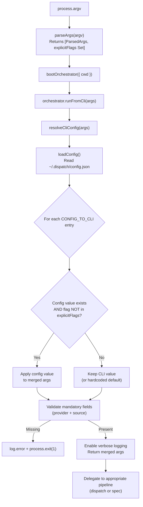

# Configuration System

The configuration system provides persistent user defaults for Dispatch CLI
options. It consists of three modules that work together: a data layer
(`src/config.ts`) for reading and writing the config file, a config resolution
layer (`src/orchestrator/cli-config.ts`) that merges file defaults with
[CLI](cli.md) flags, and config subcommand handling embedded in the CLI entry
point (`src/cli.ts`).

## What it does

The configuration system allows users to set persistent defaults for frequently
used CLI options, avoiding the need to pass `--provider copilot --source github`
on every invocation. It supports eight configurable keys and provides a
`dispatch config` subcommand for managing stored values.

## Why it exists

Without persistent configuration, every `dispatch` invocation requires the user
to specify their provider and datasource explicitly. For teams that always use
the same provider and issue tracker, this is repetitive. The configuration
system solves this by:

1. **Storing defaults** in a JSON file at a well-known location.
2. **Merging defaults beneath CLI flags** so explicit flags always take
   precedence.
3. **Validating early** so invalid config values are caught at startup, not
   mid-pipeline.

## Key source files

| File | Role |
|------|------|
| `src/config.ts` | Config data layer: file I/O, validation, `handleConfigCommand()` |
| `src/orchestrator/cli-config.ts` | Config resolution: three-tier merge, mandatory field validation |
| `src/cli.ts` | CLI entry point: early config subcommand routing, `explicitFlags` tracking |

## Config file location and format

The persistent configuration file is stored at:

```
~/.dispatch/config.json
```

The path is computed by `getConfigPath()` (`src/config.ts:46-48`) using
`os.homedir()` joined with `.dispatch/config.json`. The `~/.dispatch/`
directory is created automatically by `saveConfig()` via
`mkdir(dirname(configPath), { recursive: true })` when it does not exist.

### File format

The config file is a plain JSON object with optional fields:

```json
{
  "provider": "copilot",
  "concurrency": 3,
  "source": "github",
  "org": "https://dev.azure.com/myorg",
  "project": "MyProject",
  "serverUrl": "http://localhost:4096",
  "planTimeout": 10,
  "planRetries": 1
}
```

All fields are optional. The file is written as pretty-printed JSON with
2-space indentation and a trailing newline (`JSON.stringify(config, null, 2) + "\n"`).

### What happens when the config file is corrupted or contains invalid JSON

`loadConfig()` (`src/config.ts:56-63`) wraps the file read and JSON parse in a
`try/catch` block. If the file does not exist, contains invalid JSON, or cannot
be read for any reason, the function silently returns an empty object (`{}`).
**No error is displayed to the user.** This means:

- A corrupted config file is treated identically to a missing one.
- There is no warning that stored configuration was ignored.
- The user must re-set their configuration via `dispatch config set`.

This is a deliberate simplicity choice: the config file is not critical
infrastructure, and the merge logic applies hardcoded defaults when config
values are absent.

### File permissions

The config file inherits the default permissions of the user's home directory.
On Unix systems, files created by `writeFile` typically receive mode `0644`
(owner read-write, group and others read-only). The `~/.dispatch/` directory
is created with the default `mkdir` permissions (typically `0755`).

### Is the config file format versioned?

No. The `DispatchConfig` interface (`src/config.ts:20-29`) defines the schema,
but there is no version field, no migration logic, and no schema validation
beyond per-key type checks. When new keys are added to `DispatchConfig` in
future releases:

- Existing config files continue to work because all fields are optional.
- New keys default to their hardcoded defaults until explicitly set.
- Old keys that are removed from the interface would be silently ignored
  by `loadConfig()` (the cast to `DispatchConfig` does not strip unknown
  fields, but the merge logic only reads known keys via `CONFIG_TO_CLI`).

If forward/backward compatibility becomes a concern, a `version` field and
migration function could be added, but the current optional-fields design
handles the common cases without explicit versioning.

## Configurable keys

| Key | Type | Valid values | Description |
|-----|------|-------------|-------------|
| `provider` | string | `"opencode"`, `"copilot"` | AI agent backend (see [Provider System](../provider-system/provider-overview.md)) |
| `concurrency` | number | Positive integer (1, 2, 3, ...) | Max parallel dispatches per batch |
| `source` | string | `"github"`, `"azdevops"`, `"md"` | Default datasource for issue fetching (see [Datasource System](../datasource-system/overview.md)) |
| `org` | string | Any non-empty string | Azure DevOps organization URL |
| `project` | string | Any non-empty string | Azure DevOps project name |
| `serverUrl` | string | Any non-empty string | URL of a running provider server |
| `planTimeout` | number | Positive number (e.g., 0.5, 1, 10) | Planning timeout in minutes. Parsed via `parseFloat`. |
| `planRetries` | number | Non-negative integer (0, 1, 2, ...) | Number of retry attempts after planning timeout. Parsed via `parseInt`. |

### Validation rules

`validateConfigValue()` (`src/config.ts:95-143`) enforces type-specific rules:

- **`provider`** must be in `PROVIDER_NAMES` (currently `"opencode"` or
  `"copilot"`). Invalid values produce:
  `Invalid provider "<value>". Available: opencode, copilot`
- **`source`** must be in `DATASOURCE_NAMES` (currently `"github"`,
  `"azdevops"`, `"md"`). Invalid values produce:
  `Invalid source "<value>". Available: github, azdevops, md`
- **`concurrency`** must parse to a positive integer. Values like `"0"`,
  `"-1"`, `"1.5"`, and `"abc"` are rejected.
- **`org`**, **`project`**, **`serverUrl`** must be non-empty strings.
- **`planTimeout`** must parse to a positive finite number via
  `Number(value)`. Values like `"0"`, `"-5"`, `"abc"`, and `""` are rejected.
  The error message is:
  `Invalid planTimeout "<value>". Must be a positive number (minutes)`
- **`planRetries`** must parse to a non-negative integer via
  `Number(value)`. Values like `"-1"`, `"1.5"`, and `"abc"` are rejected.
  The error message is:
  `Invalid planRetries "<value>". Must be a non-negative integer`

### Config key to CLI field mapping

The config system uses different key names than the CLI in one case:

| Config key | CLI flag | CLI args field |
|------------|----------|----------------|
| `provider` | `--provider` | `provider` |
| `concurrency` | `--concurrency` | `concurrency` |
| `source` | `--source` | `issueSource` |
| `org` | `--org` | `org` |
| `project` | `--project` | `project` |
| `serverUrl` | `--server-url` | `serverUrl` |
| `planTimeout` | `--plan-timeout` | `planTimeout` |
| `planRetries` | `--plan-retries` | `planRetries` |

The `source` to `issueSource` mapping (`src/orchestrator/cli-config.ts:24`)
is the only field where the config key differs from the CLI field name. This
is because the CLI uses `--source` (matching the config key), but the internal
`RawCliArgs` interface uses `issueSource` to avoid confusion with other uses
of "source" in the codebase.

## The `dispatch config` subcommand

The config subcommand (`src/config.ts:166-253`) supports five operations:

### `dispatch config set <key> <value>`

Sets a persistent default value. The key is validated against `CONFIG_KEYS`,
and the value is validated by `validateConfigValue()`. If validation passes,
the current config is loaded, the key is updated, and the config is saved.

```bash
dispatch config set provider copilot
dispatch config set source github
dispatch config set concurrency 3
dispatch config set serverUrl http://localhost:4096
dispatch config set org https://dev.azure.com/myorg
dispatch config set project MyProject
dispatch config set planTimeout 10
dispatch config set planRetries 2
```

### `dispatch config get <key>`

Prints the value of a single key to stdout. If the key is not set, nothing is
printed (no error, no default value). Output goes to `console.log` (not the
logger) so it can be captured in scripts:

```bash
PROVIDER=$(dispatch config get provider)
```

### `dispatch config list`

Prints all set configuration values in `key=value` format, one per line. If no
configuration is set, prints a dim hint: `"No configuration set."` Output is
pipe-friendly:

```bash
dispatch config list
# provider=copilot
# source=github
# concurrency=3
```

### `dispatch config reset`

Deletes the config file entirely using `rm(configPath, { force: true })`. This
removes all stored configuration, reverting to hardcoded defaults.

**Why delete rather than write an empty config?** Deleting the file is simpler
and produces the same observable behavior: `loadConfig()` returns `{}` whether
the file is absent or contains `{}`. Deletion avoids leaving a zero-content
file that might confuse users inspecting the `.dispatch/` directory, and it
also removes the file from the filesystem entirely, which is cleaner when
users want to completely reset their Dispatch state.

### `dispatch config path`

Prints the absolute path to the config file. Useful for scripts and debugging:

```bash
cat "$(dispatch config path)"
```

## Three-tier configuration precedence

The configuration resolution system implements a three-tier precedence chain
where explicit CLI flags override config-file defaults, which override
hardcoded defaults. This is the most architecturally significant aspect of the
configuration system.



### How the `explicitFlags` set prevents config overrides

The `parseArgs()` function in `src/cli.ts:97-232` builds a `Set<string>` of
CLI flag names that were explicitly provided by the user. Every time a flag
is parsed, its corresponding field name is added to the set:

```
// Example: user passes --provider copilot
args.provider = val as ProviderName;
explicitFlags.add("provider");  // marks "provider" as explicit
```

During the merge step in `resolveCliConfig()` (`src/orchestrator/cli-config.ts:52-57`),
each config key is checked against `explicitFlags`:

```
for (const [configKey, cliField] of Object.entries(CONFIG_TO_CLI)) {
    const configValue = config[configKey as keyof DispatchConfig];
    if (configValue !== undefined && !explicitFlags.has(cliField)) {
        (merged as Record<string, unknown>)[cliField] = configValue;
    }
}
```

This means a config value is applied **only when** both conditions are true:
1. The config key has a value in `~/.dispatch/config.json`
2. The corresponding CLI flag was **not** explicitly passed

This design ensures that `dispatch --provider opencode` always uses OpenCode
even if the config file says `"provider": "copilot"`.

### Precedence examples

| Scenario | Config file | CLI flags | Resolved value |
|----------|------------|-----------|----------------|
| Config only | `provider: "copilot"` | (none) | `copilot` |
| CLI only | (none) | `--provider opencode` | `opencode` |
| Both (CLI wins) | `provider: "copilot"` | `--provider opencode` | `opencode` |
| Neither | (none) | (none) | `opencode` (hardcoded default in `parseArgs`) |
| Partial overlap | `provider: "copilot", source: "github"` | `--provider opencode` | provider=`opencode`, source=`github` |

### Why the config subcommand runs before `parseArgs`

The `config` subcommand is intercepted at `src/cli.ts:238` before `parseArgs()`
is called:

```
if (rawArgv[0] === "config") {
    await handleConfigCommand(rawArgv.slice(1));
    process.exit(0);
}
```

This early interception is necessary because `parseArgs()` would reject config
subcommand arguments as unknown options. For example, `dispatch config set provider copilot`
would cause `parseArgs` to fail on `"config"`, `"set"`, and the positional
arguments. By checking for `config` first and delegating to
`handleConfigCommand()` before any argument parsing occurs, the config
subcommand operates independently of the dispatch argument grammar.

If this check ran after `parseArgs`, the following would break:
- `dispatch config set <key> <value>` -- `config` is not a valid flag
- `dispatch config list` -- `list` is not a valid flag
- `dispatch config reset` -- `reset` is not a valid flag

## Mandatory configuration validation

After merging config-file defaults, `resolveCliConfig()` validates that two
mandatory fields are configured (`src/orchestrator/cli-config.ts:59-82`):

1. **`provider`** -- must be set via CLI flag (`--provider`) or config file
   (`dispatch config set provider <name>`).
2. **`source`** (mapped to `issueSource`) -- must be set via CLI flag
   (`--source`) or config file (`dispatch config set source <name>`).

If either is missing, the user receives a targeted error message with
remediation guidance:

```
✖ Missing required configuration: provider, source
    Configure defaults with:
      dispatch config set provider <name>
      dispatch config set source <name>
    Or pass them as CLI flags: --provider <name> --source <name>
```

The process exits with code `1`.

Note that `provider` has a hardcoded default of `"opencode"` in `parseArgs()`
(`src/cli.ts:103`), so in practice the provider validation only fails if the
user has not set a provider in the config file AND the hardcoded default is
somehow cleared. The validation checks `explicitFlags.has("provider") ||
config.provider !== undefined` (`src/orchestrator/cli-config.ts:60-61`), which
means it checks whether the flag was explicitly provided OR the config file has
a value -- it does NOT check the merged value. Because `parseArgs` always sets
`provider: "opencode"` as a default, the merged args always have a provider
value, but the validation ignores that default. In practice this means provider
validation only fails when neither the CLI flag nor the config file provides a
value, even though the merged args contain `"opencode"`. The `source` field
has no hardcoded default, making it the field most likely to trigger the
validation error on first use.

## The `serverUrl` config option

The `serverUrl` config key stores the URL of an already-running AI provider
server. When set, the provider connects to this URL instead of spawning a new
server process. This applies to both supported providers:

- **OpenCode** (`--provider opencode`): The URL points to an OpenCode server's
  HTTP API (e.g., `http://localhost:4096`). The SDK creates a client using
  `createOpencodeClient({ baseUrl: url })`. See the
  [OpenCode Backend](../provider-system/opencode-backend.md) for details.
- **Copilot** (`--provider copilot`): The URL is passed as `cliUrl` to the
  Copilot SDK client. See the
  [Copilot Backend](../provider-system/copilot-backend.md) for details.

Setting `serverUrl` in the config file is useful for development environments
where a provider server is long-running, avoiding the startup overhead on
each dispatch invocation.

## Default concurrency computation

When `--concurrency` is not explicitly provided and no config-file value
exists, the orchestrator computes a default using `defaultConcurrency()` from
`src/spec-generator.ts:48-51`:

```
Math.max(1, Math.min(cpus().length, Math.floor(freemem() / 1024 / 1024 / 500)))
```

This formula ensures the default is:
- At least `1` (never zero)
- At most the number of CPU cores
- At most `floor(freeMemoryMB / 500)` -- each concurrent task is assumed to
  need roughly 500 MB of memory

The computation runs at pipeline invocation time (`src/agents/orchestrator.ts:207`),
not at argument parsing time, so it reflects the system's resource availability
when the pipeline actually starts. The [TUI](tui.md) displays active task counts
driven by this concurrency value.

| System | CPUs | Free memory | Default concurrency |
|--------|------|-------------|-------------------|
| Laptop | 8 | 4 GB | `min(8, 8)` = 8 |
| Laptop | 8 | 2 GB | `min(8, 4)` = 4 |
| CI runner | 2 | 1 GB | `min(2, 2)` = 2 |
| Low memory | 4 | 400 MB | `max(1, min(4, 0))` = 1 |

## Supported providers

Two AI agent backends are currently registered in `src/providers/index.ts`:

| Provider name | SDK | Description |
|--------------|-----|-------------|
| `opencode` | `@opencode-ai/sdk` v1.2.10 | Default. Spawns or connects to an OpenCode server. |
| `copilot` | `@github/copilot-sdk` v0.1.0 | GitHub Copilot agent backend. |

Provider names are validated at two points:
1. **CLI level** (`src/cli.ts:161`): `--provider` is checked against
   `PROVIDER_NAMES` at parse time.
2. **Config level** (`src/config.ts:94`): `dispatch config set provider` is
   validated against the same list.

To add a new provider, see the
[Adding a Provider guide](../provider-system/adding-a-provider.md).

## Supported datasources

Three datasource backends are currently registered in `src/datasources/index.ts`:

| Datasource name | Backend | Description |
|----------------|---------|-------------|
| `github` | GitHub CLI (`gh`) | GitHub Issues via the `gh` CLI tool. |
| `azdevops` | Azure CLI (`az`) | Azure DevOps work items via the `az` CLI. |
| `md` | Local filesystem | Local markdown files. |

Datasource names are validated at two points:
1. **CLI level** (`src/cli.ts:129`): `--source` is checked against
   `DATASOURCE_NAMES` at parse time.
2. **Config level** (`src/config.ts:100`): `dispatch config set source` is
   validated against the same list.

### Auto-detection from git remote

When `--source` is not provided and no config value exists, the spec pipeline
auto-detects the datasource by inspecting the `origin` git remote URL via
`detectDatasource()` in `src/datasources/index.ts:66-87`:

| Remote URL pattern | Detected source |
|-------------------|----------------|
| Contains `github.com` | `github` |
| Contains `dev.azure.com` | `azdevops` |
| Contains `visualstudio.com` | `azdevops` |

Both HTTPS and SSH URL formats are supported. If no pattern matches, or if
the directory is not a git repository, detection returns `null` and the
pipeline produces an error suggesting `--source` be specified.

## The `--spec` flag: issue IDs vs glob patterns

The `--spec` flag (`src/cli.ts:117-124`) accepts one or more values. It
collects all subsequent non-flag arguments into an array, then stores either
a single string or an array depending on count:

```
args.spec = specs.length === 1 ? specs[0] : specs;
```

The disambiguation between issue IDs and glob patterns happens downstream in
the spec pipeline via `isIssueNumbers()` (`src/spec-generator.ts:61-63`):

- **Issue IDs**: A string matching `/^\d+(,\s*\d+)*$/` (comma-separated
  digits) is treated as issue tracker IDs.
- **Glob patterns / file paths**: Anything else (paths, wildcards, filenames)
  is treated as a local markdown file glob.
- **Array input**: If multiple values were passed, the input is always treated
  as non-issue-numbers (arrays bypass the regex test).

Examples:
```bash
dispatch --spec 42,43,44            # Issue IDs → tracker mode
dispatch --spec 42 43 44            # Multiple args → array → file/glob mode
dispatch --spec "drafts/*.md"       # Glob pattern → file/glob mode
dispatch --spec ./my-feature.md     # File path → file/glob mode
```

## Exit codes

The CLI produces the following exit codes:

| Exit code | Meaning | Trigger location |
|-----------|---------|-----------------|
| `0` | Success | `--help`, `--version`, `config` subcommand, or all tasks completed |
| `1` | Failure | Any tasks failed, validation error, or unhandled exception |
| `130` | SIGINT | User pressed Ctrl+C (`src/cli.ts:252`) |
| `143` | SIGTERM | Process received SIGTERM (`src/cli.ts:258`) |

Exit code determination (`src/cli.ts:277-278`):

```
const failed = "failed" in summary ? summary.failed : 0;
process.exit(failed > 0 ? 1 : 0);
```

There is no distinction between partial failure and total failure. If 9 out
of 10 tasks succeed but 1 fails, the exit code is `1`.

## Graceful shutdown and cleanup

The CLI installs signal handlers for `SIGINT` and `SIGTERM` at
`src/cli.ts:249-258`. Both handlers follow the same pattern:

1. Log a debug message (visible with `--verbose`).
2. Call `runCleanup()` from the [cleanup registry](../shared-types/cleanup.md).
3. Exit with the conventional `128 + signal` code.

### What `runCleanup()` releases

The cleanup registry (`src/cleanup.ts`) maintains a list of async functions
registered by subsystems during their lifecycle. Currently, the primary
resource registered for cleanup is the AI provider's `cleanup()` method, which
is registered at provider boot time via `registerCleanup(() => instance.cleanup())`.

Depending on the provider, `cleanup()` releases:

- **OpenCode**: Stops the spawned HTTP server process via `server.close()`.
  The OpenCode provider uses a `cleaned` boolean guard to prevent double-close.
- **Copilot**: Destroys all tracked sessions via `session.destroy()`, then
  stops the Copilot CLI child process via `client.stop()`.

The cleanup registry (`src/cleanup.ts:26-34`) has these safety properties:

- **Drain-once**: `splice(0)` atomically takes all functions and clears the
  array, so repeated calls to `runCleanup()` are harmless (the second call
  finds an empty array).
- **Error-swallowing**: Each function is called in a `try/catch`. Errors are
  silently swallowed to prevent cleanup failures from masking the original
  error or blocking process exit.
- **Sequential execution**: Cleanup functions run one at a time in registration
  order, not concurrently.

### Double-signal behavior

If the user sends two rapid Ctrl+C signals, the second `SIGINT` arrives while
the first `runCleanup()` is still executing. Because `splice(0)` already
emptied the array, the second invocation returns immediately. However, if a
cleanup function hangs (e.g., provider server is unresponsive), the `await`
blocks indefinitely. There is no timeout. In this case, `kill -9` is needed
to force termination.

## Orchestrator boot process

The CLI delegates to the orchestrator via a two-step process
(`src/cli.ts:272-274`):

1. **`bootOrchestrator({ cwd })`**: Creates an `OrchestratorAgent` instance
   bound to the working directory. This is a lightweight operation that does
   not boot any AI providers or perform I/O.

2. **`orchestrator.runFromCli(args)`**: The orchestrator's CLI entry point,
   which:
   - Calls `resolveCliConfig(args)` to load and merge config defaults
   - Validates mandatory configuration
   - Routes to the spec pipeline (if `--spec` is present) or the dispatch
     pipeline (otherwise)

The `bootOrchestrator` function is exported from `src/agents/index.ts` and
delegates to `src/agents/orchestrator.ts:158`. The orchestrator itself is not
an agent -- it is a pipeline coordinator that boots and manages agents
(planner, executor, spec) internally.

### Dependencies initialized during boot

The `boot()` function only captures the `cwd` parameter. All heavier
initialization (provider boot, datasource detection, agent creation) happens
lazily when `run()`, `orchestrate()`, or `generateSpecs()` is called.

## Troubleshooting

### Config file cannot be written

If `saveConfig()` fails with `EACCES` (permission denied):

1. Check permissions on `~/.dispatch/`: `ls -la ~/.dispatch/`
2. Ensure the user has write access: `chmod u+w ~/.dispatch/`
3. Check disk space: `df -h ~`

### Config file deleted while CLI is running

If the config file is deleted between `loadConfig()` and a subsequent
`saveConfig()` call:

- `loadConfig()` returns `{}` (empty config, no error).
- `saveConfig()` recreates the file and its parent directory via
  `mkdir(dirname(configPath), { recursive: true })`.
- No data loss occurs beyond the deleted configuration values.

### Unknown config key error

If `dispatch config set <key> <value>` reports an unknown key, the key must be
one of: `provider`, `concurrency`, `source`, `org`, `project`, `serverUrl`,
`planTimeout`, `planRetries`.
Keys like `dryRun`, `noPlan`, `noBranch`, and `verbose` are CLI-only flags and
cannot be persisted. See [the --no-branch flag](cli.md#the---no-branch-flag)
for details on that flag's behavior, and the
[Planning & Dispatch Pipeline](../planning-and-dispatch/overview.md) for how
`--no-plan` affects execution.

## Related documentation

- [CLI argument parser](cli.md) -- command-line interface, options reference,
  and argument parsing
- [Orchestrator pipeline](orchestrator.md) -- how resolved options drive the
  dispatch pipeline
- [TUI](tui.md) -- terminal dashboard that reflects configuration-driven
  concurrency and phase state
- [Provider Abstraction](../provider-system/provider-overview.md) -- provider
  selection and `--server-url` semantics
- [Copilot Backend](../provider-system/copilot-backend.md) -- Copilot-specific
  `serverUrl` and authentication details
- [OpenCode Backend](../provider-system/opencode-backend.md) -- OpenCode-specific
  `serverUrl` and server lifecycle
- [Datasource System](../datasource-system/overview.md) -- datasource
  detection and `--source` options
- [Spec Generation](../spec-generation/overview.md) -- how `--spec` mode
  consumes resolved configuration
- [Configuration tests](../testing/config-tests.md) -- test coverage for
  config I/O, validation, and merge logic
- [Cleanup registry](../shared-types/cleanup.md) -- process-level cleanup
  mechanism used by signal handlers
- [Integrations](integrations.md) -- Node.js fs/promises, chalk, and process
  signal details
- [Planning & Dispatch Pipeline](../planning-and-dispatch/overview.md) --
  pipeline stages that consume resolved `--no-plan` and `--concurrency` options
