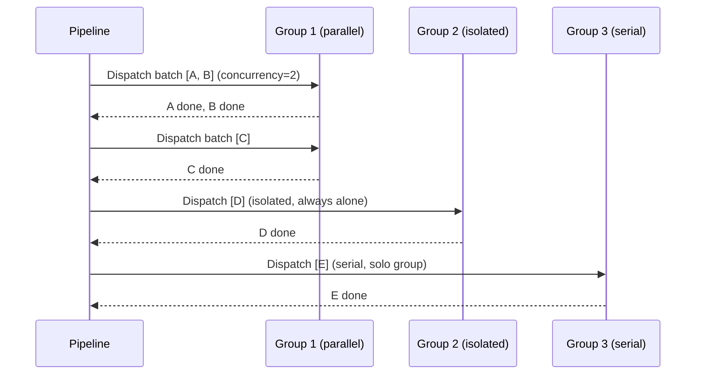
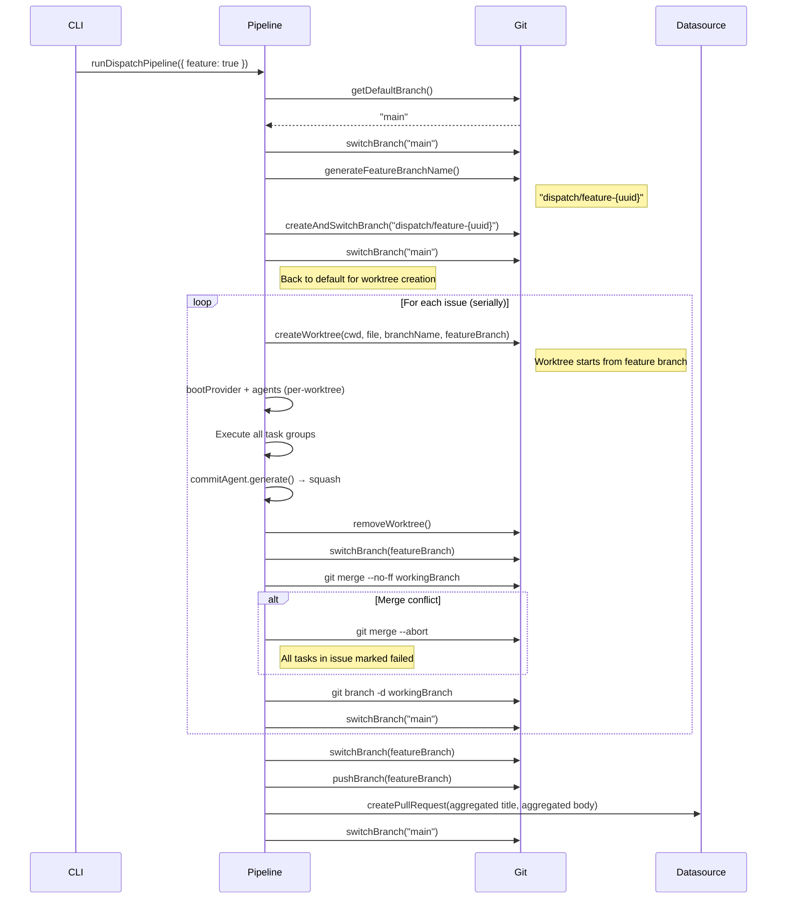
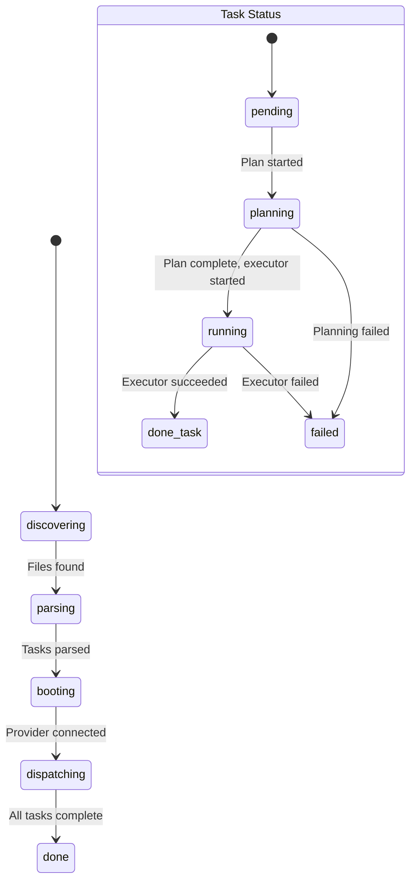

# Dispatch Pipeline

The dispatch pipeline (`src/orchestrator/dispatch-pipeline.ts`) is the core
execution engine of the dispatch tool. It orchestrates the full lifecycle of
AI-driven task execution: discovering work items, parsing unchecked markdown
tasks, dispatching each task through a plan-then-execute agent pipeline,
committing changes, creating pull requests, and rendering real-time progress
via the [terminal UI](tui.md).

This document covers the pipeline's internal execution model in depth — the
decision logic, retry mechanics, worktree isolation, feature branch merging,
and commit agent integration that the [orchestrator runner](orchestrator.md)
delegates to.

## Why it exists

The orchestrator runner (`src/orchestrator/runner.ts`) resolves configuration
and selects which pipeline to invoke. The dispatch pipeline owns the
**execution** — it is the code that actually fetches issues, boots providers,
runs agents, and creates PRs. Separating the pipeline from the runner keeps
the routing/validation layer thin and the execution logic independently
testable.

## Key source files

| File | Role |
|------|------|
| [`src/orchestrator/dispatch-pipeline.ts`](../../src/orchestrator/dispatch-pipeline.ts) | Pipeline entry point, issue processing, feature branch workflow |
| [`src/parser.ts`](../../src/parser.ts) | Task extraction, grouping, completion marking |
| [`src/tui.ts`](../../src/tui.ts) | Terminal UI renderer and state machine |
| [`src/tests/dispatch-pipeline.test.ts`](../../src/tests/dispatch-pipeline.test.ts) | Unit tests (~1,930 lines, 70+ tests) |
| [`src/tests/integration/dispatch-flow.test.ts`](../../src/tests/integration/dispatch-flow.test.ts) | Integration tests (3 tests using real md datasource) |

## Pipeline phases

The pipeline executes six major phases. The flowchart below shows the full
execution path including worktree mode, feature mode, and commit agent
decision points — aspects not covered in the
[orchestrator overview](orchestrator.md#pipeline-phases).

```mermaid
flowchart TD
    START["runDispatchPipeline(opts, cwd)"] --> DRY{"dryRun?"}
    DRY -->|Yes| DRYRUN["dryRunMode() → list tasks, return skipped summary"]
    DRY -->|No| D1["Phase 1: Discovery<br/>datasource.list() or fetchItemsById()"]

    D1 --> D2["writeItemsToTempDir()"]
    D2 --> D3{"files found?"}
    D3 -->|No| EMPTY["Return empty summary"]
    D3 -->|Yes| P1["Phase 2: Parse<br/>parseTaskFile() for each file"]

    P1 --> P2{"unchecked tasks found?"}
    P2 -->|No| EMPTY
    P2 -->|Yes| WT{"useWorktrees?"}

    WT -->|Yes| BOOT_DEFER["Defer provider boot to per-worktree"]
    WT -->|No| BOOT_SHARED["Phase 3: Boot shared provider<br/>bootProvider → bootPlanner → bootExecutor → bootCommitAgent"]
    BOOT_SHARED --> REGISTER["registerCleanup(provider)"]

    BOOT_DEFER --> FEAT{"feature mode?"}
    REGISTER --> FEAT2{"feature mode?"}

    FEAT -->|Yes| FB_CREATE["Create feature branch from default"]
    FEAT -->|No| PARALLEL["Process issues in parallel<br/>Promise.all(issues)"]
    FEAT2 -->|Yes| FB_CREATE2["Create feature branch from default"]
    FEAT2 -->|No| SERIAL["Process issues sequentially"]

    FB_CREATE --> FB_SERIAL["Process issues serially<br/>(avoid merge conflicts)"]
    FB_CREATE2 --> FB_SERIAL2["Process issues serially"]

    PARALLEL --> ISSUE["processIssueFile()"]
    SERIAL --> ISSUE
    FB_SERIAL --> ISSUE
    FB_SERIAL2 --> ISSUE

    subgraph "processIssueFile()"
        ISSUE --> BRANCH{"noBranch?"}
        BRANCH -->|No| CREATE_BR["Create working branch"]
        BRANCH -->|Yes| SKIP_BR["Skip branch creation"]
        CREATE_BR --> WT_BOOT{"worktree mode?"}
        SKIP_BR --> WT_BOOT
        WT_BOOT -->|Yes| PER_WT["Boot per-worktree provider + agents"]
        WT_BOOT -->|No| USE_SHARED["Use shared provider + agents"]
        PER_WT --> GROUPS
        USE_SHARED --> GROUPS

        GROUPS["groupTasksByMode() → execution groups"]
        GROUPS --> GROUP_LOOP["For each group (sequential)"]
        GROUP_LOOP --> BATCH["Splice batch of size concurrency"]
        BATCH --> PLAN{"noPlan?"}
        PLAN -->|No| DO_PLAN["planner.plan(task) with timeout + retry"]
        PLAN -->|Yes| DO_EXEC["executor.execute(task)"]
        DO_PLAN --> DO_EXEC
        DO_EXEC --> SYNC["datasource.update() — sync completion"]
        SYNC --> MORE_BATCH{"more in group?"}
        MORE_BATCH -->|Yes| BATCH
        MORE_BATCH -->|No| MORE_GROUP{"more groups?"}
        MORE_GROUP -->|Yes| GROUP_LOOP
        MORE_GROUP -->|No| COMMIT_PHASE["Safety-net commitAllChanges"]
    end

    COMMIT_PHASE --> CA{"branch diff non-empty?"}
    CA -->|Yes| COMMIT_AGENT["commitAgent.generate()<br/>→ commit msg, PR title, PR body"]
    CA -->|No| SKIP_CA["Skip commit agent"]
    COMMIT_AGENT --> SQUASH["squashBranchCommits(msg)"]
    SQUASH --> PR
    SKIP_CA --> PR

    PR{"feature mode?"}
    PR -->|No| NORMAL_PR["pushBranch → createPullRequest"]
    PR -->|Yes| MERGE["git merge --no-ff into feature branch"]
    MERGE --> DELETE_BR["git branch -d working branch"]

    NORMAL_PR --> CLOSE["closeCompletedSpecIssues()"]
    DELETE_BR --> NEXT_ISSUE{"more issues?"}
    NEXT_ISSUE -->|Yes| ISSUE
    NEXT_ISSUE -->|No| FEAT_FINAL["Push feature branch → create aggregated PR"]

    CLOSE --> CLEANUP["Phase 6: Cleanup<br/>agents + provider cleanup → TUI stop"]
    FEAT_FINAL --> CLEANUP
```



## Worktree-parallel vs serial execution

The pipeline supports two execution modes for processing multiple issues:
**worktree-parallel** (each issue in its own git worktree) and **serial**
(issues processed sequentially in the main working directory).

### How the decision is made

The `useWorktrees` boolean is computed from four inputs:

```
useWorktrees = !noWorktree && (feature || (!noBranch && tasksByFile.size > 1))
```

| Condition | `useWorktrees` | Reason |
|-----------|:--------------:|--------|
| `--no-worktree` flag set | `false` | User explicitly disabled worktrees |
| `--feature` flag set (without `--no-worktree`) | `true` | Feature branches always use worktrees for per-issue isolation |
| `--no-branch` flag set | `false` | Without branches, worktrees add no value |
| Single issue file | `false` | One issue doesn't benefit from parallelism |
| Multiple issue files, branches enabled | `true` | Each issue gets its own worktree for parallel isolation |

### Per-worktree provider boot

When worktrees are enabled, the pipeline does **not** boot a shared provider.
Instead, each issue gets its own provider instance, planner, executor, and
commit agent — booted inside `processIssueFile()` with the worktree path as
the working directory:

```
worktree mode:
  for each issue:
    createWorktree(cwd, file, branchName)
    bootProvider(provider, { url, cwd: worktreePath })
    bootPlanner(providerInstance)
    bootExecutor(providerInstance)
    bootCommitAgent(providerInstance)
    ... execute tasks ...
    cleanup per-worktree resources
    removeWorktree()
```

This ensures each provider session operates within its own filesystem context.
The provider is registered with `registerCleanup()` so it is cleaned up even
if the pipeline crashes mid-execution.

### Shared provider mode (serial)

When worktrees are disabled, the pipeline boots a single shared provider,
planner, executor, and commit agent before processing any issues. All issues
share these instances and execute in the main working directory:

```
serial mode:
  bootProvider(provider, { url, cwd })
  bootPlanner(providerInstance)
  bootExecutor(providerInstance)
  bootCommitAgent(providerInstance)
  for each issue:
    createAndSwitchBranch(branchName)
    ... execute tasks ...
    pushBranch → createPullRequest
    switchBranch(defaultBranch)
```

### Parallel vs sequential issue processing

Even with worktrees, issues are not always processed in parallel:

| Mode | Worktrees | Issue processing |
|------|-----------|-----------------|
| Normal (multiple issues) | Yes | **Parallel** via `Promise.all()` |
| Feature branch | Yes | **Sequential** via `for...of` (to avoid merge conflicts) |
| Serial fallback | No | **Sequential** via `for...of` |

## Planning timeout and retry

The pipeline wraps each `planner.plan()` call with a timeout and retry loop.

### Defaults

| Parameter | Default | Source |
|-----------|---------|--------|
| `planTimeout` | 15 minutes | `DEFAULT_PLAN_TIMEOUT_MIN = 15` in `src/helpers/timeout.ts` |
| `planRetries` | falls back to `retries` | `resolvedPlanRetries = planRetries ?? resolvedRetries` |
| `retries` | 3 retries (4 total attempts) | `DEFAULT_RETRIES = 3` in `src/helpers/retry.ts` |

The effective values are computed as:

```
planTimeoutMs = (planTimeout ?? 15) * 60_000
resolvedRetries = retries ?? 3
maxPlanAttempts = (planRetries ?? resolvedRetries) + 1
```

The `planRetries` option takes priority. If it is not set, the planner falls
back to the general `retries` budget. If neither flag is set, both planner and
executor use the shared default of 3 retries.

### Retry behavior

The retry loop distinguishes between timeout errors and other errors:

| Error type | Retried? | Behavior |
|------------|----------|----------|
| `TimeoutError` | Yes | Logged as warning, retried up to `maxPlanAttempts` |
| Any other error | No | Immediately breaks out of retry loop, task marked failed |
| All attempts exhausted | — | Task marked failed with `"Planning timed out after N attempts"` |
| Planning succeeds | — | Result returned immediately, no further attempts |

Planner retries apply only to `TimeoutError`. Non-timeout planner failures are
not retried, and the planner is intentionally not wrapped in `withRetry()`.

When `--no-plan` is set, the planning phase is skipped entirely — the executor
receives a `null` plan.

## Executor retry

The executor has its own independent retry mechanism:

| Parameter | Value | Notes |
|-----------|-------|-------|
| `execRetries` | `retries` or shared default `3` | This means **4 total attempts** by default via `withRetry(fn, 3)` |

The retry uses the `withRetry` helper from `src/helpers/retry.ts`. On each
non-success result from the executor, the handler throws to trigger a retry.
If all 4 default attempts fail, the final error is caught and wrapped as a failed
`AgentResult`.

Unlike before, the executor retry count now follows `--retries`, so the CLI
contract of "Retry attempts for all agents" matches runtime behavior.

## Task execution modes

Tasks extracted from markdown files can be annotated with execution mode
prefixes that control how the pipeline dispatches them. The
[task parser](../task-parsing/overview.md) extracts these modes, and
`groupTasksByMode()` organizes them into execution groups.

### Mode prefix syntax

| Prefix | Mode | Meaning |
|--------|------|---------|
| `(P)` | Parallel | Can run concurrently with other parallel tasks |
| `(S)` | Serial | Caps the current group; runs alone or as the last task in a batch |
| `(I)` | Isolated | Flushes all accumulated tasks, then runs completely alone |
| _(none)_ | Serial | Default when no prefix is specified |

### Grouping algorithm

The `groupTasksByMode()` function in `src/parser.ts` partitions a flat task
list into ordered execution groups:

1. Consecutive **parallel** tasks accumulate into the current group.
2. A **serial** task is appended to the current group, then the group is
   closed and a new one begins.
3. An **isolated** task flushes the current group (if non-empty), creates a
   solo group containing only the isolated task, then resets the accumulator.

### Dispatch behavior

The pipeline processes groups **sequentially** — all tasks in group N must
complete before group N+1 starts. Within each group, tasks are dispatched in
batches of size `concurrency` using `Promise.all()`.



See [Concurrency model](orchestrator.md#concurrency-model) for the full
batch-sequential dispatch algorithm and failure semantics.

## Datasource sync after task completion

After each task succeeds, the pipeline syncs the completion state back to the
originating datasource:

1. The task's filename is parsed via `parseIssueFilename()` to extract the
   issue ID.
2. The updated file content is re-read from disk (reflecting the `[x]`
   checked-off state).
3. `datasource.update(issueId, title, updatedContent, fetchOpts)` pushes the
   updated content back to the tracker.

The sync is wrapped in a `try/catch`. If it fails (e.g., network error,
rate limit), a warning is logged but the task is still counted as successful.
The pipeline continues with the next task.

For GitHub, the `update()` call edits the issue body directly with the updated
markdown. For Azure DevOps, it updates the work item description. For the
markdown datasource, the local file is already updated in-place by
`markTaskComplete()`.

## Commit agent integration

After all tasks for an issue complete (and branching is enabled), the pipeline
integrates the [commit agent](../agent-system/commit-agent.md) to generate
structured commit messages and PR metadata:

### Commit flow

1. **Safety-net commit**: `commitAllChanges()` stages and commits any
   uncommitted changes left by the executor, ensuring no work is lost.
2. **Get branch diff**: `getBranchDiff(cwd, defaultBranch)` retrieves the full
   diff of the working branch against the default branch.
3. **Generate metadata**: If the diff is non-empty, the commit agent receives
   the diff, issue details, and task results. It produces:
   - A conventional-commit-compliant commit message
   - A PR title
   - A PR description
4. **Squash commits**: If the commit agent succeeds,
   `squashBranchCommits(msg, cwd)` replaces all branch commits with a single
   commit using the generated message.
5. **Fallback**: If the commit agent fails or throws, the pipeline falls back
   to `buildPrTitle()` and `buildPrBody()` for PR metadata and does not
   squash.

When branching is disabled (`--no-branch`), the commit agent is skipped
entirely — there is no branch diff to analyze.

## Feature branch workflow

The `--feature` flag activates a workflow where all issues are processed on
individual working branches, then merged into a single feature branch with one
aggregated PR.

### Step-by-step flow



### Why issues are processed serially in feature mode

Even though worktrees are enabled, feature mode processes issues
**sequentially** rather than in parallel. This is because each issue's working
branch must be merged back into the feature branch after completion. Parallel
merges could create race conditions on the feature branch.

### Merge conflict handling

If `git merge --no-ff` fails (e.g., two issues modified the same file):

1. The merge is aborted via `git merge --abort`.
2. All tasks in the conflicting issue are marked as `failed`.
3. The working branch is still deleted.
4. Processing continues with the next issue.

The failure does not stop the entire pipeline — subsequent issues can still
succeed and merge cleanly.

### Aggregated PR

After all issues are processed, the pipeline creates a single PR targeting the
default branch. The PR title and body are built by `buildFeaturePrTitle()` and
`buildFeaturePrBody()` which aggregate information from all successfully
processed issues.

## TUI display modes

The pipeline creates and drives the [terminal UI](tui.md) through its
lifecycle phases. Two display modes exist:

### Animated TUI (default)

When `log.verbose` is `false`, `createTui()` starts an animated dashboard with
an 80ms spinner interval. The pipeline updates the TUI state as phases change
and tasks progress through statuses.

### Verbose mode (inline logging)

When `log.verbose` is `true`, the TUI is **not** created. Instead, the
pipeline:

1. Prints a header banner via `renderHeaderLines()`.
2. Logs phase transitions inline (e.g., `"Discovering task files..."`).
3. Logs task progress as individual messages (e.g., `"Planning task #1: ..."`).

This mode is useful for CI environments and debugging, where animated terminal
output would produce garbled logs.

### TUI state machine

The TUI tracks five phases and five task statuses:



### Worktree-grouped display

When multiple worktrees are active (`activeWorktrees.size > 1`), the TUI
switches from a flat task list to a **grouped-by-worktree** display:

- **Completed groups**: Collapsed to a single line showing issue number, task
  count, and elapsed time. Only the last 3 completed groups are shown.
- **Active groups**: One line per worktree showing active task count and
  current task text.
- **Ungrouped tasks**: Shown in the flat format.

When only one worktree is active (or worktrees are disabled), the TUI uses the
**flat display** with a running cap of 8 visible active tasks, last 3
completed, and next 3 pending.

### Color and terminal compatibility

The TUI uses [Chalk](https://www.npmjs.com/package/chalk) for terminal
styling. Chalk respects the `NO_COLOR` and `FORCE_COLOR` environment variables
per the [NO_COLOR standard](https://no-color.org/), so the TUI degrades
gracefully in environments that don't support ANSI colors.

Task text is truncated to fit the terminal width. The maximum text length is
computed as `process.stdout.columns - 30`, ensuring the status label, elapsed
time, and icons always have room.

## File logger per issue

When verbose mode is active and issue details are available, the pipeline
creates a `FileLogger` instance for each issue file. The logger is activated
via `fileLoggerStorage.run(fileLogger, fn)` — an
[`AsyncLocalStorage`](https://nodejs.org/api/async_hooks.html#class-asynclocalstorage)
context that makes the logger available to all nested async operations
(planning, execution, commit agent) without explicit parameter passing.

The file logger writes structured events to disk, recording:

- Branch setup, provider boot, and agent initialization
- Planning attempts, timeouts, and results
- Executor attempts and results
- Commit agent output
- PR creation and cleanup operations

Per-issue log files are stored under `.dispatch/logs/`. See
[File Logger](../shared-types/file-logger.md) for the full API.

## Cleanup guarantees

### What is cleaned up

| Resource | Registered via | Cleaned up when |
|----------|---------------|----------------|
| Provider instance | `registerCleanup(() => instance.cleanup())` | Process exit, signal, or error propagation |
| Worktrees | `registerCleanup(() => removeWorktree(...))` | After issue processing or on error |
| Planner agent | `planner.cleanup()` in finally path | Pipeline success path or via provider cleanup |
| Executor agent | `executor.cleanup()` in finally path | Pipeline success path or via provider cleanup |
| TUI interval | `tui.stop()` in catch block | On any error that reaches the outer try/catch |

### Error propagation

The outer `try/catch` in `runDispatchPipeline()` catches any unhandled error,
calls `tui.stop()` to clear the terminal, and re-throws. The re-thrown error
reaches the CLI's top-level handler, which calls `runCleanup()` to drain all
registered cleanup functions.

### Unrecoverable scenarios

- **SIGKILL**: The process is terminated immediately. No cleanup runs.
  Provider server processes may be left orphaned.
- **SIGINT / SIGTERM**: Handled by the CLI's signal handlers, which call
  `runCleanup()` before exiting. Worktrees and provider instances are cleaned
  up.
- **Crash in cleanup**: Each `registerCleanup()` callback is invoked inside a
  `try/catch` that swallows errors, preventing one failed cleanup from
  blocking others.

## Integration notes

### Provider system

The pipeline boots providers via `bootProvider(providerName, { url, cwd })`
from `src/providers/index.ts`. The provider name (e.g., `"copilot"`,
`"opencode"`) is passed in from CLI options. The `url` parameter is optional
and typically used for self-hosted provider endpoints.

If `bootProvider()` fails (e.g., the provider binary is not installed, or the
server URL is unreachable), the error propagates immediately and the pipeline
exits without processing any tasks. There is no fallback to a different
provider — the user must fix their provider configuration.

Provider sessions are cleaned up via `registerCleanup()` as described above.
In worktree mode, each per-worktree provider is independently registered for
cleanup.

See [Provider System](../provider-system/overview.md) for provider
configuration and backend details.

### Datasource system

The pipeline obtains a datasource via `getDatasource(source)` where `source`
is `"github"`, `"azdevops"`, or `"md"`. Credentials are configured via:

- **GitHub**: The `gh` CLI must be authenticated (`gh auth login`). The
  pipeline uses `gh` for API calls. Rate limits are GitHub's standard API
  limits (5,000 requests/hour for authenticated users). When rate limits are
  hit, the `gh` CLI returns an error that propagates as a datasource failure.
- **Azure DevOps**: The `az` CLI must be authenticated. Rate limits vary by
  organization tier.
- **Markdown**: No authentication required. Specs are local files under
  `.dispatch/specs/`.

The `datasource.update()` call edits the issue body directly (for GitHub/Azure
DevOps) or updates the local file (for markdown). This is a best-effort sync —
failures are logged as warnings.

See [Datasource System](../datasource-system/overview.md) for the full
datasource abstraction.

### Git operations

The pipeline uses git directly via `execFile("git", [...])` for operations
that the helper functions don't cover:

- `git merge --no-ff <branch>` — merge working branches into the feature
  branch
- `git merge --abort` — abort a failed merge
- `git branch -d <branch>` — delete working branches after merge

The worktree helpers (`createWorktree`, `removeWorktree`) are imported from
`src/helpers/worktree.ts`. These require git version **2.17+** for full
worktree support (specifically `git worktree add` with the `--track` option).

Dangling worktrees from interrupted pipeline runs are cleaned up by the
`registerCleanup()` handler. If cleanup itself fails (e.g., the worktree
directory was already removed), the error is swallowed by the cleanup
registry.

See [Worktree Management](../git-and-worktree/worktree-management.md) for the
full worktree lifecycle.

### Node.js runtime

The pipeline assumes **UTF-8 encoding** for all spec files (`readFile(path,
"utf-8")` at `parser.ts:114` and `parser.ts:144`).

CRLF line endings are normalized to LF at `parser.ts:74` before parsing. The
parser works correctly with both Unix and Windows line endings, but always
writes LF-normalized content.

## Related documentation

- [Orchestrator Pipeline](orchestrator.md) — runner routing, mutual exclusion,
  and `boot()` factory
- [Terminal UI](tui.md) — detailed TUI rendering, phases, and task status
  display
- [Task Parsing](../task-parsing/overview.md) — `parseTaskFile()`,
  `buildTaskContext()`, and `markTaskComplete()`
- [Task Parsing API Reference](../task-parsing/api-reference.md) —
  `groupTasksByMode()` signatures
- [Commit Agent](../agent-system/commit-agent.md) — prompt construction and
  response parsing
- [Planning & Dispatch](../planning-and-dispatch/overview.md) — planner and
  executor agent internals
- [Provider System](../provider-system/overview.md) — `bootProvider()`
  lifecycle and backend implementations
- [Datasource System](../datasource-system/overview.md) — datasource
  abstraction, credentials, and rate limits
- [Worktree Management](../git-and-worktree/worktree-management.md) — worktree
  creation, removal, and cleanup
- [Cleanup Registry](../shared-types/cleanup.md) — `registerCleanup()`
  and `runCleanup()` semantics
- [File Logger](../shared-types/file-logger.md) — per-issue file logging
  contexts established by the dispatch pipeline
- [Prerequisites & Safety](../prereqs-and-safety/prereqs.md) — startup
  validation that must pass before pipeline execution begins
- [Dispatch Pipeline Tests](../testing/dispatch-pipeline-tests.md) — unit and
  integration test coverage
