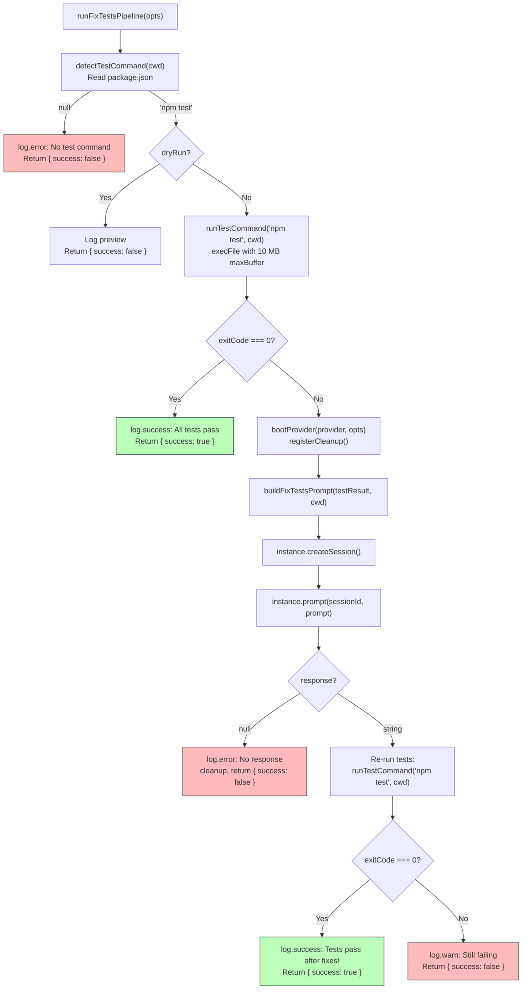

# Fix-Tests Pipeline

The fix-tests pipeline (`src/orchestrator/fix-tests-pipeline.ts`) detects a
project's test command, runs the test suite, and — when tests fail — dispatches
an AI coding agent to read the failures and fix the source or test code. It
then re-runs the test suite to verify the fix.

## What it does

The pipeline implements an automated test-repair workflow:

1. **Detect** the test command from `package.json`.
2. **Run** the test suite and capture output.
3. If tests already pass, return success immediately.
4. **Boot** an AI provider and build a prompt from failure output.
5. **Dispatch** the prompt to the AI agent, which reads failing tests and
   source code and makes minimal fixes.
6. **Verify** by re-running the test suite.
7. Report whether the fix succeeded.

```bash
# Fix failing tests using default provider
dispatch --fix-tests

# Fix tests with a specific provider
dispatch --fix-tests --provider copilot

# Preview what would happen without running
dispatch --fix-tests --dry-run

# With verbose logging
dispatch --fix-tests --verbose
```

## Why it exists

When an AI agent introduces code changes that break existing tests, or when
tests fail due to drift, manually reading failure output and fixing the code
is repetitive. The fix-tests pipeline automates this feedback loop: it runs
the tests, reads the output, asks an AI agent to diagnose and fix the
failures, then verifies the fix — all in a single command.

## Key source files

| File | Role |
|------|------|
| `src/orchestrator/fix-tests-pipeline.ts` | Pipeline orchestrator: detection, execution, AI dispatch, verification |
| `src/test-runner.ts` | Standalone test runner utility with timeout support |
| `src/tests/fix-tests-pipeline.test.ts` | Unit tests for the pipeline |
| `src/tests/test-runner.test.ts` | Unit tests for the test runner |

## Pipeline flow



## Test command detection

Both `fix-tests-pipeline.ts` and `test-runner.ts` implement their own
`detectTestCommand` function. They share the same core logic (read
`package.json`, check for `scripts.test`) but differ in error handling:

| Aspect | `fix-tests-pipeline.ts` | `test-runner.ts` |
|--------|------------------------|------------------|
| Return type | `string \| null` | `string` (throws on failure) |
| Missing `package.json` | Returns `null` silently | Throws `"No package.json found"` |
| Missing `scripts.test` | Returns `null` silently | Throws `"No test script defined"` |
| Malformed JSON | Returns `null`, logs debug | Throws (JSON.parse error) |
| npm default placeholder | Returns `null` (explicit check) | Not checked |
| Output | Always `"npm test"` | Always `"npm test"` |

**Why `"npm test"` regardless of the actual script?** Both implementations
detect whether a `scripts.test` field exists in `package.json` but always
return the literal string `"npm test"` rather than the script content. This
works because `npm test` is a shorthand that delegates to whatever
`scripts.test` specifies. The limitation is that this approach only supports
npm — projects using `yarn test`, `pnpm test`, or direct commands (e.g.,
`vitest run`) must have an npm-compatible `package.json`.

**Why are there two implementations?** The `fix-tests-pipeline.ts` module
does NOT import from `test-runner.ts`. Despite the `test-runner.ts` module
header stating it "is used by the fix-tests pipeline," the import graph does
not confirm this. Each module has its own detection and execution logic. The
`test-runner.ts` module was designed as a standalone, testable utility with
stricter error semantics (throwing instead of returning null), while the
pipeline's inline version uses a lenient null-return pattern that fits the
pipeline's early-return flow.

## Test execution

The two modules also use different child process strategies for running tests:

| Aspect | `fix-tests-pipeline.ts` | `test-runner.ts` |
|--------|------------------------|------------------|
| API | `execFile` (callback) | `spawn` (streaming) |
| Timeout | **None** — `testTimeout` option is declared but never passed | Configurable via `timeoutMs` (default 300s / 5 min) |
| Max buffer | 10 MB (`maxBuffer: 10 * 1024 * 1024`) | No limit (streaming) |
| On timeout | N/A | Calls `child.kill()` (SIGTERM), throws `TimeoutError` |
| On non-zero exit | Resolves with exit code (never rejects) | Resolves with exit code (never rejects) |
| On spawn error | Caught by the callback error parameter | Rejects with descriptive error preserving `cause` chain |

### The `maxBuffer` limit

The pipeline's `runTestCommand` sets `maxBuffer: 10 * 1024 * 1024` (10 MB).
If test output (stdout + stderr combined) exceeds this limit, Node.js kills
the child process and the callback receives a buffer-overflow error
(`ERR_CHILD_PROCESS_STDIO_MAXBUFFER`). This error is caught by the pipeline's
top-level catch block and returned as `{ success: false }`.

For most test suites, 10 MB is sufficient. If your project produces extremely
verbose test output, consider configuring your test framework to reduce
output verbosity.

### The timeout gap

The `FixTestsPipelineOptions` interface declares a `testTimeout` field
(`src/orchestrator/fix-tests-pipeline.ts:27`), and the pipeline computes
`testTimeoutMs` from it at line 136. However, **this timeout value is never
passed to `runTestCommand`**. The `runTestCommand` function uses `execFile`
with no `timeout` option, meaning the test process can run indefinitely.

In contrast, `test-runner.ts` properly implements timeout support using
[`withTimeout()`](../shared-utilities/timeout.md) from the timeout utility,
with a default of 300 seconds (5 minutes). On timeout, it sends `SIGTERM` to
the child process via `child.kill()`.

If the test command hangs in the pipeline, the only recourse is to kill the
dispatch process (Ctrl+C / SIGINT). The
[cleanup registry](../shared-types/cleanup.md) will then drain and terminate
the AI provider.

## AI prompt construction

The `buildFixTestsPrompt()` function constructs a focused prompt from the
test failure output. The AI provider receives this prompt through the
[provider session model](../provider-system/overview.md#session-isolation-model):

```markdown
You are fixing failing tests in a project.

**Working directory:** /path/to/project
**Test command:** npm test
**Exit code:** 1

## Test Output

```
<combined stdout + stderr>
```

## Instructions

- Read the failing test files and the source code they test.
- Understand why the tests are failing.
- Make minimal fixes — fix the tests or fix the source code, whichever is appropriate.
- Do NOT commit changes — the developer controls commits.
- Do NOT modify tests to simply skip or ignore failures.
- When finished, confirm by saying "Tests fixed."
```

The prompt includes both stdout and stderr, filtered for empty strings.
The AI agent receives the full working directory path and is instructed to
read both the failing test files and the source code under test.

### How the AI provider fixes tests

The prompt instructs the agent to "Read the failing test files and the source
code they test." This implies the AI provider has **filesystem access** — it
can read files, navigate the project structure, and make edits. The pipeline
itself does not configure or verify these capabilities; it relies on the
[provider's session](../provider-system/overview.md#session-isolation-model)
granting the agent appropriate tool access (file read, file write, shell
commands).

The pipeline does **not** instruct the agent to commit changes. Unlike the
[dispatch pipeline](../planning-and-dispatch/dispatcher.md#commit-instruction-detection)
which conditionally includes commit instructions, the fix-tests pipeline
explicitly says "Do NOT commit changes."

## Provider lifecycle

The pipeline boots the AI provider only when tests fail (not on the happy
path where tests already pass). The provider lifecycle follows the standard
pattern:

1. **Boot**: `bootProvider(provider, { url, cwd })` at line 176.
2. **Register cleanup**: `registerCleanup(() => instance.cleanup())` at
   line 177, ensuring the provider is terminated even on abnormal exit.
3. **Create session**: `instance.createSession()` — one session per
   fix-tests run.
4. **Prompt**: `instance.prompt(sessionId, prompt)` — sends the failure
   output and instructions.
5. **Cleanup**: `instance.cleanup()` — called explicitly after verification
   (line 199) or on null response (line 189).

### What happens if the provider fails to boot or times out?

If `bootProvider()` throws (e.g., the provider binary is not installed, the
server URL is wrong, or credentials are missing), the error is caught by the
pipeline's catch block at line 211. The pipeline returns
`{ success: false, error: message }`. There is no retry logic — a boot
failure typically indicates misconfiguration.

If `instance.prompt()` hangs indefinitely (see
[provider timeout limitations](../provider-system/overview.md#prompt-timeouts-and-cancellation)),
the pipeline will also hang. There is no prompt-level timeout in the
fix-tests pipeline. The [cleanup registry](../shared-types/cleanup.md) ensures
provider resources are released on signal exit.

## Logging and observability

### Console logging

The pipeline uses the shared [logger](../shared-types/logger.md) (`log`)
for all console output:

| Event | Log level | Message |
|-------|-----------|---------|
| Test command detected | `info` | `Detected test command: npm test` |
| Dry-run mode | `info` | `Dry run — would execute: npm test` |
| Tests already pass | `success` | `All tests pass — nothing to fix.` |
| Tests failed | `warn` | `Tests failed (exit code N). Dispatching AI to fix...` |
| AI completed | `success` | `AI agent completed fixes.` |
| AI returned null | `error` | `No response from AI agent.` |
| Verification passed | `success` | `All tests pass after fixes!` |
| Verification failed | `warn` | `Tests still failing after fix attempt (exit code N).` |
| Pipeline error | `error` | `Fix-tests pipeline failed: <error chain>` |

### File logging

When `--verbose` is enabled, a
[`FileLogger`](../shared-types/file-logger.md) is created at
`.dispatch/logs/issue-fix-tests.log` relative to the project working
directory. The file logger captures:

- Test run exit codes
- The full AI prompt text
- The AI agent's response
- Verification results
- Error stack traces

The file logger uses
[`AsyncLocalStorage`](https://nodejs.org/api/async_context.html#class-asynclocalstorage)
to scope log entries to the pipeline execution context. The log file is
**truncated on each run** (not appended), so only the most recent
fix-tests invocation is preserved.

### How to monitor the AI agent's actions

While the AI agent is working, there is no streaming progress output from
the fix-tests pipeline (unlike the
[dispatch pipeline's TUI](tui.md)). The only
visibility into the agent's progress comes from:

1. **Verbose mode** (`--verbose`): File logger captures the prompt and
   response after completion.
2. **Provider-level logging**: Some providers (OpenCode, Copilot) have
   their own logging mechanisms. Check the provider's documentation.
3. **File system observation**: Watch the project directory for file
   changes while the agent is working.

## Process cleanup

The pipeline registers the provider's cleanup function with the
[cleanup registry](../shared-types/cleanup.md) immediately after boot.
This ensures provider resources are released in three scenarios:

1. **Normal completion**: `instance.cleanup()` is called explicitly after
   verification (line 199) or on null response (line 189).
2. **Pipeline error**: The catch block at line 211 does not call cleanup
   explicitly, but the registered cleanup function will be drained by the
   CLI's signal/error handlers.
3. **Process signal** (SIGINT/SIGTERM): The CLI's signal handlers call
   `runCleanup()` which invokes the registered function.

**Gap**: If the pipeline crashes *before* `registerCleanup()` at line 177
(e.g., during `bootProvider()`), no cleanup is registered. However, if boot
fails, there is nothing to clean up — the provider process was never started.

## Dry-run mode

When `--dry-run` is passed, the pipeline:

1. Detects the test command (reads `package.json`).
2. Logs what it would execute: the test command and working directory.
3. Returns `{ success: false }` immediately.

No tests are run, no provider is booted, and no AI resources are consumed.
This is useful for verifying that the test command detection works correctly.

## Environment variables

The test process inherits the parent process environment (no custom `env`
option is set in the `execFile` call). This means:

- `NODE_ENV`, `CI`, and other environment variables are passed through.
- `PATH` is inherited, so `npm` must be on the system PATH.
- Test framework configuration via environment variables (e.g.,
  `VITEST_THREADS=false`) is respected.

## Interfaces

### FixTestsPipelineOptions

Passed from the [orchestrator runner](orchestrator.md#fix-tests-pipeline-delegation)
to `runFixTestsPipeline()`:

| Field | Type | Description |
|-------|------|-------------|
| `cwd` | `string` | Project working directory |
| `provider` | `string` | AI provider name (e.g., `"opencode"`, `"copilot"`) |
| `serverUrl` | `string?` | URL of a running provider server |
| `verbose` | `boolean` | Enable file logging to `.dispatch/logs/` |
| `dryRun` | `boolean?` | Preview mode — detect but don't execute |
| `testTimeout` | `number?` | Test timeout in minutes (declared but not used — see [timeout gap](#the-timeout-gap)) |

### TestRunResult

Returned by `runTestCommand()`:

| Field | Type | Description |
|-------|------|-------------|
| `exitCode` | `number \| null` | Process exit code (0 = pass, non-zero = fail) |
| `stdout` | `string` | Captured stdout |
| `stderr` | `string` | Captured stderr |
| `command` | `string` | The command that was executed |

### FixTestsSummary

Returned to the CLI (defined in `src/orchestrator/runner.ts:86-90`):

| Field | Type | Description |
|-------|------|-------------|
| `mode` | `"fix-tests"` | Literal discriminator for the `RunResult` union |
| `success` | `boolean` | Whether the fix attempt succeeded |
| `error` | `string?` | Error description if unsuccessful |

## The test-runner module

The standalone test runner (`src/test-runner.ts`) is a parallel implementation
designed for independent testability without AI provider involvement. It
provides:

- **`detectTestCommand(cwd)`**: Reads `package.json` and returns `"npm test"`
  or throws. Unlike the pipeline's version, this throws on all error
  conditions rather than returning null.
- **`runTests(cwd, timeoutMs?)`**: Spawns `npm test` via `child_process.spawn`,
  streams output into buffers, applies a timeout via
  [`withTimeout()`](../shared-utilities/timeout.md), and returns a structured
  `TestRunResult`.

### Timeout behavior

The `runTests` function wraps the spawn promise in `withTimeout()` with a
configurable deadline (default 300,000 ms = 5 minutes). When the timeout
fires:

1. A `TimeoutError` is thrown with a descriptive message including
   `"test runner"`.
2. `child.kill()` is called, sending `SIGTERM` to the child process.
3. The error propagates to the caller.

`SIGTERM` is the default signal for `child.kill()`. If the test process
does not respond to `SIGTERM`, it may leave an orphan process. There is no
escalation to `SIGKILL`.

### Spawn error handling

When `npm` is not found on PATH or the spawn fails for another reason,
the `error` event fires on the child process. The test runner wraps it in
a descriptive `Error` with the original error preserved as `.cause`:

```
Error: Test runner spawn error: spawn ENOENT
  [cause]: Error: spawn ENOENT { code: 'ENOENT', syscall: 'spawn npm' }
```

This error chain is useful for diagnosing PATH issues or missing npm
installations.

## Integrations

### Node.js `child_process`

**`execFile`** (fix-tests-pipeline.ts): Used via the callback API with
`maxBuffer: 10 MB`. The command string is split on spaces to produce
`[cmd, ...args]` — this means test commands with spaces in arguments
would be incorrectly split.

**`spawn`** (test-runner.ts): Used with `shell: false` for direct process
execution. Stdout and stderr are streamed via event listeners.

Official docs: [Node.js child_process](https://nodejs.org/api/child_process.html)

### Timeout utility

**Used by**: `test-runner.ts:14` imports `withTimeout` and `TimeoutError`
from `src/helpers/timeout.ts`.

**Not used by**: `fix-tests-pipeline.ts` — despite declaring a
`testTimeout` option, the pipeline does not apply any timeout to test
execution.

See [Timeout utility](../shared-utilities/timeout.md) for implementation
details.

### AI Provider System

**Used by**: `fix-tests-pipeline.ts:12` imports `bootProvider` from
`src/providers/index.ts`.

The pipeline boots a provider, creates a single session, sends one prompt,
and cleans up. There is no retry logic for the AI prompt — if the agent
fails, the pipeline reports failure. See also the
[Agent Framework](../agent-system/overview.md) for how agents consume the
provider interface.

See [Provider overview](../provider-system/overview.md) for
provider lifecycle and session model.

### FileLogger / AsyncLocalStorage

**Used by**: `fix-tests-pipeline.ts:15-16` imports `FileLogger` and
`fileLoggerStorage` from `src/helpers/file-logger.ts`.

Log files are written to `.dispatch/logs/issue-fix-tests.log`. The file is
truncated on each run (the `FileLogger` constructor truncates the file —
see `src/helpers/file-logger.ts:32`). Logs are only written when
`--verbose` is enabled.

See [Logger](../shared-types/logger.md) for the dual-channel logging
architecture.

### Process cleanup registry

**Used by**: `fix-tests-pipeline.ts:13` imports `registerCleanup` from
`src/helpers/cleanup.ts`.

The provider's cleanup function is registered immediately after boot. On
signal exit (SIGINT, SIGTERM), the CLI drains the registry to terminate
provider processes.

See [Cleanup registry](../shared-types/cleanup.md) for the full lifecycle.

## Error handling

The pipeline uses a **catch-all** pattern. The entire pipeline body is
wrapped in a `try/catch` that converts any error into a structured
`{ success: false, error: message }` result:

| Error scenario | Behavior |
|---------------|----------|
| No `package.json` | Returns `{ success: false, error: "No test command found" }` |
| Test command hangs | Pipeline hangs indefinitely (no timeout) |
| Test output exceeds 10 MB | `execFile` kills the process; caught by pipeline catch block |
| Provider boot fails | Caught; returns `{ success: false, error: message }` |
| AI returns null | Explicit check; calls cleanup; returns `{ success: false }` |
| AI prompt throws | Caught; returns `{ success: false, error: message }` |
| Tests still fail after fix | Returns `{ success: false, error: "Tests still failing..." }` |

Errors are logged via both the console logger (`log.error`) and the file
logger (when verbose mode is active). The `log.formatErrorChain()` method
traverses nested `.cause` properties for diagnostic detail.

## Related documentation

- [Orchestrator — Fix-tests delegation](orchestrator.md#fix-tests-pipeline-delegation) —
  How the runner routes `--fix-tests` to this pipeline
- [CLI argument parser](cli.md) — `--fix-tests`, `--test-timeout`, and
  `--dry-run` flag documentation
- [Configuration](configuration.md) — `testTimeout` config key and
  three-tier merge
- [Provider overview](../provider-system/overview.md) —
  `bootProvider()` lifecycle, session model, and cleanup
- [Cleanup registry](../shared-types/cleanup.md) — Process-level cleanup
  for provider shutdown
- [Logger](../shared-types/logger.md) — Console and file logging
  architecture
- [Timeout utility](../shared-utilities/timeout.md) — `withTimeout()`
  used by `test-runner.ts`
- [Architecture overview](../architecture.md) — System topology and
  pipeline modes
- [Fix-tests tests](../testing/fix-tests-tests.md) — Unit test coverage
  for the pipeline and test runner
