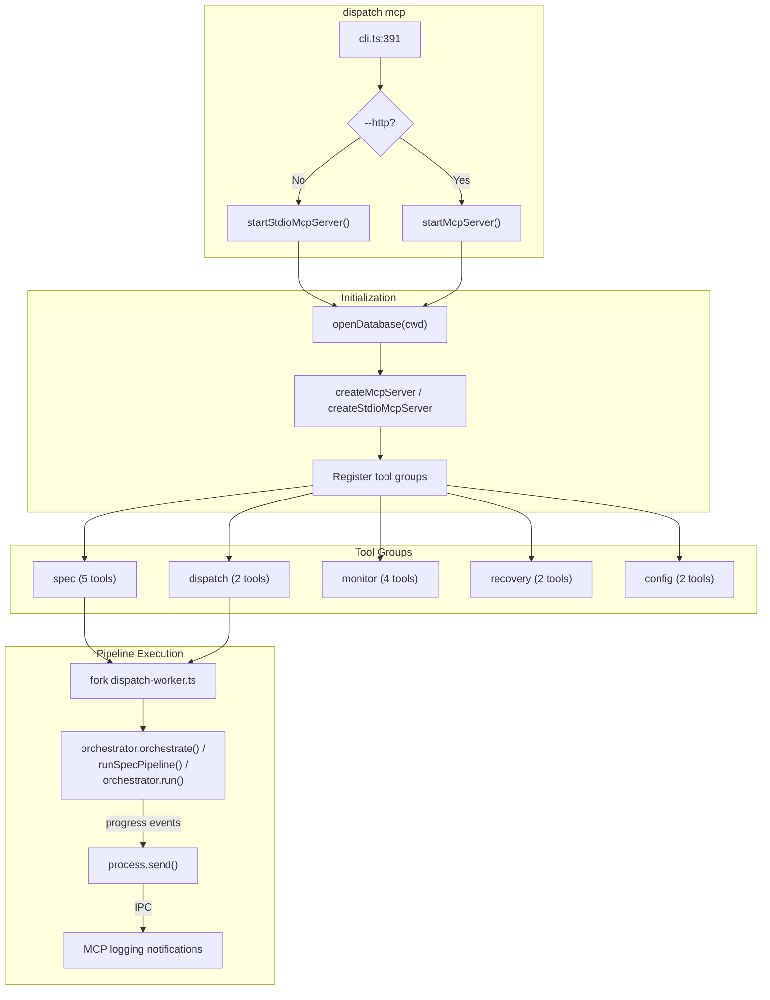

# MCP Subcommand

The `dispatch mcp` subcommand starts a
[Model Context Protocol](https://modelcontextprotocol.io/introduction) (MCP)
server that exposes Dispatch's capabilities as MCP tools. This allows AI
agents, editors, and other MCP-aware clients to programmatically interact
with Dispatch — running specs, dispatching tasks, monitoring progress, and
managing configuration — without using the CLI directly.

## What it does

The MCP server:

1. Opens a SQLite database for run state tracking.
2. Registers tools across five groups (spec, dispatch, monitor, recovery,
   config).
3. Listens for MCP requests via stdio or HTTP transport.
4. Forks child worker processes to execute pipelines, forwarding progress
   events as MCP logging notifications.

## Why it exists

The MCP subcommand enables integration with AI-powered editors and agents
that speak the MCP protocol. Instead of shelling out to `dispatch` and
parsing text output, MCP clients can invoke typed tools with structured
input/output. This is particularly useful for:

- **Editor integrations**: AI coding assistants that want to run specs or
  dispatch tasks as part of a larger workflow.
- **Agent orchestration**: Higher-level agents that coordinate Dispatch
  alongside other tools.
- **Programmatic access**: Scripts and automation that need structured
  responses instead of CLI text output.

## Key source files

| File | Role |
|------|------|
| `src/cli.ts:391-426` | MCP subcommand routing and option parsing |
| `src/mcp/index.ts` | Server startup, database initialization, signal handlers |
| `src/mcp/server.ts` | MCP server creation, transport wiring, tool registration |
| `src/mcp/dispatch-worker.ts` | Child process entry point for pipeline execution |
| `src/mcp/tools/*.ts` | Individual tool group implementations |

## Usage

```bash
# stdio transport (default) — for MCP client integration
dispatch mcp

# HTTP transport on default port (9110)
dispatch mcp --http

# HTTP transport on custom port
dispatch mcp --http --port 8080

# HTTP transport bound to all interfaces (use with caution)
dispatch mcp --http --host 0.0.0.0 --port 9110

# Working directory override
dispatch mcp --cwd /path/to/project
```

## Options

| Option | Type | Default | Description |
|--------|------|---------|-------------|
| `--http` | boolean | `false` | Use HTTP transport instead of stdio |
| `--port <number>` | integer | `9110` | TCP port (HTTP mode only) |
| `--host <host>` | string | `127.0.0.1` | Bind address (HTTP mode only) |
| `--cwd <dir>` | string | `process.cwd()` | Working directory |

## Transport modes

### stdio transport (default)

In stdio mode, the MCP server reads JSON-RPC messages from stdin and writes
responses to stdout. Diagnostic output goes to stderr to avoid corrupting
the MCP protocol stream.

This is the standard MCP transport for local integrations where the MCP
client spawns `dispatch mcp` as a child process. It supports a single client
at a time.

### HTTP transport (`--http`)

In HTTP mode, the server listens on a TCP port and handles MCP requests via
HTTP. The endpoint is at `/mcp`, with a health check at `/health`.

Key implementation details (`src/mcp/server.ts:77-228`):

- **Session management**: Each client gets a unique session ID (UUID). The
  server maintains a `Map<string, StreamableHTTPServerTransport>` to route
  requests to the correct session.
- **POST `/mcp`**: Handles tool invocations. A missing `mcp-session-id`
  header creates a new session; an existing session ID routes to the
  corresponding transport.
- **GET `/mcp`**: Opens an SSE (Server-Sent Events) stream for
  server-to-client notifications (progress updates, logging).
- **DELETE `/mcp`**: Closes an existing session.
- **GET `/health`**: Returns `{"status": "ok"}` for health checks.

The default binding is `127.0.0.1:9110`, which restricts access to
localhost. Setting `--host 0.0.0.0` allows remote connections — use
appropriate network security when doing so.

## Architecture



## Registered tools

The MCP server registers tools across five groups:

### Spec tools (`src/mcp/tools/spec.ts`)

| Tool | Description |
|------|-------------|
| `spec_generate` | Generate spec files from issue IDs, glob patterns, or inline text. Returns a `runId` immediately; progress is pushed via MCP logging notifications. |
| `spec_list` | List spec files in the `.dispatch/specs` directory. |
| `spec_read` | Read the contents of a spec file by filename or path. |
| `spec_runs_list` | List recent spec generation runs with their status. |
| `spec_run_status` | Get the status of a specific spec run, with optional long-poll via `waitMs`. |

### Dispatch tools (`src/mcp/tools/dispatch.ts`)

| Tool | Description |
|------|-------------|
| `dispatch_run` | Execute the dispatch pipeline for one or more issue IDs. Returns a `runId` immediately; progress is pushed via logging notifications. |
| `dispatch_dry_run` | Preview tasks that would be dispatched without executing anything. |

### Monitor tools (`src/mcp/tools/monitor.ts`)

| Tool | Description |
|------|-------------|
| `status_get` | Get the current status of a dispatch or spec run, with optional long-poll. |
| `runs_list` | List recent runs, optionally filtered by status. |
| `issues_list` | List open issues from the configured datasource. |
| `issues_fetch` | Fetch full details for one or more issues. |

### Recovery tools (`src/mcp/tools/recovery.ts`)

| Tool | Description |
|------|-------------|
| `run_retry` | Re-run all failed tasks from a previous dispatch run. |
| `task_retry` | Retry a specific failed task by `taskId`. |

### Config tools (`src/mcp/tools/config.ts`)

| Tool | Description |
|------|-------------|
| `config_get` | Get the current Dispatch configuration. |
| `config_set` | Set a configuration value. |


Long-running pipelines (spec generation, dispatch) are executed
in a forked child process (`src/mcp/dispatch-worker.ts`) to avoid blocking
the MCP server's event loop.

The worker:

1. Receives a message via Node.js IPC with the pipeline type (`"dispatch"`,
   or `"spec"`) and configuration.
2. Boots the orchestrator and runs the appropriate pipeline.
3. Sends progress events back to the parent via `process.send()`.
4. Sends a `"done"` or `"error"` message on completion.
5. Exits with code `0`.

The parent process (MCP server) converts these IPC messages into MCP logging
notifications via `wireRunLogs()` (`src/mcp/server.ts:239-249`).

## State management

The MCP server uses a SQLite database (opened via `openDatabase(cwd)` at
startup) to persist run state across requests. This allows:

- Querying the status of past runs via `status_get` and `runs_list`.
- Retrying failed tasks from previous runs.
- Tracking progress across multiple concurrent runs.

The database is stored in the `.dispatch/` directory within the working
directory.

## Shutdown behavior

Both transport modes install `SIGINT` and `SIGTERM` handlers
(`src/mcp/index.ts:28-46, 66-84`) that:

1. Close all active MCP transports.
2. Close the SQLite database.
3. Exit with code `0`.

The MCP server's signal handlers are independent of the main CLI's handlers
(which are installed by `main()` only for dispatch/spec modes).

In stdio mode, diagnostic messages during shutdown are written to stderr
to avoid corrupting the protocol stream on stdout.

## Security considerations

- **HTTP mode binds to localhost by default** (`127.0.0.1`). Remote access
  requires explicitly setting `--host 0.0.0.0`.
- **No authentication** is implemented on the HTTP endpoint. Any process on
  the same host can connect. For remote access, use a reverse proxy with
  authentication or an SSH tunnel.
- **Session IDs** are random UUIDs, providing basic protection against
  session hijacking on localhost.

## Related documentation

- [CLI](cli.md) -- `dispatch mcp` subcommand routing
- [Configuration](configuration.md) -- `config_get` and `config_set` tools
  read/write the same config file
- [Orchestrator](orchestrator.md) -- pipelines invoked by the worker process
- [Spec Generation](../spec-generation/overview.md) -- spec pipeline used by
  `spec_generate`
- [Planning & Dispatch](../planning-and-dispatch/overview.md) -- dispatch
  pipeline used by `dispatch_run`
- [Authentication](authentication.md) -- auth flows that may be triggered
  during pipeline execution
