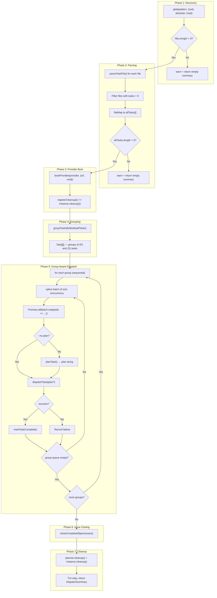

# Orchestrator Pipeline

The orchestrator (`src/agents/orchestrator.ts`) implements the core multi-phase
pipeline that drives the entire dispatch tool. It coordinates file discovery,
task parsing, AI provider lifecycle, optional planning, execution, markdown
mutation, and automatic issue closing on external trackers.

## What it does

The `orchestrate()` function accepts an `OrchestrateRunOptions` object from the
[CLI](cli.md) and executes a seven-stage pipeline:

1. **Discover** task files via [glob pattern matching](integrations.md#glob-npm-package), sorted by leading filename digits
2. **Parse** unchecked tasks from discovered markdown files using [`parseTaskFile()`](../task-parsing/api-reference.md#parsetaskfile)
3. **Boot** the selected [AI provider](../provider-system/provider-overview.md) (OpenCode or Copilot)
4. **Group** tasks by execution mode using [`groupTasksByMode()`](../task-parsing/api-reference.md#grouptasksbymode)
5. **Dispatch** tasks in [group-aware concurrent batches](#concurrency-model) (plan + execute per task)
6. **Mutate** source markdown to [mark tasks complete](../task-parsing/api-reference.md#marktaskcomplete)
7. **Close issues** on the originating tracker when all tasks in a spec file succeed

It returns a [`DispatchSummary`](#dispatchsummary) with counts of completed, failed, and skipped
tasks plus per-task results.

## Why it exists

The orchestrator is the "glue" that turns independent modules ([parser](../task-parsing/overview.md), [planner](../planning-and-dispatch/planner.md),
[dispatcher](../planning-and-dispatch/dispatcher.md), [git](../planning-and-dispatch/git.md), [provider](../provider-system/provider-overview.md)) into a coherent pipeline. Without it, each module
would need to know about the others. The orchestrator enforces execution order,
manages the provider lifecycle, and translates between module interfaces.

## Pipeline phases



## Concurrency model

The orchestrator uses a **group-aware batch-sequential** concurrency model
(`src/agents/orchestrator.ts:165-220`). Tasks are first partitioned into
execution groups by their `(P)` / `(S)` mode prefix, then each group is
dispatched using a batch-sequential loop.

### How grouping works

Before dispatch begins, `groupTasksByMode(allTasks)` (from
[`parser.ts`](../task-parsing/api-reference.md#grouptasksbymode)) splits the
flat task list into contiguous groups of same-mode tasks:

- **`(P)` (parallel)** tasks are grouped together.
- **`(S)` (serial)** tasks each become a group of size 1.
- Tasks with no prefix default to parallel mode.

For example, given tasks `[A(P), B(P), C(S), D(S), E(P)]`, grouping produces:

| Group | Tasks | Effective concurrency |
|-------|-------|----------------------|
| 1 | `[A, B]` | Up to `--concurrency` |
| 2 | `[C]` | 1 (serial group) |
| 3 | `[D]` | 1 (serial group) |
| 4 | `[E]` | Up to `--concurrency` |

Groups are processed **sequentially** — the orchestrator finishes all tasks in
group N before starting group N+1.

### How batching works within a group

Within each group, the orchestrator uses the same batch-sequential loop as
before:

```
for each group in groups:
    groupQueue = [...group]
    while groupQueue is not empty:
        batch = groupQueue.splice(0, concurrency)
        await Promise.all(batch.map(task => ...))
```

1. Tasks in the group are placed in a queue.
2. The loop splices off `concurrency` tasks at a time.
3. `Promise.all()` runs the current batch concurrently.
4. The loop **waits for the entire batch to complete** before starting the
   next batch within the same group.
5. When the group queue is empty, the next group begins.

### Serial group behavior

A serial `(S)` group always contains exactly one task. Combined with the
batch-sequential loop, this means the task runs alone — no other task from any
group can overlap with it. This is useful for tasks that must not run
concurrently with anything else (e.g., database migrations, config changes).

### Performance implications

| Concurrency | Behavior |
|-------------|----------|
| `1` (default) | Fully sequential. Each task completes before the next starts. Grouping has no practical effect. |
| `N > 1` | Parallel groups dispatch up to N tasks at once. Serial groups always dispatch exactly 1. If one task in a parallel batch takes 10 minutes and others take 1 minute, the fast tasks wait for the slow one before the next batch starts. |
| Large N | All tasks in a parallel group run in a single batch. Provider SDK connections, API rate limits, and system resources become the bottleneck. |

This is **not** a work-stealing or backpressure-aware pool. A more
sophisticated approach would use a semaphore-based pool (e.g.,
`p-limit`) to keep `concurrency` tasks running at all times. The current
approach is simpler but can leave capacity idle between batches.

### Promise.all and failure semantics

`Promise.all()` rejects as soon as **any** promise rejects. However, the
individual task handlers catch their own errors internally:

- **Planning failure** (`src/agents/orchestrator.ts:187-193`): If `planTask()` throws
  or returns `success: false`, the task is marked `"failed"` in the TUI and
  the handler returns a failed `DispatchResult`. It does **not** throw, so
  `Promise.all` does **not** reject. Other tasks in the batch continue
  independently.
- **Dispatch failure** (`src/agents/orchestrator.ts:207-212`): If `dispatchTask()`
  returns `success: false`, the task is marked failed similarly. No throw.
- **Unexpected exception**: If an exception escapes the handler (e.g., from
  `markTaskComplete()`), it **would** cause `Promise.all` to reject, which
  would propagate to the outer `try/catch` and stop the entire pipeline. This
  is a gap — post-dispatch failures are not individually caught.

**Key insight**: A planning failure in one task does **not** block other tasks
in the same batch. Tasks are independent within a batch. A failure in one group
does **not** prevent subsequent groups from running (unless an uncaught
exception reaches `Promise.all`).

## The fileContentMap

The orchestrator builds a `Map<string, string>` from file paths to raw file
content at `src/orchestrator.ts:80-83`:

```typescript
const fileContentMap = new Map<string, string>();
for (const tf of taskFiles) {
  fileContentMap.set(tf.path, tf.content);
}
```

This exists because the [planner](../planning-and-dispatch/planner.md) needs the raw file content to call
[`buildTaskContext()`](../task-parsing/api-reference.md#buildtaskcontext), which filters out sibling unchecked tasks. The `TaskFile`
objects already contain this content in `tf.content`, but the lookup is
structured by file path because a single file may contain multiple tasks, and
the planner accesses context per-task rather than per-file.

The map avoids repeatedly reading `TaskFile` objects to find the one matching a
task's `file` property. It trades a small amount of memory for O(1) path-based
lookup instead of O(n) array scanning.

## File discovery and ordering

After glob resolves matching files, the orchestrator sorts them by the leading
digits in the filename (`src/agents/orchestrator.ts:107-112`):

```
files.sort((a, b) => {
    numA = parseInt(basename(a).match(/^(\d+)/)?.[1] ?? "0", 10)
    numB = parseInt(basename(b).match(/^(\d+)/)?.[1] ?? "0", 10)
    if (numA !== numB) return numA - numB
    return a.localeCompare(b)
})
```

This is a **numeric** sort, not a lexicographic one. The regex `^(\d+)` extracts
the leading integer from the filename (e.g., `6` from `6-auth.md`, `11` from
`11-deploy.md`). Files without a leading number are treated as `0`.

| Filename | Extracted number | Sort position |
|----------|-----------------|---------------|
| `1-setup.md` | 1 | first |
| `6-auth.md` | 6 | second |
| `11-deploy.md` | 11 | third |
| `notes.md` | 0 (no match) | before all numbered files |

When two files have the same leading number (or both lack one), they fall back
to lexicographic comparison (`a.localeCompare(b)`).

### Why this matters

Task files generated by `--spec` mode use the naming pattern `<id>-<slug>.md`
where `<id>` is the issue number. Numeric sorting ensures issue #6 is processed
before issue #11, even though `"6" > "11"` lexicographically. This gives the
user predictable, ascending-order execution that matches the issue numbering.

### Filename convention for issue IDs

Spec files follow the pattern `<id>-<slug>.md`:

- `<id>` is the issue or work item number (digits only)
- `<slug>` is the lowercased, sanitized issue title truncated to 60 characters
- The separator is a single hyphen

Examples: `42-add-user-auth.md`, `7-fix-login-redirect.md`

This convention is relied upon by both the numeric sort and the
[issue auto-close feature](#automatic-issue-closing) to extract the issue ID.

## Automatic issue closing

After all groups have been dispatched, the orchestrator calls
`closeCompletedSpecIssues()` (`src/agents/orchestrator.ts:223, 251-290`). This
function automatically closes issues on the originating tracker when every task
in a spec file has succeeded.

### How it works

1. **Detect issue source**: `detectIssueSource(cwd)` inspects the `origin` git
   remote URL (via `git remote get-url origin`) and matches it against known
   platforms (GitHub, Azure DevOps). If no supported platform is detected, the
   function returns silently — no error is thrown.

2. **Get fetcher**: `getIssueFetcher(source)` returns the platform-specific
   fetcher. If the fetcher does not implement a `close` method, the function
   returns silently.

3. **Build success set**: A `Set` of all tasks that completed successfully is
   built from the `DispatchResult[]` array.

4. **Per-file check**: For each `TaskFile`, the function checks whether
   **every** task in that file is in the success set. If any task failed or
   was not dispatched, the file is skipped.

5. **Extract issue ID**: The filename is matched against `/^(\d+)-/` to extract
   the leading issue number. Files that don't match this pattern are skipped.

6. **Close issue**: `fetcher.close(issueId, { cwd })` is called. Success is
   logged; errors are caught and logged as warnings without aborting.

### Conditions for auto-close

All of the following must be true for an issue to be closed:

- The repository's `origin` remote matches a supported platform
- The fetcher for that platform implements `close`
- The spec filename starts with `<digits>-`
- **Every** task in the file completed successfully

### Error handling

Individual close failures are caught and logged as warnings. A failure to close
one issue does not prevent other issues from being closed, and does not affect
the `DispatchSummary` returned to the CLI.

## Error recovery and provider cleanup

### Process-level cleanup via `registerCleanup`

Immediately after booting the provider (`src/agents/orchestrator.ts:151`), the
orchestrator registers the provider's cleanup function with the process-level
cleanup registry:

```
registerCleanup(() => instance.cleanup())
```

The `registerCleanup` function (from `src/cleanup.ts`) adds the callback to a
module-level array. The CLI's signal handlers and error handler call
`runCleanup()` to drain all registered functions before the process exits. This
is the **safety net** for the cleanup gap described below — even if the
orchestrator's own `try/catch` doesn't call `instance.cleanup()`, the
process-level cleanup will.

The cleanup registry has these characteristics:

- **Array-based**: Functions are stored in a simple `Array<() => Promise<void>>`.
- **Drain-once**: `runCleanup()` splices all functions from the array, then
  invokes them sequentially. The array is left empty, so repeated calls are
  harmless.
- **Error-swallowing**: Each cleanup function is called inside a `try/catch`.
  Errors are silently ignored to prevent cleanup failures from masking the
  original error or blocking process exit.

### The cleanup gap (mitigated)

The orchestrator's `try/catch` structure (`src/agents/orchestrator.ts:95-236`)
calls `instance.cleanup()` only on the success path (line 227):

```
try {
  // ... pipeline phases ...
  await planner?.cleanup();
  await instance.cleanup();  // only on success path
  // ...
} catch (err) {
  tui.stop();                // TUI is stopped
  throw err;                 // but instance.cleanup() is NOT called here
}
```

If an error occurs anywhere in the pipeline after the provider is booted,
the catch block stops the TUI but does **not** call `instance.cleanup()`.
However, the `registerCleanup` call at line 151 ensures that when the
re-thrown error reaches the CLI's top-level error handler, `runCleanup()` is
called, which invokes `instance.cleanup()`.

**Remaining gap**: If the process is killed by a signal that the CLI does not
handle (e.g., `SIGKILL`), neither the orchestrator nor `runCleanup()` can
execute. Provider server processes may be left orphaned in this case.

**Recommendation**: While `registerCleanup` covers most failure paths, using a
`finally` block in the orchestrator would make the intent clearer and provide
defense-in-depth:

```typescript
try {
  // ... pipeline ...
} catch (err) {
  tui.stop();
  throw err;
} finally {
  if (instance) await instance.cleanup().catch(() => {});
}
```

### Markdown mutation after success

After a task succeeds, the orchestrator calls [`markTaskComplete()`](../task-parsing/api-reference.md#marktaskcomplete)
(`src/agents/orchestrator.ts:203`):

```
await markTaskComplete(task);
```

If `markTaskComplete()` throws (e.g., file deleted, line-number mismatch, disk
full), the exception escapes the per-task handler and causes `Promise.all` to
reject. This means the task's dispatch result is not recorded, and the entire
pipeline may stop (see [failure semantics](#promiseall-and-failure-semantics)).

The markdown mutation is **not rolled back** on failure. If `markTaskComplete`
partially writes and then fails, the file may be left in an inconsistent state.
On a subsequent run, the task may be skipped (if it was marked `[x]` before the
failure) or retried (if the write didn't complete).

**Mitigation**: File mutation failures are rare in practice. If one occurs, the
user can manually inspect and fix the task file. A more robust approach would
catch the error within the per-task handler and record it as a failed dispatch.

## Dry-run mode

When `--dry-run` is passed, the orchestrator takes a completely separate code
path (`dryRunMode()` at `src/agents/orchestrator.ts:292-336`):

- No TUI is created.
- No provider is booted.
- Files are discovered and parsed, then tasks are listed via the
  [logger](../shared-types/logger.md).
- All tasks are reported as `skipped` in the summary.

Dry-run mode is useful for previewing what dispatch would do without starting
AI providers or modifying any files.

## Interfaces

### OrchestrateRunOptions

Passed from the CLI to `orchestrate()` (`src/agents/orchestrator.ts:28-41`):

| Field | Type | Description |
|-------|------|-------------|
| `pattern` | `string[]` | Glob pattern(s) for task file discovery (array, not a single string) |
| `concurrency` | `number` | Max parallel dispatches per batch |
| `dryRun` | `boolean` | Preview mode — no execution |
| `noPlan` | `boolean?` | Skip the planner agent phase (optional, defaults to `false`) |
| `provider` | `ProviderName?` | AI backend name (`"opencode"` or `"copilot"`, defaults to `"opencode"`) |
| `serverUrl` | `string?` | URL of a running provider server |

### DispatchSummary

Returned from `orchestrate()` to the CLI:

| Field | Type | Description |
|-------|------|-------------|
| `total` | `number` | Total tasks discovered |
| `completed` | `number` | Tasks that succeeded |
| `failed` | `number` | Tasks that failed (planning or execution) |
| `skipped` | `number` | Tasks skipped (dry-run mode only) |
| `results` | `DispatchResult[]` | Per-task result objects |

## Related documentation

- [CLI](cli.md) -- how options are parsed and exit codes are determined
- [Terminal UI](tui.md) -- how pipeline phases drive TUI rendering
- [Logger](../shared-types/logger.md) -- output in dry-run mode
- [Integrations](integrations.md) -- glob file discovery details and cleanup
  registry
- [Task Parsing & Markdown](../task-parsing/overview.md) -- `parseTaskFile()` and
  `markTaskComplete()` behavior
- [API Reference (parser)](../task-parsing/api-reference.md) -- detailed function
  signatures including `groupTasksByMode()`
- [Planning & Dispatch Pipeline](../planning-and-dispatch/overview.md) -- `planTask()`,
  `dispatchTask()`, and `commitTask()` internals
- [Provider Abstraction & Backends](../provider-system/provider-overview.md) -- `bootProvider()`
  lifecycle
- [Architecture & Concurrency](../task-parsing/architecture-and-concurrency.md) -- concurrent
  write safety concerns for `markTaskComplete()`
- [Issue Fetching](../issue-fetching/overview.md) -- how `detectIssueSource()`
  and `getIssueFetcher()` work for auto-closing
