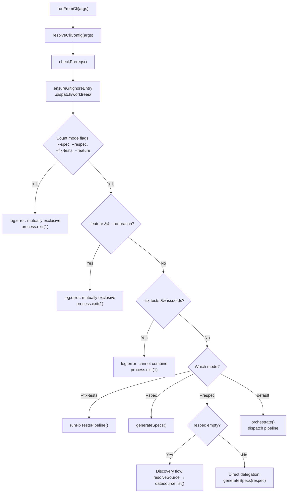
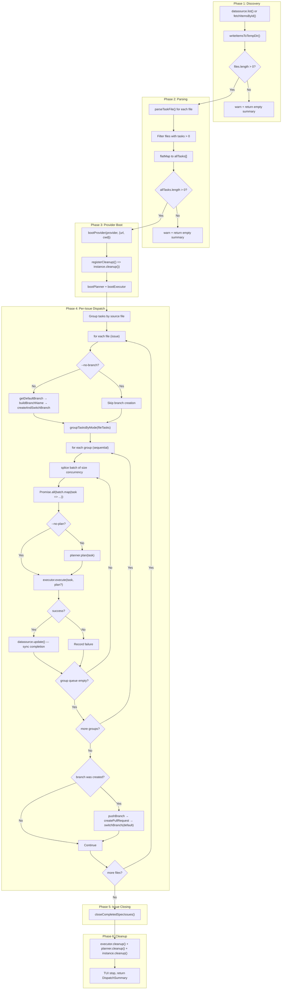

# Orchestrator Pipeline

The orchestrator (`src/orchestrator/runner.ts`) is the top-level coordination
layer for the dispatch tool. It exposes a `boot()` factory that produces an
`OrchestratorAgent` — a thin façade that routes CLI arguments into one of three
mutually exclusive pipelines: **dispatch** (issue execution), **spec** (spec
generation), and **fix-tests** (automated test repair). The runner owns no
domain logic itself; it resolves configuration, checks prerequisites, enforces
mutual exclusion of mode flags, and delegates to the appropriate pipeline module.

## What it does

The orchestrator exposes four methods via the `OrchestratorAgent` interface:

1. **`runFromCli(args)`**: Called by the CLI after `boot()`. This method first
   calls [`resolveCliConfig()`](configuration.md#three-tier-configuration-precedence)
   to merge config-file defaults with CLI flags, runs
   [prerequisite checks](../prereqs-and-safety/prereqs.md), ensures
   `.dispatch/worktrees/` is [gitignored](../git-and-worktree/gitignore-helper.md),
   enforces [mutual exclusion of mode flags](#mode-routing-and-mutual-exclusion),
   and then routes to either the spec pipeline, fix-tests pipeline, respec
   discovery flow, or the dispatch pipeline.

2. **`orchestrate()`**: The core dispatch function that accepts an
   `OrchestrateRunOptions` object and executes the dispatch pipeline
   (`src/orchestrator/dispatch-pipeline.ts`).

3. **`generateSpecs()`**: Delegates to the
   [spec pipeline](../spec-generation/overview.md) via `runSpecPipeline()`.

4. **`run()`**: A unified entry point that accepts a
   [`UnifiedRunOptions`](#unifiedrunoptions) discriminated union and routes to
   the correct pipeline based on the `mode` discriminator.

The `orchestrate()` method executes the dispatch pipeline:

    1. **Discover** work items from the configured [datasource](../datasource-system/overview.md) (GitHub, Azure DevOps, or local markdown), optionally filtered by issue IDs
    2. **Write** discovered items to temporary spec files via `writeItemsToTempDir()`
    3. **Parse** unchecked tasks from the spec files using [`parseTaskFile()`](../task-parsing/api-reference.md#parsetaskfile) (see [Markdown Syntax Reference](../task-parsing/markdown-syntax.md) for supported checkbox formats)
    4. **Boot** the selected [AI provider](../provider-system/overview.md) (OpenCode, Copilot, Claude, or Codex)
    5. **Group** tasks by source file (one file = one issue), then by execution mode using [`groupTasksByMode()`](../task-parsing/api-reference.md#grouptasksbymode)
    6. **Branch** (unless `--no-branch`): create a per-issue feature branch, dispatch tasks, push, create PR, switch back (see [branch lifecycle](cli.md#the---no-branch-flag))
    7. **Dispatch** tasks in [group-aware concurrent batches](#concurrency-model) (plan + execute per task)
    8. **Sync** task completion state back to the originating datasource via `datasource.update()`
    9. **Close issues** on the originating tracker when all tasks in a spec file succeed
    10. **Cleanup** provider and agent resources

It returns a [`DispatchSummary`](#dispatchsummary) with counts of completed, failed, and skipped
tasks plus per-task results.

### Config resolution before pipeline execution

Before `runFromCli()` delegates to the dispatch or spec pipeline, it calls
`resolveCliConfig(args)` from `src/orchestrator/cli-config.ts`. This function:

1. Loads `{CWD}/.dispatch/config.json` via `loadConfig()`.
2. Merges config defaults beneath CLI flags using the `explicitFlags` set
   (CLI flags always win).
3. Validates that the mandatory field (`provider`) is configured.
4. Enables verbose logging if `--verbose` was passed.
5. Both the dispatch and spec pipelines call `ensureAuthReady()` before
   starting pipeline work, pre-authenticating the configured tracker
   datasource (GitHub or Azure DevOps) so device-code prompts appear before
   the TUI or batch processing begins. Cached tokens make this instant.

See [Configuration — Three-tier precedence](configuration.md#three-tier-configuration-precedence)
for the full merge algorithm and precedence rules.

## The `boot()` factory

The `boot()` function (`src/orchestrator/runner.ts:123-247`) is the entry point
for the runner. It accepts `AgentBootOptions` (which provides `cwd`) and returns
an `OrchestratorAgent` object with four methods. The factory captures `cwd` at
boot time so callers do not need to pass it on every invocation.

The `boot()` function is lightweight — it performs no I/O, boots no providers,
and checks no prerequisites. All heavy initialization (provider boot, datasource
detection, agent creation) happens lazily when one of the four methods is called.

### The `run()` method and `UnifiedRunOptions`

The `run()` method provides a programmatic entry point that accepts a
[`UnifiedRunOptions`](#unifiedrunoptions) discriminated union. It routes based
on the `mode` field:

- **`mode: "spec"`**: Strips the `mode` discriminator, injects `cwd` from boot,
  and delegates to `generateSpecs()`.
- **`mode: "fix-tests"`**: Uses [dynamic `import()`](#why-fix-tests-uses-dynamic-import)
  to load the fix-tests pipeline and calls `runFixTestsPipeline()` with
  hardcoded `provider: "opencode"`.
- **`mode: "dispatch"`**: Strips the `mode` discriminator and delegates to
  `orchestrate()`.

Unlike `runFromCli()`, the `run()` method does **not** resolve configuration,
check prerequisites, enforce mutual exclusion, or ensure gitignore entries. It
assumes the caller has already performed validation.

## Mode routing and mutual exclusion

After config resolution and prerequisite checks, `runFromCli()` determines
which pipeline to invoke. The routing logic at `src/orchestrator/runner.ts:159-243`
uses a four-way mutual exclusion check across mode flags.

### Mode flag matrix

The `modeFlags` array filters four flags — `--spec`, `--respec`, `--fix-tests`,
and `--feature` — and rejects the invocation if more than one is truthy:



### Mutual exclusion rules

| Flag combination | Allowed? | Error message |
|-----------------|----------|---------------|
| `--spec` alone | Yes | — |
| `--respec` alone | Yes | — |
| `--fix-tests` alone | Yes | — |
| `--feature` alone | Yes | — |
| `--spec` + `--respec` | No | `--spec and --respec are mutually exclusive` |
| `--spec` + `--fix-tests` | No | `--spec and --fix-tests are mutually exclusive` |
| `--spec` + `--feature` | No | `--spec and --feature are mutually exclusive` |
| `--respec` + `--fix-tests` | No | `--respec and --fix-tests are mutually exclusive` |
| `--feature` + `--fix-tests` | No | `--feature and --fix-tests are mutually exclusive` |
| `--feature` + `--no-branch` | No | `--feature and --no-branch are mutually exclusive` |
| `--fix-tests` + issue IDs | No | `--fix-tests cannot be combined with issue IDs` |

All validation failures call `process.exit(1)` immediately after logging the
error. There is no retry or recovery — these are configuration errors that
require the user to fix their invocation.

### Prerequisite checks and gitignore

Before mode routing, `runFromCli()` performs two setup steps:

1. **`checkPrereqs({ datasource })`** — validates that required tools (Node.js
   version, `git`, and datasource-specific CLIs like `gh` or `az`) are available.
   If any check fails, the failures are logged and the process exits with code `1`.
   See [Prerequisites](../prereqs-and-safety/prereqs.md).

2. **`ensureGitignoreEntry(cwd, ".dispatch/worktrees/")`** — ensures the
   `.dispatch/worktrees/` directory is listed in the repository's `.gitignore`
   file. This runs unconditionally (regardless of whether worktrees are enabled)
   so the entry is present when the user later switches to worktree mode. See
   [Gitignore Helper](../git-and-worktree/gitignore-helper.md).

## The respec discovery flow

The `--respec` flag has two fundamentally different code paths depending on
whether arguments are provided:

### With arguments (direct delegation)

When `--respec` has arguments (e.g., `dispatch --respec 5,10` or
`dispatch --respec "src/**/*.md"`), the arguments are passed directly to
`generateSpecs()` as the `issues` parameter — identically to `--spec`. No
datasource discovery or listing occurs.

### Without arguments (discovery mode)

When `--respec` is passed with no arguments (bare `dispatch --respec`), the
runner discovers all existing specs via the datasource:

1. **Resolve datasource** — calls `resolveSource([], issueSource, cwd)` to
   determine which datasource to use.
2. **Get datasource instance** — calls `getDatasource(source)` to obtain the
   datasource implementation.
3. **List existing items** — calls `datasource.list()` with the current `cwd`,
   `org`, `project`, `workItemType`, `iteration`, and `area` options. If no
   items are found, the process exits with `"No existing specs found to
   regenerate"`.
4. **Format identifiers** — extracts the `number` field from each item. If all
   numbers are purely numeric (matching `/^\d+$/`), they are joined into a
   comma-separated string (e.g., `"42,99,7"`). If any number contains
   non-numeric characters (e.g., filename-based identifiers from the markdown
   datasource), the numbers are passed as an array.
5. **Confirm large batch** — calls
   [`confirmLargeBatch(count)`](../prereqs-and-safety/confirm-large-batch.md)
   if the batch exceeds 100 items. If the user declines, the process exits
   with code `0` (clean exit, not an error).
6. **Generate specs** — delegates to `generateSpecs()` with the formatted
   identifiers.

### Why identifier format matters

The numeric-vs-array distinction exists because the downstream spec pipeline
(`src/orchestrator/spec-pipeline.ts`) uses `isIssueNumbers()` to classify
input. A comma-separated numeric string like `"42,99,7"` triggers **tracker
mode** (fetching issues by ID), while an array triggers **file/glob mode**
(reading local files). The respec discovery path formats identifiers to match
the correct downstream classification:

- **Numeric identifiers** (from GitHub or Azure DevOps) → comma-separated
  string → tracker mode
- **Non-numeric identifiers** (from the markdown datasource, which uses
  filenames as identifiers) → array → file/glob mode

## Fix-tests pipeline delegation

The `--fix-tests` flag activates the fix-tests pipeline, which runs the
project's test suite and uses an AI agent to fix failures.

### Why fix-tests hardcodes `provider: "opencode"`

In the `run()` method (`src/orchestrator/runner.ts:138`), the fix-tests pipeline
is always called with `provider: "opencode"` regardless of the user's configured
provider. In `runFromCli()` (`src/orchestrator/runner.ts:186`), the user's
configured provider is passed through. This discrepancy means:

- **`run({ mode: "fix-tests" })`** (programmatic API): Always uses OpenCode.
- **`runFromCli({ fixTests: true })`** (CLI path): Passes the user's
  `--provider` flag through to the pipeline.

The `run()` hardcoding exists because the fix-tests pipeline was initially
developed against the OpenCode provider's tool capabilities. The `runFromCli()`
path was later updated to respect the user's provider choice.

### Why fix-tests uses dynamic `import()`

Both the `run()` and `runFromCli()` paths use `await import("./fix-tests-pipeline.js")`
instead of a static `import` at the top of the file. This is a **code-splitting
optimization**: when running in dispatch or spec mode, the fix-tests pipeline
module and its dependencies (test runner, test discovery) are never loaded. This
reduces startup time and memory usage for the common case where `--fix-tests`
is not used.

## Error handling in the runner

The runner itself performs **no retry logic**. Errors from any pipeline propagate
unmodified to the caller:

- **`resolveCliConfig()` errors**: Propagate directly (e.g., missing provider
  configuration).
- **Dispatch pipeline errors**: Propagate directly. Retry logic for individual
  tasks lives inside `src/orchestrator/dispatch-pipeline.ts`.
- **Spec pipeline errors**: Propagate directly. Per-item retry logic lives
  inside `src/orchestrator/spec-pipeline.ts` via `withRetry()`.
- **Fix-tests pipeline errors**: Propagate directly.

The runner is designed as a thin routing layer. All error recovery, retry
strategies, and graceful degradation are the responsibility of the individual
pipeline modules.

## Why it exists

The orchestrator is the "glue" that turns independent modules ([parser](../task-parsing/overview.md), [planner](../planning-and-dispatch/planner.md),
[dispatcher](../planning-and-dispatch/dispatcher.md), [git](../planning-and-dispatch/git.md), [provider](../provider-system/overview.md)) into a coherent pipeline. Without it, each module
would need to know about the others. The orchestrator enforces execution order,
manages the provider lifecycle (including the [cleanup registry](../shared-types/cleanup.md)), and translates between module interfaces.

## Pipeline phases



## Concurrency model

The orchestrator uses a **group-aware batch-sequential** concurrency model.
Within each issue's tasks, tasks are first partitioned into
execution groups by their `(P)` / `(S)` / `(I)` mode prefix, then each group is
dispatched using a batch-sequential loop.

### How grouping works

Before dispatch begins, `groupTasksByMode(allTasks)` (from
[`parser.ts`](../task-parsing/api-reference.md#grouptasksbymode)) splits the
flat task list into contiguous groups of same-mode tasks:

- **`(P)` (parallel)** tasks are grouped together.
- **`(S)` (serial)** tasks cap the current group and start a new one.
- **`(I)` (isolated)** tasks flush the current group, run alone in a solo group,
  then a new group begins.
- Tasks with no prefix default to serial mode.

For example, given tasks `[A(P), B(P), C(I), D(S), E(P)]`, grouping produces:

| Group | Tasks | Effective concurrency |
|-------|-------|----------------------|
| 1 | `[A, B]` | Up to `--concurrency` |
| 2 | `[C]` | 1 (isolated group) |
| 3 | `[D]` | 1 (serial group) |
| 4 | `[E]` | Up to `--concurrency` |

Groups are processed **sequentially** — the orchestrator finishes all tasks in
group N before starting group N+1.

### How batching works within a group

Within each group, the orchestrator uses the same batch-sequential loop as
before:

```
for each group in groups:
    groupQueue = [...group]
    while groupQueue is not empty:
        batch = groupQueue.splice(0, concurrency)
        await Promise.all(batch.map(task => ...))
```

1. Tasks in the group are placed in a queue.
2. The loop splices off `concurrency` tasks at a time.
3. `Promise.all()` runs the current batch concurrently.
4. The loop **waits for the entire batch to complete** before starting the
   next batch within the same group.
5. When the group queue is empty, the next group begins.

### Serial and isolated group behavior

A serial `(S)` group always contains exactly one task. Combined with the
batch-sequential loop, this means the task runs alone — no other task from any
group can overlap with it. This is useful for tasks that must not run
concurrently with anything else (e.g., database migrations, config changes).

An isolated `(I)` group also always contains exactly one task, but provides a
stronger guarantee: it flushes all preceding accumulated tasks into their own
group before running. This ensures the isolated task does not share a group
with any preceding parallel tasks, making it ideal for tasks like running
tests that depend on all prior file changes being complete.

### Performance implications

| Concurrency | Behavior |
|-------------|----------|
| `1` (default) | Fully sequential. Each task completes before the next starts. Grouping has no practical effect. |
| `N > 1` | Parallel groups dispatch up to N tasks at once. Serial groups always dispatch exactly 1. If one task in a parallel batch takes 10 minutes and others take 1 minute, the fast tasks wait for the slow one before the next batch starts. |
| Large N | All tasks in a parallel group run in a single batch. Provider SDK connections, API rate limits, and system resources become the bottleneck. |

This is **not** a work-stealing or backpressure-aware pool. A more
sophisticated approach would use a semaphore-based pool (e.g.,
`p-limit`) to keep `concurrency` tasks running at all times. The current
approach is simpler but can leave capacity idle between batches.

### Promise.all and failure semantics

`Promise.all()` rejects as soon as **any** promise rejects. However, the
individual task handlers still absorb expected planner and executor failures so
the recovery path can be managed deliberately by the dispatch pipeline:

- **Planning timeout exhaustion or planner failure result**: The handler does
  not throw into `Promise.all()`. In an interactive terminal, the task enters a
  `paused` recovery state so the TUI can offer a manual rerun or quit action.
  While that paused recovery is unresolved, downstream execution does not
  proceed.
- **Executor retry exhaustion or failed execution result**: The handler follows
  the same paused recovery path. Choosing rerun re-enters the normal lifecycle
  entry point for the task, including the planner unless `--no-plan` is active.
  Choosing quit finalizes the task as failed and halts further dispatch for that
  issue/run.
- **Verbose or non-TTY fallback**: The pipeline does not wait for recovery
  input when there is no interactive terminal. It logs that verbose or non-TTY
  runs will not wait for input, finalizes the task as failed, and stops further
  dispatch predictably instead of hanging.
- **Unexpected exception**: If an exception escapes the handler (for example,
  from code outside the guarded planner/executor paths), it would still cause
  `Promise.all()` to reject and propagate to the outer `try/catch`. The
  datasource sync remains wrapped in its own `try/catch`
  (`src/orchestrator/dispatch-pipeline.ts:225-228`), so sync failures are still
  logged as warnings instead of aborting the batch.

**Key insight**: `Promise.all()` still governs concurrent batch execution, but
exhausted automatic retries are no longer treated as an immediate "record a
failure and keep going" outcome. Interactive runs pause for in-session manual
recovery, and non-interactive contexts use an explicit terminal-failure
fallback.

## The fileContentMap

The orchestrator builds a `Map<string, string>` from file paths to raw file
content at `src/orchestrator/dispatch-pipeline.ts:102-105`:

```typescript
const fileContentMap = new Map<string, string>();
for (const tf of taskFiles) {
  fileContentMap.set(tf.path, tf.content);
}
```

This exists because the [planner](../planning-and-dispatch/planner.md) needs the raw file content to call
[`buildTaskContext()`](../task-parsing/api-reference.md#buildtaskcontext), which filters out sibling unchecked tasks. The `TaskFile`
objects already contain this content in `tf.content`, but the lookup is
structured by file path because a single file may contain multiple tasks, and
the planner accesses context per-task rather than per-file.

The map avoids repeatedly reading `TaskFile` objects to find the one matching a
task's `file` property. It trades a small amount of memory for O(1) path-based
lookup instead of O(n) array scanning.

## File discovery and task source

The dispatch pipeline discovers work items from the configured
[datasource](../datasource-system/overview.md) rather than using direct glob
pattern matching. The pipeline (`src/orchestrator/dispatch-pipeline.ts:61-86`):

1. **Fetches items**: If issue IDs were passed on the CLI, `fetchItemsById()`
   retrieves those specific items. Otherwise, `datasource.list()` retrieves all
   open items from the configured source.
2. **Writes to temp files**: [`writeItemsToTempDir()`](../datasource-system/datasource-helpers.md#writeitemstotempdir) writes each item's
   content to a temporary spec file (using [`slugify`](../shared-utilities/slugify.md) for filename generation) and returns the file paths along with an
   `issueDetailsByFile` map that associates each file with its `IssueDetails`.
3. **Parses tasks**: Each temp file is parsed via `parseTaskFile()` to extract
   unchecked tasks.

This datasource-driven approach replaces the earlier glob-based discovery model
and enables the pipeline to work with any supported backend (GitHub, Azure
DevOps, local markdown) through the unified `Datasource` interface.

### Task grouping by file

After parsing, tasks are grouped by their source file
(`src/orchestrator/dispatch-pipeline.ts:143-149`). Each file represents one
issue, and the pipeline processes files sequentially. Within each file, tasks
are further grouped by execution mode via `groupTasksByMode()` (see
[concurrency model](#concurrency-model)).

This per-file grouping is what enables the branch lifecycle: all tasks for a
given issue are dispatched on the same feature branch before the pipeline moves
to the next issue.

## Automatic issue closing

After all issues have been dispatched, the pipeline calls
`closeCompletedSpecIssues()` (`src/orchestrator/dispatch-pipeline.ts:284`),
which is imported from `src/orchestrator/datasource-helpers.ts` (see
[Datasource Helpers](../datasource-system/datasource-helpers.md#closecompletedspecissues)). This
function automatically closes issues on the originating tracker when every task
in a spec file has succeeded.

### How it works

1. **Detect issue source**: `detectIssueSource(cwd)` (see
   [Datasource Auto-Detection](../datasource-system/overview.md#auto-detection))
   inspects the `origin` git
   remote URL (via `git remote get-url origin`) and matches it against known
   platforms (GitHub, Azure DevOps). If no supported platform is detected, the
   function returns silently — no error is thrown.

2. **Get fetcher**: `getIssueFetcher(source)` returns the platform-specific
   fetcher. If the fetcher does not implement a `close` method, the function
   returns silently.

3. **Build success set**: A `Set` of all tasks that completed successfully is
   built from the `DispatchResult[]` array.

4. **Per-file check**: For each `TaskFile`, the function checks whether
   **every** task in that file is in the success set. If any task failed or
   was not dispatched, the file is skipped.

5. **Extract issue ID**: The filename is matched against `/^(\d+)-/` to extract
   the leading issue number. Files that don't match this pattern are skipped.

6. **Close issue**: `fetcher.close(issueId, { cwd })` is called. Success is
   logged; errors are caught and logged as warnings without aborting.

### Conditions for auto-close

All of the following must be true for an issue to be closed:

- The repository's `origin` remote matches a supported platform
- The fetcher for that platform implements `close`
- The spec filename starts with `<digits>-`
- **Every** task in the file completed successfully

### Error handling

Individual close failures are caught and logged as warnings. A failure to close
one issue does not prevent other issues from being closed, and does not affect
the `DispatchSummary` returned to the CLI.

## Error recovery and provider cleanup

### Process-level cleanup via `registerCleanup`

Immediately after booting the provider (`src/orchestrator/dispatch-pipeline.ts:123`), the
pipeline registers the provider's cleanup function with the process-level
cleanup registry:

```
registerCleanup(() => instance.cleanup())
```

The `registerCleanup` function (from `src/helpers/cleanup.ts`; see [Cleanup Registry](../shared-types/cleanup.md)) adds the callback to a
module-level array. The CLI's signal handlers and error handler call
`runCleanup()` to drain all registered functions before the process exits. This
is the **safety net** for the cleanup gap described below — even if the
orchestrator's own `try/catch` doesn't call `instance.cleanup()`, the
process-level cleanup will.

The cleanup registry has these characteristics:

- **Array-based**: Functions are stored in a simple `Array<() => Promise<void>>`.
- **Drain-once**: `runCleanup()` splices all functions from the array, then
  invokes them sequentially. The array is left empty, so repeated calls are
  harmless.
- **Error-swallowing**: Each cleanup function is called inside a `try/catch`.
  Errors are silently ignored to prevent cleanup failures from masking the
  original error or blocking process exit.

### The cleanup gap (mitigated)

The dispatch pipeline's `try/catch` structure
(`src/orchestrator/dispatch-pipeline.ts:60-298`) calls cleanup on the success
path (lines 287-289):

```
await executor.cleanup();
await planner?.cleanup();
await instance.cleanup();
```

If an error occurs anywhere in the pipeline after the provider is booted,
the catch block stops the TUI but does **not** call cleanup.
However, the `registerCleanup` call at line 123 ensures that when the
re-thrown error reaches the CLI's top-level error handler, `runCleanup()` is
called, which invokes `instance.cleanup()`.

**Remaining gap**: If the process is killed by a signal that the CLI does not
handle (e.g., `SIGKILL`), neither the orchestrator nor `runCleanup()` can
execute. Provider server processes may be left orphaned in this case.

**Recommendation**: While `registerCleanup` covers most failure paths, using a
`finally` block in the orchestrator would make the intent clearer and provide
defense-in-depth:

```typescript
try {
  // ... pipeline ...
} catch (err) {
  tui.stop();
  throw err;
} finally {
  if (instance) await instance.cleanup().catch(() => {});
}
```

### Datasource sync after success

After a task succeeds, the pipeline syncs the completion state back to the
originating datasource (`src/orchestrator/dispatch-pipeline.ts:216-228`):

1. The task's filename is parsed via `parseIssueFilename()` to extract the
   issue ID.
2. The updated file content is read from disk.
3. `datasource.update(issueId, title, updatedContent, fetchOpts)` pushes the
   updated content back to the tracker.

This sync step is wrapped in a `try/catch`. If it fails (e.g., network error,
permission issue), a warning is logged but the task is still marked as
successful. The pipeline continues with the next task.

**Note**: Unlike the earlier `markTaskComplete()` approach that mutated local
files, the current pipeline syncs state to the external datasource. The local
temp files are written by `writeItemsToTempDir()` and are not the source of
truth -- the datasource is.

## Dry-run mode

When `--dry-run` is passed (see [CLI options](cli.md#options-reference)), the
pipeline takes a completely separate code path (`dryRunMode()` at
`src/orchestrator/dispatch-pipeline.ts:305-363`):

- No TUI is created.
- No provider is booted.
- Items are fetched from the datasource and written to temp files, then parsed.
  Tasks are listed via the [logger](../shared-types/logger.md), including the
  branch name that would be created for each issue. The branch name uses the
  [datasource branch naming convention](../datasource-system/overview.md#branch-naming-convention).
- All tasks are reported as `skipped` in the summary.

Dry-run mode is useful for previewing what dispatch would do without starting
AI providers or modifying any files.

## Interfaces

### OrchestratorAgent

The `boot()` factory returns this interface (`src/orchestrator/runner.ts:115-120`):

| Method | Signature | Description |
|--------|-----------|-------------|
| `orchestrate` | `(opts: OrchestrateRunOptions) => Promise<DispatchSummary>` | Run the dispatch pipeline |
| `generateSpecs` | `(opts: SpecOptions) => Promise<SpecSummary>` | Run the spec generation pipeline |
| `run` | `(opts: UnifiedRunOptions) => Promise<RunResult>` | Unified entry point with mode discriminator |
| `runFromCli` | `(args: RawCliArgs) => Promise<RunResult>` | CLI entry point with config resolution and validation |

### RawCliArgs

Raw CLI arguments before config resolution
(`src/orchestrator/runner.ts:46-76`). This is the input to `runFromCli()`:

| Field | Type | Description |
|-------|------|-------------|
| `issueIds` | `string[]` | Positional issue IDs |
| `dryRun` | `boolean` | Preview mode |
| `noPlan` | `boolean` | Skip planner phase |
| `noBranch` | `boolean` | Skip branch lifecycle |
| `noWorktree` | `boolean` | Skip worktree isolation |
| `force` | `boolean` | Force operation |
| `concurrency` | `number?` | Max parallel dispatches |
| `provider` | `ProviderName` | AI backend name |
| `model` | `string?` | Model override |
| `serverUrl` | `string?` | Provider server URL |
| `cwd` | `string` | Working directory |
| `verbose` | `boolean` | Debug output |
| `spec` | `string \| string[]?` | Spec mode input |
| `respec` | `string \| string[]?` | Respec mode input |
| `fixTests` | `boolean?` | Fix-tests mode flag |
| `issueSource` | `DatasourceName?` | Datasource backend |
| `org` | `string?` | Azure DevOps org URL |
| `project` | `string?` | Azure DevOps project |
| `workItemType` | `string?` | Azure DevOps work item type filter |
| `iteration` | `string?` | Azure DevOps iteration filter |
| `area` | `string?` | Azure DevOps area filter |
| `planTimeout` | `number?` | Planning timeout in minutes |
| `planRetries` | `number?` | Planning retry attempts |
| `testTimeout` | `number?` | Test timeout in minutes |
| `retries` | `number?` | General retry attempts |
| `feature` | `boolean?` | Feature mode flag |
| `outputDir` | `string?` | Spec output directory |
| `explicitFlags` | `Set<string>` | Flags explicitly provided by the user (drives config merge precedence) |

### OrchestrateRunOptions

Passed from `runFromCli()` (after config resolution) to `orchestrate()`
(`src/orchestrator/runner.ts:21-40`). The `cwd` field is captured at boot
time via `boot({ cwd })` rather than passed per-invocation:

| Field | Type | Description |
|-------|------|-------------|
| `issueIds` | `string[]` | Issue IDs to dispatch (empty array = dispatch all open issues) |
| `concurrency` | `number?` | Max parallel dispatches per batch |
| `dryRun` | `boolean` | Preview mode -- no execution |
| `noPlan` | `boolean?` | Skip the planner agent phase (optional, defaults to `false`) |
| `noBranch` | `boolean?` | Skip branch creation, push, and PR lifecycle (optional, defaults to `false`). See [the --no-branch flag](cli.md#the---no-branch-flag). |
| `noWorktree` | `boolean?` | Disable git worktree isolation (optional, defaults to `false`) |
| `force` | `boolean?` | Force operation even if pre-checks would block (optional, defaults to `false`) |
| `provider` | `ProviderName?` | AI backend name (`"opencode"`, `"copilot"`, `"claude"`, or `"codex"`, defaults to `"opencode"`) |
| `model` | `string?` | Model override to pass to the provider (provider-specific format) |
| `serverUrl` | `string?` | URL of a running provider server |
| `source` | `DatasourceName?` | Datasource backend (`"github"`, `"azdevops"`, or `"md"`) |
| `org` | `string?` | Azure DevOps organization URL |
| `project` | `string?` | Azure DevOps project name |
| `workItemType` | `string?` | Azure DevOps work item type filter |
| `planTimeout` | `number?` | Planning timeout in minutes. Passed through from CLI `--plan-timeout` or config. Used with [`withTimeout()`](../shared-utilities/timeout.md). |
| `planRetries` | `number?` | Number of retry attempts after planning timeout. Passed through from CLI `--plan-retries` or config. |
| `retries` | `number?` | Number of retries for task execution failures. Passed through from CLI `--retries`. |
| `feature` | `boolean?` | Feature mode — groups multiple issues into a single branch and PR (optional, defaults to `false`) |

### UnifiedRunOptions

A discriminated union of all runner run options
(`src/orchestrator/runner.ts:109`). The `mode` field determines which pipeline
is invoked by the `run()` method:

```
type UnifiedRunOptions = DispatchRunOptions | SpecRunOptions | FixTestsRunOptions;
```

| Variant | Mode | Description |
|---------|------|-------------|
| `DispatchRunOptions` | `"dispatch"` | Extends `OrchestrateRunOptions` with `mode: "dispatch"` |
| `SpecRunOptions` | `"spec"` | Extends `SpecOptions` (minus `cwd`) with `mode: "spec"` |
| `FixTestsRunOptions` | `"fix-tests"` | Contains `mode: "fix-tests"` and optional `testTimeout` |

### RunResult

Union of all possible return types (`src/orchestrator/runner.ts:112`):

```
type RunResult = DispatchSummary | SpecSummary | FixTestsSummary;
```

### DispatchSummary

Returned from `orchestrate()` to the CLI:

| Field | Type | Description |
|-------|------|-------------|
| `total` | `number` | Total tasks discovered |
| `completed` | `number` | Tasks that succeeded |
| `failed` | `number` | Tasks that failed (planning or execution) |
| `skipped` | `number` | Tasks skipped (dry-run mode only) |
| `results` | `DispatchResult[]` | Per-task result objects |

### FixTestsSummary

Returned from `runFixTestsPipeline()` (`src/orchestrator/runner.ts:86-90`):

| Field | Type | Description |
|-------|------|-------------|
| `mode` | `"fix-tests"` | Literal discriminator |
| `success` | `boolean` | Whether the test fix attempt succeeded |
| `error` | `string?` | Error message if unsuccessful |

### `parseIssueFilename` re-export

The runner re-exports `parseIssueFilename` from `src/orchestrator/datasource-helpers.ts`
(`src/orchestrator/runner.ts:249`). This utility extracts the issue ID and slug
from temp filenames matching the `<digits>-<slug>.md` pattern. See
[Datasource Helpers](../datasource-system/datasource-helpers.md#parseissuefilename)
for details.

## Related documentation

- [Dispatch Pipeline](dispatch-pipeline.md) -- deep-dive into the dispatch
  execution engine: worktree-parallel mode, feature branch workflow, planning
  timeout/retry, executor retry, commit agent integration, and TUI modes
- [CLI](cli.md) -- how options are parsed and exit codes are determined
- [Configuration](configuration.md) -- persistent config, `resolveCliConfig()`
  merge logic, mandatory validation, and `dispatch config` subcommand
- [Terminal UI](tui.md) -- how pipeline phases drive TUI rendering
- [Logger](../shared-types/logger.md) -- output in dry-run mode
- [Integrations](integrations.md) -- glob file discovery, cleanup registry,
  and fs/promises config I/O
- [Task Parsing & Markdown](../task-parsing/overview.md) -- `parseTaskFile()` and
  `markTaskComplete()` behavior
- [API Reference (parser)](../task-parsing/api-reference.md) -- detailed function
  signatures including `groupTasksByMode()`
- [Planning & Dispatch Pipeline](../planning-and-dispatch/overview.md) -- `planTask()`,
  `dispatchTask()`, and `commitTask()` internals
- [Provider Abstraction & Backends](../provider-system/overview.md) -- `bootProvider()`
  lifecycle
- [Architecture & Concurrency](../task-parsing/architecture-and-concurrency.md) -- concurrent
  write safety concerns for `markTaskComplete()`
- [Issue Fetching](../issue-fetching/overview.md) -- how `detectIssueSource()`
  and `getIssueFetcher()` work for auto-closing
- [Spec Generation](../spec-generation/overview.md) -- how the `--spec` pipeline
  generates markdown spec files from issues
- [Datasource System](../datasource-system/overview.md) -- the unified datasource
  abstraction that underlies issue fetching and auto-detection
- [Datasource Helpers](../datasource-system/datasource-helpers.md) -- temp file
  writing, issue ID extraction, and auto-close logic used by the pipeline
- [Cleanup Registry](../shared-types/cleanup.md) -- process-level cleanup for
  graceful provider shutdown
- [Markdown Syntax Reference](../task-parsing/markdown-syntax.md) -- supported
  checkbox formats and `(P)`/`(S)`/`(I)` mode prefixes that drive grouping
- [Git Operations](../planning-and-dispatch/git.md) -- how `commitTask()` creates
  conventional commits after task completion
- [Shared Utilities](../shared-utilities/overview.md) -- `slugify` for file/branch
  naming and `withTimeout` for planning deadlines
- [Timeout Utility](../shared-utilities/timeout.md) -- `withTimeout()` used for
  controlling planning execution timeouts (`planTimeout` option)
- [Testing Overview](../testing/overview.md) -- project-wide test suite
  documentation
- [Runner Tests](../testing/runner-tests.md) -- unit tests for the runner's
  boot factory, mode routing, respec discovery, and datasource sync
- [Prerequisites & Safety Checks](../prereqs-and-safety/overview.md) -- How
  environment validation (Node.js, git, CLI tools) runs before the orchestrator
  pipeline starts
- [Batch Confirmation](../prereqs-and-safety/confirm-large-batch.md) -- safety
  prompt for large batches used by the respec discovery flow
- [Gitignore Helper](../git-and-worktree/gitignore-helper.md) -- ensures
  `.dispatch/worktrees/` is gitignored on every CLI run
- [Run State & Lifecycle](../git-and-worktree/run-state.md) -- Worktree run
  state tracking and future resume feature for interrupted orchestrator runs
- [Executor Agent](../planning-and-dispatch/executor.md) -- the dispatch +
  mark-complete coupling that the orchestrator invokes per task
- [Planner Agent](../planning-and-dispatch/planner.md) -- the read-only
  planning phase that the orchestrator calls before execution
- [Logger](../shared-types/logger.md) -- dry-run task listing and verbose
  debug output used by the orchestrator
