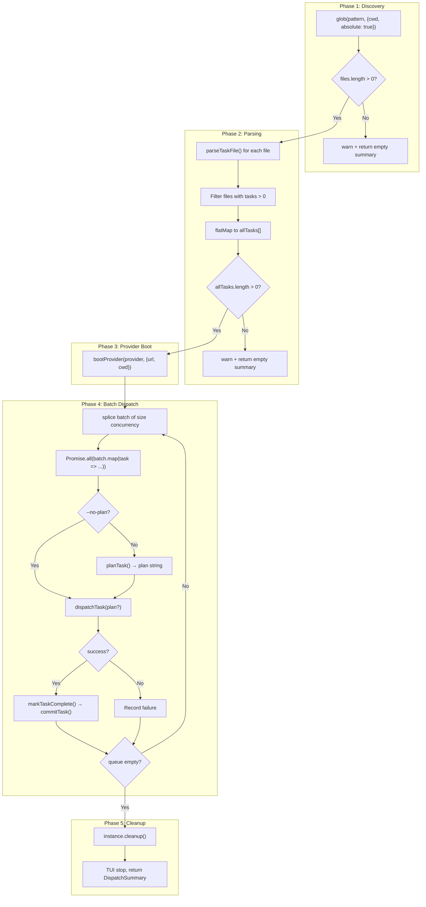

# Orchestrator Pipeline

The orchestrator (`src/orchestrator.ts`) implements the core multi-phase
pipeline that drives the entire dispatch tool. It coordinates file discovery,
task parsing, AI provider lifecycle, optional planning, execution, markdown
mutation, and git commits.

## What it does

The `orchestrate()` function accepts a `DispatchOptions` object from the
[CLI](cli.md) and executes a six-stage pipeline:

1. **Discover** task files via [glob pattern matching](integrations.md#glob-npm-package)
2. **Parse** unchecked tasks from discovered markdown files using [`parseTaskFile()`](../task-parsing/api-reference.md#parsetaskfile)
3. **Boot** the selected [AI provider](../provider-system/provider-overview.md) (OpenCode or Copilot)
4. **Dispatch** tasks in [concurrent batches](#concurrency-model) (plan + execute per task)
5. **Mutate** source markdown to [mark tasks complete](../task-parsing/api-reference.md#marktaskcomplete)
6. **Commit** each completed task via [git](../planning-and-dispatch/git.md)

It returns a [`DispatchSummary`](#dispatchsummary) with counts of completed, failed, and skipped
tasks plus per-task results.

## Why it exists

The orchestrator is the "glue" that turns independent modules ([parser](../task-parsing/overview.md), [planner](../planning-and-dispatch/planner.md),
[dispatcher](../planning-and-dispatch/dispatcher.md), [git](../planning-and-dispatch/git.md), [provider](../provider-system/provider-overview.md)) into a coherent pipeline. Without it, each module
would need to know about the others. The orchestrator enforces execution order,
manages the provider lifecycle, and translates between module interfaces.

## Pipeline phases



## Concurrency model

The orchestrator uses a **batch-sequential** concurrency model, not true
unbounded parallelism (`src/orchestrator.ts:113-162`).

### How it works

```typescript
const queue = [...allTasks];
while (queue.length > 0) {
  const batch = queue.splice(0, concurrency);
  const batchResults = await Promise.all(batch.map(async (task) => { ... }));
  results.push(...batchResults);
}
```

1. Tasks are placed in a queue.
2. The loop splices off `concurrency` tasks at a time.
3. `Promise.all()` runs the current batch concurrently.
4. The loop **waits for the entire batch to complete** before starting the
   next batch.
5. This means the last task in a batch blocks the start of the next batch.

### Performance implications

| Concurrency | Behavior |
|-------------|----------|
| `1` (default) | Fully sequential. Each task completes before the next starts. Safest option. |
| `N > 1` | Up to N tasks run in parallel within a batch. If one task takes 10 minutes and others take 1 minute, the fast tasks wait for the slow one before the next batch starts. |
| Large N | All tasks run in a single batch. Provider SDK connections, API rate limits, and system resources become the bottleneck. |

This is **not** a work-stealing or backpressure-aware pool. A more
sophisticated approach would use a semaphore-based pool (e.g.,
`p-limit`) to keep `concurrency` tasks running at all times. The current
approach is simpler but can leave capacity idle between batches.

### Promise.all and failure semantics

`Promise.all()` rejects as soon as **any** promise rejects. However, the
individual task handlers (`batch.map(async (task) => { ... })`) catch their
own errors internally:

- **Planning failure** (`src/orchestrator.ts:129-135`): If `planTask()` throws
  or returns `success: false`, the task is marked `"failed"` in the TUI and
  the handler returns a failed `DispatchResult`. It does **not** throw, so
  `Promise.all` does **not** reject. Other tasks in the batch continue
  independently.
- **Dispatch failure** (`src/orchestrator.ts:150-155`): If `dispatchTask()`
  returns `success: false`, the task is marked failed similarly. No throw.
- **Unexpected exception**: If an exception escapes the handler (e.g., from
  `markTaskComplete()` or `commitTask()`), it **would** cause `Promise.all` to
  reject, which would propagate to the outer `try/catch` and stop the entire
  pipeline. This is a gap — post-dispatch failures are not individually caught.

**Key insight**: A planning failure in one task does **not** block other tasks
in the same batch. Tasks are independent within a batch.

## The fileContentMap

The orchestrator builds a `Map<string, string>` from file paths to raw file
content at `src/orchestrator.ts:80-83`:

```typescript
const fileContentMap = new Map<string, string>();
for (const tf of taskFiles) {
  fileContentMap.set(tf.path, tf.content);
}
```

This exists because the [planner](../planning-and-dispatch/planner.md) needs the raw file content to call
[`buildTaskContext()`](../task-parsing/api-reference.md#buildtaskcontext), which filters out sibling unchecked tasks. The `TaskFile`
objects already contain this content in `tf.content`, but the lookup is
structured by file path because a single file may contain multiple tasks, and
the planner accesses context per-task rather than per-file.

The map avoids repeatedly reading `TaskFile` objects to find the one matching a
task's `file` property. It trades a small amount of memory for O(1) path-based
lookup instead of O(n) array scanning.

## Error recovery and provider cleanup

### The cleanup gap

The orchestrator's `try/catch` structure (`src/orchestrator.ts:53-174`) has an
important gap in error recovery:

```typescript
try {
  // ... pipeline phases ...
  await instance.cleanup();  // line 165 — only on success path
  // ...
} catch (err) {
  tui.stop();                // TUI is stopped
  throw err;                 // but instance.cleanup() is NOT called
}
```

If an error occurs anywhere in the pipeline after the provider is booted (line
100), the catch block stops the TUI but does **not** call
`instance.cleanup()`. This means:

- **OpenCode**: The spawned server process (`oc.server`) is not stopped. It
  may remain running as an orphaned process. See [OpenCode cleanup](../provider-system/opencode-backend.md#cleanup-behavior).
- **Copilot**: Active sessions are not destroyed and the Copilot CLI server is
  not stopped. See [Copilot cleanup](../provider-system/copilot-backend.md#cleanup-behavior).

**Recommendation**: Use a `finally` block to ensure cleanup always runs:

```typescript
try {
  // ... pipeline ...
} catch (err) {
  tui.stop();
  throw err;
} finally {
  if (instance) await instance.cleanup().catch(() => {});
}
```

### Markdown-then-commit failure

After a task succeeds, the orchestrator calls [`markTaskComplete()`](../task-parsing/api-reference.md#marktaskcomplete) then
[`commitTask()`](../planning-and-dispatch/git.md#the-committask-function) sequentially (`src/orchestrator.ts:145-146`):

```typescript
await markTaskComplete(task);
await commitTask(task, cwd);
```

If `commitTask()` fails (e.g., git lock contention, no git repo, disk full),
the markdown file has **already been modified** by `markTaskComplete()`. This
leaves the repository in a state where:

- The task is marked `[x]` in the markdown file.
- The change is staged (via `git add -A` inside `commitTask`), or not staged
  if the failure occurred before staging.
- No commit exists for this task.

The markdown mutation is **not rolled back**. On a subsequent run, the task
would be skipped (it is now checked), even though its [git commit](../planning-and-dispatch/git.md) never
completed. This is a known limitation of the sequential
read-modify-write-commit pattern.

**Mitigation**: Git failures are rare in practice. If one occurs, the user can
manually commit the staged changes or reset the file. A more robust approach
would stage and commit atomically, or roll back the markdown on commit failure.

## Dry-run mode

When `--dry-run` is passed, the orchestrator takes a completely separate code
path (`dryRunMode()` at `src/orchestrator.ts:177-215`):

- No TUI is created.
- No provider is booted.
- Files are discovered and parsed, then tasks are listed via the
  [logger](../shared-types/logger.md).
- All tasks are reported as `skipped` in the summary.

Dry-run mode is useful for previewing what dispatch would do without starting
AI providers or modifying any files.

## Interfaces

### DispatchOptions

Passed from the CLI to `orchestrate()`:

| Field | Type | Description |
|-------|------|-------------|
| `pattern` | `string` | Glob pattern for task file discovery |
| `cwd` | `string` | Working directory |
| `concurrency` | `number` | Max parallel dispatches per batch |
| `dryRun` | `boolean` | Preview mode — no execution |
| `noPlan` | `boolean` | Skip the planner agent phase |
| `provider` | `ProviderName` | AI backend name (`"opencode"` or `"copilot"`) |
| `serverUrl` | `string?` | URL of a running provider server |

### DispatchSummary

Returned from `orchestrate()` to the CLI:

| Field | Type | Description |
|-------|------|-------------|
| `total` | `number` | Total tasks discovered |
| `completed` | `number` | Tasks that succeeded |
| `failed` | `number` | Tasks that failed (planning or execution) |
| `skipped` | `number` | Tasks skipped (dry-run mode only) |
| `results` | `DispatchResult[]` | Per-task result objects |

## Related documentation

- [CLI](cli.md) -- how options are parsed and exit codes are determined
- [Terminal UI](tui.md) -- how pipeline phases drive TUI rendering
- [Logger](../shared-types/logger.md) -- output in dry-run mode
- [Integrations](integrations.md) -- glob file discovery details
- [Task Parsing & Markdown](../task-parsing/overview.md) -- `parseTaskFile()` and
  `markTaskComplete()` behavior
- [API Reference (parser)](../task-parsing/api-reference.md) -- detailed function
  signatures for parser functions called by the orchestrator
- [Planning & Dispatch Pipeline](../planning-and-dispatch/overview.md) -- `planTask()`,
  `dispatchTask()`, and `commitTask()` internals
- [Provider Abstraction & Backends](../provider-system/provider-overview.md) -- `bootProvider()`
  lifecycle
- [Architecture & Concurrency](../task-parsing/architecture-and-concurrency.md) -- concurrent
  write safety concerns for `markTaskComplete()`
