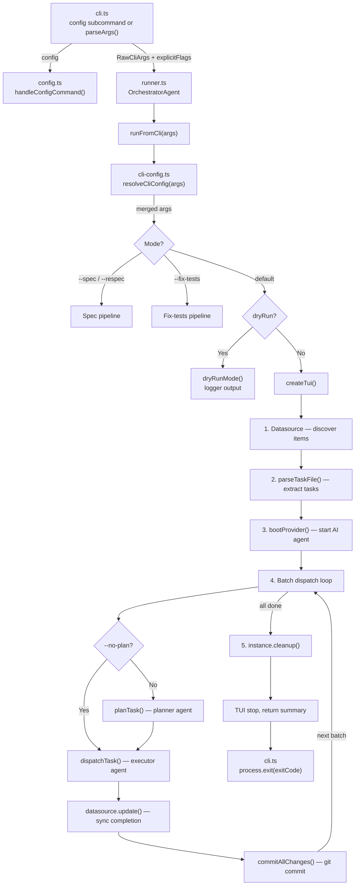

# CLI & Orchestration

The CLI & Orchestration group is the entry point and central nervous system of
the `dispatch` tool. It accepts user input from the command line, discovers and
parses [markdown task files](../task-parsing/overview.md), boots an [AI provider](../provider-system/overview.md), dispatches tasks through a
multi-phase [pipeline](../planning-and-dispatch/overview.md), and renders real-time progress in the [terminal](tui.md).

## Why this group exists

Dispatch needs a single coherent entry point that:

1. Validates user input and translates it into a well-typed options object.
2. Drives a deterministic multi-phase pipeline that coordinates file discovery,
   AI provider lifecycle, task planning, execution, markdown mutation, and git
   commits.
3. Provides real-time visual feedback so operators can monitor long-running
   batch dispatches.
4. Offers a fallback logging mode for non-interactive environments (dry-run,
   CI, piped output).

## Files in this group

| File | Purpose |
|------|---------|
| [`src/cli.ts`](cli.md) | Commander.js argument parser, `main()` entry point, config subcommand routing, exit code logic |
| [`src/config.ts`](configuration.md) | Persistent config data layer: file I/O (`{CWD}/.dispatch/config.json`), validation, `handleConfigCommand()` |
| [`src/orchestrator/cli-config.ts`](configuration.md#three-tier-configuration-precedence) | Config resolution: three-tier merge of CLI flags, config file, and hardcoded defaults |
| [`src/orchestrator/runner.ts`](orchestrator.md) | Pipeline router: dispatch, spec, and fix-tests modes |
| [`src/tui.ts`](tui.md) | Real-time terminal dashboard with spinner, progress bar, and task list |
| [`src/logger.ts`](../shared-types/logger.md) | Minimal structured logger with chalk formatting for non-TUI contexts |

## Architecture overview



## Cross-group dependencies

This group depends on every other group in the project:

- **[Task Parsing & Markdown](../task-parsing/overview.md)**: `parseTaskFile()`,
  `markTaskComplete()`, `buildTaskContext()`, [`Task`, `TaskFile`](../task-parsing/api-reference.md#types) types
- **[Planning & Dispatch Pipeline](../planning-and-dispatch/overview.md)**: `planTask()`,
  `dispatchTask()`, `commitTask()`
- **[Provider Abstraction & Backends](../provider-system/overview.md)**: `bootProvider()`,
  `ProviderInstance`, [`ProviderName`](../shared-types/provider.md#why-providername-is-a-string-literal-union), `PROVIDER_NAMES`
- **[Datasource System](../datasource-system/overview.md)**: `DATASOURCE_NAMES`,
  `DatasourceName`, datasource detection from git remote
- **[Spec Generation](../spec-generation/overview.md)**: `generateSpecs()` pipeline
  invoked in `--spec` mode
- **[Shared Interfaces & Utilities](../shared-types/overview.md)**: `Task`, `TaskFile`,
  `ProviderName` type definitions
- **[Prerequisites & Safety](../prereqs-and-safety/overview.md)**: `checkPrereqs()`,
  `confirmLargeBatch()`, `checkProviderInstalled()`
- **[Git Worktree Helpers](../git-and-worktree/overview.md)**: `createWorktree()`,
  `removeWorktree()`, `ensureGitignoreEntry()`
- **Node.js built-ins**: `fs/promises` (config file I/O, output-dir
  validation), `path`, `child_process` (provider binary detection)

## Quick reference

```bash
# Basic usage — dispatch all open issues
dispatch

# Dispatch specific issues
dispatch 14
dispatch 14,15,16
dispatch 14 15 16

# With options
dispatch 14 --provider copilot
dispatch --dry-run
dispatch 14 --no-plan
dispatch --cwd /path/to/project

# Spec generation
dispatch --spec 42,43,44
dispatch --spec "drafts/*.md" --source github

# Fix failing tests
dispatch --fix-tests

# Config management (interactive wizard)
dispatch config
```

## Related documentation

- [CLI argument parser](cli.md) -- command-line interface details and edge cases
- [Configuration](configuration.md) -- persistent config file, three-tier
  precedence, `dispatch config` interactive wizard
- [Orchestrator pipeline](orchestrator.md) -- concurrency, error handling, and
  pipeline phases
- [Dispatch pipeline](dispatch-pipeline.md) -- the core execution engine for
  AI-driven task dispatch, worktree isolation, and commit agent integration
- [Fix-tests pipeline](fix-tests-pipeline.md) -- the `--fix-tests` pipeline
  for automated test failure resolution
- [Terminal UI](tui.md) -- rendering, state machines, and TTY compatibility
- [Logger](../shared-types/logger.md) -- structured logging for non-interactive contexts
- [Integrations](integrations.md) -- chalk, glob, tsup, Node.js process,
  and fs/promises config I/O details
- [Spec Generation](../spec-generation/overview.md) -- the spec pipeline invoked
  by `--spec` mode
- [Datasource System](../datasource-system/overview.md) -- datasource detection
  and `--source` flag semantics
- [Adding a Provider](../provider-system/adding-a-provider.md) -- Guide for
  implementing new AI provider backends
- [Cleanup Registry](../shared-types/cleanup.md) -- Process-level cleanup for
  graceful shutdown of provider resources
- [Deprecated Compatibility Layer](../deprecated-compat/overview.md) -- legacy
  `IssueFetcher` shims (slated for removal)
- [Testing Overview](../testing/overview.md) -- test suite structure and coverage
- [Prerequisites & Safety Checks](../prereqs-and-safety/overview.md) --
  pre-flight validation (prerequisite checker, batch confirmation, provider
  detection) that runs before pipeline execution
- [Git Worktree Helpers](../git-and-worktree/overview.md) -- worktree
  isolation model used for parallel dispatch execution
