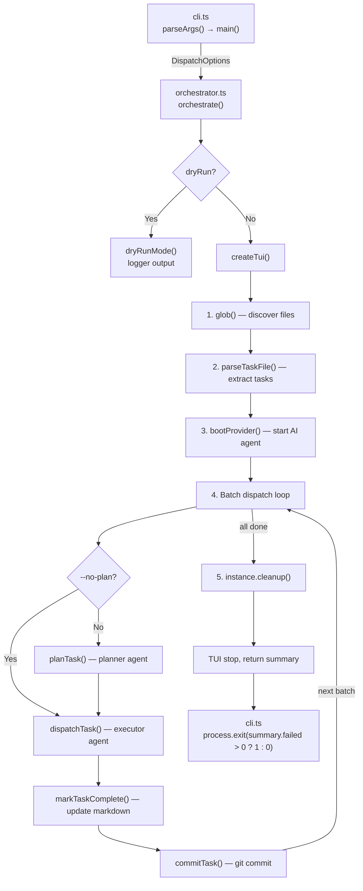

# CLI & Orchestration

The CLI & Orchestration group is the entry point and central nervous system of
the `dispatch` tool. It accepts user input from the command line, discovers and
parses markdown task files, boots an AI provider, dispatches tasks through a
multi-phase pipeline, and renders real-time progress in the terminal.

## Why this group exists

Dispatch needs a single coherent entry point that:

1. Validates user input and translates it into a well-typed options object.
2. Drives a deterministic multi-phase pipeline that coordinates file discovery,
   AI provider lifecycle, task planning, execution, markdown mutation, and git
   commits.
3. Provides real-time visual feedback so operators can monitor long-running
   batch dispatches.
4. Offers a fallback logging mode for non-interactive environments (dry-run,
   CI, piped output).

## Files in this group

| File | Purpose |
|------|---------|
| [`src/cli.ts`](cli.md) | Hand-rolled argument parser, `main()` entry point, exit code logic |
| [`src/orchestrator.ts`](orchestrator.md) | Core multi-phase pipeline: discover, parse, boot, plan, dispatch, commit |
| [`src/tui.ts`](tui.md) | Real-time terminal dashboard with spinner, progress bar, and task list |
| [`src/logger.ts`](../shared-types/logger.md) | Minimal structured logger with chalk formatting for non-TUI contexts |

## Architecture overview



## Cross-group dependencies

This group depends on every other group in the project:

- **[Task Parsing & Markdown](../task-parsing/overview.md)**: `parseTaskFile()`,
  `markTaskComplete()`, `buildTaskContext()`, [`Task`, `TaskFile`](../task-parsing/api-reference.md#types) types
- **[Planning & Dispatch Pipeline](../planning-and-dispatch/overview.md)**: `planTask()`,
  `dispatchTask()`, `commitTask()`
- **[Provider Abstraction & Backends](../provider-system/provider-overview.md)**: `bootProvider()`,
  `ProviderInstance`, [`ProviderName`](../shared-types/provider.md#why-providername-is-a-string-literal-union), `PROVIDER_NAMES`
- **[Shared Interfaces & Utilities](../shared-types/overview.md)**: `Task`, `TaskFile`,
  `ProviderName` type definitions

## Quick reference

```bash
# Basic usage
dispatch "tasks/**/*.md"

# With options
dispatch "tasks/**/*.md" --provider copilot --concurrency 3
dispatch "tasks/**/*.md" --dry-run
dispatch "tasks/**/*.md" --no-plan
dispatch "tasks/**/*.md" --server-url http://localhost:4096
dispatch "tasks/**/*.md" --cwd /path/to/project
```

## Related documentation

- [CLI argument parser](cli.md) — command-line interface details and edge cases
- [Orchestrator pipeline](orchestrator.md) — concurrency, error handling, and
  pipeline phases
- [Terminal UI](tui.md) — rendering, state machines, and TTY compatibility
- [Logger](../shared-types/logger.md) — structured logging for non-interactive contexts
- [Integrations](integrations.md) — chalk, glob, tsup, and Node.js process
  details
