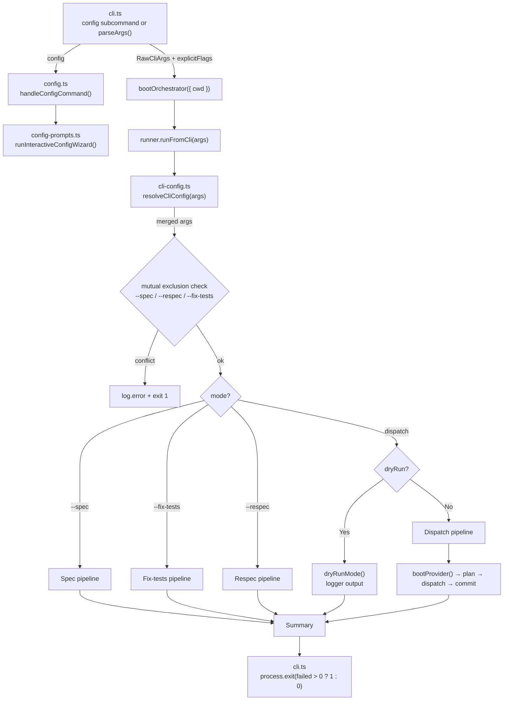
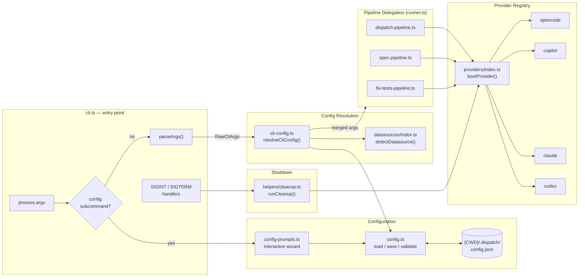

# CLI & Orchestration

The CLI & Orchestration group is the entry point and central nervous system of
the `dispatch` tool. It accepts user input from the command line, discovers and
parses [markdown task files](../task-parsing/overview.md), boots an [AI provider](../provider-system/provider-overview.md), dispatches tasks through a
multi-phase [pipeline](../planning-and-dispatch/overview.md), and renders real-time progress in the [terminal](tui.md).

## Why this group exists

Dispatch needs a single coherent entry point that:

1. Validates user input and translates it into a well-typed options object.
2. Drives a deterministic multi-phase pipeline that coordinates file discovery,
   AI provider lifecycle, task planning, execution, markdown mutation, and git
   commits.
3. Provides real-time visual feedback so operators can monitor long-running
   batch dispatches.
4. Offers a fallback logging mode for non-interactive environments (dry-run,
   CI, piped output).

## Files in this group

| File | Purpose |
|------|---------|
| [`src/cli.ts`](cli.md) | Hand-rolled argument parser, `main()` entry point, config subcommand routing, exit code logic |
| [`src/config.ts`](configuration.md) | Persistent config data layer: file I/O (`{CWD}/.dispatch/config.json`), validation, `handleConfigCommand()` |
| [`src/config-prompts.ts`](configuration.md#the-dispatch-config-command) | Interactive config wizard: provider/model/datasource selection using `@inquirer/prompts` |
| [`src/orchestrator/cli-config.ts`](configuration.md#three-tier-configuration-precedence) | Config resolution: three-tier merge of CLI flags, config file, and hardcoded defaults |
| [`src/orchestrator/runner.ts`](orchestrator.md) | Thin coordinator: mutual exclusion, pipeline delegation (dispatch, spec, respec, fix-tests) |
| [`src/tui.ts`](tui.md) | Real-time terminal dashboard with spinner, progress bar, and task list |
| [`src/logger.ts`](../shared-types/logger.md) | Minimal structured logger with chalk formatting for non-TUI contexts |

## Architecture overview



## Cross-group dependencies

This group depends on every other group in the project:

- **[Task Parsing & Markdown](../task-parsing/overview.md)**: `parseTaskFile()`,
  `markTaskComplete()`, `buildTaskContext()`, [`Task`, `TaskFile`](../task-parsing/api-reference.md#types) types
- **[Planning & Dispatch Pipeline](../planning-and-dispatch/overview.md)**: `planTask()`,
  `dispatchTask()`, `commitTask()`
- **[Provider Abstraction & Backends](../provider-system/provider-overview.md)**: `bootProvider()`,
  `ProviderInstance`, [`ProviderName`](../shared-types/provider.md#why-providername-is-a-string-literal-union), `PROVIDER_NAMES`
  (four providers: opencode, copilot, claude, codex)
- **[Datasource System](../datasource-system/overview.md)**: `DATASOURCE_NAMES`,
  `DatasourceName`, `detectDatasource()` for git-remote-based auto-detection
- **[Spec Generation](../spec-generation/overview.md)**: `generateSpecs()` pipeline
  invoked in `--spec` mode
- **[Shared Interfaces & Utilities](../shared-types/overview.md)**: `Task`, `TaskFile`,
  `ProviderName` type definitions
- **Node.js built-ins**: `fs/promises` (config file I/O), `os` (cpus, freemem),
  `path`, `child_process` (git remote detection)
- **Third-party**: `@inquirer/prompts` (interactive wizard), `chalk` (terminal colors)

## CLI multi-service delegation

The CLI entry point delegates to multiple subsystems depending on the user's
input. The following diagram shows how `cli.ts` routes to each service and
the key data types flowing between them:



This diagram illustrates three key architectural properties:

1. **Early config interception**: The config subcommand is handled before
   `parseArgs()` runs, keeping the wizard independent of the dispatch argument
   grammar.
2. **Single resolution point**: All pipelines receive their options through
   `resolveCliConfig()`, ensuring consistent three-tier precedence (CLI flags >
   config file > hardcoded defaults).
3. **Uniform provider interface**: All four pipelines boot providers through
   the same `bootProvider()` function, enabling provider-agnostic pipeline code.

## Quick reference

```bash
# Basic usage — dispatch all open issues
dispatch

# Dispatch specific issues
dispatch 14
dispatch 14,15,16
dispatch 14 15 16

# With options
dispatch 14 --provider copilot --concurrency 3
dispatch --dry-run
dispatch 14 --no-plan
dispatch --no-worktree
dispatch --force
dispatch --server-url http://localhost:4096
dispatch --cwd /path/to/project

# Spec generation
dispatch --spec 42,43,44
dispatch --spec "drafts/*.md" --source github

# Respec (regenerate existing specs)
dispatch --respec              # regenerate all
dispatch --respec 42,43        # regenerate specific issues

# Fix tests mode
dispatch --fix-tests
dispatch --fix-tests --test-timeout 10

# Config management (interactive wizard)
dispatch config
dispatch config --cwd /path/to/project
```

## Related documentation

- [CLI argument parser](cli.md) -- command-line interface details and edge cases
- [Configuration](configuration.md) -- persistent config file, three-tier
  precedence, `dispatch config` interactive wizard
- [Orchestrator pipeline](orchestrator.md) -- concurrency, error handling, and
  pipeline phases
- [Terminal UI](tui.md) -- rendering, state machines, and TTY compatibility
- [Logger](../shared-types/logger.md) -- structured logging for non-interactive contexts
- [Integrations](integrations.md) -- @inquirer/prompts, chalk, glob, tsup,
  Node.js process, and fs/promises config I/O details
- [Spec Generation](../spec-generation/overview.md) -- the spec pipeline invoked
  by `--spec` mode
- [Datasource System](../datasource-system/overview.md) -- datasource detection
  and `--source` flag semantics
- [Adding a Provider](../provider-system/adding-a-provider.md) -- Guide for
  implementing new AI provider backends
- [Cleanup Registry](../shared-types/cleanup.md) -- Process-level cleanup for
  graceful shutdown of provider resources
- [Deprecated Compatibility Layer](../deprecated-compat/overview.md) -- legacy
  `IssueFetcher` shims (slated for removal)
- [Testing Overview](../testing/overview.md) -- test suite structure and coverage
