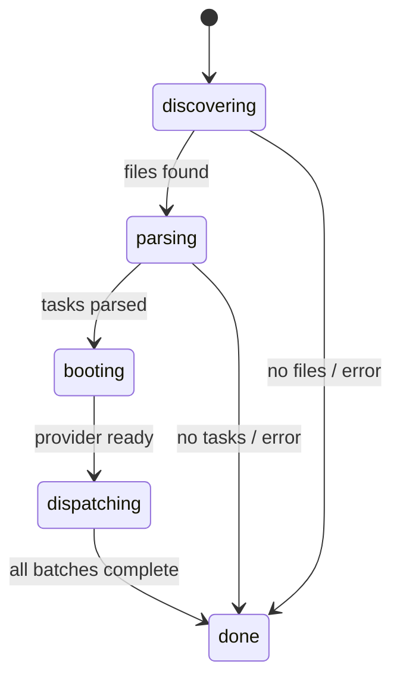
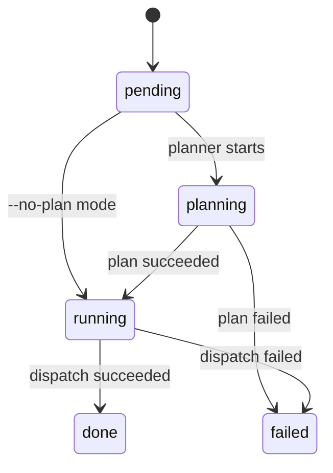

# Terminal UI (TUI)

The TUI module (`src/tui.ts`) renders a real-time terminal dashboard with
spinner animations, a progress bar, and per-task status tracking. It uses raw
ANSI escape codes and the [chalk](integrations.md#chalk) library to produce a
visually rich display that updates in place.

## What it does

The TUI provides a live-updating terminal display that shows:

- The current pipeline phase (discovering, parsing, booting, dispatching, done)
- A progress bar with completion percentage
- A windowed task list showing recent completions, active tasks, and upcoming
  tasks
- Per-task status icons, elapsed time, and error messages
- A summary line with pass/fail/remaining counts

## Why it exists

Batch AI task dispatch can take minutes to hours. Without real-time feedback,
operators have no visibility into whether the tool is working, which tasks are
active, or how long tasks are taking. The TUI solves this by rendering a
dashboard that updates every 80ms, similar to tools like `vitest` or `docker
build`.

## State machines

The TUI tracks two interrelated state machines that drive all rendering
decisions.

### Global phase state machine



The phase is set by the [orchestrator](orchestrator.md) via
`tui.state.phase = "..."` at each pipeline transition point.

### Per-task state machine



Each task in `tui.state.tasks[]` has a `status` field that tracks its
individual progress. The [orchestrator](orchestrator.md) updates this status as tasks move through
the [planning](../planning-and-dispatch/planner.md) and [execution](../planning-and-dispatch/dispatcher.md) phases.

## Module-level mutable state and singleton safety

The TUI uses three module-level mutable variables (`src/tui.ts:31-33`):

```typescript
let spinnerIndex = 0;
let interval: ReturnType<typeof setInterval> | null = null;
let lastLineCount = 0;
```

These variables are **shared across all calls** to `createTui()`. This means:

- **Calling `createTui()` more than once is unsafe.** A second call would
  overwrite the `interval` variable, orphaning the first interval timer. The
  first TUI's `stop()` would clear the second TUI's interval, and
  `lastLineCount` would be corrupted, causing rendering artifacts.
- **The TUI is effectively a singleton.** The orchestrator creates exactly one
  TUI per `orchestrate()` call, which is the intended usage pattern.
- **There is no guard** against accidental multiple instantiation. A defensive
  improvement would be to check if `interval` is already set and either throw
  or clear the existing interval before creating a new one.

### Why module-level state?

The spinner animation needs a persistent counter (`spinnerIndex`) that
increments on each render tick. The `setInterval` reference (`interval`) must
be accessible to both `createTui()` (to start it) and `stop()` (to clear it).
Using module-level state is the simplest approach for a singleton renderer,
though it could be encapsulated in a class or closure for safety.

## Rendering mechanics

### The 80ms render interval

The TUI re-renders the entire display every 80ms (`src/tui.ts:224`):

```typescript
interval = setInterval(() => {
  spinnerIndex++;
  draw(state);
}, 80);
```

This interval:

- Advances the spinner animation (10 frames at 80ms = ~800ms per full
  rotation).
- Calls `draw(state)` which renders the complete display and writes it to
  stdout.
- Is cleared by `stop()` when the pipeline completes.

### Full re-render with ANSI cursor control

The `draw()` function (`src/tui.ts:198-206`) uses raw ANSI escape codes to
clear the previous output and write a new frame:

```typescript
function draw(state: TuiState): void {
  if (lastLineCount > 0) {
    process.stdout.write(`\x1B[${lastLineCount}A\x1B[0J`);
  }
  const output = render(state);
  process.stdout.write(output);
  lastLineCount = output.split("\n").length;
}
```

The escape sequence `\x1B[${n}A` moves the cursor up `n` lines, and `\x1B[0J`
clears from the cursor to the end of the screen. This produces the visual
effect of in-place updates without terminal flickering.

### Performance under high concurrency

At 80ms intervals, the TUI performs 12.5 renders per second. Each render:

1. Builds the complete output string via `render()`.
2. Filters task arrays to compute visible window.
3. Writes the output to stdout with two `process.stdout.write()` calls.

For typical task counts (tens of tasks), this is negligible. With hundreds of
tasks:

- The `render()` function filters `state.tasks` three times (running,
  completed, pending) — O(n) per filter.
- The visible task window is capped at ~9 tasks (3 completed + active + 3
  pending), so the actual rendering cost is constant regardless of total task
  count.
- The dominant cost is the three array filters, which remain cheap even for
  1000+ tasks at 80ms intervals.

**Verdict**: The 80ms interval is not a performance concern. The windowing
logic ensures constant rendering cost per frame.

## Task windowing

The TUI displays a windowed view of tasks (`src/tui.ts:133-146`) to keep the
display compact:

```
  ··· 5 earlier task(s) completed
  ● #6  Implement auth middleware  done  12s
  ● #7  Add rate limiting         done   8s
  ● #8  Update API docs           done   5s
  ⠹ #9  Refactor database layer   executing  3s
  ⠹ #10 Add caching              planning  1s
  ○ #11 Write integration tests   pending
  ○ #12 Update changelog          pending
  ○ #13 Bump version              pending
  ··· 7 more task(s) pending
```

The window shows:

- Last 3 completed/failed tasks
- All currently running/planning tasks
- First 3 pending tasks
- Ellipsis indicators for overflow in both directions

### Behavior with hundreds of tasks

With 500 tasks where 200 are complete, 3 are running, and 297 are pending:

- The display shows: `··· 197 earlier task(s) completed`, 3 done, 3 running,
  3 pending, `··· 294 more task(s) pending`.
- Total visible lines remain constant (~15 lines including headers and
  summary).
- The `completed.slice(-3)` and `pending.slice(0, 3)` operations are O(1)
  after the O(n) filter.

The windowing logic works correctly with any task count. The display does not
grow unbounded.

## TTY compatibility and non-TTY environments

The TUI uses raw ANSI escape codes for cursor manipulation
(`src/tui.ts:198-206`) and chalk for color formatting. These depend on terminal
capabilities.

### How chalk handles non-TTY environments

Chalk (v5.x) uses the `supports-color` package internally to detect terminal
color support. The detection checks:

- `process.stdout.isTTY` — whether stdout is a TTY device.
- The `TERM` environment variable.
- Whether the process is running in a known CI environment.
- The `FORCE_COLOR` and `NO_COLOR` environment variables.

When stdout is not a TTY (piped output, redirected to a file, CI without TTY):

- Chalk automatically disables colors (level 0). Styled strings are returned
  without ANSI escape codes.
- The `FORCE_COLOR=1` (or `2`, `3`) environment variable can override this to
  force color output in non-TTY environments.
- The `NO_COLOR` or `FORCE_COLOR=0` variables explicitly disable colors.

### ANSI escape codes in non-TTY environments

The TUI's ANSI cursor movement (`\x1B[${n}A\x1B[0J`) is **not affected by
chalk's color detection**. These escape sequences are written directly via
`process.stdout.write()` regardless of TTY status. In non-TTY environments:

| Environment | Behavior |
|-------------|----------|
| TTY terminal | Works correctly — cursor moves up, old output is cleared |
| Piped stdout (`dispatch ... \| cat`) | ANSI escapes appear as literal characters in the output, producing garbled text |
| Redirected to file (`dispatch ... > log.txt`) | ANSI escapes are written to the file as raw bytes |
| CI pipelines (GitHub Actions, etc.) | Depends on CI runner. Most CI environments do not support cursor movement but may render some ANSI codes |
| Windows cmd.exe | ANSI escapes may not be supported. Windows Terminal supports them. |

**Current mitigation**: The orchestrator uses `--dry-run` mode for non-TUI
contexts, which uses the [logger](../shared-types/logger.md) instead of the TUI. However,
there is no automatic detection — users must explicitly pass `--dry-run` when
running in non-interactive environments.

**Recommendation**: Check `process.stdout.isTTY` before creating the TUI,
and fall back to logger-based output in non-TTY environments:

```typescript
if (!process.stdout.isTTY) {
  // Use logger output instead of TUI
}
```

## Signal handling

There is currently **no signal handling** for `SIGINT` or `SIGTERM`. If the
user presses Ctrl+C during dispatch:

1. Node.js terminates the process immediately.
2. The TUI's `setInterval` is not cleared (the process exits anyway).
3. `instance.cleanup()` is **not called**, potentially leaving orphaned
   provider server processes. See [the cleanup gap](orchestrator.md#the-cleanup-gap).
4. Any in-progress [markdown mutations](../task-parsing/api-reference.md#marktaskcomplete) or [git commits](../planning-and-dispatch/git.md) may be left in an
   incomplete state.

Adding signal handlers would allow graceful shutdown:

```typescript
process.on('SIGINT', async () => {
  tui.stop();
  await instance?.cleanup();
  process.exit(130); // 128 + SIGINT(2)
});
```

## Interfaces

### TaskStatus

Union type for per-task states: `"pending" | "planning" | "running" | "done" | "failed"`

### TaskState

| Field | Type | Description |
|-------|------|-------------|
| `task` | [`Task`](../task-parsing/api-reference.md#task) | The parsed task object |
| `status` | `TaskStatus` | Current task state |
| `elapsed` | `number?` | Start timestamp (for running) or total ms (for done) |
| `error` | `string?` | Error message if failed |

### TuiState

| Field | Type | Description |
|-------|------|-------------|
| `tasks` | `TaskState[]` | All tasks with their current states |
| `phase` | `string` | Current pipeline phase |
| `startTime` | `number` | Timestamp when TUI was created |
| `filesFound` | `number` | Count of discovered files |
| `serverUrl` | `string?` | Provider server URL if connecting to existing server |
| `provider` | `string?` | Active provider name for display |

## Related documentation

- [Orchestrator pipeline](orchestrator.md) -- how the orchestrator drives
  TUI state transitions
- [CLI](cli.md) -- argument parsing and exit codes
- [Logger](../shared-types/logger.md) -- alternative output for non-TUI contexts
- [Integrations](integrations.md) -- chalk color detection and ANSI behavior
- [Task Parsing Overview](../task-parsing/overview.md) -- the `Task` type displayed by the TUI
