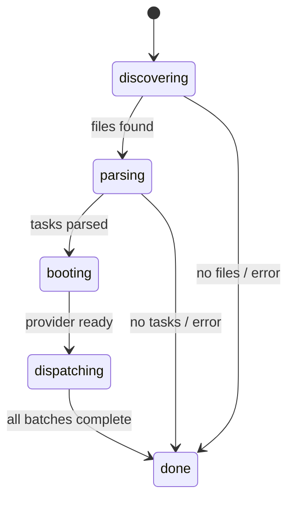
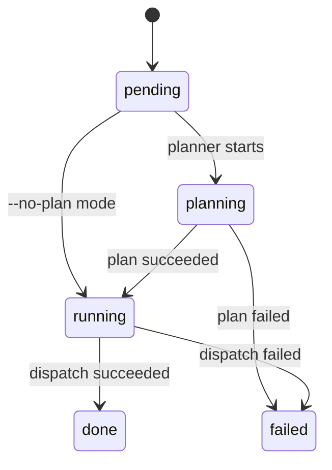
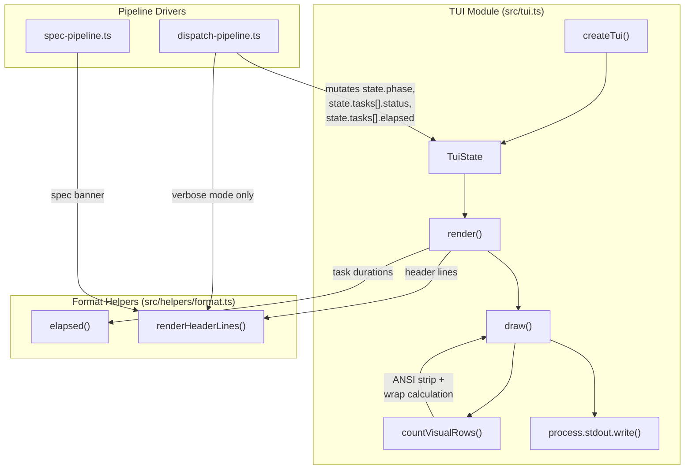

# Terminal UI (TUI)

The TUI module (`src/tui.ts`) renders a real-time terminal dashboard with
spinner animations, a progress bar, and per-task status tracking. It uses raw
ANSI escape codes and the [chalk](integrations.md#chalk) library to produce a
visually rich display that updates in place.

## What it does

The TUI provides a live-updating terminal display that shows:

- The current [pipeline phase](../planning-and-dispatch/overview.md#pipeline-stages) (discovering, parsing, booting, dispatching, done)
- A progress bar with completion percentage
- A windowed task list showing recent completions, active tasks, and upcoming
  tasks
- Per-task status icons, [elapsed time](../shared-types/format.md), and error messages
- A summary line with pass/fail/remaining counts

## Why it exists

Batch AI task dispatch can take minutes to hours. Without real-time feedback,
operators have no visibility into whether the tool is working, which tasks are
active, or how long tasks are taking. The TUI solves this by rendering a
dashboard that updates every 80ms, similar to tools like `vitest` or `docker
build`.

## State machines

The TUI tracks two interrelated state machines that drive all rendering
decisions.

### Global phase state machine



The phase is set by the [orchestrator](orchestrator.md) via
`tui.state.phase = "..."` at each pipeline transition point.

### Per-task state machine



Each task in `tui.state.tasks[]` has a `status` field that tracks its
individual progress. The [orchestrator](orchestrator.md) updates this status as tasks move through
the [planning](../planning-and-dispatch/planner.md) and [execution](../planning-and-dispatch/dispatcher.md) phases.

## Module-level mutable state and singleton safety

The TUI uses three module-level mutable variables (`src/tui.ts:40-42`):

```typescript
let spinnerIndex = 0;
let interval: ReturnType<typeof setInterval> | null = null;
let lastLineCount = 0;
```

These variables are **shared across all calls** to `createTui()`. This means:

- **Calling `createTui()` more than once is unsafe.** A second call would
  overwrite the `interval` variable, orphaning the first interval timer. The
  first TUI's `stop()` would clear the second TUI's interval, and
  `lastLineCount` would be corrupted, causing rendering artifacts.
- **The TUI is effectively a singleton.** The orchestrator creates exactly one
  TUI per `orchestrate()` call, which is the intended usage pattern.
- **There is no guard** against accidental multiple instantiation. A defensive
  improvement would be to check if `interval` is already set and either throw
  or clear the existing interval before creating a new one.

### Why module-level state?

The spinner animation needs a persistent counter (`spinnerIndex`) that
increments on each render tick. The `setInterval` reference (`interval`) must
be accessible to both `createTui()` (to start it) and `stop()` (to clear it).
Using module-level state is the simplest approach for a singleton renderer,
though it could be encapsulated in a class or closure for safety.

## Rendering mechanics

### The 80ms render interval

The TUI re-renders the entire display every 80ms (`src/tui.ts:329-332`):

```typescript
interval = setInterval(() => {
  spinnerIndex++;
  draw(state);
}, 80);
```

This interval:

- Advances the spinner animation (10 frames at 80ms = ~800ms per full
  rotation).
- Calls `draw(state)` which renders the complete display and writes it to
  stdout.
- Is cleared by `stop()` when the pipeline completes.

### Full re-render with ANSI cursor control

The `draw()` function (`src/tui.ts:302-311`) uses raw ANSI escape codes to
clear the previous output and write a new frame:

```typescript
function draw(state: TuiState): void {
  if (lastLineCount > 0) {
    process.stdout.write(`\x1B[${lastLineCount}A\x1B[0J`);
  }
  const output = render(state);
  process.stdout.write(output);
  const cols = process.stdout.columns || 80;
  lastLineCount = countVisualRows(output, cols);
}
```

The escape sequence `\x1B[${n}A` moves the cursor up `n` lines, and `\x1B[0J`
clears from the cursor to the end of the screen. This produces the visual
effect of in-place updates without terminal flickering.

#### `countVisualRows` and ANSI stripping

The `draw()` function uses `countVisualRows()` (`src/tui.ts:107-113`) rather
than a simple `output.split("\n").length` to compute how many terminal rows the
output occupied. This is necessary because long lines wrap in the terminal,
consuming more than one row.

`countVisualRows` works by:

1. Stripping all ANSI escape sequences via a manual regex
   (`/\x1B\[[0-9;]*m/g`) so that invisible formatting codes are not counted
   toward line length.
2. Splitting on newlines.
3. For each line, computing `Math.ceil(line.length / cols)` to account for
   terminal wrapping (with a minimum of 1 row per line).

The ANSI-stripping regex handles SGR sequences (colors, bold, dim) which are
the only ANSI codes produced by chalk. It does not strip cursor movement or
other CSI sequences, but those are not present in the `render()` output —
cursor control happens only in `draw()` itself, before and after the rendered
content.

### Performance under high concurrency

At 80ms intervals, the TUI performs 12.5 renders per second. Each render:

1. Builds the complete output string via `render()`.
2. Filters task arrays to compute visible window.
3. Writes the output to stdout with two `process.stdout.write()` calls.

For typical task counts (tens of tasks), this is negligible. With hundreds of
tasks:

- The `render()` function filters `state.tasks` three times (running,
  completed, pending) — O(n) per filter.
- The visible task window is capped at 14 tasks in flat mode (3 completed +
  8 running + 3 pending), so the actual rendering cost is constant regardless
  of total task count.
- The dominant cost is the three array filters, which remain cheap even for
  1000+ tasks at 80ms intervals.

**Verdict**: The 80ms interval is not a performance concern. The windowing
logic ensures constant rendering cost per frame.

## Task windowing and display modes

The TUI has two display modes, selected automatically at render time
(`src/tui.ts:156`): when more than one distinct `worktree` value is present
among the tasks, the **worktree-grouped** display is used; otherwise the
**flat** display is used.

### Flat display mode

The flat display (`src/tui.ts:238-281`) shows a windowed view of tasks to keep
the display compact:

```
  ··· 5 earlier task(s) completed
  ● #6  Implement auth middleware  done  12s
  ● #7  Add rate limiting         done   8s
  ● #8  Update API docs           done   5s
  ⠹ #9  Refactor database layer   executing  3s
  ⠹ #10 Add caching              planning  1s
  ○ #11 Write integration tests   pending
  ○ #12 Update changelog          pending
  ○ #13 Bump version              pending
  ··· 7 more task(s) pending
```

The window shows:

- Last 3 completed/failed tasks
- Up to 8 currently running/planning tasks (capped at `src/tui.ts:239`)
- First 3 pending tasks
- Ellipsis indicators for overflow in both directions
- An additional overflow line when more than 8 tasks are running
  (`src/tui.ts:274-276`)

### Worktree-grouped display mode

When multiple worktrees are active (`activeWorktrees.size > 1`), the TUI
switches to a grouped layout (`src/tui.ts:167-236`) that organizes tasks by
worktree rather than showing them individually:

```
  ··· 2 earlier issue(s) completed
  ● #45  3/3 tasks  18s
  ● #67  2/2 tasks  12s
  ⠹ #89  2 active  Refactor auth module  4s
  ⠹ #102  1 active  Update API schema  1s
```

Each worktree is displayed as a single row:

- **Completed groups** are collapsed to one line showing the issue number,
  task count, and the maximum elapsed time across the group's tasks. The last
  3 completed groups are visible.
- **Active groups** show the issue number, count of active tasks, the text of
  the first active task, and elapsed time since the earliest active task
  started.
- **Issue numbers** are extracted from the worktree name using the regex
  `/^(\d+)/` (`src/tui.ts:197`, `src/tui.ts:207`). This matches the worktree
  naming convention from `src/helpers/worktree.ts`, where issue filenames like
  `123-fix-auth-bug.md` become worktree names like `123-fix-auth-bug`. The
  regex extracts `123` as the issue number for display.
- **Ungrouped tasks** (those without a `worktree` field) are rendered in flat
  mode below the grouped entries.

### Behavior with hundreds of tasks

With 500 tasks where 200 are complete, 3 are running, and 297 are pending:

- The display shows: `··· 197 earlier task(s) completed`, 3 done, 3 running,
  3 pending, `··· 294 more task(s) pending`.
- Total visible lines remain constant (~15 lines including headers and
  summary).
- The `completed.slice(-3)`, `running.slice(0, 8)`, and `pending.slice(0, 3)`
  operations are O(1) after the O(n) filter.

The windowing logic works correctly with any task count. The display does not
grow unbounded.

## TTY compatibility and non-TTY environments

The TUI uses raw ANSI escape codes for cursor manipulation
(`src/tui.ts:302-311`) and chalk for color formatting. These depend on terminal
capabilities.

### How chalk handles non-TTY environments

Chalk (v5.x) uses the `supports-color` package internally to detect terminal
color support. The detection checks:

- `process.stdout.isTTY` — whether stdout is a TTY device.
- The `TERM` environment variable.
- Whether the process is running in a known CI environment.
- The `FORCE_COLOR` and `NO_COLOR` environment variables.

When stdout is not a TTY (piped output, redirected to a file, CI without TTY):

- Chalk automatically disables colors (level 0). Styled strings are returned
  without ANSI escape codes.
- The `FORCE_COLOR=1` (or `2`, `3`) environment variable can override this to
  force color output in non-TTY environments.
- The `NO_COLOR` or `FORCE_COLOR=0` variables explicitly disable colors.

### ANSI escape codes in non-TTY environments

The TUI's ANSI cursor movement (`\x1B[${n}A\x1B[0J`) is **not affected by
chalk's color detection**. These escape sequences are written directly via
`process.stdout.write()` regardless of TTY status. In non-TTY environments:

| Environment | Behavior |
|-------------|----------|
| TTY terminal | Works correctly — cursor moves up, old output is cleared |
| Piped stdout (`dispatch ... \| cat`) | ANSI escapes appear as literal characters in the output, producing garbled text |
| Redirected to file (`dispatch ... > log.txt`) | ANSI escapes are written to the file as raw bytes |
| CI pipelines (GitHub Actions, etc.) | Depends on CI runner. Most CI environments do not support cursor movement but may render some ANSI codes |
| Windows cmd.exe | ANSI escapes may not be supported. Windows Terminal supports them. |

### `process.stdout.columns` and terminal width

The TUI reads `process.stdout.columns` at `src/tui.ts:158` (during rendering)
and `src/tui.ts:309` (in `draw()`) with a fallback to 80 if the value is
undefined. `process.stdout.columns` is `undefined` when stdout is not a TTY.

**Resize behavior:** When a TTY terminal is resized, Node.js updates
`process.stdout.columns` automatically and emits a `'resize'` event on
`process.stdout`. The TUI does **not** listen for the `'resize'` event — it
simply re-reads `process.stdout.columns` on each 80ms render tick. This means
the TUI adapts to terminal resizes within one render frame (80ms), which is
effectively instantaneous from the user's perspective. There is no need for an
explicit resize handler.

**Current mitigation**: The orchestrator uses [`--verbose`](cli.md) mode as
the non-TUI alternative, which uses the [logger](../shared-types/logger.md)
instead of the TUI. Additionally, the `--dry-run` flag produces static output.
However, there is no automatic `isTTY` detection — the TUI is created
unconditionally unless `--verbose` or `--dry-run` is passed.

## Signal handling

Signal handlers for `SIGINT` and `SIGTERM` are installed at
`src/cli.ts:242-252`. Both call `runCleanup()` from the
[cleanup registry](../shared-types/cleanup.md) to shut down provider
processes before exiting with the conventional `128 + signal` exit code.

When a signal is received during dispatch:

1. The signal handler calls `await runCleanup()`, which drains all registered
   cleanup functions (including provider `cleanup()` calls).
2. `process.exit(130)` (SIGINT) or `process.exit(143)` (SIGTERM) terminates
   the process.
3. The TUI's `setInterval` is not explicitly cleared, but process exit stops
   it automatically.

Note that provider cleanup functions are registered via `registerCleanup()`
in the orchestrator and spec generator — the TUI itself does not register
cleanup functions. See [Cleanup registry](../shared-types/cleanup.md) for
the full lifecycle and [Process Signals integration](../shared-types/integrations.md#nodejs-process-signals-sigint-sigterm)
for exit code conventions, double-signal behavior, and troubleshooting.

## Interfaces

### TaskStatus

Union type for per-task states: `"pending" | "planning" | "running" | "done" | "failed"`

### TaskState

| Field | Type | Description |
|-------|------|-------------|
| `task` | [`Task`](../task-parsing/api-reference.md#task) | The parsed task object |
| `status` | `TaskStatus` | Current task state |
| `elapsed` | `number?` | Dual-semantics timing field (see below) |
| `error` | `string?` | Error message if failed |
| `worktree` | `string?` | Worktree directory name (e.g. `"123-fix-auth-bug"`) when task runs in a worktree |

#### `elapsed` field dual-semantics

The `elapsed` field on `TaskState` changes meaning depending on the task's
status. This is an intentional design choice that avoids adding a separate
`startTime` field, but it requires understanding the semantics:

| Task status | `elapsed` contains | Set at |
|-------------|-------------------|--------|
| `running` or `planning` | Absolute `Date.now()` timestamp of when the task started | `dispatch-pipeline.ts` task-start callback |
| `done` or `failed` | Relative duration in milliseconds (`Date.now() - startTime`) | `dispatch-pipeline.ts` task-done/fail callback |

The TUI rendering code handles this correctly at `src/tui.ts:258-263`:

- For running/planning tasks: computes `now - ts.elapsed` to get the live
  elapsed time (works because `elapsed` is a start timestamp).
- For done tasks: uses `ts.elapsed` directly as a duration passed to
  `elapsed()` (works because `elapsed` is already a millisecond delta).

This pattern means the `elapsed` field should never be interpreted without
checking `status` first. A value like `1709136000000` could be either a
timestamp (task started at that epoch ms) or an implausibly large duration,
depending on whether the task is still running or has completed.

### TuiState

| Field | Type | Description |
|-------|------|-------------|
| `tasks` | `TaskState[]` | All tasks with their current states |
| `phase` | `"discovering" \| "parsing" \| "booting" \| "dispatching" \| "done"` | Current pipeline phase (union type) |
| `startTime` | `number` | Timestamp when TUI was created |
| `filesFound` | `number` | Count of discovered files |
| `serverUrl` | `string?` | Provider server URL if connecting to existing server |
| `provider` | `string?` | Active provider name for display |
| `model` | `string?` | Model identifier reported by the provider (e.g. `"gpt-4o"`) |
| `source` | `string?` | Datasource name (e.g. `"github"`, `"azdevops"`, `"md"`) |
| `currentIssue` | `{ number: string; title: string }?` | Currently-processing issue context, shown as a header line |

The `model`, `source`, and `currentIssue` fields were added to give operators
visibility into which AI model and datasource are active, and which issue is
being processed. These are rendered in the TUI header via
[`renderHeaderLines()`](../shared-types/format.md#renderheaderlinesinfo-headerinfo-string)
(`src/tui.ts:127-131`) and a conditional issue line (`src/tui.ts:134-138`).

## Verbose mode TUI bypass

When `--verbose` is active, the orchestrator does **not** call `createTui()`.
Instead, `dispatch-pipeline.ts` creates a no-op TUI object:

```typescript
{ state, update: () => {}, stop: () => {} }
```

This silent TUI has the same `state` structure but its `update` and `stop`
methods are no-ops, so no animated rendering occurs. The verbose mode path
uses `renderHeaderLines()` (`dispatch-pipeline.ts:89`) to print a one-time
inline header to the logger rather than the animated TUI display.

This means the TUI state machine still progresses through phases (the `state`
object is still mutated), but no terminal output is produced from the TUI
module itself. All output in verbose mode goes through the
[logger](../shared-types/logger.md) instead.

## Data flow

The following diagram shows how data flows between the TUI, format helpers,
and the pipeline modules that drive TUI state:



## Related documentation

- [Orchestrator pipeline](orchestrator.md) -- how the orchestrator drives
  TUI state transitions
- [CLI](cli.md) -- argument parsing and exit codes
- [Configuration System](configuration.md) -- persistent defaults that affect
  concurrency and `--dry-run` behavior
- [Logger](../shared-types/logger.md) -- alternative output for non-TUI contexts
- [Format Utilities](../shared-types/format.md) -- `elapsed()` and
  `renderHeaderLines()` functions used for per-task duration display and
  header rendering
- [Integrations](integrations.md) -- chalk color detection and ANSI behavior
- [Task Parsing Overview](../task-parsing/overview.md) -- the `Task` type displayed by the TUI
- [Planning & Dispatch Pipeline](../planning-and-dispatch/overview.md) --
  pipeline stages that drive TUI phase transitions
- [Worktree Management](../git-and-worktree/worktree-management.md) -- how
  worktree names are constructed, affecting the grouped display mode
- [Configuration System](configuration.md) -- `--concurrency` and `--dry-run`
  settings that affect TUI behavior
