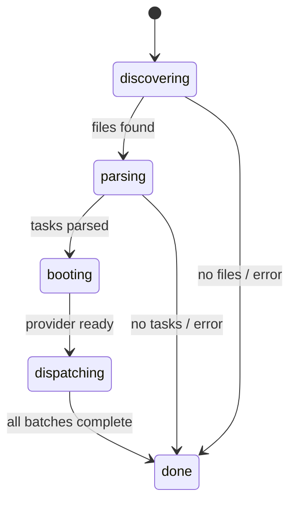
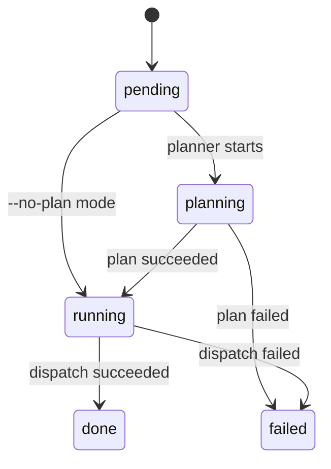
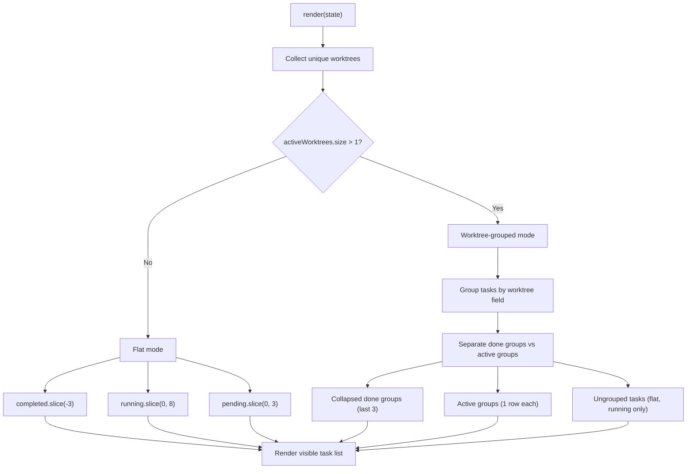

# Terminal UI (TUI)

The TUI module (`src/tui.ts`, 347 lines) renders a real-time terminal
dashboard with spinner animations, a progress bar, and per-task status
tracking. It uses raw ANSI escape codes and the
[chalk](integrations.md#chalk) library to produce a visually rich display
that updates in place.

## What it does

The TUI provides a live-updating terminal display that shows:

- A branded header with provider, model, and datasource metadata via
  [`renderHeaderLines()`](../shared-types/format.md#renderheaderlinesinfo-headerinfo-string)
- The current issue context (number and title) when processing issue-based
  work items
- The current [pipeline phase](../planning-and-dispatch/overview.md#pipeline-stages)
  (discovering, parsing, booting, dispatching, done)
- A progress bar with completion percentage
- A windowed task list with two display modes:
  - **Flat mode** — when tasks have zero or one worktree, shows individual
    tasks with running cap of 8
  - **Worktree-grouped mode** — when tasks span multiple worktrees, shows
    one summary row per worktree group
- Per-task status icons, [elapsed time](../shared-types/format.md), and
  error messages
- A summary line with pass/fail/remaining counts

## Why it exists

Batch AI task dispatch can take minutes to hours. Without real-time feedback,
operators have no visibility into whether the tool is working, which tasks are
active, or how long tasks are taking. The TUI solves this by rendering a
dashboard that updates every 80ms, similar to tools like `vitest` or `docker
build`.

## State machines

The TUI tracks two interrelated state machines that drive all rendering
decisions.

### Global phase state machine



The phase is set by the [orchestrator](orchestrator.md) via
`tui.state.phase = "..."` at each pipeline transition point.

### Per-task state machine



Each task in `tui.state.tasks[]` has a `status` field that tracks its
individual progress. The [orchestrator](orchestrator.md) updates this status
as tasks move through the [planning](../planning-and-dispatch/planner.md)
and [execution](../planning-and-dispatch/dispatcher.md) phases.

## Module-level mutable state and singleton safety

The TUI uses three module-level mutable variables (`src/tui.ts:40-42`):

```
spinnerIndex   — animation frame counter
interval       — setInterval handle for the 80ms render loop
lastLineCount  — number of visual rows in the previous frame
```

These variables are **shared across all calls** to `createTui()`. This means:

- **Calling `createTui()` more than once is unsafe.** A second call would
  overwrite the `interval` variable, orphaning the first interval timer. The
  first TUI's `stop()` would clear the second TUI's interval, and
  `lastLineCount` would be corrupted, causing rendering artifacts.
- **The TUI is effectively a singleton.** The orchestrator creates exactly one
  TUI per `orchestrate()` call, which is the intended usage pattern.
- **There is no guard** against accidental multiple instantiation. A defensive
  improvement would be to check if `interval` is already set and either throw
  or clear the existing interval before creating a new one.

### Why module-level state?

The spinner animation needs a persistent counter (`spinnerIndex`) that
increments on each render tick. The `setInterval` reference (`interval`) must
be accessible to both `createTui()` (to start it) and `stop()` (to clear it).
Using module-level state is the simplest approach for a singleton renderer,
though it could be encapsulated in a class or closure for safety.

## Rendering mechanics

### The 80ms render interval

The TUI re-renders the entire display every 80ms (`src/tui.ts:329`):

```
interval = setInterval(() => {
  spinnerIndex++;
  draw(state);
}, 80);
```

This interval:

- Advances the spinner animation (10 frames at 80ms = ~800ms per full
  rotation).
- Calls `draw(state)` which renders the complete display and writes it to
  stdout.
- Is cleared by `stop()` when the pipeline completes.

### Full re-render with ANSI cursor control

The `draw()` function (`src/tui.ts:302-311`) uses raw ANSI escape codes to
clear the previous output and write a new frame:

```
function draw(state: TuiState): void {
  if (lastLineCount > 0) {
    process.stdout.write(`\x1B[${lastLineCount}A\x1B[0J`);
  }
  const output = render(state);
  process.stdout.write(output);
  const cols = process.stdout.columns || 80;
  lastLineCount = countVisualRows(output, cols);
}
```

The escape sequence `\x1B[${n}A` moves the cursor up `n` lines, and
`\x1B[0J` clears from the cursor to the end of the screen. This produces the
visual effect of in-place updates without terminal flickering.

### Visual row counting with `countVisualRows()`

The `draw()` function uses `countVisualRows()` (`src/tui.ts:107-113`) instead
of a naive `output.split("\n").length` to compute how many terminal rows the
previous frame occupied. This is necessary because a single logical line can
wrap to multiple visual rows when its content exceeds the terminal width.

The function:

1. Strips all ANSI escape codes from the text using the regex
   `/\x1B\[[0-9;]*m/g`, since escape codes occupy zero visual width.
2. Splits on newlines to get logical lines.
3. For each logical line, computes `Math.ceil(line.length / cols)` to
   determine how many visual rows it occupies (minimum 1 per line).
4. Sums all visual rows.

The terminal column count is read from `process.stdout.columns` with a
fallback of 80 columns. A `Math.max(1, cols)` guard prevents division by
zero.

**Why this matters:** Without visual row counting, task text longer than the
terminal width causes the cursor-up count to be too low, leaving stale
output lines on screen. This is especially relevant when task descriptions
are verbose or the terminal is narrow.

### Performance under high concurrency

At 80ms intervals, the TUI performs 12.5 renders per second. Each render:

1. Builds the complete output string via `render()`.
2. Filters task arrays to compute visible window.
3. Writes the output to stdout with two `process.stdout.write()` calls.

For typical task counts (tens of tasks), this is negligible. With hundreds of
tasks:

- The `render()` function filters `state.tasks` three times (running,
  completed, pending) — O(n) per filter.
- The visible task window is capped (3 completed + up to 8 running + 3
  pending in flat mode), so the actual rendering cost is constant regardless
  of total task count.
- The dominant cost is the three array filters, which remain cheap even for
  1000+ tasks at 80ms intervals.

**Verdict**: The 80ms interval is not a performance concern. The windowing
logic ensures constant rendering cost per frame.

## Display modes

The TUI has two display modes, selected automatically based on the number of
active worktrees.

### Data flow for display mode selection



### Flat mode (default)

When tasks have zero or one distinct worktree value, the TUI uses flat mode
(`src/tui.ts:238-281`). This is the standard display for single-issue or
non-worktree workflows.

The visible task window shows:

- **Last 3 completed/failed tasks** — `completed.slice(-3)`
- **Up to 8 running/planning tasks** — `running.slice(0, 8)`
- **First 3 pending tasks** — `pending.slice(0, 3)`
- Ellipsis indicators for overflow:
  - `"... N earlier task(s) completed"` when `completed.length > 3`
  - `"... N more running"` when `running.length > 8`
  - `"... N more task(s) pending"` when `pending.length > 3`

Each task row shows: status icon, 1-based index (`#N`), task text (truncated
to fit terminal width), status label, and elapsed time.

### Worktree-grouped mode

When tasks span **more than one** distinct worktree, the TUI switches to
grouped mode (`src/tui.ts:167-236`). This mode is designed for multi-issue
workflows where the orchestrator dispatches work across parallel git
worktrees.

Tasks are grouped by their `worktree` field value using a `Map<string, TaskState[]>`.
Tasks without a worktree are collected into an ungrouped list.

Groups are classified as:

- **Done groups** — all tasks in the group have status `"done"` or `"failed"`.
  Shown collapsed with a summary row. Only the last 3 done groups are shown;
  earlier ones are collapsed to `"... N earlier issue(s) completed"`.
- **Active groups** — at least one task is still running or planning. Shown
  with a spinner, issue number, active task count, first active task text,
  and elapsed time.

The issue number is extracted from the worktree directory name using the
regex `/^(\d+)/` (`src/tui.ts:197, 207`). This matches Dispatch's worktree
naming convention of `{issue-number}-{slug}` (e.g., `"123-fix-auth-bug"`).
If the regex does not match, the first 12 characters of the worktree name
are used as a fallback.

Ungrouped tasks (those without a `worktree` value) that are running or
planning are rendered in flat style below the grouped rows.

## Task windowing

The TUI displays a windowed view of tasks to keep the display compact:

```
  ... 5 earlier task(s) completed
  # #6  Implement auth middleware  done  12s
  # #7  Add rate limiting         done   8s
  # #8  Update API docs           done   5s
  $ #9  Refactor database layer   executing  3s
  $ #10 Add caching              planning  1s
  o #11 Write integration tests   pending
  o #12 Update changelog          pending
  o #13 Bump version              pending
  ... 7 more task(s) pending
```

### Behavior with hundreds of tasks

With 500 tasks where 200 are complete, 3 are running, and 297 are pending:

- The display shows: `... 197 earlier task(s) completed`, 3 done, 3 running,
  3 pending, `... 294 more task(s) pending`.
- Total visible lines remain constant (~15 lines including headers and
  summary).
- The `completed.slice(-3)` and `pending.slice(0, 3)` operations are O(1)
  after the O(n) filter.

The windowing logic works correctly with any task count. The display does not
grow unbounded.

## Header and issue rendering

The header section is built by the shared
[`renderHeaderLines()`](../shared-types/format.md#renderheaderlinesinfo-headerinfo-string)
function from `src/helpers/format.ts`. The TUI passes a `HeaderInfo` object
constructed from `state.provider`, `state.model`, and `state.source`
(`src/tui.ts:127-131`).

Below the header, if `state.currentIssue` is set, the TUI renders an issue
context line (`src/tui.ts:134-138`):

```
  issue: #42 -- Fix the authentication bug
```

This provides at-a-glance context for which issue is being processed,
especially useful in multi-issue workflows where the operator may have
queued several issues.

## TTY compatibility and non-TTY environments

The TUI uses raw ANSI escape codes for cursor manipulation
(`src/tui.ts:302-311`) and chalk for color formatting. These depend on
terminal capabilities.

### How chalk handles non-TTY environments

Chalk (v5.x) uses the `supports-color` package internally to detect terminal
color support. The detection checks:

- `process.stdout.isTTY` — whether stdout is a TTY device.
- The `TERM` environment variable.
- Whether the process is running in a known CI environment.
- The `FORCE_COLOR` and `NO_COLOR` environment variables.

When stdout is not a TTY (piped output, redirected to a file, CI without TTY):

- Chalk automatically disables colors (level 0). Styled strings are returned
  without ANSI escape codes.
- The `FORCE_COLOR=1` (or `2`, `3`) environment variable can override this to
  force color output in non-TTY environments.
- The `NO_COLOR` or `FORCE_COLOR=0` variables explicitly disable colors.

### ANSI escape codes in non-TTY environments

The TUI's ANSI cursor movement (`\x1B[${n}A\x1B[0J`) is **not affected by
chalk's color detection**. These escape sequences are written directly via
`process.stdout.write()` regardless of TTY status. In non-TTY environments:

| Environment | Behavior |
|-------------|----------|
| TTY terminal | Works correctly — cursor moves up, old output is cleared |
| Piped stdout (`dispatch ... \| cat`) | ANSI escapes appear as literal characters in the output, producing garbled text |
| Redirected to file (`dispatch ... > log.txt`) | ANSI escapes are written to the file as raw bytes |
| CI pipelines (GitHub Actions, etc.) | Depends on CI runner. Most CI environments do not support cursor movement but may render some ANSI codes |
| Windows cmd.exe | ANSI escapes may not be supported. Windows Terminal supports them. |

### `process.stdout.write()` and `process.stdout.columns`

The TUI interacts with two `process.stdout` properties:

- **`process.stdout.write(data)`** — Writes raw bytes to stdout. This is a
  synchronous-looking call but is actually asynchronous on most platforms.
  Per the Node.js documentation, `process.stdout` is a `net.Socket` when
  the fd is a TTY (making it a `tty.WriteStream`), and writes may block on
  some platforms (Linux in particular). In practice, the TUI's small frame
  sizes (typically under 2KB) are well within buffer limits and do not cause
  blocking.
- **`process.stdout.columns`** — The terminal width in columns. This is a
  property of `tty.WriteStream` and is `undefined` when stdout is not a TTY.
  The TUI falls back to 80 columns when undefined
  (`src/tui.ts:158, 309`). The value updates automatically when the terminal
  is resized (Node.js emits a `'resize'` event on `process.stdout`), so the
  TUI adapts to terminal resizing on the next render frame without any
  explicit resize handling.

**Current mitigation for non-TTY**: The orchestrator uses
[`--dry-run`](cli.md#the---dry-run-flag) mode for non-TUI contexts, which
uses the [logger](../shared-types/logger.md) instead of the TUI. However,
there is no automatic detection — users must explicitly pass `--dry-run` when
running in non-interactive environments. See the
[Configuration System](configuration.md) for how CLI flags like `--dry-run`
are resolved.

**Recommendation**: Check `process.stdout.isTTY` before creating the TUI,
and fall back to logger-based output in non-TTY environments.

## Signal handling

Signal handlers for `SIGINT` and `SIGTERM` are installed at
`src/cli.ts:242-252`. Both call `runCleanup()` from the
[cleanup registry](../shared-types/cleanup.md) to shut down provider
processes before exiting with the conventional `128 + signal` exit code.

When a signal is received during dispatch:

1. The signal handler calls `await runCleanup()`, which drains all registered
   cleanup functions (including provider `cleanup()` calls).
2. `process.exit(130)` (SIGINT) or `process.exit(143)` (SIGTERM) terminates
   the process.
3. The TUI's `setInterval` is not explicitly cleared, but process exit stops
   it automatically.

Note that provider cleanup functions are registered via `registerCleanup()`
in the orchestrator and spec generator — the TUI itself does not register
cleanup functions. See [Cleanup registry](../shared-types/cleanup.md) for
the full lifecycle and [Process Signals integration](../shared-types/integrations.md#nodejs-process-signals-sigint-sigterm)
for exit code conventions, double-signal behavior, and troubleshooting.

## Interfaces

### TaskStatus

Union type for per-task states:
`"pending" | "planning" | "running" | "done" | "failed"`

### TaskState

| Field | Type | Description |
|-------|------|-------------|
| `task` | [`Task`](../task-parsing/api-reference.md#task) | The parsed task object |
| `status` | `TaskStatus` | Current task state |
| `elapsed` | `number?` | Start timestamp (for running) or total ms (for done) |
| `error` | `string?` | Error message if failed |
| `worktree` | `string?` | Worktree directory name (e.g., `"123-fix-auth-bug"`) when running in a worktree |

The `worktree` field is set by the orchestrator when dispatching tasks to
parallel git worktrees. It drives the
[worktree-grouped display mode](#worktree-grouped-mode). The field value
follows the naming convention `{issue-number}-{slug}`, and the TUI extracts
the issue number from the leading digits for display.

### TuiState

| Field | Type | Description |
|-------|------|-------------|
| `tasks` | `TaskState[]` | All tasks with their current states |
| `phase` | `string` | Current pipeline phase |
| `startTime` | `number` | Timestamp when TUI was created |
| `filesFound` | `number` | Count of discovered files |
| `serverUrl` | `string?` | Provider server URL if connecting to existing server |
| `provider` | `string?` | Active provider name for display |
| `model` | `string?` | Model identifier reported by the provider (e.g., `"anthropic/claude-sonnet-4"`) |
| `source` | `string?` | [Datasource](../datasource-system/overview.md) name (e.g., `"github"`, `"azdevops"`, `"md"`) |
| `currentIssue` | `{ number: string; title: string }?` | Currently-processing issue context |

The `model`, `source`, and `currentIssue` fields are set by the orchestrator
after provider connection and issue fetching. They are passed to
`renderHeaderLines()` and the issue line renderer respectively.

## Test coverage

The TUI module is tested by `src/tests/tui.test.ts` (418 lines) with **7
describe blocks** and **27 tests** covering:

- `createTui` initialization, re-render, stop, and spinner animation
- Phase rendering for all 5 phases
- Task status rendering for all 5 statuses
- Progress bar and summary line
- Task list truncation (completed and pending caps)
- Worktree grouping display (multi-worktree and single-worktree)
- Header and issue rendering (provider, model, source, currentIssue)
- Visual row counting in draw (line wrapping verification)

See [TUI Tests](../testing/tui-tests.md) for the full test breakdown.

## Related documentation

- [Orchestrator pipeline](orchestrator.md) -- how the orchestrator drives
  TUI state transitions
- [CLI](cli.md) -- argument parsing and exit codes
- [Configuration System](configuration.md) -- persistent defaults that affect
  concurrency and `--dry-run` behavior
- [Logger](../shared-types/logger.md) -- alternative output for non-TUI contexts
- [Format Utilities](../shared-types/format.md) -- `elapsed()` and
  `renderHeaderLines()` functions used for duration display and header
  rendering
- [Integrations](integrations.md) -- chalk color detection and ANSI behavior
- [Task Parsing Overview](../task-parsing/overview.md) -- the `Task` type
  displayed by the TUI
- [Planning & Dispatch Pipeline](../planning-and-dispatch/overview.md) --
  pipeline stages that drive TUI phase transitions
- [Cleanup Registry](../shared-types/cleanup.md) -- signal handling and
  graceful shutdown behavior
- [Datasource System](../datasource-system/overview.md) -- datasource names
  shown in the TUI header
- [TUI Tests](../testing/tui-tests.md) -- detailed test breakdown for the
  TUI renderer
