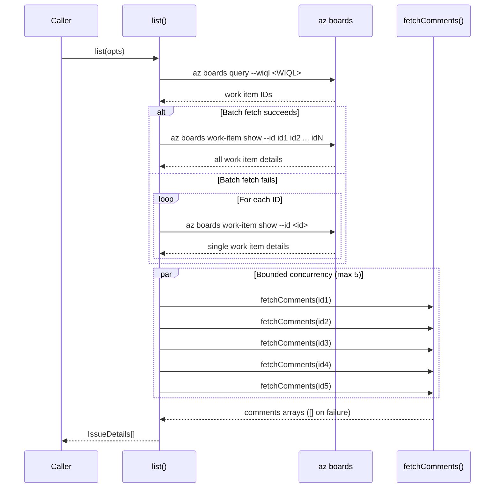
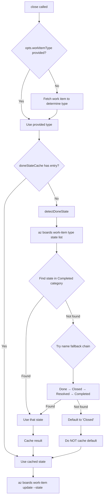
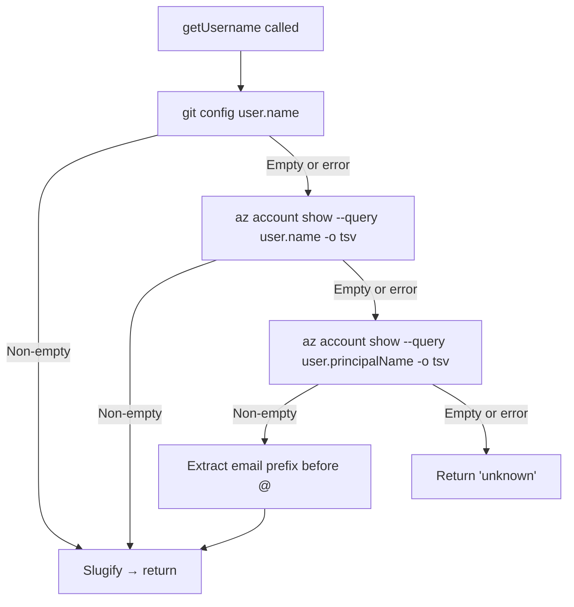
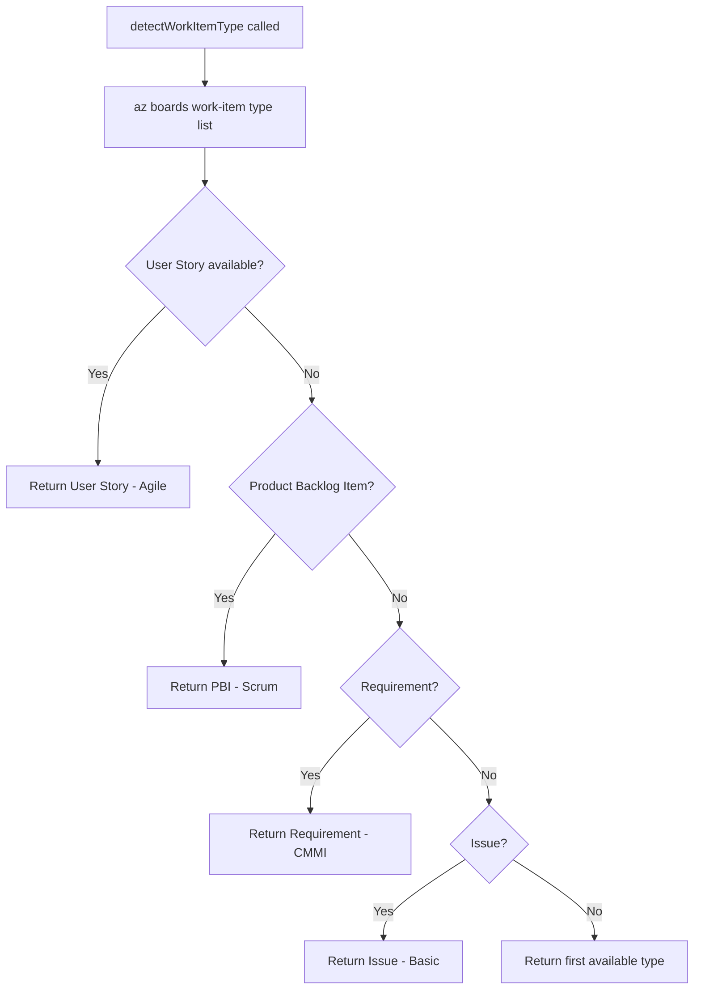

# Azure DevOps Datasource

The Azure DevOps datasource reads and writes work items using the `az` CLI with
the `azure-devops` extension. It is implemented in
`src/datasources/azdevops.ts` and registered under the name `"azdevops"` in
the datasource registry.

## What it does

The Azure DevOps datasource translates the [`Datasource`](./overview.md#the-datasource-interface) interface operations
into `az boards` and `az repos` CLI commands, plus `git` commands for lifecycle
operations. It provides five CRUD operations for work item management, one
identity method (`getUsername`), and seven git lifecycle operations for
branching, committing, pushing, and pull request creation.

### CRUD operations

| Operation | `az` command | JSON output? |
|-----------|-------------|-------------|
| `list()` | `az boards query --wiql <WIQL>` → batch `az boards work-item show --id ...ids` (with individual-fetch fallback) | Yes |
| `fetch()` | `az boards work-item show --id <id>` + comment fetch | Yes |
| `update()` | `az boards work-item update --id <id> --title <t> --description <b>` | No |
| `close()` | Detect done state via `detectDoneState()` → `az boards work-item update --id <id> --state <detected>` | No |
| `create()` | `az boards work-item create --type <detected-or-specified> --title <t> --description <b>` | Yes |

### Git lifecycle operations

| Operation | Command(s) | Purpose |
|-----------|-----------|---------|
| `getDefaultBranch()` | `git symbolic-ref refs/remotes/origin/HEAD`, fallback chain | Detect `main` or `master` |
| `getUsername()` | `git config user.name` → `az account show user.name` → `az account show user.principalName` | Three-tier fallback; falls back to `"unknown"` |
| `buildBranchName()` | _(pure function)_ | Returns `<username>/dispatch/<number>-<slug>` |
| `createAndSwitchBranch()` | `git checkout -b <branch>`, fallback to `git checkout <branch>` | Create or switch to branch |
| `switchBranch()` | `git checkout <branch>` | Switch to existing branch |
| `pushBranch()` | `git push --set-upstream origin <branch>` | Push branch to remote |
| `commitAllChanges()` | `git add -A` + `git diff --cached --stat` + `git commit -m <msg>` | Stage and commit; no-ops if nothing staged |
| `createPullRequest()` | `az repos pr create --title <t> --description <body> --source-branch <branch> --work-items <n>` | Create PR; uses `"Resolves AB#<n>"` as description when `body` param is empty |

All commands are executed via `execFile("az", [...args], { cwd })` with no
shell interpolation. The `--org` and `--project` flags are appended when the
corresponding [`IssueFetchOptions`](../issue-fetching/overview.md) fields are provided.

## Why it shells out to `az`

See the [overview](./overview.md#why-it-exists) for the rationale behind using
CLI tools instead of REST APIs or the `azure-devops-node-api` SDK. The `az`
CLI handles Azure AD/Entra ID authentication, token refresh, and multi-tenant
access. The `azure-devops` extension provides `az boards` commands specifically
for Azure DevOps operations.

## Authentication

### Interactive authentication

```sh
az login
```

This opens a browser for Azure AD/Entra ID authentication. The `az` CLI stores
credentials in `~/.azure/` and manages token refresh automatically.

### Service principal authentication (CI/CD)

```sh
az login --service-principal -u <app-id> -p <password-or-cert> --tenant <tenant-id>
```

For CI/CD pipelines, use a service principal with appropriate Azure DevOps
permissions. The service principal must be added to the Azure DevOps
organization with at least "Basic" access level.

### Personal access token authentication

```sh
export AZURE_DEVOPS_EXT_PAT="your-pat-here"
```

The `azure-devops` extension checks this environment variable for
authentication. The PAT must have "Work Items (Read, write, & manage)" scope.

### Installing the azure-devops extension

The `az boards` commands require the `azure-devops` extension:

```sh
az extension add --name azure-devops
```

Without this extension, all `az boards` commands will fail with an "az boards
is not a recognized command" error.

### Verifying authentication

```sh
az account show
az devops configure --list
```

## Organization and project resolution

Every `az boards` command requires an organization and project context. These
are resolved in order of precedence:

1. **Explicit options:** `opts.org` and `opts.project` from `IssueFetchOptions`,
   which map to the dispatch [`--org` and `--project` CLI flags](../cli-orchestration/cli.md).
2. **az CLI defaults:** Configured via `az devops configure --defaults
   organization=https://dev.azure.com/myorg project=myproject`. If defaults
   are set, the `--org` and `--project` flags can be omitted.
3. **No context:** If neither is provided and no defaults are configured, the
   `az` CLI will return an error asking for organization/project.

The `--org` flag expects a full organization URL (e.g.,
`https://dev.azure.com/myorg`), not just the organization name.

## Operation details

### `list()`

Lists active work items using a WIQL (Work Item Query Language) query, then
batch-fetches full details and comments with bounded concurrency.

**WIQL query construction** (`src/datasources/azdevops.ts:142-165`):

The query is dynamically constructed based on the `IssueFetchOptions` fields:

```sql
SELECT [System.Id] FROM workitems
WHERE [System.State] <> 'Closed'
  AND [System.State] <> 'Done'
  AND [System.State] <> 'Removed'
ORDER BY [System.CreatedDate] DESC
```

Three states are excluded: `Closed`, `Done`, and `Removed`. This covers the
terminal states across all default process templates (Agile uses Closed, Scrum
uses Done, Basic uses Done, CMMI uses Closed).

**Optional iteration and area filtering:** When `opts.iteration` or `opts.area`
are provided, additional `AND` clauses are appended:

- `AND [System.IterationPath] = '<iteration>'` — iteration values are
  single-quoted with embedded quotes escaped.
- `AND [System.AreaPath] UNDER '<area>'` — area paths use `UNDER` to match
  the specified path and all child paths.

**`@CurrentIteration` macro handling:** When the iteration filter equals the
literal string `@CurrentIteration`, the WIQL uses the macro *without* quotes:
`AND [System.IterationPath] = @CurrentIteration`. This is significant because
`@CurrentIteration` is a server-side macro that Azure DevOps evaluates to the
team's current sprint at query execution time. Quoting it (`'@CurrentIteration'`)
would treat it as a literal string value and match nothing. The macro depends on
team context — ensure the authenticated user's team settings have the current
iteration configured, or the macro returns no results. For more details, see
[Azure DevOps query macros](https://learn.microsoft.com/en-us/azure/devops/boards/queries/query-by-date-or-current-iteration).

**Batch fetch pattern:** The WIQL query returns only work item IDs. The
`list()` method then batch-fetches full details in a single call:

1. `az boards work-item show --id <id1> <id2> ... <idN>` — fetches all work
   items in one CLI invocation.
2. **Fallback:** If the batch call fails (any error), the method falls back to
   individual `az boards work-item show --id <id>` calls for each work item,
   continuing on individual failures.
3. **Comment fetch with bounded concurrency:** After work item details are
   retrieved, comments are fetched for each item using `fetchComments()` with a
   concurrency limit of 5 (`CONCURRENCY = 5` at `src/datasources/azdevops.ts:19`).
   This prevents overwhelming the Azure DevOps API when listing many work items.



**Why WIQL instead of `az boards work-item list`:** The `az boards` extension
does not provide a direct "list all work items" command. WIQL is the Azure
DevOps query language that provides SQL-like filtering and ordering. Key WIQL
characteristics:

- Maximum query length: 32,000 characters.
- Returns work item IDs only (not full details) — a separate fetch is needed.
- Supports operators like `=`, `<>`, `>`, `<`, `IN`, `UNDER`, `Contains`,
  `Was Ever`, and logical grouping with `AND`/`OR` and parentheses.
- Supports macros: `@Me`, `@Today`, `@CurrentIteration`, `@Project`,
  `@StartOfDay`, `@StartOfWeek`, `@StartOfMonth`, `@StartOfYear`.
- Does **not** support pagination natively — all matching IDs are returned. For
  very large projects, this could return thousands of IDs.
- Does **not** support `LIMIT` or `TOP` clauses in all contexts.

For the full WIQL syntax, see
[WIQL syntax reference](https://learn.microsoft.com/en-us/azure/devops/boards/queries/wiql-syntax).

### `fetch()`

Fetches a single work item by ID, including comments.

**Field mapping:**

| Azure DevOps field | `IssueDetails` field | Transformation |
|-------------------|---------------------|----------------|
| `id` | `number` | Converted to string via `String()` |
| `fields["System.Title"]` | `title` | Falls back to `""` |
| `fields["System.Description"]` | `body` | Falls back to `""` (may contain HTML) |
| `fields["System.Tags"]` | `labels` | Split on `;`, trimmed, empty strings removed |
| `fields["System.State"]` | `state` | Falls back to `""` |
| `_links.html.href` or `url` | `url` | Prefers the HTML link; falls back to API URL |
| `fields["System.IterationPath"]` | `iterationPath` | Falls back to `""` |
| `fields["System.AreaPath"]` | `areaPath` | Falls back to `""` |
| `fields["System.AssignedTo"].displayName` | `assignee` | Falls back to `""` |
| `fields["Microsoft.VSTS.Common.Priority"]` | `priority` | Falls back to `undefined` |
| `fields["Microsoft.VSTS.Scheduling.StoryPoints"]` or `Effort` or `Size` | `storyPoints` | Three-field fallback chain (see below) |
| `fields["System.WorkItemType"]` | `workItemType` | Falls back to `""` |
| _(separate call)_ | `comments` | See below |
| `fields["Microsoft.VSTS.Common.AcceptanceCriteria"]` | `acceptanceCriteria` | Falls back to `""` |

**Story points fallback chain:** Different process templates use different
field names for effort estimation:

| Process template | Field name | Reference name |
|-----------------|-----------|---------------|
| Agile | Story Points | `Microsoft.VSTS.Scheduling.StoryPoints` |
| Scrum | Effort | `Microsoft.VSTS.Scheduling.Effort` |
| CMMI | Size | `Microsoft.VSTS.Scheduling.Size` |

The `mapWorkItemToIssueDetails()` function tries each field in order, returning
the first non-null value. This means any process template's effort field is
captured without requiring template-specific configuration.

**Note on the `body` field:** Azure DevOps stores descriptions as HTML, not
markdown. The `body` field in `IssueDetails` may contain HTML tags. Consumers
should be aware of this when processing the body content.

**Note on `acceptanceCriteria`:** This is the only datasource that populates
the `acceptanceCriteria` field. The GitHub and markdown datasources always
return `""` for this field.

**Comments:** Comments are fetched via a separate `fetchComments()` helper
function (`src/datasources/azdevops.ts:555`) that calls `az boards work-item
relation list-comment --work-item-id <id>`. Comments are formatted as
`**<displayName>:** <text>` strings, using the `createdBy.displayName` field
for the author name (falling back to `"unknown"`).

**Comment fetching is non-fatal:** The `fetchComments()` function wraps the
entire comment fetch -- including the `execFile` call and `JSON.parse` -- in a
`try/catch` block. If comments cannot be
retrieved for any reason (permission denied, extension not installed, API error,
malformed JSON response), the function silently returns an empty array. This
means the work item itself will still be returned successfully, just without
comments.

**Consequence of silent failure:** There is no way to distinguish "the work
item has no comments" from "comment fetching failed" in the returned
`IssueDetails`. Both cases produce `comments: []`. If you suspect comments are
missing, check the Azure DevOps web UI to verify whether comments exist and
ensure the authenticated user has read access to comments.

### `update()`

Updates the title and description of a work item using `az boards work-item
update`. Both `--title` and `--description` are always sent.

### `close()`

Closes a work item by detecting its process-template-specific terminal state
and applying that state via `az boards work-item update`.

**This is the most complex operation in the datasource** because different
Azure DevOps process templates define different terminal states, and the correct
state must be detected at runtime.

**Close flow:**



**`detectDoneState()` details** (`src/datasources/azdevops.ts:84-132`):

This exported function queries the process template's state definitions for
the given work item type and selects the appropriate terminal state:

1. Calls `az boards work-item type state list --work-item-type <type>` to get
   all available states with their categories.
2. **Category-based selection (preferred):** Looks for any state whose
   `stateCategory` is `"Completed"`. This is the most reliable method because
   Azure DevOps assigns categories to states regardless of their display name.
3. **Name-based fallback chain:** If no state has the Completed category
   (possible with custom processes), tries these state names in order:
   `Done` → `Closed` → `Resolved` → `Completed`.
4. **Ultimate default:** If no match is found (e.g., the API call failed or
   returned unexpected data), returns `"Closed"`.

**Caching behavior** (`doneStateCache` at `src/datasources/azdevops.ts:19`):

- The `doneStateCache` is a module-level `Map<string, string>` keyed by
  `org|project|workItemType`.
- Successfully detected states (from API queries) are cached for the process
  lifetime, avoiding repeated API calls for the same type.
- The **default "Closed" is intentionally NOT cached** — this ensures transient
  errors (network timeouts, permission issues) don't permanently poison the
  cache. The next `close()` call will retry the API query.

**Process template terminal states:**

| Process template | Primary work item type | Terminal state | State category |
|-----------------|----------------------|---------------|----------------|
| Agile | User Story | Closed | Completed |
| Scrum | Product Backlog Item | Done | Completed |
| CMMI | Requirement | Closed | Completed |
| Basic | Issue | Done | Completed |

### `create()`

Creates a new work item and returns the created `IssueDetails`.

**Work item type resolution:** The `create()` method determines the work item
type using a two-step resolution:

1. **Explicit option:** If `opts.workItemType` is provided (via the
   `IssueFetchOptions.workItemType` field, mapped from the dispatch config or
   CLI), that type is used directly.
2. **Auto-detection:** If no explicit type is provided, `create()` calls the
   exported `detectWorkItemType()` function (`src/datasources/azdevops.ts:58-82`),
   which queries the Azure DevOps project for available work item types using
   `az boards work-item type list`. It then selects from a priority list:

   | Priority | Work item type | Process template |
   |----------|---------------|-----------------|
   | 1st | User Story | Agile |
   | 2nd | Product Backlog Item | Scrum |
   | 3rd | Requirement | CMMI |
   | 4th | Issue | Basic |

   If none of the preferred types are available, it falls back to the first
   type returned by the API. If no types are available at all (or the API call
   fails), `detectWorkItemType()` returns `null`.

3. **Error on failure:** If neither the explicit option nor auto-detection
   yields a type, `create()` throws an error:
   `"Could not determine work item type. Set workItemType in your config."`

This replaces the previous behavior of hardcoding `"User Story"`, making
`create()` work across all Azure DevOps process templates without manual
configuration.

**Return value:** Unlike GitHub's `create()`, the Azure DevOps `create()`
fetches the response JSON and extracts fields from the created work item,
providing accurate field values in the returned `IssueDetails`.

## Git lifecycle operation details

The Azure DevOps datasource implements all seven git lifecycle methods. The
branching, committing, and pushing operations use `git` directly (identical to
the GitHub implementation). Pull request creation uses `az repos pr create`.

### `getDefaultBranch()`

Uses the same detection strategy as the GitHub datasource:

1. `git symbolic-ref refs/remotes/origin/HEAD` -- extract branch from remote
   HEAD reference.
2. Fallback: `git rev-parse --verify main` -- check if `main` exists.
3. Final fallback: returns `"master"`.

### `getUsername()`

Resolves the current developer's identity for branch namespacing via a
three-tier fallback chain (`src/datasources/azdevops.ts:410-438`):



1. **Tier 1 — git config:** `git config user.name`, slugified. This is the
   same first step used by the GitHub datasource.
2. **Tier 2 — Azure account display name:** `az account show --query user.name -o tsv`,
   slugified. This provides the Azure AD/Entra ID display name of the
   authenticated user.
3. **Tier 3 — Azure principal name:** `az account show --query user.principalName -o tsv`.
   The principal name is typically a UPN (User Principal Name) in email format
   (e.g., `jane.doe@contoso.com`). The method extracts the portion before `@`
   and slugifies it (e.g., `jane-doe`).
4. **Final fallback:** If all three tiers fail or return empty, returns
   `"unknown"`.

**Note:** Unlike the GitHub datasource which only uses `git config`, this
three-tier chain ensures branch names can be personalized even when git is
configured with a generic or empty user name, as long as Azure CLI
authentication is working.

### `buildBranchName()`

Same convention as all datasources: `<username>/dispatch/<number>-<slug>`. See the
[branch naming convention](./overview.md#branch-naming-convention) in the
overview.

### `createAndSwitchBranch()`

Attempts `git checkout -b <branchName>`. If the branch already exists, falls
back to `git checkout <branchName>`. Identical behavior to the GitHub
implementation.

### `switchBranch()`

Runs `git checkout <branchName>`.

### `pushBranch()`

Runs `git push --set-upstream origin <branchName>`.

### `commitAllChanges()`

Three-step process identical to the GitHub implementation:

1. `git add -A` -- stage all changes.
2. `git diff --cached --stat` -- check if anything is staged.
3. If non-empty, `git commit -m <message>`. Otherwise, no-op.

### `createPullRequest()`

Creates a pull request using `az repos pr create`
(`src/datasources/azdevops.ts:490`) with:

- `--title <title>` -- PR title.
- `--description <body>` -- PR description. When the caller provides a
  non-empty `body` parameter, it is used as-is. When `body` is empty or falsy,
  it defaults to `"Resolves AB#<issueNumber>"`, which is the Azure Boards
  integration prefix that triggers automatic work item resolution when the PR
  is completed.
- `--source-branch <branchName>` -- the feature branch.
- `--work-items <issueNumber>` -- creates a formal link between the PR and the
  work item in Azure DevOps, independent of the description keyword. This
  link appears in the work item's "Development" section.
- `--output json` -- the response is parsed to extract the PR URL.

**Existing PR handling:** If `az repos pr create` fails with "already exists",
the method falls back to
`az repos pr list --source-branch <branch> --status active --output json` to
find and return the first active PR's URL. If no active PR is found, returns
`""`.

## Rate limits

Azure DevOps REST API (which the `az` CLI uses internally) has the following
rate limits:

- **Authenticated requests:** Varies by organization plan. Typically 200
  requests per minute for personal access tokens.
- **Global limit:** 600 requests per minute per IP address.

The `list()` method mitigates rate-limit pressure through two strategies:

1. **Batch fetching:** Work item details are fetched in a single
   `az boards work-item show --id <id1> <id2> ...` call rather than N
   individual calls. This reduces the API call count from N+1 to 2 (one WIQL
   query + one batch fetch).
2. **Bounded concurrency for comments:** Comment fetching is limited to 5
   concurrent requests (`CONCURRENCY = 5`), preventing burst traffic that could
   trigger rate limiting.

If the batch fetch fails (e.g., due to a single malformed work item), the
fallback to individual fetches restores the N+1 pattern. In this degraded
mode, a project with 100 active work items would make ~201 API calls (1 WIQL +
100 individual fetches + up to 100 comment fetches, throttled at 5 concurrent).

The datasource does not implement rate-limit awareness, backoff, or retry
logic. If you hit rate limits, consider narrowing the query scope using the
`--iteration` or `--area` dispatch flags.

## Error handling

| Failure mode | Error type | Example |
|-------------|-----------|---------|
| `az` not installed | `ENOENT` from `execFile` | `Error: spawn az ENOENT` |
| `azure-devops` extension missing | Non-zero exit code | `az boards is not a recognized command` |
| Not authenticated | Non-zero exit code | `Please run 'az login'` |
| Missing org/project | Non-zero exit code | `--organization is required` |
| Work item not found | Non-zero exit code | `TF401232: Work item does not exist` |
| Invalid state transition | Non-zero exit code | `The field 'System.State' contains value 'Closed' that is not in the list of supported values` |
| Malformed JSON output | `Error` with truncated context | `Failed to parse Azure CLI output: <first 200 chars>` |

The `JSON.parse(stdout)` calls in `list()`, `fetch()`, `create()`, and
`createPullRequest()` are wrapped in `try/catch` blocks.
If the `az` CLI produces non-JSON output, the catch block throws a descriptive
`Error` that includes the first 200 characters of the unexpected output for
debugging context.

Comment fetch failures are the one exception -- they are caught silently (see
[comments behavior](#fetch) above).

There is no subprocess timeout on any `az` command.

## Troubleshooting

### "spawn az ENOENT"

The `az` CLI is not installed or not on PATH. Install it from
<https://learn.microsoft.com/en-us/cli/azure/install-azure-cli>.

### "az boards is not a recognized command"

The `azure-devops` extension is not installed. Run:
```sh
az extension add --name azure-devops
```

### "Please run 'az login' to setup account"

Run `az login` to authenticate. In CI, use a service principal or set
`AZURE_DEVOPS_EXT_PAT`.

### "--organization is required"

Either pass `--org` to dispatch, or configure `az` CLI defaults:
```sh
az devops configure --defaults organization=https://dev.azure.com/myorg project=myproject
```

### `list()` is slow

The `list()` method uses batch fetching, but for very large projects the WIQL
query itself and comment fetching can still be slow. Consider:
- Narrowing results with `--iteration` (e.g., `@CurrentIteration`) or `--area`
  flags to limit the query scope.
- Using [`--source md`](./markdown-datasource.md) with local markdown files for faster iteration.
- If the batch fetch is falling back to individual fetches (visible in debug
  logs), investigate why the batch call fails — this is the primary performance
  degradation path.

### Work item type error on `create()`

The `create()` method auto-detects the work item type by querying available
types from the Azure DevOps project and selecting from a priority list (User
Story, Product Backlog Item, Requirement, Issue). If auto-detection fails
(e.g., due to permissions or network issues), `create()` throws an error. To
resolve this, set `workItemType` explicitly in your dispatch config:

```sh
dispatch config --workItemType "Product Backlog Item"
```

Alternatively, ensure the authenticated user has permission to list work item
types in the project (`az boards work-item type list`).

### visualstudio.com vs dev.azure.com

Auto-detection matches both `dev.azure.com` and `visualstudio.com` patterns
for Azure DevOps. The `visualstudio.com` pattern exists for backward
compatibility -- Azure DevOps was formerly Visual Studio Team Services (VSTS),
and many organizations still use `{org}.visualstudio.com` URLs. Microsoft
migrated to `dev.azure.com/{org}` URLs in September 2018, but both formats
remain functional.

### State transition error on `close()`

If you see `The field 'System.State' contains value '...' that is not in the
list of supported values`, this means `detectDoneState()` returned a state
name that doesn't exist in the target work item type's workflow. This can
happen with heavily customized process templates. As a workaround, check the
available states via `az boards work-item type state list --work-item-type <type>`
and verify that the expected terminal state exists.

### Troubleshooting authentication failures

Common `az` CLI authentication issues:

- **Expired tokens:** Run `az login` again. Token refresh happens automatically
  for interactive sessions, but PATs expire on their configured schedule.
- **Wrong tenant:** Use `az login --tenant <tenant-id>` to target a specific
  Azure AD/Entra ID tenant if you have access to multiple tenants.
- **Service principal failures:** Ensure the certificate or secret hasn't
  expired. Use `az login --service-principal -u <app-id> --tenant <tenant-id>`
  to re-authenticate.
- **CLI version mismatch:** Update the CLI with `az upgrade`. The `azure-devops`
  extension requires a compatible `az` CLI version (2.30+). Check with
  `az version`.

## Design decisions

### Why the `az` CLI instead of the REST API or Node.js SDK

The Azure DevOps datasource delegates all API interactions to the `az` CLI
rather than calling the REST API directly or using the
`azure-devops-node-api` npm package. This design choice aligns with the
project-wide pattern of using CLI subprocess calls (the GitHub datasource
similarly uses the `gh` CLI). The advantages are:

- **Authentication is delegated entirely** to the `az` CLI, which handles
  token management, refresh, service principals, managed identities, and PATs.
  The datasource code doesn't need to implement any authentication logic.
- **No additional npm dependencies** — the `az` CLI is an external prerequisite
  rather than a bundled dependency, keeping the project's dependency tree small.
- **Consistent subprocess pattern** — all datasources use `execFile` for
  external commands, making the codebase uniform and testable via the same
  mock infrastructure.

The tradeoff is that the `az` CLI must be installed and authenticated before
dispatch can operate, and subprocess invocation adds latency compared to
direct HTTP calls.

### Process template support

The datasource supports all four default Azure DevOps process templates
without requiring manual configuration:



| Process template | Primary work item type | Story points field | Terminal states |
|-----------------|----------------------|-------------------|----------------|
| Agile | User Story | `StoryPoints` | Resolved, Closed, Removed |
| Scrum | Product Backlog Item | `Effort` | Approved, Committed, Done, Removed |
| CMMI | Requirement | `Size` | Proposed, Active, Resolved, Closed |
| Basic | Issue | _(none)_ | To Do, Doing, Done |

Both `detectWorkItemType()` and `detectDoneState()` are exported from the
module, allowing direct use in tests or custom integrations.

### `AB#` linking and work item traceability

When `createPullRequest()` creates a PR, it establishes two separate links
between the PR and the work item:

1. **Description-based `AB#` linking:** The default PR description includes
   `Resolves AB#<issueNumber>`. When the PR is merged into the default branch,
   Azure DevOps automatically transitions the referenced work item to the
   `Resolved` or `Completed` state category. The `AB#` syntax works in PR
   descriptions (not titles or comments).

2. **Formal `--work-items` link:** The `--work-items <issueNumber>` flag
   creates a structured link in the Azure DevOps "Development" section of the
   work item. This link is visible in the work item form and provides
   bidirectional traceability.

Together, these two mechanisms provide both automatic state transition (via
`AB#`) and navigable traceability (via the formal link). For details on `AB#`
syntax and state transitions, see
[Azure DevOps AB# linking](https://learn.microsoft.com/en-us/azure/devops/boards/github/link-to-from-github).

### Branch name validation

All methods that accept branch names (`getDefaultBranch`, `createAndSwitchBranch`,
`switchBranch`) validate inputs using [`isValidBranchName()`](../git-and-worktree/branch-validation.md) from
`src/helpers/branch-validation.ts`. Invalid branch names throw
[`InvalidBranchNameError`](../git-and-worktree/branch-validation.md#the-invalidbranchnameerror-class). The validation rejects:

- Names containing spaces, shell metacharacters (`$`, backticks), or `@{`
  reflog syntax.
- Names containing `..` (path traversal) or ending with `.lock`.
- Empty names or names exceeding 255 characters.

The `buildBranchName()` method sanitizes the work item title by replacing
special characters (brackets, colons, dots, `@{`) with hyphens, ensuring the
generated branch name always passes validation.

### Concurrency and the `doneStateCache`

The `doneStateCache` is a module-level `Map<string, string>` — a simple
in-memory cache with no TTL, eviction, or concurrency controls. Key behaviors:

- **Safe for typical usage:** Dispatch operations are sequential per work item,
  so concurrent cache access is unlikely. Node.js's single-threaded event loop
  also prevents true race conditions on the Map itself.
- **Long-lived processes:** The cache persists for the entire process lifetime.
  If a process template's states are modified while dispatch is running, the
  cached state may become stale. Restarting dispatch resolves this.
- **Intentional non-caching of defaults:** When `detectDoneState()` falls back
  to the default `"Closed"` (because the API call failed), the result is NOT
  cached. This ensures that a transient error (network timeout, 503 response)
  doesn't permanently lock a work item type to the wrong terminal state.

### Azure identity types

The `getUsername()` fallback to `az account show` supports multiple identity
types:

| Identity type | `user.name` | `user.principalName` |
|--------------|-------------|---------------------|
| Personal (interactive login) | Display name (e.g., "Jane Doe") | UPN email (e.g., `jane.doe@contoso.com`) |
| Service principal | App registration name | App ID GUID |
| Managed identity | Managed identity name | Object ID GUID |

For service principals and managed identities, the `principalName` is not an
email, so the `@`-split extraction may produce a GUID prefix. In practice,
service principals are used in CI/CD where branch personalization is less
important.

### Required permissions

The authenticated user needs the following Azure DevOps permissions:

| Operation | Required permission |
|-----------|-------------------|
| `list()`, `fetch()` | **Work Items (Read)** — view work items and run WIQL queries |
| `create()`, `update()`, `close()` | **Work Items (Read, Write, & Manage)** — create and modify work items |
| `detectWorkItemType()` | **Project (Read)** — list work item types |
| `detectDoneState()` | **Project (Read)** — list work item type states |
| `createPullRequest()` | **Code (Read, Write)** — create and list pull requests |
| `fetchComments()` | **Work Items (Read)** — read work item comments |
| `getUsername()` | **Azure subscription (Reader)** — `az account show` |

For PAT authentication, the token must have the `vso.work_write` scope for
full CRUD operations.

## Related documentation

- [Datasource Overview](./overview.md) -- Interface definitions, registry,
  and auto-detection
- [GitHub Datasource](./github-datasource.md) -- The GitHub counterpart
- [Markdown Datasource](./markdown-datasource.md) -- Offline alternative
- [Datasource Helpers](./datasource-helpers.md) -- Orchestration bridge that
  consumes datasource operations for temp file writing and auto-close
- [Integrations & Troubleshooting](./integrations.md) -- Cross-cutting
  subprocess and error-handling concerns
- [Issue Fetching Overview](../issue-fetching/overview.md) -- Deprecated
  fetching layer that delegates to this datasource
- [Azure DevOps Fetcher (Deprecated)](../issue-fetching/azdevops-fetcher.md) --
  Legacy shim that delegates to this datasource
- [Spec Generation](../spec-generation/overview.md) -- Pipeline that consumes
  datasource output for spec file generation
- [Slugify Utility](../shared-utilities/slugify.md) -- Used by `buildBranchName()` for slug generation
- [Prerequisites](../prereqs-and-safety/prereqs.md) -- Prereq validation
  checks for `az` CLI dependency availability
- [Branch Name Validation](../git-and-worktree/branch-validation.md) --
  Validation rules enforced on all branch names used by this datasource
- [Planning & Dispatch Pipeline](../planning-and-dispatch/overview.md) --
  Pipeline that consumes datasource operations for task execution
- [Dispatcher](../planning-and-dispatch/dispatcher.md) -- Task dispatch that
  uses provider sessions created after datasource setup
- [Run State Persistence](../git-and-worktree/run-state.md) -- Task state
  tracking that complements the datasource lifecycle
