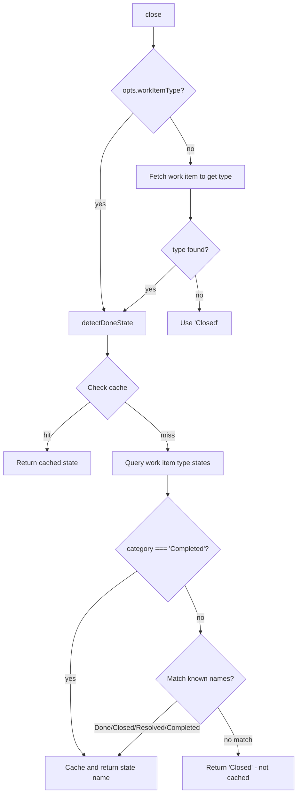

# Azure DevOps Datasource

## What it does

The Azure DevOps datasource (`src/datasources/azdevops.ts`) provides read/write
access to Azure DevOps Work Items using the `azure-devops-node-api` SDK with
`@azure/identity` `DeviceCodeCredential` for authentication. It implements all
15 methods of the `Datasource` interface.

**Source:** `src/datasources/azdevops.ts` (536 lines)

**Related docs:**

- [Overview](./overview.md) -- interface contract and shared behaviors
- [GitHub datasource](./github-datasource.md)
- [Markdown datasource](./markdown-datasource.md)
- [Integrations](./integrations.md) -- authentication details
- [Testing](./testing.md) -- test patterns for this datasource

## Why it exists

Azure DevOps is widely used in enterprise environments. The
`azure-devops-node-api` SDK provides typed access to WIQL queries, work item
tracking, and Git APIs without requiring the `az` CLI. The `@azure/identity`
device-code credential enables headless authentication restricted to work/school
(Entra ID) accounts, which is a requirement of Azure DevOps.

## How it works

### Authentication

Authentication is managed by `getAzureConnection(orgUrl)` in
`src/helpers/auth.ts`. The flow uses `DeviceCodeCredential` from
`@azure/identity`:

1. Dispatch creates a `DeviceCodeCredential` with `AZURE_CLIENT_ID`
   (`150a3098-01dd-4126-8b10-5e7f77492e5c`), `AZURE_TENANT_ID`
   (`"organizations"`), and the scope `AZURE_DEVOPS_SCOPE`
   (`499b84ac-1321-427f-aa17-267ca6975798/.default`) from `src/constants.ts`.
2. The user is shown a device code and verification URL; the browser opens
   automatically. A note is prepended: "Azure DevOps requires a work or school
   account (personal Microsoft accounts are not supported)."
3. The token is cached at `~/.dispatch/auth.json` with an `expiresAt` timestamp.
4. Subsequent calls check the cached token's expiry with a 5-minute buffer
   (`EXPIRY_BUFFER_MS = 5 * 60 * 1000`). If valid, a `WebApi` connection is
   returned immediately; otherwise, the device-code flow is re-triggered.

### Org/project resolution

The `getOrgAndProject(opts)` function resolves the Azure DevOps organization URL
and project name:

1. If `opts.org` and `opts.project` are provided, they are used directly.
2. Otherwise, reads the `origin` remote URL via `getGitRemoteUrl(cwd)`.
3. Passes the URL to `parseAzDevOpsRemoteUrl()` (in `src/datasources/index.ts`).
4. Returns the org URL, project, and an authenticated `WebApi` connection.

`parseAzDevOpsRemoteUrl()` supports three URL formats:

- **HTTPS:** `https://[user@]dev.azure.com/{org}/{project}/_git/{repo}`
- **SSH:** `git@ssh.dev.azure.com:v3/{org}/{project}/{repo}`
- **Legacy:** `https://{org}.visualstudio.com/[DefaultCollection/]{project}/_git/{repo}`

All formats normalize the org URL to `https://dev.azure.com/{org}` and decode
URL-encoded segments.

### CRUD operations

#### `list(opts?)`

Queries open work items via WIQL using the SDK's `getWorkItemTrackingApi()`:

```
SELECT [System.Id] FROM workitems
WHERE [System.State] <> 'Closed'
  AND [System.State] <> 'Done'
  AND [System.State] <> 'Removed'
ORDER BY [System.CreatedDate] DESC
```

**Iteration filtering:** If `opts.iteration` is set:

- `@CurrentIteration` is used as-is (without quotes) with the `UNDER` operator.
- Other values are single-quote-escaped and used with `UNDER`.

**Area filtering:** If `opts.area` is set, the value is single-quote-escaped
and used with `UNDER`.

After the WIQL query returns work item IDs, the datasource fetches full work
item details in a batch via `witApi.getWorkItems(ids)`. Comments are fetched
with bounded concurrency (batches of 5 via `Promise.all`).

**Fallback behavior:** If the batch `getWorkItems()` call fails, the datasource
falls back to fetching each work item individually via `datasource.fetch()`.

#### `fetch(issueId, opts?)`

Fetches a single work item by ID via `witApi.getWorkItem(Number(issueId))` and
its comments via `fetchComments()`. Maps the result through
`mapWorkItemToIssueDetails()`.

#### `create(title, body, opts?)`

Creates a work item via `witApi.createWorkItem()`. The work item type is
resolved from `opts.workItemType` or auto-detected by `detectWorkItemType()`.

**`detectWorkItemType(opts)`** (exported): Queries all work item types in the
project and returns the first match from a preference list:

1. User Story
2. Product Backlog Item
3. Requirement
4. Issue

Falls back to the first available type. Returns `null` if no types are found.

The SDK's `createWorkItem` requires a `customHeaders` parameter; `null as any`
is passed as the documented way to omit it.

#### `update(issueId, title, body, opts?)`

Updates the work item's `System.Title` and `System.Description` fields via
`witApi.updateWorkItem()` with a JSON Patch document. Uses `null as any` for
the SDK's `customHeaders` parameter.

#### `close(issueId, opts?)`

Closes a work item by setting `System.State` to the dynamically detected
terminal state:



**`detectDoneState(workItemType, opts)`** (exported):

1. Checks the `doneStateCache` (module-level `Map` keyed by
   `{orgUrl}|{project}|{workItemType}`).
2. Queries `witApi.getWorkItemTypeStates()` for the project and type.
3. Looks for a state with `category === "Completed"`.
4. Falls back to known state names in order: Done, Closed, Resolved, Completed.
5. Caches successful results. The default `"Closed"` fallback is intentionally
   NOT cached to allow retry after transient errors.

### Git lifecycle

#### `supportsGit()`

Returns `true`.

#### `getUsername(opts)`

Checks `opts.username` first. Falls back to `deriveShortUsername(opts.cwd, "unknown")`
from `src/datasources/index.ts`. Unlike the old documentation, there is no
`az account show` tier -- only git config user.name and email.

#### `getDefaultBranch(opts)` / `getCurrentBranch(opts)`

Shared behavior described in the [overview](./overview.md#default-branch-detection).

#### `buildBranchName(issueNumber, title, username)`

Produces `{username}/dispatch/issue-{issueNumber}`. The `title` parameter is
unused (named `_title`). **Validates the result** with `isValidBranchName()`
and throws `InvalidBranchNameError` if invalid -- this is unique to the Azure
DevOps datasource.

#### `createAndSwitchBranch(branchName, opts)`

**Pre-validates** the branch name with `isValidBranchName()` before any git
operations (throws `InvalidBranchNameError` on failure). Then proceeds with the
shared worktree recovery logic. See
[overview](./overview.md#worktree-conflict-recovery).

#### `switchBranch(branchName, opts)`

Runs `git checkout {branchName}`.

#### `pushBranch(branchName, opts)`

Runs `git push --set-upstream origin {branchName}`.

#### `commitAllChanges(message, opts)`

Shared staging behavior. See [overview](./overview.md#commit-staging).

### Pull request creation

`createPullRequest()` creates a PR via the Git API SDK:

1. Resolves the remote URL and finds the matching repository by normalizing
   URLs (stripping userinfo, `.git` suffix, trailing slash) and comparing
   against `remoteUrl`, `sshUrl`, and `webUrl` of all project repositories.
2. Calls `gitApi.createPullRequest()` with:
   - `sourceRefName: refs/heads/{branchName}`
   - `targetRefName: refs/heads/{target}`
   - `workItemRefs: [{ id: issueNumber }]`
   - Default body: `Resolves AB#{issueNumber}`
3. Constructs the web UI URL as `{repo.webUrl}/pullrequest/{pr.pullRequestId}`
   (the SDK's `pr.url` is a REST API URL, not a browser URL).

**Duplicate PR handling:** If the creation error message includes "already
exists", queries for active PRs matching the source branch via
`gitApi.getPullRequests()` with `PullRequestStatus.Active`. Returns the existing
PR's web URL if found, or an empty string.

### Work item field mapping

The `mapWorkItemToIssueDetails()` helper maps Azure DevOps work item fields to
`IssueDetails`:

| IssueDetails field | Azure DevOps field |
|--------------------|--------------------|
| `number` | `item.id` |
| `title` | `System.Title` |
| `body` | `System.Description` |
| `labels` | `System.Tags` (semicolon-split) |
| `state` | `System.State` |
| `url` | `item._links.html.href` or `item.url` |
| `acceptanceCriteria` | `Microsoft.VSTS.Common.AcceptanceCriteria` |
| `iterationPath` | `System.IterationPath` |
| `areaPath` | `System.AreaPath` |
| `assignee` | `System.AssignedTo.displayName` |
| `priority` | `Microsoft.VSTS.Common.Priority` |
| `storyPoints` | `Scheduling.StoryPoints` / `Effort` / `Size` |
| `workItemType` | `System.WorkItemType` |

### Error handling

| Scenario | Behavior |
|----------|----------|
| No git remote | Throws with "Could not determine git remote URL" |
| Unparseable remote URL | Throws with redacted URL |
| No work item types found | `detectWorkItemType()` returns `null`; `create()` throws |
| Batch fetch fails | Falls back to individual `fetch()` calls |
| Invalid branch name | Throws `InvalidBranchNameError` (pre-validation) |
| Duplicate PR | Returns existing PR URL or empty string |
| Auth expired | Re-triggers device-code flow (5-min buffer) |

### Credential redaction

Same `redactUrl()` pattern as the GitHub datasource -- strips userinfo from
URLs before including in error messages.

## Related Documentation

- [Datasource System Overview](./overview.md) — interface contract and shared behaviors
- [GitHub Datasource](./github-datasource.md) — sibling cloud datasource implementation
- [Markdown Datasource](./markdown-datasource.md) — local-first datasource alternative
- [Datasource Integrations](./integrations.md) — authentication and git lifecycle details
- [Datasource Helpers](./datasource-helpers.md) — shared git and PR utilities used by all datasources
- [Datasource Testing](./testing.md) — test patterns and fixtures for datasources
- [Branch Validation](../git-and-worktree/branch-validation.md) — `isValidBranchName()` and `InvalidBranchNameError` used by this datasource
- [Git & Worktree Overview](../git-and-worktree/overview.md) — worktree conflict recovery referenced in `createAndSwitchBranch`
- [Task Parsing Overview](../task-parsing/overview.md) — how parsed tasks feed into the dispatch pipeline after issue fetching
- [Commit and PR Generation](../dispatch-pipeline/commit-and-pr-generation.md) — how commits and PRs are built from datasource operations
- [Authentication and Security](../provider-implementations/authentication-and-security.md) — credential patterns across providers and datasources
- [Azure DevOps Fetcher](../issue-fetching/azdevops-fetcher.md) — issue fetching layer for Azure DevOps work items
- [Datasource Tests](../testing/datasource-tests.md) — test suite covering datasource behaviors
