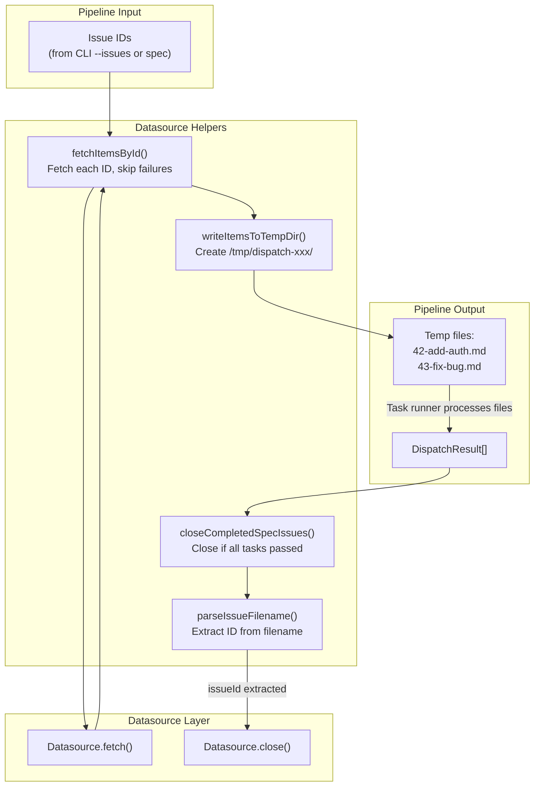

# Datasource Helpers

The datasource helpers module (`src/orchestrator/datasource-helpers.ts`) is
the orchestration bridge between the dispatch pipeline and the datasource
layer. It provides utility functions for writing fetched issues to temporary
files, extracting issue IDs from filenames, and auto-closing issues when all
tasks complete.

## What it does

The module exports nine functions and one interface:

| Export | Type | Purpose |
|--------|------|---------|
| `parseIssueFilename(filePath)` | Function | Extract issue ID and slug from a `<id>-<slug>.md` filename |
| `fetchItemsById(issueIds, datasource, fetchOpts)` | Function | Fetch multiple issues by ID, skipping failures |
| `writeItemsToTempDir(items)` | Function | Write `IssueDetails` items to a temp directory as `<id>-<slug>.md` files |
| `closeCompletedSpecIssues(taskFiles, results, cwd, source?, org?, project?)` | Function | Auto-close issues on the tracker when all tasks for a spec complete |
| `getBranchDiff(defaultBranch, cwd)` | Function | Run `git diff` against the default branch and return the output |
| `amendCommitMessage(message, cwd)` | Function | Rewrite the most recent commit message via `git commit --amend` |
| `squashBranchCommits(defaultBranch, message, cwd)` | Function | Squash all branch commits into one via soft-reset strategy |
| `buildPrBody(details, tasks, results, defaultBranch, datasourceName, cwd)` | Function | Assemble a markdown PR body with summary, tasks, labels, and issue-close reference |
| `buildPrTitle(issueTitle, defaultBranch, cwd)` | Function | Generate a PR title from branch commit messages |
| `WriteItemsResult` | Interface | Return type of `writeItemsToTempDir()` |

## Why it exists

The dispatch pipeline needs to:

1. Fetch issues from the tracker and write them to temporary files that the
   task runner can process.
2. Map completed task files back to their originating issue IDs.
3. Auto-close issues on the tracker when all tasks succeed.

These operations sit between the [orchestrator](../cli-orchestration/orchestrator.md) (which manages pipeline flow) and
the datasource (which handles platform-specific API calls). Rather than
coupling the orchestrator directly to datasource internals, this module
provides clean bridge functions.

## Dependencies

| Import | Source | Purpose |
|--------|--------|---------|
| `getDatasource`, `detectDatasource` | `src/datasources/index.ts` | Resolve datasource by name or auto-detect |
| `Datasource`, `DatasourceName`, `IssueDetails`, `IssueFetchOptions` | `src/datasources/interface.ts` | Type imports |
| `TaskFile` | `src/parser.ts` | Represents a parsed spec file with its tasks (see [Task Parsing](../task-parsing/overview.md)) |
| `DispatchResult` | `src/dispatcher.ts` | Represents the outcome of a dispatched task (see [Dispatcher](../planning-and-dispatch/dispatcher.md)) |
| `log` | `src/logger.ts` | Logging (warnings and success messages) (see [Logger](../shared-types/logger.md)) |
| `execFile` | `node:child_process` | Execute git commands as subprocesses |
| `promisify` | `node:util` | Promisify `execFile` for async/await usage |
| `Task` | `src/parser.ts` | Task type used by `buildPrBody` (see [Task Parsing](../task-parsing/overview.md)) |

## `parseIssueFilename`

Extracts an issue ID and slug from a file path matching the pattern
`<digits>-<slug>.md`.

**Signature:**
```
parseIssueFilename(filePath: string): { issueId: string; slug: string } | null
```

**Behavior:**

1. Extracts the basename from the path (e.g., `/tmp/dispatch-abc/42-add-auth.md`
   becomes `42-add-auth.md`).
2. Tests against the regex `/^(\d+)-(.+)\.md$/`.
3. If matched, returns `{ issueId: "42", slug: "add-auth" }`.
4. If not matched, returns `null`.

**When `null` is returned:** Filenames that do not start with digits followed
by a hyphen will not match. This includes:

- Markdown datasource filenames (e.g., `my-feature.md` -- no leading digits).
- Files without the `.md` extension.
- Files with no hyphen after the digits (e.g., `42.md`).

This is the mechanism by which `closeCompletedSpecIssues()` decides whether
an issue can be auto-closed: if the filename does not encode an issue ID, the
spec cannot be mapped back to a tracker issue.

## `fetchItemsById`

Fetches multiple issues from a datasource, handling failures gracefully.

**Signature:**
```
fetchItemsById(
  issueIds: string[],
  datasource: Datasource,
  fetchOpts: IssueFetchOptions,
): Promise<IssueDetails[]>
```

**Behavior:**

1. Splits each element of `issueIds` on commas and trims whitespace. This
   allows passing `["1,2,3"]` as well as `["1", "2", "3"]` -- both produce
   IDs `["1", "2", "3"]`.
2. Iterates over each ID and calls `datasource.fetch(id, fetchOpts)`.
3. If a fetch succeeds, the result is added to the output array.
4. If a fetch fails, logs a warning (`Could not fetch issue #<id>: <message>`)
   and skips the ID. Processing continues with the next ID.

**Return value:** An array of successfully fetched `IssueDetails`. The array
may be shorter than the input if some IDs failed to fetch.

**Error handling:** Failures are non-fatal. A single failed fetch does not
prevent other issues from being fetched. This is important for batch operations
where some issues may have been deleted or the user may not have access to all
referenced issues.

## `writeItemsToTempDir`

Writes a list of `IssueDetails` to a temporary directory as markdown files.

**Signature:**
```
writeItemsToTempDir(items: IssueDetails[]): Promise<WriteItemsResult>
```

**Behavior:**

1. Creates a temp directory: `mkdtemp(join(tmpdir(), "dispatch-"))`.
2. For each `IssueDetails` item:
    - Slugifies the title using [`slugify()`](../shared-utilities/slugify.md) (lowercase, replace non-alphanumeric with hyphens,
      trim, truncate to 60 characters).
    - Constructs filename as `<item.number>-<slug>.md`.
    - Writes `item.body` to the file.
    - Records the file path and maps it to the original `IssueDetails`.
3. Sorts the file list numerically by the leading issue number. If two files
   share the same number, sorts lexicographically by full path.

**Return value:** A `WriteItemsResult` object:

| Field | Type | Description |
|-------|------|-------------|
| `files` | `string[]` | Sorted list of written file paths |
| `issueDetailsByFile` | `Map<string, IssueDetails>` | Mapping from file path to the original `IssueDetails` |

The `issueDetailsByFile` map allows the pipeline to look up the original issue
metadata (number, title, URL, etc.) given a temp file path. This is used for
logging, error reporting, and issue auto-close.

### Temp file naming vs branch naming

Both temp files and branch names use slugified titles (via [`slugify()`](../shared-utilities/slugify.md)), but with different
truncation limits:

| Context | Pattern | Slug length limit |
|---------|---------|-------------------|
| Temp files | `<number>-<slug>.md` | 60 characters |
| Branch names | `dispatch/<number>-<slug>` | 50 characters |

### Temp directory cleanup

The temp directory is **not** cleaned up by this module. See the
[temp file lifecycle](./integrations.md#temp-file-lifecycle) documentation in
the integrations page for cleanup details.

## `closeCompletedSpecIssues`

Auto-closes issues on the tracker when all tasks in a spec file complete
successfully.

**Signature:**
```
closeCompletedSpecIssues(
  taskFiles: TaskFile[],
  results: DispatchResult[],
  cwd: string,
  source?: DatasourceName,
  org?: string,
  project?: string,
): Promise<void>
```

**Behavior:**

1. **Resolve datasource:** If `source` is provided, uses it directly. If not,
   calls `detectDatasource(cwd)` (see [Auto-Detection](./overview.md#auto-detection)) to auto-detect from the git remote URL. If
   neither produces a datasource name, the function returns silently (no
   issues are closed).
2. **Build success set:** Creates a `Set` of all task identifiers from
   `results` where `success === true`.
3. **Iterate spec files:** For each `TaskFile`:
    - Skips files with no tasks.
    - Checks if **every** task in the file is in the success set. If any task
      failed or is missing from results, the file is skipped.
    - Calls `parseIssueFilename(taskFile.path)` to extract the issue ID. If
      the filename does not match the `<digits>-<slug>.md` pattern, the file
      is skipped.
    - Calls `datasource.close(issueId, fetchOpts)` to close the issue.
    - On success, logs `Closed issue #<id> (all tasks in <filename> completed)`.
    - On failure, logs a warning and continues to the next file.

### Auto-detection fallback

When `source` is not provided (the user did not pass `--source`), the function
auto-detects the datasource from the git remote URL. This means:

- In a GitHub repository, issues are auto-closed via `gh issue close`.
- In an Azure DevOps repository, work items are auto-closed via
  `az boards work-item update --state Closed`.
- If the remote URL does not match any pattern, no issues are closed.

The markdown datasource is never auto-detected, so markdown specs are not
auto-archived via this path unless `--source md` is passed explicitly.

### The `TaskFile` interface

`TaskFile` is imported from `src/parser.ts`. It represents a parsed spec file
with its associated tasks:

| Field | Type | Description |
|-------|------|-------------|
| `path` | `string` | File path of the spec (temp file or local file) |
| `tasks` | `string[]` | Task identifiers extracted from the spec |

The `path` field is what `parseIssueFilename()` parses to extract the issue ID.

### The `DispatchResult` interface

`DispatchResult` is imported from `src/dispatcher.ts`. It represents the
outcome of a dispatched task:

| Field | Type | Description |
|-------|------|-------------|
| `task` | `string` | Task identifier (matches entries in `TaskFile.tasks`) |
| `success` | `boolean` | Whether the task completed successfully |

### All-or-nothing close semantics

An issue is only closed if **every** task in its spec file succeeded. If a spec
file has 5 tasks and 4 succeed but 1 fails, the issue remains open. This
prevents prematurely closing issues where some work is incomplete.

### Error resilience

If `datasource.close()` fails for a specific issue (e.g., the issue was already
closed, the user lacks permissions, or the tracker is unreachable), the error
is logged as a warning and processing continues with the next spec file. A
single close failure does not prevent other issues from being closed.

## `getBranchDiff`

Returns the full `git diff` between the default branch and `HEAD`.

**Signature:**
```
getBranchDiff(defaultBranch: string, cwd: string): Promise<string>
```

**Behavior:**

1. Runs `git diff <defaultBranch>..HEAD` via `execFile` with
   `maxBuffer: 10 * 1024 * 1024` (10 MB).
2. Returns the diff output as a string.
3. On failure (e.g., the branch does not exist or git is not available),
   returns an empty string.

**Why 10 MB?** The default Node.js `execFile` `maxBuffer` is 1 MB. Diffs
can be significantly larger in active branches with many file changes. The
10 MB limit accommodates most real-world branch diffs.

**Used by:** The [commit agent](../planning-and-dispatch/commit-agent.md),
which needs the full diff to generate commit messages and PR descriptions.

See `src/orchestrator/datasource-helpers.ts:172-183`.

## `amendCommitMessage`

Rewrites the most recent commit message without changing the committed
content.

**Signature:**
```
amendCommitMessage(message: string, cwd: string): Promise<void>
```

**Behavior:**

1. Runs `git commit --amend -m <message>` in the given working directory.
2. The command replaces the message of the most recent commit while leaving
   the tree and parent pointers unchanged.

See `src/orchestrator/datasource-helpers.ts:191-197`.

## `squashBranchCommits`

Squashes all commits on the current branch (relative to the default branch)
into a single commit.

**Signature:**
```
squashBranchCommits(defaultBranch: string, message: string, cwd: string): Promise<void>
```

**Behavior:**

1. Finds the merge base: `git merge-base <defaultBranch> HEAD`.
2. Soft-resets to the merge base: `git reset --soft <mergeBase>`. This
   removes the individual commits but preserves all file changes in the
   index.
3. Creates a single new commit: `git commit -m <message>`.

**Why soft reset instead of interactive rebase?** Interactive rebase requires
user interaction or complex automation to handle editor prompts and conflict
resolution. The soft-reset strategy achieves the same result (a single commit
with all changes) in three deterministic, non-interactive steps that work
without a TTY.

See `src/orchestrator/datasource-helpers.ts:210-223` and
[Integrations -- Squash via soft reset](../planning-and-dispatch/integrations.md#squash-via-soft-reset).

## `buildPrBody`

Assembles a markdown pull request body from pipeline data.

**Signature:**
```
buildPrBody(
  details: IssueDetails,
  tasks: Task[],
  results: DispatchResult[],
  defaultBranch: string,
  datasourceName: DatasourceName,
  cwd: string,
): Promise<string>
```

**Behavior:**

1. **Summary section:** Calls the private helper `getCommitSummaries()`
   which runs `git log <defaultBranch>..HEAD --pretty=format:%s` to collect
   commit messages. Each message becomes a bullet point under a
   `## Summary` heading.
2. **Tasks section:** Cross-references `tasks` with `results` to build a
   `## Tasks` section with `[x]` for completed tasks and `[ ]` for failed
   tasks.
3. **Labels section:** If the issue has labels, adds a `**Labels:**` line
   with comma-separated label names.
4. **Issue-close reference:** Appends datasource-specific syntax:
    - `"github"` -- `Closes #<number>`
    - `"azdevops"` -- `Resolves AB#<number>`
    - `"md"` -- nothing (no tracker to close)

**Return value:** The assembled PR body as a single markdown string.

See `src/orchestrator/datasource-helpers.ts:242-299`.

## `buildPrTitle`

Generates a descriptive PR title from the commit messages on the branch.

**Signature:**
```
buildPrTitle(issueTitle: string, defaultBranch: string, cwd: string): Promise<string>
```

**Behavior:**

1. Calls `getCommitSummaries()` to retrieve commit messages from the branch.
2. If there are **0 commits**, returns `issueTitle` as a fallback.
3. If there is **1 commit**, returns that commit's message as the title.
4. If there are **multiple commits**, returns the last commit's message with
   a count suffix: `<last commit message> (+N more)` where N is the number
   of remaining commits.

See `src/orchestrator/datasource-helpers.ts:314-331`.

### Private helper: `getCommitSummaries`

`getCommitSummaries()` is a private function
(`src/orchestrator/datasource-helpers.ts:149-163`) used by both `buildPrBody`
and `buildPrTitle`. It runs
`git log <defaultBranch>..HEAD --pretty=format:%s` to retrieve one-line
commit summaries for all commits on the current branch that are not on the
default branch. On failure, it returns an empty array.

## Data flow diagram



## Related documentation

- [Datasource Overview](./overview.md) -- Interface definitions and
  architecture diagrams
- [GitHub Datasource](./github-datasource.md) -- GitHub `close()` calls
  `gh issue close`
- [Azure DevOps Datasource](./azdevops-datasource.md) -- Azure DevOps
  `close()` calls `az boards work-item update --state Closed`
- [Markdown Datasource](./markdown-datasource.md) -- Markdown `close()`
  moves file to `archive/`
- [Integrations & Troubleshooting](./integrations.md) -- Temp file lifecycle
  and branch naming convention details
- [Architecture Overview](../architecture.md) -- System-wide design and
  pipeline topology
- [CLI Orchestrator](../cli-orchestration/orchestrator.md) -- How the
  orchestrator invokes datasource helpers
- [Task Parsing Overview](../task-parsing/overview.md) -- The `TaskFile`
  type consumed by `closeCompletedSpecIssues`
- [Markdown Syntax Reference](../task-parsing/markdown-syntax.md) -- Task
  checkbox format that the parser extracts
- [Shared Utilities — Slugify](../shared-utilities/slugify.md) -- The `slugify()`
  function used for temp filename and branch name generation
- [Datasource Testing](./testing.md) -- Test suite covering the md
  datasource and registry
