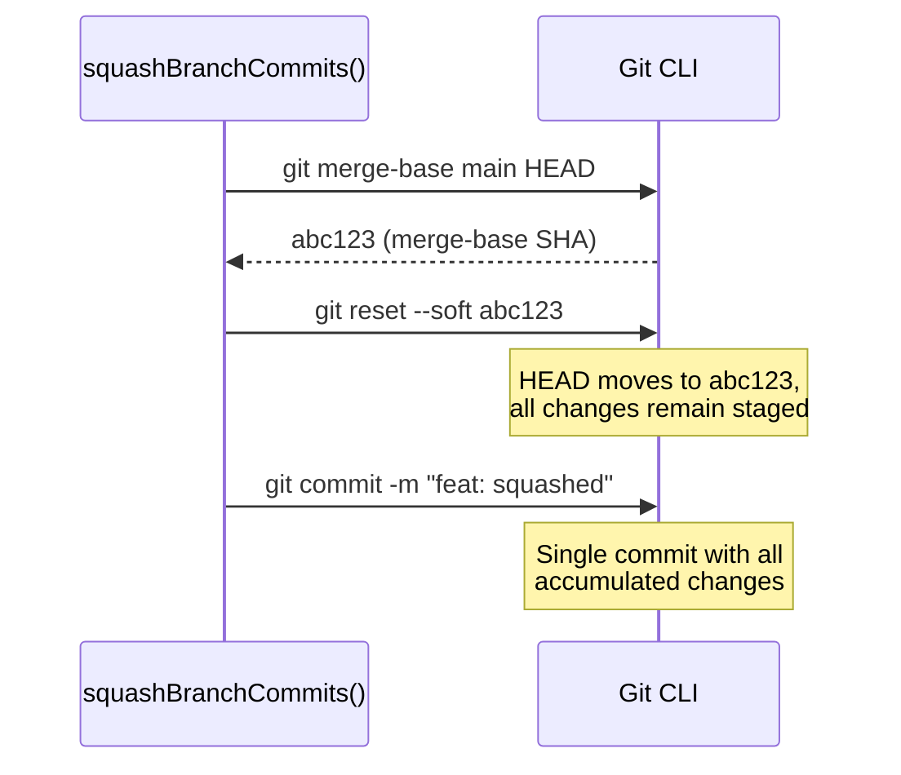
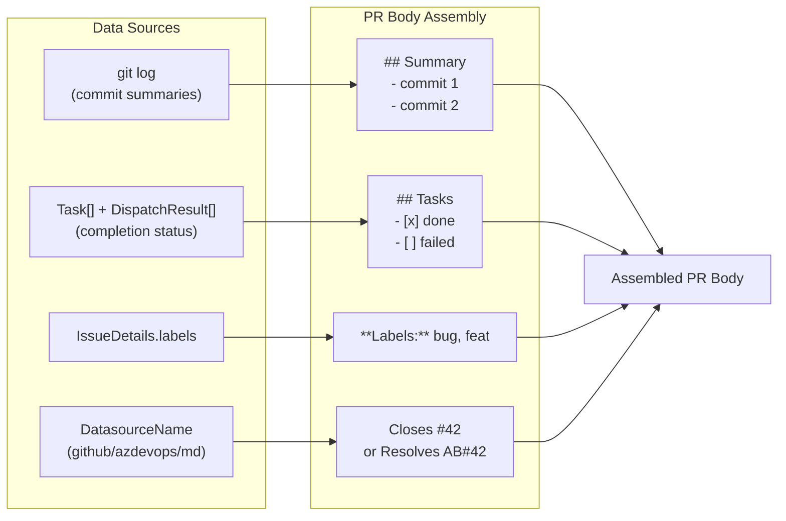
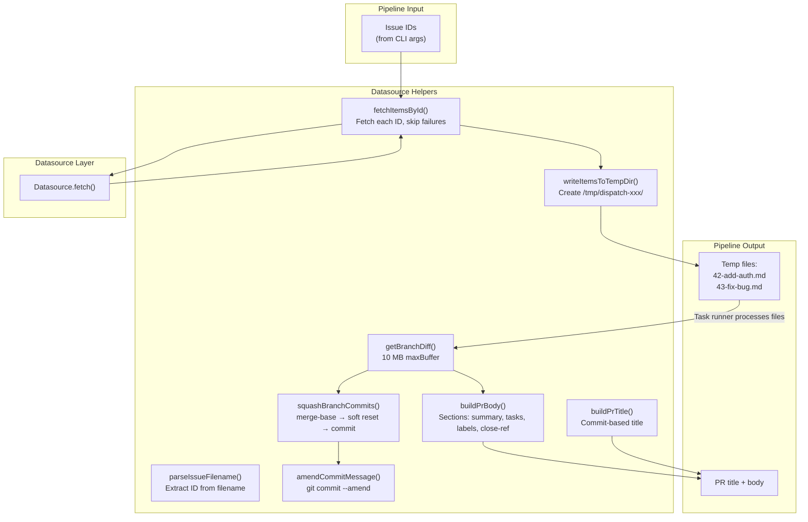

# Datasource Helpers

The datasource helpers module (`src/orchestrator/datasource-helpers.ts`) is
the orchestration bridge between the dispatch pipeline and the datasource
layer. It provides utility functions for fetching issues, writing them to
temporary files, extracting issue IDs from filenames, executing git operations
(diff, amend, squash), and assembling pull request titles and bodies.

## What it does

The module exports ten functions and one interface:

| Export | Type | Purpose |
|--------|------|---------|
| `parseIssueFilename(filePath)` | Function | Extract issue ID and slug from a `<id>-<slug>.md` filename |
| `fetchItemsById(issueIds, datasource, fetchOpts)` | Function | Fetch multiple issues by ID, skipping failures |
| `writeItemsToTempDir(items)` | Function | Write `IssueDetails` items to a temp directory as `<id>-<slug>.md` files |
| `getBranchDiff(defaultBranch, cwd)` | Function | Get the full diff of the current branch vs the default branch |
| `amendCommitMessage(message, cwd)` | Function | Amend the most recent commit message without changing content |
| `squashBranchCommits(defaultBranch, message, cwd)` | Function | Squash all branch commits into one via merge-base + soft reset |
| `buildPrBody(details, tasks, results, defaultBranch, datasourceName, cwd)` | Function | Assemble a descriptive PR body from pipeline data |
| `buildPrTitle(issueTitle, defaultBranch, cwd)` | Function | Generate a PR title from commit messages on the branch |
| `buildFeaturePrTitle(featureBranchName, issues)` | Function | Build an aggregated PR title for feature mode |
| `buildFeaturePrBody(issues, tasks, results, datasourceName)` | Function | Build an aggregated PR body for feature mode |
| `WriteItemsResult` | Interface | Return type of `writeItemsToTempDir()` |

## Why it exists

The dispatch pipeline needs to:

1. Fetch issues from the tracker and write them to temporary files that the
   task runner can process.
2. Map completed task files back to their originating issue IDs.
3. Execute git operations for branch diff retrieval, commit rewriting, and
   squashing.
4. Assemble platform-aware PR titles and bodies with auto-close references.

These operations sit between the [orchestrator](../cli-orchestration/orchestrator.md) (which manages pipeline flow) and
the datasource (which handles platform-specific API calls). Rather than
coupling the orchestrator directly to git subprocess calls or datasource
internals, this module provides clean bridge functions.

## Dependencies

| Import | Source | Purpose |
|--------|--------|---------|
| `Datasource`, `DatasourceName`, `IssueDetails`, `IssueFetchOptions` | `src/datasources/interface.ts` | Type imports for datasource operations |
| `Task` | `src/parser.ts` | Represents a parsed task (see [Task Parsing](../task-parsing/overview.md)) |
| `DispatchResult` | `src/dispatcher.ts` | Represents the outcome of a dispatched task (see [Dispatcher](../planning-and-dispatch/dispatcher.md)) |
| `slugify`, `MAX_SLUG_LENGTH` | `src/helpers/slugify.ts` | Generates branch-safe filenames (see [Slugify](../shared-utilities/slugify.md)) |
| `log` | `src/helpers/logger.ts` | Logging (warnings and success messages) (see [Logger](../shared-types/logger.md)) |
| `execFile` (promisified) | `node:child_process` | Subprocess execution for git commands |
| `mkdtemp`, `writeFile` | `node:fs/promises` | Temp directory creation and file writing |

## `parseIssueFilename`

Extracts an issue ID and slug from a file path matching the pattern
`<digits>-<slug>.md`.

**Signature:**
```
parseIssueFilename(filePath: string): { issueId: string; slug: string } | null
```

**Behavior:**

1. Extracts the basename from the path (e.g., `/tmp/dispatch-abc/42-add-auth.md`
   becomes `42-add-auth.md`).
2. Tests against the regex `/^(\d+)-(.+)\.md$/`.
3. If matched, returns `{ issueId: "42", slug: "add-auth" }`.
4. If not matched, returns `null`.

**When `null` is returned:** Filenames that do not start with digits followed
by a hyphen will not match. This includes:

- Markdown datasource filenames (e.g., `my-feature.md` — no leading digits).
- Files without the `.md` extension (`.txt`, `.json`, `.markdown`).
- Files with no hyphen after the digits (e.g., `42.md`).
- Empty strings and directory-only paths.

This is the mechanism by which the dispatch pipeline decides whether an issue
can be mapped back to a tracker issue: if the filename does not encode an issue
ID, the spec cannot be linked to a tracker issue for auto-close or sync.

## `fetchItemsById`

Fetches multiple issues from a datasource, handling failures gracefully.

**Signature:**
```
fetchItemsById(
  issueIds: string[],
  datasource: Datasource,
  fetchOpts: IssueFetchOptions,
): Promise<IssueDetails[]>
```

**Behavior:**

1. Splits each element of `issueIds` on commas and trims whitespace. This
   allows passing `["1,2,3"]` as well as `["1", "2", "3"]` — both produce
   IDs `["1", "2", "3"]`. Empty strings from trailing commas are filtered out.
2. Iterates over each ID **sequentially** and calls `datasource.fetch(id, fetchOpts)`.
3. If a fetch succeeds, the result is added to the output array.
4. If a fetch fails, logs a warning (`Could not fetch issue #<id>: <message>`)
   and skips the ID. Processing continues with the next ID.

**Return value:** An array of successfully fetched `IssueDetails`. The array
may be shorter than the input if some IDs failed to fetch.

**Error handling — no retry logic:** Failures are non-fatal. A single failed
fetch does not prevent other issues from being fetched. There is no retry
mechanism at this level — each ID gets exactly one fetch attempt. If
higher-level retry is needed, the calling code (orchestrator pipeline) must
implement it. This skip-and-warn strategy is important for batch operations
where some issues may have been deleted or the user may not have access to
all referenced issues.

## `writeItemsToTempDir`

Writes a list of `IssueDetails` to a temporary directory as markdown files.

**Signature:**
```
writeItemsToTempDir(items: IssueDetails[]): Promise<WriteItemsResult>
```

**Behavior:**

1. Creates a temp directory: `mkdtemp(join(tmpdir(), "dispatch-"))`.
2. For each `IssueDetails` item:
    - Slugifies the title using [`slugify()`](../shared-utilities/slugify.md) (lowercase, replace non-alphanumeric with hyphens,
      trim, truncate to `MAX_SLUG_LENGTH` = 60 characters).
    - Constructs filename as `<item.number>-<slug>.md`.
    - Writes `item.body` to the file as UTF-8.
    - Records the file path and maps it to the original `IssueDetails`.
3. Sorts the file list numerically by the leading issue number. If two files
   share the same number, sorts lexicographically by full path.

**Return value:** A `WriteItemsResult` object:

| Field | Type | Description |
|-------|------|-------------|
| `files` | `string[]` | Sorted list of written file paths |
| `issueDetailsByFile` | `Map<string, IssueDetails>` | Mapping from file path to the original `IssueDetails` |

The `issueDetailsByFile` map allows the pipeline to look up the original issue
metadata (number, title, URL, etc.) given a temp file path. This is used for
logging, error reporting, and issue auto-close.

### Temp file naming vs branch naming

Both temp files and branch names use slugified titles (via [`slugify()`](../shared-utilities/slugify.md)), but with different
truncation limits:

| Context | Pattern | Slug length limit |
|---------|---------|-------------------|
| Temp files | `<number>-<slug>.md` | 60 characters (`MAX_SLUG_LENGTH`) |
| Branch names | `<username>/dispatch/<number>-<slug>` | 50 characters |

### Temp directory cleanup

The temp directory is **not** cleaned up by this module. It relies on the
operating system's temp file cleanup mechanism (typically on reboot, or
periodic `tmpwatch`/`tmpreaper` cron jobs on Linux). Long-running systems
or frequent dispatch runs may accumulate `dispatch-*` temp directories in
the system temp folder. If cleanup is missed on crash, these orphaned
directories persist until the OS cleans them. See the
[temp file lifecycle](./integrations.md#temp-file-lifecycle) documentation
for full details.

## `getBranchDiff`

Retrieves the full diff of the current branch relative to the default branch.

**Signature:**
```
getBranchDiff(defaultBranch: string, cwd: string): Promise<string>
```

**Behavior:**

Runs `git diff <defaultBranch>..HEAD` with a `maxBuffer` of 10 MB (10 ×
1024 × 1024 bytes). If the command succeeds, returns the diff output. If the
command fails for any reason, returns an empty string.

**The 10 MB `maxBuffer` limit:** The `maxBuffer` option on Node.js
`child_process.execFile()` sets the maximum amount of data (in bytes) allowed
on stdout. The Node.js default is 1 MB (`1024 * 1024`). This function
explicitly sets it to 10 MB to accommodate larger diffs.

If the diff output exceeds 10 MB, Node.js terminates the `git diff` child
process and throws an `ERR_CHILD_PROCESS_STDIO_MAXBUFFER` error. The
function's `catch` block catches this error and returns an empty string. The
pipeline degrades gracefully — the commit agent and PR body builder proceed
without the diff context, but PR bodies and commit messages may be less
descriptive as a result.

**Why 10 MB?** This is a pragmatic limit. Most branch diffs are well under
1 MB. Very large refactorings or generated code changes can produce larger
diffs, and 10 MB covers the vast majority of real-world cases without
risking excessive memory consumption. For comparison, other git operations
in the datasource helpers (like `getCommitSummaries`) use the Node.js default
1 MB limit, since commit summaries are always small.

## `amendCommitMessage`

Amends the most recent commit's message without changing its content.

**Signature:**
```
amendCommitMessage(message: string, cwd: string): Promise<void>
```

**Behavior:**

Runs `git commit --amend -m <message>`. Unlike the other git helpers in this
module, this function does **not** catch errors — failures propagate directly
to the caller. Common failure cases include:

- No commits exist on the branch (`nothing to amend`)
- The working directory is not a git repository

## `squashBranchCommits`

Squashes all commits on the current branch (relative to the default branch)
into a single commit with the given message.

**Signature:**
```
squashBranchCommits(defaultBranch: string, message: string, cwd: string): Promise<void>
```

**Behavior — three-step git operation:**

1. **Find merge-base:** `git merge-base <defaultBranch> HEAD` — finds the
   common ancestor between the current branch and the default branch.
2. **Soft reset:** `git reset --soft <mergeBase>` — moves HEAD back to the
   merge-base while keeping all changes staged. This effectively "uncommits"
   all branch commits without losing any file changes.
3. **Fresh commit:** `git commit -m <message>` — creates a single new commit
   containing all the accumulated changes.



**Force-push requirement:** Because `squashBranchCommits` rewrites git
history (replacing N commits with a single new commit), any subsequent
`pushBranch()` call must use `--force` or `--force-with-lease` to update
the remote branch. The datasource's `pushBranch()` implementation uses
`git push --set-upstream origin <branch>`, which will fail if the remote
branch has already been pushed. The dispatch pipeline handles this by
calling squash **before** the initial push, so the squashed commit is
the first (and only) version that reaches the remote.

**Error propagation:** Unlike `getBranchDiff`, errors are **not** caught —
they propagate directly. If the working directory is not a git repository
or the merge-base cannot be found, the error reaches the caller.

## `buildPrBody`

Assembles a descriptive pull request body from pipeline data.

**Signature:**
```
buildPrBody(
  details: IssueDetails,
  tasks: Task[],
  results: DispatchResult[],
  defaultBranch: string,
  datasourceName: DatasourceName,
  cwd: string,
): Promise<string>
```

**Behavior:**

Assembles the PR body from four sources:

1. **Summary section** (`## Summary`): One-line commit summaries from
   `git log <defaultBranch>..HEAD --pretty=format:%s`. Each commit becomes a
   bullet item. Omitted if no commits are found or if `git log` fails.
2. **Tasks section** (`## Tasks`): Lists completed tasks as `- [x] <text>`
   and failed tasks as `- [ ] <text>`. Only includes tasks that have a
   matching `DispatchResult`. Omitted if no tasks match.
3. **Labels section**: Shows `**Labels:** label1, label2` if the issue has
   labels. Omitted if the labels array is empty.
4. **Issue-close reference**: A platform-specific keyword that triggers
   automatic issue closure when the PR is merged (see
   [close-reference syntax](#why-different-close-reference-syntax-per-datasource)).



### Why different close-reference syntax per datasource

The `buildPrBody` function appends a datasource-specific close reference
because GitHub and Azure DevOps use different keywords to link PRs to issues:

| Datasource | Close reference | Trigger |
|------------|----------------|---------|
| `github` | `Closes #<number>` | [GitHub auto-close](https://docs.github.com/en/issues/tracking-your-work-with-issues/linking-a-pull-request-to-an-issue): when the PR is merged into the **default branch**, GitHub automatically closes the linked issue. Supported keywords include `close`, `closes`, `closed`, `fix`, `fixes`, `fixed`, `resolve`, `resolves`, `resolved`. Dispatch uses `Closes` by convention. |
| `azdevops` | `Resolves AB#<number>` | [Azure Boards AB# syntax](https://learn.microsoft.com/en-us/azure/devops/boards/github/link-to-from-github): the `AB#` prefix links the PR to an Azure DevOps work item. Combined with `Resolves`, it transitions the work item to the Resolved workflow state category when the PR is merged into the default branch. |
| `md` | _(nothing)_ | The markdown datasource has no external tracker to close, so no close reference is emitted. |

**Important:** GitHub's close keywords only work when the PR targets the
repository's **default branch**. PRs targeting other branches will not
auto-close issues. Azure DevOps has the same restriction — state transitions
only apply when the PR is merged into the default branch.

## `buildPrTitle`

Generates a descriptive PR title from commit messages on the branch.

**Signature:**
```
buildPrTitle(issueTitle: string, defaultBranch: string, cwd: string): Promise<string>
```

**Behavior:**

| Condition | Result |
|-----------|--------|
| No commits found (or `git log` fails) | Returns `issueTitle` as-is |
| Exactly one commit | Returns the commit message |
| Multiple commits | Returns `<oldest commit message> (+N more)` |

The "oldest commit message" is the last entry from `git log`, which lists
commits in reverse chronological order (newest first). The `(+N more)` suffix
indicates how many additional commits exist.

## `buildFeaturePrTitle`

Builds an aggregated PR title for feature mode (multiple issues on one branch).

**Signature:**
```
buildFeaturePrTitle(featureBranchName: string, issues: IssueDetails[]): string
```

**Behavior:**

| Condition | Result |
|-----------|--------|
| Single issue | Returns the issue's title |
| Multiple issues | Returns `feat: <branchName> (#10, #11, #12)` |

### Mixed datasource types across issues

`buildFeaturePrTitle` accepts a single `featureBranchName` and an array of
`IssueDetails`, but does **not** accept a `datasourceName`. The issue
references always use `#<number>` syntax (GitHub-style). This works correctly
for feature mode because all issues in a feature run come from the same
datasource backend — the orchestrator resolves a single datasource before
fetching any issues. Mixed-datasource feature runs are not supported by the
pipeline architecture.

## `buildFeaturePrBody`

Builds an aggregated PR body for feature mode that references all issues,
their tasks, and completion status.

**Signature:**
```
buildFeaturePrBody(
  issues: IssueDetails[],
  tasks: Task[],
  results: DispatchResult[],
  datasourceName: DatasourceName,
): string
```

**Behavior:**

Assembles three sections:

1. **Issues section** (`## Issues`): Lists all issues as `- #<number>: <title>`.
2. **Tasks section** (`## Tasks`): Lists completed tasks as `- [x] <text>`
   and failed tasks as `- [ ] <text>`. Omitted if no tasks have results.
3. **Close references**: Appends a close reference **for each issue** using
   the datasource-specific syntax (`Closes #N` for GitHub, `Resolves AB#N`
   for Azure DevOps, nothing for markdown).

Like `buildFeaturePrTitle`, this function accepts a single `datasourceName`,
confirming that all issues in a feature run come from the same backend.

## Internal: `getCommitSummaries`

A private helper function (not exported) used by `buildPrBody` and
`buildPrTitle`.

**Behavior:**

Runs `git log <defaultBranch>..HEAD --pretty=format:%s` to retrieve one-line
commit summaries for commits on the current branch that are not on the default
branch. Returns an array of commit strings. On failure, returns an empty array.

Uses the Node.js default `maxBuffer` of 1 MB. This is sufficient for commit
summaries since each line is typically under 100 characters, supporting
approximately 10,000 commits before hitting the limit.

## Data flow diagram



## Related documentation

- [Datasource Overview](./overview.md) — Interface definitions and
  architecture diagrams
- [GitHub Datasource](./github-datasource.md) — GitHub `close()` calls
  `gh issue close`
- [Azure DevOps Datasource](./azdevops-datasource.md) — Azure DevOps
  `close()` calls `az boards work-item update --state Closed`
- [Markdown Datasource](./markdown-datasource.md) — Markdown `close()`
  moves file to `archive/`
- [Integrations & Troubleshooting](./integrations.md) — Temp file lifecycle,
  subprocess behavior, and external tool dependencies
- [Architecture Overview](../architecture.md) — System-wide design and
  pipeline topology
- [CLI Orchestrator](../cli-orchestration/orchestrator.md) — How the
  orchestrator invokes datasource helpers
- [Task Parsing Overview](../task-parsing/overview.md) — The `Task`
  type consumed by PR body builders
- [Markdown Syntax Reference](../task-parsing/markdown-syntax.md) — Task
  checkbox format that the parser extracts
- [Shared Utilities — Slugify](../shared-utilities/slugify.md) — The `slugify()`
  function and `MAX_SLUG_LENGTH` constant used for temp filename generation
- [Dispatcher](../planning-and-dispatch/dispatcher.md) — The `DispatchResult`
  type consumed by PR body builders
- [Executor Agent](../planning-and-dispatch/executor.md) — How the executor
  produces `DispatchResult` objects
- [Git Operations](../planning-and-dispatch/git.md) — Post-completion git
  commits that run alongside datasource helper git operations
- [Datasource Testing](./testing.md) — Test suite covering datasource
  helpers and other datasource modules
