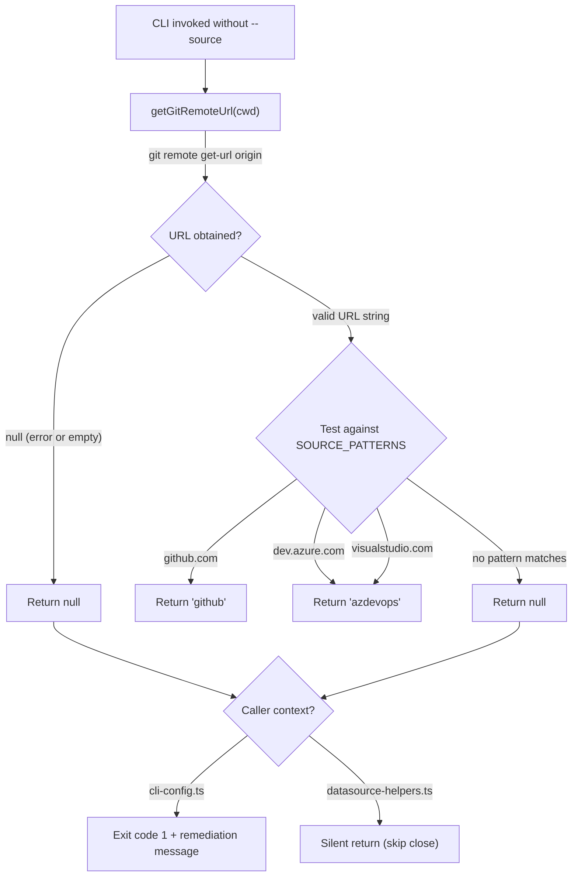

# Integrations & Troubleshooting

This page documents cross-cutting concerns that apply to all datasource
implementations: subprocess execution behavior, error handling patterns,
external tool dependencies, the git-based auto-detection system, git lifecycle
operations, and the temp file lifecycle.

## Subprocess execution model

The GitHub and Azure DevOps datasources shell out to external CLI tools (`gh`
and `az`) using Node.js `execFile` from `node:child_process`, wrapped with
`promisify` from `node:util`. See the [GitHub Datasource](./github-datasource.md)
and [Azure DevOps Datasource](./azdevops-datasource.md) for platform-specific
details.

### Why `execFile` instead of `exec`

`execFile` is used instead of `exec` because:

1. **No shell interpolation.** Arguments are passed directly to the process as
   an argv array, eliminating shell injection risks from issue titles or body
   content that might contain shell metacharacters.
2. **Direct process spawning.** `execFile` spawns the target process directly
   without an intermediate shell process, which is slightly more efficient.

### Subprocess behavior

| Aspect | Behavior |
|--------|----------|
| Shell | None (`execFile`, not `exec`) |
| Working directory | Set via `{ cwd }` option from `opts.cwd` or `process.cwd()` |
| Environment | Inherits the parent process environment (including `GH_TOKEN`, `AZURE_DEVOPS_EXT_PAT`, etc.) |
| Timeout | **None** -- no timeout is configured on any `execFile` call |
| Max buffer | Node.js default (`1048576` bytes / 1 MB) for stdout and stderr |
| Encoding | Default (UTF-8 string output) |

### No subprocess timeout

None of the datasource `execFile` calls configure a `timeout` option. This
means:

- A hung `gh` process (e.g., waiting for browser authentication in a headless
  environment) will block the pipeline indefinitely.
- A slow `az` query against a large Azure DevOps organization will block until
  the query completes, regardless of how long that takes.
- There is no cancellation mechanism -- the only way to terminate a stuck
  subprocess is to kill the dispatch process itself (e.g., via Ctrl+C /
  SIGINT).

### Buffer overflow risk

The default `maxBuffer` for `execFile` is 1 MB. If a `gh` or `az` command
produces more than 1 MB of stdout (e.g., a very large issue body, or a WIQL
query returning thousands of work item IDs), Node.js will throw a
`ERR_CHILD_PROCESS_STDIO_MAXBUFFER` error. This is unlikely in normal use but
possible with very large Azure DevOps queries.

## JSON parsing

Both the GitHub and Azure DevOps datasources parse `stdout` from CLI commands
using `JSON.parse(stdout)`. There is no `try/catch` around these calls:

| Datasource | Unguarded `JSON.parse` locations |
|------------|-------------------------------|
| GitHub | `src/datasources/github.ts:34` (`list`), `src/datasources/github.ts:72` (`fetch`) |
| Azure DevOps | `src/datasources/azdevops.ts:33` (`list`), `src/datasources/azdevops.ts:74` (`fetch`), `src/datasources/azdevops.ts:160` (`create`) |

If the CLI tool produces non-JSON output (e.g., an HTML error page, a warning
message, or partial output from a crash), a `SyntaxError` will propagate to the
caller. The error message will be something like:

```
SyntaxError: Unexpected token '<', "<!DOCTYPE "... is not valid JSON
```

The one exception is the `fetchComments()` helper in the Azure DevOps
datasource (`src/datasources/azdevops.ts:188`), which wraps the entire comment
fetch (including `JSON.parse`) in a `try/catch` and returns `[]` on failure.

## ENOENT behavior

When a required CLI tool is not installed (or not on PATH), `execFile` throws
an `ENOENT` error:

```
Error: spawn gh ENOENT
    at ChildProcess._handle.onexit (node:internal/child_process:286:19)
```

There are no pre-flight checks for tool availability. The error surfaces only
when a datasource operation is first called. This applies to:

| Tool | Required by | Detection point |
|------|------------|-----------------|
| `gh` | GitHub datasource (CRUD + PR creation) | First call to any GitHub operation |
| `az` | Azure DevOps datasource (CRUD + PR creation) | First call to any Azure DevOps operation |
| `git` | Auto-detection (`detectDatasource()`), all lifecycle operations | Call to `detectDatasource()` or any git lifecycle method |

The markdown datasource has a single subprocess dependency: `getUsername()`
shells out to `git config user.name` via `execFile`. If `git` is not
installed, the `catch` block returns `"local"` as the fallback username. All
other markdown datasource operations use only Node.js `fs/promises` and do not
depend on external tools.

## Git-based auto-detection

The `detectDatasource()` function in `src/datasources/index.ts:66` inspects the
git `origin` remote URL to determine which datasource to use.

### How it works

1. Runs `git remote get-url origin` via `execFile` in the given working
   directory.
2. Tests the URL against patterns in order (first match wins):

   | Pattern | Result |
   |---------|--------|
   | `/github\.com/i` | `"github"` |
   | `/dev\.azure\.com/i` | `"azdevops"` |
   | `/visualstudio\.com/i` | `"azdevops"` |

3. If no pattern matches, returns `null`.
4. If the `git` command fails (e.g., not a git repo, no `origin` remote),
   the `catch` block returns `null`.

### URL format support

The regex patterns test for hostname substrings, so both SSH and HTTPS URL
formats are matched:

| Format | Example | Matched? |
|--------|---------|----------|
| HTTPS | `https://github.com/owner/repo.git` | Yes |
| SSH | `git@github.com:owner/repo.git` | Yes |
| HTTPS (Azure) | `https://dev.azure.com/org/project` | Yes |
| SSH (Azure) | `git@ssh.dev.azure.com:v3/org/project/repo` | Yes |
| Legacy VSTS | `https://myorg.visualstudio.com/project` | Yes |

### Limitations

**Hardcoded remote name.** Only the `origin` remote is inspected
(`src/datasources/index.ts:72`). Repositories with multiple remotes (e.g.,
`origin` → GitHub, `upstream` → Azure DevOps) will only detect based on
`origin`.

**No GitHub Enterprise support.** The pattern `/github\.com/i` does not match
GitHub Enterprise Server hostnames (e.g., `github.mycompany.com`). Use
`--source github` to force detection.

**No GitLab/Bitbucket/other hosts.** Only GitHub and Azure DevOps patterns are
registered. Other git hosting services will return `null`.

**No markdown auto-detection.** The auto-detection system never returns `"md"`.
The markdown datasource must always be selected explicitly with `--source md`,
`dispatch config` (interactive wizard), or a `.dispatch/config.json` file with
`"source": "md"`.

**Return type.** `detectDatasource()` returns `Promise<DatasourceName | null>`,
not `Promise<DatasourceName>`. Callers must handle the `null` case.

### `getGitRemoteUrl` behavior

The `getGitRemoteUrl(cwd)` function (`src/datasources/index.ts:54`) wraps the
`git remote get-url origin` call in a `try/catch` that catches **all** errors
and returns `null`. This means the function returns `null` in all of the
following cases:

| Scenario | Underlying error | Return value |
|----------|-----------------|--------------|
| No `origin` remote configured | Non-zero exit from `git` | `null` |
| Not inside a git repository | Non-zero exit from `git` | `null` |
| `git` is not installed / not on PATH | `ENOENT` | `null` |
| Empty stdout from `git` | No error, but `stdout.trim()` is `""` | `null` |

Because `getGitRemoteUrl` swallows all errors, `detectDatasource()` also
returns `null` in all of these cases. Callers handle `null` differently:

- **`cli-config.ts`:** Exits with error code 1 and prints a message advising
    the user to run `dispatch config` or specify `--source` explicitly.
- **`datasource-helpers.ts` (`closeCompletedSpecIssues`):** Silently returns
    without closing any issues.

### Detection data flow

The following diagram shows the complete detection path from the CLI
invocation through to datasource resolution:



## Git CLI integration for lifecycle operations

The GitHub and Azure DevOps datasources use the `git` CLI directly for
branching, committing, and pushing operations. These operations are part of
the [git lifecycle methods](./overview.md#git-lifecycle-operations) on the
`Datasource` interface.

### Git commands used

| Operation | Git command(s) | Notes |
|-----------|---------------|-------|
| Default branch detection | `git symbolic-ref refs/remotes/origin/HEAD` | Falls back to `git rev-parse --verify main`, then `"master"` |
| Username resolution | `git config user.name` | Used by the markdown datasource's `getUsername()`; falls back to `"local"` on error or empty. GitHub and Azure DevOps datasources use their respective CLI tools instead (`gh api user`, `az account show`). |
| Branch creation | `git checkout -b <branch>` | Falls back to `git checkout <branch>` if exists |
| Branch switching | `git checkout <branch>` | |
| Staging | `git add -A` | Stages all changes including untracked files |
| Empty check | `git diff --cached --stat` | Prevents empty commits |
| Committing | `git commit -m <message>` | Only runs if diff check is non-empty |
| Pushing | `git push --set-upstream origin <branch>` | Sets tracking reference |

All git commands are executed via `execFile("git", [...], { cwd })` using the
same subprocess model as `gh` and `az` (no shell, no timeout, inherited
environment).

### Git version requirements

No minimum git version is enforced. The commands used (`checkout -b`,
`symbolic-ref`, `rev-parse`, `add`, `diff`, `commit`, `push`) are stable
across all modern git versions (2.x+). The `--set-upstream` push flag has been
available since git 1.7.

### Common git failure scenarios

| Failure | Cause | Error |
|---------|-------|-------|
| `symbolic-ref` fails | `origin/HEAD` not set (never fetched) | Caught silently; falls back to `main`/`master` |
| `checkout -b` fails | Branch name already exists | Caught; falls back to `git checkout <branch>` |
| `checkout -b` fails | Uncommitted changes conflict | Propagates to caller |
| `push` fails | No remote `origin` configured | Propagates to caller |
| `push` fails | Authentication failure (SSH key, HTTPS token) | Propagates to caller |
| `commit` fails | No user.name or user.email configured | Propagates to caller |

### Fixing `symbolic-ref` failures

If `getDefaultBranch()` consistently falls back to `"master"` when the actual
default is `"main"`, run:

```sh
git remote set-head origin --auto
```

This queries the remote and sets `refs/remotes/origin/HEAD` to the correct
default branch.

### Uncommitted changes and branching

The `createAndSwitchBranch()` method does not stash or check for uncommitted
changes before switching branches. If the working directory has uncommitted
changes that conflict with the target branch, `git checkout -b` or
`git checkout` will fail with a merge conflict error. The dispatch pipeline
should ensure the working directory is clean before calling branching
operations.

## Azure DevOps remote URL parsing

The `parseAzDevOpsRemoteUrl()` function in `src/datasources/index.ts:112`
extracts the organization URL and project name from Azure DevOps git remote
URLs. It is used by the Azure DevOps datasource to derive `--org` and
`--project` values when they are not explicitly provided.

### Supported URL formats

The parser handles three formats with dedicated regex patterns, tested in
order:

| Format | Pattern | Example |
|--------|---------|---------|
| Modern HTTPS | `https://[user@]dev.azure.com/{org}/{project}/_git/{repo}` | `https://dev.azure.com/myorg/my-project/_git/my-repo` |
| SSH | `git@ssh.dev.azure.com:v3/{org}/{project}/{repo}` | `git@ssh.dev.azure.com:v3/myorg/my-project/my-repo` |
| Legacy HTTPS | `https://{org}.visualstudio.com/[DefaultCollection/]{project}/_git/{repo}` | `https://myorg.visualstudio.com/my-project/_git/my-repo` |

All three formats normalize the output to a consistent structure:
`{ orgUrl: "https://dev.azure.com/{org}", project: "{project}" }`.

### Username prefix handling

The modern HTTPS format supports an optional `user@` prefix before
`dev.azure.com` (e.g., `https://user@dev.azure.com/org/project/_git/repo`).
The regex uses `(?:[^@]+@)?` to optionally match and discard this prefix.
This prefix is common in Azure DevOps clone URLs and is also inserted by
some git credential managers.

### Legacy `DefaultCollection` segment

Some legacy Azure DevOps (formerly VSTS) URLs include a `DefaultCollection`
path segment between the host and the project name. The regex uses
`(?:DefaultCollection\/)?` to optionally match and discard this segment.
Example: `https://myorg.visualstudio.com/DefaultCollection/my-project/_git/my-repo`
parses identically to the URL without `DefaultCollection`.

### `decodeURIComponent` usage

All three parsing paths apply `decodeURIComponent()` to the captured
organization and project names. This is necessary because Azure DevOps
percent-encodes spaces and special characters in organization and project
names in remote URLs (e.g., `My%20Project` → `My Project`). Without
decoding, the extracted names would not match the actual Azure DevOps
identifiers needed for API calls.

### Return value

If the URL does not match any of the three patterns, the function returns
`null`. This includes GitHub URLs, GitLab URLs, malformed Azure DevOps URLs
(e.g., missing the `/_git/` segment), and empty strings.

## Authentication failure handling

The datasource system does not define a standardized error type for
authentication failures. Each datasource relies on the underlying CLI tool's
error reporting:

| Datasource | Auth mechanism | Failure behavior |
|------------|---------------|-----------------|
| **GitHub** | `gh auth login` / `GH_TOKEN` env var | `gh` exits with non-zero status; stderr contains auth error message. The error propagates as an `execFile` rejection. |
| **Azure DevOps** | `az login` / `AZURE_DEVOPS_EXT_PAT` env var | `az` exits with non-zero status; stderr contains auth error message. The error propagates as an `execFile` rejection. |
| **Markdown** | None (local filesystem) | Not applicable |

Authentication errors are not distinguishable from other CLI errors at the
datasource level. The spec generator catches fetch errors at
`src/spec-generator.ts:114-118` and marks the individual issue as failed
while continuing to process remaining issues. This means an expired token
will cause per-issue failures rather than a blanket pipeline abort.

There is no pre-flight authentication check. The first API call to the CLI
tool surfaces the error, which may be several steps into the pipeline.

## Branch naming convention

All three datasource implementations use a consistent branch naming convention:

```
<username>/dispatch/<issueNumber>-<slugified-title>
```

The `<username>` segment comes from `getUsername()`, which resolves a
branch-safe slug of the current user's identity (see
[overview](./overview.md#the-getusername-method) for per-datasource behavior).

### Slug construction

The title is slugified using the shared
[`slugify()`](../shared-utilities/slugify.md) algorithm (identical across all
datasources):

1. Lowercase the title.
2. Replace runs of non-alphanumeric characters with a single hyphen.
3. Trim leading and trailing hyphens.
4. Truncate to 50 characters.

The username is also slugified (same algorithm, default 60-character limit)
before being placed in the branch name.

### CI/CD implications

The `<username>/dispatch/` structure creates a predictable namespace for CI/CD
configuration. Because the username prefix varies, glob patterns must account
for it:

**GitHub Actions:**
```yaml
on:
  push:
    branches: ['*/dispatch/**']
```

**Azure DevOps Pipelines:**
```yaml
trigger:
  branches:
    include:
      - '*/dispatch/*'
```

This allows teams to create pipeline triggers that run only on
dispatch-created branches, avoiding unnecessary CI runs on manual branches.

### Branch name conflicts

The `createAndSwitchBranch()` method handles the case where a branch already
exists by falling back to `git checkout <branch>` (switching to it). This
means re-running dispatch for the same issue will reuse the existing branch
rather than failing.

## Temp file lifecycle

The [datasource helpers](./datasource-helpers.md) module creates temporary
files when fetching issues for the dispatch pipeline. This section documents
the lifecycle of those files.

### Creation

`writeItemsToTempDir()` creates a temporary directory using:

```
mkdtemp(join(tmpdir(), "dispatch-"))
```

This produces a directory like `/tmp/dispatch-abc123/` on Linux/macOS or
`C:\Users\...\AppData\Local\Temp\dispatch-abc123\` on Windows.

Each `IssueDetails` item is written as a `<number>-<slug>.md` file inside this
directory.

### Naming convention

Temp files follow the pattern `<issueNumber>-<slugified-title>.md`. The slug
is constructed identically to branch names, except truncated to 60 characters
(vs 50 for branch names). Examples:

| Issue number | Title | Temp filename |
|-------------|-------|---------------|
| `42` | `"Add user authentication"` | `42-add-user-authentication.md` |
| `7` | `"Fix Bug #123!!"` | `7-fix-bug-123.md` |

### Sorting

The returned file list is sorted numerically by the leading issue number. If
two files share the same number, they are sorted lexicographically by full
path. This ensures deterministic processing order.

### Cleanup

The temp directory is **not** cleaned up by `writeItemsToTempDir()` or any
other function in the datasource system. It relies on the operating system's
temp file cleanup mechanism (typically on reboot, or periodic `tmpwatch`/`tmpreaper`
cron jobs on Linux). Long-running systems may accumulate dispatch temp
directories.

### Issue ID extraction from temp files

The `parseIssueFilename()` function extracts the issue ID from temp filenames
by matching the regex `/^(\d+)-(.+)\.md$/`. This is how the dispatch pipeline
maps completed tasks back to their originating issues for auto-close. See the
[datasource helpers documentation](./datasource-helpers.md#parseissuefilename)
for details.

## Error handling patterns

The datasource system uses two distinct error handling strategies:

### Strategy 1: Propagate (main fetch)

The main `fetch()` method in both the GitHub and Azure DevOps datasources lets
errors propagate. The spec generator catches them at
`src/spec-generator.ts:114-118`:

```
try {
  const details = await fetcher.fetch(id, fetchOpts);
  // success
} catch (err) {
  log.error(`Failed to fetch #${id}: ${message}`);
  // issue marked as failed, processing continues
}
```

This means:
- A failed fetch for one issue does not stop other issues from being fetched.
- The error message (including stderr from the CLI tool) is logged.
- The final summary reports how many issues failed.

### Strategy 2: Swallow (comment fetch)

The `fetchComments()` function in the Azure DevOps datasource catches all
errors and returns an empty array (`src/datasources/azdevops.ts:188`). This
means:
- Comment fetch failures are completely silent.
- The work item is still returned with all other fields populated.
- There is no way to distinguish "no comments exist" from "comment fetch
  failed" in the returned data.

## Error summary by datasource

| Error class | GitHub | Azure DevOps | Markdown |
|-------------|--------|-------------|----------|
| Tool not installed | `ENOENT` for `gh` | `ENOENT` for `az` | N/A |
| Not authenticated | Non-zero exit from `gh` | Non-zero exit from `az` | N/A |
| Item not found | Non-zero exit from `gh` | Non-zero exit from `az` | `ENOENT` from `readFile` |
| Malformed JSON | `SyntaxError` | `SyntaxError` | N/A |
| Directory missing | N/A | N/A | Graceful `[]` from `list()`; `ENOENT` from `fetch()` |
| Network failure | Non-zero exit from `gh` | Non-zero exit from `az` | N/A |
| Rate limit | Non-zero exit from `gh` | Non-zero exit from `az` | N/A |
| Buffer overflow | `ERR_CHILD_PROCESS_STDIO_MAXBUFFER` | `ERR_CHILD_PROCESS_STDIO_MAXBUFFER` | N/A |
| Hung subprocess | Blocks indefinitely | Blocks indefinitely | N/A |
| File collision | N/A | N/A | Silent overwrite on `create()` |

## Cross-group dependencies

The datasource system is consumed by several other groups in the dispatch
pipeline:

### Orchestrator (`src/orchestrator/`)

The dispatch pipeline (`dispatch-pipeline.ts`) calls `getDatasource()` to
obtain a datasource for auto-closing issues when all tasks in a spec file
succeed. The spec pipeline (`spec-pipeline.ts`) calls both `getDatasource()`
and `detectDatasource()` for fetching issues and resolving the datasource.

### Spec generation (`src/spec-generator.ts`)

The spec generator calls `getDatasource()` to fetch individual issue details
for building AI prompts. It uses the `IssueDetails` structure to construct
the spec generation prompt.

### CLI and configuration (`src/cli.ts`, `src/config.ts`)

The `--source` flag accepts values from `DATASOURCE_NAMES`. The `config.ts`
module validates the `source` config key against these names. Invalid values
are rejected with an error listing the available datasource names. See the
[Configuration System](../cli-orchestration/configuration.md) for how
`--source` defaults are persisted and merged with CLI flags.

### Deprecated compatibility layer (`src/issue-fetchers/`)

The deprecated `IssueFetcher` shims in `src/issue-fetchers/index.ts` delegate
to `getDatasource()` and `detectDatasource()`. These shims provide backward
compatibility for any code still importing from the old paths. See the
[deprecated compatibility documentation](../deprecated-compat/overview.md)
for migration guidance and removal assessment.

## Related documentation

- [Datasource Overview](./overview.md) -- Interface, registry, and
  architecture diagrams
- [GitHub Datasource](./github-datasource.md) -- GitHub-specific behavior
- [Azure DevOps Datasource](./azdevops-datasource.md) -- Azure DevOps-specific
  behavior
- [Markdown Datasource](./markdown-datasource.md) -- Filesystem-specific
  behavior
- [Datasource Helpers](./datasource-helpers.md) -- Orchestration bridge:
  temp file writing, issue ID extraction, and auto-close logic
- [Testing](./testing.md) -- Test suite covering the datasource system
- [Deprecated Compatibility Layer](../deprecated-compat/overview.md) --
  Legacy `IssueFetcher` shims that delegate to datasource implementations
- [Issue Fetching Overview](../issue-fetching/overview.md) -- Architecture
  of the deprecated issue fetching subsystem
- [Spec Generation](../spec-generation/overview.md) -- How the spec pipeline
  consumes datasource `fetch()` results
- [CLI Argument Parser](../cli-orchestration/cli.md) -- `--source`, `--org`,
  and `--project` flag documentation
- [Configuration System](../cli-orchestration/configuration.md) -- Persistent
  `--source` defaults and three-tier merge logic
- [Slugify](../shared-utilities/slugify.md) -- Branch name and temp file slug
  construction algorithm
- [Shared Types: Integrations](../shared-types/integrations.md) -- Node.js
  fs/promises and child_process operational details
