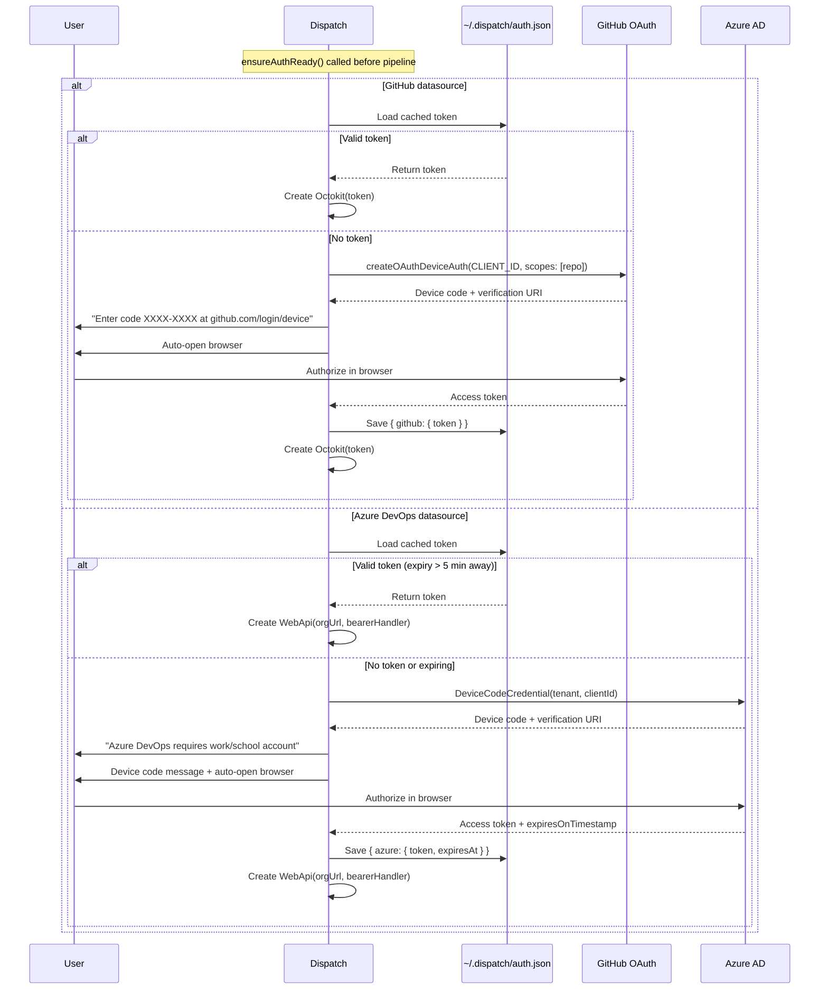

# External Integrations

## What it does

This page documents how the datasource system integrates with external services
and tools. The architecture uses **SDK-based integrations** for issue tracker
access and **git CLI** (via `child_process.execFile`) for version control
operations. There are no CLI dependencies on `gh`, `az`, or other platform
tools.

**Source files:**

| File | Purpose |
|------|---------|
| `src/helpers/auth.ts` | OAuth device-flow authentication, token caching |
| `src/constants.ts` | OAuth client IDs, Azure tenant, scope |
| `src/datasources/github.ts` | Octokit SDK integration |
| `src/datasources/azdevops.ts` | azure-devops-node-api SDK integration |
| `src/helpers/branch-validation.ts` | Branch name validation |

**Related docs:**

- [Overview](./overview.md) -- interface contract and shared behaviors
- [GitHub datasource](./github-datasource.md) -- GitHub-specific details
- [Azure DevOps datasource](./azdevops-datasource.md) -- Azure DevOps-specific details
- [Datasource helpers](./datasource-helpers.md) -- orchestration bridge functions
- [Testing](./testing.md) -- mock patterns for SDKs

## Why it exists

Using SDKs instead of CLI tools provides several advantages:

- **No CLI prerequisites:** Users do not need `gh` or `az` installed.
- **Type safety:** TypeScript types from SDK packages catch errors at compile
  time.
- **Pagination:** SDKs like Octokit provide built-in pagination helpers.
- **Structured errors:** SDK error types (e.g. `RequestError`) enable precise
  error handling rather than parsing CLI exit codes and stderr.
- **Token management:** Device-code flows are embedded directly, avoiding
  dependency on external CLI login state.

## How it works

### Integration model

```
+-------------------+       +------------------+
|  Dispatch Core    |       |  External APIs   |
|                   |       |                  |
|  Orchestrator     |  SDK  |  GitHub REST API |
|  Plan Generator --+------>|  Azure DevOps    |
|  Dispatcher       |       |  REST API        |
+-------------------+       +------------------+
         |
         | execFile
         v
    +----------+
    | git CLI  |
    +----------+
```

The datasource system has exactly two categories of external dependencies:

1. **SDKs** for issue tracker APIs (no CLI wrappers).
2. **git CLI** invoked via `child_process.execFile` (promisified) for all
   version control operations.

### Git CLI usage

All git operations are executed through a local `git()` helper in each
datasource file:

```typescript
async function git(args: string[], cwd: string): Promise<string> {
  const { stdout } = await exec("git", args, { cwd, shell: process.platform === "win32" });
  return stdout;
}
```

The `shell: process.platform === "win32"` option ensures correct execution on
Windows. Git commands used across datasources:

| Command | Purpose | Used by |
|---------|---------|---------|
| `git remote get-url origin` | Get remote URL | index.ts |
| `git symbolic-ref refs/remotes/origin/HEAD` | Detect default branch | All 3 |
| `git rev-parse --verify main` | Fallback branch detection | All 3 |
| `git rev-parse --abbrev-ref HEAD` | Get current branch | All 3 |
| `git checkout -b {branch}` | Create and switch branch | All 3 |
| `git checkout {branch}` | Switch to existing branch | All 3 |
| `git worktree prune` | Recover from worktree conflicts | All 3 |
| `git add -A` | Stage all changes | All 3 |
| `git diff --cached --stat` | Check for staged changes | All 3 |
| `git commit -m {message}` | Create commit | All 3 |
| `git push --set-upstream origin {branch}` | Push branch | GitHub, Azure DevOps |
| `git config user.name` | Get git username | index.ts |
| `git config user.email` | Get git email | index.ts |
| `git log origin/{branch}..HEAD --pretty=format:%s` | Commit messages | github.ts |

### Authentication system

Authentication is centralized in `src/helpers/auth.ts` and uses OAuth
device-code flows for both GitHub and Azure DevOps.

#### Token storage

Tokens are cached at `~/.dispatch/auth.json` with file permissions `0o600`
(owner read/write only, skipped on Windows). The cache structure:

```json
{
  "github": { "token": "gho_..." },
  "azure": { "token": "eyJ...", "expiresAt": "2026-04-10T12:00:00.000Z" }
}
```

GitHub tokens have no expiry tracking (OAuth app tokens are long-lived). Azure
tokens include an `expiresAt` timestamp and are refreshed when within 5 minutes
of expiry (`EXPIRY_BUFFER_MS = 5 * 60 * 1000`).

#### Device-code flow sequence



#### Pre-authentication

`ensureAuthReady(source, cwd, org?)` is called before the pipeline starts to
ensure tokens are ready while stdout is still free (before TUI takes over):

- **GitHub:** Validates the remote URL is a GitHub repo, then calls
  `getGithubOctokit()`.
- **Azure DevOps:** Resolves the org URL from `org` parameter or remote URL,
  then calls `getAzureConnection(orgUrl)`.
- **Markdown:** No authentication needed (skipped).

#### TUI integration

`setAuthPromptHandler(handler)` allows the TUI to register a callback for
device-code prompts. When set, prompts are routed to the handler instead of
`log.info()`. Pass `null` to clear.

### OAuth constants

From `src/constants.ts`:

| Constant | Value | Purpose |
|----------|-------|---------|
| `GITHUB_CLIENT_ID` | `Ov23liUMP1Oyg811IF58` | GitHub OAuth App (public client ID) |
| `AZURE_CLIENT_ID` | `150a3098-01dd-4126-8b10-5e7f77492e5c` | Azure AD application ID |
| `AZURE_TENANT_ID` | `"organizations"` | Restricts to work/school accounts |
| `AZURE_DEVOPS_SCOPE` | `499b84ac-1321-427f-aa17-267ca6975798/.default` | Azure DevOps API scope |

### Branch validation

`src/helpers/branch-validation.ts` provides shared validation:

**`isValidBranchName(name)`:** Validates against git refname rules:

- Must be 1-255 characters of `[a-zA-Z0-9._\-/]`.
- Cannot start or end with `/`.
- Cannot contain `..` (parent traversal).
- Cannot end with `.lock`.
- Cannot contain `@{` (reflog syntax).
- Cannot contain `//` (empty path component).

**`InvalidBranchNameError`:** Extends `Error` with `name` property set to
`"InvalidBranchNameError"`. Provides reliable `instanceof` detection.

### Error handling patterns

The SDK-based architecture uses structured error types instead of CLI exit code
parsing:

| SDK | Error type | Key scenarios |
|-----|-----------|---------------|
| `@octokit/rest` | `RequestError` | 404 (not found), 422 (validation/duplicate PR) |
| `azure-devops-node-api` | SDK exceptions | Error message string matching for "already exists" |
| `@azure/identity` | Credential errors | Device-code timeout, token acquisition failure |
| git CLI | `execFile` errors | Worktree conflicts, branch already exists |

All error messages containing URLs use `redactUrl()` to strip credentials
before logging or throwing.
