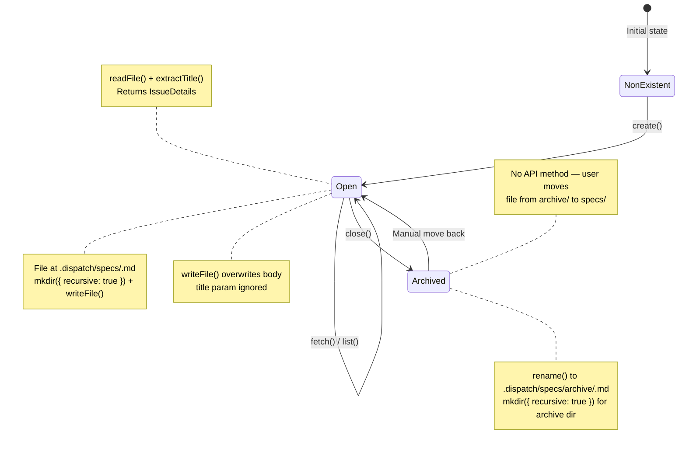

# Markdown Datasource

The markdown datasource reads and writes `.md` files from a local directory,
treating each file as a work item or spec. It is implemented in
`src/datasources/md.ts` and registered under the name `"md"` in the datasource
registry.

## What it does

The markdown datasource maps the five CRUD [`Datasource`](./overview.md#the-datasource-interface) interface operations
onto local filesystem operations:

| Operation | Filesystem operation | Target path |
|-----------|---------------------|-------------|
| `list()` | `readdir()` + `readFile()` for each `.md` file | `<cwd>/.dispatch/specs/` |
| `fetch()` | `readFile()` | `<cwd>/.dispatch/specs/<id>.md` |
| `update()` | `writeFile()` | `<cwd>/.dispatch/specs/<id>.md` |
| `close()` | `rename()` (move to archive) | `<cwd>/.dispatch/specs/archive/<id>.md` |
| `create()` | `writeFile()` | `<cwd>/.dispatch/specs/<slug>.md` |

All operations use Node.js `fs/promises` -- no external CLI tools or network
calls are required. This makes the markdown datasource fully offline and the
fastest of the three datasource implementations.

## Why it exists

The markdown datasource enables local-first workflows where markdown files
serve as the source of truth for work items. Use cases include:

- **Offline development.** No network access or external tool installation
  required.
- **Quick prototyping.** Create specs as markdown files without setting up a
  tracker.
- **Testing and development.** Use local files to test dispatch pipelines
  without connecting to GitHub or Azure DevOps.
- **Version-controlled specs.** Markdown files can be committed to git, giving
  the spec lifecycle full version control.

## Directory structure

The default specs directory is `.dispatch/specs/` relative to the working
directory (`src/datasources/md.ts:16`). This is not configurable through the
datasource interface -- it is always resolved as `join(cwd, ".dispatch/specs")`
(`src/datasources/md.ts:28`).

```
project/
  .dispatch/
    specs/
      my-feature.md
      bug-fix.md
      archive/
        completed-feature.md
```

The `archive/` subdirectory is created automatically by `close()` when the
first spec is archived. It does not exist by default.

## File naming and identification

Work items are identified by their filename. The `IssueDetails.number` field
contains the full filename including the `.md` extension (e.g.,
`"my-feature.md"`).

### Automatic `.md` extension handling

The `fetch()`, `update()`, and `close()` methods accept an `issueId` either
with or without the `.md` extension (`src/datasources/md.ts:108`):

- `fetch("my-feature")` reads `my-feature.md`
- `fetch("my-feature.md")` reads `my-feature.md`

### Title slugification in `create()`

When creating a new spec, the title is [slugified](../shared-utilities/slugify.md) to produce the filename
(`src/datasources/md.ts:133`):

```
title.toLowerCase()
  .replace(/[^a-z0-9]+/g, "-")   // Replace non-alphanumeric runs with hyphens
  .replace(/^-|-$/g, "")          // Trim leading/trailing hyphens
  + ".md"
```

Examples:

| Title | Filename |
|-------|----------|
| `"My New Feature"` | `my-new-feature.md` |
| `"Bug Fix #123"` | `bug-fix-123.md` |
| `"--Leading Dashes--"` | `leading-dashes.md` |
| `"UPPERCASE"` | `uppercase.md` |

### Filename collision risk

The `create()` method uses `writeFile()` without checking for existing files
(`src/datasources/md.ts:135`). If two specs produce the same slugified
filename, the second `create()` call will **silently overwrite** the first
file. There is no collision detection or conflict resolution.

For example, creating specs with titles `"My Feature!"` and `"My Feature?"` would
both produce `my-feature.md`, and the second call would overwrite the first.

## Title extraction

The `extractTitle()` helper function (`src/datasources/md.ts:40`, exported)
extracts the title from markdown content using a three-tier fallback:

1. **H1 heading.** Looks for the first `# Heading` line (ATX heading level 1)
   using the regex `/^#\s+(.+)$/m`. If found, returns the heading text
   (trimmed).
2. **First meaningful content line.** If no H1 heading exists, iterates through
   all lines looking for the first non-empty line. Leading markdown prefixes
   (`#`, `>`, `*`, `-`, and combinations) are stripped via the regex
   `/^[#>*\-]+\s*/`. If the cleaned line exceeds 80 characters, it is truncated
   at the last word boundary within 80 characters.
3. **Filename stem.** If the content has no usable text at all (empty or only
   whitespace/markdown prefixes), falls back to the filename stem (without
   `.md` extension) via `parsePath(filename).name`.

This means the `IssueDetails.title` may differ from the original title passed
to `create()`. The `create()` method writes the `body` parameter as-is to the
file. If the body does not contain an H1 heading, the title in subsequent
`list()` or `fetch()` calls will be derived from the first meaningful line or
the filename stem, not the original title.

### Title extraction examples

| Content | Filename | Extracted title |
|---------|----------|----------------|
| `"# My Feature\nSome details"` | `my-feature.md` | `"My Feature"` |
| `"No heading here\njust text"` | `my-feature.md` | `"No heading here"` |
| `"> A blockquote line"` | `my-feature.md` | `"A blockquote line"` |
| `"- A list item"` | `my-feature.md` | `"A list item"` |
| `""` (empty) | `my-feature.md` | `"my-feature"` |
| `"## Second level only"` | `notes.md` | `"Second level only"` |
| (80+ chars, no heading) | `long.md` | Truncated at last word boundary within 80 chars |

## Operation details

The following diagram shows the file-based state machine for a markdown spec's
lifecycle:



### `list()`

Lists all `.md` files in the specs directory, sorted alphabetically.

**Missing directory handling:** If the specs directory does not exist,
`list()` catches the `readdir()` error and returns an empty array
(`src/datasources/md.ts:90`). This is a graceful fallback -- no error is
thrown.

**Non-.md files ignored:** Only files ending in `.md` are included. Other
files (e.g., `.txt`, `.json`, images) are silently skipped.

**Subdirectories ignored:** `readdir()` returns both files and directories.
The `.endsWith(".md")` filter excludes directories, including the `archive/`
subdirectory. Archived specs are not included in list results.

**Field mapping:**

| Source | `IssueDetails` field | Value |
|--------|---------------------|-------|
| Filename | `number` | Full filename (e.g., `"my-feature.md"`) |
| First H1, first line, or filename | `title` | Extracted via `extractTitle()` (three-tier fallback) |
| File content | `body` | Complete file content as-is |
| _(not available)_ | `labels` | Always `[]` |
| _(hardcoded)_ | `state` | Always `"open"` |
| Directory path + filename | `url` | Local filesystem path (not a URL) |
| _(not available)_ | `comments` | Always `[]` |
| _(not available)_ | `acceptanceCriteria` | Always `""` |

**Note on `url`:** The `url` field contains a local filesystem path (e.g.,
`/home/user/project/.dispatch/specs/my-feature.md`), not an HTTP URL. This
differs from the GitHub and Azure DevOps datasources which provide web URLs.

### `fetch()`

Reads a single markdown file by its identifier. Throws an `ENOENT` error if
the file does not exist (unlike `list()`, which handles missing directories
gracefully).

### `update()`

Writes new body content to an existing spec file.

**Title parameter is ignored:** The `_title` parameter is accepted by the
method signature (to satisfy the `Datasource` interface) but is **not used**
(`src/datasources/md.ts:114`). Only the `body` parameter is written to the
file. If you need to change the title, you must include the new title as an H1
heading in the body content.

This means calling `update("my-spec", "New Title", "new body")` will write
`"new body"` to the file, and subsequent `fetch()` calls will extract the title
from the body content (falling back to the filename if no H1 heading is found).

### `close()`

Moves the spec file from the specs directory to an `archive/` subdirectory.

The archive directory is created with `mkdir({ recursive: true })` if it does
not already exist (`src/datasources/md.ts:126`).

**Not a state change:** Unlike GitHub and Azure DevOps where `close()` changes
a state field, the markdown datasource physically moves the file. The file
content is preserved unchanged.

**Reversibility:** To "reopen" an archived spec, manually move it back from
`archive/` to the parent specs directory.

**Archive collision:** If a file with the same name already exists in the
archive directory, `rename()` will overwrite it silently (this is standard
`fs.rename()` behavior on most platforms).

### `create()`

Creates a new spec file with a slugified filename.

**Directory creation:** The specs directory is created with
`mkdir({ recursive: true })` if it does not already exist. This handles the
case where `.dispatch/specs/` has never been created.

**Body as-is:** The `body` parameter is written to the file as-is. If you want
the title to be extractable by `extractTitle()`, include an H1 heading in the
body.

**Return value note:** The returned `IssueDetails.title` is extracted from the
written body via `extractTitle()`, which may differ from the `title` parameter
passed to `create()`. For example, `create("My Feature", "no heading here")`
returns `title: "my-feature"` (the filename stem) because the body has no H1
heading.

## Git lifecycle operations (no-ops)

The markdown datasource implements all eight git lifecycle methods from the
`Datasource` interface, but most are intentional no-ops. This is because the
markdown datasource is designed for local-first, offline workflows where git
branching, pushing, and PR creation do not apply.

| Method | Implementation | Return value |
|--------|---------------|-------------|
| `getDefaultBranch()` | Returns `"main"` without checking git | `"main"` |
| `getUsername()` | Shells out to `git config user.name`, slugifies the result | Slugified username or `"local"` |
| `buildBranchName()` | Constructs `<username>/dispatch/<number>-<slug>` | e.g., `"jdoe/dispatch/42-add-auth"` |
| `createAndSwitchBranch()` | No-op (empty function body) | `void` |
| `switchBranch()` | No-op (empty function body) | `void` |
| `pushBranch()` | No-op (empty function body) | `void` |
| `commitAllChanges()` | No-op (empty function body) | `void` |
| `createPullRequest()` | No-op (returns empty string) | `""` |

### Why no-ops instead of throwing

The dispatch pipeline calls git lifecycle methods on whatever datasource is
active. If the markdown datasource threw errors for these operations, the
pipeline would fail when used with `--source md`. By implementing them as
silent no-ops, the pipeline runs to completion -- it just skips the git
workflow steps. The markdown datasource user is expected to manage their own
git workflow (if any) outside of dispatch.

### `getUsername()`

The `getUsername()` method (`src/datasources/md.ts:143`) resolves the current
git user's name for use as a branch namespace prefix. It shells out to
`git config user.name` via `execFile` (the only external subprocess call in
the markdown datasource) and applies three-stage resolution:

1. **Success with non-empty output.** The raw `stdout` is trimmed and passed
   through [`slugify()`](../shared-utilities/slugify.md) to produce a
   branch-safe string (e.g., `"John Doe"` becomes `"john-doe"`).
2. **Success with empty output.** If `git config user.name` returns an empty
   string (user.name is set but blank), returns `"local"`.
3. **Error.** If the `git config` command fails (e.g., not a git repository,
   git not installed), the `catch` block returns `"local"`.

The returned username is used by `buildBranchName()` to construct the full
branch path. See [git-config documentation](https://git-scm.com/docs/git-config)
for details on how `user.name` is resolved across system, global, and local
configuration scopes.

### `buildBranchName()` format

`buildBranchName()` (`src/datasources/md.ts:154`) is fully implemented (not
a no-op). It produces a branch name with the format:

```
<username>/dispatch/<issueNumber>-<slugified-title>
```

The title is slugified using [`slugify(title, 50)`](../shared-utilities/slugify.md)
(truncated to 50 characters). Examples:

| Username | Issue number | Title | Branch name |
|----------|-------------|-------|-------------|
| `"jdoe"` | `42` | `"Add user authentication"` | `jdoe/dispatch/42-add-user-authentication` |
| `"local"` | `7` | `"Fix Bug #123!!"` | `local/dispatch/7-fix-bug-123` |

The `<username>/dispatch/` prefix serves as a namespace to distinguish
dispatch-created branches per user. This is useful for CI/CD pipelines that
want to trigger only on dispatch branches (e.g.,
`on: push: branches: ['*/dispatch/**']`).

### `createPullRequest()` signature

The `createPullRequest()` method accepts five parameters (`branchName`,
`issueNumber`, `title`, `body`, `opts`) to match the full `Datasource`
interface contract (`src/datasources/interface.ts:189`). All parameters are
ignored in the markdown implementation -- the method returns `""` immediately.
The `body` parameter was added to the interface to support custom PR
descriptions in the GitHub and Azure DevOps datasources.

### `getDefaultBranch()` hardcodes `"main"`

Unlike the GitHub and Azure DevOps datasources which detect the default branch
from `git symbolic-ref`, the markdown datasource returns `"main"` without any
git inspection. This avoids requiring a git repository to be present at all
when using `--source md`.

### Impact on the dispatch pipeline

When the dispatch pipeline runs with [`--source md`](../cli-orchestration/cli.md):

1. **Username resolution:** `getUsername()` shells out to `git config user.name`
   and slugifies the result (the only subprocess call in this datasource).
   Falls back to `"local"` on error or empty output.
2. **Branch naming:** `buildBranchName()` produces
   `<username>/dispatch/<number>-<slug>` (e.g.,
   `jdoe/dispatch/42-add-auth`), but the branch is never actually created
   because `createAndSwitchBranch()` is a no-op.
3. **Branching:** `createAndSwitchBranch()` is a no-op -- the pipeline stays
   on whatever branch is currently checked out.
4. **Committing:** `commitAllChanges()` is a no-op -- file changes from task
   execution remain uncommitted.
5. **Pushing:** `pushBranch()` is a no-op -- nothing is pushed to a remote.
6. **PR creation:** `createPullRequest()` returns `""` -- no PR is created.
   The pipeline handles the empty string as "no PR URL available".
7. **Auto-close:** `closeCompletedSpecIssues()` in the
   [datasource helpers](./datasource-helpers.md) still calls `close()` on
   completed specs, which moves them to the `archive/` directory.

## Encoding

All file operations (`readFile` and `writeFile`) explicitly specify `"utf-8"`
encoding (`src/datasources/md.ts:99,110,118,135`). This ensures consistent
text handling across platforms and avoids the Node.js default of returning
`Buffer` objects from `readFile`. See the
[Node.js `fs/promises` documentation](https://nodejs.org/api/fs.html#fspromisesreadfilepath-options)
for details on encoding behavior.

Files that contain non-UTF-8 byte sequences will be read as UTF-8 with
replacement characters (U+FFFD) per the WHATWG Encoding standard. There is no
validation that input files are valid UTF-8.

## Version control considerations

Markdown spec files live in the project directory and can be version-controlled
with git:

- **Committing specs:** Run `git add .dispatch/specs/` to stage spec files.
  The dispatch orchestrator may auto-commit changes during the dispatch
  pipeline.
- **Archived specs:** The `archive/` subdirectory should also be committed if
  you want to track closed specs.
- **`.gitignore`:** If you do not want specs committed, add `.dispatch/specs/`
  to `.gitignore`.
- **Concurrent access:** There is no file locking. If multiple dispatch
  processes or users modify the same spec file concurrently, data loss may
  occur from write conflicts.

## Troubleshooting

### Empty list results

Check that:
1. `.dispatch/specs/` exists relative to the working directory.
2. The directory contains `.md` files (not just `.txt` or other formats).
3. You are running from the correct working directory (or passing `--cwd`).

### "ENOENT: no such file or directory" on fetch

The specified spec file does not exist. Verify the filename and that it is in
`.dispatch/specs/`. Remember that `fetch()` accepts the ID with or without the
`.md` extension.

### Title not matching what was passed to `create()`

The title is extracted from the file content, not stored separately. The
extraction uses a three-tier fallback: first an H1 heading (`# Title`), then
the first meaningful content line (with markdown prefix stripping and 80-char
truncation), then the filename stem. Include an H1 heading in the body for
consistent, predictable titles.

### File overwritten on `create()`

Two specs with titles that produce the same slug (e.g., `"My Feature!"` and
`"My Feature?"`) will collide. Ensure unique titles or use distinct naming.

### Auto-detection does not select markdown

The auto-detection system (`detectDatasource()`) only matches GitHub and Azure
DevOps remote URLs. It never auto-detects `"md"`. To use the markdown
datasource, always pass [`--source md`](../cli-orchestration/cli.md) explicitly.

## Related documentation

- [Datasource Overview](./overview.md) -- Interface definitions, registry,
  and auto-detection
- [GitHub Datasource](./github-datasource.md) -- GitHub alternative
- [Azure DevOps Datasource](./azdevops-datasource.md) -- Azure DevOps
  alternative
- [Datasource Helpers](./datasource-helpers.md) -- Orchestration bridge that
  consumes datasource operations, including `close()` for auto-archiving
- [Integrations & Troubleshooting](./integrations.md) -- Cross-cutting
  error-handling concerns
- [Spec Generation](../spec-generation/overview.md) -- Pipeline that may write
  spec files consumed by this datasource
- [Slugify Utility](../shared-utilities/slugify.md) -- General slug generation
  used by `buildBranchName()` and related operations
- [Datasource Testing](./testing.md) -- Test coverage for datasource implementations
