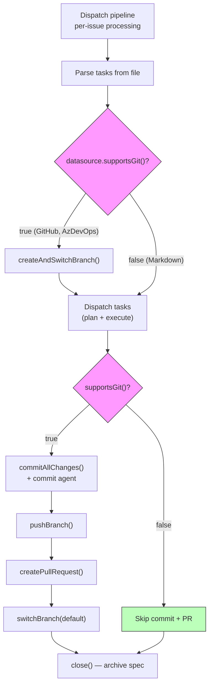
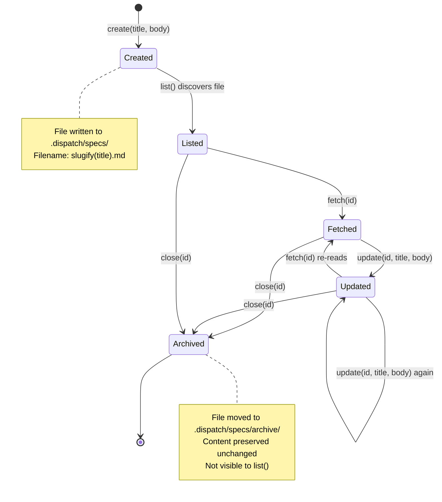

# Markdown Datasource

The markdown datasource reads and writes `.md` files from a local directory,
treating each file as a work item or spec. It is implemented in
`src/datasources/md.ts` and registered under the name `"md"` in the datasource
registry.

## What it does

The markdown datasource maps the five CRUD [`Datasource`](./overview.md#the-datasource-interface) interface operations
onto local filesystem operations:

| Operation | Filesystem operation | Target path |
|-----------|---------------------|-------------|
| `list()` | `readdir()` + `readFile()` for each `.md` file | `<cwd>/.dispatch/specs/` |
| `fetch()` | `readFile()` | `<cwd>/.dispatch/specs/<id>.md` |
| `update()` | `writeFile()` | `<cwd>/.dispatch/specs/<id>.md` |
| `close()` | `rename()` (move to archive) | `<cwd>/.dispatch/specs/archive/<id>.md` |
| `create()` | `writeFile()` | `<cwd>/.dispatch/specs/<slug>.md` |

All operations use Node.js `fs/promises` -- no external CLI tools or network
calls are required. This makes the markdown datasource fully offline and the
fastest of the three datasource implementations.

## Why it exists

The markdown datasource enables local-first workflows where markdown files
serve as the source of truth for work items. Use cases include:

- **Offline development.** No network access or external tool installation
  required.
- **Quick prototyping.** Create specs as markdown files without setting up a
  tracker.
- **Testing and development.** Use local files to test dispatch pipelines
  without connecting to GitHub or Azure DevOps.
- **Version-controlled specs.** Markdown files can be committed to git, giving
  the spec lifecycle full version control.

## Directory structure

The default specs directory is `.dispatch/specs/` relative to the working
directory (`src/datasources/md.ts:16`). This is not configurable through the
datasource interface -- it is always resolved as `join(cwd, ".dispatch/specs")`.

```
project/
  .dispatch/
    specs/
      my-feature.md
      bug-fix.md
      archive/
        completed-feature.md
```

The `archive/` subdirectory is created automatically by `close()` when the
first spec is archived. It does not exist by default.

## File naming and identification

Work items are identified by their filename. The `IssueDetails.number` field
contains the full filename including the `.md` extension (e.g.,
`"my-feature.md"`).

### Automatic `.md` extension handling

The `fetch()`, `update()`, and `close()` methods accept an `issueId` either
with or without the `.md` extension (`src/datasources/md.ts:79`):

- `fetch("my-feature")` reads `my-feature.md`
- `fetch("my-feature.md")` reads `my-feature.md`

### Title slugification in `create()`

When creating a new spec, the title is [slugified](../shared-utilities/slugify.md) to produce the filename
(`src/datasources/md.ts:104`):

```
title.toLowerCase()
  .replace(/[^a-z0-9]+/g, "-")   // Replace non-alphanumeric runs with hyphens
  .replace(/^-|-$/g, "")          // Trim leading/trailing hyphens
  + ".md"
```

Examples:

| Title | Filename |
|-------|----------|
| `"My New Feature"` | `my-new-feature.md` |
| `"Bug Fix #123"` | `bug-fix-123.md` |
| `"--Leading Dashes--"` | `leading-dashes.md` |
| `"UPPERCASE"` | `uppercase.md` |

### Filename collision risk

The `create()` method uses `writeFile()` without checking for existing files
(`src/datasources/md.ts:106`). If two specs produce the same slugified
filename, the second `create()` call will **silently overwrite** the first
file. There is no collision detection or conflict resolution.

For example, creating specs with titles `"My Feature!"` and `"My Feature?"` would
both produce `my-feature.md`, and the second call would overwrite the first.

## Title extraction

The `extractTitle()` helper function (`src/datasources/md.ts:40`, exported)
extracts the title from markdown content using a three-tier fallback:

1. **H1 heading:** Looks for the first `# Heading` line (ATX heading level 1)
   using the regex `/^#\s+(.+)$/m`. If found, returns the heading text
   (trimmed).
2. **First meaningful content line:** If no H1 heading exists, scans lines for
   the first non-empty line, strips leading markdown prefixes (`#`, `>`, `*`,
   `-`, or combinations), and truncates to approximately 80 characters at a
   word boundary.
3. **Filename stem:** If the content has no usable text (empty file or only
   whitespace/markdown prefixes), falls back to the filename without the `.md`
   extension.

This means the `IssueDetails.title` may differ from the original title passed
to `create()`. The `create()` method writes the `body` parameter as-is to the
file. If the body does not contain an H1 heading, the title in subsequent
`list()` or `fetch()` calls will be extracted from the first meaningful line,
or will fall back to the filename stem.

## Operation details

### `list()`

Lists all `.md` files in the specs directory, sorted alphabetically.

**Missing directory handling:** If the specs directory does not exist,
`list()` catches the `readdir()` error and returns an empty array
(`src/datasources/md.ts:61`). This is a graceful fallback -- no error is
thrown.

**Non-.md files ignored:** Only files ending in `.md` are included. Other
files (e.g., `.txt`, `.json`, images) are silently skipped.

**Subdirectories ignored:** `readdir()` returns both files and directories.
The `.endsWith(".md")` filter excludes directories, including the `archive/`
subdirectory. Archived specs are not included in list results.

**Field mapping:**

| Source | `IssueDetails` field | Value |
|--------|---------------------|-------|
| Filename | `number` | Full filename (e.g., `"my-feature.md"`) |
| First H1 or filename | `title` | Extracted via `extractTitle()` |
| File content | `body` | Complete file content as-is |
| _(not available)_ | `labels` | Always `[]` |
| _(hardcoded)_ | `state` | Always `"open"` |
| Directory path + filename | `url` | Local filesystem path (not a URL) |
| _(not available)_ | `comments` | Always `[]` |
| _(not available)_ | `acceptanceCriteria` | Always `""` |

**Note on `url`:** The `url` field contains a local filesystem path (e.g.,
`/home/user/project/.dispatch/specs/my-feature.md`), not an HTTP URL. This
differs from the GitHub and Azure DevOps datasources which provide web URLs.

### `fetch()`

Reads a single markdown file by its identifier. Throws an `ENOENT` error if
the file does not exist (unlike `list()`, which handles missing directories
gracefully).

### `update()`

Writes new body content to an existing spec file.

**Title parameter is ignored:** The `_title` parameter is accepted by the
method signature (to satisfy the `Datasource` interface) but is **not used**
(`src/datasources/md.ts:85`). Only the `body` parameter is written to the
file. If you need to change the title, you must include the new title as an H1
heading in the body content.

This means calling `update("my-spec", "New Title", "new body")` will write
`"new body"` to the file, and subsequent `fetch()` calls will extract the title
from the body content (falling back to the filename if no H1 heading is found).

### `close()`

Moves the spec file from the specs directory to an `archive/` subdirectory.

The archive directory is created with `mkdir({ recursive: true })` if it does
not already exist (`src/datasources/md.ts:97`).

**Not a state change:** Unlike GitHub and Azure DevOps where `close()` changes
a state field, the markdown datasource physically moves the file. The file
content is preserved unchanged.

**Reversibility:** To "reopen" an archived spec, manually move it back from
`archive/` to the parent specs directory.

**Archive collision:** If a file with the same name already exists in the
archive directory, `rename()` will overwrite it silently (this is standard
`fs.rename()` behavior on most platforms).

### `create()`

Creates a new spec file with a slugified filename.

**Directory creation:** The specs directory is created with
`mkdir({ recursive: true })` if it does not already exist. This handles the
case where `.dispatch/specs/` has never been created.

**Body as-is:** The `body` parameter is written to the file as-is. If you want
the title to be extractable by `extractTitle()`, include an H1 heading in the
body.

**Return value note:** The returned `IssueDetails.title` is extracted from the
written body via `extractTitle()`, which may differ from the `title` parameter
passed to `create()`. For example, `create("My Feature", "no heading here")`
returns `title: "my-feature"` (the filename stem) because the body has no H1
heading.

## The `supportsGit()` method

The markdown datasource returns `false` from `supportsGit()`
(`src/datasources/md.ts:86-88`). This boolean flag is the mechanism by which
the [dispatch pipeline](../planning-and-dispatch/overview.md) decides whether
to call git lifecycle methods on a datasource. The pipeline checks
`datasource.supportsGit()` before every git operation — branching, committing,
pushing, and PR creation — and **skips the operation entirely** when it returns
`false` (`src/orchestrator/dispatch-pipeline.ts:310,521,536,622,632,668`).

This gating pattern is what makes the markdown datasource safe to use with the
dispatch pipeline. Without the `supportsGit()` guard, the pipeline would call
the git lifecycle methods, which would throw `UnsupportedOperationError` and
fail the run.

### How the pipeline gates operations via `supportsGit()`



## Git lifecycle operations

The markdown datasource implements all git lifecycle methods from the
`Datasource` interface. Three methods are functional (`getDefaultBranch`,
`getUsername`, `buildBranchName`), while five **throw
`UnsupportedOperationError`** to signal that the operation is not applicable
to a local-filesystem datasource.

| Method | Implementation | Behavior |
|--------|---------------|----------|
| `getDefaultBranch()` | Returns `"main"` without checking git | Always returns `"main"` |
| `getUsername()` | `git config user.name`, slugified; falls back to `"local"` | Branch-safe username or `"local"` |
| `buildBranchName()` | Same slug logic as GitHub/Azure DevOps | `<username>/dispatch/<number>-<slug>` |
| `createAndSwitchBranch()` | **Throws** `UnsupportedOperationError` | Never succeeds |
| `switchBranch()` | **Throws** `UnsupportedOperationError` | Never succeeds |
| `pushBranch()` | **Throws** `UnsupportedOperationError` | Never succeeds |
| `commitAllChanges()` | **Throws** `UnsupportedOperationError` | Never succeeds |
| `createPullRequest()` | **Throws** `UnsupportedOperationError` | Never succeeds |

### Why throwing instead of no-ops

The five git lifecycle methods (`createAndSwitchBranch`, `switchBranch`,
`pushBranch`, `commitAllChanges`, `createPullRequest`) throw
`UnsupportedOperationError` rather than silently succeeding. This is a
defense-in-depth design: if a caller bypasses the `supportsGit()` check and
calls these methods directly, it receives an explicit error rather than a
silent no-op that could mask a bug.

The [`UnsupportedOperationError`](../shared-utilities/errors.md) class (from `src/helpers/errors.ts`) includes
an `operation` property that identifies which method was called, aiding
diagnostics:

```
UnsupportedOperationError: Operation not supported: createAndSwitchBranch
```

This is safe because the dispatch pipeline always checks `supportsGit()` before
calling these methods (see [above](#the-supportsgit-method)). The errors would
only surface if a new code path forgot to check the flag — in which case the
error is a valuable bug signal. See the [dispatch pipeline tests](../testing/dispatch-pipeline-tests.md#supportsgit-guard)
for how the `supportsGit()` guard is verified.

### Why `buildBranchName()` and `getUsername()` are fully implemented

Despite `supportsGit()` returning `false`, both `buildBranchName()` and
`getUsername()` are fully functional. This is because these methods are called
independently of the git lifecycle path:

- **`buildBranchName()`** is used for informational purposes (e.g., dry-run
  output, logging, TUI display) even when no branch will actually be created.
  It produces `<username>/dispatch/<number>-<slug>` using the same
  slugification logic as the other datasources.
- **`getUsername()`** is called during branch name construction and may be
  used by other parts of the pipeline for display purposes. It shells out to
  `git config user.name` and falls back to `"local"` (not `"unknown"` like
  the GitHub and Azure DevOps datasources) to reflect the local-first nature
  of the markdown datasource.

### `getDefaultBranch()` hardcodes `"main"`

Unlike the GitHub and Azure DevOps datasources which detect the default branch
from `git symbolic-ref`, the markdown datasource returns `"main"` without any
git inspection. This avoids requiring a git repository to be present at all
when using `--source md`.

### Impact on the dispatch pipeline

When the dispatch pipeline runs with [`--source md`](../cli-orchestration/cli.md),
all git lifecycle operations are **skipped** because `supportsGit()` returns
`false`:

1. **Branching:** Skipped — the pipeline stays on whatever branch is currently
   checked out.
2. **Committing:** Skipped — file changes from task execution remain
   uncommitted.
3. **Pushing:** Skipped — nothing is pushed to a remote.
4. **PR creation:** Skipped — no PR is created and no PR URL is logged.
5. **Auto-close:** `close()` is still called on completed specs, which moves
   them to the `archive/` directory. The `close()` method is a CRUD operation
   (not a git lifecycle method) and is not gated by `supportsGit()`.

## The `extractTitle()` function as an outbound dependency

The `extractTitle()` function exported from `src/datasources/md.ts:41` is not
only used internally by the markdown datasource — it is imported by two other
groups as an outbound dependency:

| Consumer | Import location | Purpose |
|----------|----------------|---------|
| Spec agent | `src/agents/spec.ts:19` | Extracts the title from generated spec content |
| Spec pipeline | `src/orchestrator/spec-pipeline.ts:17` | Extracts H1 title for file renaming after spec generation |

This makes `extractTitle()` a shared utility that happens to live in the
markdown datasource module. Changes to its behavior affect both the markdown
datasource's `list()`/`fetch()` title extraction and the spec generation
pipeline's file naming.

### Front-matter and non-standard markdown behavior

The `extractTitle()` regex (`/^#\s+(.+)$/m`) does **not** handle YAML
front-matter blocks. A file beginning with:

```markdown
---
title: My Feature
---

# Actual Title
```

will match the H1 heading (`# Actual Title`) correctly because the regex uses
the `m` (multiline) flag and scans for the first `# ` pattern anywhere in the
content. However, a file beginning with `---` that has **no H1 heading** will
fall through to the second-tier extraction, which would return the first
meaningful line — likely the `title: My Feature` YAML line (after stripping
the leading `---`).

**Key edge cases:**

| File content | Extracted title | Reason |
|--------------|----------------|--------|
| `# My Title\nBody` | `My Title` | H1 heading found |
| `---\ntitle: Foo\n---\n# Bar` | `Bar` | H1 heading found after front-matter |
| `---\ntitle: Foo\n---\nBody text` | `title: Foo` | No H1; first meaningful line after `---` stripped |
| `Plain text only` | `Plain text only` | No H1; first meaningful line used |
| `## Sub heading` | `Sub heading` | No H1; markdown prefix stripped from first line |
| (empty file) | `filename-stem` | Fallback to filename without `.md` |

## Filename-based identification and downstream interaction

The markdown datasource uses the **full filename** (e.g., `"my-feature.md"`)
as the `IssueDetails.number` field (`src/datasources/md.ts:72`). This differs
from the GitHub and Azure DevOps datasources which use numeric IDs (`"42"`,
`"1234"`).

This has implications for downstream consumers that may expect numeric IDs:

- **`parseIssueFilename()`** in `src/orchestrator/datasource-helpers.ts` uses
  the regex `/^(\d+)-(.+)\.md$/` to extract issue IDs from temp filenames.
  Files from the markdown datasource that don't start with digits (e.g.,
  `my-feature.md`) will **not** match this regex, and `parseIssueFilename()`
  returns `null`. This means:
    - Auto-close via `closeCompletedSpecIssues()` requires filenames that
      start with digits (e.g., `42-my-feature.md`). Specs created via
      `create()` with non-numeric titles will not be auto-closed on the
      originating tracker.
    - The datasource sync step (`datasource.update()`) uses the original
      filename as the issue ID, which works correctly for the markdown
      datasource since the filename **is** the identifier.
- **Branch naming:** `buildBranchName("my-feature.md", "My Feature", "local")`
  produces `local/dispatch/my-feature.md-my-feature`, which includes the `.md`
  extension in the branch name. This is cosmetically unusual but functionally
  harmless since branches are not created when `supportsGit()` returns `false`.

## Race conditions and concurrent access

The markdown datasource has no file-locking mechanism. All operations use
standard `fs/promises` calls (`readFile`, `writeFile`, `readdir`, `rename`)
without advisory locks or atomic-rename patterns.

**Concurrent write risks:**

| Scenario | Risk | Impact |
|----------|------|--------|
| Two processes call `update()` on the same file | Last write wins; first write is silently lost | Data loss |
| One process calls `close()` while another calls `fetch()` | `fetch()` may throw `ENOENT` if the file is renamed between the `readdir` and `readFile` calls | Transient error |
| Two processes call `create()` with titles producing the same slug | Second `writeFile` silently overwrites the first | Data loss |
| One process calls `list()` while another calls `close()` | `list()` may include the file in its `readdir` result but fail to `readFile` it (already moved to archive) | Transient error in `list()` |

In practice, this is unlikely to be a problem because:
1. The dispatch pipeline processes issues sequentially per file.
2. The markdown datasource is designed for single-developer local-first
   workflows.
3. Concurrent worktree dispatches target different spec files.

If concurrent access becomes a requirement, external locking (e.g., `flock`,
`proper-lockfile`) would be needed.

## File lifecycle

A markdown spec file follows a linear lifecycle from creation through archival:



Key lifecycle properties:
- **`list()` only reads the top-level directory** — it does not recurse into
  `archive/`. Once a spec is archived, it disappears from list results.
- **`close()` is a physical move**, not a state change — the file content is
  preserved but its location changes.
- **Archived files can be "reopened"** by manually moving them back from
  `archive/` to the parent specs directory.
- **There is no "deleted" state** — `close()` archives rather than deletes,
  preserving an audit trail.

## Version control considerations

Markdown spec files live in the project directory and can be version-controlled
with git:

- **Committing specs:** Run `git add .dispatch/specs/` to stage spec files.
  The dispatch orchestrator may auto-commit changes during the dispatch
  pipeline.
- **Archived specs:** The `archive/` subdirectory should also be committed if
  you want to track closed specs.
- **`.gitignore`:** If you do not want specs committed, add `.dispatch/specs/`
  to `.gitignore`.
- **Concurrent access:** There is no file locking. If multiple dispatch
  processes or users modify the same spec file concurrently, data loss may
  occur from write conflicts.

## Troubleshooting

### Empty list results

Check that:
1. `.dispatch/specs/` exists relative to the working directory.
2. The directory contains `.md` files (not just `.txt` or other formats).
3. You are running from the correct working directory (or passing `--cwd`).

### "ENOENT: no such file or directory" on fetch

The specified spec file does not exist. Verify the filename and that it is in
`.dispatch/specs/`. Remember that `fetch()` accepts the ID with or without the
`.md` extension.

### Title not matching what was passed to `create()`

The title is extracted from the file content, not stored separately. If the
body does not contain an H1 heading (`# Title`), the title is extracted from
the first meaningful content line (stripped of markdown prefixes, truncated to
~80 characters). If the file has no usable text at all, the title falls back
to the filename stem. Include an H1 heading in the body for consistent titles.

### File overwritten on `create()`

Two specs with titles that produce the same slug (e.g., `"My Feature!"` and
`"My Feature?"`) will collide. Ensure unique titles or use distinct naming.

### Auto-detection does not select markdown

The auto-detection system (`detectDatasource()`) only matches GitHub and Azure
DevOps remote URLs. It never auto-detects `"md"`. To use the markdown
datasource, always pass [`--source md`](../cli-orchestration/cli.md) explicitly.

### `list()` silently returns empty on filesystem errors

The `list()` method catches **all** `readdir()` errors and returns an empty
array (`src/datasources/md.ts:93-97`). This includes not just "directory does
not exist" but also permission denied, I/O errors, and any other filesystem
failure. If `list()` unexpectedly returns no results, check directory
permissions (`ls -la .dispatch/specs/`) in addition to verifying the directory
exists.

In contrast, `fetch()` lets `readFile()` errors propagate — a missing file
or permission error will throw to the caller.

### Symlinks in the specs directory

`readdir()` returns symlink names along with regular files. If the specs
directory contains symlinks to `.md` files, they will be included in `list()`
results and `readFile()` will follow them transparently. There is no symlink
detection or rejection — a symlink pointing to a file outside `.dispatch/specs/`
will be read and returned as a normal spec. The `close()` method's `rename()`
call will move the symlink itself (not the target) to the archive directory.

### File permissions for `.dispatch/specs/`

The specs directory and its files inherit the default permissions of the
project directory. On Unix systems, `mkdir({ recursive: true })` creates
directories with the default umask (typically `0755`), and `writeFile()`
creates files with mode `0644`. If the dispatch process runs under a different
user than the directory owner, ensure the user has read-write access to
`.dispatch/specs/` and its contents.

### Running the markdown datasource tests

```sh
# Run the md-datasource unit tests (getUsername, buildBranchName, supportsGit, git lifecycle errors)
npx vitest run src/tests/md-datasource.test.ts

# Run the markdown datasource CRUD tests (list, fetch, update, close, create, extractTitle)
npx vitest run src/tests/datasource.test.ts

# Run the cross-datasource git lifecycle tests (includes Section J for markdown)
npx vitest run src/tests/git.test.ts
```

See [Datasource Testing](./testing.md) for full test coverage details.

## Related documentation

- [Datasource Overview](./overview.md) -- Interface definitions, registry,
  and auto-detection
- [GitHub Datasource](./github-datasource.md) -- GitHub alternative
- [Azure DevOps Datasource](./azdevops-datasource.md) -- Azure DevOps
  alternative
- [Datasource Helpers](./datasource-helpers.md) -- Orchestration bridge that
  consumes datasource operations, including `close()` for auto-archiving
- [Integrations & Troubleshooting](./integrations.md) -- Cross-cutting
  error-handling concerns
- [Issue Fetching Overview](../issue-fetching/overview.md) -- Deprecated
  fetching layer overview; this datasource is its offline replacement
- [Spec Generation](../spec-generation/overview.md) -- Pipeline that may write
  spec files consumed by this datasource
- [Slugify Utility](../shared-utilities/slugify.md) -- General slug generation
  used by `buildBranchName()` and related operations
- [Datasource Testing](./testing.md) -- Test coverage for datasource implementations
- [CLI Argument Parser](../cli-orchestration/cli.md) -- `--source md` flag
  documentation for selecting the markdown datasource
- [Branch Name Validation](../git-and-worktree/branch-validation.md) --
  Validation rules enforced on branch names generated by `buildBranchName()`
- [Shared Errors](../shared-utilities/errors.md) -- `UnsupportedOperationError`
  thrown by unsupported git lifecycle methods
- [Planning & Dispatch Pipeline](../planning-and-dispatch/overview.md) --
  Pipeline that gates git operations via `supportsGit()`
