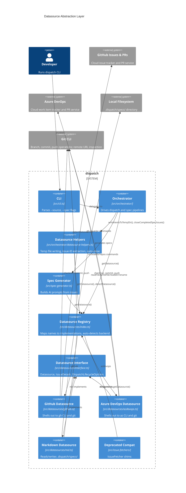
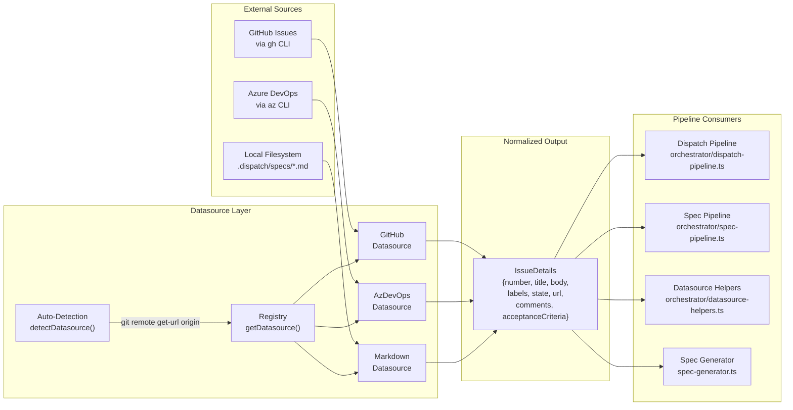
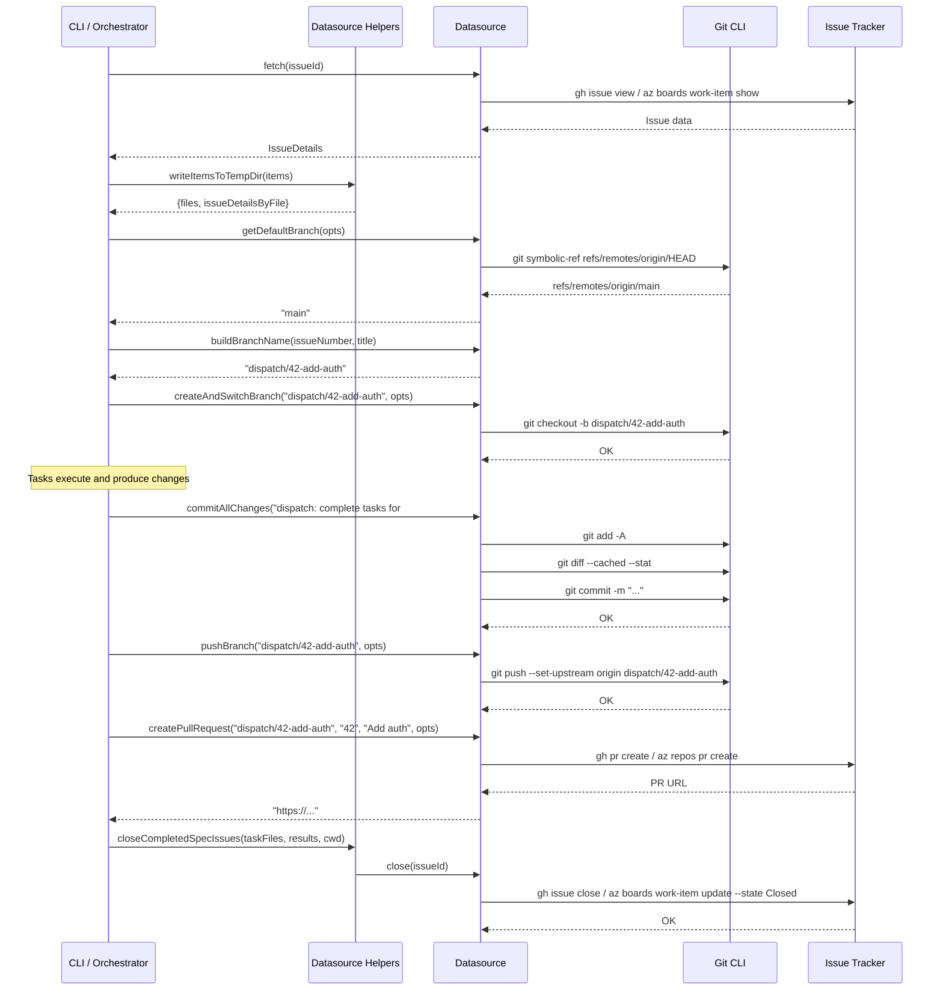

# Datasource Abstraction & Implementations

The datasource system is a strategy-pattern abstraction that normalizes access
to work items and specs across three backends: GitHub Issues, Azure DevOps Work
Items, and local markdown files. It provides a unified CRUD contract so that the
orchestrator, spec generation, and CLI layers operate on the same `IssueDetails`
data structure regardless of where the underlying data lives.

## What it does

The datasource system:

1. **Defines a common interface** (`Datasource`) with twelve operations: five
   CRUD methods (`list`, `fetch`, `update`, `close`, `create`) and seven git
   lifecycle methods (`getDefaultBranch`, `buildBranchName`,
   `createAndSwitchBranch`, `switchBranch`, `pushBranch`, `commitAllChanges`,
   `createPullRequest`).
2. **Provides three implementations**: GitHub (via the `gh` CLI), Azure DevOps
   (via the `az` CLI), and local markdown files (via Node.js `fs`).
3. **Auto-detects the correct backend** by inspecting the git `origin` remote
   URL, or accepts an explicit `--source` flag.
4. **Normalizes all data** into `IssueDetails` objects that the rest of the
   pipeline consumes without knowing which tracker produced them.
5. **Manages git lifecycle operations** (branching, committing, pushing, and
   pull request creation) so that the dispatch pipeline can work with any
   backend without knowing the platform-specific PR conventions.

## Why it exists

dispatch supports teams using different issue trackers and local-first
workflows. Rather than coupling the [spec generator](../spec-generation/overview.md) and [orchestrator](../cli-orchestration/orchestrator.md) to a single
tracker's API, the datasource layer provides a uniform interface so the rest of
the pipeline is agnostic to the data source.

The system uses CLI tools (`gh`, `az`) instead of native REST clients or SDKs
for three reasons:

1. **Authentication reuse.** Users authenticate once via `gh auth login` or
   `az login`. The CLI tools manage token storage, refresh, and multi-account
   switching. Using HTTP APIs would require dispatch to implement its own
   credential management.
2. **Zero additional dependencies.** No GitHub REST/GraphQL client library
   (`@octokit/rest`) or Azure DevOps SDK (`azure-devops-node-api`) is added to
   the dependency tree. The only runtime requirement is that the CLI tool is
   installed on the host.
3. **Simplicity.** A single `execFile` call with JSON output replaces dozens of
   lines of API client setup, pagination handling, and error mapping. The
   trade-off is a runtime dependency on external binaries being installed and
   on PATH.

The markdown datasource enables fully offline operation where markdown files in
`.dispatch/specs/` serve as the source of truth, with no network calls or
external tool requirements.

## Relationship to the deprecated issue-fetcher system

The datasource system supersedes the older `IssueFetcher` interface defined in
`src/issue-fetcher.ts`. The previous system supported only `fetch`, `update`,
and `close` operations and only covered the `github` and `azdevops` backends
(no local markdown support).

The deprecated compatibility layer in `src/issue-fetchers/index.ts` provides
backwards-compatible shims that delegate to the new datasource implementations.
All exports from the old `issue-fetchers/` directory are marked `@deprecated`
and are slated for removal. No code outside the deprecated layer currently
imports from the old paths.

For details on the deprecated layer, see the
[deprecated compatibility documentation](../issue-fetching/overview.md).

## Key source files

| File | Role |
|------|------|
| `src/datasources/interface.ts` | Defines `Datasource`, `IssueDetails`, `IssueFetchOptions`, `DispatchLifecycleOptions`, and `DatasourceName` |
| `src/datasources/index.ts` | Registry, `DATASOURCE_NAMES`, `getDatasource()`, and `detectDatasource()` |
| `src/datasources/github.ts` | GitHub implementation via `gh` CLI |
| `src/datasources/azdevops.ts` | Azure DevOps implementation via `az` CLI |
| `src/datasources/md.ts` | Local markdown file implementation via `fs/promises` |
| `src/orchestrator/datasource-helpers.ts` | Orchestration bridge: temp file writing, issue ID extraction, auto-close logic (see [Datasource Helpers](./datasource-helpers.md)) |
| `src/tests/datasource.test.ts` | Test suite covering the md datasource and registry (see [Testing](./testing.md)) |

## Architecture

The datasource system sits between the external data sources and the pipeline
consumers (orchestrator, spec generator, CLI). All communication flows through
the `Datasource` interface, which normalizes tracker-specific data into
`IssueDetails` objects.



## Data flow

The following diagram shows how data flows from external sources through the
datasource layer into the pipeline consumers:



## Issue-to-completion lifecycle

The following sequence diagram shows the full lifecycle of an issue from
fetch through task completion, including the git lifecycle operations managed
by the datasource:



## The `Datasource` interface

Every datasource implementation must satisfy a twelve-method contract defined
in `src/datasources/interface.ts`. The interface is split into two groups:
five CRUD operations for issue/spec management, and seven git lifecycle
operations for branching, committing, pushing, and pull request creation.

### CRUD operations

| Method | Signature | Purpose |
|--------|-----------|---------|
| `list` | `(opts?) => Promise<IssueDetails[]>` | List available issues or specs |
| `fetch` | `(issueId, opts?) => Promise<IssueDetails>` | Fetch a single issue by ID |
| `update` | `(issueId, title, body, opts?) => Promise<void>` | Update title and/or body |
| `close` | `(issueId, opts?) => Promise<void>` | Close or resolve an issue |
| `create` | `(title, body, opts?) => Promise<IssueDetails>` | Create a new issue |

All CRUD methods accept an optional `IssueFetchOptions` parameter with `cwd`,
`org`, and `project` fields. The `org` and `project` fields are only meaningful
for the Azure DevOps datasource.

### Git lifecycle operations

These methods manage the branching, committing, pushing, and pull request
workflow that the dispatch pipeline uses after completing tasks for an issue.

| Method | Signature | Purpose |
|--------|-----------|---------|
| `getDefaultBranch` | `(opts) => Promise<string>` | Detect the repository's default branch (`main` or `master`) |
| `buildBranchName` | `(issueNumber, title) => string` | Build a sanitized branch name from an issue number and title |
| `createAndSwitchBranch` | `(branchName, opts) => Promise<void>` | Create a new branch and switch to it; if it already exists, switch to it |
| `switchBranch` | `(branchName, opts) => Promise<void>` | Switch to an existing branch |
| `pushBranch` | `(branchName, opts) => Promise<void>` | Push a branch to the remote with `--set-upstream` |
| `commitAllChanges` | `(message, opts) => Promise<void>` | Stage all changes (`git add -A`) and commit; no-ops if nothing staged |
| `createPullRequest` | `(branchName, issueNumber, title, opts) => Promise<string>` | Create a PR linking the branch to the issue; returns the PR URL |

All git lifecycle methods accept a required `DispatchLifecycleOptions`
parameter (see [below](#the-dispatchlifecycleoptions-interface)). The
`buildBranchName` method is synchronous -- all others are async.

### Branch naming convention

All three datasource implementations use the same branch naming convention:

```
dispatch/<issueNumber>-<slugified-title>
```

The title is slugified identically to the markdown datasource's `create()`
filename slug: lowercased, non-alphanumeric runs replaced with hyphens,
leading/trailing hyphens trimmed, truncated to 50 characters. Examples:

| Issue number | Title | Branch name |
|-------------|-------|-------------|
| `42` | `"Add user authentication"` | `dispatch/42-add-user-authentication` |
| `7` | `"Fix Bug #123!!"` | `dispatch/7-fix-bug-123` |

The `dispatch/` prefix serves as a namespace to distinguish dispatch-created
branches from manually created ones. This is useful for CI/CD pipelines that
want to trigger only on dispatch branches (e.g.,
`on: push: branches: ['dispatch/**']`).

### Pull request auto-close conventions

Each datasource creates pull requests with platform-specific issue-linking
keywords in the PR body:

| Datasource | PR body content | Effect on merge |
|------------|----------------|-----------------|
| **GitHub** | `Closes #<issueNumber>` | GitHub auto-closes the linked issue when the PR is merged |
| **Azure DevOps** | `Resolves AB#<issueNumber>` | Azure DevOps resolves the linked work item; the `--work-items` flag also creates a formal link |
| **Markdown** | _(no PR created)_ | Returns `""` -- the markdown datasource does not create PRs |

### Existing PR handling

Both the GitHub and Azure DevOps implementations handle the case where a pull
request already exists for the branch:

- **GitHub:** If `gh pr create` fails with "already exists", it falls back to
  `gh pr view <branch> --json url --jq .url` to return the existing PR URL.
- **Azure DevOps:** If `az repos pr create` fails with "already exists", it
  falls back to `az repos pr list --source-branch <branch> --status active`
  to find and return the existing PR URL.

### The `IssueDetails` interface

All datasources normalize their platform-specific data into this common
structure:

| Field | Type | Description |
|-------|------|-------------|
| `number` | `string` | Issue ID, work item ID, or filename |
| `title` | `string` | Title of the issue |
| `body` | `string` | Full description (may contain HTML or markdown) |
| `labels` | `string[]` | Labels, tags, or categories |
| `state` | `string` | Current state (open, closed, active, etc.) |
| `url` | `string` | URL to the issue in the tracker's web UI |
| `comments` | `string[]` | Discussion comments as `**author:** text` |
| `acceptanceCriteria` | `string` | Acceptance criteria (Azure DevOps only) |

### The `DatasourceName` type

`DatasourceName` is defined as `"github" | "azdevops" | "md"` -- a TypeScript
string literal union type. This differs from the older `IssueSourceName` which
was `"github" | "azdevops"` (no markdown support). When adding a new datasource,
you must update both the union type in `src/datasources/interface.ts` and the
registry map in `src/datasources/index.ts`.

### The `DispatchLifecycleOptions` interface

Git lifecycle methods accept this options interface instead of
`IssueFetchOptions`:

| Field | Type | Description |
|-------|------|-------------|
| `cwd` | `string` (required) | Working directory (git repo root) |

Unlike `IssueFetchOptions` where `cwd` is optional (defaulting to
`process.cwd()`), `DispatchLifecycleOptions` requires `cwd` explicitly. The
`org` and `project` fields are not needed because git lifecycle operations work
directly with the local git repository, not with tracker APIs.

The Azure DevOps `createPullRequest` method is the one exception that also
shells out to `az repos pr create`, but it derives the organization and project
context from the `az` CLI defaults or the git remote URL rather than from
explicit options.

## The datasource registry

The registry in `src/datasources/index.ts` maps `DatasourceName` values to
`Datasource` implementations:

| Export | Purpose |
|--------|---------|
| `DATASOURCE_NAMES` | Array of all registered datasource names (for CLI validation and help text) |
| `getDatasource(name)` | Returns the datasource implementation or throws if not registered |
| `detectDatasource(cwd)` | Auto-detects the datasource from the git `origin` remote URL |

### Auto-detection

When the user omits `--source`, `detectDatasource(cwd)` inspects the git
`origin` remote URL and matches it against patterns in order (first match wins):

| Pattern | Detected source | Example URLs |
|---------|----------------|-------------|
| `/github\.com/i` | `github` | `https://github.com/owner/repo`, `git@github.com:owner/repo.git` |
| `/dev\.azure\.com/i` | `azdevops` | `https://dev.azure.com/org/project` |
| `/visualstudio\.com/i` | `azdevops` | `https://org.visualstudio.com/project` |

The `visualstudio.com` pattern exists because Azure DevOps was formerly known
as Visual Studio Team Services (VSTS). In September 2018, Microsoft rebranded
the service and migrated URLs from `{org}.visualstudio.com` to
`dev.azure.com/{org}`. Many organizations still use the legacy URL format,
so the auto-detection pattern supports both.

Both SSH and HTTPS URL formats are supported because the regex tests for the
hostname string anywhere in the URL.

If no pattern matches, the function returns `null`. The caller (typically the
spec pipeline or orchestrator) is responsible for handling the `null` case --
usually by logging an error and suggesting the user specify `--source`
explicitly.

### Auto-detection limitations

**Multiple remotes.** `detectDatasource()` only inspects the `origin` remote
(hardcoded at `src/datasources/index.ts:72`). Repositories with multiple
remotes (e.g., `origin` pointing to GitHub and `azure` pointing to Azure
DevOps) will only detect based on `origin`. Use `--source` to override.

**GitHub Enterprise.** Repositories hosted on GitHub Enterprise Server (e.g.,
`github.mycompany.com`) will not match the `github.com` pattern. Use
`--source github` to force GitHub detection for Enterprise hosts.

**No git repository.** If the working directory is not a git repository, `git
remote get-url origin` fails. The `catch` block returns `null`, and the caller
handles the error.

**Cannot override auto-detection at the datasource level.** The `--source` flag
(or config file `source` key) is the mechanism for forcing a specific
datasource regardless of the git remote URL.

## How the `close` operation differs across datasources

The `close()` method has different semantics depending on the backend:

| Datasource | Close implementation | Reversible? |
|------------|---------------------|-------------|
| **GitHub** | Calls `gh issue close <id>` which sets the issue state to "closed" via the GitHub API | Yes -- use `gh issue reopen` |
| **Azure DevOps** | Calls `az boards work-item update --state Closed` which transitions the work item to the "Closed" state | Yes -- update the state back to "Active" or another valid state |
| **Markdown** | Moves the file from `.dispatch/specs/` to `.dispatch/specs/archive/` via `fs.rename()` | Yes -- manually move the file back from the archive directory |

The GitHub and Azure DevOps implementations perform state changes on the remote
tracker, while the markdown implementation performs a local file move. All three
implementations create the target directory or state as needed.

## Consumers of the datasource system

The `Datasource` interface is consumed by several parts of the pipeline:

| Consumer | Import | Operations used |
|----------|--------|-----------------|
| Dispatch pipeline (`src/orchestrator/dispatch-pipeline.ts`) | `getDatasource` | `close` (auto-close issues when all tasks succeed), git lifecycle methods (branching, committing, pushing, PR creation) |
| Spec pipeline (`src/orchestrator/spec-pipeline.ts`) | `getDatasource`, `detectDatasource` | `fetch`, `list`, `update` |
| Datasource helpers (`src/orchestrator/datasource-helpers.ts`) | `getDatasource`, `detectDatasource` | `fetch` (via `fetchItemsById`), `close` (via `closeCompletedSpecIssues`) |
| Spec generator (`src/spec-generator.ts`) | `getDatasource` | `fetch` (retrieve issue details for AI prompts) |
| Deprecated compat layer (`src/issue-fetchers/index.ts`) | `getDatasource`, `detectDatasource` | `fetch`, `update`, `close` (bound as shims) |

## Adding a new datasource

To add a new datasource (e.g., Jira, Linear, GitLab):

1. Create `src/datasources/<name>.ts` exporting a `datasource` object that
   satisfies the `Datasource` interface (all 12 methods: 5 CRUD + 7 git
   lifecycle).
2. Add the name to the `DatasourceName` union in `src/datasources/interface.ts`.
3. Import and register the implementation in the `DATASOURCES` map in
   `src/datasources/index.ts`.
4. Optionally add a URL pattern to the `SOURCE_PATTERNS` array in
   `src/datasources/index.ts` for auto-detection support.
5. Implement git lifecycle methods. If the datasource does not support git
   operations (like the markdown datasource), implement them as no-ops. The
   `buildBranchName` method should still return a valid branch name using the
   `dispatch/<number>-<slug>` convention. `createPullRequest` should return
   `""` for no-op implementations.
6. Add tests in `src/tests/datasource.test.ts`.

TypeScript's exhaustiveness checking on the `DatasourceName` union ensures
that all consumers handle the new backend at compile time.

## Component index

- [GitHub Datasource](./github-datasource.md) -- GitHub CLI integration,
  authentication, and operations
- [Azure DevOps Datasource](./azdevops-datasource.md) -- Azure CLI
  integration, WIQL queries, and work item operations
- [Markdown Datasource](./markdown-datasource.md) -- Local filesystem
  operations, file naming, and archival
- [Datasource Helpers](./datasource-helpers.md) -- Orchestration bridge:
  temp file lifecycle, issue ID extraction, and auto-close logic
- [Integrations & Troubleshooting](./integrations.md) -- Cross-cutting
  concerns: subprocess behavior, error handling, and external tool
  dependencies
- [Testing](./testing.md) -- Test suite covering the markdown datasource
  and datasource registry

## Related documentation

- [Architecture Overview](../architecture.md) -- System-wide design and
  pipeline topology
- [Issue Fetching](../issue-fetching/overview.md) -- The deprecated
  `IssueFetcher` interface that the datasource system supersedes
- [Spec Generation](../spec-generation/overview.md) -- How the spec pipeline
  uses datasources to fetch issues and generate specs
- [CLI & Configuration](../cli-orchestration/cli.md) -- `--source`, `--org`,
  `--project`, and `--output-dir` flags
- [CLI Orchestrator](../cli-orchestration/orchestrator.md) -- How the
  orchestrator invokes datasource operations and helpers
- [Git Operations](../planning-and-dispatch/git.md) -- Post-completion git
  commits that run after datasource lifecycle operations
