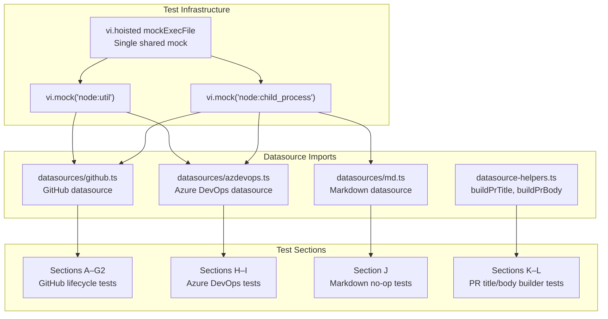

# Datasource System Testing

The datasource system has four test suites:
`src/tests/datasource-helpers.test.ts` (837 lines) for the
[datasource helpers](./datasource-helpers.md) module,
`src/tests/datasource.test.ts` (300 lines) for the markdown datasource and
registry, `src/tests/github-datasource.test.ts` (339 lines) for the GitHub
datasource in isolation, and `src/tests/git.test.ts` (990 lines), a
cross-datasource test suite that covers GitHub, Azure DevOps, and markdown
datasource git lifecycle operations alongside shared PR-body and PR-title
helpers. All tests use Vitest.

## Datasource helpers tests

The datasource helpers test suite is located at
`src/tests/datasource-helpers.test.ts` (837 lines). It uses Vitest with mocked
`child_process.execFile` for git commands and real filesystem I/O for temp
directory operations. It covers all exported functions from
`src/orchestrator/datasource-helpers.ts`.

### Test infrastructure

The test file uses `vi.mock` to mock two modules:

- **`helpers/logger.js`**: Mocked to capture `log.warn` calls and provide
  `formatErrorChain` for error message formatting.
- **`node:child_process`**: Mocked via `vi.hoisted` to provide a controllable
  `mockExecFile` function for all git subprocess calls.

A `createMockDatasource()` helper creates a fully-stubbed `Datasource` object
with all 14 methods as `vi.fn()` stubs. A `createIssueDetails()` helper
creates `IssueDetails` fixtures with sensible defaults.

### `parseIssueFilename` tests (20 tests)

| Test category | Tests | What they verify |
|---------------|-------|-----------------|
| Valid filenames | 7 | Standard patterns, long IDs, single-digit IDs, bare filenames, multi-word slugs, slugs with dots, leading zeros |
| Null returns | 11 | No numeric prefix, no slug, non-`.md` extension, empty string, no extension, `.json`, `.markdown`, leading dash, number-only, directory path, no dash separator |
| Component extraction | 2 | Separate `issueId` and `slug` fields, single-character slugs |

### `fetchItemsById` tests (7 tests)

| Test | What it verifies |
|------|-----------------|
| Fetches a single issue by ID | Basic fetch delegation to datasource |
| Fetches multiple issues by ID | Sequential multi-fetch |
| Splits comma-separated IDs | `"10,20,30"` → three separate fetches |
| Trims whitespace from comma-separated IDs | `"  5 , 6 "` → `"5"`, `"6"` |
| Filters out empty strings from comma-separated IDs | `"7,,"` → single fetch |
| Skips failed fetches and logs a warning | Error → `log.warn` called, other fetches continue |
| Returns empty array when all fetches fail | All errors → empty result |

### `writeItemsToTempDir` tests (7 tests)

These tests use real filesystem I/O via `mkdtemp` and clean up temp
directories in `afterEach`:

| Test | What it verifies |
|------|-----------------|
| Writes single issue with correct filename | `42-add-user-auth.md` naming convention |
| Creates slugs correctly | `"Fix Bug #123 (Urgent!)"` → `fix-bug-123-urgent` |
| Trims leading/trailing hyphens | `"---Special---"` → `special` |
| Truncates slug to 60 characters | `MAX_SLUG_LENGTH` enforcement |
| Sorts output files by numeric prefix | Items `[30, 10, 20]` → sorted as `[10, 20, 30]` |
| Returns file→IssueDetails mapping | `issueDetailsByFile` map correctness |
| Handles empty items array | Graceful empty input |

### `buildPrTitle` tests (4 tests)

| Test | What it verifies |
|------|-----------------|
| Returns issue title when no commits found | `git log` error → fallback to issue title |
| Returns single commit message | One commit → uses that commit's message |
| Returns oldest commit with count suffix | Multiple commits → `"oldest (+N more)"` |
| Returns issue title for empty git log output | Empty stdout → fallback |

### `buildPrBody` tests (7 tests)

| Test | What it verifies |
|------|-----------------|
| Includes commit summaries | `## Summary` section with bullet items |
| Includes completed and failed tasks | `- [x]` and `- [ ]` checkboxes |
| Includes labels when present | `**Labels:** bug, urgent` |
| Appends GitHub close reference | `Closes #42` for `"github"` datasource |
| Appends Azure DevOps close reference | `Resolves AB#42` for `"azdevops"` datasource |
| Includes no close reference for md | Neither `Closes` nor `Resolves` for `"md"` |
| Handles git log failure gracefully | Tasks and close ref still present without summary |

### `buildFeaturePrTitle` tests (3 tests)

| Test | What it verifies |
|------|-----------------|
| Returns single issue title | One issue → uses that issue's title |
| Returns aggregated title with branch name | Multiple issues → `feat: <branch> (#10, #11, #12)` |
| Handles two issues correctly | Edge case for exactly two issues |

### `buildFeaturePrBody` tests (5 tests)

| Test | What it verifies |
|------|-----------------|
| Lists all issues in issues section | `## Issues` with `- #N: title` |
| Includes completed and failed tasks | `- [x]` and `- [ ]` checkboxes |
| Appends GitHub close references for all issues | `Closes #10`, `Closes #11` |
| Appends Azure DevOps close references for all issues | `Resolves AB#10`, `Resolves AB#11` |
| Includes no close references for md | Neither `Closes` nor `Resolves` |

### `getBranchDiff` tests (3 tests)

| Test | What it verifies |
|------|-----------------|
| Returns full diff output | Success → full stdout returned |
| Returns empty string on failure | `git diff` error → `""` |
| Returns empty string for no differences | Empty stdout → `""` |

### `amendCommitMessage` tests (2 tests)

| Test | What it verifies |
|------|-----------------|
| Calls git commit --amend with message | Correct arguments passed to execFile |
| Propagates errors from git | Errors not caught → thrown to caller |

### `squashBranchCommits` tests (2 tests)

| Test | What it verifies |
|------|-----------------|
| Squashes using merge-base, soft reset, and commit | Three git calls in correct order with correct args |
| Propagates errors from merge-base | First step failure → error thrown |

### Running the datasource helpers tests

```sh
npx vitest run src/tests/datasource-helpers.test.ts
```

The tests require no external tools or network access. Git commands are fully
mocked, and temp directory tests use real filesystem I/O in the system temp
directory.

## Datasource implementation and registry tests

### GitHub datasource — `github-datasource.test.ts`

This test suite (`src/tests/github-datasource.test.ts`) tests the GitHub
datasource in isolation by mocking `node:child_process.execFile` via
`vi.hoisted()`. It covers all CRUD operations and all git lifecycle methods:

| Test area | Tests | What is verified |
|-----------|-------|-----------------|
| `list()` | 2 | Parses JSON output correctly; throws descriptive error on non-JSON output |
| `fetch()` | 3 | Returns issue details with comments; handles missing comments; throws on non-JSON |
| `update()` | 1 | Passes correct args to `gh issue edit` |
| `close()` | 1 | Calls `gh issue close` with correct args |
| `create()` | 2 | Parses issue number from URL; returns `"0"` when URL doesn't match pattern |
| `getDefaultBranch()` | 5 | Reads from symbolic-ref; falls back to main; falls back to master; rejects names with spaces; rejects shell metacharacters; rejects names exceeding 255 chars; rejects empty names |
| `buildBranchName()` | 2 | Builds `<username>/dispatch/<number>-<slug>`; falls back to `"unknown"` |
| `createAndSwitchBranch()` | 3 | Creates new branch; falls back to checkout on "already exists"; throws on other errors |
| `switchBranch()` | 1 | Calls `git checkout` |
| `pushBranch()` | 1 | Calls `git push --set-upstream origin` |
| `commitAllChanges()` | 2 | Stages and commits with changes; skips commit when nothing staged |
| `createPullRequest()` | 3 | Creates PR and returns URL; returns existing PR URL on "already exists"; throws on other errors |
| `getCommitMessages()` | 2 | Returns commit messages; returns empty array on failure |

### Markdown datasource unit tests — `md-datasource.test.ts`

This test suite (`src/tests/md-datasource.test.ts`) tests the markdown
datasource's informational methods and git lifecycle error handling in
isolation. It mocks `node:child_process.execFile` via `mockExecFile` from
`src/tests/fixtures.ts` (not `vi.hoisted()` like the GitHub tests).

| Test area | Tests | What is verified |
|-----------|-------|-----------------|
| `getUsername()` | 3 | Returns slugified `git config user.name` output; strips whitespace before slugifying; falls back to `"local"` when git command fails |
| `buildBranchName()` | 2 | Builds `<username>/dispatch/<number>-<slug>` with correct format; truncates slug to 50 characters |
| `getDefaultBranch()` | 1 | Always returns `"main"` (hardcoded) |
| `supportsGit()` | 1 | Returns `false` |
| Git lifecycle errors | 5 | `createAndSwitchBranch()`, `switchBranch()`, `pushBranch()`, `commitAllChanges()`, and `createPullRequest()` all throw `UnsupportedOperationError` |

**Key differences from `github-datasource.test.ts`:**
- Uses `mockExecFile` from `src/tests/fixtures.ts` instead of `vi.hoisted()`
  module mocking. The `mockExecFile` pattern returns a mock function that can
  be configured with `mockResolvedValue()` per test.
- Does **not** test CRUD operations (`list`, `fetch`, `update`, `close`,
  `create`) — those are covered by `datasource.test.ts` which uses real
  filesystem I/O.
- Verifies that git lifecycle methods **throw** (not return silently) — this
  is the critical behavioral difference from the GitHub and Azure DevOps
  datasources.

### Cross-datasource — `git.test.ts`

This test suite (`src/tests/git.test.ts`) exercises git lifecycle operations
across all three datasource implementations (GitHub, Azure DevOps, markdown)
and shared helper functions through a single shared mock of
`node:child_process.execFile`. The shared mock means all datasources are
imported after the mock is installed, so `git` and `gh` and `az` calls are
all intercepted.

**GitHub datasource coverage (Sections A–G2):**

| Section | Tests | What is verified |
|---------|-------|-----------------|
| A: `buildBranchName` | 7 | Branch name format; special character stripping; slug truncation to 50 chars; empty title handling; mixed case handling; username fallback |
| B: `getDefaultBranch` | 4 | Symbolic-ref parsing; fallback to main; fallback to master; branch name extraction from full ref path |
| B2: `getUsername` | 4 | Slugified git username; fallback to `"unknown"` on error; fallback on empty name; special character handling |
| C: `createAndSwitchBranch` | 3 | New branch creation; "already exists" fallback; error re-throw |
| D: `switchBranch` | 2 | Checkout call; error propagation |
| E: `pushBranch` | 2 | Push with `--set-upstream`; error propagation |
| F: `commitAllChanges` | 2 | Stage + commit when changes exist; skip when no changes |
| G: `createPullRequest` | 5 | PR creation; existing PR fallback; error re-throw; custom body passthrough; default body with `Closes #N`; multiline markdown body |
| G2: `getCommitMessages` | 4 | Multiple commits; single commit; empty output; git log failure |

**Azure DevOps datasource coverage (Sections H–I):**

| Section | Tests | What is verified |
|---------|-------|-----------------|
| H: `createPullRequest` | 5 | PR creation with `az repos pr create`; existing PR fallback via `az repos pr list`; empty PR list handling; error re-throw; custom body passthrough; default description with `Resolves AB#N` |
| I: `buildBranchName` | 1 | Same format as GitHub |

**Markdown datasource coverage (Section J):**

| Section | Tests | What is verified |
|---------|-------|-----------------|
| J: No-op lifecycle methods | 9 | `getDefaultBranch` returns `"main"` without calling git; `getUsername` reads git config with `"local"` fallback; `buildBranchName` format; all five git operations (`createAndSwitchBranch`, `switchBranch`, `pushBranch`, `commitAllChanges`, `createPullRequest`) throw `UnsupportedOperationError` |

**Shared helper coverage (Sections K–L):**

| Section | Tests | What is verified |
|---------|-------|-----------------|
| K: `buildPrTitle` | 4 | Falls back to issue title on git log failure; uses single commit subject; uses oldest commit with `(+N more)` suffix; handles empty git log output |
| L: `buildPrBody` | 7 | Includes commit summaries; includes completed/failed tasks with checkboxes; includes labels; appends `Closes #N` for GitHub; appends `Resolves AB#N` for Azure DevOps; omits close reference for md; handles git log failure gracefully; omits tasks section when no task results |

### Cross-datasource test architecture

The `git.test.ts` suite uses a shared mock pattern where a single
`mockExecFile` intercepts all subprocess calls across all three datasource
implementations. This architecture enables testing cross-datasource
consistency (e.g., verifying all three use the same branch naming convention)
but introduces a coupling risk:



**Mock reset:** `beforeEach(() => vi.resetAllMocks())` runs before every test,
ensuring that mock call counts and return values are clean. However, the
`vi.mock()` calls at the module level are persistent — the mock intercepts
remain in place for all tests in the file.

### Markdown datasource — `datasource.test.ts`

This test suite uses real filesystem I/O (no mocks) and covers the markdown
datasource operations, configuration validation for datasource names, and the
datasource registry.

#### `list()` — 5 tests

| Test | What it verifies |
|------|-----------------|
| Returns empty array when specs directory does not exist | Graceful handling of missing directory |
| Returns empty array when specs directory is empty | No false positives on empty directory |
| Lists all .md files sorted alphabetically | Alphabetical sort order and correct file discovery |
| Ignores non-.md files | Filter excludes `.txt` and other formats |
| Populates IssueDetails fields correctly | Field mapping: `number`, `title`, `body`, `labels`, `state`, `comments`, `acceptanceCriteria` |

#### `fetch()` — 5 tests

| Test | What it verifies |
|------|-----------------|
| Fetches a file by name with .md extension | Extension-inclusive ID lookup |
| Fetches a file by name without .md extension | Automatic `.md` extension appending |
| Extracts title from first H1 heading | `extractTitle()` regex matching |
| Falls back to filename as title when no H1 heading | Fallback to filename stem |
| Throws when file does not exist | `ENOENT` propagation for missing files |

#### `update()` — 2 tests

| Test | What it verifies |
|------|-----------------|
| Writes new body content to the file | Content replacement |
| Appends .md extension when not provided | Automatic extension handling |

Note: There is no test explicitly verifying that the `_title` parameter is
ignored. This behavior is observable from the "writes new body content" test
(the title parameter is `"ignored title"` / `"ignored"`, but the test only
checks the body content).

#### `close()` — 2 tests

| Test | What it verifies |
|------|-----------------|
| Moves file to archive subdirectory | File is removed from source, present in `archive/` with preserved content |
| Creates archive directory if it does not exist | `mkdir({ recursive: true })` behavior |

#### Configuration validation — datasource names

Five tests validate the `validateConfigValue()` function for datasource name
validation:

| Test | What it verifies |
|------|-----------------|
| Accepts 'md' as a valid source | `"md"` passes validation |
| Accepts 'github' as a valid source | `"github"` passes validation |
| Accepts 'azdevops' as a valid source | `"azdevops"` passes validation |
| Rejects unknown source names | `"jira"`, `"linear"`, `"bitbucket"` fail with "Invalid source" |
| Rejects empty string as source | Empty string fails validation |

#### DatasourceName and registry

Five tests validate the registry in `src/datasources/index.ts`:

| Test | What it verifies |
|------|-----------------|
| DATASOURCE_NAMES includes all three datasource types | Registry completeness |
| DATASOURCE_NAMES has exactly three entries | No unexpected entries |
| getDatasource returns an object with the correct name for each datasource | Name field matches registration key |
| getDatasource returns objects that satisfy the Datasource interface | All five methods (`list`, `fetch`, `update`, `close`, `create`) are functions |
| getDatasource throws for unknown datasource name | Error message includes "Unknown datasource" |

## What is NOT tested

### Azure DevOps datasource CRUD operations

The [Azure DevOps datasource](./azdevops-datasource.md) CRUD operations
(`list`, `fetch`, `update`, `close`, `create`) have **no unit tests** in
`datasource.test.ts`. The `azdevops-datasource.test.ts` file (in the
`azdevops-datasource` group) provides separate coverage. The
`git.test.ts` suite covers only PR creation and branch naming for Azure DevOps.

### Auto-detection (`detectDatasource()`)

The [`detectDatasource()`](./overview.md#auto-detection) function is not directly tested. It would require
either a git repository with a known remote URL or mocking of the `git`
subprocess.

### Edge cases not covered

- Markdown `create()` filename collision (overwrite behavior)
- Markdown `close()` archive collision (overwrite behavior)
- Markdown `update()` with non-existent file (ENOENT behavior)
- Markdown `list()` with files that have no `.md` extension but are markdown
- Large file handling (buffer limits)
- Concurrent access to the same spec file

## Test infrastructure

### Mock pattern (`github-datasource.test.ts` and `git.test.ts`)

Both GitHub test suites use the `vi.hoisted()` + `vi.mock()` pattern to
intercept `execFile` calls at module load time:

```typescript
const { mockExecFile } = vi.hoisted(() => ({ mockExecFile: vi.fn() }));
vi.mock("node:child_process", () => ({ execFile: mockExecFile }));
vi.mock("node:util", () => ({ promisify: () => mockExecFile }));
```

This pattern:

1. **`vi.hoisted()`** — declares the mock function in a hoisted scope so it
   is available before `vi.mock()` factory functions run.
2. **`vi.mock("node:child_process")`** — replaces the `execFile` export with
   the mock.
3. **`vi.mock("node:util")`** — replaces `promisify` with a function that
   returns the same mock, since the datasource modules call
   `promisify(execFile)` at import time.

Each test configures the mock's return value via `mockExecFile.mockResolvedValue()`
or `mockExecFile.mockRejectedValue()` to simulate specific `gh`, `git`, or
`az` CLI responses.

### Mock pattern (`md-datasource.test.ts`)

The markdown datasource unit tests use the shared `mockExecFile` helper from
`src/tests/fixtures.ts` rather than `vi.hoisted()`:

```typescript
import { mockExecFile } from "./fixtures.js";
const exec = mockExecFile();
```

This provides the same mock function but is imported from a shared test fixture
module, making it reusable across test files. The mock is configured per test
with `exec.mockResolvedValue()` to simulate `git config user.name` output.

### Temporary directory pattern (`datasource.test.ts`)

All markdown datasource tests follow the same pattern:

1. Create a temporary directory via `mkdtemp(join(tmpdir(), "dispatch-test-"))`.
2. Set up the `.dispatch/specs/` subdirectory structure.
3. Write test fixture files.
4. Run the datasource operation with `{ cwd: tmpDir }`.
5. Assert on the result.
6. Clean up via `rm(tmpDir, { recursive: true, force: true })` in `afterEach`.

This pattern uses real filesystem I/O rather than mocks, which tests the actual
`fs/promises` calls and path resolution logic.

### No mocking (`datasource.test.ts` only)

The `datasource.test.ts` suite does not use `vi.mock()`, `vi.spyOn()`, or any
other mocking mechanism. All tests operate against the real filesystem. This
file tests the markdown datasource and registry only. The GitHub and Azure
DevOps datasources are tested separately in `github-datasource.test.ts` and
`git.test.ts` using the mock pattern described above.

## Running the tests

```sh
# Run all datasource tests
npx vitest run src/tests/datasource.test.ts src/tests/github-datasource.test.ts src/tests/md-datasource.test.ts src/tests/git.test.ts

# Run only the GitHub datasource unit tests
npx vitest run src/tests/github-datasource.test.ts

# Run only the markdown datasource unit tests (getUsername, buildBranchName, supportsGit, git lifecycle errors)
npx vitest run src/tests/md-datasource.test.ts

# Run only the cross-datasource lifecycle tests
npx vitest run src/tests/git.test.ts

# Run only the markdown datasource CRUD and registry tests
npx vitest run src/tests/datasource.test.ts

# Run all tests
npx vitest run
```

The `datasource.test.ts` tests do not require any external tools, network
access, or special configuration — they rely solely on the local filesystem
via temporary directories. The `github-datasource.test.ts`, `md-datasource.test.ts`,
and `git.test.ts` tests mock all subprocess calls and also require no external
tools.

## Related documentation

- [Datasource Overview](./overview.md) -- Interface and registry being tested
- [GitHub Datasource](./github-datasource.md) -- GitHub implementation tested
  by `github-datasource.test.ts` and `git.test.ts`
- [Azure DevOps Datasource](./azdevops-datasource.md) -- Azure DevOps
  implementation tested by `git.test.ts` (PR creation and branch naming)
- [Markdown Datasource](./markdown-datasource.md) -- Implementation details
  for the markdown datasource tested by `md-datasource.test.ts`,
  `datasource.test.ts`, and `git.test.ts`
- [Datasource Helpers](./datasource-helpers.md) -- PR title/body builders
  tested in `git.test.ts` Sections K–L
- [Testing Overview](../testing/overview.md) -- Project-wide test suite
  documentation
- [Configuration Tests](../testing/config-tests.md) -- Config validation tests
  that also cover datasource name validation
- [Shared Utilities Testing](../shared-utilities/testing.md) -- Test patterns
  for the slugify and timeout utilities used by datasources
- [Spec Generator Tests](../testing/spec-generator-tests.md) -- Tests for the
  spec pipeline that consumes datasource output
- [Dispatch Pipeline Tests](../testing/dispatch-pipeline-tests.md) -- Pipeline
  tests that exercise datasource mocks indirectly
- [Task Parsing Testing Guide](../task-parsing/testing-guide.md) -- Similar
  temporary directory test patterns for the parser test suite
- [Prerequisites & Safety Checks](../prereqs-and-safety/overview.md) -- The
  `checkPrereqs()` function that validates `gh`/`az` CLI availability
