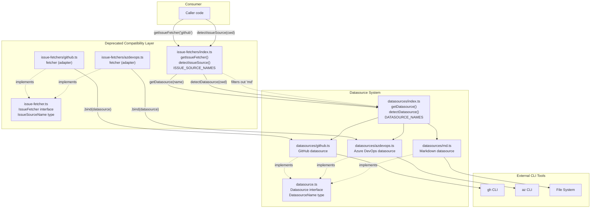

# Deprecated Compatibility Layer

The deprecated compatibility layer provides backwards-compatible shims that map
the legacy `IssueFetcher` interface onto the newer `Datasource` abstraction. All
four files in this group -- `src/issue-fetcher.ts`, `src/issue-fetchers/github.ts`,
`src/issue-fetchers/azdevops.ts`, and `src/issue-fetchers/index.ts` -- re-export
functionality from the datasource system without adding any new logic. All
exports are marked `@deprecated` and are slated for removal in a future release.

> **Deprecation status:** These modules exist solely for backwards compatibility.
> New code should import from `src/datasource.ts` and `src/datasources/` instead.
> See the [migration guide](#migration-guide) below.

## What it does

The compatibility layer bridges the gap between two API designs:

- **Legacy API (`IssueFetcher`)**: The original interface with `fetch()` and
  optional `update()` / `close()` methods, supporting only `"github"` and
  `"azdevops"` backends.
- **Current API (`Datasource`)**: The unified interface with required `fetch()`,
  `update()`, `close()`, `list()`, and `create()` methods, supporting
  `"github"`, `"azdevops"`, and `"md"` backends. See
  [Datasource Overview](../datasource-system/overview.md) for the full
  interface specification.

The shim files create `IssueFetcher` objects by binding methods from the
corresponding `Datasource` implementations. No new logic is introduced -- every
call is delegated directly to the datasource layer.

## Why it exists

When the codebase was refactored from the `IssueFetcher` pattern to the
`Datasource` abstraction, the old module paths (`src/issue-fetcher.ts`,
`src/issue-fetchers/*.ts`) were preserved as thin re-export shims to avoid
breaking any external consumers that may have imported from them. The
`Datasource` interface added three capabilities that the `IssueFetcher`
interface lacked:

1. **`list()` method** -- enumerate available issues/specs from a backend
2. **`create()` method** -- create new issues/specs
3. **`"md"` datasource** -- local markdown files as a datasource backend

Rather than forcing all consumers to update simultaneously, the compatibility
layer allows a gradual migration.

## Key source files

| File | Role |
|------|------|
| `src/issue-fetcher.ts` | Deprecated type definitions: `IssueSourceName`, `IssueFetcher` |
| `src/issue-fetchers/index.ts` | Deprecated registry: `ISSUE_SOURCE_NAMES`, `getIssueFetcher()`, `detectIssueSource()` |
| `src/issue-fetchers/github.ts` | Deprecated GitHub adapter shim |
| `src/issue-fetchers/azdevops.ts` | Deprecated Azure DevOps adapter shim |

## Adapter data flow

The compatibility layer introduces an adapter pattern where `IssueFetcher`
calls are routed through to `Datasource` implementations. The following
diagram shows the complete call flow from a consumer through the shim to the
underlying CLI tool:



## Interface comparison: IssueFetcher vs Datasource

| Aspect | `IssueFetcher` (deprecated) | `Datasource` (current) |
|--------|-----------------------------|------------------------|
| **Defined in** | `src/issue-fetcher.ts:21-26` | `src/datasource.ts:59-108` |
| **Name type** | `IssueSourceName` = `"github" \| "azdevops"` | `DatasourceName` = `"github" \| "azdevops" \| "md"` |
| **`fetch()`** | Required | Required |
| **`update()`** | Optional (`?`) | Required |
| **`close()`** | Optional (`?`) | Required |
| **`list()`** | Not present | Required |
| **`create()`** | Not present | Required |
| **`name` property** | `readonly name: string` | `readonly name: DatasourceName` |

### Why `update()` and `close()` are optional on IssueFetcher

The `IssueFetcher` interface declares `update()` and `close()` as optional
(`?` suffix) at `src/issue-fetcher.ts:24-25`. This reflects the original API
design where not all tracker integrations supported mutation operations. The
`Datasource` interface requires both methods because every current backend
(GitHub, Azure DevOps, and markdown files) supports them.

The compatibility shim always binds both methods from the underlying
`Datasource` object (`src/issue-fetchers/index.ts:28-29`), so callers of the
deprecated API will always receive `update` and `close` functions. They are
never `undefined` at runtime, despite the type declaring them optional. This
means a caller that checks `if (fetcher.close)` before calling it will always
find the method present.

### Why IssueSourceName excludes 'md'

`IssueSourceName` is restricted to `"github" | "azdevops"`
(`src/issue-fetcher.ts:12`) while `DatasourceName` includes `"md"`
(`src/datasource.ts:51`). The `"md"` datasource was added as part of the
`Datasource` abstraction to support local markdown files as a backend for
listing, creating, and managing specs without an external tracker. Since the
original `IssueFetcher` API predates the markdown backend, the `"md"` name was
never part of its type union.

The compatibility shim enforces this exclusion in two places:

1. **`ISSUE_SOURCE_NAMES`** (`src/issue-fetchers/index.ts:16-18`): Filters
   `DATASOURCE_NAMES` to only include `"github"` and `"azdevops"`:
   ```
   DATASOURCE_NAMES.filter(n => n === "github" || n === "azdevops")
   ```

2. **`detectIssueSource()`** (`src/issue-fetchers/index.ts:36-41`): Wraps
   `detectDatasource()` and returns `null` for any result that is not
   `"github"` or `"azdevops"`, including `"md"`.

## How the adapter pattern works

Each per-platform shim (`issue-fetchers/github.ts`, `issue-fetchers/azdevops.ts`)
creates an `IssueFetcher` object by importing the `Datasource` object from the
corresponding `datasources/` module and binding its methods:

```
const fetcher: IssueFetcher = {
  name: datasource.name,
  fetch: datasource.fetch.bind(datasource),
  update: datasource.update.bind(datasource),
  close: datasource.close.bind(datasource),
};
```

The `getIssueFetcher()` function in `src/issue-fetchers/index.ts:23-31` uses
the same pattern but dynamically via `getDatasource(name)`:

```
const ds = getDatasource(name);
return {
  name: ds.name,
  fetch: ds.fetch.bind(ds),
  update: ds.update.bind(ds),
  close: ds.close.bind(ds),
};
```

### Why `.bind()` is used

`Function.prototype.bind()` creates a new function with the `this` context
permanently set to the provided value. This is necessary because the
`Datasource` methods may reference `this` internally (e.g., to access sibling
methods or instance state). Without `.bind()`, extracting a method from an
object and assigning it to a plain object property would lose the original
`this` context:

```typescript
// Without bind: `this` would be the new plain object, not `datasource`
const fetcher = { fetch: datasource.fetch };  // broken if fetch uses `this`

// With bind: `this` is always `datasource`
const fetcher = { fetch: datasource.fetch.bind(datasource) };  // correct
```

The `.bind()` approach correctly preserves the `this` context for all delegated
calls. In the current implementation, the `Datasource` objects in
`src/datasources/github.ts` and `src/datasources/azdevops.ts` are plain object
literals (not classes), so their methods do not actually reference `this`.
However, `.bind()` is defensive -- it ensures correctness regardless of whether
future refactors introduce `this`-dependent logic.

### Safety of update() and close() through the shim

If a caller of the deprecated `getIssueFetcher()` calls `update()` or `close()`,
the call succeeds because the shim unconditionally binds these methods from the
`Datasource` object (`src/issue-fetchers/index.ts:28-29`). The `IssueFetcher`
type marks them as optional, but the runtime object always has them. This is a
safe widening: the type allows `undefined` but the implementation never returns
it.

A caller that follows the type signature and checks for the method's presence
before calling it:

```typescript
if (fetcher.close) {
  await fetcher.close(issueId, opts);
}
```

will always enter the `if` branch and execute the close operation through the
underlying `Datasource.close()`.

## External tool prerequisites

The compatibility shims delegate entirely to the
[Datasource implementations](../datasource-system/overview.md), which shell out
to external CLI tools. The shims themselves have no additional prerequisites
beyond what the underlying datasource requires.

### GitHub CLI (`gh`)

The GitHub compatibility shim requires the `gh` CLI to be installed and
authenticated. All calls are delegated through `src/datasources/github.ts`,
which uses the `gh` binary for all operations.

**Installation:**

```bash
# macOS
brew install gh

# Windows
winget install --id GitHub.cli

# Linux (apt)
sudo apt install gh
```

**Authentication:**

```bash
gh auth login
```

The `gh` CLI supports interactive OAuth, device code flow, and token-based
authentication via the `GH_TOKEN` or `GITHUB_TOKEN` environment variables.
Credentials are stored locally by the `gh` tool. dispatch-tasks does not manage
GitHub credentials.

For GitHub Enterprise Server hosts, authenticate with
`gh auth login --hostname github.mycompany.com`. Note that the
[auto-detection logic](../issue-fetching/overview.md#auto-detection-of-issue-source)
only matches `github.com`, so GHES users must pass `--source github` explicitly.

**What happens if `gh` is not installed:** Node.js `execFile` throws an error
with `code: 'ENOENT'`. The spec generator catches this and logs
`Failed to fetch #<id>: spawn gh ENOENT`. The issue is marked as failed; other
issues continue processing.

**Troubleshooting `gh` failures:** Run `gh issue view <id> --json title`
manually to diagnose. Common failures include authentication expiry (`401`),
missing repository context (run from outside a git repo), and rate limiting
(`429`). See the [GitHub fetcher troubleshooting](../issue-fetching/github-fetcher.md#troubleshooting)
for detailed resolution steps.

**Rate limits:** The GitHub API allows 5,000 authenticated requests per hour.
Each issue fetch consumes one request. There is no rate limit handling or
retry logic in the fetcher -- exhaustion produces an error that the spec
generator records as a failed issue.

### Azure CLI with azure-devops extension (`az boards`)

The Azure DevOps compatibility shim requires the `az` CLI with the
`azure-devops` extension. All calls are delegated through
`src/datasources/azdevops.ts`.

**Installation:**

```bash
# Install Azure CLI
brew install azure-cli          # macOS
curl -sL https://aka.ms/InstallAzureCLIDeb | sudo bash  # Linux

# Install the azure-devops extension
az extension add --name azure-devops
```

**Authentication:**

```bash
az login
```

For PAT-based authentication in CI:

```bash
az devops login --organization https://dev.azure.com/myorg
```

The PAT must have **Work Items (Read)** scope at minimum.

**Configuring defaults** to avoid passing `--org` and `--project` every time:

```bash
az devops configure --defaults \
  organization=https://dev.azure.com/myorg \
  project=MyProject
```

**What happens if `az` is not installed:** Same `ENOENT` behavior as the GitHub
case. The spec generator logs the error and marks the issue as failed.

**What happens if the azure-devops extension is missing:** The `az` CLI returns
an error like `'boards' is not a recognized command`. This propagates as a
failed fetch.

**Troubleshooting:** Run `az boards work-item show --id <id> --output json`
manually to diagnose. See the
[Azure DevOps datasource troubleshooting](../datasource-system/azdevops-datasource.md#troubleshooting)
for detailed resolution steps.

## Removal safety assessment

A project-wide search confirms that **no code outside the deprecated
compatibility layer itself imports from these modules**. The only import
references are:

| Importing file | Imports from |
|----------------|-------------|
| `src/issue-fetchers/github.ts:10` | `src/issue-fetcher.ts` |
| `src/issue-fetchers/azdevops.ts:10` | `src/issue-fetcher.ts` |
| `src/issue-fetchers/index.ts:11` | `src/issue-fetcher.ts` |

All other source files (`src/agents/orchestrator.ts`, `src/spec-generator.ts`,
etc.) import from `src/datasource.ts` and `src/datasources/` directly.

**Pending confirmation:** If dispatch-tasks is published as an npm package and
external consumers import from `issue-fetcher` or `issue-fetchers/`, those
consumers would break on removal. Verify with downstream consumers before
removing.

## Removal timeline

The deprecation notices in the source code state "will be removed in a future
release" without specifying a version or date. There is no published migration
guide, no changelog entry documenting the deprecation, and no `MIGRATION.md`
file in the repository.

**Recommendations for removal:**

1. Add a changelog entry documenting the deprecation and the migration path.
2. Tag a release that includes the deprecation notices so consumers can
   discover the change.
3. Wait at least one minor version after the deprecation announcement before
   removing the files.
4. Verify that no external consumers depend on the deprecated paths (check
   npm dependents, internal tooling, CI scripts).
5. Remove the four deprecated files and update documentation.

## Migration guide

To migrate from the deprecated `IssueFetcher` API to the `Datasource` API:

### 1. Update type imports

```typescript
// Before (deprecated)
import type { IssueDetails, IssueFetchOptions, IssueSourceName } from "./issue-fetcher.js";
import type { IssueFetcher } from "./issue-fetcher.js";

// After
import type { IssueDetails, IssueFetchOptions, DatasourceName } from "./datasource.js";
import type { Datasource } from "./datasource.js";
```

### 2. Update registry imports

```typescript
// Before (deprecated)
import { getIssueFetcher, detectIssueSource, ISSUE_SOURCE_NAMES } from "./issue-fetchers/index.js";

// After
import { getDatasource, detectDatasource, DATASOURCE_NAMES } from "./datasources/index.js";
```

### 3. Update platform-specific imports

```typescript
// Before (deprecated)
import { fetcher } from "./issue-fetchers/github.js";
import { fetcher } from "./issue-fetchers/azdevops.js";

// After
import { datasource } from "./datasources/github.js";
import { datasource } from "./datasources/azdevops.js";
```

### 4. Handle the expanded DatasourceName type

`DatasourceName` includes `"md"` in addition to `"github"` and `"azdevops"`.
If your code uses a switch statement or conditional based on the source name,
add a case for `"md"` or filter it out:

```typescript
// If you only want issue trackers (not local files):
const trackerNames = DATASOURCE_NAMES.filter(
  (n): n is "github" | "azdevops" => n !== "md"
);
```

### 5. Handle required update() and close() methods

On `Datasource`, `update()` and `close()` are required, not optional. Remove
any null-checks that guard calls to these methods:

```typescript
// Before (with optional methods)
if (fetcher.close) {
  await fetcher.close(issueId, opts);
}

// After (methods always present)
await datasource.close(issueId, opts);
```

### 6. Use new capabilities

The `Datasource` interface provides two methods not available in `IssueFetcher`:

```typescript
// List all issues/specs
const issues = await datasource.list(opts);

// Create a new issue/spec
const created = await datasource.create("Title", "Body content", opts);
```

## Adding a new datasource (replacing the fetcher pattern)

New integrations should implement the `Datasource` interface in
`src/datasource.ts`, not the deprecated `IssueFetcher` interface. The steps
are:

1. Create `src/datasources/<name>.ts` implementing all `Datasource` methods.
2. Add the name to the `DatasourceName` union in `src/datasource.ts`.
3. Register the implementation in `src/datasources/index.ts`.
4. Optionally add a URL pattern to `detectDatasource()` for auto-detection.

See the [Datasource Abstraction documentation](../datasource-system/overview.md)
for architecture details and the
[Adding a Fetcher guide](../issue-fetching/adding-a-fetcher.md) for the
checklist pattern (which should be updated to reference the `Datasource`
interface).

## Related documentation

- [Issue Fetching overview](../issue-fetching/overview.md) -- Architecture and
  data flow for the issue fetching subsystem
- [GitHub Fetcher](../issue-fetching/github-fetcher.md) -- GitHub CLI setup
  and troubleshooting
- [Azure DevOps Fetcher](../issue-fetching/azdevops-fetcher.md) -- Azure CLI
  setup and troubleshooting
- [Datasource Overview](../datasource-system/overview.md) -- The current
  `Datasource` interface and registry that supersedes `IssueFetcher`
- [Datasource Integrations & Troubleshooting](../datasource-system/integrations.md) --
  Subprocess behavior, timeouts, and error handling
- [Spec Generation](../spec-generation/overview.md) -- How the spec pipeline
  uses issue fetching
- [CLI Argument Parser](../cli-orchestration/cli.md) -- `--source` flag
  validation and datasource name references

## External references

- [GitHub CLI manual](https://cli.github.com/manual/) -- Official `gh`
  documentation
- [`gh auth login`](https://cli.github.com/manual/gh_auth_login) --
  Authentication setup for GitHub CLI
- [Azure DevOps CLI reference](https://learn.microsoft.com/en-us/cli/azure/boards) --
  `az boards` command reference
- [Azure CLI installation](https://learn.microsoft.com/en-us/cli/azure/install-azure-cli) --
  Installation guide for the Azure CLI
- [`az devops configure`](https://learn.microsoft.com/en-us/cli/azure/azure-cli-configuration) --
  Setting default organization and project
- [MDN: Function.prototype.bind()](https://developer.mozilla.org/en-US/docs/Web/JavaScript/Reference/Global_objects/Function/bind) --
  How `.bind()` preserves `this` context
