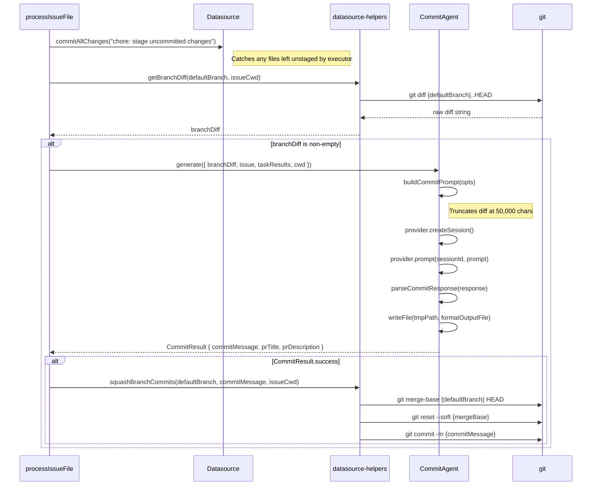

# Commit and PR Generation

## What it does

After all tasks for an issue complete, the pipeline generates a conventional
commit message, PR title, and PR description using the **commit agent**. It
then squashes all branch commits into a single commit and creates a pull
request. This phase bridges the gap between task execution (which may produce
many small commits) and the clean, reviewable output expected by code
reviewers.

The implementation spans three locations:

- **Commit agent:** `src/agents/commit.ts` (307 lines) -- prompt construction,
  AI invocation, response parsing.
- **Pipeline integration:** `src/orchestrator/dispatch-pipeline.ts:784-928` --
  staging, squashing, PR creation.
- **Datasource helpers:** `src/orchestrator/datasource-helpers.ts` -- diff
  retrieval, squash mechanics, PR body/title builders.

## Why it exists

Multiple concerns drive this design:

1. **Consistent commit quality.** Individual task executions may produce
   terse or inconsistent commit messages. The commit agent analyzes the full
   diff and issue context to produce a single, well-structured conventional
   commit message.

2. **Clean git history.** Squashing all branch commits into one creates a
   linear, bisect-friendly history on the target branch.

3. **Rich PR metadata.** AI-generated PR titles and descriptions provide
   better context for reviewers than template-based alternatives. The
   fallback builders ensure PRs are always created even if the AI fails.

4. **Diff truncation.** Large diffs must be truncated to fit within AI
   context windows. The 50,000-character limit is a pragmatic balance between
   providing enough context and staying within token budgets.

## How it works

### Commit Generation Sequence



### Step-by-Step Flow

#### 1. Stage Uncommitted Changes (line 787-796)

Before generating the commit, the pipeline stages any uncommitted changes
left behind by the executor agent:

```
datasource.commitAllChanges("chore: stage uncommitted changes for issue #{number}")
```

This catch-all ensures that files modified but not committed by the executor
are included in the diff. The staging commit message is discarded during
squashing.

#### 2. Get Branch Diff (line 801)

`getBranchDiff(defaultBranch, issueCwd)` runs `git diff {defaultBranch}..HEAD`
with a 10 MB buffer limit. Returns an empty string on failure.

In feature mode, `defaultBranch` is the feature branch name (not `main`),
so the diff reflects only changes for this specific issue.

Source: `src/orchestrator/datasource-helpers.ts:123-134`.

#### 3. Build Commit Prompt

`buildCommitPrompt()` in `src/agents/commit.ts:153-241` assembles a structured
prompt with these sections:

| Section | Content |
|---|---|
| Role | "You are a commit message agent" |
| Environment | Runtime environment details via `formatEnvironmentPrompt()` |
| Conventional Commit Guidelines | Specification link, type list, formatting rules |
| Issue Context | Issue number, title, body (first 500 chars), labels |
| Tasks | Completed and failed task lists |
| Git Diff | The branch diff, **truncated at 50,000 characters** |
| Required Output Format | Exact headers: `COMMIT_MESSAGE`, `PR_TITLE`, `PR_DESCRIPTION` |

#### 4. Diff Truncation

The diff is truncated to 50,000 characters to stay within AI context windows:

```typescript
const maxDiffLength = 50_000;
const truncatedDiff = branchDiff.length > maxDiffLength
  ? branchDiff.slice(0, maxDiffLength) + "\n\n... (diff truncated due to size)"
  : branchDiff;
```

The truncation marker `"... (diff truncated due to size)"` signals to the AI
that context is incomplete. This is a character-based limit, not a token
limit -- in practice, 50K characters corresponds to roughly 12,000-15,000
tokens depending on the model's tokenizer.

Source: `src/agents/commit.ts:205-210`.

#### 5. Parse AI Response

`parseCommitResponse()` extracts three sections from the AI's response using
regex matching:

```typescript
/###\s*COMMIT_MESSAGE\s*\n([\s\S]*?)(?=###\s*PR_TITLE|$)/i
/###\s*PR_TITLE\s*\n([\s\S]*?)(?=###\s*PR_DESCRIPTION|$)/i
/###\s*PR_DESCRIPTION\s*\n([\s\S]*?)$/i
```

The regexes use case-insensitive matching and tolerate whitespace variations
in the section headers. If neither `commitMessage` nor `prTitle` can be
extracted, the agent returns `success: false`.

Source: `src/agents/commit.ts:248-280`.

#### 6. Squash Branch Commits

`squashBranchCommits(defaultBranch, commitMessage, issueCwd)` replaces all
commits on the branch with a single commit:

1. Find the merge base: `git merge-base {defaultBranch} HEAD`
2. Soft reset to the merge base: `git reset --soft {mergeBase}`
3. Create a new commit: `git commit -m {commitMessage}`

This approach avoids interactive rebase complexity. The soft reset preserves
all file changes in the index, and the single commit captures everything.

Source: `src/orchestrator/datasource-helpers.ts:161-174`.

#### 7. Write Output File

The parsed commit data is written to a temporary markdown file at
`.dispatch/tmp/commit-{uuid}.md` for debugging and audit purposes. The file
contains the commit message, PR title, and PR description in a structured
format.

Source: `src/agents/commit.ts:120-122`.

### PR Creation

After commit squashing, the pipeline creates a pull request via the
datasource:

#### Normal Mode (lines 874-928)

1. **Push the branch:** `datasource.pushBranch(branchName, issueLifecycleOpts)`
2. **Build PR metadata:**
   - Uses commit agent's `prTitle` and `prDescription` if available.
   - Falls back to `buildPrTitle()` (derives title from commit messages) and
     `buildPrBody()` (assembles from commits, tasks, labels, and close
     references).
3. **Create PR:** `datasource.createPullRequest(branchName, issueNumber,
   prTitle, prBody, lifecycleOpts, startingBranch)`
   - The PR targets the **starting branch** (captured at pipeline start),
     not a hardcoded `main`.
4. **Clean up:** remove worktree or switch back to default branch.

#### Feature Mode (lines 832-868)

In feature mode, individual issue PRs are **not** created. Instead:

1. The worktree is removed.
2. The child branch is merged into the feature branch with `--no-ff`.
3. The child branch is deleted.
4. After all issues, a single aggregated PR is created.

See [Feature Branch Mode](./feature-branch-mode.md) for the full flow.

### Fallback PR Builders

When the commit agent fails or returns empty results, the pipeline falls back
to deterministic PR metadata builders:

**`buildPrTitle(issueTitle, defaultBranch, cwd)`:**

- Single commit on branch: uses the commit message as the title.
- Multiple commits: uses the last commit message with `(+N more)` suffix.
- No commits: falls back to the issue title.

Source: `src/orchestrator/datasource-helpers.ts:265-282`.

**`buildPrBody(details, tasks, results, defaultBranch, datasourceName, cwd)`:**

Assembles sections:

1. **Summary** -- one-line commit messages from `git log`.
2. **Tasks** -- completed tasks as `[x]`, failed as `[ ]`.
3. **Labels** -- issue labels if present.
4. **Close reference** -- `Closes #{number}` for GitHub,
   `Resolves AB#{number}` for Azure DevOps.

Source: `src/orchestrator/datasource-helpers.ts:193-250`.

### Error Handling

The commit and PR generation phase is **fault-tolerant** -- failures are
logged as warnings but do not fail the task or halt the pipeline:

| Failure | Behavior |
|---|---|
| Commit agent returns empty response | `success: false`, pipeline skips squashing |
| Commit agent response cannot be parsed | `success: false`, pipeline skips squashing |
| Commit agent throws | Error caught, logged, pipeline falls back to `buildPrTitle`/`buildPrBody` |
| Squash fails | Warning logged, original commits preserved |
| Branch push fails | Warning logged, PR creation skipped |
| PR creation fails | Warning logged, branch is still pushed |

### File Logger Integration

All commit agent operations are logged to the per-issue file logger (when
verbose mode is active):

- `fileLogger.phase("Commit generation")` -- marks the start of this phase.
- `fileLoggerStorage.getStore()?.prompt("commit", prompt)` -- logs the full
  prompt.
- `fileLoggerStorage.getStore()?.response("commit", response)` -- logs the
  full AI response.
- `fileLoggerStorage.getStore()?.agentEvent("commit", "completed", ...)` --
  logs the generated commit message summary.

## Cross-References

- [Pipeline Lifecycle](./pipeline-lifecycle.md) — Phase 5 (Commit Generation)
  and Phase 6 (PR Lifecycle)
- [Feature Branch Mode](./feature-branch-mode.md) — aggregated PR creation
  for feature branches
- [Provider Pool and Failover](../provider-system/pool-and-failover.md) — the commit
  agent uses its own provider pool with failover
- [Commit Agent](../agent-system/commit-agent.md) — detailed commit agent
  documentation
- [Planning and Dispatch Overview](../planning-and-dispatch/overview.md) — broader
  dispatch system context
- [Datasource Helpers](../datasource-system/datasource-helpers.md) — `getBranchDiff()`, `squashBranchCommits()`, `buildPrTitle()`, `buildPrBody()`
- [Datasource System Overview](../datasource-system/overview.md) — `commitAllChanges()`, `pushBranch()`, `createPullRequest()` interface
- [Task Recovery](./task-recovery.md) — how failures during commit generation are handled
- [Troubleshooting](./troubleshooting.md) — common failure scenarios including commit/PR issues
- [Git & Worktree Overview](../git-and-worktree/overview.md) — worktree lifecycle around commit squashing
- [Progress Reporting](../provider-system/progress-reporting.md) — how streaming progress from the commit agent is displayed
