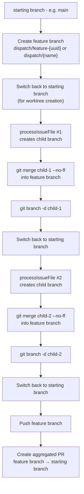

# Feature Branch Mode

## What

Feature branch mode (`--feature`) groups multiple issues into a single branch
and PR. Instead of creating one branch and one PR per issue, the pipeline
creates a parent feature branch, processes each issue on its own child branch,
merges each child into the feature branch with `--no-ff`, and creates a single
aggregated PR at the end.

The implementation spans the feature-branch setup block (lines 378-432),
the per-issue merge path inside `processIssueFile()` (lines 832-868), and
the finalization block (lines 981-1021) in
`src/orchestrator/dispatch-pipeline.ts`.

## Why

Feature branch mode solves two workflow problems:

1. **Atomic multi-issue delivery.** When multiple issues form a coherent
   feature, reviewers want a single PR that captures the full scope of work.
   Without feature mode, each issue produces its own PR, fragmenting the
   review.

2. **Clean merge history.** The `--no-ff` merge strategy preserves each
   issue's commit as a distinct merge commit on the feature branch. This
   makes `git log --merges` useful for understanding which issue contributed
   which changes, even after the feature branch is squash-merged into main.

## How

### Branch Topology



### Feature Branch Naming

The `--feature` flag accepts two forms:

| Invocation | Resulting branch name |
|---|---|
| `--feature` (boolean, no value) | `dispatch/feature-{first 8 hex chars of UUID}` via `generateFeatureBranchName()` |
| `--feature my-feature` | `dispatch/my-feature` (prefixed with `dispatch/` if no `/` present) |
| `--feature team/my-feature` | `team/my-feature` (used as-is because it contains `/`) |

The provided name is validated via `isValidBranchName()` before use. Invalid
names cause an immediate pipeline exit with all tasks marked as failed.

Source: `src/helpers/worktree.ts:218-222` (name generation),
`src/orchestrator/dispatch-pipeline.ts:383-392` (name resolution).

### Feature Branch Setup (lines 378-432)

1. **Resolve the feature branch name** from the `--feature` value.
2. **Record `featureDefaultBranch`** as the current starting branch -- this
   becomes the PR target.
3. **Switch to the starting branch** to ensure the feature branch starts from
   the correct commit.
4. **Create the feature branch** via `datasource.createAndSwitchBranch()`. If
   the branch already exists, the pipeline switches to it instead of failing.
5. **Register cleanup** that switches back to the starting branch on process
   exit.
6. **Switch back to the starting branch** so worktrees can be created from the
   main repo (worktrees require the main repo to not be on the branch being
   checked out into the worktree).

### Serial Execution Constraint

Feature mode forces **serial issue processing**, even when worktrees are
enabled:

```
if (useWorktrees && !feature) {
  // sliding-window concurrency
} else {
  // serial — includes feature mode
}
```

This constraint exists because each issue's merge into the feature branch
must complete before the next issue begins processing. Parallel merges would
cause race conditions on the feature branch.

Within each issue, tasks still respect the configured `concurrency` limit
and `groupTasksByMode()` grouping.

### Per-Issue Merge Path (lines 832-868)

After all tasks for an issue complete and the commit agent generates the
commit message, the feature mode path:

1. **Removes the worktree** for the issue (if using worktrees).
2. **Switches to the feature branch** via `datasource.switchBranch()`.
3. **Merges the child branch** with `--no-ff`:
   ```
   git merge {branchName} --no-ff -m "merge: issue #{number}"
   ```
4. **Deletes the local child branch** via `git branch -d`.
5. **Switches back to `featureDefaultBranch`** (the starting branch) so the
   next issue's worktree can be created from the main repo.

If the merge fails (e.g., due to conflicts), the pipeline:

- Runs `git merge --abort` to clean up.
- Marks all tasks in the issue as failed with the merge error.
- Continues to the next issue (does not halt the pipeline).

### Feature Branch Finalization (lines 981-1021)

After all issues are processed (and the pipeline has not been halted):

1. **Switch to the feature branch.**
2. **Push the feature branch** via `datasource.pushBranch()`.
3. **Create an aggregated PR** using:
   - `buildFeaturePrTitle()` -- for single issues, uses the issue title; for
     multiple issues, formats as `feat: {branchName} (#{n1}, #{n2}, ...)`.
   - `buildFeaturePrBody()` -- lists all issues, all tasks with completion
     checkboxes, and issue-close references.
   - The PR targets the starting branch (not necessarily `main`).
4. **Switch back to `featureDefaultBranch`.**

Source: `src/orchestrator/datasource-helpers.ts:295-359` for PR title/body
builders.

### Interaction with Worktrees

Feature mode always sets `useWorktrees = true` (unless `--no-worktree` is
explicitly passed):

```
useWorktrees = !noWorktree && (feature || (!noBranch && tasksByFile.size > 1))
```

Each issue gets its own worktree and child branch. The worktree is removed
before the merge into the feature branch because git requires the branch to
not be checked out anywhere when merging.

The child branch's `defaultBranch` (used for diff comparison and squashing)
is set to the feature branch name, not the starting branch. This means
squashing and diff generation operate relative to the feature branch.

### Halted Pipeline Behavior

If a task fails and the user chooses "quit" during interactive recovery (or
the pipeline is running in non-TTY mode), the `halted` flag is set to `true`.
The feature branch finalization block is **skipped entirely** when halted:

```
if (!halted && feature && featureBranchName && featureDefaultBranch) {
  // push + PR creation
}
```

This means partially completed feature branches remain local and unpushed.
The user can inspect the feature branch manually and decide how to proceed.

## Cross-References

- [Pipeline Lifecycle](./pipeline-lifecycle.md) -- overall pipeline flow and
  execution mode decision.
- [Worktree Lifecycle](./worktree-lifecycle.md) -- worktree creation and
  removal mechanics used by feature mode.
- [Commit and PR Generation](./commit-and-pr-generation.md) -- how commit
  messages and PR metadata are generated for each issue.
- [Task Recovery](./task-recovery.md) -- halt propagation behavior that
  affects feature branch finalization.
- [Git and Worktree Management](../git-and-worktree/worktree-management.md) --
  lower-level worktree operations.
- [Datasource Helpers](../datasource-system/datasource-helpers.md) -- PR body
  and title builder functions (`buildFeaturePrTitle`, `buildFeaturePrBody`)
  used in feature branch finalization.
- [Configuration](../cli-orchestration/configuration.md) -- `--feature` and
  `--no-worktree` flag definitions and config resolution.
- [Orchestrator Pipeline](../cli-orchestration/orchestrator.md) -- how the
  orchestrator routes to feature branch mode and manages the pipeline lifecycle.
- [Troubleshooting](./troubleshooting.md) -- diagnosing failures specific to
  feature branch mode (merge conflicts, stale worktrees).
