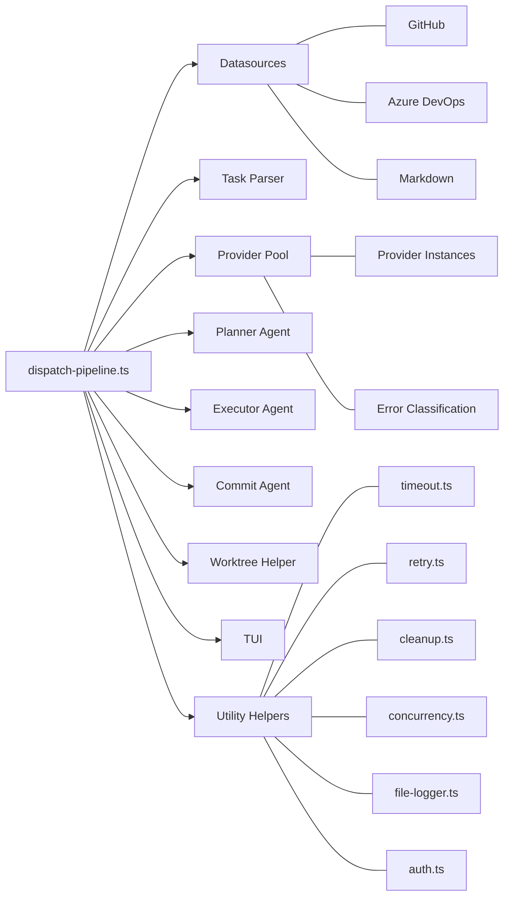

# Integrations

## What it does

The dispatch pipeline (`src/orchestrator/dispatch-pipeline.ts`) integrates
with nine external modules. This page documents each integration: what it
provides, how the pipeline uses it, and what happens when it fails.

## Integration Map

## 1. Datasources

**Module:** `src/datasources/index.ts` via `getDatasource()`

**Interface:** `Datasource` from `src/datasources/interface.ts`

**What the pipeline uses:**

| Method | Where | Purpose |
|---|---|---|
| `list(opts)` | Discovery phase | Fetch all open items matching filters |
| `fetch(id, opts)` | Discovery phase | Fetch a specific item by ID |
| `update(id, title, content, opts)` | After task execution | Sync checked-off task state back to source |
| `getCurrentBranch(opts)` | Before dispatch | Capture the starting branch for PR targets |
| `switchBranch(name, opts)` | Feature mode, cleanup | Switch branches in the main repo |
| `createAndSwitchBranch(name, opts)` | Branch setup | Create and checkout a new branch |
| `pushBranch(name, opts)` | PR lifecycle | Push branch to remote |
| `createPullRequest(branch, issue, title, body, opts, base)` | PR lifecycle | Create a PR |
| `getUsername(opts)` | Before dispatch | Resolve git username for branch naming |
| `buildBranchName(number, title, username)` | Branch setup | Generate branch name from issue metadata |
| `commitAllChanges(message, opts)` | Before commit generation | Stage and commit uncommitted changes |
| `supportsGit()` | Various | Check if the datasource supports git operations |
| `name` | PR body builder | Used for close-reference formatting |

**Failure behavior:** Most datasource failures are caught and logged as
warnings. Exceptions:

- Discovery failures (`list`/`fetch`) cause an early return with an empty
  summary.
- `createAndSwitchBranch` failure during branch setup marks all tasks for
  that issue as failed.
- Feature branch creation failure causes an immediate pipeline exit.

**What data flows back:** `IssueDetails` objects containing `number`, `title`,
`body`, `labels`, `state`, `url`, `comments`, and `acceptanceCriteria`.

## 2. Task Parser

**Module:** `src/parser.ts`

**What the pipeline uses:**

| Function | Where | Purpose |
|---|---|---|
| `parseTaskFile(file)` | Parsing phase | Extract `Task[]` from markdown files |
| `buildTaskContext(content, task)` | Planning phase | Build filtered context for the planner |
| `groupTasksByMode(tasks)` | Dispatch phase | Group tasks by `(P)`/`(S)`/`(I)` prefixes |

**Failure behavior:** `parseTaskFile` returns an empty tasks array if parsing
fails -- the file is silently skipped. `groupTasksByMode` is a pure function
that cannot fail.

**What data flows back:** `TaskFile` objects (containing `path`, `content`,
`tasks`) and `Task` objects (containing `file`, `line`, `text`).

## 3. Provider Pool

**Module:** `src/providers/pool.ts`

**What the pipeline uses:** The pipeline creates `ProviderPool` instances
via the `createPool()` helper function (lines 153-162). Pools are passed
to agents as their `provider` parameter. Agents interact with the pool
through the standard `ProviderInstance` interface -- they never know they
are using a pool.

**Pool creation patterns:**

- **Shared mode:** Three pools created at pipeline scope (executor, planner,
  commit), registered for cleanup.
- **Worktree mode:** Three pools created per worktree inside
  `processIssueFile()`, each scoped to the worktree's `cwd`.

**Failure behavior:**

- **Throttle errors** (detected by `isThrottleError` in
  `src/providers/errors.ts`): trigger automatic failover to the next
  available provider in the pool. The throttled provider is placed on a
  60-second cooldown.
- **All providers throttled:** throws `"ProviderPool: all providers are
  throttled or unavailable"`, which propagates to the task as a failure
  and enters the recovery loop.
- **Non-throttle errors:** propagate directly to the calling agent.

**Cleanup:** `pool.cleanup()` calls `cleanup()` on all booted instances,
clears session and cooldown maps. Registered via `registerCleanup()`.

See [Provider Pool and Failover](../provider-system/pool-and-failover.md) for
full details.

## 4. Planner Agent

**Module:** `src/agents/planner.ts`

**What the pipeline uses:**

| Method | Where | Purpose |
|---|---|---|
| `boot({ provider, cwd })` | Boot phase | Create a planner instance |
| `plan(task, fileContext, cwd, worktreeRoot)` | Task lifecycle | Generate an execution plan |
| `cleanup()` | Resource cleanup | Release planner resources |

**Integration details:**

- The planner is skipped entirely when `--no-plan` is set (`noPlan = true`).
- Planning is wrapped in `withTimeout(planTimeoutMs)` -- default 30 minutes.
- Timeout errors trigger a retry loop up to `maxPlanAttempts` times.
- The `fileContext` parameter provides filtered markdown content from the
  task's source file, giving the planner access to non-task prose (headings,
  notes, implementation details) via `buildTaskContext()`.
- When operating in a worktree, `cwd` is overridden to the worktree path
  and `worktreeRoot` constrains the planner's file access.

**Failure behavior:**

- Timeout after all attempts: task enters the pause/recovery loop.
- Non-timeout error: task enters the pause/recovery loop.
- Empty plan response: treated as a planning failure.

**What data flows back:** `AgentResult<PlannerData>` containing
`data.prompt` (the generated execution plan text).

See [Planner Agent](../agent-system/planner-agent.md).

## 5. Executor Agent

**Module:** `src/agents/executor.ts`

**What the pipeline uses:**

| Method | Where | Purpose |
|---|---|---|
| `boot({ provider, cwd })` | Boot phase | Create an executor instance |
| `execute({ task, cwd, plan, worktreeRoot })` | Task lifecycle | Execute the task |
| `cleanup()` | Resource cleanup | Release executor resources |

**Integration details:**

- Execution is wrapped in `withRetry(resolvedRetries)` -- default 3 retries.
  The retry wrapper re-throws non-success results as errors so they can
  be retried.
- The `plan` parameter is the planner's output (or `null` if `--no-plan`).
- `worktreeRoot` enables worktree isolation in the executor's prompt.

**Failure behavior:**

- All retry attempts exhausted: task enters the pause/recovery loop.
- Non-retryable errors: propagate through `withRetry`'s catch, enter
  pause/recovery.

**What data flows back:** `AgentResult<ExecutorData>` containing
`data.dispatchResult` (the `DispatchResult` with success/failure and
error details).

## 6. Commit Agent

**Module:** `src/agents/commit.ts`

**What the pipeline uses:**

| Method | Where | Purpose |
|---|---|---|
| `boot({ provider, cwd })` | Boot phase | Create a commit agent instance |
| `generate({ branchDiff, issue, taskResults, cwd, worktreeRoot })` | After tasks complete | Generate commit message + PR metadata |
| `cleanup()` | Resource cleanup | No-op (no owned resources) |

**Integration details:**

- Invoked only when branching is enabled, a branch diff exists, and the
  issue was not halted.
- The diff is truncated at 50,000 characters inside the agent's prompt
  builder.
- Results are used for squashing and PR creation. If the agent fails,
  fallback builders (`buildPrTitle`, `buildPrBody`) are used.

**Failure behavior:** All failures are caught and logged as warnings. The
pipeline never fails or pauses due to a commit agent error -- it degrades
gracefully to template-based PR metadata.

See [Commit and PR Generation](./commit-and-pr-generation.md) and
[Commit Agent](../agent-system/commit-agent.md).

## 7. Worktree Helper

**Module:** `src/helpers/worktree.ts`

**What the pipeline uses:**

| Function | Where | Purpose |
|---|---|---|
| `createWorktree(repoRoot, issueFilename, branchName, startPoint?)` | Branch setup | Create an isolated working tree |
| `removeWorktree(repoRoot, issueFilename)` | Cleanup / feature merge | Remove a worktree |
| `worktreeName(issueFilename)` | TUI display | Derive worktree directory name |
| `generateFeatureBranchName()` | Feature mode setup | Generate `dispatch/feature-{uuid}` name |

**Integration details:**

- `createWorktree` includes a 5-retry mechanism with exponential backoff
  for handling `branch already exists`, `already used by worktree`, lock
  contention, and stale ref scenarios.
- `removeWorktree` attempts normal removal, falls back to `--force`, then
  prunes stale references. Failures are logged as warnings (not thrown).
- The `startPoint` parameter is passed when feature mode provides the
  feature branch name as the worktree's starting point.

**Failure behavior:**

- `createWorktree` failure after all retries: throws, causing all tasks
  for that issue to be marked as failed.
- `removeWorktree` failure: warning logged, execution continues.

See [Worktree Lifecycle](./worktree-lifecycle.md) and
[Git and Worktree Management](../git-and-worktree/worktree-management.md).

## 8. TUI

**Module:** `src/tui.ts` via `createTui()`

**What the pipeline uses:**

| Member | Where | Purpose |
|---|---|---|
| `tui.state` | Throughout | Mutable state bag driving TUI rendering |
| `tui.update()` | After state changes | Trigger a render cycle |
| `tui.stop()` | Pipeline exit | Stop rendering and restore terminal |
| `tui.waitForRecoveryAction()` | Recovery loop | Block for user input (rerun/quit) |

**State fields set by the pipeline:**

| Field | Set when |
|---|---|
| `phase` | Each pipeline phase transition |
| `filesFound` | After discovery |
| `tasks` | After parsing |
| `provider` | At pipeline start |
| `source` | At pipeline start |
| `model` | After pool creation |
| `serverUrl` | When `--server-url` is set |
| `notification` | During auth device-code flow |
| `recovery` | When a task enters pause state |

**Verbose mode:** When verbose logging is enabled, the TUI is replaced with
a silent state container that has no-op `update()` and `stop()` methods.
Its `waitForRecoveryAction()` always returns `"quit"`.

**Failure behavior:** TUI failures do not affect pipeline execution. The
TUI is presentation-only.

## 9. Utility Helpers

### 9a. Timeout (`src/helpers/timeout.ts`)

Wraps planning calls with `withTimeout(promise, planTimeoutMs, label)`.
Throws `TimeoutError` on expiration. Default: 30 minutes.

### 9b. Retry (`src/helpers/retry.ts`)

Wraps executor calls with `withRetry(fn, maxRetries, { label })`. Retries
on any thrown error. Default: 3 retries (4 total attempts).

### 9c. Cleanup (`src/helpers/cleanup.ts`)

Array-based registry. `registerCleanup(fn)` adds async cleanup functions.
`runCleanup()` drains all entries sequentially, swallowing errors. Called by
CLI signal handlers on process exit.

The pipeline registers:

- Provider pool cleanup (one per pool)
- Worktree removal (one per worktree)
- Feature branch cleanup (switch back to starting branch)

### 9d. Concurrency (`src/helpers/concurrency.ts`)

`runWithConcurrency({ items, concurrency, worker, shouldStop })` provides
sliding-window concurrency. Used at two levels:

1. **Issue-level:** processes multiple issues in parallel (worktree mode,
   non-feature).
2. **Task-level:** processes tasks within a group concurrently.

The `shouldStop` callback propagates halt signals, preventing new items
from launching while allowing running workers to complete.

### 9e. File Logger (`src/helpers/file-logger.ts`)

`FileLogger` writes structured logs to `.dispatch/logs/issue-{id}.log`.
Created only in verbose mode. Uses `AsyncLocalStorage` for per-issue scoping
in concurrent execution.

The pipeline creates a `FileLogger` per issue, runs `processIssueFile()`
inside `fileLoggerStorage.run(fileLogger, ...)`, and calls `fileLogger.close()`
on completion.

### 9f. Authentication (`src/helpers/auth.ts`)

`ensureAuthReady(source, cwd, org)` pre-authenticates before the TUI starts.
`setAuthPromptHandler(handler)` routes device-code prompts into the TUI
notification banner during datasource discovery. The handler is cleared
after discovery completes.

### 9g. Run State (`src/helpers/run-state.ts`)

`buildTaskId(task)` generates a stable task identifier from the task's file
path and line number. Used in progress callback events for external consumers
to track individual task progress.

## Cross-References

- [Pipeline Lifecycle](./pipeline-lifecycle.md) -- how integrations fit into
  the six-phase pipeline.
- [Provider Pool and Failover](../provider-system/pool-and-failover.md) -- pool
  construction and failover mechanics.
- [Worktree Lifecycle](./worktree-lifecycle.md) -- worktree creation and
  cleanup.
- [Task Recovery](./task-recovery.md) -- how failed tasks interact with
  the TUI recovery loop.
- [Feature Branch Mode](./feature-branch-mode.md) -- feature-specific
  integration patterns.
- [Commit and PR Generation](./commit-and-pr-generation.md) -- commit agent
  integration details.
- [Planning and Dispatch Overview](../planning-and-dispatch/overview.md)
- [Datasource System](../datasource-system/)
- [Provider System](../provider-system/)
- [Agent System](../agent-system/)
- [Shared Utilities](../shared-utilities/)
- [Dispatch Pipeline Tests](../testing/dispatch-pipeline-tests.md) -- test
  coverage for pipeline integration scenarios
- [Helpers & Utilities Tests](../testing/helpers-utilities-tests.md) -- tests
  for retry, timeout, cleanup, and concurrency helpers
