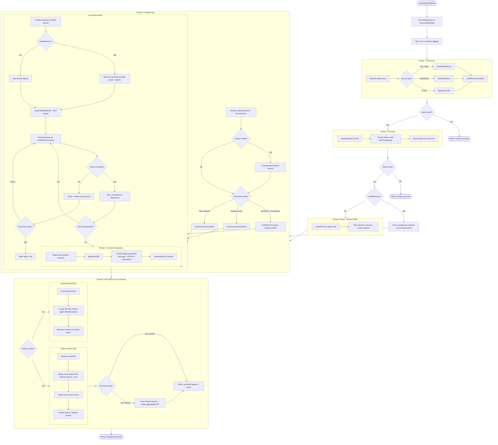

# Pipeline Lifecycle

## What it does

The dispatch pipeline (`src/orchestrator/dispatch-pipeline.ts`) is the core
execution engine of Dispatch. It orchestrates the end-to-end lifecycle of
processing work items: discovering tasks from a datasource, parsing them into
executable units, booting AI provider pools, dispatching tasks through planner
and executor agents, generating commit messages, and managing the git/PR
lifecycle.

The pipeline coordinates nine subsystems:

1. **Datasources** -- fetch work items from GitHub, Azure DevOps, or local
   Markdown files.
2. **Task parsing** -- extract actionable task lines from issue bodies.
3. **Provider pools** -- boot and manage AI provider connections with failover.
4. **Planner agent** -- generate execution plans for each task.
5. **Executor agent** -- carry out the planned work.
6. **Commit agent** -- produce conventional commit messages, PR titles, and PR
   descriptions from diffs.
7. **Git worktrees** -- isolate concurrent issue work in separate working trees.
8. **TUI** -- render real-time progress in the terminal.
9. **Authentication & file logging** -- pre-authenticate before TUI starts;
   write per-issue log files in verbose mode.

The single entry point is `runDispatchPipeline()`, which accepts an
`OrchestrateRunOptions` bag and the working directory, and returns a
`DispatchSummary`.

## Why it exists

The pipeline exists to solve the orchestration problem: individual subsystems
(providers, agents, git, datasources) each handle one concern, but the pipeline
must choreograph them into a coherent, fault-tolerant workflow that handles
concurrent execution, feature branch merging, interactive error recovery, and
clean resource teardown.

Without the pipeline, callers would need to manually sequence datasource
discovery, parser invocation, provider boot, branch creation, task dispatch,
commit generation, PR creation, and cleanup -- duplicating hundreds of lines of
coordination logic wherever tasks need to run.

## Pipeline Phases

The pipeline progresses through six phases. The diagram below shows the full
flow including decision points for worktree mode and feature mode.



### Phase 1: Discovery (lines 225-274)

The pipeline resolves the configured datasource via `getDatasource()`. For the
`md` datasource it probes for a git repository and disables branching if none is
found. Items are fetched by one of three strategies:

- **Glob/file patterns** -- when the `md` datasource receives IDs that look like
  file paths or globs, `resolveGlobItems()` expands them.
- **Explicit IDs** -- `fetchItemsById()` retrieves specific issues from the
  datasource.
- **List** -- `datasource.list()` returns all open items matching the configured
  filters (org, project, iteration, area, work-item type).

Fetched items are written to a temp directory via `writeItemsToTempDir()` and
the TUI's `filesFound` counter is updated.

### Phase 2: Parsing (lines 276-316)

Each temp file is passed through `parseTaskFile()` to extract unchecked task
lines. The results are used to:

1. Build the flat `allTasks` array.
2. Build `fileContentMap` -- a lookup from file path to raw content, used later
   as filtered planner context via `buildTaskContext()`.
3. Group tasks by source file into `tasksByFile` -- each file represents one
   issue, and this map drives the outer dispatch loop.

### Phase 3: Booting (lines 323-360)

Provider pool creation depends on the execution mode:

- **Shared mode** (no worktrees) -- three pools are created at pipeline scope,
  one per agent role (executor, planner, commit). Each pool uses `createPool()`,
  which places the agent's configured provider at priority 0 and adds all other
  unique provider/model combinations as fallback entries. Agents are booted
  immediately.
- **Worktree mode** -- pool creation is deferred to `processIssueFile()` so each
  worktree gets its own isolated pools rooted at the worktree path. This
  prevents cross-worktree cwd conflicts.

See [Provider Pool and Failover](./provider-pool-and-failover.md) for pool
internals and failover semantics.

### Phase 4: Dispatching (lines 362-978)

The main execution phase. Before entering the dispatch loop, the pipeline:

1. Captures the **starting branch** via `datasource.getCurrentBranch()` -- this
   serves as the PR target and the branch to return to after completion.
2. Optionally creates a **feature branch** from the starting branch (when
   `--feature` is set).
3. Resolves the **git username** for branch naming.

Execution mode is selected by two conditions:

| Condition | Mode |
|---|---|
| `useWorktrees && !feature` | Sliding-window concurrency via `runWithConcurrency()` |
| `feature` (any) | Serial -- avoids merge conflicts on the shared feature branch |
| `!useWorktrees` | Serial -- single branch, cannot parallelize |

Each issue is processed by `processIssueFile()` -- see the dedicated section
below.

### Phase 5: Commit Generation (lines 797-828)

After all tasks for an issue complete, the pipeline:

1. Stages any uncommitted changes via `datasource.commitAllChanges()`.
2. Gets the branch diff against the base branch via `getBranchDiff()`.
3. Invokes the commit agent with the diff, issue details, and task results. The
   agent returns a conventional commit message, PR title, and PR description.
4. Squashes all branch commits into a single commit via
   `squashBranchCommits()`.

If the commit agent fails, the pipeline falls back to `buildPrTitle()` and
`buildPrBody()` for PR metadata.

See [Commit and PR Generation](./commit-and-pr-generation.md) and
[Commit Agent](../agent-system/commit-agent.md) for details.

### Phase 6: PR Lifecycle & Cleanup (lines 830-1040)

Two paths exist depending on whether feature mode is active:

**Feature mode:**

1. Remove the worktree for the issue.
2. Switch to the feature branch.
3. Merge the issue branch with `--no-ff` to preserve history.
4. Delete the local issue branch.
5. Switch back to the starting branch for the next issue.
6. After all issues complete, push the feature branch and create an aggregated
   PR via `buildFeaturePrTitle()` / `buildFeaturePrBody()`.

**Normal mode:**

1. Push the issue branch via `datasource.pushBranch()`.
2. Create a PR per issue using the commit agent's title and description (or
   fall back to `buildPrTitle()` / `buildPrBody()`).
3. Remove the worktree (worktree mode) or switch back to the default branch
   (serial mode).

After all issues, shared agent instances and provider pools are cleaned up.

See [Feature Branch Mode](./feature-branch-mode.md) and
[Worktree Lifecycle](./worktree-lifecycle.md).

## Execution Mode Decision

The `useWorktrees` flag is computed as:

```
useWorktrees = !noWorktree && (feature || (!noBranch && tasksByFile.size > 1))
```

Interpretation:

- **Worktrees are used when:** the user has not opted out via `--no-worktree`
  AND either feature mode is active OR branching is enabled with multiple
  issues.
- **Single-issue runs** use serial mode to avoid unnecessary worktree overhead.
  Creating a worktree for a single issue adds git overhead with no concurrency
  benefit.
- **Feature mode always uses worktrees** (unless explicitly disabled) because
  each issue needs its own branch that will be merged into the feature branch.

## Task Mode Grouping

Tasks within each issue are grouped by `groupTasksByMode()` using mode prefixes
on the task text:

| Prefix | Mode | Behavior |
|---|---|---|
| `(P)` | Parallel | Tasks in the group run concurrently up to the concurrency limit |
| `(S)` | Serial | Tasks in the group run one at a time |
| `(I)` | Interactive / Isolated | Tasks run in isolation with full interactive recovery |

Groups are extracted in order and execute **sequentially** -- the pipeline
finishes one group before starting the next. Within each group, tasks execute
concurrently via `runWithConcurrency()` up to the configured `concurrency`
limit.

See `src/parser.ts` for the grouping algorithm.

## processIssueFile() Lifecycle

The `processIssueFile()` closure (lines 444-952) is the core inner loop. It
processes all tasks for a single issue file and manages the full branch-to-PR
lifecycle for that issue.

### 1. Branch / Worktree Setup

When branching is enabled and issue details are available:

- **Worktree mode:** calls `createWorktree()` to create an isolated working
  tree with its own branch. Registers a cleanup handler to remove the worktree
  on exit. Sets `issueCwd` to the worktree path.
- **Serial mode:** calls `datasource.createAndSwitchBranch()` to create and
  check out a new branch in the main working directory.

The branch name is generated by `datasource.buildBranchName()` using the issue
number, title, and resolved git username.

### 2. Per-Worktree Provider Pool Boot

When `useWorktrees` is true, three new provider pools are created scoped to the
worktree's `issueCwd`. Each pool gets its own `registerCleanup()` handler.
Planner, executor, and commit agents are booted against these local pools.

When worktrees are not used, the shared agents from Phase 3 are reused.

### 3. Task Lifecycle: Plan, Execute, Sync, Mark Done

For each task group (from `groupTasksByMode()`), tasks run through
`runTaskLifecycle()`:

1. **Plan** (if planner is enabled): invokes `localPlanner.plan()` with a
   timeout (`planTimeoutMs`) and retry loop (`maxPlanAttempts`). Timeout errors
   trigger retries; other errors pause the task.
2. **Execute**: invokes `localExecutor.execute()` with the plan (or null if
   `--no-plan`). Wrapped in `withRetry()` for automatic retry on failure.
3. **Sync to datasource**: reads the updated task file and calls
   `datasource.update()` to sync the checked-off state back to the source.
4. **Mark done**: updates TUI status and emits progress events.

### 4. Pause / Recovery Loop

When a task fails (planning or execution), the pipeline enters a recovery loop:

1. The task is marked as `paused` in the TUI.
2. The TUI enters `paused` phase and renders the recovery prompt with error
   details, issue context, and worktree path.
3. The user selects an action:
    - **Rerun** -- re-executes `runTaskLifecycle()` for the failed task.
    - **Quit** -- marks the task as failed and halts the pipeline.
4. In non-interactive environments (verbose mode or non-TTY), the task is
   immediately marked as failed and the pipeline halts.

See [Task Recovery](./task-recovery.md) for the full recovery flow.

### 5. Commit Generation and Squashing

After all task groups complete (and the issue was not halted), the pipeline
stages uncommitted changes, generates a commit message via the commit agent,
and squashes all branch commits into a single conventional commit.

### 6. PR Creation or Feature Branch Merge

Delegates to the feature mode or normal mode path as described in Phase 6
above.

### 7. Resource Cleanup

When using worktrees, the local executor and planner agents are cleaned up at
the end of `processIssueFile()`. Shared agents are cleaned up at pipeline
scope.

## Configuration Parameters

| Parameter | Default | Description |
|---|---|---|
| `concurrency` | `1` | Maximum number of concurrent tasks/issues |
| `planTimeout` | `30` (minutes, via `DEFAULT_PLAN_TIMEOUT_MIN`) | Per-task planning timeout |
| `planRetries` | Falls back to `retries` | Number of planning retry attempts after timeout |
| `retries` | `3` (via `DEFAULT_RETRY_COUNT`) | Number of executor retry attempts |
| `noPlan` | `false` | Skip the planner agent entirely |
| `noBranch` | `false` | Disable git branch creation |
| `noWorktree` | `false` | Disable worktree-based parallelism |
| `feature` | `undefined` | Enable feature branch mode; optionally provide a branch name |
| `dryRun` | `false` | Discover and parse tasks without executing |
| `provider` | `"opencode"` | Primary provider name |
| `model` | `undefined` | Model override for the primary provider |
| `fastProvider` | `undefined` | Provider for fast/cheap agent roles |
| `fastModel` | `undefined` | Model override for fast provider |
| `agents` | `undefined` | Per-agent provider/model overrides |

### Per-Agent Config Resolution

The function `resolveAgentProviderConfig()` (from `src/config.ts`) resolves the
provider and model for each agent role (`planner`, `executor`, `commit`). The
resolution order is:

1. Explicit per-agent override from the `agents` map.
2. Role-specific fallback: planner and commit use `fastProvider`/`fastModel` if
   set.
3. Global `provider`/`model` defaults.

## Dry-Run Mode

The `dryRunMode()` function (lines 1052-1130) provides a safe preview of what
the pipeline would execute. It runs the discovery and parsing phases but does
**not** boot providers, execute tasks, create branches, or generate commits.

For each discovered task, it logs:

- The source file path and line number.
- The task text.
- The branch name that would be created (resolved via
  `datasource.buildBranchName()`).

All tasks are returned as `skipped` in the summary. This mode is useful for
validating datasource configuration and task extraction before committing to a
full run.

## Pre-Authentication

Before the TUI starts (and while stdout is still free for interactive prompts),
`ensureAuthReady(source, cwd, org)` runs the authentication flow:

- **Cached tokens:** resolves instantly with no user interaction.
- **New authentication:** runs the device code flow, printing the authorization
  URL and code to stdout.

Once the TUI is active, device-code prompts from subsequent auth flows are
routed into the TUI notification banner via `setAuthPromptHandler()`. The
handler is cleared after discovery completes and auth is no longer needed.

## Cross-References

Pipeline subsystem docs:

- [Provider Pool and Failover](./provider-pool-and-failover.md) -- pool
  creation, failover semantics, and entry prioritization.
- [Worktree Lifecycle](./worktree-lifecycle.md) -- worktree creation, cleanup,
  and naming conventions.
- [Task Recovery](./task-recovery.md) -- pause/recovery loop, interactive
  prompts, and non-TTY behavior.
- [Feature Branch Mode](./feature-branch-mode.md) -- feature branch creation,
  merge strategy, and aggregated PRs.
- [Commit and PR Generation](./commit-and-pr-generation.md) -- commit agent
  invocation, squashing, and PR body construction.
- [Integrations](./integrations.md) -- how the pipeline integrates with
  external modules.
- [Troubleshooting](./troubleshooting.md) -- common failure modes and debugging
  strategies.

Related system docs:

- [Planning & Dispatch Overview](../planning-and-dispatch/overview.md)
- [Worktree Management](../git-and-worktree/worktree-management.md)
- [Commit Agent](../agent-system/commit-agent.md)
- [Task Parsing Overview](../task-parsing/overview.md)
- [Testing Overview](../testing/overview.md) -- dispatch pipeline test coverage
- [Dispatch Pipeline Tests](../testing/dispatch-pipeline-tests.md)
