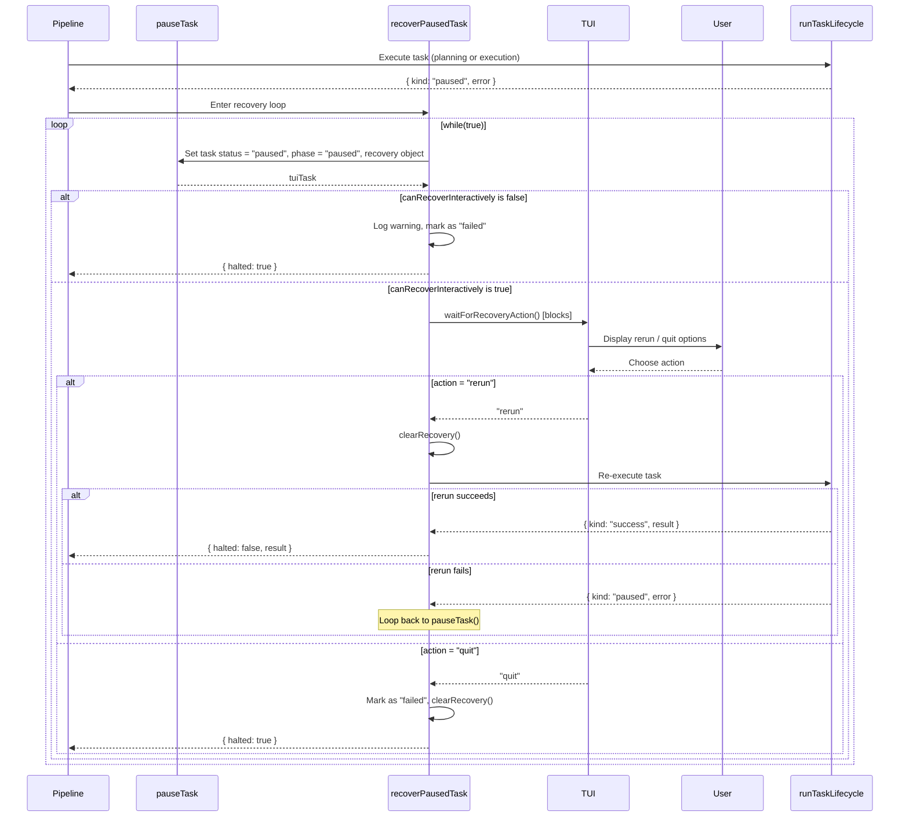

# Task Recovery

## What it does

When a task fails during planning or execution, the dispatch pipeline enters a
pause/recovery loop instead of immediately marking the task as failed. In
interactive (TTY) environments, the TUI presents the user with rerun/quit
options. In non-TTY or verbose mode, tasks fail immediately with a warning.

The recovery logic lives in `src/orchestrator/dispatch-pipeline.ts` (lines
540-782), implemented by `pauseTask()`, `clearRecovery()`, and
`recoverPausedTask()`.

## Why it exists

AI agent execution is non-deterministic -- a task that fails once may succeed on
retry. The recovery mechanism gives users a chance to inspect failures and retry
without restarting the entire pipeline. This is especially valuable in
long-running pipelines with many issues where restarting from scratch would
waste significant time and API credits.

## Task States

Tasks move through the following state machine:

```
pending --> planning --> running --> done        (success path)

planning --> paused                              (plan failure)
running  --> paused                              (execution failure)
paused   --> planning                            (rerun action)
paused   --> failed                              (quit action or non-interactive)
```

- **pending** -- task is queued but not yet started.
- **planning** -- the planner agent is generating a plan for the task.
- **running** -- the executor agent is carrying out the task.
- **done** -- task completed successfully.
- **paused** -- task failed and is awaiting user action (interactive) or
  immediate failure (non-interactive).
- **failed** -- task permanently failed; no further retries.

## Interactive Recovery



The `canRecoverInteractively` guard is defined as:

```
!verbose && process.stdin.isTTY === true && process.stdout.isTTY === true
```

When the guard is true, the TUI blocks on `waitForRecoveryAction()` until the
user selects an action. The `pauseTask()` helper populates `tui.state.recovery`
with the task text, error message, issue details (number and title), worktree
path, and a default `selectedAction` of `"rerun"`.

## Halt Propagation

When `recoverPausedTask()` returns `{ halted: true }`, three flags are set in
the enclosing scope:

- **`stopAfterIssue = true`** -- no more task groups are processed for the
  current issue.
- **`halted = true`** -- no more issues are processed by the pipeline.
- **`preserveContext = true`** -- commit generation and PR creation are skipped;
  the branch and worktree are left intact for manual inspection.

In concurrent (worktree) mode, the `shouldStop: () => halted` callback passed
to `runWithConcurrency()` prevents new issues from launching once the halt
flag is set.

## Batch Recovery

Paused tasks are collected per-group and processed sequentially after the
concurrent group finishes:

1. `runWithConcurrency()` runs a task group with the configured concurrency
   level.
2. Results are categorized:
    - **fulfilled + success** -- result is collected into `issueResults` and
      `results`.
    - **fulfilled + paused** -- added to the `pausedTasks` array.
    - **rejected** -- treated as paused (error converted from the rejection
      reason).
    - **skipped** -- ignored (task was skipped due to `shouldStop`).
3. After the group finishes, each paused task goes through
   `recoverPausedTask()` sequentially.
4. If any recovery returns `{ halted: true }`, remaining paused tasks are
   skipped and the halt flag propagates upward.

## Non-TTY Behavior

When `canRecoverInteractively` is false (verbose mode, piped output, CI
environments):

- The task is immediately marked as `failed`.
- A warning is logged: "Manual rerun requires an interactive terminal; verbose
  or non-TTY runs will not wait for input, and the current branch/worktree
  will be left intact."
- `halted` is set to `true`, stopping the pipeline.
- The branch and worktree are preserved for manual debugging.

## Retry vs Recovery

There are three distinct failure-handling mechanisms in the pipeline, each
operating at a different layer:

1. **Automatic retry** (`withRetry` in `src/helpers/retry.ts`): wraps executor
   execution and retries up to `resolvedRetries` times (default 3)
   automatically without user interaction. Only applies to execution, not
   planning. Retries on any thrown error.

2. **Planning timeout retry**: the planner has its own retry loop with
   `maxPlanAttempts = planRetries + 1`. Uses `withTimeout()` with a
   configurable timeout (default 30 minutes, defined as
   `DEFAULT_PLAN_TIMEOUT_MIN` in `src/helpers/timeout.ts`). Only retries on
   `TimeoutError` -- other planning errors cause an immediate pause.

3. **Interactive recovery** (this document): kicks in AFTER automatic retries
   are exhausted. User-driven via the TUI, applies to both planning and
   execution failures. The user can retry indefinitely or quit.

## Cross-References

- [Pipeline Lifecycle](./pipeline-lifecycle.md) — overall pipeline flow
- [Troubleshooting](./troubleshooting.md) — common failure scenarios
- [Planning & Dispatch Overview](../planning-and-dispatch/overview.md) — task
  state machine
- [Concurrency](../shared-utilities/concurrency.md) — `runWithConcurrency()` used for batch task execution and `shouldStop` integration
- [Run State](../git-and-worktree/run-state.md) — persistent run state that tracks task status across pipeline runs
- [Provider Pool and Failover](../provider-system/pool-and-failover.md) — provider-level retry and failover that operates before task recovery
- [Shared Utilities Overview](../shared-utilities/overview.md) — `withRetry()` and `withTimeout()` helpers that feed into the recovery flow
- [Commit and PR Generation](./commit-and-pr-generation.md) — skipped when `preserveContext` is set after halt
- [Feature Branch Mode](./feature-branch-mode.md) — halt propagation in feature branch contexts
