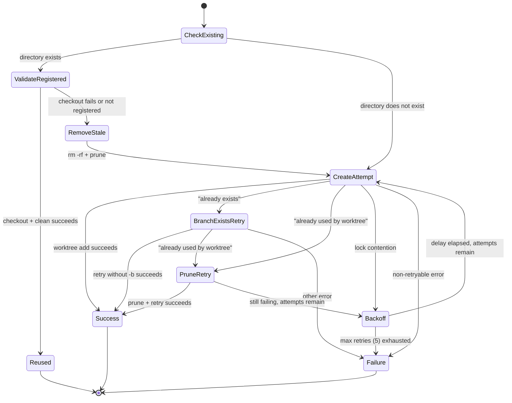

# Worktree Lifecycle

## What it does

Git worktree lifecycle manager that creates, validates, reuses, and removes
git worktrees in `.dispatch/worktrees/`. Each worktree provides
filesystem-level isolation for concurrent issue processing. Directory names
are derived from issue filenames: `123-fix-auth-bug.md` becomes `issue-123`.

Source: `src/helpers/worktree.ts`

## Why it exists

Concurrent task execution requires filesystem isolation. Multiple AI agents
working simultaneously cannot share a single working directory without file
conflicts. Git worktrees provide true filesystem-level isolation with
independent branches, allowing parallel execution without merge conflicts
during work.

## Worktree Naming

`worktreeName(issueFilename)` derives a directory name from an issue file:

1. Strip the `.md` extension.
2. Extract the leading numeric ID via `/^(\d+)/`.
    - Match found: return `issue-{id}` (e.g. `123-fix-auth-bug.md` becomes
      `issue-123`).
    - No match: fall back to `slugify(withoutExt)`.
3. Final path: `.dispatch/worktrees/<name>` relative to the repository root.

## Creation with Retry Logic

`createWorktree(repoRoot, issueFilename, branchName, startPoint?)` creates a
worktree at `.dispatch/worktrees/<name>`, checking out a new branch. The
`startPoint` parameter is used for feature branches -- when provided, the
worktree branch starts from that commit or branch instead of HEAD.

### Pre-check for existing directory

1. If the target directory exists, run `git worktree list --porcelain` to
   check whether it is a registered worktree.
2. If registered: attempt `git checkout --force <branch>` followed by
   `git clean -fd` to reuse it in a clean state.
3. If checkout fails or the directory is not registered: remove the directory
   with `rm -rf` and run `git worktree prune`.

### Retry mechanism

Up to 5 attempts with exponential backoff starting at 200 ms
(200, 400, 800, 1600, 3200 ms):

- **Attempt**: `git worktree add <path> -b <branchName> [startPoint]`
- **Branch already exists**: retry without the `-b` flag to use the existing
  branch. If that fails with "already used by worktree", run
  `git worktree prune` then retry.
- **Already used by worktree**: run `git worktree prune` then retry.
- **Lock contention**: apply exponential backoff and retry.
- **Non-retryable errors** (message contains neither "lock" nor "already"):
  throw immediately.

### State diagram



## Removal

`removeWorktree(repoRoot, issueFilename)` tears down a worktree:

1. Try `git worktree remove <path>`.
2. On failure, try `git worktree remove --force <path>`.
3. On failure, log a warning -- do not throw so execution can continue.
4. Always run `git worktree prune` to clean stale references.

## Feature Branch Name Generation

`generateFeatureBranchName()` produces a name in the format
`dispatch/feature-{octet}`, where `{octet}` is the first 8 hex characters of
a random UUID (e.g. `dispatch/feature-a1b2c3d4`).

## Integration with Pipeline

The pipeline (in `src/orchestrator/dispatch-pipeline.ts`) decides whether to
use worktrees with the following condition:

```
useWorktrees = !noWorktree && (feature || (!noBranch && tasksByFile.size > 1))
```

In worktree mode:

- Each issue gets its own worktree and branch.
- Provider pools are created per-worktree, not shared across issues.
- `registerCleanup()` ensures worktree removal on process exit.
- Feature mode creates worktrees from the feature branch as `startPoint`.

When worktrees are disabled (single issue, `--no-worktree` flag, or
`--no-branch`), a single shared set of provider pools is used instead.

## Cross-References

- [Pipeline Lifecycle](./pipeline-lifecycle.md)
- [Integrations](./integrations.md) — How the worktree helper integrates with
  the dispatch pipeline
- [Worktree Management](../git-and-worktree/worktree-management.md) — covers
  basic worktree operations but not the retry logic documented here
- [Git & Worktree Overview](../git-and-worktree/overview.md) — Worktree
  isolation model and git operations
- [Feature Branch Mode](./feature-branch-mode.md)
- [Dispatch Pipeline Tests](../testing/dispatch-pipeline-tests.md) — Tests
  covering worktree creation, cleanup, and pipeline integration
