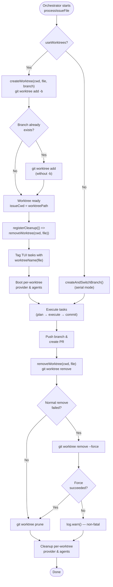

# Git Worktree and Repository Helpers

The git-and-worktree group provides three helper modules that manage filesystem
isolation, run-state persistence, and repository hygiene for the Dispatch CLI.
Together they allow the orchestrator to execute multiple issue files in parallel
— each in its own git worktree — and to resume interrupted runs without
re-executing already-successful tasks.

| File | Purpose |
|------|---------|
| [`src/helpers/worktree.ts`](../../src/helpers/worktree.ts) | Create, remove, and list git worktrees under `.dispatch/worktrees/` |
| [`src/helpers/run-state.ts`](../../src/helpers/run-state.ts) | Persist and query per-run task status in `.dispatch/run-state.json` |
| [`src/helpers/gitignore.ts`](../../src/helpers/gitignore.ts) | Ensure the `.gitignore` file contains a given entry |

## Why these modules exist

Dispatch can process multiple issue files simultaneously. Without isolation each
concurrent AI agent session would see uncommitted changes from other sessions,
leading to merge conflicts and nonsensical diffs. Git worktrees solve this by
giving each issue file its own working directory that shares the same object
store and ref namespace as the main repository.

Run-state persistence is a complementary concern: a dispatch run can be
interrupted by a signal, a provider timeout, or a transient network error. By
recording each task's status to disk after every state transition, the
[run-state module](./run-state.md) enables a future "resume" capability that
skips tasks already marked `success`.

The [gitignore helper](./gitignore-helper.md) is a single-purpose utility that
keeps `.dispatch/worktrees/` out of version control. It is called once at the
start of every orchestrator run so that worktree directories are never
accidentally committed.

## Worktree lifecycle

The following diagram shows the full lifecycle of a worktree from creation
through cleanup. The orchestrator drives this lifecycle inside
`processIssueFile` in `src/orchestrator/dispatch-pipeline.ts`.

## How the orchestrator uses these modules

The dispatch pipeline in `src/orchestrator/dispatch-pipeline.ts` determines
whether to use worktrees based on the `useWorktrees` flag (derived from the
`--worktrees` CLI option). When enabled:

1. **Runner startup** (`src/orchestrator/runner.ts:151`): Calls
   `ensureGitignoreEntry(cwd, ".dispatch/worktrees/")` to keep worktree
   directories untracked.

2. **Per-issue setup** (`dispatch-pipeline.ts:249–254`): Calls `createWorktree`
   with the issue filename and a datasource-generated branch name. Registers a
   cleanup handler that calls `removeWorktree` so that abnormal termination
   (signals, uncaught errors) still cleans up.

3. **TUI labeling** (`dispatch-pipeline.ts:256–260`): Uses `worktreeName` to
   tag each TUI task row with its worktree identifier for grouped display.

4. **Parallel execution** (`dispatch-pipeline.ts:555–560`): Wraps all issue
   files in `Promise.all`, each running in its own worktree with its own
   provider instance.

5. **Post-execution cleanup** (`dispatch-pipeline.ts:529–535`): Explicitly
   calls `removeWorktree` after pushing the branch and creating the PR. The
   registered cleanup handler serves as a safety net.

## Design decisions

### Worktree directory placement

Worktrees are placed under `.dispatch/worktrees/<slug>` rather than in a
system temp directory. This keeps them adjacent to the source repository for
easy manual inspection during development and debugging. The tradeoff is that
the `.gitignore` entry is required to prevent accidental commits.

### Non-fatal error handling

Both `removeWorktree` and `ensureGitignoreEntry` log warnings instead of
throwing on failure. The rationale is that a failure to clean up a worktree or
update `.gitignore` should not abort an otherwise successful dispatch run. The
user can manually clean up stale worktrees with `git worktree prune`.

### Atomic writes for run-state

`saveRunState` uses a write-to-temp-then-rename pattern
(`run-state.json.tmp` → `run-state.json`) to prevent partial writes from
corrupting the state file. This is the same atomic-write technique recommended
in the [Architecture & Concurrency](../task-parsing/architecture-and-concurrency.md)
documentation for file mutation safety.

### Branch reuse fallback

`createWorktree` first attempts `git worktree add <path> -b <branch>` to
create a new branch. If the branch already exists (e.g., from a previous
interrupted run), it falls back to `git worktree add <path> <branch>` without
`-b`. This makes re-runs idempotent with respect to branch names.

## Detailed documentation

- [Worktree Management](./worktree-management.md) — Worktree creation, removal,
  listing, slug derivation, and Git CLI interactions
- [Run State Persistence](./run-state.md) — State file format, task lifecycle
  state machine, atomic writes, and resume semantics
- [Gitignore Helper](./gitignore-helper.md) — Entry deduplication, error handling,
  and race condition analysis
- [Integrations](./integrations.md) — Git CLI subprocess management,
  `child_process.execFile`, and `fs/promises` usage patterns

## Related documentation

- [Architecture Overview](../architecture.md) — System-wide topology including
  the worktree isolation model
- [CLI & Orchestration](../cli-orchestration/overview.md) — The orchestrator
  pipeline that drives worktree lifecycle
- [Orchestrator Pipeline](../cli-orchestration/orchestrator.md) — Detailed
  pipeline stages including parallel execution
- [Shared Utilities — Slugify](../shared-utilities/slugify.md) — The slug
  algorithm used to derive worktree directory names
- [Shared Types — Integrations](../shared-types/integrations.md) — Node.js
  `fs/promises` patterns used across the codebase
- [Planning and Dispatch — Git](../planning-and-dispatch/git.md) — Post-task
  git commit operations (distinct from worktree management)
- [Cleanup Registry](../shared-types/cleanup.md) — The cleanup mechanism that
  ensures worktree removal on abnormal exit
- [Prerequisites & Safety Checks](../prereqs-and-safety/overview.md) — The
  pre-flight validation that runs before worktree operations begin
- [Testing Overview](../testing/overview.md) — Project-wide test suite
  (note: worktree helpers have no unit tests)
