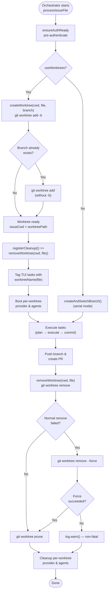

# Git, Worktree, and Authentication Helpers

The git-and-worktree group provides five helper modules that manage
authentication, filesystem isolation, branch name safety, run-state
persistence, and repository hygiene for the Dispatch CLI. Together they allow
the orchestrator to authenticate against remote platforms, execute multiple
issue files in parallel -- each in its own git worktree -- without polluting the
user's main working directory, and to resume interrupted runs without
re-executing already-successful tasks.

| File | Purpose |
|------|---------|
| [`src/helpers/auth.ts`](../../src/helpers/auth.ts) | OAuth device-flow authentication for GitHub and Azure DevOps with token caching |
| [`src/helpers/worktree.ts`](../../src/helpers/worktree.ts) | Create, remove, and list git worktrees under `.dispatch/worktrees/` |
| [`src/helpers/branch-validation.ts`](../../src/helpers/branch-validation.ts) | Validate branch names against git refname rules; prevent command injection |
| [`src/helpers/run-state.ts`](../../src/helpers/run-state.ts) | Persist and query per-run task status in SQLite via `better-sqlite3` |
| [`src/helpers/gitignore.ts`](../../src/helpers/gitignore.ts) | Ensure the `.gitignore` file contains a given entry |

## Why these modules exist

Dispatch can process multiple issue files simultaneously. Without isolation each
concurrent AI agent session would see uncommitted changes from other sessions,
leading to merge conflicts and nonsensical diffs. Git worktrees solve this by
giving each issue file its own working directory that shares the same object
store and ref namespace as the main repository.

Authentication is a prerequisite for any pipeline run that interacts with a
remote issue tracker. The [authentication module](./authentication.md) handles
OAuth device-flow login for both GitHub (via Octokit) and Azure DevOps (via
`@azure/identity`), caching tokens at `~/.dispatch/auth.json` so users only
authenticate once per platform until tokens expire. The `ensureAuthReady`
function is the shared entry point called by both the dispatch and spec
pipelines before stdout is taken over by the TUI or batch output.

Run-state persistence is a complementary concern: a dispatch run can be
interrupted by a signal, a provider timeout, or a transient network error. By
recording each task's status in a SQLite database after every state transition,
the [run-state module](./run-state.md) enables a "resume" capability that skips
tasks already marked `success`. The run-state implementation migrated from a
JSON-file approach to SQLite (backed by `better-sqlite3`) to share the database
managed by `src/mcp/state/database.ts`, with automatic one-time migration of
legacy `.dispatch/run-state.json` files.

The [gitignore helper](./gitignore-helper.md) is a single-purpose utility that
keeps `.dispatch/worktrees/` out of version control. It is called once at the
start of every orchestrator run so that worktree directories are never
accidentally committed.

## Architectural position

These helpers form a **horizontal infrastructure layer** beneath the orchestrator
and pipeline layers. They are consumed by:

- **Orchestrator runner** (`src/orchestrator/runner.ts`): calls `ensureAuthReady`,
  `ensureGitignoreEntry`, and `checkPrereqs` during startup
- **Dispatch pipeline** (`src/orchestrator/dispatch-pipeline.ts`): calls
  `createWorktree`, `removeWorktree`, `worktreeName`, and run-state functions
- **Spec pipeline** (`src/orchestrator/spec-pipeline.ts`): calls
  `ensureAuthReady` for pre-authentication

They depend downward on:

- **Constants** (`src/constants.ts`): OAuth client IDs and scopes
- **Datasource registry** (`src/datasources/index.ts`): URL parsing for auth
  target detection
- **MCP state database** (`src/mcp/state/database.ts`): SQLite connection for
  run-state persistence
- **Logger** (`src/helpers/logger.ts`): structured logging throughout

## Worktree lifecycle

The following diagram shows the full lifecycle of a worktree from creation
through cleanup. The orchestrator drives this lifecycle inside
`processIssueFile` in `src/orchestrator/dispatch-pipeline.ts`.

## How the orchestrator uses these modules

The dispatch pipeline in `src/orchestrator/dispatch-pipeline.ts` determines
whether to use worktrees based on the `useWorktrees` flag (derived from the
`--worktrees` CLI option). When enabled:

1. **Runner startup** (`src/orchestrator/runner.ts`): Calls
   `ensureAuthReady(source, cwd)` to pre-authenticate before the TUI starts,
   then calls `ensureGitignoreEntry(cwd, ".dispatch/worktrees/")` to keep
   worktree directories untracked.

2. **Per-issue setup** (`dispatch-pipeline.ts`): Calls `createWorktree`
   with the issue filename and a datasource-generated branch name. Registers a
   cleanup handler that calls `removeWorktree` so that abnormal termination
   (signals, uncaught errors) still cleans up.

3. **TUI labeling** (`dispatch-pipeline.ts`): Uses `worktreeName` to
   tag each TUI task row with its worktree identifier for grouped display.

4. **Parallel execution** (`dispatch-pipeline.ts`): Wraps all issue
   files in `Promise.all`, each running in its own worktree with its own
   provider instance.

5. **Post-execution cleanup** (`dispatch-pipeline.ts`): Explicitly
   calls `removeWorktree` after pushing the branch and creating the PR. The
   registered cleanup handler serves as a safety net.

## Design decisions

### Token caching at ~/.dispatch/auth.json

Authentication tokens are cached in a JSON file in the user's home directory
rather than in the project-local `.dispatch/` directory. This ensures tokens
persist across projects and are not accidentally committed to version control.
The file is written with mode `0o600` (owner-only read/write) on non-Windows
platforms for security.

### Worktree directory placement

Worktrees are placed under `.dispatch/worktrees/<slug>` rather than in a
system temp directory. This keeps them adjacent to the source repository for
easy manual inspection during development and debugging. The tradeoff is that
the `.gitignore` entry is required to prevent accidental commits.

### Non-fatal error handling

Both `removeWorktree` and `ensureGitignoreEntry` log warnings instead of
throwing on failure. The rationale is that a failure to clean up a worktree or
update `.gitignore` should not abort an otherwise successful dispatch run. The
user can manually clean up stale worktrees with `git worktree prune`.

### SQLite-backed run-state

The run-state module migrated from atomic JSON file writes to SQLite for
consistency with the broader MCP state system. The SQLite approach provides
transactional upserts, eliminates the need for manual atomic write patterns,
and shares the database connection managed by `src/mcp/state/database.ts`.
Legacy `.dispatch/run-state.json` files are automatically migrated on first
access.

### Branch reuse fallback

`createWorktree` first attempts `git worktree add <path> -b <branch>` to
create a new branch. If the branch already exists (e.g., from a previous
interrupted run), it falls back to `git worktree add <path> <branch>` without
`-b`. This makes re-runs idempotent with respect to branch names.

## Detailed documentation

- [Authentication](./authentication.md) -- OAuth device-flow authentication,
  token caching, Azure token expiry buffer, and the `ensureAuthReady` dispatcher
- [Branch Validation](./branch-validation.md) -- Branch name validation rules,
  security properties, and cross-datasource usage
- [Worktree Management](./worktree-management.md) -- Worktree creation with
  5-retry exponential backoff, removal, listing, slug derivation, and Git CLI
  interactions
- [Run State Persistence](./run-state.md) -- SQLite schema, JSON-to-SQLite
  migration, Zod validation, task lifecycle state machine, and resume semantics
- [Gitignore Helper](./gitignore-helper.md) -- Entry deduplication, error handling,
  and race condition analysis
- [Integrations](./integrations.md) -- GitHub REST API via Octokit, Azure
  Identity SDK, Azure DevOps Node API, SQLite via better-sqlite3, Zod, Git CLI,
  and the `open` browser launcher
- [Testing](./testing.md) -- Test coverage across unit and integration tests

## Related documentation

- [Architecture Overview](../architecture.md) -- System-wide topology including
  the worktree isolation model
- [CLI & Orchestration](../cli-orchestration/overview.md) -- The orchestrator
  pipeline that drives worktree lifecycle and calls `ensureAuthReady`
- [Orchestrator Pipeline](../cli-orchestration/orchestrator.md) -- Detailed
  pipeline stages including parallel execution
- [Datasource System](../datasource-system/overview.md) -- The datasource
  abstraction that auth helpers support
- [Provider System](../provider-system/overview.md) -- AI provider runtimes
  that run inside worktrees
- [Shared Utilities -- Slugify](../shared-utilities/slugify.md) -- The slug
  algorithm used to derive worktree directory names
- [Planning and Dispatch -- Git](../planning-and-dispatch/git.md) -- Post-task
  git commit operations (distinct from worktree management)
- [Cleanup Registry](../shared-types/cleanup.md) -- The cleanup mechanism that
  ensures worktree removal on abnormal exit
- [Prerequisites & Safety Checks](../prereqs-and-safety/overview.md) -- The
  pre-flight validation that runs before worktree operations begin
- [MCP Server](../mcp-server/overview.md) -- The MCP server whose SQLite database is
  shared by the run-state module
- [Worktree Tests](../testing/worktree-tests.md) -- Test coverage for worktree
  creation, removal, and cleanup
