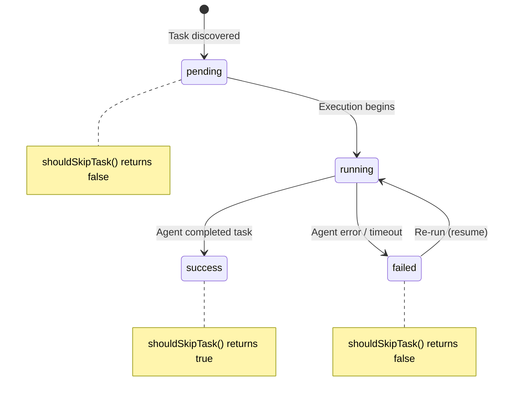
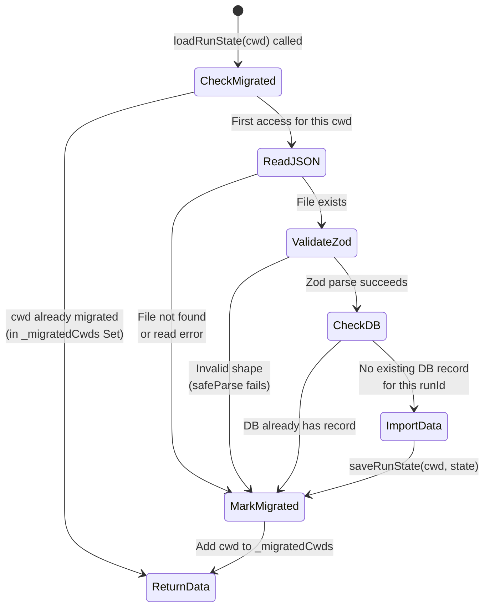

# Run State Persistence

The run-state module (`src/helpers/run-state.ts`, 173 lines) provides a
persistence layer for tracking task execution status across Dispatch runs.
It stores data in the SQLite database managed by `src/mcp/state/database.ts`
and uses Zod for runtime schema validation. The module enables a "resume"
capability where a re-run of Dispatch skips tasks that already completed
successfully in a previous run.

## What it does

The module exports four functions that form its public API:

| Function | Signature | Purpose |
|----------|-----------|---------|
| `loadRunState` | `(cwd: string) => Promise<RunState \| null>` | Load the most recent run state from SQLite |
| `saveRunState` | `(cwd: string, state: RunState) => void` | Persist a run state to SQLite (transactional upsert) |
| `buildTaskId` | `(task: Task) => string` | Construct a task identifier from a parsed `Task` object |
| `shouldSkipTask` | `(taskId: string, state: RunState \| null) => boolean` | Determine if a task should be skipped during resume |

## Data model

### RunState (validated by Zod)

Both types derive from Zod schemas, making the schemas the single source of
truth for the shape:

**RunStateTask**:

| Field | Type | Zod Schema | Description |
|-------|------|------------|-------------|
| `id` | `string` | `z.string()` | Unique identifier in the format `<filename>:<line>` |
| `status` | `"pending" \| "running" \| "success" \| "failed"` | `z.enum(["pending", "running", "success", "failed"])` | Current lifecycle state |
| `branch` | `string?` | `z.string().optional()` | Optional branch name associated with the task |

**RunState**:

| Field | Type | Zod Schema | Description |
|-------|------|------------|-------------|
| `runId` | `string` | `z.string()` | Unique identifier for this run |
| `preRunSha` | `string` | `z.string()` | Git commit SHA at the start of the run |
| `tasks` | `RunStateTask[]` | `z.array(RunStateTaskSchema)` | Array of all tasks and their statuses |

### SQLite schema

The module creates two tables in the shared SQLite database (idempotent via
`CREATE TABLE IF NOT EXISTS`):

```sql
CREATE TABLE IF NOT EXISTS run_state (
    run_id      TEXT PRIMARY KEY,
    pre_run_sha TEXT NOT NULL DEFAULT '',
    updated_at  INTEGER NOT NULL
);

CREATE TABLE IF NOT EXISTS run_state_tasks (
    run_id  TEXT NOT NULL,
    task_id TEXT NOT NULL,
    status  TEXT NOT NULL DEFAULT 'pending',
    branch  TEXT,
    PRIMARY KEY (run_id, task_id),
    FOREIGN KEY (run_id) REFERENCES run_state(run_id)
);
```

These tables are separate from the `runs` and `tasks` tables in the MCP state
database schema (`src/mcp/state/database.ts`). The MCP tables track richer
operational metadata (task text, file, line, started/finished timestamps, error
messages), while `run_state`/`run_state_tasks` track the minimal information
needed for resume decisions.

## Task lifecycle state machine



Key semantics:

- **pending -> running**: The orchestrator picks up the task and starts an
  agent session.
- **running -> success**: The agent completes the task without error.
- **running -> failed**: The agent encounters an error, times out, or the
  process is interrupted.
- **failed -> running**: On a subsequent run, failed tasks are eligible for
  re-execution (they are not skipped).
- **success is terminal**: Once a task reaches `success`, `shouldSkipTask`
  returns `true` and the task is not re-executed. There is no mechanism to
  reset a successful task without directly editing the database.

## JSON-to-SQLite migration



The migration from the legacy JSON file (``.dispatch/run-state.json``) to
SQLite runs automatically on first access per working directory:

1. **Guard**: A `Set<string>` (`_migratedCwds`) tracks which working
   directories have already been migrated in this process. This prevents
   redundant migration attempts on subsequent calls.
2. **Read**: Attempts to read `.dispatch/run-state.json`.
3. **Validate**: Parses the JSON through `RunStateSchema.safeParse()`. If the
   shape does not match (malformed file), migration is skipped silently.
4. **Check for duplicates**: Queries the database for the `runId` from the
   JSON file. If a record already exists, the data was already imported
   (possibly by a previous run) and migration is skipped.
5. **Import**: Calls `saveRunState(cwd, state)` to write the JSON data into
   SQLite.
6. **Leave file in place**: The JSON file is **not** deleted after migration.
   This is a safety measure -- the file is simply ignored after the first
   successful import.

### Why Zod is used for migration validation

The migration reads arbitrary JSON from disk that may have been written by an
older version of Dispatch or manually edited. Zod's `safeParse` provides
type-safe validation without throwing: if the JSON does not match the expected
`RunState` shape, the migration is skipped cleanly rather than crashing.

Zod is also used at query time: when rows are loaded from SQLite, the `status`
column value is validated against `RunStateTaskStatusSchema.safeParse()`. If an
unrecognized status string is found in the database, it falls back to
`"pending"` rather than throwing. This defensive approach ensures that database
corruption or schema evolution does not crash the pipeline.

## Saving state (transactional upsert)

`saveRunState(cwd, state)` performs a transactional write:

1. Ensures the `.dispatch/` directory exists.
2. Ensures the `run_state` and `run_state_tasks` tables exist.
3. Opens the shared SQLite database via `openDatabase(cwd)`.
4. Wraps all writes in a `db.transaction()`:
   - Upserts the run record with `INSERT ... ON CONFLICT DO UPDATE`.
   - Upserts each task record with `INSERT ... ON CONFLICT DO UPDATE`.

The `better-sqlite3` transaction wrapping ensures that either all task status
updates are written or none are. This is a significant improvement over the
previous JSON file approach, which required an explicit atomic write-to-temp-
then-rename pattern.

The `updated_at` column stores `Date.now()` (Unix milliseconds) and is used
by `loadRunState` to select the most recent run via `ORDER BY updated_at DESC
LIMIT 1`.

## Loading state

`loadRunState(cwd)` performs three steps:

1. **Bootstrap**: Calls `ensureRunStateTable(cwd)` to create tables if needed.
2. **Migrate**: Calls `migrateFromJson(cwd)` to import any legacy JSON file
   (no-op after first access).
3. **Query**: Selects the most recent run by `updated_at` and loads all
   associated task rows.

Task status values are validated at runtime through Zod:

```typescript
const statusResult = RunStateTaskStatusSchema.safeParse(t.status);
return {
    id: t.task_id,
    status: statusResult.success ? statusResult.data : "pending" as const,
    branch: t.branch ?? undefined,
};
```

This means unrecognized status strings in the database are silently replaced
with `"pending"`, causing the task to be re-executed rather than causing a
crash.

## Task ID construction

`buildTaskId(task)` constructs a task identifier from a parsed `Task` object
(see [Task Parsing -- API Reference](../task-parsing/api-reference.md)):

```
<basename(task.file)>:<task.line>
```

For example, a task at line 5 of `path/to/tasks.md` produces the ID
`tasks.md:5`.

### Stability of task IDs

Task IDs depend on the **line number** of the checkbox in the source file. If
lines are inserted or deleted above a task between runs, the task's ID changes
and it will not match the stored state -- causing it to be re-executed even if
it previously succeeded. This is a known limitation of the current design.

Mitigations for production use could include:

- Content-based hashing of the task text
- Embedding stable identifiers in the markdown (e.g., `<!-- id: xyz -->`)
- Fuzzy matching on task text when line numbers shift

None of these are currently implemented.

## Skip logic

`shouldSkipTask(taskId, state)` determines whether a task should be skipped
during a resume run:

1. If `state` is `null` (no previous state), returns `false` -- all tasks
   execute.
2. If no entry matches `taskId` in the `tasks` array, returns `false` -- new
   tasks are not skipped.
3. If the matching entry has `status === "success"`, returns `true` -- the task
   is skipped.
4. For any other status (`pending`, `running`, `failed`), returns `false` --
   the task is re-executed.

The `running` status in a loaded state indicates a task that was in progress
when the previous run was interrupted. These tasks are **not** skipped because
their execution did not complete.

## Database connection management

The module uses a lazy import to obtain the database connection:

```typescript
async function getDb(cwd: string) {
    const { openDatabase } = await import("../mcp/state/database.js");
    return openDatabase(cwd);
}
```

The dynamic `import()` is deliberate: it avoids circular dependency issues at
module initialization time. The `openDatabase` function in
`src/mcp/state/database.ts` manages a singleton `better-sqlite3` connection,
so all calls to `getDb(cwd)` within the same process return the same database
handle. The database is stored at `{cwd}/.dispatch/dispatch.db` and is
configured with:

- `journal_mode = WAL` (write-ahead logging for concurrent reads)
- `synchronous = NORMAL` (balance between safety and performance)
- `foreign_keys = ON` (enforce the foreign key from `run_state_tasks` to
  `run_state`)

## Relationship to preRunSha

The `preRunSha` field records the git commit SHA at the start of a run. This
enables a future implementation to detect whether the repository has changed
between runs:

- If the current HEAD matches `preRunSha`, the codebase is unchanged and resume
  is safe.
- If the current HEAD differs, tasks may need re-execution because the code
  they were based on has changed.

This check is not currently implemented. The field is stored but not read back
by any decision logic.

## Related documentation

- [Overview](./overview.md) -- Group-level summary and design decisions
- [Worktree Management](./worktree-management.md) -- The worktree lifecycle that
  run-state is designed to complement
- [Authentication](./authentication.md) -- Pre-pipeline auth that runs before
  state is loaded
- [Integrations](./integrations.md) -- SQLite via better-sqlite3 and Zod
  schema validation details
- [Task Parsing -- API Reference](../task-parsing/api-reference.md) -- The `Task`
  interface whose `file` and `line` fields are used by `buildTaskId`
- [MCP Server](../mcp-server/) -- The MCP server whose SQLite database is
  shared by the run-state module
- [Orchestrator](../cli-orchestration/orchestrator.md) -- The dispatch pipeline
  that consumes run-state for resume decisions
- [Dispatcher](../planning-and-dispatch/dispatcher.md) -- The execution phase
  whose task results drive state transitions
